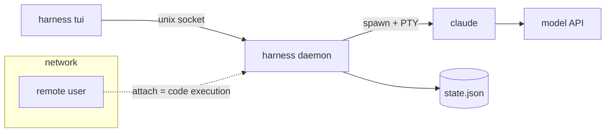
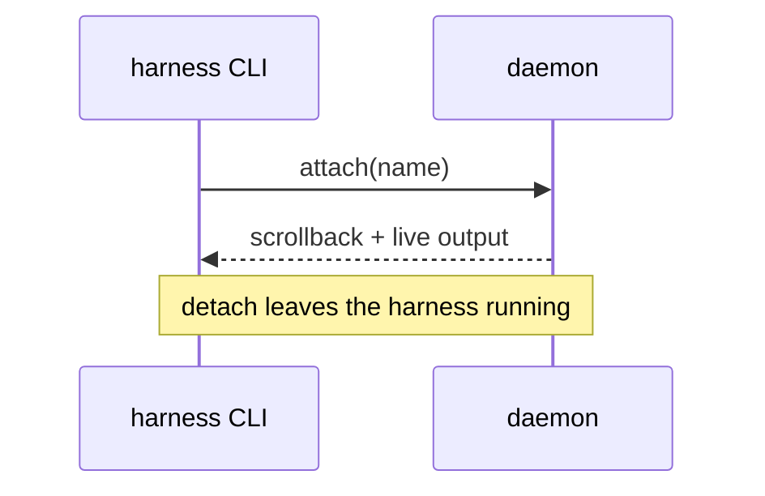

# Diagrams

Diagrams in `docs/` (ADRs, specs, guides) are Mermaid. The site owns their
colors: authors tag each node with a **role**, and `src/css/custom.css`
("Mermaid diagrams") colors that role from the site's tokens, in light and
dark mode alike.

## Rules

- Tag nodes with Mermaid's class shorthand, `id["label"]:::role`, and nothing
  else. No `classDef`, no `style`, no `linkStyle`, no `%%{init}%%` theme
  overrides. They pin one color scheme and break the other.
- `:::role` works **without** a `classDef`. Mermaid puts the class on the
  node either way.
- Leave a node untagged when no role fits. It gets the neutral default.
- Keep diagrams small. Prefer `flowchart LR` / `flowchart TB` and
  `sequenceDiagram`. Split a diagram that needs more than about 12 nodes.
- Readers can zoom (toolbar, Ctrl/Cmd + scroll, pinch) and open any diagram
  full-window with **Expand**. Even so, a diagram that is only legible
  expanded is too big.

## Roles

| Role | Color | Use for |
|---|---|---|
| `client` | cyan | TUI, CLI, a remote user's session |
| `daemon` | purple | the harness daemon and its internals (supervisor, observer, store API) |
| `agent` | mint | supervised harness processes, agent CLIs (claude, crush, codex) |
| `store` | gold | files, databases, logs (`state.json`, SQLite, JSONL) |
| `external` | grey, dashed | third-party services: forges, Switchboard, Cairn, model APIs, init systems |
| `danger` | coral | trust boundaries, failure paths, anything that must not happen |

A subgraph takes a role with the `class` statement, for example a trust
boundary: `class remote danger`. That draws the boundary dashed in the role's
color. A `class` statement is fine; `classDef` is not.

## Example

Sequence diagrams take no roles. The site styles actors, messages, notes and
loops for both modes:

## Where this lives

- Colors and role classes: `src/css/custom.css`, section "Mermaid diagrams".
- Base Mermaid theme per color mode, font, and layout defaults:
  `themeConfig.mermaid` in `docusaurus.config.ts`.
- Pan, zoom, Expand, deferred loading: `src/theme/Mermaid/index.tsx`.
