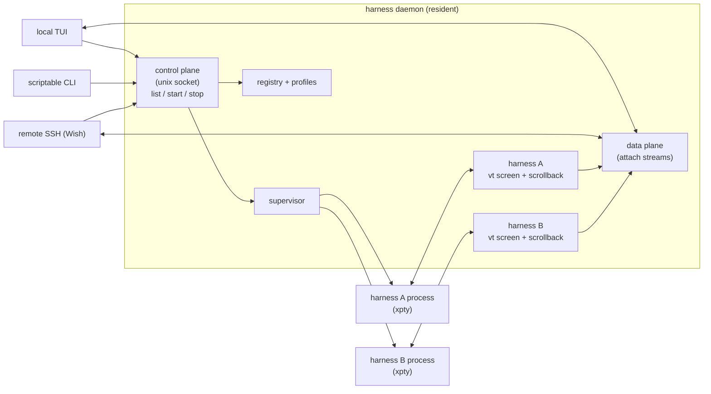

# ADR-0002: Process model — long-lived daemon + thin TUI client

## Context and Problem Statement

The product is explicitly *"a little daemon that runs and you can hop into
different configurations of AI harnesses."* The predecessor had no daemon of its
own — tmux was the resident process, systemd/launchd supervised `harness-run`, and
the zsh function was a stateless client that shelled out. To get a real
dashboard, remote attach, scrollback that survives, and start/stop that doesn't
depend on a shell being open, we need to decide *where the long-lived state lives*.

## Decision Drivers

* Harnesses must outlive any client — close the laptop lid, the agents keep
  running; reconnect later and everything's still there.
* One authoritative place that knows every harness's state (running/attached/
  crashed), owns every PTY, and owns scrollback.
* Multiple clients: local TUI, scriptable CLI, remote SSH session — possibly
  concurrently, possibly attached to the same harness.
* Keep the client cheap to start and cheap to kill (it's just a viewport onto the
  daemon's truth).

## Considered Options

* Option 1 — Long-lived daemon owns everything; clients are thin views (the
  classic `tmux server` / `dockerd` / `sshd` shape)
* Option 2 — No daemon; client drives tmux directly (the predecessor's model,
  dressed up)
* Option 3 — Daemon-per-profile (one supervisor process per "configuration")

## Decision Outcome

Chosen option: **Option 1 — Long-lived daemon owns everything; clients are thin
views**, because it is the only shape in which harnesses survive client churn
and one process holds the authoritative state.

### Responsibilities

**The daemon (`harness daemon`) owns:**

* The **harness registry** — parsed config + live state for every harness.
* **Supervision** — spawns each harness under a PTY, runs the restart loop,
  tracks exit codes, applies `restart_delay` (ADR-0005).
* **PTYs & terminal emulation** — one `x/xpty` master + one `x/vt` emulator per
  running harness; the emulator maintains screen + scrollback (ADR-0003,
  ADR-0007).
* **The control plane** — a Unix-domain socket serving list/start/stop/status/
  attach RPCs (ADR-0004, SPEC-0002).
* **The data plane** — bidirectional attach streams (bytes in from a client's
  keyboard → PTY; bytes out from PTY → all attached clients).
* **Profiles** — which "configuration" of harnesses is active (ADR-0006).

**The client (TUI or CLI) owns:** nothing durable. It connects, subscribes to
state, renders, forwards keystrokes when attached, and can die at any moment
without affecting a single harness.

### Why "hop between" works cleanly

Because the daemon is the terminal emulator, "attach" is not "take over a PTY" —
it's "subscribe to a screen." N clients can attach to the same harness and all
see the same live output; detaching is just closing the subscription. Switching
harnesses in the TUI is switching which subscription is on screen. The harness
never notices. This is the property tmux gives us via its server, made native and
ours.

### Fan-out / fan-in

### Consequences

* Good, because harnesses survive client churn, logout, and network drops — the
  core promise.
* Good, because there is a single source of truth; no reconciliation between
  "what tmux thinks" and "what the UI thinks."
* Good, because concurrent + shared attach falls out naturally (subscribe to a
  screen).
* Good, because it is a clean seam for remote: a remote SSH session is just
  another thin client (ADR-0004).
* Bad, because we now own a daemon lifecycle: start-on-login, crash recovery of
  the daemon itself, versioning between client and daemon (protocol
  compatibility). ADR-0005 and SPEC-0002 address these.
* Bad, because if the daemon crashes, *all* harnesses die with it (unlike the
  predecessor, where each harness was an independent systemd unit). Mitigations:
  keep the daemon tiny and well-tested; let systemd/launchd restart it; consider
  optionally re-parenting harnesses to a per-harness reaper. ADR-0005 treats this
  as a real risk.

### Confirmation

* `harness daemon` is the only process that spawns harnesses or opens PTYs;
  every other `harness` verb is a client of the socket (SPEC-0002).
* Killing a client (TUI, CLI, or SSH session) leaves every harness's state
  unchanged; a second client attached to the same harness sees the same screen.

## Pros and Cons of the Options

### Option 1 — Long-lived daemon, thin clients

* Good, because state, PTYs, and scrollback have one owner that outlives clients.
* Good, because shared and concurrent attach are subscriptions, not PTY handoffs.
* Bad, because the daemon becomes a single point of failure for every harness.

### Option 2 — No daemon (drive tmux)

* Good, because it reuses the predecessor's working model.
* Bad, because it can't own scrollback/state independent of tmux, can't do a real
  network protocol, and forever inherits tmux's model instead of ours. This is
  precisely what we're graduating from.

### Option 3 — Daemon-per-profile

* Good, because a crash is scoped to one profile's harnesses.
* Bad, because it multiplies the supervision/lifecycle problem by the number of
  profiles for no real gain; a single daemon can hold many profiles (ADR-0006).
  Rejected as premature.

## More Information

* **Related ADR-0003** — what the daemon does per harness.
* **Related ADR-0004** — how clients reach it.
* **Related ADR-0005** — who supervises the daemon.
* **Related ADR-0007** — scrollback ownership.
