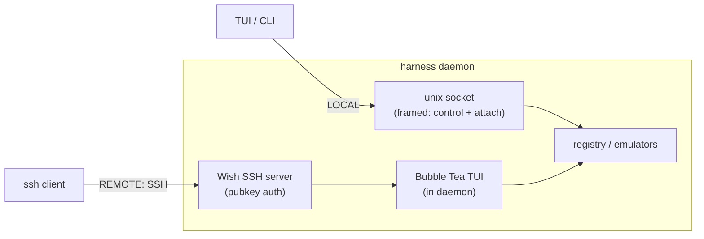

# ADR-0004: Transport — Unix-socket control plane + Wish/SSH data plane

## Context and Problem Statement

Clients (local TUI, scriptable CLI, remote sessions) need to reach the daemon for
two very different kinds of traffic:

1. **Control plane** — request/response RPCs: list harnesses, start/stop/restart,
   subscribe to state changes, read config. Small, structured, latency-tolerant.
2. **Data plane** — attach: a high-throughput, bidirectional, byte-oriented stream
   (keystrokes in, terminal output out) that must feel instant.

And a headline requirement: *hop into harnesses from anywhere*, including a phone
or another machine — the predecessor's README already leans on "drive Claude Code
remotely." So **remote access is in scope**, and it should be secure without us
inventing auth.

## Decision Drivers

* Local attach must be **zero-latency-feeling** and need no network config.
* Remote attach must be **secure by default** and reuse credentials people already
  have (SSH keys), not a bespoke auth system.
* Don't build two entire UIs — the remote experience should be the *same* TUI.
* Keep the local common case dependency-light (no need to run an SSH server just
  to attach to your own laptop).

## Considered Options

* Option 1 — Everything over one Unix domain socket (control + attach); remote is
  "SSH into the box and run the client there"
* Option 2 — gRPC over TCP for everything, with our own TLS + token auth
* Option 3 — Unix socket for control + data locally, and Wish (SSH) as a remote
  front door that runs the same TUI server-side and talks to the daemon over the
  local socket
* Option 4 — Custom TCP protocol for both, hand-rolled framing + auth

## Decision Outcome

Chosen option: **Option 3 — Unix socket locally, Wish (SSH) as the remote front
door**, because the control/data traffic wants a local socket (fast, simple,
OS-enforced perms) while remote wants auth + transport we don't have to build.

* **Locally**, the daemon listens on a **Unix domain socket**
  (`$XDG_RUNTIME_DIR/harness.sock`, `0600`). Both the control RPCs and the attach
  byte-stream ride this socket (multiplexed by a small framed protocol — see the
  daemon protocol specification, SPEC-0002). No network, no TLS, no ports;
  filesystem permissions are the access control. This is the fast, common path.

* **Remotely**, the daemon (optionally) runs a **[Wish](https://github.com/charmbracelet/wish)
  SSH server**. An incoming SSH session is handed a **Bubble Tea program — the
  same TUI** — running *inside the daemon process*, which talks to its own registry
  and emulators directly (or over the local socket). Wish wires the SSH PTY and
  resize events straight into that Bubble Tea program. So:
  * `ssh harness.host` → you're in the dashboard, attaching to harnesses, exactly
    as if you were local.
  * **Auth is SSH public keys** — an `authorized_keys`-style allowlist in daemon
    config. No new credential system, no passwords in our code.
  * It's *not* a shell: Wish apps expose only the TUI, so a client can never get a
    shell on the host through this door (beyond what attaching to a harness's own
    terminal inherently allows — see ADR-0008).

### Many hosts: `wishlist` as the directory

The remote story naturally extends to *multiple* machines each running a Harness
daemon. [`wishlist`](https://github.com/charmbracelet/wishlist) ("the SSH
directory") is a Charm-native menu of SSH endpoints — so a single launcher can
list every box's daemon and let you hop across hosts, which is the literal
"hop into harnesses **anywhere**" promise at the fleet level. v1 targets a single
daemon; wishlist is the sketched path to multi-host without new protocol work.
[`promwish`](https://github.com/charmbracelet/promwish) (Prometheus middleware for
Wish) can expose attach/session metrics into the operator's existing monitoring.
Both are listed as later or reference-only in the
[Charm ecosystem map](../usage/charm-ecosystem-map.md), not v1 commitments.
[`soft-serve`](https://github.com/charmbracelet/soft-serve) is the reference for
how a real Wish-based multi-user SSH TUI daemon does auth + access levels — worth
reading before we build ours.

### Why this split

Wish gives us remote **and** reuses the *same TUI code* (ADR-0001 and ADR-0003
make the TUI render a `vt` screen the daemon already owns), so remote isn't a
second product. The two planes meet at the daemon, not at the wire.

### Protocol shape

A summary; the daemon protocol specification (SPEC-0002) has the full detail.

* One framed, length-prefixed message protocol over the Unix socket.
* Two channel types: **control** (JSON request/response + a state-change
  subscription) and **attach** (opaque binary frames, one logical stream per
  attached harness, tagged with a session id).
* Versioned handshake so client and daemon can refuse/inform on mismatch.

### Consequences

* Good, because the local path is fast and dependency-free; perms are the OS's job.
* Good, because remote is secure-by-default via SSH keys and adds **zero** new
  auth code.
* Good, because remote and local share one TUI — no second surface to design or
  maintain.
* Good, because Wish guarantees no incidental shell access.
* Bad, because there are two listeners to manage (socket always; SSH
  optional/opt-in): SSH host key management, `authorized_keys` config, and a
  listen port to expose.
* Bad, because running the TUI *inside* the daemon for SSH sessions means the
  daemon links the UI code — the "thin client" is thin for local use but the
  daemon is fatter. (Acceptable: it's the same binary anyway per ADR-0001.)
* Bad, because attach throughput over the socket must be tuned (framing overhead,
  backpressure when a slow client can't keep up) — SPEC-0002 defines a
  drop/coalesce policy so one slow client can't stall a harness.

### Confirmation

* The daemon listens on `$XDG_RUNTIME_DIR/harness.sock` with mode `0600`, and
  every local verb (including attach) uses it.
* With `[server] listen` set, `ssh -p <port> <host>` from a key in the configured
  allowlist lands in the TUI, and never in a shell; a key outside it is refused.

## Pros and Cons of the Options

### Option 1 — Unix socket only; remote = SSH in and run the client there

* Good, because it is the least code.
* Bad, because the remote client would try to open *its own* local socket on the
  remote box; you'd be attaching to the wrong daemon. It doesn't actually give
  remote access to *your* harnesses without extra plumbing. Wish solves this
  directly.

### Option 2 — gRPC over TCP with our own TLS + token auth

* Good, because it is a well-understood RPC stack with streaming.
* Bad, because it reinvents transport security we get free from SSH, and still
  leaves us building the remote UI story. More code, more attack surface, weaker
  default security.

### Option 3 — Unix socket locally, Wish (SSH) as the remote front door

* Good, because the local path needs no network configuration.
* Good, because remote reuses SSH keys and the same TUI.
* Bad, because the daemon carries two listeners and links the UI code.

### Option 4 — Custom TCP protocol with hand-rolled framing + auth

* Good, because it is fully under our control.
* Bad, because, like Option 2, it reinvents transport security we get free from
  SSH and leaves the remote UI unsolved.

## More Information

* **Extends ADR-0002** — clients are thin views.
* **Related ADR-0003** — remote renders the same `vt` screen.
* **Related ADR-0008** — SSH keys, socket perms, secrets.
* **Governs SPEC-0002** — the daemon protocol.
