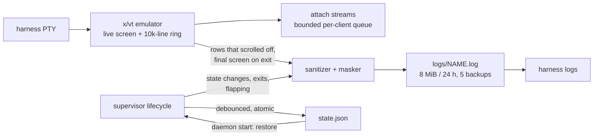

# ADR-0007: State and scrollback ownership

## Context and Problem Statement

With the daemon owning the terminal emulator (ADR-0003), it also owns two
things that used to belong to tmux and the init system's journal:

1. **Scrollback**: the recent output of each harness, so a client can attach
   and see history, scroll up, and search.
2. **Runtime state**: which harnesses are enabled, which profile is active,
   last exit codes, restart counts. The daemon needs these to restore itself
   after a restart (ADR-0005) and to render the dashboard.

Where does each live, and how much of it survives a daemon restart?

## Decision Drivers

* Attach must show recent history instantly, and survive a *client* detach and
  reconnect with no gaps, since the daemon keeps running.
* `harness logs <name>` must work without a live attach, including for a
  harness that has since crashed.
* A *daemon* restart must not lose the world: enabled harnesses come back, and
  recent logs do not vanish.
* Memory must stay bounded under long-running, chatty agents.
* The durable log must be readable. A full-screen agent TUI repaints its screen
  many times a second; a byte-for-byte copy of that stream is escape codes, not
  history.
* Secrets must never land in persisted state (ADR-0008).

## Considered Options

This ADR settles two independent questions.

### Decision 1 — Where scrollback lives

* **Option 1 — In-memory ring buffer only.**
* **Option 2 — In-memory ring buffer plus a sanitized, rotating log file per
  harness.**
* **Option 3 — A full persistent event store** of every byte and event.

### Decision 2 — Where runtime state lives

* **Option 1 — In memory only.**
* **Option 2 — A small state file the daemon writes.**

## Decision Outcome

Decision 1: chosen option **Option 2 — ring buffer plus a sanitized rotating
log**, because the ring is the fast path for attach and the log is the only
thing that survives a crash or a daemon restart.

Decision 2: chosen option **Option 2 — a small persisted state file**, because
restoring the intended running set after a restart is what ADR-0005 requires.

### Scrollback, per harness

* The `x/vt` emulator keeps the **live screen and a bounded scrollback ring**
  (10,000 lines by default; `[daemon] scrollback` or `HARNESS_SCROLLBACK`
  changes it). The ring backs attach, in-TUI scroll and search. It lives in
  memory.
* **In parallel**, the daemon writes a **rotating, sanitized log** per harness
  at `$XDG_STATE_HOME/harness/logs/<name>.log` (falling back to
  `~/.local/state/harness/logs/<name>.log`). A project harness's namespaced name
  puts its log one directory down (`logs/<project>/<name>.log`). The file
  rotates at 8 MiB or 24 hours and keeps five backups. It backs
  `harness logs <name>` for live and dead harnesses alike, uniformly across
  platforms.
* **The durable log is line-oriented text, not a byte tee**. It
  receives the screen rows that actually scrolled off the emulator (a spinner
  that repaints in place produces nothing), a final-screen flush when the
  stream ends, and structured lifecycle events (state changes, exits,
  flapping) written with `charmbracelet/log`. Credential-shaped spans are
  masked before they reach the file (ADR-0008). The raw byte stream feeds only
  the in-memory ring and live attaches, which need it to repaint.
* On **attach**, a client gets a screen snapshot and a tail of scrollback, then
  the live stream. On **detach**, nothing is lost: the daemon kept reading the
  PTY the whole time.
* **Backpressure.** The PTY reader never blocks on a slow client. Output always
  reaches the ring and the log; each client's attach stream has a bounded
  queue, and a client that cannot keep up has frames coalesced or dropped for
  that client only, then repaints from the current screen. One slow SSH client
  cannot stall a harness. The daemon protocol specification (SPEC-0002) holds
  the detail.

### Runtime state, daemon-wide

One state file, `$XDG_STATE_HOME/harness/state.json` (fallback
`~/.local/state/harness/state.json`), holds:

* per harness: enabled or disabled intent, last exit code, restart count,
  flapping status, and created and last-started timestamps;
* the active profile.

It is written on transitions (debounced), atomically (write a temporary file,
then rename), and carries a schema version so a later daemon can migrate rather
than misread it. It is read at daemon start to **restore the world**: reopen log
files, restart the harnesses that should be running (ADR-0005), and reselect the
active profile. Later decisions add their own keys to the same file, such as
project registrations (ADR-0009), schedule positions and run history
(ADR-0013), and after-hours leases (ADR-0019).

**Config is not duplicated here.** The TOML is the source of truth for
configuration (ADR-0006); this file is runtime state only. TOML is intent;
`state.json` is what actually happened.

### What does not persist

* The live PTY and emulator screen across a **daemon** restart. Running
  processes are restarted fresh (ADR-0005); their live screen is gone, and the
  log file keeps the history.
* Secrets. `env_file` contents are loaded into the child's environment at spawn
  and are never copied into scrollback exports, `state.json`, or the logs the
  daemon writes (ADR-0008). A program that prints its own secret is covered only
  by best-effort masking.

### Consequences

* Good, because attach, detach and reattach are lossless while the daemon
  lives, and history is instant.
* Good, because `harness logs` works for live and dead harnesses on every
  platform.
* Good, because the durable log reads as a transcript of what scrolled past,
  not as a stream of repaint frames.
* Good, because a daemon restart restores the intended running set and keeps
  log history.
* Good, because memory (the ring) and disk (rotation) are both bounded.
* Good, because the intent/state split keeps the config file hand-editable and
  git-friendly (ADR-0006).
* Bad, because logs cost disk, bounded by rotation to six files per harness.
  There is no per-harness switch to turn the durable log off.
* Bad, because `state.json` is a second persistence concern, with its own
  atomic-write and schema-version discipline, and every feature that adds a key
  to it must keep older files loadable.
* Bad, because a secret a harnessed program prints can reach the log in a shape
  the masker does not recognize; the daemon controls what it writes, not what
  the child prints.
* Neutral, because the durable log is not the live screen. A full-screen TUI's
  final frame is flushed when the stream ends, but repaint-in-place content
  never appears in it; attach is the way to see a TUI.

### Confirmation

* Rotation tests pin rotation by size and age, backup pruning that never
  touches a sibling harness, and the project-namespaced log path.
* Sanitizer tests pin the sanitized-log behavior: a repaint-in-place stream writes no
  lines and no escape codes, printed rows land verbatim, the final screen is
  flushed once, lifecycle events are recorded, and credentials are masked
  before the row reaches disk.
* Manager tests pin that intent persists and restores across a restart, and
  that a malformed `state.json` is kept and reported rather than overwritten.
* Run-history tests pin that no `env_file` value reaches `state.json` or a run
  record (ADR-0013).

## Pros and Cons of the Options

### Decision 1, Option 1 — Ring buffer only

* Good, because it is the least code and costs no disk.
* Bad, because `harness logs` has nothing to show after a crash or a daemon
  restart.
* Bad, because there is no durable record at all, a regression from the log
  files and journal that the init system kept.

### Decision 1, Option 2 — Ring buffer plus a sanitized rotating log

* Good, because attach stays in memory and fast, and the log survives crashes
  and restarts.
* Good, because sanitizing at write time makes the log readable for agent TUIs.
* Bad, because the log is a lossy view: it records what scrolled, not every
  frame.

### Decision 1, Option 3 — Full persistent event store

* Good, because it could replay a session exactly.
* Bad, because it stores every repaint frame, which is large and unreadable
  without a replayer.
* Bad, because session replay is not a feature Harness offers, so the cost buys
  nothing.

### Decision 2, Option 1 — Runtime state in memory only

* Good, because there is no file format to maintain.
* Bad, because a daemon restart forgets what should be running, which defeats
  ADR-0005's restore.

### Decision 2, Option 2 — A persisted state file

* Good, because a restart restores intent, counters and the active profile.
* Good, because keeping it separate from the TOML keeps configuration
  hand-authored.
* Bad, because it is one more file whose writes must be atomic and whose schema
  must evolve compatibly.

## Architecture Diagram

## More Information

* **Extends ADR-0003** — the emulator the daemon owns is what holds the ring.
* **Related ADR-0002** — the daemon, not the client, holds state.
* **Related ADR-0005** — `state.json` is what restore-on-restart reads.
* **Related ADR-0006** — configuration stays in the TOML, never in
  `state.json`.
* **Related ADR-0008** — what must never persist, and the masking of
  credential-shaped spans in the durable log.
* **Related ADR-0013** — scheduled runs write a log per run beside this one, at
  `$XDG_STATE_HOME/harness/jobs/<name>/<run id>.log`, with the same sanitized
  text.
* **Governs SPEC-0002** (attach snapshot and backpressure), **SPEC-0003**
  (restore and lifecycle events), and **SPEC-0001** (scrollback in the TUI).
