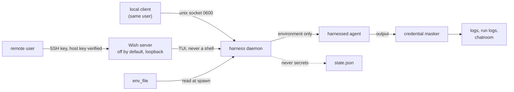

# ADR-0008: Security, authentication and secrets

## Context and Problem Statement

The daemon spawns arbitrary commands, holds live terminals into agent CLIs
running with broad permissions (`--dangerously-skip-permissions`, `--yolo`),
and can be attached to over the network (ADR-0004). That makes it a valuable
target. It needs a security model that is strong by default without inventing
cryptography, and a secrets story at least as safe as a plain `env_file`.

## Decision Drivers

* Local access control with no configuration: safe out of the box.
* Remote access authenticated and auditable, reusing credentials operators
  already manage.
* Secrets (API keys in `env_file`) must not leak into daemon state, logs the
  daemon writes, scrollback exports, or protocol frames.
* The daemon's power (spawn and attach) must not be reachable by other local
  users or unauthenticated network peers.
* No home-grown authentication or cryptography.

## Considered Options

This ADR settles three questions.

### Decision 1 — Local access control

* **Option 1 — Filesystem permissions on a per-user unix socket.**
* **Option 2 — A token the daemon issues and every local client presents.**

### Decision 2 — Remote access

* **Option 1 — SSH public keys through a Wish server, off by default.**
* **Option 2 — A Harness-designed scheme (passwords or bearer tokens) over
  TCP.**
* **Option 3 — No remote access; operators SSH to the host and run the
  client there.**

### Decision 3 — Secrets

* **Option 1 — Secrets stay in `env_file`, loaded into the child at spawn.**
* **Option 2 — The daemon integrates with a secret backend (Vault, OpenBao,
  a keychain) and fetches secrets itself.**

## Decision Outcome

Decision 1: chosen option **Option 1 — filesystem permissions**, because the
operating system already enforces them and they need no configuration.

Decision 2: chosen option **Option 1 — SSH public keys through Wish**, because
it reuses keys operators already manage, gives real host-key verification, and
requires no authentication code of our own.

Decision 3: chosen option **Option 1 — secrets stay in `env_file`**, because it
keeps the daemon ignorant of any secret backend and never widens where a secret
lives.

### Local access: filesystem permissions

* The control and attach socket is `$XDG_RUNTIME_DIR/harness.sock`, mode
  **0600**, owned by the user. Without a per-user runtime directory it falls
  back to `$XDG_STATE_HOME/harness/harness.sock` (or
  `~/.local/state/harness/harness.sock`) inside a directory created **0700**.
  Only the owning user can talk to the daemon; locally, no authentication beyond
  file permissions is needed. This is the trust model of a tmux socket.
* State and log files under `$XDG_STATE_HOME/harness/` are 0600, in 0700
  directories.

### Remote access: SSH public keys through Wish, opt-in

* The Wish SSH server is **off by default**. Enabling it is a deliberate
  configuration step: `[server] enabled`, a bind address, and an allowlist of
  keys.
* **Authentication is SSH public keys only**: `[server] authorized_keys`, an
  `authorized_keys_file`, or `[[server.key]]` tables. No passwords, no bearer
  tokens of Harness's design.
* The daemon has a **stable host key**, generated on first run with
  [keygen](https://github.com/charmbracelet/keygen) and stored 0600, so clients
  get real host-key verification rather than blind trust on first use. The key
  can be backed up as seed words with
  [melt](https://github.com/charmbracelet/melt) so a reprovisioned host keeps
  its identity.
* Wish apps are **not shells**: a remote peer gets the TUI, not `/bin/sh`.
* **Bind narrowly by default** (loopback, `127.0.0.1:2222`). Exposing the
  server wants a firewall or, better, a Tailscale, WireGuard or SSH tunnel
  rather than the public internet.
* **Per-key scoping**: a `[[server.key]]` entry with `read_only = true` may
  only open read-only attaches.

### The irreducible risk: attach is terminal access

Attaching to a harness *is* getting that harness's terminal, and many
harnesses are agent CLIs running with permission prompts disabled. **Anyone
who can attach can drive the agent.** That is inherent to the product.

* "Can attach to this daemon" is treated as "can act as these agents". The
  socket (local permissions) and the key allowlist (remote) are guarded
  accordingly.
* **Read-only attach** streams output and discards input, for watching an agent
  work without handing over the keyboard: `harness attach --ro` locally, and
  enforced for read-only keys remotely.

### Secrets

* Secrets stay **in `env_file`**, loaded into the child process's environment
  at spawn. The daemon reads the file, sets the child environment, and does not
  keep the values in its long-lived state.
* **Nothing the daemon persists carries a secret it was given**: `state.json`,
  the rotating logs, run records, scrollback exports and protocol frames never
  include `env_file` contents.
* **Secrets a harnessed program prints are masked, best-effort**.
  These are the secrets that actually reach logs: an agent runs `git remote
  set-url` with a token in the URL, or `curl -H "Authorization: …"`, and the
  command text lands in the log verbatim. The daemon cannot stop a program
  printing them, but it masks credential-shaped spans at write time, so they do
  not reach the file, and again at read time, which covers logs written before
  the masker existed. Masking applies to the durable log, run logs and the
  chatroom. It is defence in depth for display and storage, not a guarantee: the
  matcher is deliberately conservative, a secret in an unrecognized shape passes
  through, and a credential split across two screen rows (a long command
  soft-wrapped at the terminal width) is recognized in neither half. Live attach
  is not masked, since it needs the raw byte stream (ADR-0003).
* The `env_file` path and its permissions are the operator's responsibility.
  Harness warns when a credential file the daemon itself reads (a metrics
  token, a telemetry or trigger-source `env_file`) is group- or
  world-readable.
* `env_file` composes with any secret manager that renders a file: an operator
  whose secrets live in Vault or OpenBao points `env_file` at the rendered file,
  and the daemon never learns the backend exists.

### Consequences

* Good, because local access is zero-configuration, enforced by the operating
  system, and matches the tmux trust model.
* Good, because remote access is authenticated by SSH keys with host-key
  verification, opt-in, not a shell, and needs no authentication code of our
  own.
* Good, because secret handling is no worse than a plain `env_file` and is
  fenced out of everything the daemon persists.
* Good, because read-only attach and read-only keys give a real least-privilege
  option for watching agents.
* Bad, because the daemon is a high-value target by nature, and a socket or
  key-allowlist misconfiguration is serious. Safe defaults (remote off, loopback
  bind, 0600 socket) mitigate it.
* Bad, because the remote path inherits SSH host-key and `authorized_keys`
  management, which is documented rather than automated.
* Bad, because a harnessed program can still leak its own secrets into its own
  output; masking narrows that, and does not close it.

### Confirmation

* Socket tests pin mode 0600 on the listening socket.
* Remote tests pin that an empty key allowlist refuses to start, that the host
  key is persisted 0600, that an authorized key lands in the TUI rather than a
  shell, and that `read_only` is parsed per key.
* Redaction tests pin masking of common credential shapes and of private-key
  bodies, and that ordinary commands pass untouched. Masking is pinned at write
  time (the sanitizer, before a row reaches disk) and at read time (`harness
  logs` and run-log tails).
* Run-history tests pin that no `env_file` value reaches `state.json` or a run
  record.

## Pros and Cons of the Options

### Decision 1, Option 1 — Filesystem permissions

* Good, because the operating system enforces it and it needs no setup.
* Good, because it is the model operators already trust for tmux.
* Bad, because it is all-or-nothing per user: any process running as the
  operator can drive every harness.

### Decision 1, Option 2 — A daemon-issued local token

* Good, because a client without the token is refused even as the same user.
* Bad, because the token must live in a file readable by the user, so it adds
  ceremony without adding a boundary.

### Decision 2, Option 1 — SSH keys through Wish

* Good, because keys, `authorized_keys` and host-key verification are
  established and audited.
* Good, because Wish serves the TUI, not a shell.
* Bad, because key and host-key management is the operator's job.

### Decision 2, Option 2 — A Harness-designed scheme over TCP

* Good, because it could be tailored to Harness's operations.
* Bad, because it is authentication code of our own, the thing this ADR set
  out not to write.
* Bad, because passwords and bearer tokens need storage, rotation and transport
  security that SSH already provides.

### Decision 2, Option 3 — No remote access

* Good, because it has no network attack surface at all.
* Bad, because watching and hopping between agents from another machine is a
  core use (ADR-0004).

### Decision 3, Option 1 — Secrets in `env_file`

* Good, because it changes nothing about where secrets live.
* Good, because the daemon never needs credentials for a secret backend.
* Bad, because the file's permissions are the operator's responsibility.

### Decision 3, Option 2 — Daemon-integrated secret backend

* Good, because secrets would never touch disk as plain files.
* Bad, because the daemon would hold a credential for the backend, making it a
  bigger target.
* Bad, because every backend is a new integration, and the daemon stops being
  agnostic about its environment.

## Architecture Diagram

## More Information

* **Extends ADR-0004** — the Wish transport this ADR authenticates.
* **Related ADR-0006** — `env_file` is a `[harness.*]` key.
* **Related ADR-0007** — what persists, and where the masked logs live.
* **Governs SPEC-0002** — no secrets in protocol frames, and the read-only
  attach mode.
