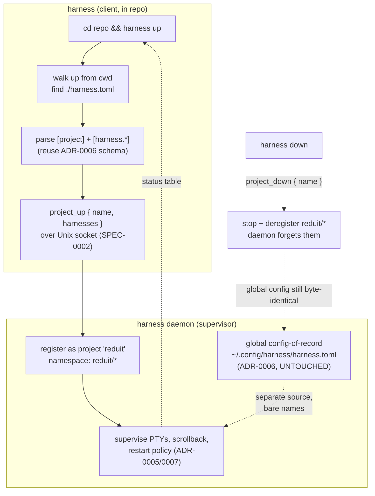

# ADR-0009: Project-scoped `harness.toml` and Compose-style lifecycle commands

## Context and Problem Statement

ADR-0006 gave us a single, global config — `~/.config/harness/harness.toml` —
holding every harness, every `[profile.*]`, and the `[server]` block, owned by
the daemon as the file-of-record. That model fits a personal, machine-wide set
of long-lived agents, but it has no answer for the most common developer
gesture: *"I'm in a repo; bring up the agents this project needs."* Today you'd
have to hand-add the project's harnesses to your global config, wire a profile,
and remember to tear it down later.

`docker compose` solved exactly this shape: a per-project file in the repo root
plus a small verb vocabulary (`up`, `down`, `ps`, `logs`) that operate on
*that project's* services without polluting global daemon config. How do we give
Harness the same **"`cd repo && harness up`"** ergonomic without breaking the
ADR-0006 global-config-of-record model, and without letting two projects that
both define a `claude` harness collide?

## Decision Drivers

* **Repo-local, git-committable.** A project's agent set should live *in the
  repo* (like `docker-compose.yaml`), version-controlled with the code, so
  `harness up` is reproducible for anyone who clones it.
* **Don't pollute global config.** Bringing a project up must not rewrite
  `~/.config/harness/harness.toml`; tearing it down must leave no residue. The
  global file stays the hand-authored, dotfiles-tracked artifact ADR-0006
  protects.
* **Reuse the harness schema.** People already know `[harness.*]`
  (`cmd`/`args`/`workdir`/`env_file`/…). A project file should speak the same
  dialect, not a second one.
* **Collision-free by construction.** Two repos each defining `claude-src` must
  be able to be `up` simultaneously.
* **Daemon stays the supervisor.** PTYs, scrollback, restart policy, and remote
  attach are the daemon's job (ADR-0002/0003/0005/0007). `harness up` is a
  *client* gesture that pushes definitions + intent over the existing protocol —
  not a second execution engine.
* **Filename reuse is a trap to defuse.** The global config is *already* named
  `harness.toml` (`config.DefaultPath()` → `~/.config/harness/harness.toml`).
  A project file called `harness.toml` shares the basename; the design must make
  location + intent, not filename, the discriminator.

## Considered Options

* **Option 1 — Ephemeral project registration.** A repo-root `harness.toml`,
  discovered by walking up from `cwd`, is parsed by the client and pushed to the
  daemon via new `project_up` / `project_down` control ops. The daemon registers
  its harnesses under a project namespace (`<project>/<harness>`), supervises
  them like any other, and forgets them on `down`. Global config untouched.
* **Option 2 — Project *is* a profile.** Treat the repo file as an alternate
  on-disk form of an ADR-0006 `[profile.*]`, discovered by directory. `up` ==
  "hop into this profile." Reuses profile machinery wholesale.
* **Option 3 — `up` merges into global config.** `harness up` appends the
  project's `[harness.*]` + a profile into `~/.config/harness/harness.toml`
  (ADR-0006 write-back), starts them, and `down` deletes those lines again.

## Decision Outcome

Chosen option: **Option 1 — ephemeral project registration**, because it gives
the Compose ergonomic while keeping the two concerns cleanly separated: the
**global file** stays the durable, dotfiles-tracked config-of-record (ADR-0006
is unchanged), and a **project** is a *transient, daemon-registered set* that
lives and dies with `up`/`down`. Profiles remain the global "switchable view"
concept; projects are the "repo-local, ephemeral" concept — siblings, not the
same thing.

### Project file: same schema, new location, project header

A project `harness.toml` is discovered by walking **up** from `cwd` (like `git`
finds `.git`, like Compose finds its file) until a `harness.toml` is found; the
directory containing it is the **project root**. It reuses the ADR-0006
`[harness.*]` table schema verbatim (same parser, same `core` domain types), so
`cmd`/`args`/`workdir`/`env_file`/`restart_delay`/`backend`/`description` all
mean what they already mean. It adds one optional table:

```toml
# ./harness.toml  (in the repo root, committed with the code)

[project]
name = "reduit"          # optional; defaults to the project-root directory basename

# The agents this project runs — the whole point of `up`.
[harness.agent]
cmd = "claude"
args = ["--dangerously-skip-permissions"]
workdir = "."            # relative paths resolve against the project root

[harness.reviewer]
cmd = "crush"
args = ["--yolo"]
workdir = "."
```

Discrimination between a project file and the global file is **by location, not
filename**: the daemon's own config is always `config.DefaultPath()`
(`~/.config/harness/harness.toml`); a *project* file is whatever `harness up`
discovers by walking up from `cwd`. To avoid a footgun, the discovery walk
**stops before** and never treats `$XDG_CONFIG_HOME/harness/harness.toml` as a
project file, and a project file MUST NOT carry `[server]` or `[profile.*]`
tables (validation error — those are global-only concerns).

### Namespacing: `<project>/<harness>`

Every harness a project registers is exposed daemon-wide as
`<project>/<harness>` — e.g. `reduit/agent`, `reduit/reviewer`. The project name
defaults to the sanitized project-root directory basename and is overridable via
`[project].name`. This is Compose's container-naming trick: two repos can each
define `agent` and both be `up` at once as `reduit/agent` and `spotter/agent`.
Bare harness names from the global config keep their un-prefixed identity, so
project names never collide with global ones as long as a project name isn't
itself used as a bare harness name (validated at `up`).

### Command surface (Compose verbs → existing control plane)

`harness up` is **detached by default**: it registers the project, starts every
harness in it, prints a one-shot status table, and returns to the shell — mirror
of Harness's daemon-centric model (viewing is `harness` TUI / `harness attach`,
not `up`). The verb set maps onto SPEC-0002 control operations, scoped to the
project:

| Command | Behavior |
| --- | --- |
| `harness up` | Discover + register project, start all its harnesses (detached), print status table. Idempotent: re-running reconciles (adds new, restarts changed). |
| `harness down` | Stop **and deregister** every harness in the project; the daemon forgets them. Destructive by design (unlike non-destructive profile hopping). |
| `harness ps` | List just this project's harnesses and states. |
| `harness logs [name]` | Scrollback for the project (or one member). |
| `harness start`/`stop`/`restart [name]` | Non-destructive lifecycle on project members (deregistration stays exclusive to `down`). |

`up`/`down` are new control ops (`project_up`, `project_down`); `ps`/`logs`/
`start`/`stop`/`restart` reuse the existing `list`/`logs`/`start`/`stop`/
`restart` ops filtered by project namespace. `harness up`/`down` require a
running daemon exactly as every other client verb does (ADR-0002).

### Consequences

* Good, because it delivers the `cd repo && harness up` gesture the pitch is
  missing, with a file developers can commit alongside their code.
* Good, because ADR-0006's global config-of-record is **untouched** — no
  write-back, no residue, no black-box merging of repo files into personal
  config.
* Good, because reusing the `[harness.*]` schema means one parser, one mental
  model, and zero new harness-definition dialect.
* Good, because `<project>/` namespacing makes simultaneous multi-repo use
  collision-free by construction.
* Bad, because the daemon now holds two *sources* of harness definitions
  (global file + N ephemeral projects) and its registry/state model (ADR-0007)
  must track provenance ("this harness came from project reduit, deregister on
  down") — more state than a single flat config.
* Bad, because a project registration is **runtime-only** and does not survive a
  daemon restart the way global `autostart` profiles do; a rebooted daemon comes
  back with global config but *not* previously-`up` projects (see Confirmation /
  deferred re-up-on-restart).
* Neutral, because the shared `harness.toml` basename requires a deliberate
  location-based discrimination rule rather than a filename one — documented
  above, but a real edge developers can trip on.

### Confirmation

* SPEC-0004 formalizes discovery (up-walk from `cwd`), the `[project]` table,
  `<project>/<harness>` namespacing, the `project_up`/`project_down` protocol
  ops, and the `up`/`down`/`ps` verb semantics as testable requirements +
  scenarios.
* Acceptance tests: `up` in a repo registers `<project>/*` and starts them;
  `down` removes them and leaves the global config file byte-identical; two
  projects defining the same bare name coexist; a project file carrying
  `[server]`/`[profile.*]` is rejected; discovery never adopts the XDG global
  file as a project.
* **Deferred:** whether the daemon should *persist* which projects were `up` and
  re-`up` them on restart (a "project autostart") is left to a follow-up
  decision; the initial cut is runtime-only, matching Compose's "compose up
  doesn't survive a dockerd restart" behavior.

## Pros and Cons of the Options

### Option 1 — Ephemeral project registration

Repo-root file, discovered by up-walk, pushed to the daemon as a namespaced,
transient set via new `project_up`/`project_down` ops.

* Good, because global config-of-record (ADR-0006) is never mutated.
* Good, because it's the closest analogue to the `docker compose` mental model
  the request explicitly asks for.
* Good, because `<project>/` namespacing solves collisions structurally.
* Neutral, because it introduces provenance tracking in the daemon registry.
* Bad, because project registrations are runtime-only (lost on daemon restart)
  unless a later ADR adds project-autostart persistence.

### Option 2 — Project *is* a profile

Treat the repo file as an on-disk `[profile.*]` discovered by directory; `up` ==
`use_profile`.

* Good, because it reuses the existing profile machinery and `use_profile` op.
* Bad, because profiles are explicitly **non-destructive** in ADR-0006 ("hopping
  profiles does not kill harnesses"), which directly contradicts `down`'s
  stop-and-forget semantics — we'd be overloading one concept with two opposite
  lifecycles.
* Bad, because profiles reference harnesses *by name from global config*;
  a repo-local profile would still need its member harnesses to exist globally,
  reintroducing the pollution we're trying to avoid.
* Bad, because it blurs "durable switchable view" and "ephemeral repo set" into
  one word, making both harder to reason about.

### Option 3 — `up` merges into global config

`harness up` appends the project's tables to `~/.config/harness/harness.toml`
via ADR-0006 write-back; `down` deletes them.

* Good, because everything flows through one existing file + reload path.
* Bad, because it mutates the user's hand-authored, dotfiles-tracked config on
  every `up`/`down` — exactly the "config black box" and chezmoi-churn ADR-0006
  fought to prevent.
* Bad, because a crash between `up` and `down` leaves orphaned project tables
  wedged in personal config.
* Bad, because collisions become *file-level* merge conflicts rather than clean
  namespaced coexistence.

## Architecture Diagram



## More Information

* **Extends [ADR-0006](adr-0006-configuration-and-profiles.md)** — reuses the
  `[harness.*]` schema and file-parsing path; adds project-scoped, ephemeral
  registration as a sibling to global profiles. Profiles stay the durable,
  switchable global view; projects are the repo-local, transient set.
* **Related [ADR-0002](adr-0002-daemon-client-architecture.md)** — `up`/`down`
  are thin-client gestures over the daemon control plane, not a second engine.
* **Related [ADR-0005](adr-0005-supervision-and-lifecycle.md)** — project
  harnesses are supervised identically; project-autostart-on-restart is the
  deferred question.
* **Related [ADR-0007](adr-0007-state-persistence-scrollback.md)** — the daemon
  registry must now track per-harness provenance (global vs. project) so `down`
  removes exactly the right set.
* **Governs [SPEC-0004](../openspec/specs/project-compose/spec.md)** — the
  formal requirements + scenarios for discovery, namespacing, protocol ops, and
  verb semantics.
