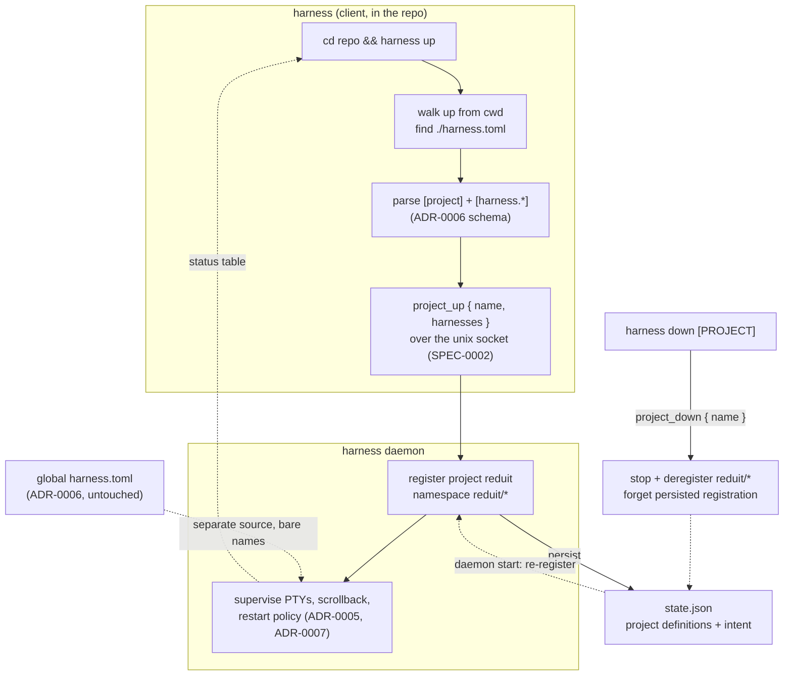

# ADR-0009: Project-scoped `harness.toml` and Compose-style lifecycle commands

## Context and Problem Statement

ADR-0006 gave Harness a single, global config, `~/.config/harness/harness.toml`,
holding every harness, every `[profile.*]`, and the `[server]` block, owned by
the daemon as the file of record. That model fits a machine-wide set of
long-lived agents, but it has no answer for the most common developer gesture:
*"I'm in a repo; bring up the agents this project needs."* Without a project
concept, the project's harnesses have to be hand-added to the global config,
wired into a profile, and remembered for teardown.

`docker compose` solved exactly this shape: a per-project file in the repo root
plus a small verb vocabulary (`up`, `down`, `ps`, `logs`) that operates on
*that project's* services without polluting global configuration. How does
Harness get the same **`cd repo && harness up`** ergonomic without breaking the
ADR-0006 global-config-of-record model, and without letting two projects that
both define a `claude` harness collide?

## Decision Drivers

* **Repo-local, git-committable.** A project's agent set lives *in the repo*,
  like `docker-compose.yaml`, versioned with the code, so `harness up` is
  reproducible for anyone who clones it.
* **Don't pollute global config.** Bringing a project up must not rewrite
  `~/.config/harness/harness.toml`, and tearing it down must leave no residue.
  The global file stays the hand-authored, dotfiles-tracked artifact ADR-0006
  protects.
* **Reuse the harness schema.** Operators already know `[harness.*]`
  (`harness`, `args`, `workdir`, `env_file`, …). A project file speaks the same
  dialect, not a second one.
* **Collision-free by construction.** Two repos each defining `claude-src` can
  be up at the same time.
* **Durable like Compose.** A project that is up stays up across a daemon
  restart until someone tears it down, the way Compose containers with a restart
  policy come back under a restarted Docker daemon.
* **The daemon stays the supervisor.** PTYs, scrollback, restart policy and
  remote attach are the daemon's job (ADR-0002, ADR-0003, ADR-0005, ADR-0007).
  `harness up` is a *client* gesture that pushes definitions and intent over the
  existing protocol, not a second execution engine.
* **Defuse the shared filename.** The global config is already named
  `harness.toml`. A project file with the same basename must be told apart by
  location and role, not by name.

## Considered Options

* **Option 1 — Daemon-managed project registration.** A repo-root
  `harness.toml`, discovered by walking up from `cwd`, is parsed by the client
  and pushed to the daemon with `project_up` / `project_down` control ops. The
  daemon registers its harnesses under a project namespace
  (`<project>/<harness>`), supervises them like any other, persists the
  registration, and forgets it on `down`. The global config is untouched.
* **Option 2 — A project is a profile.** Treat the repo file as an alternate
  on-disk form of an ADR-0006 `[profile.*]`, discovered by directory; `up` means
  "hop into this profile".
* **Option 3 — `up` merges into global config.** `harness up` appends the
  project's `[harness.*]` tables and a profile to the global file (ADR-0006
  write-back), starts them, and `down` deletes those lines again.

## Decision Outcome

Chosen option: **Option 1 — Daemon-managed project registration**, because it
gives the Compose ergonomic while keeping two concerns cleanly apart: the
**global file** stays the dotfiles-tracked config of record (ADR-0006 is
unchanged), and a **project** is a repo-owned set the daemon registers on `up`,
persists across restarts, and forgets only on an explicit `down` or `rm`.
Profiles remain the global "switchable view"; projects are the "repo-local,
daemon-managed set". They are siblings, not the same concept.

### Project file: same schema, new location, project header

A project `harness.toml` is discovered by walking **up** from `cwd`, the way
`git` finds `.git` and Compose finds its file, until a `harness.toml` is found;
the directory containing it is the **project root**. It reuses the ADR-0006
`[harness.*]` table schema verbatim (same parser, same `core` domain types), so
`harness`, `args`, `workdir`, `env_file`, `restart_delay`, `backend` and
`description` mean what they already mean. It adds one optional table:

```toml
# ./harness.toml  (in the repo root, committed with the code)

[project]
name = "reduit"          # optional; defaults to the project-root directory basename

# The agents this project runs.
[harness.agent]
harness = "claude-code"
args = ["--remote-control"]
workdir = "."            # relative paths resolve against the project root

[harness.reviewer]
harness = "crush"
args = ["--yolo"]
workdir = "."
```

A project file is told apart from the global file **by location, not
filename**. The daemon's own config is always `config.DefaultPath()`
(`~/.config/harness/harness.toml`); a *project* file is whatever `harness up`
discovers by walking up from `cwd`. The walk never treats
`$XDG_CONFIG_HOME/harness/harness.toml` as a project file. A project file MUST
NOT carry `[server]` or `[profile.*]` tables, or any other table or key the
daemon owns globally (trigger sources, schedules, operating hours); each is a
validation error.

### Namespacing: `<project>/<harness>`

Every harness a project registers is exposed daemon-wide as
`<project>/<harness>`, for example `reduit/agent` and `reduit/reviewer`. The
project name defaults to the sanitized project-root directory basename
(`My-Cool Project` becomes `my-cool-project`) and is overridable with
`[project].name`. This is Compose's container-naming trick: two repos can each
define `agent` and both be up at once as `reduit/agent` and `spotter/agent`.
Bare harness names from the global config keep their unprefixed identity, so
project harnesses never collide with global ones as long as a project name is
not itself a bare harness name, which `up` validates.

### Registration persistence

The daemon persists each registered project's definitions and its harnesses'
runtime intent in `state.json` (ADR-0007), keyed by project, and re-registers
them at daemon start. A member that was running comes back running; a member an
operator stopped stays stopped. The registration ends only on `harness down`
(whole project) or `harness rm` (one member). Project and global harnesses
restore through the same path.

### Command surface

`harness up` is **detached by default**: it registers the project, starts every
harness in it, prints a one-shot status table, and returns to the shell. Viewing
is the `harness` TUI or `harness attach`, not `up`. The verbs map onto SPEC-0002
control operations, scoped to the project:

| Command | Behavior |
| --- | --- |
| `harness up` | Discover and register the project, start all its harnesses (detached), print a status table. Idempotent: re-running reconciles (adds new, removes gone, and applies changed definitions on the next restart rather than bouncing a running process). |
| `harness down [PROJECT]` | Stop **and deregister** every harness in the project; the daemon forgets them, persisted registration included. Destructive by design, unlike non-destructive profile hopping. With `PROJECT`, no discovery runs, so a project whose file was deleted can still be torn down. |
| `harness rm [NAME]` | Stop **and deregister** one registered harness; removing the last member drops the empty project. |
| `harness ps` | List this project's harnesses and states. |
| `harness logs [name]` | Scrollback for the project, or one member. |
| `harness start` / `stop` / `restart [name]` | Non-destructive lifecycle on project members; deregistration stays exclusive to `down` and `rm`. |

`up`, `down` and `rm` map to control ops (`project_up`, `project_down`,
`remove`); `ps`, `logs`, `start`, `stop` and `restart` reuse the existing
`list`, `logs`, `start`, `stop` and `restart` ops filtered by project namespace.
Every project verb requires a running daemon, exactly as every other client verb
does (ADR-0002).

### Consequences

* Good, because it delivers the `cd repo && harness up` gesture with a file
  developers commit alongside their code.
* Good, because ADR-0006's global config of record is **untouched**: no
  write-back, no residue, no merging of repo files into personal configuration.
* Good, because reusing the `[harness.*]` schema means one parser, one mental
  model, and no second harness-definition dialect.
* Good, because `<project>/` namespacing makes simultaneous multi-repo use
  collision-free by construction.
* Good, because registrations persist, so `up` is a durable Compose gesture
  rather than an ad-hoc one: a daemon restart brings a project's running set
  back until an explicit `down` or `rm`.
* Bad, because the daemon now holds two *sources* of harness definitions (the
  global file and N registered projects), and its registry and state model
  (ADR-0007) track provenance ("this harness came from project reduit") so
  `down` removes exactly the right set.
* Bad, because a project registration lives in `state.json`, so it outlives the
  project file: deleting the file does not tear the project down.
  `harness down PROJECT` covers that case.
* Neutral, because the shared `harness.toml` basename needs a deliberate
  location-based rule rather than a filename one, and developers can still trip
  on it.

### Confirmation

* SPEC-0004 formalizes discovery, the `[project]` table, `<project>/<harness>`
  namespacing, the `project_up` / `project_down` / `remove` ops, registration
  persistence, and the verb semantics as testable requirements and scenarios.
* Acceptance tests: `up` in a repo registers `<project>/*` and starts them;
  `down` removes them and leaves the global config file byte-identical; a daemon
  restart re-registers an up project and restores its running set while a
  stopped member stays stopped; `rm` removes one member, drops an emptied
  project, and refuses a global harness; two projects defining the same bare
  name coexist; a project file carrying `[server]` or `[profile.*]` is rejected;
  discovery never adopts the global file as a project.

## Pros and Cons of the Options

### Option 1 — Daemon-managed project registration

A repo-root file, discovered by walking up, pushed to the daemon as a
namespaced, daemon-managed set with `project_up` / `project_down` / `remove`,
and persisted across daemon restarts until an explicit teardown.

* Good, because the global config of record (ADR-0006) is never mutated.
* Good, because it is the closest analogue to the `docker compose` mental
  model.
* Good, because `<project>/` namespacing solves collisions structurally.
* Good, because the registration is durable, like Compose.
* Neutral, because it introduces provenance tracking in the daemon registry.

### Option 2 — A project is a profile

Treat the repo file as an on-disk `[profile.*]` discovered by directory; `up`
equals `use_profile`.

* Good, because it reuses the existing profile machinery and `use_profile` op.
* Bad, because profiles are explicitly **non-destructive** in ADR-0006
  ("hopping profiles does not kill harnesses"), which contradicts `down`'s
  stop-and-forget semantics: one concept would carry two opposite lifecycles.
* Bad, because profiles reference harnesses *by name from the global config*,
  so a repo-local profile would still need its members defined globally,
  reintroducing the pollution this ADR avoids.
* Bad, because it blurs "durable switchable view" and "repo-owned set" into one
  word, making both harder to reason about.

### Option 3 — `up` merges into global config

`harness up` appends the project's tables to the global file through ADR-0006
write-back; `down` deletes them.

* Good, because everything flows through one existing file and reload path.
* Bad, because it mutates the hand-authored, dotfiles-tracked config on every
  `up` and `down`, the churn ADR-0006 was written to prevent.
* Bad, because a crash between `up` and `down` leaves orphaned project tables
  wedged in personal configuration.
* Bad, because collisions become file-level merge conflicts rather than clean
  namespaced coexistence.

## Architecture Diagram


```mermaid
flowchart TD
    subgraph client["harness (client, in the repo)"]
        A["cd repo && harness up"]:::client --> B["walk up from cwd<br/>find ./harness.toml"]:::client
        B --> C["parse [project] + [harness.*]<br/>(ADR-0006 schema)"]:::client
        C --> D["project_up { name, harnesses }<br/>over the unix socket (SPEC-0002)"]:::client
    end

    subgraph daemon["harness daemon"]
        E["register project reduit<br/>namespace reduit/*"]:::daemon
        F["supervise PTYs, scrollback,<br/>restart policy (ADR-0005, ADR-0007)"]:::daemon
    end

    G["global harness.toml<br/>(ADR-0006, untouched)"]:::store
    S["state.json<br/>project definitions + intent"]:::store

    D --> E --> F
    E -->|"persist"| S
    S -.->|"daemon start: re-register"| E
    F -.->|"status table"| A
    G -.->|"separate source, bare names"| F

    H["harness down [PROJECT]"]:::client -->|"project_down { name }"| I["stop + deregister reduit/*<br/>forget persisted registration"]:::daemon
    I -.-> S
```

## More Information

* **Extends ADR-0006** — reuses the `[harness.*]` schema and file-parsing path,
  and adds project registration as a sibling to global profiles. Profiles stay
  the durable, switchable global view; projects are the repo-owned set.
* **Related ADR-0002** — `up`, `down` and `rm` are thin-client gestures over
  the daemon control plane, not a second engine.
* **Related ADR-0005** — project harnesses are supervised identically,
  including restore on daemon restart.
* **Related ADR-0007** — the registry tracks per-harness provenance (global or
  project), and `state.json` carries project registrations.
* **Related ADR-0017** — scratchpads are the ephemeral sibling: never
  persisted, gone on daemon restart.
* **Governs SPEC-0004** — the requirements and scenarios for discovery,
  namespacing, protocol ops, persistence and verb semantics.
