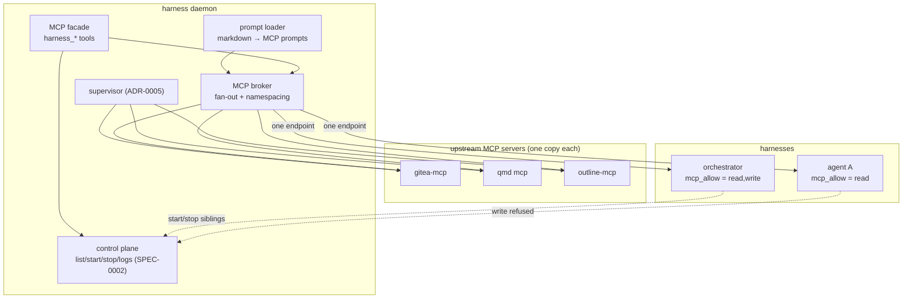

# ADR-0010: Local MCP surface — control-plane facade, server broker, and side-loaded prompts

> **Not yet implemented.** The `[mcp.*]` broker tables described here are design-stage; the config parser does not recognise them (a `[mcp.gitea]` table is a parse error today). See harness issue #3.

## Context and Problem Statement

Harness supervises agent CLIs but is invisible to them. An agent inside a
harness cannot see its siblings, cannot read their state, and cannot restart a
flapping one — the supervisor and the supervised are strangers. Meanwhile every
harness independently spawns its own copy of every stdio MCP server it is
configured with: twelve harnesses times twenty servers is 240 processes serving
twelve consumers, each configured in twelve places.

Both problems are the same shape — the daemon holds fleet-level knowledge and
fleet-level process ownership, and neither is reachable from inside a harness.
How do we expose the daemon to the agents it supervises, and stop duplicating
MCP servers per harness, **without** teaching the daemon what an agent is?

## Decision Drivers

* **The daemon stays agnostic.** `CLAUDE.md` commits to a supervisor that knows
  nothing about what runs inside a harness. Any MCP capability must be
  expressible as "another client" or "another supervised process," never as
  agent-awareness in the core.
* **Reuse the control plane, don't fork it.** SPEC-0002 already defines the verb
  set the CLI and TUI both consume. An MCP surface that reimplements those verbs
  is a second source of truth waiting to drift.
* **MCP server duplication is a real cost**, in memory, in process count, and in
  config maintenance. It is the concrete pain that motivates this ADR.
* **Background agents are the primary consumer.** Harnesses are supervised, not
  driven; a human is usually not attached. Anything requiring a confirmation
  round-trip defeats the purpose.
* **Attach already equals terminal access.** ADR-0008 concedes that anyone who
  can attach can drive the agent. An MCP write surface generalizes that reach,
  so the scoping question must be answered here rather than deferred again.
* **One endpoint, many upstreams.** Harnesses should see a single MCP endpoint
  whose contents are configured once, not N endpoints they each wire up.

## Considered Options

* **Option 1 — Facade only.** Expose the existing control-plane verbs as an MCP
  server. Do nothing about upstream server duplication.
* **Option 2 — Facade + broker.** Add the facade, *and* have the daemon
  supervise upstream MCP servers declared in `harness.toml`, fanning one
  multiplexed endpoint into every harness. Prompts declared once are served to
  all.
* **Option 3 — Sidecar broker, separate binary.** A distinct `harness-mcp`
  process that brokers upstreams and proxies the daemon socket, supervised as an
  ordinary harness.

## Decision Outcome

Chosen option: **Option 2 — facade plus broker in the daemon**, because the two
halves share a transport, a config file, and a lifecycle, and because
*supervising a process* is precisely what the daemon already does. Brokering
stdio MCP servers is the existing job with a different pipe, not a new
responsibility.

### The facade: a third thin client

The control-plane rows below map 1:1 onto SPEC-0002 operations and introduce no
new authority: everything they can do, `harness` the CLI can already do. The
trajectory rows are new, additive read-only operations — defined in SPEC-0006,
carried by the same protocol, and the reason `ProtoMinor` moves.

| MCP tool | Control op | Access |
| --- | --- | --- |
| `harness_list`, `harness_describe`, `harness_logs` | `list`, `describe`, `logs` | read |
| `harness_start`, `harness_stop`, `harness_restart` | `start`, `stop`, `restart` | write |
| `list_trajectories`, `get_trajectory` | new, read-only (SPEC-0006) | read |

### The broker: upstream servers as a supervised process class

```toml
# ~/.config/harness/harness.toml
[mcp.gitea]
cmd = "gitea-mcp"
args = ["--transport", "stdio"]
env_file = "~/.config/vault/secrets-static.env"

[mcp.qmd]
cmd = "qmd"
args = ["mcp"]

[mcp.prompts]
paths = ["~/.config/harness/prompts"]
```

The daemon starts each `[mcp.*]` server once, supervises it under the ADR-0005
restart policy, and exposes a single endpoint per harness that fans out to all
of them. Tool names are namespaced by server key to keep two upstreams from
colliding. A harness's own MCP config is left alone — the broker is *additive*,
so a harness may still declare private servers.

**Prompts are side-loaded**, not proxied: MCP's `prompts` primitive lets a
markdown file in a configured directory become a slash command in every harness
at once. Skills cannot travel this way — MCP has no skill primitive and every
agent CLI discovers skills by scanning directories — which is why skill sharing
is a separate decision (ADR-0011) rather than a feature of this one.

### Capability scoping

Read operations are available by default. **Write operations are opt-in per
harness**, answering for MCP callers the same least-privilege question ADR-0008
deferred for SSH keys (whose per-key attach scoping remains open):

```toml
[harness.reviewer]
cmd = "claude"
mcp_allow = ["read"]           # default: read-only
[harness.orchestrator]
mcp_allow = ["read", "write"]  # may start/stop siblings
```

This is a deliberate, documented acceptance of risk rather than a mitigation of
it. A harness granted `write` can drive its siblings, and because these are
background agents, no human is watching when it does. Prompt injection reaching
any harness's *output* can therefore reach the fleet. The project accepts this:
the stated goal is removing a human from loops they add no value to, and a
confirmation gate re-adds the human. Guardrails belong at the work-routing layer
(Switchboard), not in the fleet's own control path. One honest gap, recorded
rather than resolved: Switchboard gates *inbound work routing*, not an agent
calling `harness_stop` on a sibling — if fleet control should be gated too, the
move is routing write ops through Switchboard as todos rather than direct MCP
calls.

### Consequences

* Good, because the facade adds no second engine — it delegates to the same
  control-plane handlers the CLI and TUI use (ADR-0002), and its only additions
  are additive read-only trajectory operations.
* Good, because with N harnesses and M upstream servers the broker collapses
  N×M server processes to M, and N config sites to one.
* Good, because prompts become fleet-wide for free via an existing MCP
  primitive.
* Good, because it answers the MCP half of the least-privilege scoping ADR-0008
  left open, rather than deferring that too (per-SSH-key scoping stays deferred).
* Bad, because the daemon now supervises a second process class (stdio servers
  with no PTY), so the registry and lifecycle model must distinguish them from
  harnesses.
* Bad, because a broker crash degrades every harness at once, where per-harness
  servers failed independently. Blast radius is the price of deduplication.
* Bad, because write scoping is real authority expressed in config, and a
  misconfigured `mcp_allow` is a fleet-wide issue rather than a local one.
* Neutral, because harnesses may still declare private MCP servers; the broker
  adds to their set rather than replacing it.

### Confirmation

* SPEC-0005 formalizes the tool surface, the `[mcp.*]` schema, namespacing,
  broker lifecycle, prompt discovery, and `mcp_allow` as testable requirements.
* Acceptance tests: a facade tool returns the same data as its control op; two
  upstreams exposing the same tool name coexist under distinct namespaces; a
  harness with default scoping is refused a write op; a crashed upstream is
  restarted under the ADR-0005 policy without taking the daemon down; a prompt
  file appears in every harness's prompt list.

## Pros and Cons of the Options

### Option 1 — Facade only

* Good, because it is the smallest possible change — a client, no daemon work.
* Good, because it delivers agent-to-agent supervision immediately.
* Bad, because it leaves the duplication problem entirely unsolved, which is the
  more expensive of the two.
* Bad, because prompt side-loading has nowhere to live.

### Option 2 — Facade + broker

* Good, because the two halves share transport, config, and lifecycle.
* Good, because brokering is the daemon's existing competence applied to a new
  pipe.
* Good, because one endpoint per harness is a simpler contract than N.
* Neutral, because it introduces a second supervised process class.
* Bad, because it concentrates failure: one broker, many dependents.

### Option 3 — Sidecar broker as a separate binary

* Good, because it keeps the daemon strictly PTY-only.
* Good, because the sidecar is itself just a harness, so it needs no new
  supervision code at all.
* Bad, because config splits across two files and two lifecycles for one
  user-visible feature.
* Bad, because the sidecar must proxy the daemon socket to serve the facade,
  adding a hop and a version-skew surface between two things shipped together.
* Bad, because "one binary, two roles" is an explicit product property the
  README states; a third role erodes it.

## Architecture Diagram



## More Information

* **Extends [ADR-0002](adr-0002-daemon-client-architecture.md)** — the facade is
  a thin client over the existing control plane, not a second engine.
* **Related [ADR-0004](adr-0004-transport-and-remote-access.md)** — the broker
  endpoint is local-only, reached over the same Unix socket trust boundary;
  remote MCP is explicitly out of scope here.
* **Related [ADR-0005](adr-0005-supervision-and-lifecycle.md)** — upstream MCP
  servers are supervised by the same restart machinery as harnesses.
* **Related [ADR-0008](adr-0008-security-and-secrets.md)** — `mcp_allow`
  implements the per-key authorization scoping ADR-0008 deferred; upstream
  servers receive secrets by `env_file` exactly as harnesses do, and the daemon
  retains none of them.
* **Governs [SPEC-0005](../openspec/specs/mcp-surface/spec.md)**.
* Enables [ADR-0012](adr-0012-cross-harness-distillation.md), whose distiller
  reads trajectories through this facade and whose learned skills are served
  through this facade's search tools.
