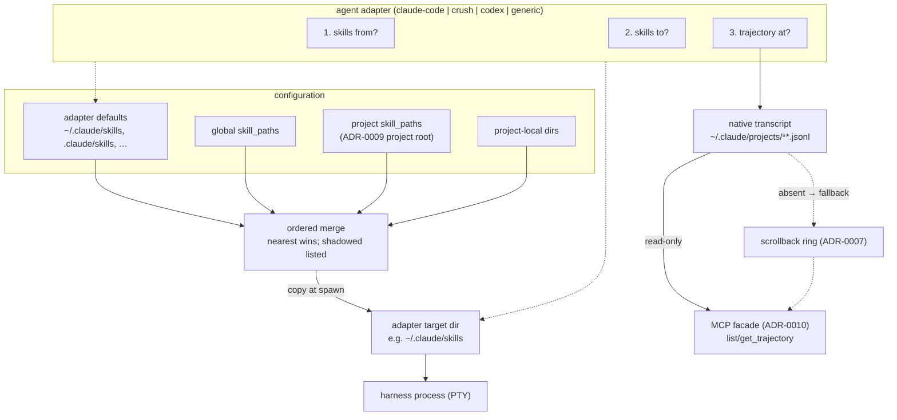

# ADR-0011: Agent adapters — configured skill paths, spawn-time projection, trajectory discovery

## Context and Problem Statement

Agent skills are already a portable format: a directory containing `SKILL.md`
with YAML frontmatter. What is *not* portable is **discovery** — Claude Code
scans `~/.claude/skills` and `.claude/skills`, Crush scans its own paths, Codex
reads `AGENTS.md`. The same file is invisible to a sibling harness running a
different tool, so a skill set has to be maintained per tool and per machine.

Separately, Harness wants to read what a harness *did* — its trajectory — and
the answer is also tool-specific: Claude Code writes JSONL transcripts under
`~/.claude/projects`, other tools write elsewhere, and some write nothing at all,
leaving only the PTY scrollback ADR-0007 already keeps.

These are the same question asked twice: **given a harness, where does this
particular tool keep its things?** How do we answer it without the daemon
learning what an agent is?

## Decision Drivers

* **The daemon stays agnostic.** `CLAUDE.md` allows agent-awareness only as a
  bolt-on detector. Tool-specific knowledge must live in a replaceable adapter
  behind a narrow interface, not in the supervisor.
* **Globbing `$HOME` is not viable.** Measured on a working machine: **407
  `SKILL.md` files** under `$HOME` (depth 8, excluding `node_modules`/`.git`),
  with `ops-runbook`, `playbook`, `ops-check`, `app-catalog` and `stack-guide`
  each appearing **14 times** and `crush-config`/`crush-hooks`/`jq` **12 times**
  — the same skills sitting in a dozen worktrees. Discovery by search yields
  roughly 5× duplication and no principled winner.
* **Don't rebuild what already works.** Personal dotfiles tooling already
  propagates skills across machines. The genuine gap is cross-*tool* and
  per-project, not cross-machine.
* **Reuse existing discovery.** ADR-0009 already defines a project root
  (up-walk from `cwd` to a `harness.toml`) and the daemon already tracks
  per-harness provenance. Project-scoped skills should need no new machinery.
* **Skills cannot travel over MCP.** MCP defines tools, prompts and resources —
  no skill primitive — and every agent CLI discovers skills from the filesystem.
  So skill sharing must be a spawn-time filesystem act, unlike the prompts in
  ADR-0010.
* **Precedent exists for pluggable per-harness behavior.** The harness schema
  already carries `backend = "tmux" | "native"` (ADR-0003), where the daemon
  holds a registry it does not itself understand.

## Considered Options

* **Option 1 — Glob discovery.** Walk `$HOME` and `$PROJECT_ROOT` for
  `SKILL.md`, merge everything found into one surface.
* **Option 2 — Configured paths with adapter defaults.** Each adapter supplies
  known-good default roots for its tool; the user adds more via `skill_paths` in
  `harness.toml`. An ordered union is projected into the harness's expected
  location before exec. The same adapter answers where trajectories live.
* **Option 3 — Symlink farm at a fixed location.** Maintain one canonical
  directory and symlink it into each tool's path out of band, with no daemon
  involvement.

## Decision Outcome

Chosen option: **Option 2 — configured paths with adapter defaults**, because it
delivers the cross-tool surface without inventing a discovery heuristic, and
because folding trajectory location into the same adapter means one detector
concept rather than two.

### One adapter, three questions

An adapter answers exactly three things about a harness:

1. **Where do skills come from?** — this tool's native discovery roots.
2. **Where do skills go?** — the directory to project the merged set into
   before exec.
3. **Where does this tool write its trajectory?** — a path, or nothing.

The registry ships `claude-code`, `crush`, `codex`, and `generic`. `generic`
answers "no native roots, no projection target, no trajectory," which degrades
to today's behavior: the harness runs, and its only record is the ADR-0007
scrollback ring. The daemon holds the registry and understands no entry in it.

Selection mirrors `backend`:

```toml
[harness.agent]
cmd = "claude"
# agent = "claude-code"   # inferred from cmd when unset
skill_paths = ["~/work/team-skills"]
```

### Ordered precedence, not a flat union

```
adapter defaults → global skill_paths → project skill_paths → project-local dirs
```

Nearest wins on a name collision. Shadowed copies remain listable so the winner
is debuggable — with 14-way duplicates in the wild, silent shadowing is a
support burden, not a hypothetical.

`skill_paths` is **additive by default**; `use_default_skill_paths = false`
drops the adapter's roots for a user who wants full control. It is legal in
**both** the global and project files, explicitly *not* joining `[server]` and
`[profile.*]` on ADR-0009's global-only list — a repo shipping its own skills is
the point of the feature.

### Projection happens at spawn

The daemon materializes the merged set into the adapter's target directory
immediately before exec, as an extension of the work it already does setting
`workdir`, `env`, and `env_file`. Projection is **copy, not symlink**: agent
CLIs write into their own config directories, and a symlink farm would let one
harness mutate another's source of truth. The target directory is not itself a
source root — whatever already lives there is the tool's own concern, and the
merge draws only from the remaining roots, so copy-isolation stays satisfiable
even when a tool's default discovery root doubles as its target.

### Trajectory discovery is read-only

The adapter locates the transcript; the daemon exposes it through the ADR-0010
facade as `list_trajectories` / `get_trajectory`, and **never writes to it**.
Where an adapter reports no trajectory path, the scrollback ring is the fallback
— acknowledging that raw ANSI is a poor substrate (it is the *rendered* screen:
spinners, repaints, cursor moves) and that a native transcript is strongly
preferred wherever one exists.

### Consequences

* Good, because the 407-file, 14-duplicate discovery problem never arises: no
  `src/` walk, no heuristic, ~15 skills plus opt-in.
* Good, because one adapter interface serves both skills and trajectories, so
  the codebase grows one detector concept rather than two.
* Good, because `$PROJECT_ROOT` and per-harness provenance are reused from
  ADR-0009 rather than reinvented.
* Good, because `generic` keeps the daemon honest — an unknown tool still runs,
  and the feature is inert rather than broken.
* Bad, because this is the first real tool-specific knowledge in the tree. It is
  fenced behind an interface, but `CLAUDE.md`'s "deliberately agnostic" now
  carries an explicit, documented exception.
* Bad, because copy-on-spawn drifts: a skill edited in the canonical store does
  not reach a running harness until it restarts.
* Bad, because adapters rot. Every upstream tool that moves its skill directory
  or transcript format breaks one, and the failure is silent (skills merely fail
  to appear).
* Neutral, because projection is bounded work at spawn, proportional to the
  configured set rather than to the filesystem.

### Confirmation

* SPEC-0006 formalizes the adapter interface, default roots per adapter, the
  precedence order, `skill_paths` parsing in both files, projection timing and
  copy semantics, and trajectory discovery as testable requirements.
* Acceptance tests: two roots defining the same skill name resolve to the nearer
  one with the other listed as shadowed; `use_default_skill_paths = false` drops
  adapter roots; a project file carrying `skill_paths` is accepted where one
  carrying `[server]` is rejected; a `generic` harness starts with no projection
  and reports no native trajectory (its record is the ADR-0007 scrollback
  fallback); projection writes copies, and mutating the
  projected copy leaves the source untouched.

## Pros and Cons of the Options

### Option 1 — Glob discovery

* Good, because it needs no configuration at all — it "just works" on paper.
* Bad, because measurement says otherwise: 407 files, ~5× duplication, and
  fourteen copies of `playbook` with no principled winner.
* Bad, because it hoovers up plugin caches and marketplace checkouts that are
  namespaced deliberately.
* Bad, because walking a large `$HOME` at every spawn is unbounded work for a
  latency-sensitive path.

### Option 2 — Configured paths with adapter defaults

* Good, because the duplication problem is structurally absent.
* Good, because defaults keep the common case zero-config while paths keep it
  extensible.
* Good, because one interface covers skills and trajectories.
* Neutral, because it introduces the first tool-specific registry.
* Bad, because adapters must track upstream layout changes, and fail quietly.

### Option 3 — Symlink farm

* Good, because it needs no Harness feature whatsoever.
* Good, because edits propagate instantly — no copy, no drift.
* Bad, because agent CLIs write into their skill directories, so one harness can
  corrupt the shared source through a symlink.
* Bad, because it cannot express project-scoped skills — a symlink is global.
* Bad, because it leaves trajectory discovery entirely unsolved, so the second
  question needs a second mechanism.

## Architecture Diagram



## Implementation Note: agent-trace

The trajectory-discovery half of this ADR is implemented by
[agent-trace](https://gitea.stump.rocks/stump.wtf/agent-trace)
(`stump.wtf/agent-trace`), an external Go library extracted from
[cosmtrek/mindwalk](https://github.com/cosmtrek/mindwalk). Its three packages
map onto this ADR's concerns:

* **`tail`** — live session log watchers with per-agent JSONL parsers for
  Claude Code, Codex, Crush, OpenCode, and Pi (`tail.DefaultAdapters()`). This
  is the implementation of "where does this tool write its trajectory?" for
  every adapter except `generic`. Each adapter exposes a `Dir` field for test
  injection so tests never touch a real home directory.
* **`classify`** — pure classification of tool calls into semantic actions
  (`search`, `read`, `edit`, `exec`, `verify`) with file targets. No I/O. This
  is the structured signal that SPEC-0007 distillation clusters on, replacing
  raw string matching.
* **`otel`** — stateless conversion of classified events + marks into
  OpenTelemetry span structs with deterministic trace/span IDs. Bridges
  harvested trajectories to Cairn's run API for shareable trace export.

The skill-projection half (questions 1 and 2) remains harness-internal; only
question 3 ("trajectory at?") delegates to agent-trace. The `generic` adapter
reports no native trajectory regardless of what agent-trace supports, preserving
ADR-0002 agnosticism.

## More Information

* **Extends [ADR-0006](adr-0006-configuration-and-profiles.md)** — adds
  `skill_paths`, `use_default_skill_paths`, and `agent` to the harness schema;
  the file remains hand-authored and the source of truth.
* **Related [ADR-0003](adr-0003-terminal-multiplexing.md)** — `agent` follows the
  `backend` precedent: a registry key the daemon dispatches on without
  understanding.
* **Related [ADR-0007](adr-0007-state-persistence-scrollback.md)** — the
  scrollback ring is the trajectory fallback when an adapter reports no native
  transcript.
* **Related [ADR-0009](adr-0009-project-scoped-config-and-compose-commands.md)** —
  reuses the project-root up-walk and per-harness provenance; `skill_paths` is
  deliberately excluded from the global-only table list.
* **Governs [SPEC-0006](../openspec/specs/agent-adapters/spec.md)**.
* Consumed by [ADR-0010](adr-0010-local-mcp-surface.md) (trajectory read tools)
  and [ADR-0012](adr-0012-cross-harness-distillation.md) (trajectories in,
  learned skills out).
