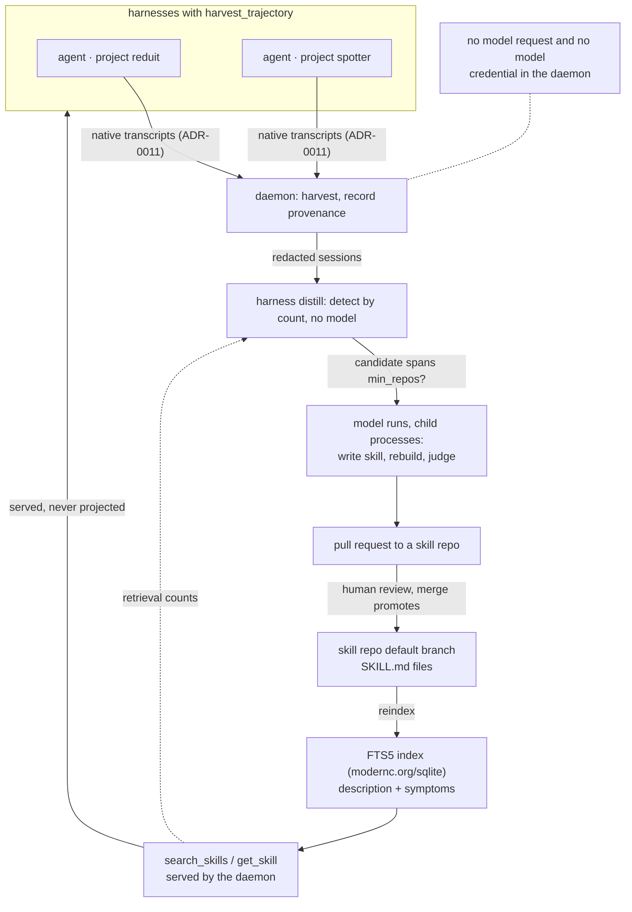

# ADR-0012: Cross-harness distillation and the learned skill tier

> **Not yet implemented.** Distillation and the learned skill tier are design
> stage; no distiller or skill index exists in the codebase. Tracked by the
> SPEC-0007 epic in the Harness issue tracker.

## Context and Problem Statement

Once Harness can read every harness's trajectory (ADR-0011) and serve tools to
every harness (ADR-0010), a fleet-level fact becomes visible that no single
agent can see: **several independent harnesses hitting the same wall.** One
agent rediscovering how SSE reconnection works in Go is normal; six agents in
six unrelated repositories rediscovering it is a missing shared artifact.

Harness is placed to notice this because it is the only thing watching every
harness at once. Turning the observation into a durable artifact raises three
questions: **what signal identifies a lesson worth capturing, who writes the
artifact and with what, and where does it go without polluting a repository,
the dotfiles, or every agent's context window?**

## Decision Drivers

* **Detection is a count, not a judgment.** "Did harnesses in several
  repositories repeat the same struggle?" is a count: cheap, deterministic and
  explainable. "Was this session good?" needs a model reading over a gigabyte of
  transcripts, and its answer cannot be audited.
* **Models write and check skills; the daemon holds no model credential.**
  Writing a skill from evidence, rebuilding a change from that skill, and
  judging the rebuild are language tasks, and a model does them. The daemon is
  the process that can spawn anything and attach to everything, and ADR-0008
  keeps secrets out of it. A model client inside the daemon would put model
  credentials, and model-steerable behavior, in the most powerful process
  Harness runs. Model calls therefore run as separate, isolated child processes
  with their own credentials, never in the daemon.
* **The daemon never writes to repositories or dotfiles.** ADR-0006 keeps
  configuration hand-authored; the same reasoning covers source trees.
* **Context is the scarce resource.** Projected skills put every
  `description` permanently in context. That is right at 15 skills and fatal at
  200, and a distilled corpus grows by construction.
* **No external dependency.** Retrieval ships inside the single Go binary: no
  separate service to install, no model weights.
* **Machine-written content needs review and history**, more than hand-written
  content does, not less.

## Considered Options

* **Option 1 — Model-judged detection.** A model periodically reads sessions,
  rates which ones hold a lesson worth keeping, and its rating promotes the
  result.
* **Option 2 — Model-free detection, model-written skills, a search-only
  tier.** Code counts recurring classified actions across repositories to find
  candidates. Models write and verify each candidate in isolated child
  processes. A human reviews. Promoted skills are served by search, never
  projected.
* **Option 3 — Manual capture.** The operator gets a command to turn a session
  into a skill by hand.

## Decision Outcome

Chosen option: **Option 2 — Model-free detection, model-written skills, a
search-only tier**, because each step goes to what does it best: repetition is
cheap and objective, so code counts it; writing and checking a skill is
language work, so a model does it, in a child process that holds the only model
credential; the promotion gate is a human; and the requirement that a lesson
recur across distinct repositories is the definition of what is being captured,
not a heuristic.

ADR-0030 extends this decision with how a skill is grounded (the merged pull
request that ended the struggle), how a candidate is verified before review
(source-blind reconstruction, a judge and an adjudicator), how it reaches review
(a pull request, where merge is promotion), and where skills live (skill repos
the operator declares, each fed by distillers with their own thresholds). This
ADR decides the tier those skills form and the fences around it.

### Where the model sits

| Stage | Runs in | Uses a model? | Holds model credentials? |
| --- | --- | --- | --- |
| Harvest sessions and record their git provenance | daemon | no | no |
| Detect candidates by counting | `harness distill`, deterministic code | no | no |
| Write the skill from the evidence | a child process of `harness distill` | **yes** | yes, its own |
| Rebuild the change from the skill alone; judge and adjudicate the rebuild | child processes of `harness distill` | **yes** | yes, their own |
| Review and promote | a human, by merging a pull request | no | no |
| Serve search results and count retrievals | daemon | no | no |

The fence is on the **daemon process**, not on using models to make skills. The
daemon never makes a model request and never holds a model credential. Every
model run is a child process whose inputs, environment and tools are fixed by
code, and none of them can push, comment or merge (ADR-0030). What Option 1
would add, and what this ADR rejects, is narrower: a model deciding on its own
which lessons exist and promoting what it rates highly.

Whether a promoted skill actually helps agents is a separate measurement.
Skill evals and efficacy metrics are the subject of a forthcoming decision,
ADR-0036.

### The signal: classified actions across repositories

Detection clusters on **classified tool-call actions** from
[agent-trace](https://github.com/stump-wtf/agent-trace)'s `classify` package.
`classify.BuildEvent` categorizes every tool call into a semantic action
(`search`, `read`, `edit`, `exec`, `verify`) with file targets, a structured
taxonomy far richer for pattern detection than raw string matching. Two
harnesses in different repositories both cycling through `exec`, `verify`,
`edit` on the same kind of test file is a learnable pattern. Literal error text
is not part of the signal: `classify.Event` keeps whether a result was an error
and its size, not its text.

The gate is scope, and Harness already tracks each harness's project
provenance. A candidate counts once its evidence spans enough **distinct
repositories**, a threshold each distiller sets for itself (`min_repos`,
ADR-0030): a distiller serving one project can take every lesson, and one
serving a whole stack can demand several repositories. Repetition only *finds*
candidates. Agent repetition on its own never promotes a skill.

### Distillation runs outside the daemon

A distiller is an ordinary supervised harness, not a daemon subsystem. It runs
`harness distill run <distiller>` on a schedule; that command does the
deterministic work (linking sessions to their outcomes, detecting, deduplicating,
proposing) and starts each model run as its own child process.

The daemon's total involvement is keeping the distiller alive like any harness,
recording the provenance of harvested sessions, serving the skill tier's search
tools over its index, and counting retrievals. It never writes, judges or
projects a skill, and it writes to no repository.

### Storage and delivery are orthogonal

The learned tier is **markdown in git, never projected, reachable only by
search.**

* **Git is the substrate.** Skills are `<slug>/SKILL.md` files in skill repos
  (ADR-0030), with history, human and agent editability, reviewable diffs, grep,
  and the ability to rebuild any index from scratch. The files are the truth;
  the index is a cache.
* **Search is the delivery.** Nothing occupies an agent's context but the tool.

This is the inverse of ADR-0011's hand-written skills, deliberately:

| | Delivery | Why |
| --- | --- | --- |
| Hand-written (few, curated) | filesystem projection | always-visible descriptions are the feature |
| Distilled (many, growing) | MCP search tool | constant context cost regardless of corpus size |

**Only a skill repo's default branch is indexed.** A proposal sitting on an open
pull request is neither projected nor searchable; it is inert until a reviewer
merges it, and the merge is itself a commit.

### Retrieval without an external dependency

Search is `modernc.org/sqlite`: **pure-Go SQLite with FTS5 and `bm25()`, no
cgo**, already a dependency (v1.59.0). Neural embeddings are rejected: ONNX
through cgo needs a shared library at runtime (an external dependency by another
name), embedded weights would add roughly 25–90 MB to a binary (about 35 MB
today) that a Homebrew formula builds from source, and production-grade pure-Go
transformer inference does not exist.

Vocabulary mismatch, the one thing embeddings buy, is closed three other ways:

1. **Skills carry their own literal symptoms.** Each skill has a `symptoms`
   frontmatter list, drawn from its evidence (failing check names and review
   text, ADR-0030), indexed as an FTS5 column, so the match is literal rather
   than semantic.
2. **The caller is a frontier model.** `search_skills` tells the calling agent
   to supply several phrasings, including any literal error text: better query
   expansion than a small embedding model, performed outside the daemon.
3. **Stemming is free** through FTS5's `porter unicode61` tokenizer.

LSA/SVD over the local corpus (`gonum`, no cgo, no pretrained weights) is the
reserved upgrade if recall demonstrably misses.

Two tools mirror native progressive disclosure: `search_skills` returns ids and
descriptions; `get_skill` returns a skill, as a compact summary by default
(ADR-0030). Each active skill is also a resource at
`harness://skills/<repo>/<slug>`, so a human can address one directly: tools
are model-controlled, resources are application-controlled, and both audiences
need a way in.

### Lifecycle

* **Supersede, don't append.** New evidence for an existing skill's purpose
  revises that skill rather than adding a near-duplicate beside it.
* **Retire on retrieval count.** Because learned skills are served rather than
  projected, retrievals are countable. A skill becomes eligible for retirement
  after "zero retrievals in N weeks **since promotion**", with a grace period: a
  freshly promoted skill has zero retrievals by definition, and a naive LRU would
  eat the corpus faster than distillation fills it. Retirement, like promotion,
  goes through a pull request (ADR-0030).

### Consequences

* Good, because the credential-bearing model work sits in isolated child
  processes where ADR-0008's fences apply, and the daemon stays a supervisor
  with no model credential.
* Good, because models do the language work they are good at (writing a skill,
  rebuilding a change, judging the rebuild), and code does the counting it is
  good at.
* Good, because the promotion gate is a measurable property of the evidence plus
  a human merge, not a model's opinion.
* Good, because search delivery keeps context cost independent of corpus size,
  the only way a growing corpus is viable at all.
* Good, because git history and pull-request review make machine-written
  content reviewable by construction.
* Bad, because a distilled skill is model output fed back as instruction. A
  wrong or stale one reaches every agent, and their repetitions become further
  evidence for the pattern: a reinforcement loop. Grounding in merged code
  (ADR-0030), mandatory review, provenance, and retrieval-based retirement are
  the mitigations; none is a proof.
* Bad, because trajectories kept for analysis are a much larger exposure than a
  bounded ring. ADR-0008 concedes the daemon cannot stop a harnessed program
  printing its own secrets, so harvesting is opt-in per harness
  (`harvest_trajectory`).
* Bad, because value is proportional to fleet homogeneity. A fleet sharing one
  stack produces real cross-repository signal; a heterogeneous one produces
  noise. This is a limit of the mechanism, not a defect in it.
* Neutral, because FTS5 is weaker than embeddings in the general case; the
  corpus-specific mitigations above are what make it sufficient here, and the
  LSA path exists if they prove not to be.

### Confirmation

* SPEC-0007 formalizes the harvest boundary, the detection inputs and
  thresholds, the isolated model runs, the default-branch gate, the FTS5 index
  and `symptoms` column, the search and get tools, and the revision and
  retirement rules as testable requirements.
* Acceptance tests: a full distillation pass makes no model or forge request
  from the daemon process; detection runs without a model; a candidate below
  its distiller's `min_repos` produces nothing; a proposal on an open pull
  request is not searchable, and merging it makes it searchable; a `symptoms`
  string matches its own skill; a harness without `harvest_trajectory`
  contributes no session; new evidence for an existing purpose revises rather
  than duplicates; a skill inside its grace period is never retired.

## Pros and Cons of the Options

### Option 1 — Model-judged detection

* Good, because it can recognize value that leaves no repeated trail.
* Good, because it needs no threshold tuning.
* Bad, because it is expensive and unbounded: the corpus is already about
  1.1 GB across 1,738 transcripts and grows daily.
* Bad, because "a good session" is subjective, so promotion is unauditable and
  the reinforcement loop has no brake.
* Bad, because it cannot tell project knowledge from stack knowledge, the
  distinction that decides where a skill goes.

### Option 2 — Model-free detection, model-written skills, a search-only tier

* Good, because detection is a count: cheap, deterministic and explainable.
* Good, because the scope threshold falls straight out of provenance the daemon
  already tracks.
* Good, because models are used where they add value, and each model run is
  isolated from the daemon and from forge credentials.
* Good, because the daemon stays model-credential-free and repository-free.
* Neutral, because thresholds (`min_repos`, the retirement window, the grace
  period) need empirical tuning.
* Bad, because it is blind to lessons that never produced a repeated pattern.

### Option 3 — Manual capture

* Good, because quality is human-gated from the first step, with no
  reinforcement loop at all.
* Good, because it needs almost no machinery.
* Bad, because it does not address the problem: the operator is the person
  being removed from loops, and this puts them back in the tightest one.
* Bad, because the cross-fleet pattern is exactly what a human cannot see from
  inside one session.

## Architecture Diagram

## More Information

* **Extends ADR-0007** — trajectory harvesting is a new, opt-in consumer of
  persisted output; the scrollback ring stays the fallback where no native
  transcript exists.
* **Related ADR-0008** — harvesting is opt-in per harness because trajectories
  can contain secrets a harnessed program printed; the daemon holds no model
  credential, and model runs hold only their own.
* **Related ADR-0010** — learned skills are served through the MCP surface's
  search tools; this ADR adds no transport of its own.
* **Related ADR-0011** — the adapter locates trajectories, and the learned tier
  is deliberately excluded from that ADR's projection path.
* **Extended by ADR-0030** — grounding in merged pull requests, blind
  reconstruction, pull-request review, skill repos and distillers.
* **Forthcoming: ADR-0036 (Skill evals and efficacy metrics)** — measuring
  whether a served skill improves the runs that retrieve it.
* **Governs SPEC-0007**.
* **Deferred:** whether the learned tier warrants a derived claims ledger
  (provenance, retrieval counts, supersession edges) in a queryable store. Such
  a ledger is rebuildable from the skill repos, which stay canonical either
  way.
