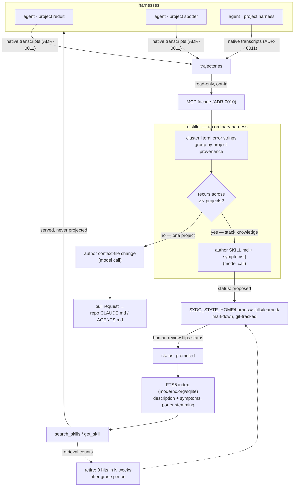

# ADR-0012: Cross-harness distillation and the learned skill tier

## Context and Problem Statement

Once Harness can read every harness's trajectory (ADR-0011) and serve tools to
every harness (ADR-0010), a fleet-level fact becomes visible that no single
agent can see: **several independent harnesses hitting the same wall.** One
agent rediscovering how SSE reconnection works in Go is normal; six agents in
six unrelated repos rediscovering it is a missing shared artifact.

Harness is uniquely positioned to notice, because it is the only thing watching
all harnesses at once. But turning that observation into a durable artifact
raises three questions the earlier ADRs do not answer: **what signal identifies
a pattern worth capturing, who writes the artifact, and where does it go without
polluting a repo, the dotfiles, or every agent's context window?**

## Decision Drivers

* **The daemon never calls an LLM.** ADR-0008 fences the daemon away from the
  secret backend; an LLM client would drag credentials into a supervisor whose
  whole thesis is that it holds none.
* **The daemon never writes to repos or dotfiles.** ADR-0006 fought to keep
  config hand-authored; the same reasoning covers source trees.
* **Quality judgment is expensive and subjective; repetition is neither.**
  "Was this session good?" needs a model over ~1.1 GB of transcripts. "Did six
  harnesses emit this same error?" is a count.
* **Context is the scarce resource.** Projected skills put every `description`
  permanently in context. Correct at 15 skills; fatal at 200 — and a distilled
  corpus grows by construction.
* **No external dependency.** Semantic retrieval must ship inside the single Go
  binary — no separate service to install, no model weights.
* **Machine-written content needs review and history**, more than hand-written
  content does, not less.

## Considered Options

* **Option 1 — LLM judge over trajectories.** Periodically summarize sessions
  with a model, promote what it rates valuable.
* **Option 2 — Frequency clustering, cross-project gated, distiller-as-harness.**
  Cluster literal error strings and repeated failed tool calls; promote only
  patterns recurring across *distinct projects*; a supervised harness authors the
  artifact; output lands in a Harness-owned directory served by search.
* **Option 3 — Manual capture.** Give the operator a command to turn a session
  into a skill by hand.

## Decision Outcome

Chosen option: **Option 2**, because it puts the cheap objective signal
(repetition) in a model-free counting pass, the expensive subjective step
(authoring) behind a single model call in a supervised harness, and the review
gate in a human — and because the cross-project
threshold is not a heuristic but the actual definition of the thing being
captured.

### The signal: repetition across projects

Detection clusters on **literal error strings and repeated failed tool calls** —
greppable, cross-harness comparable, no model required. The promotion gate is
scope, and Harness already tracks per-harness project provenance:

| Recurs in | Is | Goes to |
| --- | --- | --- |
| one project | project knowledge | a **pull request** against that repo's `CLAUDE.md` / `AGENTS.md` |
| ≥N distinct projects | stack knowledge | the **learned tier** |

Project-scoped findings leave as PRs precisely so that git — not Harness — is
the audit log, and a human merges.

### The distiller is a harness

Not a daemon subsystem. An ordinary supervised process that wakes on its own
schedule and:

1. **Reads** trajectories via the ADR-0010 facade (read-only tools).
2. **Clusters** by error string, grouped by project provenance. No LLM.
3. **Authors** — the single LLM step, producing whichever artifact the gate
   chose: the context-file change proposed in a single-project PR, or
   `SKILL.md` with the `description` given the most care because it is the
   entire retrieval surface.
4. **Writes** to `$XDG_STATE_HOME/harness/skills/learned/<slug>/SKILL.md` with
   `status: proposed` and provenance frontmatter.
5. **Posts** for human review.

The daemon's total involvement is keeping the distiller alive, answering
read-only trajectory queries, and serving the learned tier's search tools over
its index. It never authors, judges, or projects a skill.

### Storage and delivery are orthogonal

The learned tier is **markdown on disk, never projected, reachable only by
search.**

* **Disk is the substrate** — git history, human *and* agent editability,
  reviewable diffs, grep, and the ability to rebuild any index from scratch. The
  files are truth; an index is a cache.
* **Search is the delivery** — nothing occupies context but the tool.

This is the inverse of ADR-0011's hand-written skills, and deliberately so:

| | Delivery | Why |
| --- | --- | --- |
| Hand-written (few, curated) | filesystem projection | always-visible descriptions are the feature |
| Distilled (many, growing) | MCP search tool | O(1) context regardless of corpus size |

`status: proposed` gates **both** channels at once: an unreviewed skill is
neither projected nor indexed. It is inert on every path until a human flips the
field — which is itself a git commit.

### Retrieval without an external dependency

Search is `modernc.org/sqlite` — **pure-Go SQLite with FTS5 and `bm25()`, no
CGo** (verified against v1.54.0). Neural embeddings are rejected: ONNX via CGo
needs a shared library at runtime (an external dependency by another name),
embedded weights would take the binary from **11 MB** to 34–100 MB against a
Homebrew formula that builds from source, and production-grade pure-Go
transformer inference does not exist.

Vocabulary mismatch — the one thing embeddings buy — is closed three other ways:

1. **The distiller already harvested the vocabulary.** Detection clusters on
   literal error text, so the exact strings agents emit are in hand at authoring
   time. They are written into a `symptoms` frontmatter list and indexed as an
   FTS5 column, making the match literal rather than semantic.
2. **The caller is a frontier model.** `search_skills` instructs the calling
   agent to supply several phrasings including any literal error text — better
   expansion than a small embedding model, performed outside the daemon.
3. **Stemming is free** via FTS5's `porter unicode61` tokenizer.

LSA/SVD over the local corpus (`gonum`, no CGo, no pretrained weights) is the
reserved upgrade if recall demonstrably misses.

Two tools, mirroring native progressive disclosure: `search_skills` returns ids
and descriptions; `get_skill` returns a body. Each promoted skill is *also* a
resource at `harness://skills/learned/<slug>`, so a human can address one
directly — tools are model-controlled, resources are application-controlled, and
both audiences need a path in.

### Lifecycle

* **Supersede, don't append.** New evidence contradicting a learned skill
  replaces it; otherwise the corpus accumulates near-duplicates.
* **Retire on retrieval count.** Because learned skills are served rather than
  projected, retrievals are countable. Gate on "zero retrievals in N weeks
  **since promotion**," with a grace period — a freshly promoted skill has zero
  retrievals by definition, and a naive LRU would eat the corpus faster than
  distillation fills it.

### Consequences

* Good, because the expensive, credential-bearing work sits in a harness where
  ADR-0008's fences already apply, and the daemon stays a supervisor.
* Good, because the promotion gate is a measurable property of the evidence
  rather than a model's opinion.
* Good, because search-delivery makes the corpus size-independent in context,
  which is the only way a growing corpus is viable at all.
* Good, because `status` gating and git history make machine-written content
  reviewable by construction.
* Bad, because a distilled skill is model output fed back as instruction. A
  wrong or stale one reaches every agent, and their repetitions become further
  evidence for the pattern — a reinforcement loop. Provenance frontmatter,
  mandatory review before promotion, and retrieval-based retirement are the
  mitigations; none is a proof.
* Bad, because trajectories persisted for analysis are a materially larger
  exposure than a bounded ring. ADR-0008 already concedes the daemon cannot stop
  a harnessed program printing its own secrets; harvesting must therefore be
  opt-in per harness, as a sibling to ADR-0007's don't-persist-scrollback flag.
* Bad, because value is proportional to fleet homogeneity. A fleet sharing one
  stack produces real cross-project signal; a heterogeneous one produces mush.
  This is a known limit of the mechanism, not a defect in it.
* Neutral, because FTS5 is weaker than embeddings in the general case; the
  corpus-specific mitigations above are what make it sufficient here, and the
  LSA path exists if they prove not to be.

### Confirmation

* SPEC-0007 formalizes clustering inputs, the cross-project threshold, the
  `status`/provenance frontmatter, the two-channel gate, the FTS5 index and
  `symptoms` column, the search/get tools, opt-in harvesting, and the
  supersede/retire rules as testable requirements.
* Acceptance tests: a pattern in one project produces a PR and no learned skill;
  a pattern across N projects produces a `status: proposed` file that is neither
  projected nor indexed; flipping to `promoted` makes it searchable; a
  `symptoms` string matches its own literal error text; a harness without
  harvesting opted in contributes no trajectory; a superseding skill replaces
  rather than duplicates; a skill inside its grace period is never retired.

## Pros and Cons of the Options

### Option 1 — LLM judge over trajectories

* Good, because it can recognize value that leaves no error trail.
* Good, because it needs no threshold tuning.
* Bad, because it is expensive and unbounded — the corpus is already ~1.1 GB
  across 1,738 transcripts and grows daily.
* Bad, because "good session" is subjective, so promotion is unauditable and the
  reinforcement loop has no brake.
* Bad, because it cannot distinguish project knowledge from stack knowledge,
  which is the distinction that decides *where the artifact goes*.

### Option 2 — Frequency clustering, cross-project gated

* Good, because detection is a count, so it is cheap, deterministic and
  explainable.
* Good, because the scope threshold falls directly out of provenance the daemon
  already tracks.
* Good, because the daemon stays LLM-free and repo-free.
* Neutral, because thresholds (N projects, retirement window, grace period) need
  empirical tuning.
* Bad, because it is blind to lessons that never produced a repeated error
  string.

### Option 3 — Manual capture

* Good, because quality is human-gated from the first step, with no
  reinforcement loop at all.
* Good, because it needs almost no machinery.
* Bad, because it does not address the stated problem: the operator is the
  person being removed from loops, and this puts them back in the tightest one.
* Bad, because the cross-fleet pattern is exactly what a human cannot see from
  inside one session.

## Architecture Diagram

## More Information

* **Extends [ADR-0007](adr-0007-state-persistence-scrollback.md)** — trajectory
  harvesting is a new, opt-in consumer of persisted output; the scrollback ring
  remains the fallback substrate where no native transcript exists.
* **Related [ADR-0008](adr-0008-security-and-secrets.md)** — harvesting is
  opt-in per harness because trajectories may contain secrets a harnessed
  program printed itself; the distiller, not the daemon, holds model
  credentials.
* **Related [ADR-0010](adr-0010-local-mcp-surface.md)** — trajectories are read
  through the facade and learned skills are served through the facade's search
  tools; this ADR adds no transport of its own.
* **Related [ADR-0011](adr-0011-agent-adapters.md)** — the adapter locates
  trajectories, and the learned tier is deliberately excluded from that ADR's
  projection path.
* **Governs [SPEC-0007](../openspec/specs/skill-distillation/spec.md)**.
* **Deferred:** whether the learned tier warrants a derived claims ledger
  (provenance, retrieval counts, supersession edges) in a queryable store. The
  candidates surveyed are explicitly experimental with no migration guarantees,
  which is survivable only because such a ledger is rebuildable from the
  markdown — the files stay canonical either way.
