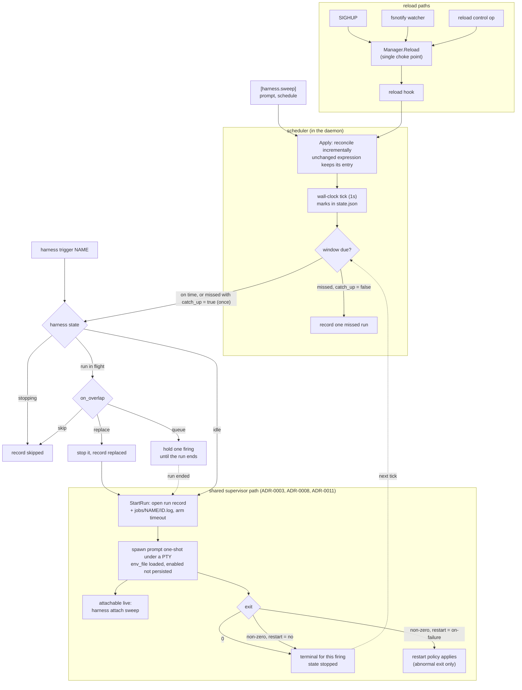

# ADR-0013: Scheduled one-shot runs — daemon-owned cron and `schedule` on `[harness.*]`

## Context and Problem Statement

Harness supervises *resident* processes. SPEC-0003 REQ "Restart On Exit"
respawns a harness after any exit its restart policy permits, including a clean
exit, because agents and watchers are meant to be long-lived. That is right for
a `claude --remote-control` that should never die, and wrong for the other half
of the work: nightly sweeps, weekly grooming, daily syncs. These are one-shot,
non-interactive runs that are *supposed* to finish.

Left outside Harness, that work lives in launchd plists and hand-rolled
scheduled tasks, so the question an operator most wants a cockpit for (*did the
03:00 agent run actually fire, and did it pass?*) is the one the cockpit cannot
answer. How does Harness run scheduled one-shot work under the daemon without
breaking the resident-harness model, and without bringing back the per-unit OS
sprawl ADR-0005 collapsed?

## Decision Drivers

* **Terminal by design.** A scheduled run must be allowed to *finish*.
  Restart-on-clean-exit is a feature for a resident harness and a bug for a
  scheduled one-shot.
* **One init unit, still.** ADR-0005 collapsed N per-harness systemd and launchd
  units into one. systemd timers on Linux against launchd
  `StartCalendarInterval` on macOS is exactly the OS branching that decision
  removed.
* **The daemon stays agnostic.** It runs a command and knows nothing about what
  is inside. A scheduler is a clock, not a domain: the daemon must not learn what
  a "sweep" is or how to deliver a notification.
* **Non-interactive, not invisible.** A scheduled run is unattended, yet hopping
  into a *running* one to watch it work is the signature Harness interaction.
* **A laptop is not a server.** The machine is asleep at 03:00. Missed windows,
  suspend and resume, and clock jumps are the normal case.
* **Scriptable from outside.** Something other than the daemon's clock (a CI
  job, another scheduler, an operator at a shell) must be able to run a job and
  get its result as an exit code.
* **Smallest thing that removes the external timer.** A `[harness.fleet-sweep]`
  block replaces a launchd plist.

## Considered Options

This ADR settles two independent questions.

### Decision 1 — Who owns the clock

* **Option 1 — A daemon-owned scheduler plus a manual trigger verb.** The
  daemon fires runs itself; `harness trigger <name>` runs one on demand through
  the same path.
* **Option 2 — OS timers.** systemd `.timer` units and launchd
  `StartCalendarInterval` invoke `harness trigger <name> --wait`; the daemon
  never learns what time it is.
* **Option 3 — A daemon-owned scheduler only.** No trigger verb; the existing
  `harness start <name>` is the manual path.

### Decision 2 — How a scheduled unit is expressed in config

* **Option 1 — A `schedule` key on `[harness.*]`.**
* **Option 2 — Distinct `[job.*]` tables**, sibling to `[harness.*]`.
* **Option 3 — `[schedule.*]` tables referencing a harness by name**, the
  systemd `.timer` / `.service` split.

## Decision Outcome

Decision 1: chosen option **Option 1 — A daemon-owned scheduler plus a manual
trigger verb**, because the daemon already *is* the supervisor, the state store,
and the thing systemd or launchd keeps alive. Giving it the clock costs one
goroutine and keeps ADR-0005's one-init-unit property on both platforms. The
trigger verb is what makes a job scriptable: `harness trigger <name>` enters
through the same `StartRun` a firing does, so unlike `start` it honors
`on_overlap`, and `--wait` streams the run and exits with its exit code. That is
the seam that lets an external scheduler drive a job when someone wants Option
2's properties, without the daemon adopting that model. The verb is `trigger`,
not `run`, because `harness run` is ADR-0017's scratchpad verb. `start` and
`stop` keep their meaning on a scheduled harness.

Decision 2: chosen option **Option 1 — A `schedule` key on `[harness.*]`**,
because the lifecycle distinction a separate table kind would carry already
exists on `[harness.*]`, and every ambiguity a key could introduce is answerable
with validation.

### Why a key rather than a table kind

The case for `[job.*]` (Decision 2, Option 2) rests on one claim: a job and a
harness have opposite lifecycles, so the difference must be a *type* rather than
a key, or every downstream surface ends up branching on the key. Two facts
answer it:

1. **`restart` is a key on `[harness.*]`** (ADR-0006), with values `no`,
   `always`, `unless-stopped` and `on-failure`. "Terminal by design", the
   defining property of a job, is `restart = "no"`, and it is already the
   default for a prompt harness.
2. **The prompt harness is a one-shot agent run** (ADR-0011), declared by
   `prompt` or `prompt_file`. The noun a job table would create already exists,
   with the right restart default, spawn path and ergonomics.

That leaves `schedule` as the one missing piece. The remaining objection, that
`enabled` and restart policy become ambiguous on a scheduled unit, is answered
by rejecting every ambiguous combination at parse time:

| Rejected | Because |
| --- | --- |
| `schedule` without `prompt` or `prompt_file` | A scheduled unit is a one-shot agent run, not a resident process |
| `schedule` with `enabled = true` | Autostart and schedule are distinct intents |
| `schedule` with profile membership | Profile autostart would fire the one-shot off-schedule, bypassing the `enabled` exclusion |
| `schedule` with `restart = "always"` or `"unless-stopped"` | A respawning policy restarts the one-shot after a clean exit, making the schedule meaningless |
| `schedule` in a project file | Project harnesses never enter the daemon's config view, so the schedule could never fire |
| An unparseable cron expression | A typo must fail the load with a located error, not silently never fire |

Each is a hard, located parse error. The cost a table kind would have avoided
is real and accepted: consumers that render a scheduled harness distinctly
branch on `Schedule != ""` (see Consequences).

### The schema

```toml
# ~/.config/harness/harness.toml

[harness.claude-src]              # resident: restart defaults to "always"
harness = "claude-code"
args = ["--remote-control", "--dangerously-skip-permissions"]

[harness.fleet-sweep]             # scheduled one-shot
harness = "claude-code"
prompt = "check all services and report anything unhealthy"
auto_accept = true
schedule = "CRON_TZ=UTC 0 */6 * * *"   # 5-field cron, or @daily / @every 6h
catch_up = true                   # run once on wake if a window was missed
timeout = "45m"                   # bound each run (default 1h; "0" = none)
description = "scheduled sweep (every 6 hours)"
```

`schedule` is a 5-field cron expression (`min hour dom mon dow`), one of the
`@daily`, `@hourly`, `@weekly`, `@monthly` or `@yearly` descriptors, or
`@every <duration>`. It is validated at parse time by the same parser the
scheduler uses (`robfig/cron`), so config and scheduler cannot disagree about
what is valid. It may carry a `CRON_TZ=<zone>` or `TZ=<zone>` prefix; see *Time
zones and DST*.

`catch_up` (default `false`) is the missed-window policy described under
*Clock*. It means nothing on a harness that has no firings to miss, so the
parser rejects it there and in project files, as it does `timeout`,
`on_overlap` and `keep_runs`, the run keys described under *Runs*. (Triggered
harnesses, ADR-0021, also have firings and accept the same keys.) Everything
else on the table means exactly what
ADR-0006 and ADR-0011 say: same parser, same `core.Harness`, same `env_file`
handling (ADR-0008), same prompt-harness argv synthesis.

`enabled` keeps its SPEC-0003 meaning of *autostart intent* and is forbidden
alongside `schedule`; it does not mean "armed".

### Firing semantics

At each firing the daemon starts the harness **if no run is in flight**. A
firing that arrives during a run follows the harness's `on_overlap` policy (see
*Runs*); none ever stacks a second process. A firing during a graceful stop is
recorded skipped and cannot resurrect the harness. A fresh scheduled attempt
clears a failed latch through the ordinary start path.

A firing starts the harness **without persisting `enabled` intent**.
A scheduled run that dies, cleanly or in a crash, therefore leaves no
`enabled = true` behind for the next boot's autostart to act on, and a stale
`enabled = true` already in `state.json` (from a manual `harness start`, say) is
ignored at restore for a scheduled harness: for it, the schedule is the intent.

The run exiting is terminal for that firing. The restart policy applies only to
an abnormal exit, and only if the operator configured `on-failure`.

### Clock: wall-clock evaluation, missed windows, catch-up

The daemon never arms a timer to a window. Once a second
(`scheduler.TickInterval`) it compares the wall clock against each armed
schedule's next window; that one-second ticker is the longest timer it holds. A
timer armed for 03:00 and carried across a laptop suspend fires whenever the
platform decides (Go's timers and monotonic clock do not advance while macOS or
Linux sleeps), so a wake at 08:00 would get an OS-dependent outcome. The tick
reaches a decision that is Harness's instead. The wall-clock reading has its
monotonic component stripped before any comparison, or Go would compare on the
very clock that stopped. Each firing is dispatched on its own goroutine, so a
slow start cannot delay evaluating anything else.

A window first evaluated more than `LateGrace` (one minute) after it was due was
not seen on time: the machine slept, the daemon was down, or the clock jumped.
For those windows:

* **`catch_up = true`** runs the harness **exactly once**, however many windows
  elapsed.
* **`catch_up = false`** (the default) runs nothing and records **exactly one**
  missed entry covering all of them.

If the most recent elapsed window is itself inside the grace, it runs as an
ordinary firing and only the older windows count as missed. Windows a slow tick
lands a few seconds late on coalesce into a single on-time run.

Each scheduled harness's position (the last window decided, with the expression
it was decided under) is persisted in `state.json` (extending ADR-0007) and
written synchronously **before** the run starts. A daemon started after an
outage resumes from it and takes the same code path a wake does, and a daemon
that crashes just after firing does not fire that window again on restart. A
position recorded under a different expression is discarded rather than used to
invent misses. A wall clock that steps backwards never re-decides a window
already decided; it delays the next run rather than repeating the last one.

Recording the miss is the point. Silently doing nothing is the classic laptop
cron failure, and a visible miss is what separates *"it ran and passed"* from
*"it never fired"*. The scheduler reports each miss through a `Recorder` seam;
the daemon records it as a `missed` entry in run history (see *Runs*) and a
warn-level log line.

### Time zones and DST

An expression is evaluated in the zone its `CRON_TZ=` or `TZ=` prefix names
(robfig/cron's own syntax, so the validating parser already understands it),
and otherwise in the daemon's local zone. There is no separate `timezone` key: a
second place to state a zone is a second place for it to disagree with the
expression. The binary embeds the IANA database, so a named zone validates the
same on a host with no zoneinfo installed.

DST splits schedules the way ISC cron does:

* An expression that fires in **every hour**, or any `@every` interval, is a
  cadence in real time. It runs once per real hour straight through both
  transitions.
* An expression **restricted to particular hours** names wall-clock times, and
  each wall-clock window runs exactly once. A window inside a spring-forward gap
  runs at the instant the pre-transition offset names (`30 2 * * *` runs at
  03:30 EDT, 24 real hours after the previous day's run), and a window repeated
  by a fall-back runs only at its first occurrence. robfig/cron's own `Next`
  skips the first case and runs the second twice, so the scheduler resolves
  these windows itself.

### Runs: history, per-run logs, timeout, overlap

Every run of a scheduled harness leaves a record (`run_id`, `trigger`,
`outcome`, `started_at`, `ended_at`, `exit_code`) and a log of its own at
`$XDG_STATE_HOME/harness/jobs/<name>/<run_id>.log`, next to, not instead of,
ADR-0007's rotating harness log. History records what the daemon *decided*, not
only what executed: `success`, `failed` and `timed_out` runs, and also `skipped`
and `missed` decisions that started nothing, runs `replaced` or `cancelled` by
an operator, and runs `interrupted` because the daemon went down under them.
That is what makes "it never fired" as visible as "it ran and failed".

* **The supervisor records; the Manager stores.** A run is opened and closed on
  the harness's actor loop, the one goroutine that sees spawn, exit, timeout,
  stop and shutdown in order. Lifecycle bus events can be dropped under
  backpressure, so they are not a foundation for history. The Manager hands out
  ids, bounds the history to `keep_runs` (default 20), deletes the logs of
  records that fall out, and persists it all in `state.json`, writing a run's id
  before the run starts.
* **Ids never repeat.** They count up per harness across restarts, and are
  floored at the highest log on disk, so even a lost history cannot reissue an
  id whose log still exists.
* **A crash is reconciled, not left running.** A record still `running` at boot
  becomes `interrupted` with no end time, since the true end is unknown, and its
  log gets a line saying so.
* **`timeout`** (default `1h`, `"0"` for none) bounds every run: SIGTERM to the
  process group, SIGKILL after the stop grace, recorded `timed_out`, harness left
  `failed`. A hung agent cannot own its schedule.
* **`on_overlap`** decides a firing that arrives mid-run: `skip` (default)
  records it skipped; `queue` holds one and starts it when the run ends on its
  own terms; `replace` stops the run (recorded replaced) and starts the new one.
  The decision is made on the actor loop, atomically with the start, so no other
  start can land between the check and the start.

Records carry outcomes, times and exit codes, never environment, `env_file`
contents, prompt text or output (ADR-0008). Run logs are created private to the
daemon's user and carry the same sanitized text as the harness log.

Clients read runs over the protocol: `jobs` (schedule, next window, the run in
flight, the latest record, consecutive failures), `runs` (history, newest
first), `trigger` (a manual run through `StartRun`), a `run` selector on `logs`,
and `job_run_started`, `job_run_finished` and `job_schedule_changed` events. The
CLI mirrors them as `harness jobs`, `harness runs`, `harness trigger [--wait]`
and `harness logs --run N`.

### Reconciliation, not rebuild

Schedules re-apply after **every** successful config reload. SIGHUP, the
fsnotify config watcher and the `reload` control op all funnel through
`Manager.Reload`, which invokes a single reload hook. Reconciliation is
**incremental**: an entry whose expression is unchanged keeps its registration,
and therefore its phase. Changing only `catch_up` updates the entry in place.

This is load-bearing, not an optimization. Rebuilding every entry on reload
resets each `@every` interval's countdown, and a dotfiles manager may rewrite
`harness.toml` on a timer whether or not anything changed. A
rebuild-on-reload scheduler would let an `@every 6h` sweep reset more often than
it fires, and never fire at all.

### Execution reuses the supervisor path

A scheduled run is an ordinary supervised PTY spawn: the same
`internal/supervisor` spawn path, the same `env_file` loading (ADR-0008), the
same `x/vt` emulator and scrollback ring (ADR-0003). `harness attach
fleet-sweep` shows the 03:00 agent working while it works, and the run gets the
PTY semantics agent CLIs generally need.

### Consequences

* Good, because recurring work moves into the same cockpit as resident agents,
  and a `[harness.*]` block replaces a launchd plist.
* Good, because no OS units are created: one systemd or launchd unit still
  supervises everything, and the Linux/macOS branching ADR-0005 removed stays
  removed.
* Good, because attaching to a running job falls out of the shared PTY path:
  the "hop" applies to scheduled work.
* Good, because the schema grew by one scheduling key plus its run keys, and a
  scheduled harness is still a harness, so `start`, `stop`, `attach` and `logs`
  already do the right thing.
* Good, because every ambiguous combination is a located parse error rather
  than a silently ignored key.
* Good, because a firing never persists `enabled` intent, so an unclean daemon
  exit mid-run cannot autostart the one-shot off-schedule on the next boot.
* Good, because a laptop that sleeps through a window reaches a deliberate,
  tested decision on wake (run once, or record the miss) rather than whatever
  the OS did to a long timer, and a missed window is never silent.
* Good, because *"did last night's run pass, and what did it print?"* has an
  answer: a bounded, restart-safe run history and one log per run, including
  records for the runs that never started.
* Good, because a job can be driven from outside the daemon:
  `harness trigger <job> --wait` streams the run and exits with its exit code
  (124 for a timeout, 75 when skipped), so it composes like the command it
  wraps.
* Bad, because consumers branch on `Schedule != ""` rather than on a type. Every
  rendering surface pays it separately: `ls`, `describe` and the cockpit each
  carry their own arm so a scheduled harness does not read as an inert, disabled
  one-shot. The shared phrasing lives in `internal/schedfmt`; the
  branching does not. SPEC-0008 REQ "Schedule Visibility" holds them to the same
  answer.
* Bad, because the daemon is now a scheduler, and clock correctness (DST,
  suspend and resume, zone data, wall-clock jumps) is Harness's bug surface. It
  is contained in `internal/scheduler`, behind an injectable clock, with each of
  those cases pinned by a test that runs in milliseconds.
* Bad, because the daemon wakes once a second for as long as it runs, whether
  or not anything is scheduled. A tick is one comparison per armed entry; the
  cost is the wakeup, not the work.
* Bad, because on-disk footprint grows from O(harnesses) to O(scheduled
  harnesses × `keep_runs`) run logs. `keep_runs` is a first-class key, and
  pruning deletes a log with its record, for that reason.
* Bad, because **if the daemon is down at 03:00, the run does not fire at
  03:00.** System cron would have. The daemon notices on its next boot:
  `catch_up = true` runs it once, and `catch_up = false` records a `missed` run.

### Confirmation

SPEC-0008 formalizes the `schedule` key, its exclusions, the firing guard, the
clock, run history and reload reconciliation as testable requirements and
scenarios. Acceptance tests:

* A harness with `@every 1s` fires repeatedly and never restarts on exit 0.
* Re-applying an unchanged config preserves each entry's registration identity,
  so its phase survives a no-change config rewrite.
* Changing an expression re-registers the entry; removing `schedule` removes it.
* Every rejected combination in the table above fails config parsing with an
  error naming the harness and the offending key.
* The reload hook fires on `Reload` and `ReloadFromFile`, and does not fire on a
  failed parse.
* `schedule` survives a TUI edit round trip that touches an unrelated field.
* A firing does not persist `enabled`, and a stale `enabled = true` on a
  scheduled harness does not autostart it at boot.
* Advancing a fake clock past five windows in one jump runs once with
  `catch_up = true` and records exactly one miss without it, and a daemon
  started after the same outage decides identically.
* A restart just after a firing, and a backwards clock step, do not refire.
* A time-of-day schedule runs exactly once on both DST transition days; an
  every-hour cadence runs once per real hour through them.
* `CRON_TZ=` and `TZ=` override the daemon's zone, including half-hour zones.
* Outside `clock.go` the scheduler package neither reads the time nor arms a
  timer, enforced by a source-scan test.
* Every run outcome is reachable through the real supervisor path and recorded,
  including `skipped`, `missed` and held-firing `cancelled` with no process.
* Run ids survive a restart and floor at the logs on disk; `keep_runs` prunes
  records and logs together and never the run in flight.
* A record left `running` by a crash boots as `interrupted`; a malformed history
  costs only its own harness; a `state.json` written before run history existed
  loads.
* A run exceeding `timeout` is killed, including one that ignores SIGTERM, and
  recorded `timed_out`; every run log opened is closed on every exit path.
* `queue` holds one firing and skips the next; `replace` records the old run
  replaced; a stop cancels both the run and the held firing.
* No `env_file` value reaches run records or `state.json`.

## Pros and Cons of the Options

### Decision 1, Option 1 — Daemon-owned scheduler plus a trigger verb

* Good, because it preserves ADR-0005's one-init-unit property on Linux and
  macOS with no per-unit OS units.
* Good, because the daemon already owns state, PTYs and logs.
* Good, because `harness trigger --wait` propagating the exit code lets an
  external scheduler drive a job without the daemon giving up the clock.
* Good, because `trigger` honors `on_overlap` and names the intent more
  precisely than `start` does for a one-shot.
* Neutral, because it adds a scheduler goroutine to a daemon that previously
  only reacted to process exits.
* Bad, because a daemon that is down at the scheduled instant misses the
  window. The miss is recorded on the next boot, and `catch_up` can run it once.
* Bad, because DST, zone data and suspend correctness become Harness's problem
  rather than systemd's.

### Decision 1, Option 2 — OS timers invoke the trigger verb

* Good, because timing correctness, including `Persistent=true` catch-up, is
  handled by software far more hardened than Harness's.
* Good, because a run still fires when the daemon happens to be down.
* Bad, because it brings back the N-units-per-thing sprawl ADR-0005 collapsed,
  and the `systemctl` against `launchctl` branching that decision deleted.
* Bad, because the schedule lives outside `harness.toml`, so the config file
  stops being a complete description of what the daemon does, breaking
  ADR-0006's config-of-record property.
* Bad, because the TUI cannot show "next run" without parsing systemd and
  launchd state, on two platforms, in two formats.

### Decision 1, Option 3 — Daemon-owned scheduler only

* Good, because it adds no command surface: `harness start` runs a scheduled
  harness now through the ordinary start path.
* Bad, because `start` does not honor `on_overlap`, so a manual run can collide
  with a scheduled one in ways a firing never would.
* Bad, because `start` returns at once, so nothing outside the daemon can wait
  for a run and act on its exit code.

### Decision 2, Option 1 — A `schedule` key on `[harness.*]`

* Good, because it is the smallest schema change: one parser, one registry, one
  mental model.
* Good, because ADR-0011's prompt harness already supplies the one-shot noun and
  the `restart = "no"` default, so "terminal by design" needs no new table.
* Good, because every ambiguity a key could introduce is a hard parse error.
* Bad, because consumers branch on `Schedule != ""` to decide how to render,
  which is a type distinction wearing a key's clothing.
* Bad, because a genuinely dual-purpose process cannot be both resident and
  scheduled without being declared twice.

### Decision 2, Option 2 — Distinct `[job.*]` tables

A job is its own noun, sharing the underlying Go types with a harness.

* Good, because job-appropriate defaults (never restart, a timeout,
  `keep_runs`) are natural on their own table rather than conditional on a key.
* Good, because the TUI and `ps` would branch on a type, and `[harness.*]` would
  stay exactly the schema ADR-0006 defined.
* Neutral, because it adds a second table kind to the parser and a second
  registry dimension in the daemon.
* Bad, because the lifecycle distinction it exists to carry is already carried
  by `restart` and the prompt harness, so the new type duplicates existing
  structure.
* Bad, because a second table kind means a second state vocabulary across the
  protocol, CLI and TUI, a larger downstream cost than validation on one table.
* Bad, because a dual-purpose process must still be written twice.

### Decision 2, Option 3 — `[schedule.*]` referencing a harness

The systemd `.timer` / `.service` split: a schedule table names a harness to
fire.

* Good, because it attaches a schedule to something already defined, and could
  put several schedules on one unit.
* Bad, because it splits one job across two tables that must be read together
  to understand either.
* Bad, because it requires a harness that must never autostart and exists only
  to be referenced: a dangling unit that breaks the "a harness is a thing that
  runs" invariant.
* Bad, because it inherits systemd's most-complained-about ergonomic for no
  benefit Harness needs.

## Architecture Diagram



## More Information

* **Extends ADR-0005** — places the scheduler inside the daemon so the init
  layer stays exactly one unit. SPEC-0003 REQ "Restart On Exit" already applies
  only while a harness is enabled *and its restart policy permits it*, so
  scheduling needs no SPEC-0003 change.
* **Extends ADR-0006** — adds `schedule` and the run keys to the `[harness.*]`
  schema. Profiles are untouched, and profile membership is forbidden for a
  scheduled harness.
* **Extends ADR-0007** — `state.json` carries each schedule's position (the
  last window decided), which is what makes a missed window detectable across a
  daemon restart, and each scheduled harness's run history. Per-run logs live
  beside it under `jobs/`.
* **Related ADR-0011** — the scheduled unit is a prompt one-shot; `schedule`
  requires `prompt` or `prompt_file`, and the `restart = "no"` prompt default is
  what makes the run terminal.
* **Related ADR-0002** — adds the `jobs`, `trigger` and `runs` control ops,
  mirrored as CLI verbs; `start`, `stop` and `attach` on a scheduled harness
  remain the existing thin-client gestures.
* **Related ADR-0003** — scheduled runs use the same owned PTY and `x/vt`
  emulator, which is what makes attaching to an in-flight run work at all.
* **Related ADR-0008** — scheduled runs load `env_file` through the same path,
  and run records never carry it.
* **Related ADR-0009** — project files reject `schedule`, because project
  harnesses never enter the daemon's config view and a project schedule could
  never fire.
* **Related ADR-0017** — owns `harness run`, which is why the manual verb here
  is `trigger`.
* **Related ADR-0021** — triggered harnesses reuse the run keys, run history and
  `trigger` verb defined here (SPEC-0014).
* **Governs SPEC-0008** — the formal requirements and scenarios.
* **Not decided here:** `scheduled` and `completed` harness states; a dedicated
  jobs view in the TUI (scheduled harnesses appear in the ordinary list with
  their next window); arming and disarming a schedule from a client; `tty =
  false`; `on_failure` hooks and notifiers (a notifier is a client of the event
  stream, never the daemon); scheduled units as `[profile.*]` members; retry
  within a window; a daemon-wide concurrent-run cap; project-scoped schedules.
