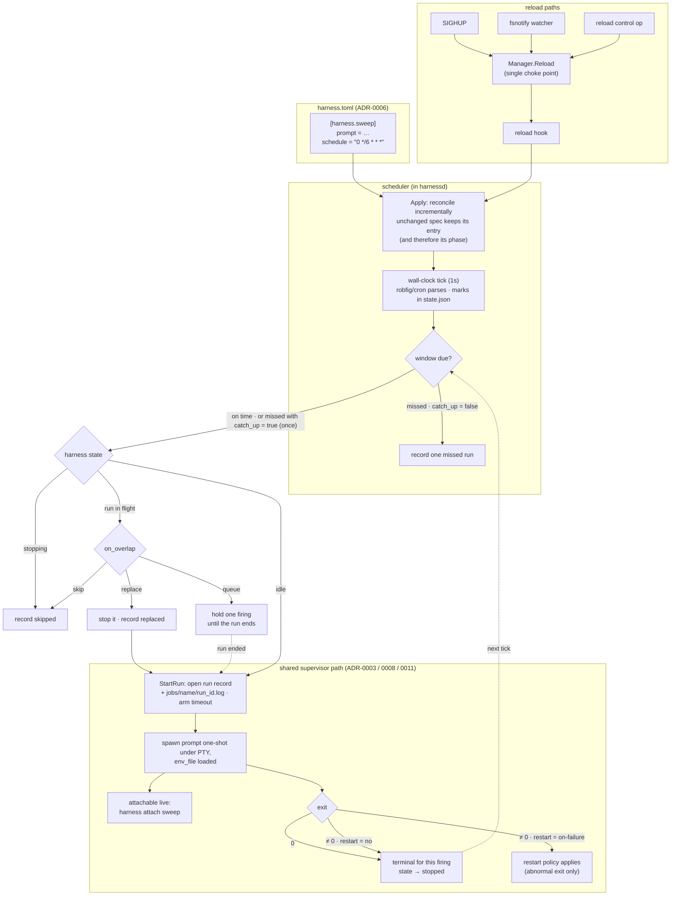

# ADR-0013: Scheduled one-shot runs — daemon-owned cron and `schedule` on `[harness.*]`

## Context and Problem Statement

Harness supervises *resident* processes. SPEC-0003 REQ "Restart On Exit" was
originally explicit about it: *"any exit — including a clean exit code 0 — SHALL
be followed by a restart per policy … agents and watchers are meant to be
long-lived."* That is exactly right for a `claude --remote-control` that should
never die, and exactly wrong for the other half of the work: nightly sweeps,
weekly grooming, daily syncs — one-shot, non-interactive runs that are *supposed*
to finish.

Today that work lives outside Harness entirely, in launchd plists and
hand-rolled scheduled tasks, which means the thing you most want a cockpit for
— *did the 3am agent run actually fire, and did it pass?* — is the one thing the
cockpit can't see. How do we run scheduled one-shot work under the daemon
without breaking the resident-harness model, and without reintroducing the
per-unit OS sprawl ADR-0005 deliberately collapsed?

## Decision Drivers

* **Terminal by design.** A scheduled run must be allowed to *finish*.
  Restart-on-clean-exit is a feature for a resident harness and a bug for a
  scheduled one-shot.
* **One init unit, still.** ADR-0005 collapsed N per-harness systemd/launchd
  units down to one. `systemd` timers on Linux versus launchd
  `StartCalendarInterval` on macOS is precisely the OS branching that decision
  removed. Scheduling must not smuggle it back in.
* **The daemon stays agnostic.** It runs a command and knows nothing about what
  is inside. A scheduler is a clock, not a domain — the daemon must not learn
  what a "sweep" is or how to deliver a notification.
* **Non-interactive, but not invisible.** A scheduled run runs unattended, yet
  hopping into a *running* one to watch it work is the signature Harness
  interaction. Scheduled execution must not become a blind pipe.
* **A laptop is not a server.** The machine is asleep at 03:00. Missed windows,
  suspend/resume, and clock jumps are the normal case here, not the exception.
* **Smallest thing that removes the external timer.** The concrete goal is that a
  `[harness.fleet-sweep]` block replaces a launchd plist. Machinery beyond
  that is speculative until the basic loop is in use.

## Considered Options

The decision has two orthogonal axes, and this ADR settles both.

**Axis 1 — who owns the clock:**

* **1A. Daemon-owned scheduler, plus a manual trigger verb** (drafted as
  `harness run`; shipped by #120 as `harness trigger`).
* **1B. OS timers** (systemd `.timer`, launchd `StartCalendarInterval`) invoke
  `harness trigger <job> --wait`; the daemon stays ignorant of time.
* **1C. Daemon-owned scheduler only** — no new manual-trigger verb; the existing
  `harness start <name>` is the manual path.

**Axis 2 — how a scheduled unit is expressed in config:**

* **2A. Distinct `[job.*]` tables**, sibling to `[harness.*]`.
* **2B. `[harness.*]` with a `schedule` key.**
* **2C. `[schedule.*]` tables referencing a harness by name** — the systemd
  `.timer`/`.service` split.

## Decision Outcome

Chosen options: **1C (daemon-owned scheduler, no new trigger verb)** and **2B
(`schedule` key on `[harness.*]`)**.

> **Revision note (2026-08-13).** This ADR was drafted on 2026-07-26 proposing
> **1A + 2A** (a `harness run` verb and distinct `[job.*]` tables) and landed in
> that form as `status: proposed` via #112. The feature that actually shipped in
> #122 implements **1C + 2B**. This revision rewrites the Decision Outcome to
> record the decision as taken, and moves the unbuilt `[job.*]` machinery into
> **Deferred**. The original 2A rationale is preserved verbatim under *Pros and
> Cons of the Options* — it was not wrong, it was outvoted by a schema change
> that landed in between. See "Why 2B, given 2A's argument" below.
>
> **Revision note (2026-09-11).** #117 replaced the timer-driven `robfig/cron`
> runner with a wall-clock tick, added missed-window detection and the
> `catch_up` key, persisted each schedule's position in `state.json`, and
> specified time zones (`CRON_TZ=`/`TZ=` prefixes) and DST behavior. Those move
> out of **Deferred** and into *Clock* and *Time zones and DST* below. Run
> history (#119) and the protocol/CLI surface (#120) remain deferred.
>
> **Revision note (2026-09-11, #119).** Run history, per-run logs, `timeout`,
> and `on_overlap` (skip, queue, replace) were built; see *Runs* below. They
> leave **Deferred**. The protocol/CLI surface that reads them (#120) remains.
>
> **Revision note (2026-09-11, #120).** The `jobs`, `trigger` and `runs` control
> ops, a `run` selector on `logs`, the `job_run_*` and `job_schedule_changed`
> events, and their CLI verbs were built. That adds option 1A's manual-trigger
> verb after all, named `trigger`; see *Decision Outcome*.

1C because the daemon already *is* the supervisor, the state store, and the thing
systemd/launchd keeps alive — giving it the clock costs one goroutine and keeps
ADR-0005's "one init unit" property intact across both platforms. No new
trigger verb was needed because a scheduled harness is still a harness:
`harness start <name>` runs it now, through the identical code path the cron
firing uses, so triggering by hand is a genuine test of what fires at 03:00.

That verb arrived with #120 regardless, once run history made it worth having —
the reason option 1A's Neutral bullet gave for waiting. `harness trigger <name>`
enters through the same `StartRun` a firing does, so unlike `start` it honors
`on_overlap`; and `--wait` streams the run and exits with its exit code, which is
the seam that lets an external scheduler (option 1B) drive a job without the
daemon adopting that model. It is `trigger` rather than 1A's `run` because
`harness run` had meanwhile become ADR-0017's scratchpad verb. `start` and `stop`
keep their meaning.

2B because the structural argument for a separate table kind dissolved once
`restart` shipped as a user-facing key.

### Why 2B, given 2A's argument

2A's case rested on one claim: a job and a harness have opposite lifecycles, so
the difference must be a *type* rather than a key, or every downstream surface
ends up branching on the presence of a key. That claim was sound when it was
written. Two things changed before implementation:

1. **`restart` became a real key on `[harness.*]`** (ADR-0006), with values
   `no` / `always` / `unless-stopped` / `on-failure`. "Terminal by design" — the
   defining property of a job — stopped needing a new table to express it. It is
   `restart = "no"`, and it is already the default for a prompt harness.
2. **ADR-0011 introduced the prompt harness**, a one-shot agent run declared by
   `prompt` instead of `cmd`. The noun 2A wanted to create already existed as a
   harness kind, with the right restart default, the right spawn path, and the
   right ergonomics.

That left `schedule` as the one genuinely missing piece, and 2A's remaining
objection — that `enabled` and `restart_delay` become "silently ambiguous" on a
scheduled unit — is answerable with validation rather than a second table type.
The parser rejects every ambiguous combination outright:

| Rejected | Because |
| --- | --- |
| `schedule` without `prompt` | A scheduled unit is a one-shot agent run, not an always-on `cmd` |
| `schedule` with `enabled = true` | Autostart and schedule are distinct intents; this is the ambiguity 2A named |
| `schedule` with profile membership | Profile autostart would fire the one-shot off-schedule, bypassing the `enabled` exclusion |
| `schedule` with `restart = "always"` / `"unless-stopped"` | A respawning policy restarts the one-shot after a clean exit, making the schedule meaningless |
| `schedule` in a project file | Project harnesses never enter the daemon's config view, so the schedule could never fire |
| An unparseable cron expression | A typo must fail the load with a located error, not silently never fire |

Each of these is a hard, located parse error. The ambiguity 2A predicted is real;
the fix turned out to be cheaper than a second table kind, a second registry
dimension, and a second state vocabulary across the protocol, CLI, and TUI.

The cost 2A named is *not* fully avoided, and is recorded in Consequences below:
consumers that want to render a scheduled harness distinctly do branch on
`Schedule != ""`. That is a real ongoing tax, accepted deliberately.

### The schema

```toml
# ~/.config/harness/harness.toml

[harness.claude-src]              # resident: restart defaults to "always"
cmd = "claude"
args = ["--remote-control", "--dangerously-skip-permissions"]

[harness.fleet-sweep]        # scheduled one-shot
prompt = "check all StumpCloud services and report anything unhealthy"
auto_accept = true
schedule = "CRON_TZ=UTC 0 */6 * * *"   # 5-field cron, or @daily / @every 6h
catch_up = true                   # run once on wake if a window was missed
timeout = "45m"                   # bound each run (default 1h; "0" = none)
description = "scheduled sweep (every 6 hours)"
```

`schedule` is a 5-field cron expression (`min hour dom mon dow`), the
`@daily`/`@hourly`/`@weekly`/`@monthly`/`@yearly` descriptors, or
`@every <duration>` — validated at parse time by the same parser the scheduler
itself uses, so config and scheduler cannot disagree about what is valid. It
may carry a `CRON_TZ=<zone>` or `TZ=<zone>` prefix; see *Time zones and DST*.

`catch_up` (default `false`) is the missed-window policy described under
*Clock* below. It means nothing without `schedule`, so the parser rejects it
there, and in project files, on the same terms as the exclusions above. So are
`timeout`, `on_overlap` and `keep_runs`, the run keys described under *Runs*.
Everything else on the table means exactly what ADR-0006 and ADR-0011 already say
it means: same parser, same `core.Harness`, same `env_file` handling (ADR-0008),
same prompt-harness argv synthesis.

`enabled` keeps its SPEC-0003 meaning of *autostart intent* and is simply
forbidden alongside `schedule`; it was **not** redefined to mean "armed."

### Firing semantics

At each cron firing the daemon starts the harness **if no run is in flight**. A
firing that arrives while one is follows the harness's `on_overlap` policy (see
*Runs*); none of them ever stacks a second process. A firing landing during a
graceful stop is recorded skipped and cannot resurrect the harness. A fresh
scheduled attempt clears a failed latch through the ordinary start path.

The run exiting is terminal for that firing. The restart policy applies only to
abnormal exit, and only if the operator configured `on-failure`.

### Clock: wall-clock evaluation, missed windows, catch-up

The daemon never arms a timer to a window. Once a second
(`scheduler.TickInterval`) it compares the wall clock against each armed
schedule's next window, and that one-second ticker is the longest timer it
holds. A timer armed for 03:00 and carried across a laptop suspend fires
whenever the platform decides — Go's timers and its monotonic clock do not
advance while macOS or Linux sleeps — so a wake at 08:00 would get an
OS-dependent outcome. The tick reaches a decision that is ours instead. The
wall-clock reading has its monotonic component stripped before any comparison,
or Go would compare on precisely the clock that stopped. Firing is dispatched
on its own goroutine, so a slow start cannot delay evaluating anything else.

A window first evaluated more than `LateGrace` (one minute) after it was due
was not seen on time: the machine slept, the daemon was down, or the clock
jumped forward. For those windows:

* **`catch_up = true`** runs the harness **exactly once**, however many windows
  elapsed.
* **`catch_up = false`** (the default) runs nothing and records **exactly one**
  missed entry covering all of them.

If the most recent elapsed window is itself inside the grace, it runs as an
ordinary firing and only the older windows count as missed. Windows a slow tick
lands a few seconds late on coalesce into a single on-time run.

Each scheduled harness's position — the last window decided, with the
expression it was decided under — is persisted in `state.json` (extending
ADR-0007) and written synchronously **before** the run starts. So a daemon
started after an outage resumes from it and takes the same code path a wake
does, and a daemon that crashes just after firing does not fire that window
again on restart. A position recorded under a different expression is
discarded rather than used to invent misses. A wall clock that steps backwards
never re-decides a window already decided; it delays the next run rather than
repeating the last one.

Recording the miss is the point. Silently doing nothing is the classic laptop
cron failure, and a visible miss is what separates *"it ran and passed"* from
*"it never fired."* The scheduler reports it through a `Recorder` seam, and the
daemon records it as a `missed` entry in run history (see *Runs*) as well as a
warn-level log line.

### Time zones and DST

An expression is evaluated in the zone its `CRON_TZ=`/`TZ=` prefix names —
robfig/cron's own syntax, so the validating parser already understood it — and
otherwise in the daemon's local zone. There is no separate `timezone` key: a
second place to state a zone is a second place for it to disagree with the
expression. The binary embeds the IANA database, so a named zone validates the
same on a host with no zoneinfo installed.

DST splits schedules the way ISC cron splits them:

* An expression that fires in **every hour**, or any `@every` interval, is a
  cadence in real time. It runs once per real hour straight through both
  transitions.
* An expression **restricted to particular hours** names wall-clock times, and
  each wall-clock window runs exactly once. A window inside a spring-forward gap
  runs at the instant the pre-transition offset names (`30 2 * * *` runs at
  03:30 EDT, 24 real hours after the previous day's run), and a window repeated
  by a fall-back runs only at its first occurrence. robfig/cron's own `Next`
  skipped the first case outright and ran the second twice; the scheduler
  resolves these windows itself.

### Runs: history, per-run logs, timeout, overlap

Every run of a scheduled harness leaves a record — `{run_id, trigger, outcome,
started_at, ended_at, exit_code}` — and a log of its own at
`$XDG_STATE_HOME/harness/jobs/<name>/<run_id>.log`, next to (not instead of)
ADR-0007's rotating harness log. History records what the daemon *decided*, not
only what executed: `success`, `failed` and `timed_out` runs, but also `skipped`
and `missed` decisions that started nothing, runs `replaced` or `cancelled` by an
operator, and runs `interrupted` because the daemon went down under them. That
is what makes "it never fired" as visible as "it ran and failed".

* **The supervisor records; the Manager stores.** A run is opened and closed on
  the harness's actor loop, the one goroutine that sees spawn, exit, timeout,
  stop and shutdown in order — lifecycle bus events can be dropped under
  backpressure, so they are not a foundation for history. The Manager hands out
  ids, bounds the history to `keep_runs` (default 20), deletes the logs of
  records that fall out, and persists it all in `state.json`, writing a run's id
  before the run starts.
* **Ids never repeat.** They count up per harness across restarts, and are
  floored at the highest log on disk, so even a lost history cannot reissue an
  id whose log still exists.
* **A crash is reconciled, not left running.** A record still `running` at boot
  becomes `interrupted` with no end time — the true end is unknown — and its log
  gets a line saying so.
* **`timeout`** (default `1h`, `"0"` for none) bounds every run: SIGTERM to the
  process group, SIGKILL after the stop grace, recorded `timed_out`, harness left
  `failed`. A hung agent no longer owns its schedule.
* **`on_overlap`** decides a firing that arrives mid-run: `skip` (default)
  records it skipped; `queue` holds one and starts it when the run ends on its
  own terms; `replace` stops the run (recorded replaced) and starts the new one.
  The decision is made on the actor loop, atomically with the start, which also
  retires the daemon's old read-the-state-then-start guard and its race.

Records carry outcomes, times and exit codes — never environment, `env_file`
contents, prompt text or output (ADR-0008). Run logs are created private to the
daemon's user. The histories are exposed to the rest of the daemon as exact run
windows (`Manager.Runs`), which is what #120's `harness logs <job> --run N` and
run correlation need.

Clients read them over the protocol (#120): `jobs` (schedule, next window, the
run in flight, the latest record, consecutive failures), `runs` (history,
newest first), `trigger` (a manual run through `StartRun`), a `run` selector on
`logs`, and `job_run_started` / `job_run_finished` / `job_schedule_changed`
events. The CLI mirrors them as `harness jobs`, `harness runs`,
`harness trigger [--wait]` and `harness logs --run N`.

### Reconciliation, not rebuild

Schedules re-apply after **every** successful config reload — SIGHUP, the
fsnotify config watcher, and the `reload` control op all funnel through
`Manager.Reload`, which invokes a single reload hook. Reconciliation is
**incremental**: an entry whose spec is unchanged keeps its existing
registration, and therefore its phase. Changing only `catch_up` updates the
entry in place.

This is load-bearing, not an optimization. Rebuilding the cron on every reload
resets each `@every` interval's countdown, and this config file is rewritten
periodically by chezmoi and `czu` whether or not anything changed — so a
rebuild-on-reload scheduler would let an `@every 6h` sweep never fire at all.

### Execution reuses the supervisor path verbatim

A scheduled run is an ordinary supervised PTY spawn: same `internal/supervisor`
spawn path, same `env_file` loading (ADR-0008), same `x/vt` emulator and
scrollback ring (ADR-0003). `harness attach fleet-sweep` lets you watch the
03:00 agent work while it works, and the run inherits the PTY semantics agent
CLIs generally need.

### Consequences

* Good, because recurring work moves into the same cockpit as resident agents,
  and a `[harness.*]` block replaces a launchd plist.
* Good, because zero new OS units are created; one systemd/launchd unit still
  supervises everything, and the Linux/macOS branching ADR-0005 removed stays
  removed.
* Good, because attach-a-running-job falls out of the shared PTY path for free —
  the signature "hop" interaction now applies to scheduled work.
* Good, because the config schema grew by exactly one key, and the manual path
  (`harness start`) is the scheduled path, so there is no parallel
  implementation to keep honest.
* Good, because every ambiguous combination is a located parse error rather than
  a silently-ignored key.
* Bad, because consumers branch on `Schedule != ""` rather than on a type — the
  exact cost 2A named. Every rendering surface pays it separately: `ls`,
  `describe` and the cockpit each carry their own `Schedule != ""` arm so a
  scheduled harness does not read as an inert disabled one-shot
  (#160,
  #205; the shared
  phrasing lives in `internal/schedfmt`, the branching does not). SPEC-0008 REQ
  "Schedule Visibility" is what holds them to the same answer.
* Bad, because a firing goes through `Manager.Start`, which persists
  `enabled = true` — so an unclean daemon exit mid-run can autostart the one-shot
  off-schedule on the next boot, defeating the `enabled` exclusion the parser
  enforces. Tracked as
  #159; the fix is a
  supervisor-level "start without persisting intent" primitive.
* Good, because a laptop that sleeps through a window reaches a deliberate,
  tested decision on wake — run once, or record the miss — rather than whatever
  the OS did to a long timer, and a missed window is never silent.
* Bad, because the daemon is now a scheduler, and clock correctness — DST,
  suspend/resume, timezone data, wall-clock jumps — becomes our bug surface. It
  is contained in `internal/scheduler`, behind an injectable clock, with each of
  those cases pinned by a test that runs in milliseconds.
* Bad, because the daemon wakes once a second for as long as it runs, whether or
  not anything is scheduled. A tick is one comparison per armed entry; the cost
  is the wakeup, not the work.
* Good, because *"did last night's run pass, and what did it print?"* has an
  answer: a bounded, restart-safe run history and one log per run, including
  records for the runs that never started.
* Bad, because on-disk footprint grows from O(harnesses) to O(scheduled
  harnesses × `keep_runs`) run logs. `keep_runs` is a first-class key, and
  pruning deletes a log with its record, for that reason.
* Good, because a job can be driven from outside the daemon:
  `harness trigger <job> --wait` streams the run and exits with its exit code
  (124 for a timeout, 75 when skipped), so it composes like the command it wraps.
* Bad, because **if `harnessd` is down at 03:00, the run does not fire at
  03:00.** System cron would have. The daemon notices on its next boot —
  `catch_up = true` runs it once, `catch_up = false` records a `missed` run.

### Confirmation

SPEC-0008 (`scheduled-jobs`) formalizes the `schedule` key, its exclusions, the
firing guard, and reload reconciliation as testable requirements and scenarios.

Acceptance tests, all present:

* A harness with `@every 1s` fires repeatedly and never restarts on exit 0.
* Re-applying an unchanged config preserves each entry's cron registration
  identity, so its phase survives a no-change config rewrite.
* Changing a spec re-registers the entry; removing `schedule` removes it.
* Every rejected combination in the table above fails config parsing with an
  error naming the harness and the offending key.
* The reload hook fires on `Reload` and `ReloadFromFile`, and does not fire on a
  failed parse.
* `schedule` survives a TUI edit round-trip that touches an unrelated field.
* Advancing a fake clock past five windows in one jump runs once with
  `catch_up = true` and records exactly one miss without it, and a daemon
  started after the same outage decides identically.
* A restart just after a firing, and a backwards clock step, do not refire.
* A time-of-day schedule runs exactly once on both DST transition days; an
  every-hour cadence runs once per real hour through them.
* `CRON_TZ=`/`TZ=` override the daemon's zone, including half-hour zones.
* Outside `clock.go` the scheduler package neither reads the time nor arms a
  timer — enforced by a source-scan test.
* Every run outcome is reachable through the real supervisor path and recorded,
  including `skipped`, `missed` and held-firing `cancelled` with no process.
* Run ids survive a restart and floor at the logs on disk; `keep_runs` prunes
  records and logs together and never the run in flight.
* A record left `running` by a crash boots as `interrupted`; a malformed history
  costs only its own harness; a pre-history `state.json` loads.
* A run exceeding `timeout` is killed — including one that ignores SIGTERM — and
  recorded `timed_out`; every run log opened is closed on every exit path.
* `queue` holds one firing and skips the next; `replace` records the old run
  replaced; a stop cancels both the run and the held firing.
* No `env_file` value reaches run records or `state.json`.

### Deferred

Everything below was specified in this ADR's original 2026-07-26 draft and is
**not implemented**. It is retained as the roadmap it is, not as a description of
current behavior:

* **`scheduled` / `completed` states** and a `consecutive_failures` counter.
* **Job rows in the TUI cockpit**, and arming or disarming a schedule from a
  client.
* **`tty = false`**, `on_failure` hooks and notifiers, scheduled units as
  `[profile.*]` members, retry-within-a-window, and a daemon-wide concurrent-run
  cap.
* **Project-scoped schedules** — project files reject `schedule` outright today,
  which sidesteps rather than solves ADR-0009's runtime-only registration
  problem.

## Pros and Cons of the Options

### 1C — Daemon-owned scheduler, no new trigger verb (chosen)

The daemon carries an internal cron engine driven from config; the existing
`harness start <name>` is the manual trigger.

* Good, because it preserves ADR-0005's "one init unit" property on both Linux
  and macOS with no per-unit OS units.
* Good, because the daemon already owns state, PTYs, and logs.
* Good, because it adds no command surface at all — a scheduled harness is still
  a harness, so `start`, `stop`, `attach`, and `logs` already do the right thing.
* Neutral, because it adds a scheduler goroutine to a daemon that previously
  only reacted to process exits.
* Bad, because a daemon that is down at the scheduled instant misses the
  window. (Since #117 the miss is recorded on the next boot, and `catch_up`
  can run it once.)
* Bad, because DST, timezone data, and suspend/resume correctness become our
  problem rather than systemd's.

### 1A — Daemon-owned scheduler + a manual trigger verb

As 1C, plus a dedicated manual trigger verb — drafted as `harness run <name>`,
shipped by #120 as `harness trigger <name>` — with `--wait` streaming output and
propagating the run's exit code.

* Good, because `--wait` propagating an exit code is the cheap seam that lets an
  external scheduler drive Harness if someone wants 1B's properties.
* Good, because `trigger` names the intent more precisely than `start` does for a
  one-shot.
* Bad, as drafted, because `harness run` collided conceptually with
  `harness daemon run`, and later outright with ADR-0017's scratchpad verb.
  Shipping the verb as `trigger` removes both collisions.
* Neutral, because without run history there is nothing for `--wait` to report
  beyond the exit code, which `start` plus `attach` already approximates.
  Reconsider alongside run history. (#119 added run history; #120 then added
  the verb.)

### 1B — OS timers invoke the trigger verb

systemd `.timer` units on Linux and launchd `StartCalendarInterval` on macOS
fire `harness trigger <name> --wait`; the daemon never learns what time it is.

* Good, because timing correctness — including `Persistent=true` catch-up — is
  handled by software with far more hardening than ours.
* Good, because a run still fires when the daemon happens to be down.
* Bad, because it reintroduces exactly the N-units-per-thing sprawl ADR-0005
  collapsed, and revives the `systemctl` versus `launchctl` branching that
  decision deleted from the codebase.
* Bad, because the schedule lives outside `harness.toml`, so the config file
  stops being a complete description of what the daemon does — breaking
  ADR-0006's "it's a file in my dotfiles" property.
* Bad, because the TUI cannot render "next run" without parsing systemd/launchd
  state, on two platforms, in two formats.

### 2B — `[harness.*]` with a `schedule` key (chosen)

Presence of `schedule` marks a harness as a daemon-fired one-shot.

* Good, because it is the smallest possible schema change: one parser, one
  registry, one mental model.
* Good, because ADR-0011's prompt harness already supplies the one-shot noun and
  the `restart = "no"` default, so "terminal by design" needs no new table.
* Good, because the ambiguities 2A predicted are answered by six hard parse
  errors rather than by a type distinction.
* Bad, because consumers branch on `Schedule != ""` to decide how to render,
  which is a type distinction wearing a key's clothing.
* Bad, because a genuinely dual-purpose process cannot be both resident and
  scheduled without being declared twice — the same cost 2A carries.

### 2A — Distinct `[job.*]` tables

A job is its own noun, sharing the underlying Go types with `Harness`. *This was
the original 2026-07-26 choice; the argument is preserved as written.*

* Good, because the parser can reject nonsense (`restart_delay` on a job) instead
  of silently ignoring it.
* Good, because job-appropriate defaults (never restart, 1h timeout,
  `keep_runs`) are natural on their own table rather than conditional on a key.
* Good, because the TUI and `ps` branch on a type, and `[harness.*]` stays
  byte-for-byte the schema ADR-0006 defined.
* Neutral, because it adds a second table kind to the config parser and a second
  registry dimension in the daemon.
* Bad, because a genuinely dual-purpose process must be written twice if you
  want it both resident and scheduled.
* **Outvoted because** `restart` and the ADR-0011 prompt harness landed in
  between, supplying the lifecycle distinction 2A wanted from a new type; and
  because its rejection-of-nonsense advantage is obtainable with validation on
  one table, at a fraction of the downstream cost.

### 2C — `[schedule.*]` referencing a harness

The systemd `.timer`/`.service` split: a schedule table names a harness to fire.

* Good, because it lets you attach a schedule to something already defined, and
  in principle put several schedules on one unit.
* Bad, because it splits one job across two tables that must be read together to
  understand either.
* Bad, because it requires defining a harness that must never autostart
  (`enabled = false`) and exists only to be referenced — a dangling unit that
  breaks the "a harness is a thing that runs" invariant.
* Bad, because it inherits systemd's most-complained-about ergonomic for no
  benefit Harness actually needs.

## Architecture Diagram



## More Information

* **Extends [ADR-0005](adr-0005-supervision-and-lifecycle.md)** — places the
  scheduler inside the daemon so Layer 2 stays exactly one init unit. The
  restart-policy axis this ADR originally called for shipped independently as
  the `restart` key, and SPEC-0003 REQ "Restart On Exit" already reads *"While a
  harness is `enabled` **and its restart policy permits it**"* — so no SPEC-0003
  amendment is required.
* **Extends [ADR-0006](adr-0006-configuration-and-profiles.md)** — adds
  `schedule` to the `[harness.*]` schema. Profiles are untouched, and profile
  membership is forbidden for a scheduled harness.
* **Related [ADR-0011](adr-0011-agent-adapters.md)** — the scheduled unit is a
  prompt one-shot; `schedule` requires `prompt`, and the `restart = "no"` prompt
  default is what makes the run terminal.
* **Related [ADR-0002](adr-0002-daemon-client-architecture.md)** — adds the
  `jobs`, `trigger` and `runs` control ops (#120), mirrored 1:1 as CLI verbs;
  `start`/`stop`/`attach` on a scheduled harness remain the existing thin-client
  gestures.
* **Related [ADR-0003](adr-0003-terminal-multiplexing.md)** — scheduled runs use
  the same owned PTY and `x/vt` emulator, which is what makes attaching to an
  in-flight run work at all.
* **Extends [ADR-0007](adr-0007-state-persistence-scrollback.md)** — `state.json`
  carries each schedule's position (the last window decided), which is what
  makes a missed window detectable across a daemon restart, and each scheduled
  harness's run history. Per-run logs live beside it under `jobs/`.
* **Related [ADR-0008](adr-0008-security-and-secrets.md)** — scheduled runs load
  `env_file` through the same path.
* **Related [ADR-0009](adr-0009-project-scoped-config-and-compose-commands.md)** —
  project files reject `schedule`, because project harnesses never enter the
  daemon's config view and a project schedule could never fire.
* **Governs [SPEC-0008](../openspec/specs/scheduled-jobs/spec.md)** — the formal
  requirements and scenarios.
