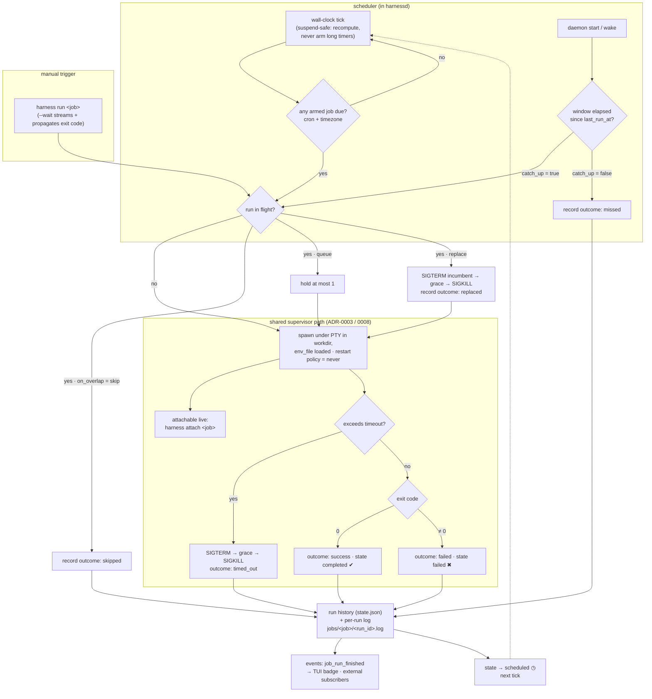

# ADR-0013: Scheduled one-shot jobs — daemon-owned cron and `[job.*]`

## Context and Problem Statement

Harness supervises *resident* processes. SPEC-0003 REQ "Restart On Exit" is
explicit about it: *"any exit — including a clean exit code 0 — SHALL be
followed by a restart per policy … agents and watchers are meant to be
long-lived."* That is exactly right for a `claude --remote-control` that should
never die, and exactly wrong for the other half of the work: nightly sweeps,
weekly grooming, daily syncs — one-shot, non-interactive runs that are
*supposed* to finish.

Today that work lives outside Harness entirely, in launchd plists and
hand-rolled scheduled tasks, which means the thing you most want a cockpit for
— *did the 3am agent run actually fire, and did it pass?* — is the one thing the
cockpit can't see. How do we run scheduled one-shot work under the daemon
without breaking the resident-harness model, and without reintroducing the
per-unit OS sprawl ADR-0005 deliberately collapsed?

## Decision Drivers

* **Terminal by design.** A job must be allowed to *finish*. Restart-on-clean-exit
  is a feature for a harness and a bug for a job; the difference has to be
  structural, not a special case buried in the supervisor.
* **One init unit, still.** ADR-0005 collapsed N per-harness systemd/launchd
  units down to one. `systemd` timers on Linux versus launchd
  `StartCalendarInterval` on macOS is precisely the OS branching that decision
  removed. Scheduling must not smuggle it back in.
* **The daemon stays agnostic.** It runs `cmd`/`args`/`workdir` and knows nothing
  about what is inside. A scheduler is a clock, not a domain — the daemon must
  not learn what a "sweep" is or how to deliver a notification.
* **Non-interactive, but not invisible.** A job runs unattended, yet hopping into
  a *running* one to watch it work is the signature Harness interaction. Scheduled
  execution must not become a blind pipe.
* **Answerable after the fact.** At 9am the question is: did it fire, did it pass,
  how long did it take, what did it print? A resident harness's single continuous
  ring buffer cannot answer *"show me run #3."*
* **A laptop is not a server.** The machine is asleep at 03:00. Missed windows,
  suspend/resume, and clock jumps are the normal case here, not the exception.
* **Hung agents are the failure mode.** An agent CLI that quietly waits for input
  never exits. Without a timeout, one stuck run blocks its own schedule forever.

## Considered Options

The decision has two orthogonal axes, and this ADR settles both.

**Axis 1 — who owns the clock:**

* **1A. Daemon-owned scheduler, plus a `harness run` manual trigger.**
* **1B. OS timers** (systemd `.timer`, launchd `StartCalendarInterval`) invoke
  `harness run <job>`; the daemon stays ignorant of time.
* **1C. Daemon-owned scheduler only** — no manual trigger verb.

**Axis 2 — how a job is expressed in config:**

* **2A. Distinct `[job.*]` tables**, sibling to `[harness.*]`.
* **2B. `[harness.*]` with a `schedule` key** that flips a harness into a job.
* **2C. `[schedule.*]` tables referencing a harness by name** — the systemd
  `.timer`/`.service` split.

## Decision Outcome

Chosen options: **1A (daemon-owned scheduler + `harness run`)** and **2A
(distinct `[job.*]` tables)**.

1A because the daemon already *is* the supervisor, the state store, and the
thing systemd/launchd keeps alive — giving it the clock costs one more
goroutine and keeps ADR-0005's "one init unit" property intact across both
platforms. Pairing it with `harness run <job>` means the scheduled path and the
manual path are the same code, so triggering a job by hand is a genuine test of
what fires at 03:00 rather than a parallel implementation.

2A because a job and a harness are different nouns with opposite lifecycles, and
pretending otherwise makes every downstream surface branch on a key instead of a
type. `[job.*]` lets the parser reject `restart_delay` outright, lets the TUI
render *next run / last outcome* where a harness renders *uptime / restarts*, and
leaves ADR-0006's harness schema completely untouched.

### Restart policy becomes an explicit axis

The load-bearing change is not the scheduler — it is admitting that
"restart on exit" was never universal. Supervised units gain a restart policy:

| Policy | Meaning | Applies to |
| --- | --- | --- |
| `always` | Any exit, including 0, is followed by a restart | `[harness.*]` |
| `never` | Exit is terminal; the schedule decides the next run | `[job.*]` |

The table type determines the policy; it is not a user-facing key in v1 (leaving
room for `on-failure` later). **This amends SPEC-0003 rather than merely
extending it**: REQ "Restart On Exit" becomes conditional on policy `always`.
Every existing harness behaves identically — but the spec text stops being a
universal claim about all supervised processes.

> **Note added on landing (2026-08-10).** Between this ADR being drafted
> (2026-07-26) and being committed, the restart-policy axis shipped
> independently as the user-facing `restart` key on `[harness.*]`
> (`no` / `always` / `unless-stopped` / `on-failure`, ADR-0006). SPEC-0003 REQ
> "Restart On Exit" already reads *"While a harness is `enabled` **and its
> restart policy permits it**"*, so the amendment this section calls for is
> already satisfied — no further SPEC-0003 edit is needed.
>
> Two consequences for the implementation: the job policy named `never` here is
> the existing `core.RestartNo`, so no new policy value should be introduced;
> and because `restart` is now a real user-facing key, a `[job.*]` table must
> reject it for the same reason it rejects `restart_delay` — the policy is
> determined by the table type, not chosen per job.

### The `[job.*]` schema

```toml
# ~/.config/harness/harness.toml

[harness.claude-src]          # resident: restart policy `always`
cmd = "claude"
args = ["--remote-control", "--dangerously-skip-permissions"]

[job.omg-sweep]               # scheduled: restart policy `never`
cmd = "claude"
args = ["-p", "work the OMG backlog"]
workdir = "~/src/stumpcloud"
env_file = "~/.config/vault/secrets-static.env"
schedule = "0 3 * * *"        # 5-field cron, @daily, or @every 15m
timezone = "America/Denver"   # optional; default = daemon's local zone
timeout = "30m"               # default 1h; "0" means unlimited (opt-in footgun)
on_overlap = "skip"           # skip (default) | queue | replace
catch_up = false              # default: a missed window is recorded, not run
keep_runs = 20                # per-run log + history retention
description = "Nightly OMG remediation sweep"
enabled = true                # is the schedule armed?
```

`cmd`/`args`/`workdir`/`env_file`/`description` mean exactly what ADR-0006
already says they mean — same parser, same `core` types, same `env_file` secret
handling (ADR-0008). `restart_delay` and `backend = "tmux"` in a `[job.*]` table
are **validation errors**: a job never auto-restarts, and there is no tmux
session to hop into once a run has exited.

### `enabled` means *armed*, not *running*

For a harness, `enabled` is "the daemon wants this process up." For a job it is
"the schedule is armed." `harness stop <job>` disarms it (cancelling any
in-flight run per SPEC-0003's graceful-stop sequence); `harness start <job>`
re-arms it; `harness run <job>` executes immediately regardless of arming.

### Lifecycle states — reuse where the meaning holds, add two

Jobs reuse the SPEC-0003 machine for the states that genuinely mean the same
thing, and add two of their own:

| State | Glyph | Meaning for a job |
| --- | --- | --- |
| `scheduled` | `◷` | **New.** Armed and idle, waiting for the next tick — a job's resting state |
| `starting` | `◌` | Spawn in progress |
| `running` | `●` | A run is in flight |
| `stopping` | `◌` | Cancellation in progress (SIGTERM → grace → SIGKILL) |
| `completed` | `✔` | **New.** Last run exited 0; no run in flight |
| `failed` | `✖` | Last run exited non-zero or timed out |
| `stopped` | `○` | Disarmed; no tick will fire |

`degraded` and `restarting` are **not** used by jobs — they are crash-loop
concepts that only exist under restart policy `always`. Note that `failed` also
means something different here: for a harness it means *the daemon gave up and
needs a human*; for a job it means *the last run failed*, and the job stays armed
so the next tick still fires. **There is no backoff for jobs — the schedule is
the rate limiter.** A job on `*/1 * * * *` that fails every minute will fail
every minute; the daemon tracks a `consecutive_failures` counter for the TUI to
surface but takes no automatic action on it.

### Execution reuses the supervisor path verbatim

A run is an ordinary supervised PTY spawn: same `internal/supervisor` spawn path,
same `env_file` loading (ADR-0008), same `x/vt` emulator and scrollback ring
(ADR-0003). Two things fall out for free: `harness attach omg-sweep` lets you
watch the 03:00 agent work while it works, and jobs inherit PTY semantics that
agent CLIs generally need (they render and sometimes behave differently without
a TTY). A PTY does not make a job interactive — it just gives it a terminal.

### Scheduling semantics

* **Expression:** 5-field cron (`min hour dom mon dow`), the `@daily`/`@hourly`/
  `@weekly`/`@monthly`/`@yearly` descriptors, and `@every <duration>`.
* **Timezone:** per-job IANA name, defaulting to the daemon's local zone. On
  spring-forward, a wall-clock time that does not exist fires once at the next
  valid instant; on fall-back, a time that occurs twice fires once, on the first
  occurrence.
* **Suspend-safe evaluation:** the scheduler MUST NOT arm long `time.Timer`s and
  trust them across a laptop suspend. It evaluates "is anything due?" against the
  wall clock on a short tick, so a machine that sleeps through 03:00 and wakes at
  08:00 reaches a correct decision rather than an OS-dependent one.
* **Next-run time** is computed daemon-side and exposed over the protocol, so
  `harness jobs` and the TUI can render `next: 03:00 (in 6h)`.

### Missed runs — catch-up is opt-in, misses are always recorded

The daemon persists `last_run_at` per job (ADR-0007 state file). On daemon start
and after a wake, for each armed job whose window has elapsed:

* `catch_up = true` → fire **exactly once**, never once per missed window.
* `catch_up = false` (**default**) → record a `missed` entry in run history and
  wait for the next real tick.

Recording the miss even when catch-up is off is the point: silently doing
nothing is the classic laptop-cron failure, and a visible `missed` row is what
distinguishes "it ran and passed" from "it never fired."

### Overlap policy

`on_overlap` decides what happens when a tick arrives with a run still in flight:

* **`skip`** (default) — drop the tick, record a `skipped` run. A nightly job that
  occasionally runs long should not stack.
* **`queue`** — hold **at most one** run behind the in-flight one; further ticks
  while one is queued are `skipped`. The queue is bounded at 1 deliberately; an
  unbounded backlog is a footgun, not a feature.
* **`replace`** — SIGTERM the in-flight run (grace → SIGKILL), record it as
  `replaced`, then start the new one.

### Timeouts default to bounded, not infinite

`timeout` defaults to **1h**; `timeout = "0"` explicitly opts into unlimited. On
expiry the daemon runs the graceful-stop sequence and records the run as
`timed_out`, which counts as a failure. Defaulting to unbounded would make "a
stuck agent silently owns its schedule forever" the out-of-the-box behavior.

### Run history and per-run logs (extends ADR-0007)

ADR-0007 gives each harness one continuous ring buffer plus one on-disk log. Jobs
need per-run granularity:

* **History** — a bounded ring of run records per job in the state file:
  `{ run_id, started_at, ended_at, exit_code, outcome, trigger }`, where
  `outcome ∈ {success, failed, timed_out, skipped, replaced, missed, cancelled}`
  and `trigger ∈ {schedule, manual, catch_up}`. `run_id` is a monotonic
  per-job integer.
* **Logs** — one file per run at
  `$XDG_STATE_HOME/harness/jobs/<job>/<run_id>.log`, pruned to `keep_runs`
  (default 20). `harness logs <job>` tails the most recent run; `--run N` reads
  an older one.

### Protocol and CLI surface

New control operations, in the existing style: `jobs` (list with schedule, next
run, last outcome), `run { name }` (trigger now, returns `run_id`), and
`runs { name, limit }` (history). `logs` gains an optional `run` selector rather
than growing a parallel op. `start`/`stop`/`restart` on a job name arm, disarm,
and re-arm the schedule — no new ops needed.

New events: `job_run_started { name, run_id, trigger }`,
`job_run_finished { name, run_id, outcome, exit_code, duration }`, and
`job_schedule_changed { name, next_run_at }`.

| Command | Behavior |
| --- | --- |
| `harness jobs` | List jobs: schedule, next run, last outcome, consecutive failures |
| `harness run <job>` | Trigger now. `--wait` streams output and exits with the job's exit code |
| `harness runs <job>` | Run history |
| `harness logs <job> [--run N]` | Per-run scrollback |
| `harness start`/`stop <job>` | Arm / disarm the schedule |
| `harness attach <job>` | Watch an in-flight run live |

`harness run <job>` is a new top-level verb; the existing `harness daemon run`
(a backward-compatible alias for `daemon start`, ADR-0005's `ExecStart` form) is
namespaced under `daemon` and is unaffected. The word is overloaded, but the two
forms are unambiguous in practice.

### Notification is deliberately out of scope

Failure surfaces as protocol events plus a loud TUI badge, and nothing else. No
built-in notifiers, no `on_failure` exec hook. The daemon knowing how to deliver
a Signal message contradicts the one thing it is supposed to not know. The escape
hatch is honest and already exists: any client can subscribe to the control plane
and act on `job_run_finished`, so an external notifier is a small subscriber
program rather than a daemon feature.

### Interaction with project-scoped config (ADR-0009)

A project `harness.toml` MAY carry `[job.*]` tables; `harness up` schedules them
as `<project>/<job>` and `harness down` deregisters them, cancelling any in-flight
run. But ADR-0009 project registrations are **runtime-only** — and that known
limitation is a sharper edge for a cron than for a resident harness, because a
nightly job simply stops firing after a reboot with no error anywhere. The
guidance is therefore explicit: **durable crons belong in the global config**;
project jobs are for the duration of a working session. This materially
strengthens the case for ADR-0009's deferred "persist which projects were up."

### Consequences

* Good, because recurring work moves into the same cockpit as resident agents —
  one place that answers *did it run, did it pass, what did it say*.
* Good, because zero new OS units are created; one systemd/launchd unit still
  supervises everything, and the Linux/macOS branching ADR-0005 removed stays
  removed.
* Good, because attach-a-running-job falls out of the shared PTY path for free —
  the signature "hop" interaction now applies to scheduled work.
* Good, because `[job.*]` keeps every downstream surface honest: the TUI, `ps`,
  and the protocol branch on a *type*, not on the presence of a key.
* Good, because `harness run --wait` propagates the job's exit code, so Harness
  stays composable *from* an external scheduler without that being the model.
* Bad, because the daemon is now a scheduler, and clock correctness — DST,
  suspend/resume, timezone data, wall-clock jumps — becomes our bug surface. This
  is the single largest new risk and the reason the design mandates wall-clock
  re-evaluation over armed long timers.
* Bad, because SPEC-0003 must be **amended**, not merely extended: "restart on any
  exit" becomes conditional. No existing harness changes behavior, but the spec
  text stops being a universal claim.
* Bad, because the daemon now holds two unit kinds with different state
  vocabularies, so every surface that enumerates units has to decide whether it
  is showing harnesses, jobs, or both.
* Bad, because per-run logs grow the on-disk footprint from O(harnesses) to
  O(jobs × `keep_runs`), which is why `keep_runs` is a first-class key rather
  than a constant.
* Bad, because **if `harnessd` is down at 03:00, the job does not fire.** System
  cron would have. With `catch_up = false` this is recorded as `missed` and
  nothing runs — the honest cost of daemon-owned scheduling, mitigated only by
  the daemon's own `Restart=on-failure` supervision.
* Neutral, because two triggers (schedule, manual) share one execution path, so
  `harness run` exercises the real scheduled behavior rather than a parallel one.

### Confirmation

SPEC-0008 (`scheduled-jobs`) formalizes discovery, the `[job.*]` schema, the
state machine, overlap/catch-up/timeout semantics, run history, and the protocol
ops as testable requirements and scenarios.

The scheduler MUST take an injectable clock so every temporal scenario runs in
milliseconds — the existing `supervisor.Policy` pattern (production durations,
shrunk in tests) is the precedent. Acceptance tests:

* A job with `@every 1s` fires repeatedly and **never** restarts on exit 0.
* `on_overlap = "skip"` records a `skipped` run rather than spawning a second
  process; `queue` holds exactly one; `replace` terminates the incumbent.
* A run exceeding `timeout` is SIGTERMed then SIGKILLed and recorded `timed_out`.
* With `catch_up = false`, a daemon started after a missed window records
  `missed` and does not fire; with `catch_up = true` it fires exactly once no
  matter how many windows elapsed.
* `harness run <job> --wait` exits with the job's exit code.
* `restart_delay` or `backend = "tmux"` in a `[job.*]` table is a validation error.
* A DST spring-forward schedule fires exactly once.

### Deferred

* `tty = false` for jobs whose output is cleaner as a pipe than as ANSI.
* `on_failure` exec hooks and built-in notifiers (explicitly rejected for v1 —
  subscribe to `job_run_finished` instead).
* Jobs as `[profile.*]` members; profiles remain a view over resident harnesses.
* Retry-on-failure *within* a window, distinct from restart policy.
* A daemon-wide cap on concurrently running jobs.
* Persisting project registrations so project jobs survive a daemon restart
  (ADR-0009's deferred item, which this decision makes more urgent).

## Pros and Cons of the Options

### 1A — Daemon-owned scheduler + `harness run` (chosen)

The daemon carries an internal cron engine driven from config; `harness run` is
a client verb that triggers the same execution path on demand.

* Good, because it preserves ADR-0005's "one init unit" property on both Linux
  and macOS with no per-job units.
* Good, because the daemon already owns state, PTYs, and logs — the scheduler
  reads `last_run_at` from the same state file it already writes.
* Good, because next-run time, run history, and live attach are all
  daemon-side facts the TUI can render without shelling out to anything.
* Good, because manual and scheduled triggers share one path, so testing a job
  by hand tests what actually fires.
* Neutral, because it adds a scheduler goroutine and a clock abstraction to a
  daemon that previously only reacted to process exits.
* Bad, because a daemon that is down at the scheduled instant simply misses the
  window — the OS scheduler would not have.
* Bad, because DST, timezone data, and suspend/resume correctness become our
  problem rather than systemd's.

### 1B — OS timers invoke `harness run`

systemd `.timer` units on Linux and launchd `StartCalendarInterval` on macOS
fire `harness run <job>`; the daemon never learns what time it is.

* Good, because timing correctness — including `Persistent=true` catch-up — is
  handled by software with far more hardening than ours.
* Good, because a job still fires when the daemon happens to be down (it starts
  the daemon, or fails loudly, rather than silently missing).
* Bad, because it reintroduces exactly the N-units-per-thing sprawl ADR-0005
  collapsed, and revives the `systemctl` versus `launchctl` branching that
  decision deleted from the codebase.
* Bad, because the schedule lives outside `harness.toml`, so the config file
  stops being a complete description of what the daemon does — breaking
  ADR-0006's "it's a file in my dotfiles" property.
* Bad, because the TUI cannot render "next run" without parsing systemd/launchd
  state, on two platforms, in two formats.

### 1C — Daemon scheduler with no manual trigger

Schedules fire only on the daemon's clock.

* Good, because it is the smallest possible command surface.
* Bad, because there is no way to test a job without waiting for a real tick, or
  to force a run after fixing whatever made the last one fail.
* Bad, because it forecloses `harness run --wait`, which is the cheap seam that
  lets an external scheduler drive Harness if someone wants 1B's properties.

### 2A — Distinct `[job.*]` tables (chosen)

A job is its own noun, sharing the underlying Go types with `Harness`.

* Good, because the parser can reject nonsense (`restart_delay` on a job) instead
  of silently ignoring it.
* Good, because job-appropriate defaults (never restart, 1h timeout,
  `keep_runs`) are natural on their own table rather than conditional on a key.
* Good, because the TUI and `ps` branch on a type, and `[harness.*]` stays
  byte-for-byte the schema ADR-0006 defined.
* Neutral, because it adds a second table kind to the config parser and a second
  registry dimension in the daemon.
* Bad, because a genuinely dual-purpose process must be written twice if you
  want it both resident and scheduled.

### 2B — `[harness.*]` with a `schedule` key

Presence of `schedule` flips a harness into a job.

* Good, because it is the smallest possible schema change: one parser, one
  registry, one mental model.
* Bad, because `restart_delay` and `enabled` become silently ambiguous — is
  `enabled` "running" or "armed"? — and there is no clean place to reject them.
* Bad, because every consumer branches on `schedule != ""` to decide how to
  render, which is a type distinction wearing a key's clothing.
* Bad, because the two units have genuinely opposite lifecycles; merging them
  guarantees that every future lifecycle change has to be reasoned about twice
  in one code path.

### 2C — `[schedule.*]` referencing a harness

The systemd `.timer`/`.service` split: a schedule table names a harness to fire.

* Good, because it lets you attach a schedule to something already defined, and
  in principle put several schedules on one unit.
* Bad, because it splits one job across two tables that must be read together to
  understand either.
* Bad, because it requires defining a harness that must never autostart
  (`enabled = false`) and exists only to be referenced — a dangling unit that
  breaks the "a harness is a thing that runs" invariant.
* Bad, because it inherits systemd's most-complained-about ergonomic for no
  benefit Harness actually needs.

## Architecture Diagram



## More Information

* **Extends [ADR-0005](adr-0005-supervision-and-lifecycle.md)** — adds restart
  policy as an explicit axis (`always` for harnesses, `never` for jobs) and
  places the scheduler inside the daemon so Layer 2 stays exactly one init unit.
  This **amends SPEC-0003 REQ "Restart On Exit"**, making it conditional on
  policy `always`.
* **Extends [ADR-0006](adr-0006-configuration-and-profiles.md)** — adds `[job.*]`
  as a sibling table to `[harness.*]`, reusing the harness field vocabulary
  verbatim. The existing harness and profile schema is untouched.
* **Related [ADR-0002](adr-0002-daemon-client-architecture.md)** — `harness run`,
  `jobs`, and `runs` are thin-client gestures over the existing control plane.
* **Related [ADR-0003](adr-0003-terminal-multiplexing.md)** — job runs use the
  same owned PTY and `x/vt` emulator, which is what makes attaching to an
  in-flight run work at all.
* **Related [ADR-0007](adr-0007-state-persistence-scrollback.md)** — extended with
  per-job run history and per-run log files, retained by `keep_runs`.
* **Related [ADR-0008](adr-0008-security-and-secrets.md)** — jobs load `env_file`
  through the same path; secrets never reach run history or the protocol.
* **Related [ADR-0009](adr-0009-project-scoped-config-and-compose-commands.md)** —
  project files may define jobs, but runtime-only registration means project jobs
  do not survive a daemon restart; durable crons belong in the global config.
* **Governs [SPEC-0008](../openspec/specs/scheduled-jobs/spec.md)** — the formal
  requirements and scenarios.
