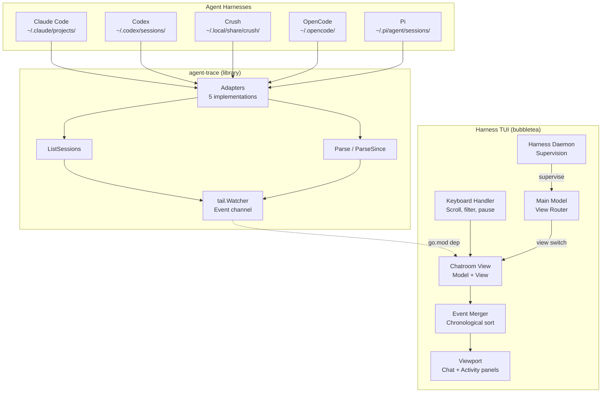

# ADR-0015: Unified Chatroom TUI for Multi-Harness Agent Output

## Context and Problem Statement

How can we provide a unified, real-time "chatroom" style read-only TUI within Harness that aggregates output from all agent harnesses (Claude Code, Codex, Crush, OpenCode, Pi) into a single stream where each harness appears as a distinct "user" (e.g., `@crush-signal`) with their tool calls, results, and user messages displayed as chat messages and activity feed entries?

This TUI would be a new view/mode within the existing Harness TUI (which already uses bubbletea/charmbracelet), leveraging `agent-trace`'s `tail.Watcher` to consume live events from all 5 harness adapters.

## Decision Drivers

* **Unified observability**: Developers run multiple agent harnesses simultaneously and need a single pane of glass to monitor all activity within Harness
* **Leverage existing Harness TUI**: Harness already uses bubbletea/bubbles — the chatroom should be a native view, not a separate binary
* **Leverage agent-trace**: `agent-trace`'s `tail` package already parses all harness formats and emits normalized `Event` streams
* **Harness identity**: Each agent harness should have a distinct visual identity (username/color) in the chatroom
* **Read-only**: The chatroom is for monitoring only — no input/interaction with the agent harnesses
* **Real-time updates**: Must reflect live activity as it happens across all harnesses
* **Integration with Harness daemon**: Chatroom should be accessible via the existing Harness client/server architecture

## Considered Options

* **Option 1: New chatroom view within Harness TUI (chosen)**
  * Pros: Native integration, reuses Harness TUI framework, single binary, daemon-managed
  * Cons: Adds complexity to Harness TUI model

* **Option 2: Separate `harness chatroom` binary using agent-trace**
  * Pros: Simpler initial implementation, independent deployment
  * Cons: Separate binary to maintain, doesn't integrate with Harness daemon/views, duplicate TUI framework

* **Option 3: Web-based dashboard served by Harness daemon**
  * Pros: Rich UI, easier layout
  * Cons: Not a TUI, requires browser, more complex deployment

* **Option 4: Pipe agent-trace output to external log viewer (lnav, less +F)**
  * Pros: Zero development
  * Cons: No harness-aware formatting, no chatroom metaphor, no activity feed, not integrated

## Decision Outcome

Chosen option: **Option 1 — New chatroom view within Harness TUI**, because it provides native integration with the existing Harness TUI framework (bubbletea), single binary deployment, daemon-managed lifecycle, and leverages both Harness's TUI investment and agent-trace's parsing pipeline.

### Consequences

* Good, because: Native integration with Harness TUI — consistent keybindings, theming, layout
* Good, because: Single binary (`harness`) — chatroom is just another view mode
* Good, because: Daemon-managed — chatroom sessions can be supervised, attached, hopped like other harnesses
* Good, because: Reuses agent-trace `tail.Watcher` + `classify` pipeline for event normalization
* Bad, because: Adds complexity to Harness TUI model (new view, event buffer, rendering)
* Bad, because: Harness TUI must now depend on agent-trace (already a dependency via go.mod)

### Confirmation

* Harness TUI launches with new "chatroom" view accessible via keybinding (e.g., `Ctrl+R` or view switcher)
* Chatroom view connects to `tail.Watcher` with `DefaultAdapters()` on enter
* Events from all 5 harnesses appear in unified chronological stream
* Each harness shows as distinct username (e.g., `@crush-signal`, `@claude-code`)
* Tool calls render as chat messages with action/type badges
* Tool results render as follow-up messages with status indicators
* User messages (marks) render as chat messages
* Activity feed panel shows summary timeline
* Keyboard controls: scroll, pause/resume, filter by harness, quit view
* Exiting chatroom view cleanly stops watcher and returns to Harness main view

## Pros and Cons of the Options

### Option 1: New chatroom view within Harness TUI

* Good, because: Native integration with existing Harness TUI framework
* Good, because: Single binary, daemon-managed lifecycle
* Good, because: Consistent theming, keybindings, layout with rest of Harness
* Good, because: Can leverage Harness's existing viewport, status bar, help components
* Neutral, because: Requires extending Harness TUI model with new view type
* Bad, because: Adds complexity to Harness TUI (event buffer, dual viewport, rendering)

### Option 2: Separate `harness chatroom` binary

* Good, because: Simpler initial implementation
* Good, because: Independent deployment and iteration
* Bad, because: Separate binary to maintain and distribute
* Bad, because: Doesn't integrate with Harness daemon/views/hop mechanism
* Bad, because: Duplicate TUI framework code (bubbletea setup, theming, keybindings)

### Option 3: Web-based dashboard

* Good, because: Rich UI capabilities
* Bad, because: Not a TUI — requires browser
* Bad, because: More complex deployment (HTTP server, static assets)
* Bad, because: Doesn't meet "TUI" requirement

### Option 4: Pipe to external log viewer

* Good, because: Zero development
* Bad, because: No harness-aware formatting or chatroom metaphor
* Bad, because: No activity feed panel
* Bad, because: Not integrated with Harness

## Architecture Diagram

## More Information

* Related to SPEC-0015 which formalizes the requirements for the chatroom TUI view within Harness
* Leverages existing `tail.Watcher`, `tail.Adapter`, `tail.Event`, `classify.Event`, `classify.Mark` types from agent-trace
* New chatroom view will be in `internal/tui/views/chatroom/` within Harness
* Uses Harness's existing bubbletea setup, theming (lipgloss), and viewport components
* Harness usernames: `@claude-code`, `@codex`, `@crush-signal`, `@opencode`, `@pi`
* Color scheme per harness for visual distinction (compatible with Harness theme system)
* Integrates with Harness daemon for supervision/lifecycle management