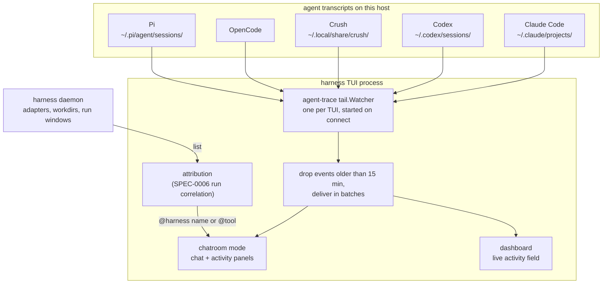

# ADR-0015: Unified chatroom TUI for multi-harness agent output

## Context and Problem Statement

An operator running several agent harnesses at once (Claude Code, Codex, Crush,
OpenCode, Pi) can attach to one at a time, but has no single place to watch what
all of them are doing. How does Harness provide a real-time, read-only
"chatroom" view that merges every agent's activity into one stream, where each
agent appears as a distinct user, and its tool calls, results and user messages
read as chat messages beside an activity feed?

The Harness TUI is already built on Bubble Tea, and
[agent-trace](https://github.com/stump-wtf/agent-trace)'s `tail` package already
parses all five agents' native transcript formats into one normalized `Event`
stream.

## Decision Drivers

* **Unified observability.** One pane showing activity across every agent on
  the machine.
* **Reuse the Harness TUI.** It already uses Bubble Tea and Bubbles; the
  chatroom should be a native view, not a separate program.
* **Reuse agent-trace.** Its `tail` package already parses every supported
  agent's format and emits normalized events.
* **Agent identity.** Each agent needs a distinct name and color, and a session
  that belongs to a known harness should carry that harness's name.
* **Read-only.** The chatroom is for watching; it sends nothing to any agent.
* **Real time.** Activity appears as it happens.
* **Responsive from the first frame.** A machine with years of transcripts must
  not freeze the TUI while the stream catches up.

## Considered Options

* **Option 1 — A chatroom view within the Harness TUI.**
* **Option 2 — A separate chatroom binary built on agent-trace.**
* **Option 3 — A web dashboard served by the daemon.**
* **Option 4 — Pipe agent-trace output to an external log viewer** (`lnav`,
  `less +F`).

## Decision Outcome

Chosen option: **Option 1 — A chatroom view within the Harness TUI**, because it
reuses the TUI's framework, theme and keybinding registry, ships in the one
`harness` binary, and puts agent-trace's parsing behind a view operators already
know how to reach.

### The view

The chatroom is a third TUI mode beside the dashboard and attached modes,
entered with `C` from the dashboard through the SPEC-0001 keybinding registry.
It shows a chronological stream of every agent's activity: each tool call as a
chat line (time, agent name, action badge, tool, summary), tool results and
file targets as follow-up lines, and user messages as chat messages, beside an
activity-feed panel. Keys scroll, follow or pause the stream, toggle individual
agents on and off, show all agents again, and return to the dashboard. The view
is read-only.

### One watcher, in the TUI process

The TUI runs **one** agent-trace `tail.Watcher` for its whole lifetime, started
when it connects to the daemon. That watcher feeds both the chatroom and the
dashboard's live-activity field, and entering the chatroom starts nothing: it
shows the stream already in progress. The watcher's first scan emits the entire
history of every session it discovers (measured at about 76,000 events in 43
seconds against a 1.2 GB Claude Code store), so events older than a 15-minute
history window are dropped on arrival and the rest are delivered in batches, so a
burst costs one frame rather than one frame per event.

The watcher runs in the TUI, not the daemon. The daemon's contribution is
attribution data: each harness's adapter, workdir and latest run window.

### Identity

Every session shows under its **tool identity** (`@claude-code`, `@codex`,
`@crush`, `@opencode`, `@pi`), which is true of any session and claims nothing.
A session that the SPEC-0006 run-correlation rule attributes to **exactly one**
harness (same adapter, same workdir, a run whose window covers the session's
start) shows as `@<harness name>` instead. Attribution under-reports
rather than misattributes: a session another harness could have written keeps
its tool identity. Colors come from the `internal/tui/theme` palette, so the
chatroom degrades through the same color-profile path as the rest of the TUI.

### Consequences

* Good, because the chatroom shares the TUI's keybindings, theme and layout.
* Good, because it ships in the single `harness` binary as another view mode.
* Good, because agent-trace's `tail` and `classify` packages do all transcript
  parsing and action classification; Harness renders.
* Good, because one watcher serves both the chatroom and the dashboard, so
  transcripts are scanned once per TUI, not once per view entry.
* Good, because naming a session after its harness only when attribution is
  unambiguous means the chatroom never tells the operator a wrong harness did
  something.
* Bad, because it adds complexity to the TUI model: a third mode, an event
  buffer, and a two-panel layout.
* Bad, because the TUI depends on agent-trace and reads transcripts directly, so
  it sees the transcripts on the host the TUI process runs on.
* Bad, because backfill is bounded by dropping history: events older than the
  window never reach the chatroom.

### Confirmation

SPEC-0009 states the requirements as testable scenarios, exercised by the
tests in `internal/tui` and `internal/tui/chatroom`:

* The chatroom is reachable from the dashboard through the keybinding registry
  and returns to the dashboard on exit.
* Events from every supported agent appear in one chronological stream.
* Tool calls, results and user messages render as chat lines with action badges
  and status indicators; the activity panel summarizes the timeline.
* A session attributable to exactly one harness shows under that harness's
  name, and a label is recomputed when attribution changes.
* Scroll, follow and pause, per-agent filtering, and resize behave as
  specified, including on monochrome terminals.

## Pros and Cons of the Options

### Option 1 — A chatroom view within the Harness TUI

* Good, because it integrates with the existing TUI framework and hop
  mechanism.
* Good, because it is one binary.
* Good, because theming, keybindings and layout stay consistent.
* Good, because it reuses the TUI's viewport, status bar and help components.
* Neutral, because the TUI model gains a new view type.
* Bad, because it adds complexity to the TUI (event buffer, two panels,
  rendering).

### Option 2 — A separate chatroom binary

* Good, because the first version is simpler.
* Good, because it can be built and released independently.
* Bad, because it is another binary to maintain and distribute.
* Bad, because it does not integrate with the daemon's views or the hop.
* Bad, because it duplicates TUI setup, theming and keybindings.

### Option 3 — A web dashboard served by the daemon

* Good, because a browser allows richer layout.
* Bad, because it is not a TUI and needs a browser.
* Bad, because the daemon would grow an HTTP server and static assets.

### Option 4 — Pipe to an external log viewer

* Good, because it needs no development.
* Bad, because it has no agent-aware formatting or chatroom metaphor.
* Bad, because there is no activity feed.
* Bad, because it is not integrated with Harness.

## Architecture Diagram

## More Information

* **Governs SPEC-0009** — the chatroom view's requirements.
* **Related ADR-0001** — the Charm stack the view is built on.
* **Related ADR-0003** — the attached mode the chatroom sits beside.
* **Related ADR-0011** — the adapters whose transcripts agent-trace reads, and
  SPEC-0006's run correlation that names a session's harness.
* The chatroom uses agent-trace's `tail.Watcher`, `tail.Event`,
  `classify.Event` and `classify.Mark` types. Its code lives in
  `internal/tui/chatroom`, with the shared watcher and attribution in
  `internal/tui`.
