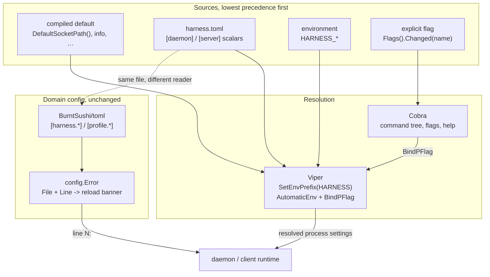

# ADR-0016: Cobra for the command tree, Viper for process config, and a `HARNESS_*` environment layer

## Context and Problem Statement

Harness has no environment-variable configuration. Every process-level setting —
socket path, config path, log level, log file, scrollback depth, the SSH server
and its listen address — is reachable only through a command-line flag or the
TOML file. The only environment variables the binary reads at all are `TERM`,
`TMUX`, and the `XDG_*` set, and those are path/terminal discovery, not
configuration.

That makes Harness awkward in exactly the places a supervisor belongs. A systemd
unit has to carry a flag string; a container image has to bake or mount a TOML
file to move a socket; a test harness cannot point one invocation at a scratch
socket without rewriting argv. This is the "config in the environment" factor of
the twelve-factor app, and Harness fails it.

The gap was easy to miss because it *looks* like a solved problem — most Go CLIs
get this from Viper. Harness has neither Viper nor Cobra: `cmd/harness/main.go`
uses the standard library's `flag` package and `internal/config` is a
hand-rolled `BurntSushi/toml` loader. Nothing was ever going to bind an
environment variable automatically.

So: **how should Harness read configuration from the environment, and does
adopting Cobra + Viper to get it cost more than it returns?**

## Decision Drivers

* **Twelve-factor.** Config that varies between deploys — where the socket
  lives, how loud the log is, whether the SSH server is on — belongs in the
  environment, not in argv and not baked into an image.
* **One obvious precedence order.** A setting reachable three ways needs a
  single documented ranking, or every support question becomes "which one won?"
* **The flag parser is already a liability.** `parseInterleaved` in
  `cmd/harness/main.go` exists solely because stdlib `flag` halts at the first
  positional, so `harness logs ticker --lines 3` needs a hand-rolled
  parse/peel/re-parse loop. The daemon subcommand tree is a nested `switch` on
  `rest[0]` with its own hand-written usage text.
* **Line-numbered config errors are load-bearing.** `internal/config` reports
  every parse and validation failure as a `config.Error` carrying a 1-based
  source line, because SPEC-0001 REQ "Zero And Error States" renders
  *"using last-good config; line 12: …"* in the reload banner. Whatever reads
  the TOML must keep producing that.
* **The existing schema must not churn.** ADR-0006 fixed `[harness.*]`,
  `[profile.*]`, `[daemon]`, `[server]` and made the file the source of truth
  with hot reload. This decision extends that surface; it does not reopen it.
* **Secrets stay out.** ADR-0008 keeps credentials in `env_file`, not in config.
  An environment layer must not become a second, more tempting place to put a
  token.

## Considered Options

* **Option 1: Cobra for commands + Viper for process settings, BurntSushi
  retained for the domain tables (chosen)**
* **Option 2: Viper for everything, including `[harness.*]` and `[profile.*]`**
* **Option 3: Hand-rolled `os.Getenv` layer, keep stdlib `flag`**
* **Option 4: Cobra only — subcommands, but no environment layer**

## Decision Outcome

Chosen option: **Option 1**. Cobra owns the command tree, Viper owns the
precedence ladder for *process settings only*, and `BurntSushi/toml` keeps
parsing the domain tables that carry line numbers.

The two libraries do different jobs and the split is the whole point:

| Concern | Owner | Why |
|---|---|---|
| Subcommands, flags, help, completion | **Cobra** | Replaces `parseInterleaved` and the nested `switch`; positional-after-flag works natively |
| Precedence: flag → env → file → default | **Viper** | `BindPFlag` + `SetEnvPrefix("HARNESS")` + `AutomaticEnv` is the entire env layer |
| `[harness.*]`, `[profile.*]` parsing/validation | **BurntSushi/toml** (unchanged) | Viper lowercases keys, flattens structure, and discards `toml.MetaData` — the reload banner's line numbers would go with it |

**Precedence, stated once:** an explicit flag beats `HARNESS_*`, which beats the
TOML file, which beats the compiled default. "Explicit" means the user actually
typed it — Cobra's `Flags().Changed(name)` — not merely that the flag has a
value.

**Scope of the environment layer.** Every process-level scalar, and nothing
else:

| Variable | Replaces / backs | Default |
|---|---|---|
| `HARNESS_SOCKET` | `--socket` | `$XDG_RUNTIME_DIR/harness.sock` |
| `HARNESS_CONFIG` | `--config` | `$XDG_CONFIG_HOME/harness/harness.toml` |
| `HARNESS_JSON` | `--json` | `false` |
| `HARNESS_LOG_LEVEL` | `--log-level` | `info` |
| `HARNESS_LOG_FILE` | `--log-file` | *(stderr)* |
| `HARNESS_SCROLLBACK` | `--scrollback` | `attach.DefaultRingLines` |
| `HARNESS_SSH` | `--ssh`, `[server].enabled` | `false` |
| `HARNESS_SSH_LISTEN` | `--ssh-listen`, `[server].listen` | *(unset)* |
| `HARNESS_WATCH_CONFIG` | `[daemon].watch_config` | `true` |

`[harness.*]` and `[profile.*]` stay file-only. They are collections, not
scalars, and encoding a map into environment variables means inventing a
name-mangling scheme (`HARNESS_HARNESS_CLAUDE_SRC_WORKDIR` — is `CLAUDE_SRC` the
harness `claude-src` or `claude_src`?) that no reader can invert reliably. The
twelve-factor argument is about config that varies between deploys; *which
harnesses exist* is the application, not its deployment.

The line this draws is deliberate and worth stating plainly: **a container can
run a fully-configured daemon with no TOML file at all, but it cannot define a
harness without one.**

### Consequences

* Good, because a systemd unit or container configures the daemon with
  `Environment=` lines instead of an argv string or a bind-mounted file.
* Good, because `parseInterleaved` and the hand-rolled daemon `switch` both
  delete — Cobra does positionals-after-flags and subcommand dispatch natively.
* Good, because shell completion and `harness help <verb>` come from Cobra for
  free, where today the usage text is hand-maintained in `usage()`.
* Good, because precedence is stated in one place and testable as one table.
* Bad, because it adds two sizeable dependencies to a tree that has stayed
  deliberately small (Cobra pulls `pflag`; Viper pulls `afero`, `cast`, and a
  mapstructure/parser stack).
* Bad, because the CLI surface is rewritten, and a rewrite of argv handling is
  exactly where regressions hide — every verb, flag, and the interleaved
  positional behaviour need tests before the swap, not after.
* Bad, because two config readers now coexist (Viper for scalars, BurntSushi for
  tables), which is more machinery than one. The reload banner's line numbers
  are worth it, but it is a real seam and it must be documented so the next
  reader does not "unify" it by accident.
* Neutral, because `HARNESS_*` becomes a namespace with a rule: it is for
  process settings, and it is not where secrets go (ADR-0008 still owns those
  via `env_file`).

### Confirmation

* `HARNESS_SOCKET=/tmp/x.sock harness ls` dials `/tmp/x.sock`; adding
  `--socket=/tmp/y.sock` dials `/tmp/y.sock` — flag beats env.
* `HARNESS_LOG_LEVEL=debug harness daemon run` starts at debug with no flag and
  no `[daemon]` table present.
* A daemon starts and serves with **no `harness.toml` on disk** when every
  setting is supplied through the environment.
* A malformed `[harness.*]` table still produces `config.Error` with a non-zero
  `LineNumber()`, and the TUI reload banner still renders `line N:` — proven by
  the existing `internal/config` tests, which must pass unchanged.
* `harness logs ticker --lines 3` and `harness logs --lines 3 ticker` both work
  after the Cobra migration (the `parseInterleaved` contract, preserved), and
  `harness --lines 3 logs ticker` still fails — `--lines` is verb-local, and
  Cobra must not silently promote it to a persistent root flag.
* `harness doctor` reports which source won for each process setting, so
  "which one won?" is answerable without reading code.

## Pros and Cons of the Options

### Option 1: Cobra + Viper for process settings, BurntSushi for domain tables

* Good, because each library does the job it is actually good at
* Good, because the environment layer is ~20 lines of `BindPFlag` rather than a
  hand-maintained `os.Getenv` ladder per setting
* Good, because line-numbered validation errors survive untouched
* Neutral, because it accepts two config readers as the price of that
* Bad, because it is the largest dependency addition in the project's history

### Option 2: Viper for everything

* Good, because there is exactly one config reader
* Good, because full twelve-factor purity — no file needed for anything
* Bad, because Viper discards `toml.MetaData`, so the SPEC-0001 reload banner
  loses its line numbers and degrades to "config is broken somewhere"
* Bad, because Viper lowercases and flattens keys, which breaks the ADR-0006
  bare-`[name]`-table backward compatibility and the absent-vs-false distinction
  that `rawHarness.Enabled *bool` relies on
* Bad, because it requires a name-mangling scheme for harness names that cannot
  be reliably inverted

### Option 3: Hand-rolled `os.Getenv` layer, keep stdlib `flag`

* Good, because zero new dependencies
* Good, because it could ship in an afternoon
* Neutral, because the precedence logic is genuinely simple for nine settings
* Bad, because `parseInterleaved` and the hand-written usage/subcommand
  dispatch all survive, and they are the actual maintenance burden
* Bad, because every new setting means remembering to add a fourth branch by
  hand, which is precisely the kind of thing that silently rots

### Option 4: Cobra only, no environment layer

* Good, because it fixes the flag parsing without a config rewrite
* Bad, because it does not solve the stated problem at all — the twelve-factor
  gap remains

## Architecture Diagram

## More Information

* Extends ADR-0006, which made the TOML file the source of truth with hot
  reload. This adds a layer *above* the file for process settings and leaves the
  file authoritative for everything it already owned.
* Related to ADR-0005 (the daemon is normally supervised by init — `Environment=`
  in the unit file is the intended delivery mechanism), ADR-0008 (secrets stay in
  `env_file`; `HARNESS_*` is not a secret channel), ADR-0009 (project-scoped
  `harness.toml` discovery is unaffected — `HARNESS_CONFIG` names the *global*
  file), and ADR-0001 (which chose the small-dependency Go/Charm stack this
  decision deliberately grows).
* SPEC-0010 formalizes the variable table, the precedence rules, and the
  parse/validation behaviour for malformed values.
* SPEC-0009 REQ "Reduced Motion" deferred its toggle to "a config key on the
  ADR-0006 config surface, with an env override reserved for a later revision."
  This is that revision; the chatroom toggle lands as `HARNESS_REDUCED_MOTION`
  under the same rules once the chatroom itself is built.
* Migration is staged deliberately: characterization tests over today's CLI
  behaviour first, then the Cobra swap, then Viper. Landing all three at once
  makes a bisect useless.
