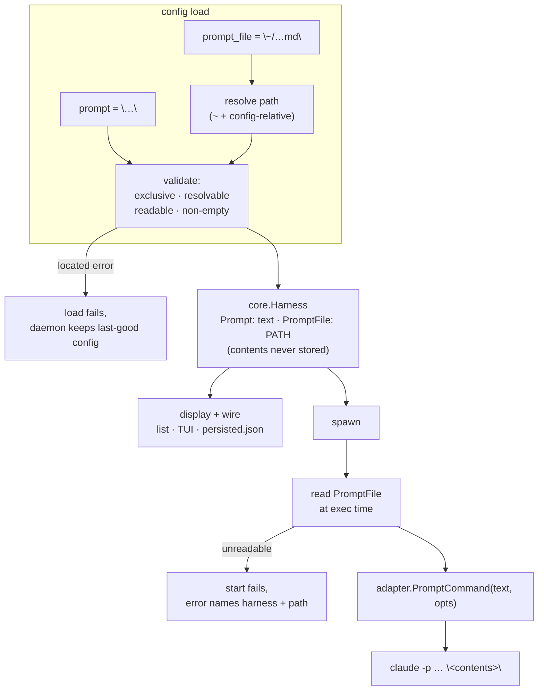

# ADR-0018: `prompt_file` — an external prompt source for agent one-shots

## Context and Problem Statement

ADR-0011 gave a harness a declarative `prompt`: set it, and the supervisor
synthesizes the whole agent argv at spawn (`args` stay empty) via the adapter's
`PromptCommand`. The value is stored verbatim, never placeholder-expanded, and
lands as the final argv element — `claude -p --verbose --output-format
stream-json "<prompt>"`.

That is right for a sentence. It is wrong for the prompts people actually
schedule. A cron one-shot's instructions are a specification: what to gather,
what to write, what it may not touch, and — for anything reading issues, logs
or web pages — a paragraph of prompt-injection hardening. TOML basic strings
cannot contain a raw newline, so such a prompt becomes one unreadable line, and
every edit to it is a config edit that trips the reload path.

The workaround already in the wild is to make the prompt a *pointer*:

```toml
prompt = "Read ~/.config/dotfiles/blog-sweep.prompt.md and execute its instructions verbatim — that file IS the complete specification for this run."
```

It works because agents can read files, not because Harness supports it, and it
carries three real costs:

* **The path is unvalidated.** Nothing checks it at load, and nothing checks it
  at spawn. A renamed or unrendered file does not fail — the agent is simply
  handed an instruction to read something that is not there and left to
  improvise. For a scheduled run with no human attached, that reads as a silent
  no-op.
* **Preamble competes with instructions.** Every such prompt spends its first
  sentence explaining its own indirection, and that sentence sits in the same
  channel as the work.
* **It is invisible to Harness.** `harness list`, the TUI "what" column, and the
  wire all show the pointer sentence. Nothing knows a file is involved, so
  nothing can report that it is missing.

So: how does a harness name a prompt that lives in a file, without the daemon
learning to read the file's *contents* as configuration?

## Decision Drivers

* **Config truth is the file (ADR-0006).** `harness.toml` is hand-authored and
  round-trips through the TUI edit form. Anything that makes the form re-persist
  content it did not author is a defect, not a cosmetic issue.
* **A failure must be loud (ADR-0013).** SPEC-0008 already validates the cron
  expression eagerly so a typo fails the load rather than silently never firing.
  A prompt source deserves the identical treatment: a scheduled run whose
  instructions are missing must fail visibly, not run empty.
* **Prompts change more often than configuration.** The indirection is desirable
  precisely because editing a prompt should not require a daemon reload.
* **Precedent exists, twice.** `env_file` is already a config key resolved at
  parse and read at spawn; `[server]` already pairs `authorized_keys` with
  `authorized_keys_file`. Neither needed new vocabulary.
* **One field, one type.** `prompt` is displayed in the TUI dashboard, the
  `harness list` detail table, the control-plane wire, and `persisted.json`.
  A field whose value is sometimes an instruction and sometimes a path forces
  every one of those consumers to learn the difference.

## Considered Options

* **Option 1 — an `@` sigil on `prompt`.** `prompt = "@/path/to/file.md"`,
  borrowing the file-reference convention several agent CLIs use.
* **Option 2 — implicit path sniffing.** Treat `prompt` as a path when it
  expands to an existing readable file, and as literal text otherwise.
* **Option 3 — a separate `prompt_file` key**, mutually exclusive with `prompt`.

## Decision Outcome

Chosen option: **Option 3 — a separate `prompt_file` key**, because it adds no
grammar to an existing field, needs no escape hatch, and reuses the `env_file`
shape the parser and supervisor already implement.

```toml
[harness.blog-sweep]
harness = "claude-code"
prompt_file = "~/.config/dotfiles/blog-sweep.prompt.md"
model = "claude-opus-5"
schedule = "0 9 * * 1"
```

`prompt` and `prompt_file` are mutually exclusive, and either satisfies the
"requires a prompt" predicate that `model`, `auto_accept`, `max_turns`, `quiet`
and `schedule` are already validated against. Path resolution is the existing
one: a leading `~` expands, and a relative path resolves against the directory
holding the config file (against the project root in a project file).

### The file is read at spawn, never at parse

This is the load-bearing half of the decision. `prompt_file` stores a **path**
on `core.Harness`; the supervisor reads it immediately before exec and passes
the contents to `PromptCommand` as the prompt. Contents are never folded into
`Harness.Prompt` at load time, because doing so breaks three things at once:

1. **The TOML round-trip.** The TUI edit form re-emits `prompt = <quoted>` from
   the in-memory harness. If the field held file contents, opening the form on a
   scheduled harness and saving an unrelated change would rewrite the entire
   prompt body into `harness.toml` as one quoted literal. This is the same
   failure ADR-0011 already avoids by refusing to desugar `model` into `args`.
2. **Every display surface.** The TUI dashboard's "what" column, `harness list`,
   the control-plane wire and `persisted.json` would each carry the whole
   document where they carry a summary today.
3. **The reason for the indirection.** Parse-time reads make prompt edits
   require a daemon reload, which is most of what the pointer idiom bought.

Reading at spawn also means the prompt that runs is the prompt on disk at
firing time — the intended behavior for a cron one-shot whose specification is
maintained separately from the schedule that fires it.

### Validation is eager anyway, and stricter than `env_file`

Config load SHALL check that `prompt_file` resolves to a readable, non-empty
file, and fail with the same located error every sibling field produces.
Deferring the only check to spawn would reproduce the silent-no-op the pointer
idiom already suffers from.

This deliberately **diverges from `env_file`**, where a missing file is
tolerated (a harness with no extra environment still runs correctly). A harness
with no prompt has nothing to run at all, so the file is required at parse *and*
re-checked at spawn — the file can be deleted between the two, and a spawn-time
read failure must fail the start with an attributable error rather than
launching an agent with an empty instruction.

### Relative paths anchor on the declaring file, not the process cwd

`prompt_file` resolves against the directory holding the file that declared it
(the project root in a project `harness.toml`), which is the rule `harness_d`
already uses — and deliberately **not** the treatment `workdir` and `env_file`
get in the global config, where a relative value is stored raw and only `~` is
expanded at spawn.

The divergence is forced by eager validation. `config.Load` runs in two
processes with different working directories: the CLI, and a daemon that
systemd or launchd starts with an arbitrary cwd. A cwd-relative prompt path
would therefore validate in one and fail in the other, turning a config error
into a "works when I check it, fails when it fires" report. Anchoring on the
declaring file makes the path mean exactly one thing wherever it is read.

### No environment-variable expansion

`prompt_file` gets `~` expansion and the config-relative resolution above, and
nothing else. `$HOME`/`$VAR`
interpolation appears nowhere in the schema today, and `~/…` already covers the
motivating case. Introducing shell-style interpolation on the one value that
becomes agent instructions is a wider decision than this ADR needs, and its
absence is easy to reverse later.

### Consequences

* Good, because the pointer preamble disappears: the `.md` file is the prompt,
  not an instruction to go find the prompt.
* Good, because a missing or unreadable prompt file now fails the config load
  with a located error instead of producing a run that does nothing.
* Good, because prompt edits stay reload-free — the spawn-time read picks up the
  current file on the next firing.
* Good, because the display surfaces get shorter and more useful: a path and a
  summary line beat a wall of instruction text in a table cell.
* Bad, because config truth is now split across two files. `harness.toml` no
  longer tells you what a scheduled harness will do, only where to look — and
  the referenced file is outside the config's own reload watch.
* Bad, because a file readable at parse can be unreadable at spawn, so the same
  failure must be handled in two places with two different error paths.
* Neutral, because the schema grows one key. `prompt` is unchanged, and every
  existing config keeps working — including the pointer idiom, which remains
  valid, merely unnecessary.

### Confirmation

* SPEC-0006 gains a **Prompt Source** requirement formalizing `prompt` and
  `prompt_file`, their exclusivity, path resolution, parse-time validation, and
  the spawn-time read.
* Acceptance tests: a harness with `prompt_file` spawns with the file's contents
  as the agent's final argv element; `prompt` and `prompt_file` together fail
  the load with a located error; a `prompt_file` naming a missing, unreadable,
  or empty file fails the load; `schedule`/`model`/`auto_accept`/`max_turns`
  are accepted alongside `prompt_file` alone; a config edited through the TUI
  form round-trips `prompt_file` as a path and never inlines its contents; a
  file deleted between load and spawn fails the start with an error naming the
  harness and the path; editing the file's contents changes the next run without
  a reload.

## Pros and Cons of the Options

### Option 1 — an `@` sigil on `prompt`

* Good, because it needs no new key, and `@file` is a convention agent CLI users
  already recognize.
* Good, because it is explicit — unlike sniffing, the intent is written down.
* Bad, because it needs a permanent escape rule (`@@`) for a prompt that
  legitimately begins with `@`, which is not exotic: `@joestump-agent`,
  `@claude`, and any prompt opening with a mention hit it.
* Bad, because it overloads one field with two types, so the TUI dashboard,
  `harness list`, the wire, and `persisted.json` must each learn the convention
  or display `@/path/…` where they display an instruction.
* Bad, because the sigil has to survive the TUI form's quote-and-rewrite
  round-trip as a sigil rather than as text.

### Option 2 — implicit path sniffing

* Good, because it requires no syntax at all and reads naturally.
* Bad, because the same TOML means different things on different machines: the
  interpretation depends on filesystem state at load time.
* Bad, because deleting or renaming the file does not fail — it silently
  reinterprets the config, handing the agent a bare path as its instruction.
  This is exactly the failure mode the feature exists to remove.
* Bad, because it cannot produce a useful error. "This looked like a path but
  did not resolve" is indistinguishable from a short literal prompt.
* Bad, because a prompt that happens to be a bare path becomes unwritable.

### Option 3 — a separate `prompt_file` key

* Good, because there is no grammar to learn, escape, or round-trip.
* Good, because it is self-documenting in the file and in `--help` output.
* Good, because it mirrors `env_file` and `authorized_keys_file`, so the parser,
  the resolver, and the spawn-time read are all existing shapes.
* Good, because validation can say precisely what is wrong and where.
* Neutral, because it adds a key to a schema that already has several.
* Bad, because two keys can express one concept, so the parser owes an
  exclusivity check and an error that explains it.

## Architecture Diagram



## More Information

* **Extends [ADR-0006](adr-0006-configuration-and-profiles.md)** — adds
  `prompt_file` to the harness schema; the file remains hand-authored and the
  source of truth, and the new key holds a path so it stays one.
* **Extends [ADR-0011](adr-0011-agent-adapters.md)** — `prompt_file` is an
  alternate source for the prompt ADR-0011 synthesizes into the agent argv;
  `PromptCommand` and the adapter interface are unchanged.
* **Related [ADR-0008](adr-0008-security-and-secrets.md)** — `prompt_file`
  follows `env_file` in keeping content out of the config, though a prompt is
  not a secret and the file is read into argv, which is world-visible in a
  process listing. Secrets still belong in `env_file`.
* **Related [ADR-0009](adr-0009-project-scoped-config-and-compose-commands.md)** —
  a relative `prompt_file` in a project `harness.toml` resolves against the
  project root, matching `workdir` and `env_file`.
* **Related [ADR-0013](adr-0013-scheduled-one-shot-jobs.md)** — scheduled
  one-shots are the motivating case, and the eager-validation rule follows the
  cron expression's precedent.
* **Governs [SPEC-0006](../openspec/specs/agent-adapters/spec.md)** REQ
  "Prompt Source".
