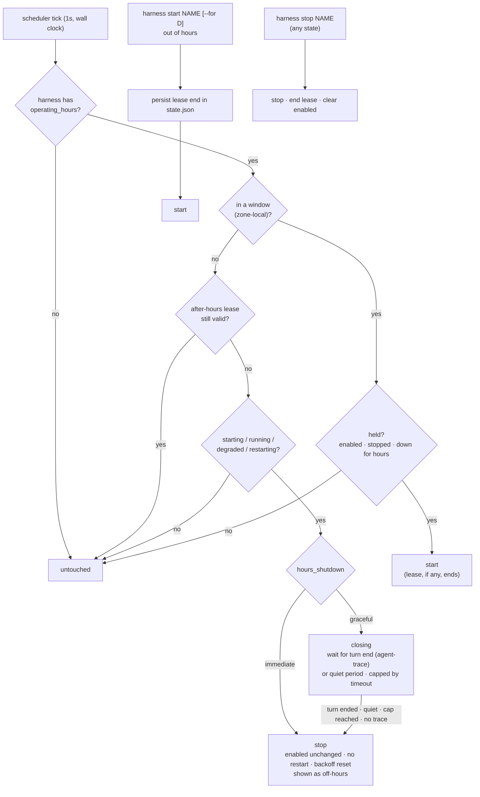

# ADR-0019: Operating hours — a daemon-owned time gate on resident harnesses

## Context and Problem Statement

A resident harness runs around the clock. That was the whole point of
ADR-0005: `claude --remote-control` should never die. But an agent that is up
is an agent that can spend tokens. It picks up whatever push events,
doorbells, and remote-control prompts arrive, at 03:00 as readily as at 10:00.
Most of this work is only worth doing while the operator is around to read the
results, which is roughly four hours a day. The other twenty hours cost money
and produce output nobody reads until morning.

ADR-0013 gave the daemon a clock, but only for **one-shot** runs. Its
exclusions deliberately keep `schedule` away from resident harnesses:
`schedule` with `enabled = true`, with profile membership, or with a respawning
`restart` policy is a parse error. So Harness can say *"run this sweep at
09:00"*, but it cannot say *"keep this agent up from 09:00 to 13:00 on
weekdays, and down the rest of the time."*

The workaround today is outside the daemon: a launchd plist or cron entry that
calls `harness start NAME` in the morning and `harness stop NAME` in the
evening. That brings back the per-unit OS timers ADR-0005 and ADR-0013 removed.
It also misuses `stop`, which persists `enabled = false` as operator intent.
Nothing can tell "stopped because it is evening" apart from "stopped because I
turned it off", and the TUI shows both as a plain stopped harness.

How should a resident harness get operating hours without changing what
`enabled` means, and without an external timer?

## Decision Drivers

* **Stopping is the saving.** The daemon cannot see tokens (it stays agnostic
  about what runs inside a harness), but it controls whether the process
  exists. A process that doesn't exist spends nothing.
* **`enabled` stays intent.** SPEC-0003 defines `enabled` as *does the operator
  want this running*. ADR-0013 refused to redefine it as *armed*, and ADR-0014
  made "an explicit `harness stop` is never undone" an invariant. Operating
  hours must sit *beside* intent, not overwrite it.
* **A laptop is not a server.** The machine sleeps through the end of the
  window, or wakes an hour after the start of one. Suspend, daemon outages and
  clock jumps are the normal case (ADR-0013).
* **One init unit, config of record.** No launchd or systemd timers.
  `harness.toml` stays a complete description of what the daemon does
  (ADR-0006).
* **The operator can always override.** A late night that needs the agent must
  be one command, and it must not silently turn into running all night.
* **The smallest thing that removes the external timer.** One key, reusing the
  ADR-0013 clock.

## Considered Options

**Axis 1 — what decides the agent is off:**

* **1A. A daemon-owned time gate on resident harnesses** (`operating_hours`),
  checked continuously against the wall clock.
* **1B. External timers** calling `harness start` / `harness stop`.
* **1C. Profile swap on a timer** (`use-profile day` / `use-profile night`).
* **1D. A token or cost budget** per harness.
* **1E. An idle timeout**: stop after N quiet minutes, start on demand.

**Axis 2 — how hours are written:**

* **2A. Weekly window strings**:
  `"TZ=America/Los_Angeles Mon-Fri 09:00-13:00"`.
* **2B. Cron membership**: the harness is in hours whenever the current minute
  matches a cron expression (`"CRON_TZ=… * 9-12 * * 1-5"`).
* **2C. A start/stop cron pair**: `start_at` and `stop_at`, acted on only at the
  instant each fires.

**Axis 3 — what happens when the window closes on a busy agent:**

* **3A. Immediate stop at close**: SIGTERM, the stop grace, then SIGKILL — the
  SPEC-0003 stop path, except that `enabled` is left alone.
* **3B. Graceful shutdown**: let the agent finish its current turn, as reported
  by agent-trace, then stop it, with a cap.
* **3C. Don't stop, just don't restart** after the next exit.

**Axis 4 — `harness start` outside hours:**

* **4A. A bounded after-hours lease** (default one hour, `--for` to change).
* **4B. Run until the next close.**
* **4C. Refuse** and tell the operator to edit the config.

## Decision Outcome

Chosen: **1A + 2A + 4A**, with **3B as the default and 3A one key away**.

> **Revision note (2026-09-17, review of #371).** The first draft chose 3A
> (stop mid-turn) and had `harness stop` on a leased harness keep `enabled`.
> Review reversed both: graceful shutdown is the configurable default, built on
> agent-trace, and `harness stop` always stops and clears `enabled`.

### The schema

```toml
[harness.claude-src]
cmd = "claude"
args = ["--remote-control", "--continue"]
enabled = true
operating_hours = "TZ=America/Los_Angeles Mon-Fri 09:00-13:00"
```

`operating_hours` is a single string: an optional `TZ=<zone>` or
`CRON_TZ=<zone>` prefix (the same prefixes, embedded IANA database and
validation as SPEC-0008 REQ "Schedule Time Zone"), then one or more windows
separated by `;`. Each window is an optional day spec followed by
`HH:MM-HH:MM`:

| Written | Means |
| --- | --- |
| `09:00-13:00` | every day, 09:00 up to (not including) 13:00 |
| `Mon-Fri 09:00-13:00` | weekdays |
| `Mon-Fri 09:00-12:00; Mon-Fri 13:00-17:00` | a lunch break |
| `Sat,Sun 10:00-12:00` | a day list |
| `Sun-Thu 22:00-02:00` | overnight: an end at or before the start runs into the next day, and the window belongs to the day it starts |
| `Mon-Sun 00:00-24:00` | always (valid, and `doctor` warns that it gates nothing) |

One string rather than a table or an array, for the reason ADR-0013 gave for
having no `timezone` key: one zone, stated once, cannot disagree with itself.

### The gate is a level, not an edge

On every scheduler tick (the ADR-0013 one-second wall-clock tick, with the
monotonic reading stripped) the daemon asks one question per gated harness:
*is the wall clock, in this zone, inside a window?*

* **Out of hours:** a harness that is `starting`, `running`, `degraded` or
  `restarting` is shut down (graceful by default; see below), unless an
  after-hours lease covers it. **`enabled` is not touched.** Once down, the
  harness is *held*.
* **Into hours:** a held harness (`enabled`, `stopped`, and down because of
  hours) is started. A `failed` harness stays failed, and a harness whose
  `enabled` is false stays down. Opening hours never overrides a human.

Because enforcement is a level and not a pair of timer events, the laptop case
needs no extra rules. A machine that sleeps through the close finds a running
agent out of hours on its first tick after waking and stops it. A daemon booted
at 10:30 treats the window as open: SPEC-0003 REQ "Autostart" starts
`enabled` harnesses only if they are in hours. There is no missed-window
bookkeeping and no `catch_up` to configure, because nothing here is a window
you can miss. There is only whether it is in hours right now.

DST needs no special rules either. A window is a range of local wall-clock
time, so on the spring-forward day a window spanning 02:00–03:00 is an hour
shorter, and on the fall-back day it is an hour longer. Nothing runs twice and
nothing is skipped.

### Closing: graceful by default

```toml
hours_shutdown = "graceful"          # default; or "immediate"
hours_shutdown_timeout = "15m"       # default; the most a close may overrun
```

* **`"graceful"`** (the default). At the close the harness enters **closing**.
  It keeps running until it is between turns, then stops. If it is still busy
  when `hours_shutdown_timeout` runs out, it is stopped anyway and the log
  records a forced stop.
* **`"immediate"`** stops at the close.

Either way the stop itself is the SPEC-0003 graceful-stop sequence (SIGTERM,
stop grace, SIGKILL), and the exit it causes is not a crash: it does not
trigger the restart policy, does not count toward crash-loop detection, and
resets the backoff. `enabled` survives, which keeps the two kinds of down
distinguishable everywhere: `harness list` shows a held harness as `off-hours`,
with the time it opens in the NEXT column, and a closing one as `closing`, with
its deadline.

**What "between turns" means.** The agent's latest turn has ended (an
end-of-turn record after the latest user message), and nothing new has
happened for a short settle period, so a follow-up prompt already queued is not
cut off. The daemon learns this from agent-trace, the library it already uses
to read claude-code, codex and crush transcripts (ADR-0011, SPEC-0006).

**What has to be built first.** agent-trace records tool calls and messages
today, but it has no end-of-turn marker for any agent:

* claude-code's `stop_reason` is not parsed, even though the transcripts carry
  it on every assistant record (`end_turn` when a turn ends, `tool_use` mid-turn);
* codex's `task_complete` event is ignored;
* crush writes a finish part at every turn end, but agent-trace only surfaces
  it when the turn failed.

Harness also follows trace events live only in the TUI, not in the daemon.
Run correlation doesn't credit a resumed session to the run it is resumed in:
a `--continue` session started before the run, so it is excluded. Graceful
shutdown therefore depends on three pieces of work:

1. agent-trace emits a turn-end marker for claude-code, codex and crush;
2. the daemon keeps a live, per-harness turn state;
3. run correlation credits a resumed session to the run whose process is
   writing it, without giving up its fail-closed rule.

**When the signal isn't there, graceful degrades one step at a time:**

| The harness has | Graceful waits for |
| --- | --- |
| An attributed session whose reader reports turn ends | The turn to end, plus the settle period |
| An attributed session with no turn markers | No trace events for a quiet period (default `2m`) |
| No attributable trace (a generic `cmd`, no workdir, an ambiguous session) | Nothing: it stops immediately, logs that graceful was unavailable, and `harness doctor` warns |

The quiet-period step is a heuristic. A long model call or tool run writes
nothing until it finishes, so silence does not prove the agent is idle. The cap
is what bounds it.

**While closing:**

* hours open again: closing is cancelled and the harness keeps running;
* `harness start`: an after-hours lease starts and closing is cancelled;
* `harness stop`: stops it now and clears `enabled`, as always;
* the agent exits on its own: the harness is held, with no restart;
* the daemon shuts down: normal daemon shutdown, and a boot out of hours
  starts nothing.

**New work during a close.** The daemon cannot stop prompts from arriving. A
doorbell that starts a new turn pushes the stop out to the cap. The fix is on
the sender's side: a Switchboard endpoint whose agent has clocked out gets no
doorbells, so a close can finish (see *More Information*).

### Overrides: a bounded lease

`harness start NAME` outside hours starts the harness under an **after-hours
lease**, one hour by default, or `harness start NAME --for 3h`. When the lease
expires the gate stops it exactly as it would at a close. When hours open first,
the lease simply ends and the harness keeps running as in-hours. The lease's
end time is written to `state.json` before the start (extending ADR-0007), so a
daemon restart neither loses nor extends it.

`harness stop NAME` means the same thing in every case: in hours, out of
hours, under a lease, closing, or already held. It stops the harness now if it
is up, ends any lease, and clears `enabled`, so no window starts it again until
someone runs `harness start`. The operator's word is final. Operating hours
never read a stop as "just for tonight".

Leases are bounded on purpose. "Run until the next close" (4B) makes a 20:00
`start` run straight through the night into the next day's window — the exact
spend this ADR exists to remove.

### Exclusions

| Rejected | Because |
| --- | --- |
| `operating_hours` with `schedule` | A cron expression already restricts when a one-shot fires; two time gates on one harness would disagree |
| `operating_hours` in a project `harness.toml` | Reload reconciliation and lease persistence are defined only for the daemon's config of record; deferred, as ADR-0013 deferred project schedules |
| A blank or unparseable value, an unknown zone, or a window whose start equals its end | A typo must fail the load with a located error, not silently gate nothing (or everything) |

Profile members, `restart` policies other than the default, and prompt
harnesses without a `schedule` are all allowed. Profile membership only decides
`enabled`, and the gate composes with any intent.

### Reload

`operating_hours` is a supervision key like `restart`, not a spawn key. A
change applies at the next tick rather than waiting for a restart (SPEC-0003
REQ "Config Change Application" already exempts keys consulted at run time).
Adding hours to a running harness out of hours holds it. Removing them from a
held harness starts it if `enabled`. A lease survives a reload unless the
harness loses `operating_hours`, which leaves the lease with nothing to extend.

### Consequences

* Good, because an agent that should only work four hours a day spends nothing
  for the other twenty, with one line of config and no OS timer.
* Good, because `enabled` keeps a single meaning. "I turned it off" and "it is
  evening" are different facts, stored differently and shown differently.
* Good, because a level-triggered gate makes suspend, daemon outages, clock
  jumps and DST fall out of one comparison instead of four special cases.
* Good, because it reuses the ADR-0013 tick, clock seam and zone handling, so
  the source-scan invariant (only `clock.go` reads time) covers it too.
* Good, because the default close lets the agent finish what it is doing, so
  the saving doesn't cost half-done work.
* Bad, because graceful shutdown depends on agent-trace work that doesn't exist
  yet (turn-end markers, live turn state, resumed-session credit). Until it
  lands, every harness falls back to the quiet period or an immediate stop.
* Bad, because a graceful close can overrun the window by up to
  `hours_shutdown_timeout`. Those minutes are the price of not losing work, and
  `"immediate"` is one key away.
* Bad, because push events that arrive while an agent is held are not received
  by it. Harness doesn't queue them, and it shouldn't: the daemon is agnostic.
  Whether they are lost depends on the sender. Switchboard keeps the todo but
  drops a doorbell that has no connected session. Its re-ring sweep counts those
  rings anyway, so a todo can use up its re-rings overnight. An agent should
  therefore re-read its queue when it starts. Holding doorbells until an agent
  is back belongs in the sender (see *More Information*).
* Bad, because every listing surface gains another branch — held versus
  stopped — on top of ADR-0013's `Schedule != ""`. It reuses the NEXT column
  rather than adding a column (#343).
* Neutral, because the scheduler tick now has a second consumer. The cost is
  still the wakeup, not the comparison.

### Confirmation

SPEC-0012 (`operating-hours`) states the grammar, the gate, leases, exclusions
and visibility as testable requirements. Acceptance, against a fake clock and
the real supervisor path:

* Advancing past a close stops a running gated harness with `enabled` still
  true, with no restart, no restart-count increment and no flap.
* Advancing past an open starts a held harness, and does not start a `failed`
  one or one with `enabled = false`.
* A clock jump over a close (suspend) stops the harness on the first tick after
  the jump. A daemon booted out of hours starts nothing gated. One booted in
  hours autostarts normally.
* `start` out of hours runs for the lease and stops at its end. `--for`
  overrides the length. A restart mid-lease resumes the same end time. `stop`
  ends the lease and clears `enabled` in every case.
* A graceful close stops at the first turn end after the close. It stops at the
  cap when the turn never ends, and falls back to the quiet period or an
  immediate stop exactly as the table above says. Reopening hours or starting a
  lease cancels a close in progress.
* Overnight windows, day ranges that wrap (`Fri-Mon`), overlapping windows, and
  both DST transition days evaluate correctly in a non-local zone.
* Each exclusion fails parsing with an error naming the harness and the key.
* A reload that adds, removes or changes `operating_hours` applies on the next
  tick without bouncing an in-hours harness.

### Deferred

* **Project-scoped operating hours.**
* **A daemon-wide default** (`[daemon] operating_hours`), and hours on a
  profile rather than on each harness.
* **Holidays and one-off closures** ("off all next week"). Editing the config
  or `harness stop` covers them for now.
* **Token budgets** (1D), which would need the trajectory data SPEC-0006
  correlates to be trusted as a meter.

## Pros and Cons of the Options

### 1A — Daemon-owned time gate (chosen)

* Good, because it keeps ADR-0005's single init unit and ADR-0006's config of
  record.
* Good, because the daemon already owns the clock, the state file and the
  supervisor path it needs.
* Bad, because the daemon's clock surface grows again (ADR-0013 accepted the
  first increment of the same cost).

### 1B — External timers calling start/stop

* Good, because it works today with no code.
* Bad, because `stop` writes `enabled = false`, so the evening timer erases the
  operator's intent and the morning timer overwrites a deliberate stop.
* Bad, because it is edge-triggered: a laptop asleep at 13:00 misses the stop
  and runs all evening.
* Bad, because it brings back OS timers and takes the hours out of
  `harness.toml`.

### 1C — Profile swap on a timer

* Good, because profiles already carry "the set I want running".
* Bad, because it still needs an external timer, with all of 1B's problems.
* Bad, because it is all-or-nothing per profile, and switching profiles is a
  heavier gesture than one harness having hours.

### 1D — Token or cost budget

* Good, because it targets the actual cost directly.
* Bad, because the daemon cannot see tokens without trusting adapter-parsed
  trajectories as a billing meter, which it doesn't do today.
* Bad, because a budget spent by 09:30 leaves the agent down for the rest of the
  working day. Budgets and hours complement each other, so this is deferred
  rather than rejected.

### 1E — Idle timeout with start on demand

* Good, because idle agents cost nothing and busy ones are never interrupted.
* Bad, because "on demand" needs the daemon to receive the demand. Doorbells
  and remote-control prompts go to the agent, not to Harness, so a stopped agent
  never hears the knock.

### 2A — Weekly window strings (chosen)

* Good, because it reads as what it means, and handles half hours, lunch breaks
  and overnight shifts.
* Bad, because it is a new small grammar with its own parser and tests.

### 2B — Cron membership

* Good, because it reuses the ADR-0013 parser.
* Bad, because `* 9-12 * * 1-5` for "09:00 to 13:00" is an off-by-one trap,
  and 09:30–13:30 needs several expressions.
* Bad, because cron describes instants, and forcing it to describe ranges
  misreads what the operator wrote.

### 2C — Start/stop cron pair

* Good, because it maps directly onto the external-timer habit.
* Bad, because it is edge-triggered, so it needs missed-edge handling for
  suspend, and two expressions can drift apart (a `stop_at` with no matching
  `start_at`).

### 3A — Immediate stop at close (configurable)

* Good, because the close is exactly when spending stops, every time.
* Good, because it needs no signal from the agent, so it works for every harness.
* Bad, because a turn in flight is cut off.

### 3B — Graceful shutdown (default)

* Good, because no work is lost at the boundary. The agent finishes the turn it
  started.
* Good, because agent-trace already reads the transcripts that hold the answer.
* Bad, because the turn-end signal has to be built in agent-trace, and it can be
  missing (generic harnesses, ambiguous sessions). Graceful needs a fallback
  and a cap.
* Bad, because a doorbell during the close can start another turn. Only the
  sender can prevent that.

### 3C — Don't restart after the next exit

* Bad, because resident agents do not exit on their own, so it saves nothing.

### 4A — Bounded after-hours lease (chosen)

* Good, because the override is one command and ends by itself.
* Bad, because it adds a flag and a persisted field.

### 4B — Run until the next close

* Bad, because an evening start runs through the night.

### 4C — Refuse outside hours

* Bad, because the operator's late night becomes a config edit and a reload.

## Architecture Diagram



## More Information

* **Extends [ADR-0005](adr-0005-supervision-and-lifecycle.md)**: a new reason
  for a supervised process to be down that is neither a crash nor an operator
  stop.
* **Extends [ADR-0006](adr-0006-configuration-and-profiles.md)**: adds
  `operating_hours` to `[harness.*]`.
* **Extends [ADR-0007](adr-0007-state-persistence-scrollback.md)**:
  `state.json` carries each harness's after-hours lease end.
* **Related [ADR-0013](adr-0013-scheduled-one-shot-jobs.md)**: shares the tick,
  the clock seam and zone parsing. `operating_hours` is to a resident harness
  what `schedule` is to a one-shot, and the two are mutually exclusive.
* **Related [ADR-0014](adr-0014-reload-autostarts-new-harnesses.md)**: a newly
  introduced `enabled` harness that is out of hours at reload is held, not
  started. Its intent is still recorded as true.
* **Related [ADR-0002](adr-0002-daemon-client-architecture.md)**: the `start`
  control op gains an optional `for`, the harness projection gains the gate
  fields, and a `harness_hours_changed` event is added (SPEC-0012).
* **Related [ADR-0011](adr-0011-agent-adapters.md)**: the adapters whose
  agent-trace readers supply turn state. SPEC-0006 gains REQ "Live Turn State",
  and its REQ "Run Correlation" gains credit for resumed sessions.
* **Depends on [agent-trace](https://github.com/stump-wtf/agent-trace)**:
  turn-end markers for claude-code (`stop_reason`), codex (`task_complete`) and
  crush (finish parts).
* **Complement, not dependency: Switchboard presence.** Harness decides
  whether the process exists. It does not decide what happens to the work that
  arrives while it doesn't. Holding an agent's doorbells while it is off shift
  and handing them over when it clocks back in belongs in
  [Switchboard](https://switchboard.stump.wtf/docs/), through endpoint
  presence (clock in / clock out, and optional shifts). Switchboard's own ADR
  records that design.
  Harness stays agnostic: it will not call Switchboard at open or close. An
  agent that clocks in when its session starts gets both behaviors with no
  coupling.
* **Governs [SPEC-0012](../openspec/specs/operating-hours/spec.md)**.
