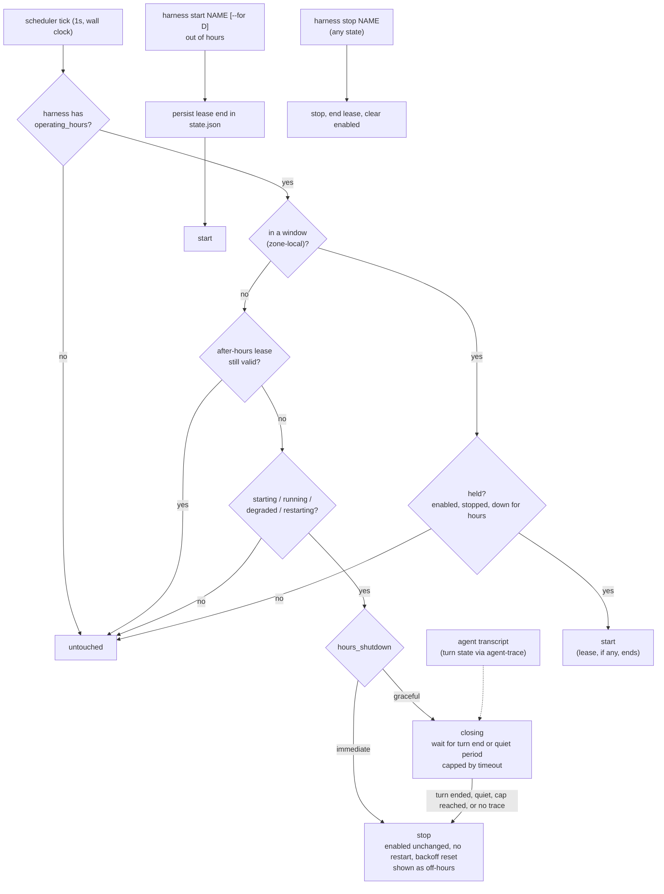

# ADR-0019: Operating hours — a daemon-owned time gate on resident harnesses

## Context and Problem Statement

A resident harness runs around the clock. That was the point of ADR-0005: a
`claude --remote-control` should never die. But an agent that is up is an agent
that can spend tokens. It picks up whatever push events, doorbells and
remote-control prompts arrive, at 03:00 as readily as at 10:00. Most of this
work is only worth doing while the operator is around to read the results,
roughly four hours a day. The other twenty hours cost money and produce output
nobody reads until morning.

ADR-0013 gave the daemon a clock, but only for **one-shot** runs, and its
exclusions keep `schedule` away from resident harnesses: `schedule` with
`enabled = true`, with profile membership, or with a respawning `restart`
policy is a parse error. So Harness can say *"run this sweep at 09:00"*, but
without this decision it cannot say *"keep this agent up from 09:00 to 13:00 on
weekdays, and down the rest of the time."*

The workaround is outside the daemon: a launchd plist or cron entry that calls
`harness start NAME` in the morning and `harness stop NAME` in the evening. That
brings back the per-unit OS timers ADR-0005 and ADR-0013 removed. It also
misuses `stop`, which persists `enabled = false` as operator intent, so nothing
can tell "stopped because it is evening" from "stopped because the operator
turned it off", and the TUI shows both as a plain stopped harness.

How should a resident harness get operating hours without changing what
`enabled` means, and without an external timer?

## Decision Drivers

* **Stopping is the saving.** The daemon cannot see tokens (it stays agnostic
  about what runs inside a harness), but it controls whether the process exists.
  A process that does not exist spends nothing.
* **`enabled` stays intent.** SPEC-0003 defines `enabled` as *does the operator
  want this running*. ADR-0013 refused to redefine it as *armed*, and ADR-0014
  made "an explicit `harness stop` is never undone" an invariant. Operating
  hours sit *beside* intent, not over it.
* **A laptop is not a server.** The machine sleeps through the end of the
  window, or wakes an hour after the start of one. Suspend, daemon outages and
  clock jumps are the normal case (ADR-0013).
* **One init unit, config of record.** No launchd or systemd timers;
  `harness.toml` stays a complete description of what the daemon does
  (ADR-0006).
* **The operator can always override.** A late night that needs the agent is one
  command, and it must not silently turn into running all night.
* **Don't lose work at the boundary.** Stopping an agent mid-turn throws away
  the turn it was paying for.
* **The smallest thing that removes the external timer.** One key, reusing the
  ADR-0013 clock.

## Considered Options

This ADR settles four questions.

### Decision 1 — What decides the agent is off

* **Option 1 — A daemon-owned time gate on resident harnesses**
  (`operating_hours`), checked continuously against the wall clock.
* **Option 2 — External timers** calling `harness start` and `harness stop`.
* **Option 3 — A profile swap on a timer** (`use-profile day`,
  `use-profile night`).
* **Option 4 — A token or cost budget** per harness.
* **Option 5 — An idle timeout**: stop after N quiet minutes, start on demand.

### Decision 2 — How hours are written

* **Option 1 — Weekly window strings**:
  `"TZ=America/Los_Angeles Mon-Fri 09:00-13:00"`.
* **Option 2 — Cron membership**: the harness is in hours whenever the current
  minute matches a cron expression (`"CRON_TZ=… * 9-12 * * 1-5"`).
* **Option 3 — A start/stop cron pair**: `start_at` and `stop_at`, acted on only
  at the instant each fires.

### Decision 3 — What happens when the window closes on a busy agent

* **Option 1 — Immediate stop**: SIGTERM, the stop grace, then SIGKILL (the
  SPEC-0003 stop path, except that `enabled` is left alone).
* **Option 2 — Graceful shutdown**: let the agent finish its current turn, as
  reported by agent-trace, then stop it, with a cap.
* **Option 3 — Don't stop, just don't restart** after the next exit.

### Decision 4 — `harness start` outside hours

* **Option 1 — A bounded after-hours lease** (one hour by default, `--for` to
  change).
* **Option 2 — Run until the next close.**
* **Option 3 — Refuse**, and tell the operator to edit the config.

## Decision Outcome

Decision 1: chosen option **Option 1 — A daemon-owned time gate**, because the
daemon already owns the clock, the state file and the supervisor path, and a
gate beside `enabled` keeps intent intact.

Decision 2: chosen option **Option 1 — Weekly window strings**, because they
read as what they mean and describe ranges, which is what hours are.

Decision 3: chosen option **Option 2 — Graceful shutdown** as the default, with
**Option 1 — Immediate stop** one key away, because a close should not throw away
the turn in flight, and an operator who values the boundary over the turn can
say so.

Decision 4: chosen option **Option 1 — A bounded after-hours lease**, because the
override is one command and ends by itself.

`harness stop` always stops the harness and clears `enabled`, whatever the
hours, the lease or the close state.

### The schema

```toml
[harness.claude-src]
harness = "claude-code"
args = ["--remote-control", "--continue"]
enabled = true
operating_hours = "TZ=America/Los_Angeles Mon-Fri 09:00-13:00"
```

`operating_hours` is a single string: an optional `TZ=<zone>` or
`CRON_TZ=<zone>` prefix (the same prefixes, embedded IANA database and
validation as SPEC-0008 REQ "Schedule Time Zone"), then one or more windows
separated by `;`. Each window is an optional day spec followed by
`HH:MM-HH:MM`:

| Written | Means |
| --- | --- |
| `09:00-13:00` | every day, 09:00 up to (not including) 13:00 |
| `Mon-Fri 09:00-13:00` | weekdays |
| `Mon-Fri 09:00-12:00; Mon-Fri 13:00-17:00` | a lunch break |
| `Sat,Sun 10:00-12:00` | a day list |
| `Sun-Thu 22:00-02:00` | overnight: an end at or before the start runs into the next day, and the window belongs to the day it starts |
| `Mon-Sun 00:00-24:00` | always (valid, and `harness doctor` warns that it gates nothing) |

One string rather than a table or an array, for the reason ADR-0013 gave for
having no `timezone` key: one zone, stated once, cannot disagree with itself.

### The gate is a level, not an edge

On every scheduler tick (the ADR-0013 one-second wall-clock tick, with the
monotonic reading stripped) the daemon asks one question per gated harness:
*is the wall clock, in this zone, inside a window?*

* **Out of hours:** a harness that is `starting`, `running`, `degraded` or
  `restarting` is shut down (gracefully by default; see below), unless an
  after-hours lease covers it. **`enabled` is not touched.** Once down, the
  harness is *held*.
* **Into hours:** a held harness (`enabled`, `stopped`, and down because of
  hours) is started. A `failed` harness stays failed, and a harness whose
  `enabled` is false stays down. Opening hours never overrides a human.

Because enforcement is a level and not a pair of timer events, the laptop case
needs no extra rules. A machine that sleeps through the close finds a running
agent out of hours on its first tick after waking and stops it. A daemon booted
at 10:30 treats the window as open: SPEC-0003 REQ "Autostart" starts `enabled`
harnesses only if they are in hours. There is no missed-window bookkeeping and
no `catch_up` to configure, because nothing here is a window that can be missed;
there is only whether it is in hours right now.

DST needs no special rules either. A window is a range of local wall-clock
time, so on the spring-forward day a window spanning 02:00–03:00 is an hour
shorter, and on the fall-back day it is an hour longer. Nothing runs twice and
nothing is skipped.

### Closing: graceful by default

```toml
hours_shutdown = "graceful"          # default; or "immediate"
hours_shutdown_timeout = "15m"       # default; the most a close may overrun
```

* **`"graceful"`** (the default). At the close the harness enters **closing**.
  It keeps running until it is between turns, then stops. If it is still busy
  when `hours_shutdown_timeout` runs out, it is stopped anyway and the log
  records a forced stop.
* **`"immediate"`** stops at the close.

Either way the stop itself is the SPEC-0003 graceful-stop sequence (SIGTERM,
stop grace, SIGKILL), and the exit it causes is not a crash: it does not trigger
the restart policy, does not count toward crash-loop detection, and resets the
backoff. `enabled` survives, which keeps the two kinds of down distinguishable
everywhere: `harness list` shows a held harness as `off-hours`, with the time it
opens in the NEXT column, and a closing one as `closing`, with its deadline.

**What "between turns" means.** The agent's latest turn has ended (an
end-of-turn record after the latest user message), and nothing new has happened
for a short settle period, so a follow-up prompt already queued is not cut off.

### The turn signal

The daemon keeps a **live, per-harness turn state** from the agent's own
transcript, read with agent-trace (ADR-0011, SPEC-0006 REQ "Live Turn State").
It follows only harnesses a graceful close is waiting on, or that are within a
minute of one, so the rest of the day costs no trace I/O. Sessions are
attributed with SPEC-0006 REQ "Run Correlation", which credits a resumed session
(a `--continue` session started before the run) to the run whose process is
writing it, without giving up its fail-closed rule.

The turn-end marker itself comes from agent-trace's per-agent readers, and none
of them reports it yet (agent-trace#102):

* claude-code transcripts carry `stop_reason` on every assistant record
  (`end_turn` when a turn ends, `tool_use` mid-turn), and the reader does not
  parse it;
* codex's `task_complete` event is ignored, and its name is asserted rather than
  verified against a real transcript;
* crush writes a finish part at every turn end, and the reader surfaces it only
  when the turn failed.

Until a reader reports turn ends, every graceful close for that agent uses the
quiet-period step below. When one does, closes for that agent switch to turn
ends with no change to the daemon's callers.

**When the signal is missing, graceful degrades one step at a time:**

| The harness has | Graceful waits for |
| --- | --- |
| An attributed session whose reader reports turn ends | The turn to end, plus the settle period |
| An attributed session with no turn markers | No trace events for a quiet period (default `2m`) |
| No attributable trace (a `generic` harness, no workdir, an ambiguous session) | Nothing: it stops immediately, logs that graceful was unavailable, and `harness doctor` warns |

The quiet-period step is a heuristic. A long model call or tool run writes
nothing until it finishes, so silence does not prove the agent is idle. The cap
bounds it.

**While closing:**

* hours open again: closing is cancelled and the harness keeps running;
* `harness start`: an after-hours lease starts and closing is cancelled;
* `harness stop`: stops it now and clears `enabled`, as always;
* the agent exits on its own: the harness is held, with no restart;
* the daemon shuts down: normal daemon shutdown, and a boot out of hours starts
  nothing.

**New work during a close.** The daemon cannot stop prompts from arriving. A
doorbell that starts a new turn pushes the stop out to the cap. The fix is on
the sender's side: a Switchboard endpoint whose agent has clocked out gets no
doorbells, so a close can finish (see *More Information*).

### Overrides: a bounded lease

`harness start NAME` outside hours starts the harness under an **after-hours
lease**, one hour by default, or `harness start NAME --for 3h`. When the lease
expires the gate stops it exactly as it would at a close. When hours open first,
the lease simply ends and the harness keeps running as in-hours. The lease's end
time is written to `state.json` before the start (extending ADR-0007), so a
daemon restart neither loses nor extends it.

`harness stop NAME` means the same thing in every case: in hours, out of hours,
under a lease, closing, or already held. It stops the harness now if it is up,
ends any lease, and clears `enabled`, so no window starts it again until someone
runs `harness start`. The operator's word is final; operating hours never read
a stop as "just for tonight".

Leases are bounded on purpose. Running until the next close (Decision 4,
Option 2) makes a 20:00 `start` run straight through the night into the next
day's window, the exact spend this ADR exists to remove.

### Exclusions

| Rejected | Because |
| --- | --- |
| `operating_hours` with `schedule` | A cron expression already restricts when a one-shot fires; two time gates on one harness would disagree |
| `operating_hours` in a project `harness.toml` | Reload reconciliation and lease persistence are defined only for the daemon's config of record |
| A blank or unparseable value, an unknown zone, or a window whose start equals its end | A typo must fail the load with a located error, not silently gate nothing (or everything) |

Profile members, any `restart` policy, and prompt harnesses without a
`schedule` are all allowed. Profile membership only decides `enabled`, and the
gate composes with any intent.

### Reload

`operating_hours` is a supervision key like `restart`, not a spawn key. A
change applies at the next tick rather than waiting for a restart (SPEC-0003 REQ
"Config Change Application" exempts keys consulted at run time). Adding hours to
a running harness out of hours holds it. Removing them from a held harness
starts it if `enabled`. A lease survives a reload unless the harness loses
`operating_hours`, which leaves the lease with nothing to extend. A close in
progress re-reads its timeout on every step, so a reload applies to it too.

### Consequences

* Good, because an agent that should only work four hours a day spends nothing
  for the other twenty, with one line of config and no OS timer.
* Good, because `enabled` keeps a single meaning. "The operator turned it off"
  and "it is evening" are different facts, stored differently and shown
  differently.
* Good, because a level-triggered gate makes suspend, daemon outages, clock
  jumps and DST fall out of one comparison instead of four special cases.
* Good, because it reuses the ADR-0013 tick, clock seam and zone handling, so
  the gate needs no new time source. `internal/hours` is time-free by
  construction: it answers only for a time its caller supplies, and a
  source-scan test forbids clock reads and timers in it, as one does in
  `internal/scheduler`.
* Good, because the default close lets the agent finish what it is doing, so
  the saving does not cost half-done work.
* Bad, because graceful shutdown's precise step depends on turn-end markers
  agent-trace does not emit yet. Until it does, every graceful close waits for a
  quiet period, which can stop an agent in the middle of a long, silent tool
  run, or wait out the cap on a chatty one.
* Bad, because a graceful close can overrun the window by up to
  `hours_shutdown_timeout`. Those minutes are the price of not losing work, and
  `"immediate"` is one key away.
* Bad, because push events that arrive while an agent is held are not received
  by it. Harness does not queue them, and should not: the daemon is agnostic.
  Whether they are lost depends on the sender. Switchboard keeps the todo but
  drops a doorbell that has no connected session, and its re-ring sweep counts
  those rings anyway, so a todo can use up its re-rings overnight. An agent
  should therefore re-read its queue when it starts. Holding doorbells until an
  agent is back belongs in the sender (see *More Information*).
* Bad, because every listing surface gains another branch (held versus
  stopped) on top of ADR-0013's `Schedule != ""`. It reuses the NEXT column
  rather than adding one.
* Neutral, because the scheduler tick has a second consumer. The cost is still
  the wakeup, not the comparison.

### Confirmation

SPEC-0012 states the grammar, the gate, the close, leases, exclusions and
visibility as testable requirements. Acceptance, against a fake clock and the
real supervisor path:

* Advancing past a close stops a running gated harness with `enabled` still
  true, with no restart, no restart-count increment and no flap.
* Advancing past an open starts a held harness, and does not start a `failed`
  one or one with `enabled = false`.
* A clock jump over a close (suspend) stops the harness on the first tick after
  the jump. A daemon booted out of hours starts nothing gated; one booted in
  hours autostarts normally.
* `start` out of hours runs for the lease and stops at its end. `--for`
  overrides the length. A restart mid-lease resumes the same end time. `stop`
  ends the lease and clears `enabled` in every case.
* A graceful close stops at the first turn end after the close, stops at the cap
  when the turn never ends, and falls back to the quiet period or an immediate
  stop exactly as the table above says. Reopening hours or starting a lease
  cancels a close in progress.
* Overnight windows, day ranges that wrap (`Fri-Mon`), overlapping windows, and
  both DST transition days evaluate correctly in a non-local zone.
* Each exclusion fails parsing with an error naming the harness and the key.
* A reload that adds, removes or changes `operating_hours` applies on the next
  tick without bouncing an in-hours harness.

## Pros and Cons of the Options

### Decision 1, Option 1 — Daemon-owned time gate

* Good, because it keeps ADR-0005's single init unit and ADR-0006's config of
  record.
* Good, because the daemon already owns the clock, the state file and the
  supervisor path it needs.
* Bad, because the daemon's clock surface grows again (ADR-0013 accepted the
  first increment of the same cost).

### Decision 1, Option 2 — External timers calling start and stop

* Good, because it works with no code.
* Bad, because `stop` writes `enabled = false`, so the evening timer erases the
  operator's intent and the morning timer overwrites a deliberate stop.
* Bad, because it is edge-triggered: a laptop asleep at 13:00 misses the stop
  and runs all evening.
* Bad, because it brings back OS timers and takes the hours out of
  `harness.toml`.

### Decision 1, Option 3 — Profile swap on a timer

* Good, because profiles already carry "the set I want running".
* Bad, because it still needs an external timer, with all of Option 2's
  problems.
* Bad, because it is all-or-nothing per profile, and switching profiles is a
  heavier gesture than one harness having hours.

### Decision 1, Option 4 — Token or cost budget

* Good, because it targets the actual cost directly.
* Bad, because the daemon cannot see tokens without trusting adapter-parsed
  trajectories as a billing meter, which it does not do.
* Neutral, because budgets and hours complement each other: a budget spent by
  09:30 leaves the agent down for the rest of the working day, which hours
  alone never would.

### Decision 1, Option 5 — Idle timeout with start on demand

* Good, because idle agents cost nothing and busy ones are never interrupted.
* Bad, because "on demand" needs the daemon to receive the demand. Doorbells
  and remote-control prompts go to the agent, not to Harness, so a stopped agent
  never hears the knock.

### Decision 2, Option 1 — Weekly window strings

* Good, because it reads as what it means, and handles half hours, lunch breaks
  and overnight shifts.
* Bad, because it is a new small grammar with its own parser and tests.

### Decision 2, Option 2 — Cron membership

* Good, because it reuses the ADR-0013 parser.
* Bad, because `* 9-12 * * 1-5` for "09:00 to 13:00" is an off-by-one trap, and
  09:30–13:30 needs several expressions.
* Bad, because cron describes instants, and forcing it to describe ranges
  misreads what the operator wrote.

### Decision 2, Option 3 — Start/stop cron pair

* Good, because it maps directly onto the external-timer habit.
* Bad, because it is edge-triggered, so it needs missed-edge handling for
  suspend, and two expressions can drift apart (a `stop_at` with no matching
  `start_at`).

### Decision 3, Option 1 — Immediate stop at close

* Good, because the close is exactly when spending stops, every time.
* Good, because it needs no signal from the agent, so it works for every
  harness.
* Bad, because a turn in flight is cut off.

### Decision 3, Option 2 — Graceful shutdown

* Good, because no work is lost at the boundary: the agent finishes the turn it
  started.
* Good, because agent-trace already reads the transcripts that hold the answer.
* Bad, because the turn-end signal has to come from agent-trace's readers, and
  it can be missing (generic harnesses, ambiguous sessions), so graceful needs a
  fallback and a cap.
* Bad, because a doorbell during the close can start another turn, and only the
  sender can prevent that.

### Decision 3, Option 3 — Don't restart after the next exit

* Bad, because resident agents do not exit on their own, so it saves nothing.

### Decision 4, Option 1 — Bounded after-hours lease

* Good, because the override is one command and ends by itself.
* Bad, because it adds a flag and a persisted field.

### Decision 4, Option 2 — Run until the next close

* Bad, because an evening start runs through the night.

### Decision 4, Option 3 — Refuse outside hours

* Bad, because the operator's late night becomes a config edit and a reload.

## Architecture Diagram



## More Information

* **Extends ADR-0005** — a new reason for a supervised process to be down that
  is neither a crash nor an operator stop.
* **Extends ADR-0006** — adds `operating_hours`, `hours_shutdown` and
  `hours_shutdown_timeout` to `[harness.*]`.
* **Extends ADR-0007** — `state.json` carries each harness's after-hours lease
  end.
* **Related ADR-0013** — shares the tick, the clock seam and zone parsing.
  `operating_hours` is to a resident harness what `schedule` is to a one-shot,
  and the two are mutually exclusive.
* **Related ADR-0014** — a newly introduced `enabled` harness that is out of
  hours at reload is held, not started; its intent is still recorded as true.
* **Related ADR-0002** — the `start` control op takes an optional `for`, the
  harness projection carries the gate fields, and the protocol has a
  `harness_hours_changed` event (SPEC-0012). SPEC-0002's REQ "Control
  Operations" and REQ "Event Subscription" name them, since both enumerate their
  ops and events closed.
* **Related ADR-0011** — the adapters whose agent-trace readers supply turn
  state; SPEC-0006 carries REQ "Live Turn State" and the resumed-session credit
  in REQ "Run Correlation".
* **Depends on [agent-trace](https://github.com/stump-wtf/agent-trace)** —
  turn-end markers for claude-code (`stop_reason`), codex (`task_complete`,
  unverified) and crush (finish parts).
* **Complement, not dependency: Switchboard presence.** Harness decides whether
  the process exists. It does not decide what happens to the work that arrives
  while it does not. Holding an agent's doorbells while it is off shift and
  handing them over when it clocks back in belongs in
  [Switchboard](https://switchboard.stump.wtf/docs/), through endpoint presence
  (clock in, clock out, and optional shifts). Harness stays agnostic: it does
  not call Switchboard at open or close. An agent that clocks in when its
  session starts gets both behaviors with no coupling.
* **Governs SPEC-0012**.
* **Not decided here:** project-scoped operating hours; a daemon-wide default
  (`[daemon] operating_hours`) or hours on a profile rather than each harness;
  holidays and one-off closures (editing the config or `harness stop` covers
  them); token budgets (Decision 1, Option 4), which would need the trajectory
  data SPEC-0006 correlates to be trusted as a meter.
