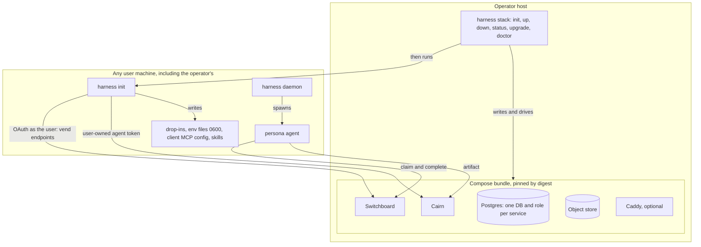
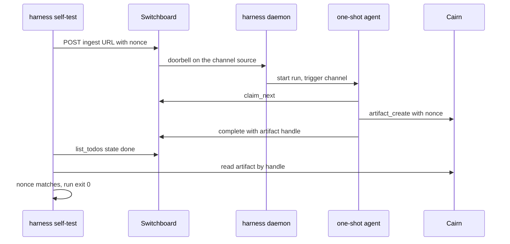

# ADR-0024: Stack installer and centralized stack management — `harness init` connects, `harness stack` operates

## Context and Problem Statement

Harness, Switchboard and Cairn close into one loop (see
[How Harness, Switchboard and Cairn fit together](https://stump-wtf.github.io/harness/guides/harness-switchboard-cairn)),
but nothing installs or wires the loop as a whole. Each product ships its own
compose file, its own credentials and its own client-configuration
instructions, and a newcomer assembles them by hand. The evidence that this
costs real people real days:

* **A self-hosting customer spent about a week assembling the stack.** They
  ran the published `ghcr.io/stump-wtf/switchboard:latest`, which is `v0.2.0`,
  against docs that describe `main`. Three of the five bugs they reported were
  already fixed on `main` and not released. The reference compose pins
  `:latest` (`deploy/docker/compose.yaml` in Switchboard), so "follow the docs"
  and "run the image" produced two different products.
* **Persona setup is tedious and copy-paste heavy.** Another customer runs a
  dozen named agents. Each needs a vended Switchboard endpoint, a Cairn token,
  a client MCP configuration, a prompt, a workdir and a Harness stanza. Their
  rollout prompt for doing this with an agent runs to tens of kilobytes. The
  same customer wrote their own `harness-omp` wrapper because Harness had no
  way to run their client.
* **They asked for a one-shot install.** "Make the brew formula depend on
  Cairn and Switchboard." Joe's advice, "get the live loop working, then layer
  Harness", is also right. The two are compatible only if installing is one
  step and *verifying* is layered.
* **The Claude Code path has three sharp edges Harness owns:**
  * Headless Claude subscription auth is undocumented. `claude setup-token`
    mints a long-lived `CLAUDE_CODE_OAUTH_TOKEN`, and the repository contains
    zero references to either. The guides tell headless operators to put
    `ANTHROPIC_API_KEY` in an `env_file` (`docs/guides/first-agent.md`,
    `run-as-a-service.md`, `push-events.md`), which bills the API rather than
    the subscription. A customer found the right answer on their own.
  * A Claude Code one-shot cannot carry per-persona instructions, tools or MCP
    servers. `args` is rejected alongside `prompt` and `prompt_file`
    (`internal/config/config.go`, the two "mutually exclusive" checks), and the
    synthesized argv (`internal/adapter/adapter.go`, `ClaudeCode.PromptCommand`)
    has no slot for them. The persona has to live in the workdir's `CLAUDE.md`,
    and every one-shot sees every MCP server the user has configured.
  * Client MCP configuration is hand-written, and the vend reveal prints a
    `.mcp.json` with the bearer token inline, so the easy path puts a
    credential in a plaintext client config.
* **"It's healthy" is not "it works".** Claude Code drops a channel
  notification it has not loaded as a channel silently, and Switchboard logs
  "delivered" either way. Every install guide that ends at `/healthz` leaves the
  user one step short of a working loop, with nothing telling them so.

Two different people install things, and the design has to keep them apart.
The **operator** deploys and runs a whole instance of Switchboard and Cairn
(Joe on StumpCloud, or a customer on one host). A **user** logs in to an
instance and uses it (Joe's brother, a friend, a teammate). Both Switchboard and
Cairn treat multi-tenancy as a hard rule: every resource a user creates is owned
by that user or by a team, never by the instance.

How should Harness install the stack, connect clients and personas to it, and
manage it afterwards, for an operator on their own host and for a user of
someone else's instance, without pinning to moving targets, printing secrets,
or creating anything global?

## Decision Drivers

* **Installed is not rolled out.** Success is an agent claiming a real todo and
  leaving a real artifact, proven by content, not a health check or a
  "delivered" log line.
* **Pin what was tested.** An installer that installs `:latest` next to docs
  written for `main` reproduces the week above.
* **Operator and user are different commands.** A user of a shared instance
  must never be one flag away from running infrastructure commands against it,
  and an operator must not need a superuser credential that bypasses tenancy.
* **Nothing global.** Every endpoint, webhook, token and artifact the installer
  creates is owned by the person running it, or by a team they name.
* **Secrets are generated, stored `0600`, and never printed.** A generated
  compose file carries no secret values, so it can live in a dotfiles
  repository.
* **Homebrew stays light.** The servers are Docker services. `brew install
  harness` must not pull Postgres, Switchboard or Cairn.
* **Every question has a flag.** Interactive setup for a person, the same
  answers from a file or flags for an agent or CI. Secrets arrive from files or
  the environment, never argv.
* **The daemon stays agnostic** (ADR-0013, ADR-0019, ADR-0021). Provisioning is
  a CLI concern.
* **Converge, don't clobber.** Re-running setup is safe. It never overwrites a
  hand-edited file, a secret, or a config a dotfiles tool renders.

## Considered Options

The decision has six parts.

**Axis 1: where the installer lives.**

* **1A. In Harness:** `harness init` (connect a client and personas to an
  instance) and `harness stack` (operate an instance).
* **1B. A new `stumpctl` binary** in its own repository.
* **1C. Per product.** Switchboard and Cairn each ship an installer. Harness
  only documents how to connect.
* **1D. Homebrew dependencies.** `brew install harness` depends on `cairn` and
  `switchboard` formulae that run the servers under `brew services`.

**Axis 2: how the servers run.**

* **2A. A Docker Compose bundle** that Harness generates and drives.
* **2B. Native binaries supervised by Harness** as ordinary resident harnesses,
  with a native Postgres.
* **2C. Kubernetes manifests or a Helm chart.**

**Axis 3: which versions it installs.**

* **3A. A tested manifest embedded in each Harness release,** pinning every
  image by tag and digest, bumped by Renovate and gated by a compose smoke test.
* **3B. Resolve the newest release** of each image at install time.
* **3C. `:latest`.**

**Axis 4: how the installer gets credentials to provision with.**

* **4A. The operator is the first user.** `harness stack up` hands off to
  `harness init`, which authenticates as the signed-in human through each
  product's own OAuth and token flows, and creates only user-owned resources.
* **4B. A stack-level bootstrap credential** (an admin token generated into the
  server environment) that can create resources for anyone.
* **4C. Direct database writes** from the installer into Switchboard's and
  Cairn's Postgres.

**Axis 5: how clients are configured.**

* **5A. Per-persona generated files** (an MCP JSON file, a `crush.json` in the
  persona workdir) whose credentials are `${VAR}` references resolved from the
  persona's `env_file`.
* **5B. Edit the user's global client configuration** (`~/.claude.json`,
  `~/.config/crush/crush.json`) with literal tokens.
* **5C. Print instructions** and let the user paste.

**Axis 6: how the install is verified.**

* **6A. An end-to-end self-test.** A nonce enters through a real webhook,
  becomes a todo, rings a doorbell, fires a one-shot that claims the todo and
  writes a Cairn artifact containing the nonce, and completes the todo with the
  artifact's handle. Harness reads both back and compares content.
* **6B. Health checks** (`/healthz` on each service).
* **6C. Trust the delivery log.**

## Decision Outcome

Chosen options: **1A** (Harness), **2A** (a Compose bundle), **3A** (an
embedded, tested manifest), **4A** (the operator is the first user), **5A**
(per-persona files, secrets by reference), and **6A** (an end-to-end self-test
proven by content).

In one sentence: `harness init` is the **user's** command, a converge-style
config generator that connects clients and named personas to an instance of
Switchboard and Cairn; `harness stack` is the **operator's** command, which
writes, starts, checks and upgrades a pinned Compose bundle on this host and
then runs `harness init` as its first user; and both end in a self-test that
proves an agent claimed a real todo.

### Two commands, two profiles

| | `harness init` | `harness stack init / up / down / status / upgrade / doctor` |
|---|---|---|
| Who | A **user** of any instance, including the operator | The **operator** of this host's instance |
| Talks to | Switchboard and Cairn over their public APIs, as the signed-in human | The local Docker engine and the bundle directory |
| Creates | Harness config, persona files, env files, client MCP config; user- or team-owned endpoints and tokens | Compose files, a lock file, generated infrastructure secrets, Docker volumes |
| Takes a remote URL | Yes (`--connect <url>`) | **Never.** It manages the Compose project on this host |
| Needs | An account on the instance | Docker, and the host |

A user of someone else's instance runs `harness init --connect
https://switchboard.example.com` and nothing else. `harness stack` has no flag
that points it at a remote instance, so it cannot be aimed at one.

`harness stack up` finishes by running `harness init --connect` against the
URLs it just started. The operator becomes the instance's first user through
the same login flow every other user takes, and everything the installer then
creates is owned by that user. No superuser credential exists.

### `harness init`

`harness init` asks for, or reads from flags and an answers file:

* **Clients:** `claude-code`, `crush`, `codex`, and `pi-omp`. `pi-omp` is
  written as the command kind that ADR-0023 / SPEC-0017 define (an argv
  template with a prompt placeholder), which is also how any other CLI is
  added. Until that kind lands, `init` refuses `pi-omp` rather than writing a
  `generic` harness that silently runs Crush.
* **Named personas,** each from a template (below), with a client, a model and
  a workdir.
* **Instance URLs:** Switchboard, and Cairn (optional; a persona can run without
  it). A published discovery document, when the operator enables one, lets
  `--connect` take a single URL.
* **Owner:** the signed-in user by default, or a team (`--owner team:<slug>`)
  when the instance advertises teams. Switchboard ADR-0038 / SPEC-0033 and
  Cairn ADR-0029 / SPEC-0023 define teams; `init` passes the owner through and
  never invents one.
* **Claude Code auth** (below).

It then converges. For each persona it:

1. Vends (or finds) the persona's Switchboard endpoint through the operator API
   (`POST` / `GET /api/v1/endpoints`), authenticated as the user through
   Switchboard's OAuth authorization server (dynamic client registration, PKCE,
   loopback redirect). Harness registers as its own OAuth client, so its grant
   is revocable separately from the `switchboard` CLI's.
2. Obtains a Cairn agent token owned by the user or team.
3. Writes the persona's `env_file` (`0600`) with those credentials.
4. Writes the client configuration for that persona (Axis 5A).
5. Writes a `harness_d` drop-in (`<persona>.toml`) and the persona's prompt and
   system-prompt files.
6. Installs the `claude-plugin-switchboard`, `claude-plugin-cairn` and
   `claude-plugin-harness` skills for the client, from pinned refs.

Converge means: a persona whose endpoint, token and files already match is a
no-op; a changed answer shows a diff before writing; a lost credential needs
`--rotate <persona>`, which revokes and re-vends after confirmation. `init`
creates files; it never rewrites a file it did not create. If `harness.toml`
exists without `harness_d`, `init` prints the one line to add and stops, rather
than rewriting a file a dotfiles tool may render. `--dry-run` prints every file
and every API call it would make, and calls nothing that mutates.

Non-interactive mode (`--non-interactive`, or no TTY) takes every answer from
flags or `--answers FILE`, and exits `2` naming each missing answer. Secrets are
read from files or environment variables only, because argv is visible in a
process listing (ADR-0018).

### Persona templates

A template is data: a `persona.toml` (description, resident or one-shot,
default client, queues, triggers, MCP servers needed, allowed tools, a
conservative `max_runs_per_day` for one-shots in the shape ADR-0027 / SPEC-0021
define), a `prompt.md`, and a `system.md`. Built-in templates are embedded in
the binary; `$XDG_CONFIG_HOME/harness/templates/<name>/` adds or shadows them.
The built-in set maps the roles in the canonical stack page: `coordinator`
(resident, interactive), `planner`, `implementer`, `reviewer`, `verifier` (a
reviewer that defaults to a different model family than the implementer), and
`drainer`.

Generated personas are least-privilege by default. A template never turns on
a risky capability: `auto_accept` (Claude Code's
`--dangerously-skip-permissions`) and ADR-0029's `accept_dev_channels` are off
unless the user opts in for that persona, by answer or flag, and `init` warns
when they do. A one-shot persona gets `allowed_tools` instead. This follows
Joe's 2026-09-22 rule for risky capabilities: configurable, and off by default.

Templates render operator-authored files at `init` time. They never see an
event payload, so ADR-0021's rule that events reach a run as data, never as
prompt text, is untouched. There is deliberately no human-QA persona: human
work is a notification (Switchboard ADR-0034 / SPEC-0029), not a queue a person
drains.

### Claude Code one-shots gain three typed keys

A `harness = "claude-code"` prompt harness gains:

| Key | Synthesized flag | Why a typed key |
|---|---|---|
| `system_prompt_file` | `--append-system-prompt-file <path>` | The persona's standing instructions, separate from the per-run prompt |
| `mcp_config` | `--mcp-config <path> --strict-mcp-config` | Exactly the persona's servers, not every server the user configured |
| `allowed_tools` | `--allowedTools <tool>…` | Least privilege for an unattended run |

`args` stays mutually exclusive with `prompt`. These keys follow the contract
`model`, `auto_accept` and `max_turns` already follow (ADR-0011): stored as
config truth, folded into the argv at spawn, never desugared into `args`, and
rejected on any other adapter or on a harness without a prompt. An arbitrary
argv is the command kind's job (ADR-0023).

`env_file` also accepts a list, merged in order with later files winning, so a
shared `claude.env` holding one subscription token and a per-persona env file
holding that persona's endpoint token compose without copying a credential into
every file.

### Headless Claude Code auth is the subscription token

`init` offers three Claude Code auth modes and explains each:

* **Keychain.** On macOS, when the daemon runs in the user's GUI session, Claude
  Code's own login in the Keychain is inherited, and nothing is written. This
  stays the recommended macOS path (ADR-0008: secrets stay where they are).
* **Subscription token.** `claude setup-token` mints a long-lived
  `CLAUDE_CODE_OAUTH_TOKEN`. `init` asks the user to run it and paste the token
  into a hidden prompt, or reads it from a file in non-interactive mode, and
  writes it to a shared `claude.env` (`0600`). This is the headless path, and
  the guides are corrected to say so.
* **API key.** `ANTHROPIC_API_KEY`, with a plain statement that it bills the
  API, not the subscription.

`init` checks only the prefix and length of a pasted token and never prints it.

### Client configuration and skills

Credentials never land in a client configuration file. Each generated file
references them, and the persona's `env_file` supplies them:

| Client | Harness writes | Credential form |
|---|---|---|
| Claude Code | `<persona dir>/mcp.json`, passed with `--mcp-config` (one-shots through the typed key, resident sessions through `args`) | `"Authorization": "Bearer ${SWITCHBOARD_TOKEN}"` |
| Crush | `crush.json` in the persona workdir, with `options.skills_paths` | `$SWITCHBOARD_TOKEN` |
| Codex | A managed `[mcp_servers.*]` block | `bearer_token_env_var` |
| Command kind (pi/omp) | `<persona dir>/mcp.json`, exposed to the argv template | environment |

Global client configuration is edited only when the user asks for their own
interactive session to be connected too (onboarding step 2), and then through
the client's own CLI (`claude mcp add --scope user`) with `${VAR}` headers.

Skills install from pinned refs: through `claude plugin marketplace add` and
`claude plugin install` for Claude Code, or into a Harness-owned directory named
in `skills_paths` for Crush. The daemon-side skill projection of SPEC-0006 is
still unbuilt; when it lands, it replaces the per-client paths.

### `harness stack`

The bundle directory defaults to `$XDG_CONFIG_HOME/harness/stack/`.

* **`stack init`** writes the bundle and starts nothing: `compose.yaml`, a
  Postgres init script, an optional `Caddyfile`, the object-store config,
  `stack.lock.json`, and `secrets/*.env`. It asks for base URLs, the identity
  provider (an OIDC issuer, or a GitHub OAuth app; the bundle ships none),
  whether Caddy terminates TLS, and whether the object store is bundled Garage
  (the default) or an external S3 endpoint. GitHub login is offered only with an
  enrollment mode (`SWITCHBOARD_ENROLLMENT_MODE` / `CAIRN_ENROLLMENT_MODE`:
  `allowlist`, `invite` or `open`), which defaults to `invite`.
* **`stack up`** pulls the pinned images, starts the services, waits for each
  health check, verifies each running image digest against the lock, verifies
  each service's reported version against the lock, then runs `harness init
  --connect` and the self-test.
* **`stack down`** stops the services and keeps the volumes and secrets.
  Destroying data takes `--volumes` plus a typed confirmation.
* **`stack status`** shows each service's state, pinned and running digest,
  reported version, URL, and each generated secret's fingerprint (the first 12
  hex characters of its SHA-256), never its value.
* **`stack upgrade`** moves the bundle to the manifest embedded in the running
  Harness binary: it shows the plan and each component's upgrade notes, takes a
  `pg_dump` of every database (`0600`) before any migration, upgrades one
  service at a time behind its health check, re-verifies versions, and re-runs
  the self-test. A step the manifest marks breaking (Switchboard's removal of
  env-seeded receivers, a Postgres major) needs `--accept-breaking`. A
  downgrade is refused.
* **`stack doctor`** checks the host (Docker and Compose versions, ports, disk),
  the bundle (secret file modes, lock-versus-running drift, database roles, the
  Switchboard encryption key being set, reverse-proxy streaming for `/mcp/*`),
  the clients (each persona's credentials still authenticate), and, with
  `--e2e`, runs the self-test.

The bundle is **one Postgres with one database and one role per service**,
Switchboard, Cairn, an S3-compatible object store for Cairn (bundled by default,
or external), and optional **Caddy**. Without Caddy every port binds loopback.
With Caddy, the generated `Caddyfile` disables response buffering on
Switchboard's `/mcp/*` (the doorbell stream) and passes a trusted
`X-Forwarded-For`. The installer never enables either product's development
login, and never sets Cairn's instance-wide outbound webhook list, which would
be a global resource; per-owner webhooks arrive with Cairn's teams work.

`harness stack` names a noun because `harness up` and `harness down` already
mean project compose (ADR-0009). The two never share a verb path.

### Pinned, tested versions

Each Harness release embeds a stack manifest: every image by repository, tag and
digest, a minimum version per component, and upgrade notes. `:latest`, a missing
tag, and a missing digest are build errors, not warnings. Renovate proposes
bumps, and CI runs the bundle (up, health, version, self-test) on every manifest
change. The manifest's minimum versions are the first releases that match the
docs: a Switchboard release that includes self-managed webhooks (the release and
version contract of Switchboard ADR-0032 / SPEC-0027, which also makes the
reported version honest), and a Cairn release whose container reads its own
environment. Until those releases exist, `stack up` has nothing to install, and
that is the intended order: release first, installer second.

### The self-test

The last step of `stack up`, and `stack doctor --e2e` or `init --verify` at any
time:

1. Vend (or reuse) a self-test endpoint owned by the user, on a
   `harness-selftest` queue.
2. Bind a one-shot `selftest` harness to that endpoint as an ADR-0021 channel
   source, so the doorbell starts it with no polling. Where the listener is not
   available, start the one-shot directly and report the push path "not
   verified".
3. POST a synthetic delivery carrying a random nonce to the endpoint's
   token-trust ingest URL. This is the webhook path.
4. The agent, using the client and model the user chose, claims the todo, writes
   a Cairn artifact containing the nonce (tagged `harness-selftest`, one-hour
   TTL), and completes the todo with the artifact's handle.
5. Harness reads the todo back as that endpoint (`list_todos`, state `done`),
   fetches the artifact by the handle in the result, and checks that the body
   contains the nonce and that the run record shows exit 0 and trigger
   `channel` (`harness runs --json`; ADR-0028 / SPEC-0022 extends the ledger).

Only an agent that claimed the todo could have read the nonce, and only its
Cairn identity could have written that artifact. Each step reports pass, fail
or not verified, and the first failure names the component and the next thing
to check. When Switchboard's doorbell acknowledgement and `doctor` /
`test_doorbell` land (ADR-0030 / SPEC-0025), the self-test calls them, and each
resident persona's endpoint is checked for an agent that actually hears its
doorbell.

### What this changes in earlier records

* **ADR-0019 and ADR-0021 say Harness will not call Switchboard** ("it will not
  call Switchboard at open or close"; the daemon "must never call an upstream's
  tools"). This ADR keeps both for the **daemon**, and adds a narrow,
  deliberate exception for the **CLI**: `harness init`, `harness stack` and the
  self-test call Switchboard's operator API and MCP tools, and Cairn's API, at
  provisioning and verification time only. Nothing the daemon runs does.
* **ADR-0011's `args`/`prompt` exclusion stands.** Three typed keys are added
  beside `model`, `auto_accept` and `max_turns`.
* **ADR-0006's `env_file`** becomes a string or a list. A string still means
  exactly what it meant.
* **ADR-0008's secrets rule stands** and is applied to generated secrets:
  created with a CSPRNG, `0600` in a `0700` directory, referenced by path,
  never printed, never in `harness.toml`, `state.json` or a log.

### Consequences

* Good, because installing the stack is one command and verifying it is
  layered, with a proof at the end that does not lie.
* Good, because the installed versions are the tested versions, and the
  running digests are checked against them.
* Good, because operator and user are separate commands, and neither needs a
  credential that bypasses tenancy. The operator's own resources are created
  exactly as a friend's would be.
* Good, because personas stop being hand-assembled. A dozen named agents is a
  template choice and a model per persona.
* Good, because Claude Code one-shots can carry a persona and least-privilege
  tools and servers, and headless subscription auth is documented and wired.
* Good, because a generated `compose.yaml`, drop-in and client config carry no
  secret, so they can be committed to dotfiles.
* Bad, because Harness now carries an installer's bug surface: Docker and
  Compose versions, image registries, OAuth flows against two services, and
  the file formats of four clients. Every client's configuration format is a
  moving target Harness has to track.
* Bad, because Harness releases now gate stack upgrades. A Switchboard fix is
  not installable through `harness stack` until a Harness release carries its
  manifest bump.
* Bad, because headless OAuth against Switchboard is awkward: the loopback
  redirect needs a browser on the same machine or an SSH port forward, until
  Switchboard offers a device-authorization grant.
* Bad, because a Cairn agent token can only be minted from a human web session
  today, so `init` asks the user to paste one until Cairn offers a consented
  CLI mint.
* Bad, because the bundle includes an object store Cairn requires, which is one
  more service to pin, back up and upgrade.
* Neutral, because every piece still works alone. The bundle is a convenience
  over each product's own documented self-hosting, not a replacement.

### Confirmation

SPEC-0018 (`stack-installer`) formalizes both commands, the templates, the
Claude Code keys, the manifest, secret handling, the self-test, and the tenancy
rules as testable requirements. Acceptance tests include:

* `harness init --non-interactive --answers` against fake Switchboard and Cairn
  servers writes the expected drop-ins, env files (mode `0600`) and client
  files, and a second run changes nothing.
* No generated file other than a `secrets/*.env` or persona `env_file`
  contains a token, and no command's stdout or stderr contains one.
* A manifest entry with `:latest`, no tag, or no digest fails the build.
* `stack up` refuses to report success when a running container's digest
  differs from the lock.
* The self-test fails when the agent completes the todo without writing the
  nonce, and when the artifact's body does not contain it.
* `harness stack` accepts no remote URL, and `init --owner team:x` fails with
  a clear error against an instance that does not advertise teams.

## Pros and Cons of the Options

### 1A — Harness (chosen; Joe's decision)

* Good, because Harness already owns the part that is hardest to get right:
  starting and supervising the agents the stack exists to serve.
* Good, because it already has the config model (`harness_d`, `env_file`), a
  forms library, and a Homebrew formula that users install first.
* Bad, because it widens Harness's job from "supervise agents" to "install and
  operate their services".

### 1B — A separate `stumpctl`

* Good, because Harness stays narrow.
* Bad, because it is a fourth binary, formula and release train, and it would
  still need Harness's config model to write personas.

### 1C — Per-product installers

* Good, because each product's own team knows its deployment best.
* Bad, because the loop is the product the user wants, and nothing would wire
  the three together or prove the loop works.

### 1D — Homebrew dependencies

* Good, because it is what a customer literally asked for.
* Bad, because the servers are Docker services with a database and an object
  store. `brew services` for Postgres, Switchboard and Cairn on every laptop
  that only wants to run agents against a shared instance is the wrong weight.

### 2A — A Compose bundle (chosen)

* Good, because both products already publish images and reference compose
  files, so the bundle composes what exists.
* Good, because one Postgres with a database per service is cheaper to run and
  back up than two.
* Bad, because it requires Docker, and Compose version differences are a bug
  surface.

### 2B — Native binaries under Harness

* Good, because Harness is a supervisor, and it would need no Docker.
* Bad, because a native Postgres and object store is a per-platform install
  problem, and supervising a database is not what Harness's restart policies
  were built for.

### 2C — Kubernetes

* Bad, because the audience is one host, a laptop or a small server.

### 3A — An embedded, tested manifest (chosen)

* Good, because the installed set is exactly what CI ran.
* Bad, because upgrades wait for a Harness release.

### 3B — Newest release at install time

* Good, because fixes arrive without a Harness release.
* Bad, because the installed set was never tested together, and two installs a
  day apart differ.

### 3C — `:latest`

* Bad, because it is the cause of the week described above.

### 4A — The operator is the first user (chosen)

* Good, because the installer never holds more power than a user.
* Good, because the operator's path and a friend's path are the same code.
* Bad, because it needs an identity provider before the first login, and a
  browser for the OAuth flows.

### 4B — A bootstrap superuser credential

* Good, because it works headless with no browser.
* Bad, because it is a credential that creates resources outside any user's
  ownership, which the tenancy rule forbids.

### 4C — Direct database writes

* Bad, because it bypasses each product's hashing, invariants, audit and
  tenancy checks, and couples Harness to their schemas.

### 5A — Per-persona files, secrets by reference (chosen)

* Good, because client configs carry no secrets and stay committable.
* Good, because each persona sees only its own servers.
* Bad, because it relies on each client's variable expansion, which Harness
  has to track.

### 5B — Edit global client config with literal tokens

* Bad, because it writes credentials into plaintext files that other tools
  read, and every persona sees every server.

### 5C — Print instructions

* Bad, because it is the status quo.

### 6A — End-to-end, proven by content (chosen)

* Good, because it cannot pass unless an agent claimed the todo and wrote the
  artifact.
* Bad, because it spends one model run per self-test.

### 6B — Health checks

* Bad, because every service can be healthy while no agent hears anything.

### 6C — The delivery log

* Bad, because "delivered" is logged whether or not anything heard it.

## Architecture Diagram

## Security

* **Secrets.** Postgres role passwords, Switchboard's encryption key and
  metrics token, object-store keys and Caddy's credentials are generated with
  `crypto/rand` into `secrets/*.env` (`0600`, directory `0700`). Compose
  references them by `env_file`; `compose.yaml` holds none. `stack status`
  shows fingerprints only. Existing secret files are never overwritten, so a
  file rendered by a secrets manager is respected.
* **User credentials.** Endpoint tokens, Cairn agent tokens and the Claude
  subscription token go only to `env_file`s (`0600`). Harness's own
  Switchboard OAuth grant is stored `0600` under its config directory and is
  revocable from Switchboard like any OAuth client.
* **No secret in argv or output.** Secrets arrive from files or the
  environment, and no command prints one, including `--dry-run` and `--json`.
* **Exposure.** Without Caddy every service binds loopback, and Postgres and
  the object store never publish a host port. The installer never enables a
  development login.
* **Supply chain.** Images are pulled by digest and verified running. Skills
  install from pinned refs of the public GitHub mirrors.
* **Untrusted input.** Server responses are data. Nothing `init` or `stack`
  reads from a server is executed or templated into a prompt.
* **Backups contain hashed tokens and encrypted webhook secrets.** They are
  written `0600` and never include the encryption key.

## Tenancy

* The installer creates nothing global. Endpoints, webhooks, Cairn tokens and
  self-test artifacts are owned by the signed-in user, or by a team the user
  names and belongs to (Switchboard ADR-0038, Cairn ADR-0029).
* The only instance-level state `harness stack` creates is infrastructure
  (databases, the encryption key, the metrics token), which no user owns.
* `harness stack` operates only the Compose project on this host, and only a
  bundle it created (the lock file records it).
* A user of a shared instance uses `harness init --connect` and never needs,
  or gets, anything more than their own account.

## Composition with Switchboard and Cairn

* **Switchboard:** the operator API's one-call mint (`POST /api/v1/endpoints`,
  Switchboard ADR-0023) and its OAuth authorization server (Switchboard
  ADR-0019); the token-trust ingest URL for the self-test's webhook;
  `list_todos` for read-back; the doorbell acknowledgement and `doctor` of
  ADR-0030; the version contract of ADR-0032; teams in ADR-0038; notify hooks
  (SPEC-0024, for ADR-0029) for servers Switchboard can reach, where `init` can
  bind a Harness webhook source instead of a channel. A device-authorization
  grant would remove the loopback-browser requirement.
* **Cairn:** agent personal access tokens owned by a human; teams and per-owner
  webhooks in ADR-0029; actionable validation errors in ADR-0025, which `init`
  surfaces verbatim. A consented CLI mint for agent tokens would remove the
  paste step. Cairn's single-binary work (cairn#246) would shrink the bundle.
* **Homebrew:** the `harness` formula gains no dependency. A `cairn` CLI
  formula (homebrew-tap#20, for cairn#183) is recommended alongside it, and an
  optional `switchboard` operator CLI formula later.

## More Information

* ADR-0006 and ADR-0016: the config file and the environment layer `init`
  writes into. ADR-0009: why the verbs sit under `stack`. ADR-0017: the
  scratchpad one-shot the self-test resembles. ADR-0018: why secrets never ride
  argv. ADR-0021: the channel and webhook sources the self-test and the
  templates bind.
* Harness records accepted with this one (2026-09-22), linked by `related`
  edges in the newer record's front matter:
  [ADR-0023](adr-0023-command-one-shots-and-templating.md) (command kind),
  [ADR-0026](adr-0026-fail-closed-model-pinning.md) (model pinning, which
  `init` will render once it lands),
  [ADR-0027](adr-0027-run-budgets-and-usage-limit-backoff.md) (budgets),
  [ADR-0028](adr-0028-run-history-ledger.md) (run history), and
  [ADR-0029](adr-0029-auto-confirm-dev-channels.md) (dev-channels
  auto-confirm, which `init` writes for a resident Claude Code persona only
  when the user opts in for that persona, with its warning). ADR-0022
  (telemetry export, #408) is not on `main` yet, so it stays cited by number.
* Cross-repo records, cited by number (accepted in the same review):
  Switchboard ADR-0030, ADR-0032, ADR-0034, ADR-0038 and SPEC-0024; Cairn
  ADR-0025 and ADR-0029.
* The canonical stack page, layered onboarding, glossary and `llms.txt` are
  planned as docs work in this repository, linked from Switchboard and Cairn.
