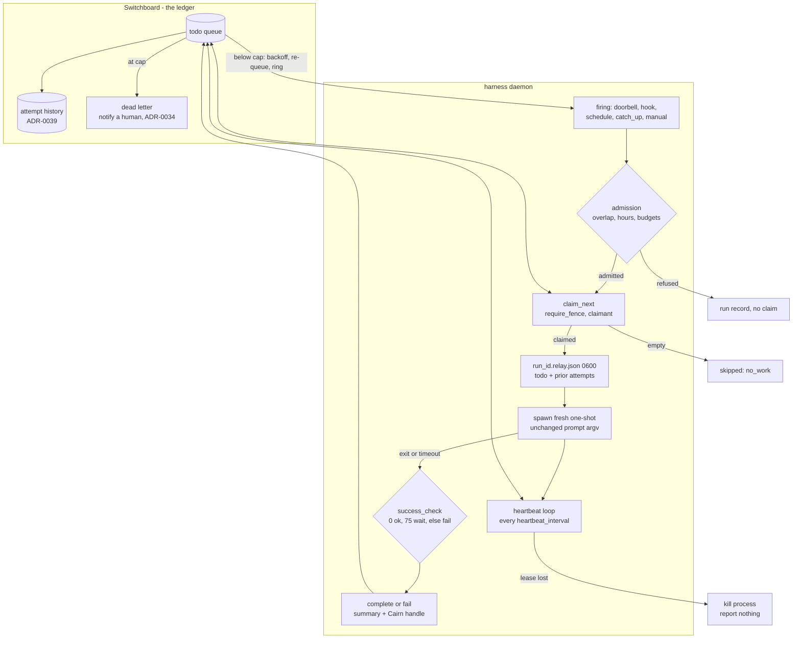
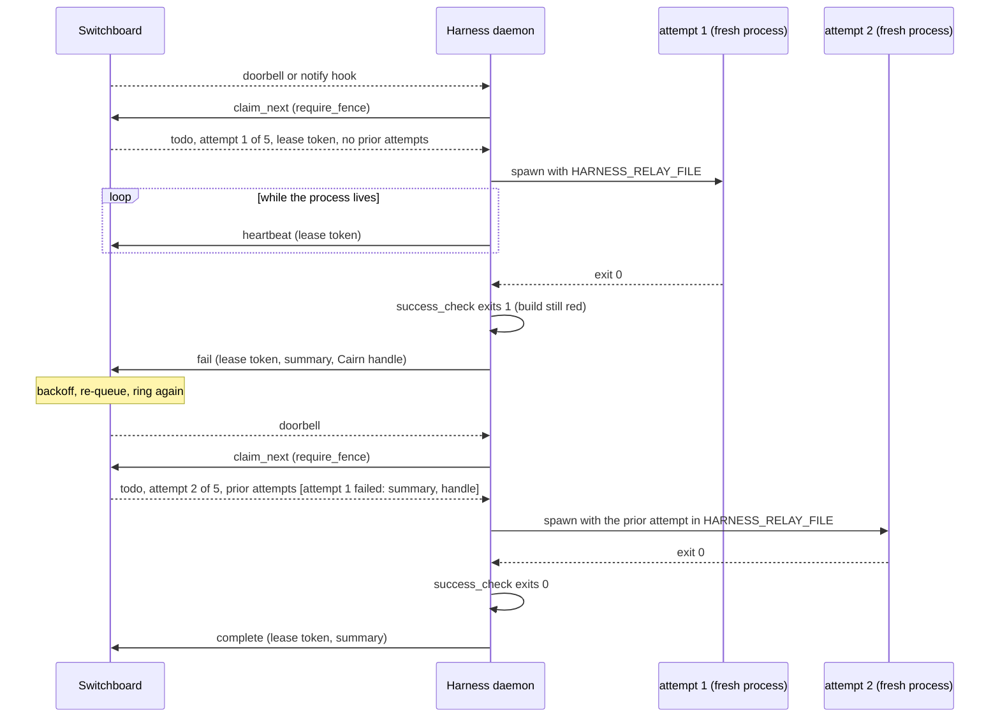

# ADR-0025: Supervisor-held leases and relay attempts — Harness claims, heartbeats and reports around a fresh one-shot

## Context and Problem Statement

ADR-0021 lets an event fire a one-shot. When the event is a Switchboard
doorbell, the one-shot drains the queue itself: its prompt tells the model to
`claim_next`, to `heartbeat` more often than the lease TTL, and to `complete` or
`fail` when it is done. ADR-0021 put it plainly: the daemon "calls no tools,
lists nothing, and never claims. The one-shot agent does the claiming." That
leaves three jobs with the model that the model does badly.

* **Models forget to heartbeat.** The fleet's own agent rules carry a dedicated
  rule, "heartbeat on a cadence, not if the work runs long", because real work
  routinely outruns the 300-second default lease. When the lease lapses,
  Switchboard's reaper returns the todo to `pending`, another worker claims it,
  and the same work is done twice. Nothing errors, and the duplicate is
  invisible from inside either session. Switchboard now counts this
  (`switchboard_lease_expired_total`, its SPEC-0023 REQ-3) because it happens.
  A self-hosting customer's rollout plan lists, as an acceptance criterion, that
  "a forced interruption and host restart recover without lost ownership or
  duplicate work".
* **The verdict is the model's opinion.** `complete` means the model decided it
  was done. For the work people most want to hand to a loop (fix the failing
  build, make the flaky test pass, get the PR's required checks green) the truth
  is a property of the world that a command can read, not a claim a model makes.
* **Only the supervisor outlives the process.** The pattern this ADR is named
  for is the one-shot relay: a fresh agent per attempt, killed when the attempt
  ends, and a new agent that takes over with the ticket, plus what the last one
  tried, if the build is still failing. A fresh process per attempt means the
  lease has to be held by something outside the process. Harness is the only
  component that sees the process start, exit, time out and get killed.

The relay also needs somewhere to keep "what the last one tried". Switchboard
cannot hold it today. A todo has one `result` column that every `complete` and
`fail` overwrites and a manual retry clears, and the reaper records nothing, so
the next claimer cannot tell an attempt that crashed from one that failed.
Switchboard ADR-0039 (SPEC-0034, written in parallel with this ADR) adds a
per-attempt record. This ADR is its first consumer.

**Should the daemon hold the lease, run a success check, and report the
verdict for a one-shot it spawned for a todo? ADR-0021 and ADR-0019 both said
Harness would not call Switchboard.**

## Decision Drivers

* **The lease is held by whatever knows whether the worker is alive.** That is
  the supervisor, not the worker.
* **The verdict comes from the world.** An operator-authored check decides
  success where one exists, and the model's self-report does not.
* **Fresh context per attempt, with notes passed forward as data.** Earlier
  attempts' summaries were written by models that read untrusted input. They
  must reach the next attempt as a file, never as prompt text.
* **Switchboard stays the ledger; Harness stays a trigger, not a queue.** ADR-0021's
  boundary holds. Harness keeps nothing durable about a todo, and the retry
  loop, attempt budget and dead letter stay Switchboard's.
* **Opt-in and narrow.** A harness without the new key behaves exactly as
  ADR-0021 specifies, and the channel listener still calls no tools.
* **Never burn an attempt on a run that will not start.** Every admission check
  runs before the claim.
* **Fail closed on a Switchboard without attempt history.** The fence is what
  stops an agent from closing its own attempt, so relay does not run without
  it. Harness and Switchboard are both pre-1.0, so there is no compatibility
  path for older servers: the fix for a stale server is a Switchboard release
  (Switchboard ADR-0032), not a degraded relay.
* **Secure by default** (ADR-0008). Credentials resolve from an `env_file`, and
  the agent must not be able to close its own attempt.

## Considered Options

The decision has four parts.

**Axis 1: who holds the lease.**

* **1A. The agent holds it.** This is ADR-0021 as written. Build nothing.
* **1B. The daemon holds it** around a fresh one-shot per attempt.
* **1C. A wrapper command holds it.** A small program (`sb-relay -- claude -p …`)
  claims, heartbeats, runs the agent as its child and reports. Harness runs the
  wrapper as an ordinary triggered harness.
* **1D. Switchboard runs the worker.** A Switchboard-side runner starts a process
  per claim.

**Axis 2: where the retry loop lives.**

* **2A. In Switchboard.** Harness reports each attempt. `fail` schedules
  Switchboard's backoff and re-queue, the re-queue rings again, and a new firing
  starts the next attempt with a new process.
* **2B. In Harness.** Harness holds one lease across several processes and
  reports only the final verdict.

**Axis 3: who decides success.**

* **3A. The agent's exit code.**
* **3B. An operator-authored `success_check` command**, falling back to the exit
  code when none is set.
* **3C. The agent calls `complete` or `fail` itself** (the status quo).

**Axis 4: which todo an attempt claims.**

* **4A. `claim_next`** on the lease source's queue, every time.
* **4B. The todo named in the firing.** Parse `meta.todo_id` from the doorbell,
  or `todo_id` from a notify hook body, and `claim` that id.

## Decision Outcome

Chosen options: **1B** (the daemon holds the lease), **2A** (Switchboard owns
the retry loop), **3B** (a success check, falling back to the exit code) and
**4A** (`claim_next`).

In one sentence: a **leased harness** is an ADR-0021 triggered harness that
names a lease source. For each firing, Harness admits the run, claims a todo
with its own endpoint credentials, spawns a fresh one-shot with the todo and the
earlier attempts in a private file, heartbeats the lease while the process
lives, runs the success check when the process ends, and reports `complete` or
`fail` with a bounded summary and a Cairn handle.

### The schema

```toml
# ~/.config/harness/harness.toml

# A lease source: the Switchboard endpoint Harness claims on. One per endpoint.
[queue.ci]
url = "https://switchboard.example.com/mcp/ci-fixer"
env_file = "~/.config/harness/env/ci-fixer.env"
headers = { Authorization = "Bearer ${SWITCHBOARD_TOKEN}" }
queue = "ci-failures"            # optional: narrow claim_next to one granted queue
lease_ttl = "5m"                 # default 5m
heartbeat_interval = "1m"        # default lease_ttl / 3

[channel.switchboard]            # ADR-0021: the doorbell for the same endpoint
url = "https://switchboard.example.com/mcp/ci-fixer"
env_file = "~/.config/harness/env/ci-fixer.env"
headers = { Authorization = "Bearer ${SWITCHBOARD_TOKEN}" }

[harness.ci-fixer]
harness = "claude-code"
prompt_file = "~/agents/ci-fixer.md"
triggers = ["channel.switchboard"]
schedule = "@every 30m"          # safety net: doorbells are lossy
lease = "queue.ci"               # this ADR
success_check = ["./scripts/required-checks-green.sh"]
success_check_timeout = "15m"
timeout = "45m"
```

`lease` holds one reference in `<kind>.<name>` form, like `triggers`. It is legal
only on a triggered harness, because an attempt is a run. A lease source may
point at the same endpoint as a channel source; that is the normal shape.

### One attempt, end to end

1. **A firing arrives**: a doorbell, a notify hook delivery, a schedule window,
   a catch-up or `harness trigger`.
2. **Admission.** `on_overlap`, operating hours, and (when Harness ADR-0027 lands)
   run budgets and usage-limit parking decide exactly as they do today. A refused
   firing is recorded as today and claims nothing.
3. **Claim.** Harness calls `claim_next` on the lease source, passing
   `lease_ttl`, a `claimant` label that names the host, harness and run, and
   `require_fence`. **The claim is the last admission step**, so an attempt is
   consumed only by a run that is about to start. An empty queue is recorded as
   `skipped` with reason `no_work`, and nothing is spawned.
4. **Context.** Harness writes `jobs/<name>/<run_id>.relay.json` (`0600`,
   beside the run log and pruned with it). It holds the todo, "attempt *n* of
   *max*", and the earlier attempts from the claim response. The run's
   environment gains `HARNESS_TODO_ID`, `HARNESS_ATTEMPT`,
   `HARNESS_MAX_ATTEMPTS`, `HARNESS_RELAY_FILE` and
   `HARNESS_ATTEMPT_SUMMARY_FILE`. The prompt argv is unchanged, exactly as
   ADR-0021 keeps it.
5. **Spawn** the one-shot through the same `StartRun` path.
6. **Heartbeat** every `heartbeat_interval`, presenting the attempt's lease
   token. If Switchboard says the lease is gone (the todo was reaped, taken over,
   retried or cancelled by its owner), or no heartbeat has succeeded by the time
   the lease would expire, Harness kills the process and reports nothing.
   Someone else may be working that todo now, so carrying on is the duplicate
   work this ADR exists to prevent.
7. **Verdict.** When the process exits, or `timeout` kills it, Harness runs
   `success_check`. Exit 0 is success. Exit 75 (`EX_TEMPFAIL`) means "not
   conclusive yet", for example CI still running, and Harness re-runs the check
   every `success_check_interval` until `success_check_timeout`. Any other exit
   is failure. With no `success_check`, the agent's exit code decides. The check
   runs even when the agent failed or timed out, because the world is the
   verdict: a build that went green is green whoever says otherwise.
8. **Report.** Harness calls `complete` or `fail` with the lease token, a bounded,
   redacted summary, a Cairn handle when one exists, and a structured result. It
   keeps heartbeating until the report is accepted or the lease deadline passes.
9. **Switchboard decides what happens next.** Below the attempt cap, `fail`
   schedules a backoff and re-queue, the re-queue rings the endpoint again, and a
   new firing starts the next attempt with a new process whose context file
   includes this attempt's summary. At the cap the todo is dead-lettered, and a
   human is notified through Switchboard's notification sinks (Switchboard
   ADR-0034, in flight).

`success_check_before = true` also runs the check after the claim and before
the spawn. If it already passes, Harness completes the todo with the summary
"already satisfied" and spawns nothing. That is the relay's "only take over if
the build is still failing", and it lets a relay converge when an earlier fix
landed after that attempt's check gave up.

### This deliberately reverses part of ADR-0021

ADR-0021's drivers say the daemon "must never call an upstream's tools", and its
channel listener "calls no tools, lists nothing, and never claims". ADR-0019
records that Harness "will not call Switchboard". **For a harness that sets
`lease`, this ADR reverses that.** The daemon becomes a narrow MCP client of
Switchboard's drain verbs (`claim_next`, `heartbeat`, `complete`, `fail`, and
`release` when the endpoint grants it) on the one endpoint the lease source
names.

What does not change:

* The ADR-0021 channel listener still calls no tools. The lease client is a
  separate MCP session that never opens the notification stream, so it is never
  a doorbell target.
* A harness without `lease` is exactly ADR-0021's.
* Harness is still a trigger, not a queue. It stores nothing durable about a
  todo: not its payload, not its lease token, not a pending verdict. A daemon
  crash mid-attempt leaves the lease to lapse, and Switchboard records that
  attempt as having died (ADR-0039).
* ADR-0019's operating hours still never call Switchboard at open or close.
  Presence is Switchboard's.

Why the reversal is worth making:

1. **Leases need a holder that outlives the worker.** A per-attempt process
   cannot hold a lease across its own death. The daemon already supervises that
   process's life, so it is the one component that can heartbeat honestly and
   stop the moment the lease is lost.
2. **The heartbeat rule moves from prompt to code.** A rule every prompt must
   restate, and every model must remember under load, becomes a loop the daemon
   runs whether or not the model is paying attention.
3. **The verdict becomes checkable.** `success_check` is operator code with an
   exit status. It is the same kind of promise `schedule` made: the daemon runs
   what the operator wrote, at the moment the operator chose.
4. **The daemon still learns almost nothing.** It learns five verbs and one
   concept, a leased work item with an attempt count. It still does not know
   what the todo means, what the agent does, or how Switchboard routes. ADR-0021
   made the same trade for the Channels protocol and signed HTTP.

ADR-0021 also deferred "result callbacks". For leased harnesses, `complete`
and `fail` are those callbacks.

### The agent cannot close its own attempt

The lease token is returned once, in the claim response. It is never written to
the context file, the run log, `state.json` or a protocol frame. Harness claims
with `require_fence`, so Switchboard refuses an unfenced `heartbeat`,
`complete` or `fail` on that attempt. Even an agent that holds the same endpoint
credential cannot complete the attempt its supervisor is judging. The
recommended shape is still least privilege: vend the lease endpoint with only
the drain verbs Harness needs, and give the agent no drain verbs on it, or a
separate read-only endpoint.

### Notes passed forward are data

Each prior attempt reaches the next as a record in the context file: the attempt
number, how it ended, whether it died rather than failed, its claimant, its
summary and its Cairn handle. Summaries were written by a model that read
untrusted input, and an attempt can try to steer its successor. That is the
ADR-0021 event-file boundary again, and it is handled the same way. The text
travels in a file that marks it untrusted, never in the prompt, bounded in size
and redacted, and the operator's prompt decides what to do with it.

The summary Harness sends is composed from facts it observed: the attempt
number, the agent's exit and duration, the check's exit and the tail of its
output. It adds whatever the agent wrote to `HARNESS_ATTEMPT_SUMMARY_FILE`,
truncated. Harness's credential redactor runs over all of it before it leaves
the host.

### The Cairn handle

A `fail` carries a Cairn handle when one exists, chosen in this order:

1. **One the agent supplied** in its summary file, for example a receipt it
   created.
2. **An attempt receipt Harness uploaded** when the harness sets
   `attempt_receipt = "cairn.<name>"`, naming an opt-in `[cairn.<name>]` source.
   The receipt holds the composed summary and a redacted tail of the run log,
   as a tagged Markdown artifact. When Cairn ADR-0027's receipt shape ships, it
   replaces the tags outright; there is no per-server fallback between them.
3. **None.** The summary alone still reaches the next attempt.

A trace handle becomes a fourth source once Harness ADR-0022 (PR #408) exports
traces and Cairn can ingest them (Cairn ADR-0015, epic #138). The relay does not
depend on it.

### Dead letters, concurrency and budgets

* **Dead letters are Switchboard's.** When the `fail` response says the todo is
  dead-lettered, Harness records `dead_lettered` on the run, emits an event and
  counts it. It does not notify anyone. Switchboard ADR-0034 (Gotify and Apprise
  sinks, in flight) notifies the owning human for every consumer's dead letters,
  not only Harness's. The budget is the todo's own `max_attempts`, so there is one
  budget with one owner.
* **One attempt per harness at a time.** ADR-0021's overlap rules are unchanged.
  A held firing claims whatever is next when it starts, so a doorbell for a todo
  somebody else already took costs nothing but an empty `claim_next`.
* **Pools come free.** Several harness tables bound to one lease source each
  fire on a doorbell (ADR-0021 fan-out), and each `claim_next` returns a
  different todo because Switchboard's scan holds `FOR UPDATE SKIP LOCKED`.
  Leasing turns ADR-0021's fan-out into competing consumers, which answers part
  of what ADR-0021 deferred as pool dispatch.
* **Budgets gate the claim.** Harness ADR-0027 (in flight) adds
  `max_concurrent`, `max_runs_per_day` and usage-limit parking. All of them are
  admission checks, so they run before the claim, and a parked harness claims
  nothing. When `max_concurrent` allows several runs of one harness, each run
  holds its own lease. An attempt that hits a usage limit mid-run ends with
  `release` when the endpoint grants it, or `fail` with reason `usage_limit`.
  A usage limit is not the work's fault, so the attempt should not read as a
  verdict on the work.

### A Switchboard without attempt history is refused

Relay requires the attempt-history surface of Switchboard ADR-0039 / SPEC-0034:
the fence (`require_fence`, `lease_token`), `claimant`, prior attempts on claim,
and `summary`, `artifact` and `dead_letter` on the report verbs. There is no
degraded mode. Without the fence, nothing stops an agent holding the same
endpoint credential from closing its own attempt, and running unfenced would
make the attempt record a claim instead of a fact. Both products are pre-1.0, so
Harness carries no compatibility path for a server that predates SPEC-0034.

The check reads the verbs' input schemas from `tools/list` when the lease client
session initializes, not the server's version string. Switchboard's tool schemas
forbid unknown properties (its SDK infers `additionalProperties: false` for
every input struct), so the schema is an exact statement of what the server
accepts. When a required argument is missing, Harness claims nothing: each
firing of a harness bound to that source is recorded `skipped` with reason
`lease_source_unsupported`, `harness doctor` fails the source, naming every
missing argument, and the error says which Switchboard release is required.
`release` stays optional, because it is a verb the endpoint may or may not be
granted, not a version difference.

### Security and tenancy

* **Credentials.** A lease source's headers resolve `${NAME}` from its own
  `env_file`, as channel sources do. They are never persisted, logged or sent in
  a protocol frame. The lease token is held in memory for one attempt only.
* **Transport.** `url` must be `https` unless loopback, because the bearer rides
  every request.
* **Least privilege.** Harness needs the drain verbs, and the agent needs none
  of them on that endpoint. `harness doctor` lists the verbs the endpoint
  advertises and flags missing or surplus ones.
* **Operator code only.** `success_check`, `lease` and `[queue.*]` are rejected
  in a project `harness.toml`, like triggers. The check's argv comes from the
  operator's config, never from an event or a todo.
* **Tenancy.** Each lease source acts as exactly one Switchboard endpoint, and
  Switchboard scopes every call to that endpoint's owner, whether a user or,
  once Switchboard ADR-0038 lands, a team. Harness never chooses a tenant. An
  attempt receipt belongs to whichever Cairn account or team owns the Cairn
  source's token (Cairn ADR-0029, in flight).
* **Blast radius.** A leased harness is an ADR-0021 harness with more reach,
  because a successful attempt completes real work. ADR-0021's guidance applies
  unchanged. The new surface is the success check, which is operator code run
  with the harness's environment.

### How it composes with Switchboard and Cairn

| Product | Record | What relay uses |
| --- | --- | --- |
| Switchboard | ADR-0039 / SPEC-0034 (in flight) | Prior attempts on the claim response, the lease token fence, `summary` and `artifact` on `complete`/`fail`, `dead_letter` on the response, the `release` verb |
| Switchboard | ADR-0029 / SPEC-0024 (in flight) | Notify hooks as the webhook-path doorbell; a re-queued retry must ring again for the next attempt to fire |
| Switchboard | ADR-0034 / SPEC-0029 (in flight) | Dead-letter notifications to a human |
| Switchboard | ADR-0035 / SPEC-0030 (in flight) | Queue admission control, which charges one unit per committed claim, so each relay attempt is one unit |
| Switchboard | ADR-0038 / SPEC-0033 (in flight) | Team-owned endpoints and queues; Harness is unaffected because it acts as one endpoint |
| Cairn | ADR-0027 / SPEC-0021 (in flight) | The attempt receipt's shape |
| Cairn | ADR-0023 / SPEC-0017 (in flight) | Server-side redaction, a second layer behind Harness's own |
| Cairn | ADR-0015 (proposed, epic #138) | Trace handles, later |

### Visibility

* Run records gain `todo_id`, `attempt`, `relay_outcome` (`completed`,
  `failed`, `released`, `lease_lost`, `report_lost`, `no_work`,
  `dead_lettered`), `check_exit` and `artifact`. They still carry no payload
  (ADR-0008).
* `harness describe` shows the lease source and its last claim and heartbeat.
  `harness doctor` checks the verbs the endpoint advertises, and fails a
  source whose server lacks attempt history.
* New events, `relay_claimed`, `relay_reported` and `relay_lease_lost`, are
  additive, so `ProtoMinor` takes one bump.
* SPEC-0013 gains `harness_relay_attempts_total{harness,outcome}` and
  `harness_relay_heartbeat_failures_total{harness}`.

### Consequences

* Good, because a lapsed lease stops depending on a model's memory. The daemon
  heartbeats while the process lives and kills the process the moment the lease
  is gone, so duplicate work from forgotten heartbeats goes away.
* Good, because "done" becomes a check the operator wrote, and a relay stops the
  moment the world says it is done.
* Good, because every attempt is a fresh context. The next agent gets the ticket
  and a bounded record of what was tried, not a transcript it has to wade
  through.
* Good, because Switchboard keeps the whole retry story: backoff, cap, dead
  letter and history. Any Harness host can take the next attempt, and a daemon
  restart loses nothing but the attempt it interrupted, which is then recorded as
  having died.
* Good, because pools of one-shot workers need no new dispatcher.
* Bad, because Harness now depends on Switchboard's API for leased harnesses.
  That is a contract to track across releases, and relay cannot run at all
  until a Switchboard release carries SPEC-0034. The upgrade note says so.
* Bad, because every attempt pays an agent cold start, and a flapping check can
  spend the whole attempt budget quickly. The budget and backoff are
  Switchboard's to tune.
* Bad, because a Switchboard outage longer than the lease kills in-flight
  attempts. That is the correct choice (carrying on risks duplicate work), and
  it is still lost work.
* Bad, because the success check is operator code that runs on every attempt.
  A slow or flaky check is a slow or flaky relay.
* Bad, because attempt summaries are a prompt-injection channel between
  attempts. The file boundary and redaction bound it; they do not remove it.
* Neutral, because agents that drain the queue themselves (ADR-0021 without
  `lease`, and resident channel workers) are untouched.

### Confirmation

SPEC-0019 (`relay-attempts`) makes this testable. Acceptance tests include:

* Against a fake Switchboard, a firing claims exactly once, writes a context
  file with the prior attempts, and spawns with prompt argv byte-identical to an
  unleased run's.
* A firing refused by overlap, hours or a budget makes no Switchboard call.
* An empty `claim_next` spawns nothing and records `skipped` / `no_work`.
* Heartbeats arrive every `heartbeat_interval` with the lease token. A
  `conflict` on heartbeat kills the process within one interval and sends no
  `complete` or `fail`.
* With Switchboard unreachable, the process is killed at the lease deadline, not
  before and not after.
* An agent that exits 0 while the check exits 1 produces `fail`. An agent that
  times out while the check exits 0 produces `complete`. Exit 75 re-runs the
  check until `success_check_timeout`.
* The lease token and the endpoint credential never appear in the context file,
  the run log, `state.json`, a protocol frame or a log line.
* A `fail` response with `dead_letter: true` records `dead_lettered` and sends no
  notification from Harness.
* Against a server without attempt history, no `claim_next` is sent, every
  firing is recorded `skipped` / `lease_source_unsupported`, and `harness
  doctor` fails the source.

### Deferred

* **Claiming the todo the firing named** (option 4B). Revisit if FIFO order
  proves wrong for someone.
* **Delivering a verdict across a daemon restart.** A verdict that cannot be
  delivered before the lease deadline is recorded `report_lost`, and Switchboard
  records the attempt as having died. Persisting it would put the lease token in
  `state.json`, which ADR-0008 rules out.
* **A Harness-side `max_attempts`.** The todo's own budget is the only budget.
* **Stdio lease sources**, which wait for ADR-0010's broker, as stdio channel
  sources do.

## Pros and Cons of the Options

### 1A — The agent holds the lease (status quo)

* Good, because it exists and needs no daemon code.
* Good, because the daemon stays out of Switchboard entirely.
* Bad, because heartbeating depends on a model remembering, which is how leases
  lapse and work is duplicated today.
* Bad, because the verdict is the model's self-report.
* Bad, because a per-attempt process cannot hold a lease across its own death,
  so the relay is impossible without a second supervisor.

### 1B — The daemon holds the lease (chosen)

* Good, because the lease holder is the process supervisor, so liveness and
  lease are one fact.
* Good, because heartbeat, kill-on-loss and report are code with tests, not
  prompt text.
* Good, because the attempt reuses ADR-0013's run machinery: records, logs,
  timeouts and overlap.
* Bad, because it reverses ADR-0021's "no upstream tools" for leased harnesses,
  and couples Harness to Switchboard's drain contract.

### 1C — A wrapper command holds the lease

* Good, because the daemon stays out of Switchboard, which is the argument
  ADR-0021's option 1C made for its bridge.
* Bad, because the wrapper is a second supervisor. It must propagate signals,
  timeouts and PTY behaviour to its child, and it hides the agent from
  `harness attach`, the run log and the observer.
* Bad, because it is one more binary to install and version on every host, and
  its state (last heartbeat, verdict) is invisible to `harness describe`.
* Neutral, because it remains available to anyone who prefers it: a leased
  harness is opt-in.

### 1D — Switchboard runs the worker

* Good, because the queue and the worker would share one process.
* Bad, because Switchboard is a multi-tenant service. Running tenant processes
  on it is a sandboxing problem it has no reason to own.
* Bad, because the work usually has to run where the code, credentials and tools
  are, which is a Harness host.

### 2A — Switchboard owns the retry loop (chosen)

* Good, because attempts, backoff, cap and dead letter already exist there and
  are visible on the Board.
* Good, because any host can take the next attempt, and a Harness restart loses
  one attempt, not the whole loop.
* Bad, because each retry waits for Switchboard's backoff and a new doorbell,
  which adds latency between attempts.

### 2B — Harness owns the retry loop

* Good, because retries are immediate and need no second doorbell.
* Bad, because Switchboard sees one long attempt. Its attempt budget, history
  and dead letter stop meaning anything, and the Board shows a single claim.
* Bad, because a daemon crash mid-loop loses every attempt's notes.

### 3A — The agent's exit code

* Good, because it needs no configuration.
* Bad, because exit status reflects the agent CLI, not the work. It is kept only
  as the fallback when no check is configured.

### 3B — An operator-authored success check (chosen)

* Good, because success is whatever the operator can test: CI status, a test
  run, an HTTP probe.
* Good, because exit 75 lets a check wait for slow evidence without a special
  protocol.
* Bad, because the check is code on the attempt's critical path, and a broken
  check fails every attempt.

### 3C — The agent reports its own verdict

* Good, because it matches how resident workers operate today.
* Bad, because it keeps the verdict and the lease with the component least able
  to hold them, and it lets a confused model complete work that is not done.

### 4A — `claim_next` every time (chosen)

* Good, because payloads stay opaque, which is ADR-0021's rule, and the doorbell
  stays a hint, which is Switchboard's.
* Good, because a firing for a todo someone else took still finds the next one.
* Bad, because the event file can describe a different todo from the one
  claimed. The context file is authoritative, and the docs must say so.

### 4B — Claim the todo the firing named

* Good, because the event and the claimed todo always agree.
* Bad, because Harness would parse payloads: `meta.todo_id` on channels, a body
  field on webhooks. That is a second reversal of ADR-0021, for no gain in a
  FIFO queue.
* Bad, because a lost race still needs a `claim_next` fallback, so 4A's code
  path exists anyway.

## Architecture Diagram





## More Information

* **Extends [ADR-0021](adr-0021-on-demand-one-shots.md).** It adds leased
  harnesses, and it reverses ADR-0021's "the daemon never calls an upstream's
  tools" for them, as described above. Firing, overlap, event files and the
  channel listener are otherwise unchanged. ADR-0021's deferred result callbacks
  are delivered for leased harnesses.
* **Extends [ADR-0013](adr-0013-scheduled-one-shot-jobs.md).** An attempt is a
  run, and its record gains relay fields. A run now spans the claim, the process,
  the check and the report.
* **Extends [ADR-0008](adr-0008-security-and-secrets.md).** Lease source
  credentials follow the `env_file` rule, and the lease token is a capability
  held in memory for one attempt.
* **Related [ADR-0019](adr-0019-operating-hours.md).** Hours gate firings before
  the claim. ADR-0019's "will not call Switchboard at open or close" still holds.
* **Related [ADR-0020](adr-0020-prometheus-metrics-endpoint.md).** Relay adds two
  metric families.
* **Related [ADR-0011](adr-0011-agent-adapters.md)** and
  **[ADR-0006](adr-0006-configuration-and-profiles.md).** The prompt and argv are
  unchanged, and the config gains `[queue.*]`, `[cairn.*]` and harness keys.
* **Related records accepted with this one (2026-09-22):**
  [ADR-0023](adr-0023-command-one-shots-and-templating.md) (command kind;
  relay wraps the run, so it applies to that kind too), linked in this ADR's
  front matter; [ADR-0026](adr-0026-fail-closed-model-pinning.md),
  [ADR-0027](adr-0027-run-budgets-and-usage-limit-backoff.md) (budgets) and
  [ADR-0028](adr-0028-run-history-ledger.md) (run history), which carry the
  `related` edge to this ADR. ADR-0022 (telemetry export, #408) is not on
  `main` yet, so it stays cited by number.
* **Cross-repo records, cited by number (accepted in the same review):**
  Switchboard ADR-0039 / SPEC-0034 (attempt history, this ADR's sibling),
  ADR-0029 / SPEC-0024, ADR-0034 / SPEC-0029, ADR-0035 / SPEC-0030 and
  ADR-0038 / SPEC-0033. Cairn ADR-0023, ADR-0027 and ADR-0029.
* **SPEC-0019 (`relay-attempts`)** formalizes this ADR.
* The one-shot relay pattern (a fresh agent per attempt, with notes passed
  forward) was raised in a community discussion.
* Switchboard's lease model (SQS-style visibility, `heartbeat` as
  `ChangeMessageVisibility`, bounded retries and the reaper) is described in the
  [Switchboard docs](https://switchboard.stump.wtf/docs/).
