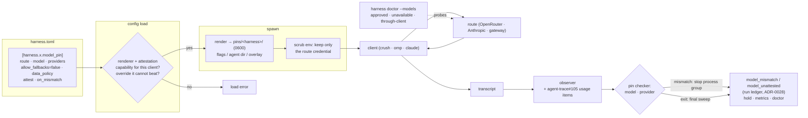

# ADR-0026: Fail-closed model pinning — render the route, attest what was served

## Context and Problem Statement

A harness names its model with one key, `model`. It is a string folded into the
synthesized argv as `--model` (ADR-0011), and only prompt one-shots accept it.
Nothing else about where a model call goes is expressed in Harness, and nothing
checks afterwards what actually answered.

That is a gap for any operator whose policy is "the approved model, on the
approved provider, or nothing":

* **Providers substitute by default.** OpenRouter load-balances a model across
  the providers that serve it, and falls back to another provider when one
  fails. It only stops doing that when the request says so:
  `provider.allow_fallbacks = false`, `provider.only`, and the data-policy
  fields `data_collection = "deny"` and `zdr = true`. Model-level fallback
  (`models: [...]`) and auto-routing (`openrouter/auto`) substitute the model
  itself. A client that never sends these fields gets substitution.
* **Our docs recommend substitution.** `docs/usage/configuration.md`, "Model
  routing and provider failover", recommends a LiteLLM gateway with retries,
  `fallbacks` to a cheaper tier, and cooldown re-probes. It is the right advice
  for an always-on worker. The same page concedes that failover "removes a
  fail-closed spend cap" and is "the wrong one for an unattended cron job that
  nobody is watching". Harness offers no fail-closed alternative.
* **Nothing verifies the served model.** The daemon's agent event observer
  (`internal/observe`) reads agent-trace events for every
  harness. agent-trace exposes a session-level `SessionMeta.Model` only: no
  per-call model and no provider. SPEC-0013's reachability series count calls
  and errors, not *which* model answered. A silent substitution looks exactly
  like a healthy run.
* **Claude Code has its own fallback.** `--fallback-model` switches models when
  the primary is overloaded. Nothing stops a pinned harness's `args` from
  carrying it.

The evidence is a self-hosting customer. Their operating policy has a numbered
rule: an unavailable approved model or provider "causes a safe stop and
notification, never a quiet fallback". Their plan requires recording the exact
model, provider and privacy policy of every run. To get that under Harness they
built it themselves: a wrapper that scrubs the child's credentials, applies a
pinned routing overlay in an isolated profile, and checks the session
transcript for the exact selector. They also hand-built an **11-case canary
matrix** to prove there was no silent substitution: a normal request reports the
approved model and provider; a deliberately unavailable route fails safely
(missing key, clean non-zero exit); no completion is ever produced by a
fallback; and the zero-data-retention setting is confirmed. All of it now lives
outside Harness, re-implemented per client.

How does Harness guarantee that a harness's model calls go only to an approved
model on approved providers under an approved data policy, stop rather than
substitute when that route is unavailable, and prove it after every run?

## Decision Drivers

* **Fail closed.** Whenever Harness cannot express, enforce or verify a pin, the
  answer is a refusal (at load, at spawn, or at run end), never best effort.
* **Defence in depth.** Configuration can be overridden by a workdir file, a
  client upgrade, or a gateway someone else edits. Enforcement at the request
  and verification of the response must be separate mechanisms, so one failing
  is caught by the other.
* **Declare once, render per client.** The operator states the pin once.
  Harness knows how Crush, Pi/OMP and Claude Code each express it.
* **Never edit a user's own config.** A pin is rendered into files and flags
  Harness owns, for that harness alone.
* **Honest capability.** If a client cannot express part of the pin, or its
  transcript cannot prove part of it, that is a load error naming the gap, not a
  silently weaker pin.
* **Availability is the operator's trade.** Gateway failover stays correct for
  resident workers that must keep answering. The pin is the other choice, made
  per harness, with the consequences stated.
* **Credentials stay in `env_file`** (ADR-0008), and a pinned child must not
  hold keys for routes it is not pinned to.
* **Proof on demand.** The canary the customer built by hand becomes one
  command.

## Considered Options

**Axis 1: where the pin is enforced.**

* **1A. Declare and verify only.** Nothing is rendered. Harness attests the
  served model after each run.
* **1B. Render into each client's own config, and attest from the transcript.**
* **1C. A Harness-run egress proxy.** Each pinned harness talks to a loopback
  proxy that injects the provider preferences into every request and reads
  `model`/`provider` from every response.
* **1D. Delegate to a gateway.** Harness pins a LiteLLM alias and trusts the
  gateway's configuration.

**Axis 2: when attestation runs.**

* **2A. After the run only.**
* **2B. Continuously during the run**, through the observer, stopping the run at
  the first mismatch, plus a final sweep at exit.

**Axis 3: proof.**

* **3A. None.** The rendered config is the proof.
* **3B. `harness doctor --models`:** a canary that probes the approved route,
  a deliberately unavailable one, and (optionally) the real client end to end.

## Decision Outcome

Chosen options: **1B** (render per client, attest from the transcript), **2B**
(continuous attestation with a final sweep), and **3B** (a `doctor --models`
canary). 1D is kept as one of 1B's render targets rather than a substitute for
it, and 1C is recorded as the fallback if transcript attestation proves
insufficient.

### The schema

```toml
[harness.implementer]
harness = "omp"
prompt_file = "~/agents/implementer.md"
env_file = "~/.config/harness/env/implementer.env"   # OPENROUTER_API_KEY

[harness.implementer.model_pin]
route = "openrouter"                 # openrouter | anthropic | litellm
model = "z-ai/glm-5.3-flash"
providers = ["deepinfra", "novita"]  # the only upstream providers, tried in this order
allow_fallbacks = false              # the only accepted value
data_policy = "zdr"                  # zdr | deny-collection | provider-default
attest = "full"                      # full (model + provider) | model
on_mismatch = "hold"                 # hold | fail-run
```

`model_pin` is a sub-table on `[harness.*]`. It replaces `model`, and setting
both is a config error. Unlike `model`, it is valid on **resident** harnesses as
well as one-shots, because it is rendered into files, the environment and
adapter-owned flags, not into operator `args`.

`allow_fallbacks` exists to make the decision legible in the file. `false` is
the only accepted value, and it is the default. A pin that allows fallbacks is
not a pin, and `model` already expresses a preference.

### Rendering: per client, into files Harness owns

At spawn, the adapter's pin renderer produces the client's native configuration
for the route, model, providers and data policy. It writes that under
`$XDG_STATE_HOME/harness/pins/<harness>/` (mode `0600`, no secrets: credentials
are referenced by variable name) and points the client at it with the
client's highest-precedence mechanism:

| Client | `openrouter` | `anthropic` | `litellm` |
| --- | --- | --- | --- |
| Crush | A generated config overlay: the OpenRouter provider's `extra_body.provider = {only, order, allow_fallbacks: false, data_collection, zdr}`, and the model selection | not offered | An OpenAI-compatible provider aimed at the gateway, plus the rendered gateway entry |
| Pi / OMP | A generated, isolated agent directory whose models config carries the routing preferences, selected through the CLI's agent-dir variable | not offered | The same, aimed at the gateway |
| Claude Code | not offered | `--model <model>` in adapter-owned argv; `--fallback-model` in `args` is a config error; `ANTHROPIC_BASE_URL` must be unset | `ANTHROPIC_BASE_URL` aimed at the gateway, model = the gateway alias |
| Codex | not offered in v1 | not offered in v1 | not offered in v1 |
| `command` (ADR-0023) | attestation only: `model_pin.model` supplies `{{model}}`, and the operator's argv owns routing | same | same |

"Not offered" is a load error naming the client and the route, never a pin
without enforcement. SPEC-0020's design records the exact keys per client
version. Each renderer also declares what it **cannot beat**: for example, a
workdir `crush.json` that sets the same provider or model keys at higher
precedence. When it finds one, that is a load error too.

**Credential scrubbing.** A pinned harness's child environment drops every
provider credential variable in a documented list (Anthropic, OpenAI,
OpenRouter, Google, Groq and others) except the one its route needs. A client
that would silently fall back to a second provider it happens to hold a key for
has no second key. This is the customer's "missing key → clean exit" case made
structural.

**The gateway entry.** For `route = "litellm"`,
`harness pin render <name> --target litellm` prints the LiteLLM `model_list`
entry that implements the pin. It uses a dedicated `model_name` that no failover
group shares, `extra_body.provider` with the same fields, and no `fallbacks` or
`context_window_fallbacks` for that name. Harness does not manage the gateway.
The canary is how the entry is verified.

### Attestation: continuous, with a final sweep

Rendering is enforcement. Attestation is detection, independent of rendering,
from what the client itself recorded:

1. **Evidence.** For every model call in the harness's transcripts, the served
   model and, when available, the served provider (the OpenRouter upstream
   provider, not the client's route ID). This needs per-message usage items from
   agent-trace: stump.wtf/agent-trace#105 (per-message model, provider,
   request/generation ID, tokens and cost). Where a transcript records a
   generation ID but not the provider, the daemon MAY resolve the provider
   through the route's generation-metadata endpoint, using the harness's own
   route credential.
2. **During the run.** The observer feeds each call's evidence to the pin
   checker. The first call whose model is not the pinned model (exactly, or with
   a dated version suffix the spec defines), or whose provider is outside
   `providers`, stops the process group. For a one-shot, the run outcome is
   **`model_mismatch`**. For a resident harness, the state is `failed` with
   reason `model_mismatch`, and restart is suppressed: a restart would run into
   the same substitution.
3. **At exit.** The daemon waits, bounded, for the observer to drain the
   session, then checks every call. A clean exit whose transcript shows a
   substituted call is still `model_mismatch`. Calls that carry no evidence the
   pin requires make the outcome **`model_unattested`** when `attest = "full"`.
4. **After a mismatch.** With `on_mismatch = "hold"` (the default), a scheduled
   or triggered harness is **held**. Further firings are recorded `skipped` with
   reason `model_hold` until an operator releases it with `harness start` or
   `harness trigger`. Substitution is usually systemic (a provider dropped out
   of the pool), and firing into it every five minutes only multiplies the
   damage. `fail-run` fails that run and keeps firing.

The run outcomes `model_mismatch` and `model_unattested` belong to the run
ledger that ADR-0028 is defining in parallel. This ADR sets them on that record
and defines no record of its own. The first mismatching call's served model and
provider are recorded; prompts and output are not (ADR-0008).

**Capability is checked at load.** Each adapter declares what its transcript can
evidence. Claude Code records a per-message served model. Its provider is first
party by construction when `ANTHROPIC_BASE_URL` is unset. Crush's store records
its own provider ID, not OpenRouter's upstream provider. A pin with
`attest = "full"` on a client that cannot evidence the provider, by transcript
or by generation lookup, is a load error that offers `attest = "model"` and
names the gap. `attest = "model"` is allowed, and `harness doctor` warns about
it.

### Where it surfaces

* **`harness list`**: the STATE cell shows a held or mismatched harness without
  adding a column (the table is already at its width budget).
* **`harness describe`**: shows the pin, the rendered target files, the last
  attestation, and the served model and provider of the first mismatch.
* **`harness doctor`**: a fail row for every held harness or recent mismatch,
  and a warn row for `attest = "model"` pins.
* **Metrics**, as additions under SPEC-0013's registry and cardinality cap:
  `harness_model_calls_attested_total{harness,outcome}` (`attested`, `mismatch`,
  `unattested`), `harness_model_mismatch_total{harness,kind}` (`model`,
  `provider`), and `harness_model_pin_held{harness}`. SPEC-0013's reachability
  series say whether a model answered. These say whether it was the right one.

### The canary: `harness doctor --models`

An explicit, opt-in probe (it spends a few tokens, so plain `doctor` never runs
it) for every pinned harness, or one named harness:

| Case | What it proves |
| --- | --- |
| Approved route, direct | A one-token request with the rendered preferences returns the pinned model from an allowed provider |
| Unavailable route, direct | The same request restricted to a provider that cannot serve the model returns an error and **no completion** |
| Data policy, direct | The request carries the rendered data-policy fields, and the route accepts them |
| Approved route, through the client (`--through-client`) | The real client, with the rendered config, answers a trivial prompt, and its transcript attests |
| Unavailable route, through the client | The client exits non-zero, and its transcript holds no completion |
| Missing route credential, through the client | With the route key removed, the client fails; scrubbing left it no other key |
| Gateway route | The direct cases run through the gateway alias, proving the gateway entry does not substitute |

This is the customer's canary matrix as a command. A scheduled `command` harness
(ADR-0023) running `harness doctor --models --json` turns it into a recurring
check with a run record.

### Reconciling with the LiteLLM-with-fallbacks advice

Both patterns stay, and the docs say when to use which:

* **Failover (a gateway with fallbacks)**: resident, always-on workers where
  availability outranks determinism and the fallback target is acceptable. The
  current section stays, retitled to say that it trades determinism for
  availability.
* **Pinning (this ADR)**: unattended one-shots, anything under a privacy or data
  policy, anything whose cost ceiling depends on the model, and any operator
  with a no-substitution rule. A new section sits beside the failover advice and
  says so.

The two do not mix silently. A pin with `route = "litellm"` requires a dedicated
gateway entry with no fallbacks. The canary's unavailable-route case catches a
gateway that substitutes anyway.

### Security and tenancy

* **Credentials** come only from `env_file`. Rendered files reference variable
  names, never values, and are `0600` under the daemon's state directory. The
  canary and `describe` show variable names and a SHA-256 fingerprint, never a
  key.
* **Scrubbing** narrows each pinned child to one route credential.
* **No user file is edited.** A renderer that cannot win precedence refuses to
  start the harness rather than writing into the user's config.
* **Data policy is requested, not proven per call.** Harness renders the policy
  fields and the canary shows the route accepts them. Per-call ZDR is not in any
  transcript, and the docs say so plainly.
* **Project files** may declare a pin (a pin only narrows behaviour). They may
  not relax a global one: a project cannot redeclare a global harness.
* **Tenancy.** Harness is a per-user daemon, and a pin is per harness. Nothing
  here is shared across users. The multi-tenancy rule binds Switchboard and
  Cairn. This ADR adds no global state to them.

### How it composes with Switchboard and Cairn

* **Switchboard.** A held harness stops firing, so its todos stay queued.
  Switchboard re-rings and eventually dead-letters them, which is the visible,
  durable form of "work stops". When Harness holds the lease (ADR-0025, written
  in parallel), a mismatch fails the todo with reason `model_mismatch`, and
  Switchboard's attempt history (Switchboard ADR-0039) keeps it for the next
  claimer. Notification stays pull-based: an alert on
  `harness_model_mismatch_total` routes through the operator's Alertmanager to
  Switchboard's notification sinks (Switchboard ADR-0034). Harness still never
  calls Switchboard (ADR-0019, ADR-0021).
* **Cairn.** Telemetry export (ADR-0022) carries each call's served
  model and provider on its spans once agent-trace#105 lands, so a Cairn trace
  or receipt (Cairn ADR-0027) can cite the attestation instead of restating it.

### Consequences

* Good, because "the approved model, on the approved provider, or nothing" is
  one table in `harness.toml`, enforced at the request and verified at the
  response.
* Good, because a silent substitution becomes a recorded `model_mismatch`, a
  metric, a doctor failure and a held harness, instead of a healthy-looking run.
* Good, because the customer's wrapper and hand-built canary become
  configuration and one command.
* Good, because the capability check makes weak spots load errors: a client
  that cannot evidence its provider is named, not trusted.
* Bad, because Harness now knows each client's routing configuration. That is a
  per-client, per-version maintenance surface of the kind adapter flags already
  are.
* Bad, because full attestation depends on agent-trace#105 and on what each
  client records. Until then only `attest = "model"` is possible for most
  clients, and Crush's upstream provider may never be in its store without the
  generation lookup.
* Bad, because a held harness stops doing work. That is the point of failing
  closed, but it trades availability for determinism, and an operator who
  wanted failover will be surprised if they pinned by mistake.
* Bad, because the canary spends real tokens and needs real credentials, and
  its unavailable-route case depends on the route reporting an error rather than
  hanging. It is bounded by a timeout, and a timeout is a failed case.
* Neutral, because `model` keeps working exactly as it does. A pin is opt-in.

### Confirmation

SPEC-0020 (`model-pinning`) formalizes the schema, the renderers and their
capability declarations, scrubbing, attestation, hold, visibility and the
canary. Acceptance includes:

* Each renderer's output for a fixed pin is golden-tested, and a real client
  started with it sends the provider preferences (captured by a test server
  standing in for the route).
* A workdir config that overrides the pinned keys fails the start, naming the
  file.
* A fixture transcript whose second call was served by an unlisted provider
  stops the run and records `model_mismatch`. A clean exit with such a call is
  still `model_mismatch`.
* `attest = "full"` on a client without provider evidence fails the load.
* A held harness's next firing is `skipped` with reason `model_hold`, and
  `harness start` releases it.
* `harness doctor --models` against a stub route that substitutes on the
  unavailable-route case reports FAIL and exits non-zero.

## Pros and Cons of the Options

### 1A. Declare and verify only

* Good, because it needs no per-client rendering code.
* Bad, because it only detects. Every substitution has already happened, and
  been billed and logged at the wrong provider, before Harness notices.
* Bad, because the operator still hand-configures each client, which is the
  work the customer's wrapper does.

### 1B. Render per client and attest from the transcript (chosen)

* Good, because enforcement happens where the request is built, in the client's
  own supported format, with no process on the hot path.
* Good, because attestation reads what the client recorded, independent of what
  Harness rendered, so a renderer bug or an override is caught.
* Bad, because there is a renderer per client and version, and attestation is
  bounded by what each transcript records.

### 1C. A Harness-run egress proxy

* Good, because one component enforces and attests for every client, whatever
  it supports or records.
* Good, because it sees the `provider` field of every response directly.
* Bad, because the daemon moves onto the hot path of every model call, holding
  every route credential and parsing every streaming response. A daemon restart
  or bug then fails every agent at once, which ADR-0007 and ADR-0020's
  "supervision must not block the agent" posture rule out.
* Bad, because TLS to the route terminates in the daemon, which makes it a
  credential store and a man-in-the-middle by design.
* Neutral: it is the fallback if transcripts prove unable to evidence providers
  even after agent-trace#105.

### 1D. Delegate to a gateway

* Good, because LiteLLM already speaks provider preferences, and one gateway
  serves many clients.
* Bad, because the gateway's config is outside Harness. A shared failover group
  or an edited `fallbacks` line re-enables substitution invisibly.
* Bad, because it adds a hot-path dependency for operators who do not run one.
* Kept as a render target (`route = "litellm"`), with the canary verifying the
  gateway.

### 2A. After the run only

* Good, because it is simple: one check per run.
* Bad, because a substituted model keeps working, committing and commenting for
  the whole run before anything stops it.

### 2B. Continuous with a final sweep (chosen)

* Good, because the first substituted call stops the run.
* Good, because the final sweep catches calls the observer's poll interval had
  not yet seen.
* Bad, because the stop lands mid-turn, and whatever that call already did
  stands. Rendering is what prevents the call. Attestation limits the damage.

### 3A. No canary

* Good, because it costs nothing.
* Bad, because a pin whose route silently ignores `allow_fallbacks` passes every
  check until the day it substitutes.

### 3B. `harness doctor --models` (chosen)

* Good, because it proves the negative case, which configuration alone never
  can.
* Bad, because it costs tokens and needs credentials, and it is opt-in, so it
  proves nothing unless someone runs or schedules it.

## Architecture Diagram



## More Information

* **Extends [ADR-0011](adr-0011-agent-adapters.md).** Adapters gain a pin
  renderer and an attestation capability declaration beside `PromptCommand`.
* **Extends [ADR-0020](adr-0020-prometheus-metrics-endpoint.md).** Adds
  attestation series beside the reachability series. ADR-0020 answers "is a
  model answering?", and this ADR answers "is it the right one?".
* **Related [ADR-0008](adr-0008-security-and-secrets.md)** (credentials,
  scrubbing), **[ADR-0013](adr-0013-scheduled-one-shot-jobs.md)** and
  **[ADR-0021](adr-0021-on-demand-one-shots.md)** (runs, skips, holds on
  firings).
* **Related records accepted with this one (2026-09-22):**
  [ADR-0023](adr-0023-command-one-shots-and-templating.md) (the `command`
  kind, whose pins are attestation-only through `transcripts`, and the
  `pi`/`omp` adapters this renders for),
  [ADR-0025](adr-0025-supervisor-held-leases-and-relay-attempts.md)
  (supervisor-held leases, which fail the todo on a mismatch) and
  [ADR-0024](adr-0024-stack-installer-and-central-management.md) (the
  installer renders pins), linked in this ADR's front matter;
  [ADR-0028](adr-0028-run-history-ledger.md) (the run ledger that carries
  `model_mismatch` and the served model) and
  [ADR-0027](adr-0027-run-budgets-and-usage-limit-backoff.md) (budgets, which
  share the observer's per-call usage items), which carry the edge to this
  ADR. ADR-0022 (telemetry export) is not on `main` yet, so it stays
  cited by number.
* **Upstream:** stump.wtf/agent-trace#105, per-message usage items with model,
  provider and generation ID.
* **Docs:** `docs/usage/configuration.md`, "Model routing and provider
  failover", gains the fail-closed alternative beside it (an implementation
  story, sequenced after the telemetry-export PR, which also edits that page).
* **Governing spec:** SPEC-0020 (`docs/openspec/specs/model-pinning/`).
