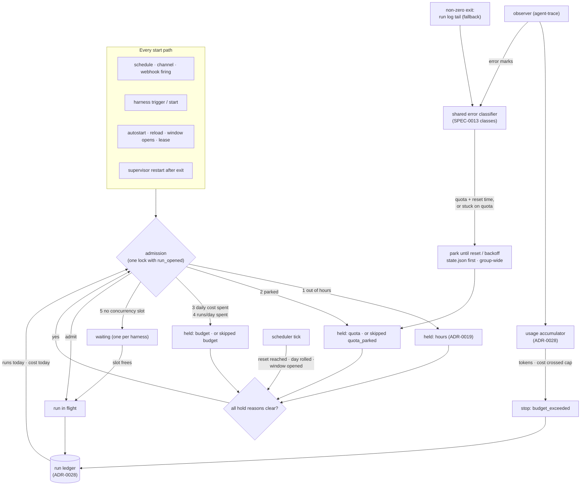

# ADR-0027: Run budgets and usage-limit backoff — admission ceilings, in-run caps, and a parked state for exhausted quota

## Context and Problem Statement

An autonomous loop spends money whether or not anyone is watching. Harness has
four levers on that spend today, and none of them is a budget:

| Lever | What it bounds | What it cannot do |
| --- | --- | --- |
| `timeout` (SPEC-0008) | Wall time of one one-shot run | Count runs, tokens or dollars |
| `max_turns` (ADR-0011) | Turns of one Claude Code `-p` run | Anything else. Crush has no such flag, so the key is inert there (`internal/adapter/adapter.go`) |
| `on_overlap` (SPEC-0008, SPEC-0014) | One process per harness | Limit how many *harnesses* run at once. One webhook that fans out to ten harnesses starts ten runs |
| `operating_hours` (ADR-0019, enforced since #389) | *When* a resident harness may run | *How much* it may spend inside the window |

Two failures show what is missing.

**Customers run out of credits mid-rollout.** A self-hosting customer running
autonomous loops on Claude Code exhausted its Claude usage allowance partway
through a rollout. Its own operating plan asks for per-run token, time, retry
and dollar ceilings, a daily cap, and admission budgets that are "counted
durably, enforced before dispatch" so that "concurrency and retries must not
multiply it". Harness offers the time ceiling and nothing else.

**Quota exhaustion is treated as a crash.** On 2026-09-14 a provider quota
emptied and four supervised agents failed every model call for about twenty
hours while `harness list` said `running` (ADR-0020). On 2026-09-19 it happened
again: an upstream ran out of credits, every agent failed with `Payment
Required: You're out of credits`, and each harness spent its restart budget
(14, 16 and 55 restarts) and latched the terminal `stopped` or `failed` state,
which nothing clears when the quota comes back. The fleet stayed down for about
19 hours, until a human noticed (the 2026-09-19 quota-exhaustion postmortem).
The give-up itself is right: it was chosen after an earlier incident in which a
harness restarted 6,212 times and exhausted the same provider's weekly quota.
The supervisor did exactly what SPEC-0003 says: a process that keeps exiting is
crash-looping. But a provider
refusing a spent account is not a crash. Restarting does not fix it, it has a
reset time outside our control, and it usually hits every harness that shares
the account at the same moment. For a triggered one-shot (ADR-0021) it is worse:
each firing claims its todo, fails, and spends one of the todo's Switchboard
attempts, so an overnight outage turns a queue into dead letters.

SPEC-0013 already classifies these errors (`quota`, `auth`, `timeout`,
`transport`, `other`) where they are observed, for metrics (#407). Nothing acts
on the class.

ADR-0019 considered a token or cost budget (its option 1D) and **deferred** it,
because "the daemon cannot see tokens without trusting adapter-parsed
trajectories as a billing meter". Two things have changed since:

* The daemon now watches every supervised harness's agent-trace stream
  continuously (the observer, #390, merged as #416), and SPEC-0013 already
  trusts it enough to alert on.
* agent-trace can report token usage, recorded cost, and the model and provider
  that served each message. It does not yet, and stump.wtf/agent-trace#105 asks
  for exactly that.

How does Harness bound what an autonomous loop spends, per run and per day,
and treat an exhausted quota as a pause rather than a crash, without learning
what a provider is?

## Decision Drivers

* **Not starting is the saving.** ADR-0019's first driver still holds: the
  daemon controls whether a process exists, and a process that doesn't exist
  spends nothing. The cheapest ceilings are the ones enforced *before* a spawn.
* **Count before you meter.** A run count and a concurrency cap need no usage
  data and cannot be fooled by a transcript format change. Token and cost caps
  depend on the meter and are only as good as it is.
* **The meter is a guardrail, not a bill.** Harness reports what agents record.
  It never claims to be an invoice, and it says loudly when a cap cannot be
  measured instead of silently ignoring it.
* **Durable, and not multiplied.** Counters survive a daemon restart. A crash
  loop, a retry or a duplicate delivery cannot mint extra budget.
* **Quota is not a crash.** An exhausted quota never spends the restart budget,
  never lands a harness in `failed` or a give-up `stopped`, and releases the
  harness by itself when the allowance resets. The give-up stays exactly as it
  is for real crashes, so neither the 6,212-restart burn nor the 19-hour outage
  can recur.
* **`enabled` stays intent.** As in ADR-0019, a budget or a quota never
  overwrites what the operator asked for. It holds a harness beside its intent.
* **The operator can always override**, with one command that ends by itself.
* **Visible everywhere.** `harness list`, `describe`, `doctor`, metrics and the
  run ledger all say *why* a harness is not running and *when* it will.
* **Stay agnostic.** The daemon never calls a provider's usage API and never
  holds a provider credential for its own use. It learns from what the agent
  records and what the agent prints.

## Considered Options

**Axis 1 — where budgets are enforced:**

* **1A. In the daemon: admission before every spawn, and a stop during a run.**
* **1B. In the agent CLI**: `max_turns` and whatever budget flags each agent has.
* **1C. In a model gateway** (LiteLLM budgets, virtual keys, OpenRouter limits).
* **1D. In Switchboard**: per-queue admission (Switchboard ADR-0035 /
  SPEC-0030, Operation Stumply F-S5).

**Axis 2 — where the usage meter comes from:**

* **2A. agent-trace, through the daemon's observer**, with prices supplied by
  the operator where the agent records none.
* **2B. Scrape Claude Code's `stream-json` result line** off the run's PTY.
* **2C. Ask the provider** (usage and billing APIs).

**Axis 3 — what an exhausted quota does:**

* **3A. Park the harness until the reset time**, or a backoff when none is
  given.
* **3B. Treat it as a crash** (status quo): backoff, then `failed`.
* **3C. Keep running** and let the agent retry.

**Axis 4 — the scope of a park:**

* **4A. Per harness.**
* **4B. Per account**, via an optional `quota_group` shared by harnesses on one
  allowance.

## Decision Outcome

Chosen: **1A + 2A + 3A**, with **4A by default and 4B one key away**. 1B and 1C
stay useful complements, and 1D is Switchboard's half of the same problem.

In one sentence: every start passes one **admission** check that consults
operating hours, quota parks, daily caps, run counts and concurrency in that
order; a run in flight is stopped when it crosses a per-run cap; and a sustained
`quota` error **parks** the harness, held down beside its intent until the
reset, instead of feeding the restart policy.

### The schema

```toml
# ~/.config/harness/harness.toml

[budget]                                   # daemon-wide; every key optional
day_starts = "TZ=America/Los_Angeles 00:00" # budget day boundary (default: 00:00, daemon zone)
max_concurrent = 4                         # triggered one-shot runs in flight at once
daily_cost_usd = 50.00                     # all harnesses together, per budget day

# Optional prices, for agents that record tokens but no cost (Claude Code, codex).
[budget.prices."claude-sonnet-4-6"]
input_per_mtok = 3.00
output_per_mtok = 15.00
cache_write_per_mtok = 3.75
cache_read_per_mtok = 0.30

[harness.pr-review]
harness = "claude-code"
prompt_file = "~/agents/pr-review.md"
triggers = ["webhook.gitea-pr"]
max_runs_per_day = 40                      # admissions per budget day
max_tokens = 400000                        # per run: input + output + cache writes
max_cost_usd = 2.00                        # per run
daily_cost_usd = 20.00                     # this harness, per budget day
quota_group = "claude-max"                 # harnesses on one allowance park together

[harness.crush-switchboard]
cmd = "crush"
enabled = true
operating_hours = "TZ=Europe/London Mon-Fri 10:00-16:00"
max_runs_per_day = 30                      # process starts, restarts included
daily_cost_usd = 15.00
quota_backoff = "15m"                      # first park when no reset time is given
quota_backoff_max = "6h"
```

| Key | On | Enforced | Meter needed |
| --- | --- | --- | --- |
| `max_runs_per_day` | any harness | at admission | no |
| `[budget] max_concurrent` | daemon (and `[budget.group.<name>]`) | at admission, triggered one-shots only | no |
| `max_tokens`, `max_cost_usd` | one-shot harnesses (a `prompt` harness) | during the run | yes |
| `daily_cost_usd` | any harness, and `[budget]` | at admission and during the run | yes |
| `quota_group`, `quota_backoff`, `quota_backoff_max` | any harness | on detection | no (uses error classes) |

`max_tokens` and `max_cost_usd` are rejected on a resident harness: a resident's
"run" is a process lifetime that can last for days, so a per-run cap there means
nothing. A resident is bounded by `daily_cost_usd` and `max_runs_per_day`.

### Why `max_concurrent` is daemon-wide, not per harness

SPEC-0014 REQ "Firing" already guarantees that a firing "SHALL never stack a
second concurrent process for the same harness". A per-harness `max_concurrent`
would always be 1. The spend that concurrency multiplies is *across* harnesses:
one delivery fanned out to every harness bound to it, or a burst of events
across several sources. So the cap is on the daemon (`[budget] max_concurrent`),
and optionally on a quota group (`[budget.group.claude-max] max_concurrent = 2`),
because harnesses on one allowance compete for one rate limit. If a later record
lets one harness run in parallel (Operation Stumply's relay attempts, ADR-0025,
is the candidate), a per-harness `max_concurrent` is reserved for it and uses
the same admission check.

A firing refused for concurrency is **held, not dropped**. It waits in the
admission queue, at most one waiting firing per harness, which is the same
promise `on_overlap = "queue"` makes: a run starts after the latest event.
Firings that arrive for a harness already waiting coalesce into one `skipped`
record with reason `concurrency` (SPEC-0014 REQ "Overlap Skip Coalescing").
Slots are granted in firing order.

### Admission: one check before every start

Every path that starts a process asks one question first: a schedule or event
firing, `harness trigger`, `harness start`, Autostart, a reload, a window
opening, a lease starting, and a supervisor restart after an exit. The checks
run in a fixed order, and the first that applies decides:

1. **Operating hours** (ADR-0019, unchanged).
2. **Quota park**: the harness, or its quota group, is parked.
3. **Daily cost**: the harness's `daily_cost_usd`, or the daemon's, is spent.
4. **Run count**: `max_runs_per_day` admissions already happened today.
5. **Concurrency**: a triggered one-shot, and every slot is taken.

A resident harness refused by 2–4 is **held**, exactly as ADR-0019 holds one out
of hours: it stays `stopped`, `enabled` is untouched, and the gate tick releases
it when the reason clears. A one-shot firing refused by 2–4 is recorded
`skipped`, with reason `quota_parked` or `budget`, coalesced like an overlap
skip, and `catch_up = true` earns it one run when the hold clears. Refusal 5
holds the firing as above.

Admission and the run's `run_opened` ledger record happen under one lock, so
two firings racing for the fortieth run cannot both win. A process start counts
once, whatever caused it: a supervisor restart is an admission, and a crash loop
therefore spends `max_runs_per_day` like anything else. A duplicate delivery is
already deduplicated before it reaches admission (SPEC-0014 REQ "Webhook
Filtering"), so a transport retry does not count twice.

### Counters live in the run ledger

The counters are not a second store. ADR-0028 gives every run a durable ledger
record carrying its trigger, times, outcome, tokens and cost. "Runs today" is
the number of admitted records since the budget day began, and "cost today" is
the sum of their cost. The daemon keeps both as running totals, rebuilt from the
ledger at boot. A daemon restart therefore neither forgets the day nor refunds
it, and there is exactly one place that says how many runs happened.

The budget day starts at `day_starts`, in its zone (the same `TZ=` prefix and
embedded IANA database as SPEC-0008 and SPEC-0012), and defaults to midnight in
the daemon's zone. The rollover is evaluated on the ADR-0013 scheduler tick,
like the operating-hours gate, so a laptop that sleeps through midnight releases
its over-budget harnesses on the first tick after it wakes.

### The meter

The meter is the per-run **usage accumulator** ADR-0028 defines. It folds
agent-trace usage items (stump.wtf/agent-trace#105), delivered by the observer,
into the open run's record: tokens by kind, the models and providers that served
it, and cost. Cost comes from the first of:

1. **Recorded**: the agent recorded a cost (crush's session cost).
2. **Priced**: the operator's `[budget.prices]` has the served model, and the
   daemon multiplies tokens by it.
3. **Unknown**: neither. The run's cost is unknown, counts as zero toward cost
   caps, and the record says so (`cost_source = "unknown"`).

Prices are the operator's, never shipped defaults, because a stale table
compiled into a binary is worse than none. `harness doctor` lists every cost cap
that cannot be measured, with the reason: no trace reader (a `generic` harness,
or a `command` harness from ADR-0023 without a `transcripts` source), or no
recorded cost and no price for the served model.

A token or cost cap is **checked as usage arrives**, not at the end. When a run
crosses `max_tokens`, `max_cost_usd`, or the remainder of a daily cap, it is
stopped the way a timeout stops it (SPEC-0008 REQ "Run Timeout": SIGTERM, the
stop grace, SIGKILL of the process group), and its record reads
`budget_exceeded`. Unlike a timeout, which is a fault and moves the harness to
`failed`, a budget stop is the budget working: the harness returns to
`stopped`, and the next firing runs normally. A resident harness that crosses a
daily cap is closed the way operating hours closes it (ADR-0019 graceful close,
using the harness's `hours_shutdown` and `hours_shutdown_timeout`, default
graceful with a 15-minute cap), then held until the day rolls over.

Usage lags. The observer polls every five seconds, and some agents report a
turn's usage only when it ends. So a cap bounds a run to *roughly* its value,
overrun by at most one turn. The docs say so plainly.

### Usage-limit detection and parking

A harness is **parked** when its quota is exhausted. The signal is SPEC-0013's
error class `quota`, from one classifier shared by metrics and budgets. It is
moved out of `internal/metrics` into its own package once #407 lands, so the two
can never disagree about what a quota error looks like. The error reaches the
classifier from:

* the observer's **error marks**, for every agent whose reader surfaces provider
  errors (crush today; claude-code once stump.wtf/agent-trace#104 lands);
* as a fallback for a **one-shot that exits non-zero** with no classified error
  observed, the last 4 KiB of its sanitized run log. This fallback exists for
  Claude Code `-p` runs until agent-trace#104 lands, and it retires then.

A `quota` error **parks** the harness when either:

* it carries a **reset time** the daemon can read (an epoch after a `|`,
  "resets 3pm (America/Los_Angeles)", "try again in 2h", `Retry-After`, an
  RFC 3339 instant). The harness parks until that time; or
* the harness is **stuck on quota**: at least 3 `quota` errors and no successful
  model call within 10 minutes (resident), or a one-shot run that ended with a
  `quota` error as its last model outcome. The harness parks for
  `quota_backoff` (default 15m), doubling on each consecutive park up to
  `quota_backoff_max` (default 6h).

A rate-limit 429 that the agent retries past is not "stuck": the next success
resets the count, and nothing parks. A parse of the reset time that lands more
than 8 days out is clamped to 8 days, so a mangled or hostile message cannot
park a harness indefinitely.

**What a park does:**

* A **resident** harness is stopped at once, without a graceful close, since
  every model call is failing anyway. The exit is not a crash: no restart, no
  crash-loop count, backoff reset, `enabled` untouched. It shows as `parked`,
  with its reset time in NEXT.
* A **one-shot**'s detecting run ends with outcome `quota_parked`. Later firings
  are recorded `skipped` with reason `quota_parked`, and with `catch_up` one run
  follows the release.
* With `quota_group`, every member parks with the same reset time, since they
  share the allowance.
* The park is written to `state.json` before anything is stopped, so a daemon
  restart neither forgets it nor hammers the provider on boot.

**Release** happens on the gate tick at the reset time: the harness goes back
through admission, so it starts only if hours, budgets and `enabled` all allow
it. A harness that is `failed` for some other reason stays failed. The first
successful model call after a release resets the backoff step.

The restart policy consults the detector before it counts an exit, so the
2026-09-19 sequence can no longer happen: a quota exit is a park, not step *n*
of a give-up.

### Overrides

* `harness start NAME` or `harness trigger NAME` on a **parked** harness clears
  the park (the operator may know the credits were topped up) and tries now. If
  the provider still refuses, the harness parks again at the next backoff step.
* On an **over-budget** harness, `start` and `trigger` refuse with the counter
  that is spent ("40/40 runs today") unless given `--over-budget`, which admits
  one run (a one-shot) or starts a bounded lease (a resident, default 1h, `--for`
  to change, exactly like ADR-0019's after-hours lease). The ledger marks the run
  `override = true`.
* `harness stop NAME` keeps its meaning in every state: stop now, clear
  `enabled`, drop any park or lease.
* The override is operator-only. It is accepted on the control socket and the
  CLI, and the local MCP surface (ADR-0010) never carries it, so an agent cannot
  lift its own budget.

### Holds generalize ADR-0019's `held`

ADR-0019 holds a harness for one reason. This ADR makes `held` a set of reasons,
`{hours, quota, budget}`, and a harness is released only when all of them have
cleared. The gate tick that evaluates operating hours evaluates park expiry and
the budget-day rollover in the same pass, on the same clock. A harness parked
until 15:00 and out of hours at 15:00 stays held for hours, and each surface
names the reason that will clear last.

SPEC-0012 is not edited here while #412 is bringing it in line with what
shipped. SPEC-0021 states the amendment to SPEC-0012 REQ "Gate Enforcement", and
a follow-up folds it into SPEC-0012 once #412 merges.

### Visibility

* **`harness list` / `describe` / the TUI**: STATE reads `parked` or
  `over-budget` (not `stopped`, and never `failed`), styled like `off-hours`
  (#385). NEXT reads `resets 15:00` or `budget resets 00:00`, and `waiting 4/4`
  for a firing queued on concurrency. No new column (#343). `describe` shows the
  day's counters against their caps.
* **`harness doctor`**: the resolved caps and budget day, unmeasurable caps,
  parked harnesses with their reset and the rule that parked them, unused
  prices, and models seen without a price.
* **Metrics** (SPEC-0013 extended): per-harness runs today, cost today and their
  limits, a parked gauge and its reset timestamp, admission decisions by reason,
  and runs in flight against the concurrency cap.
* **The durable log and lifecycle events**: every park, release, budget hold and
  override, with the reason and the next transition.
* **The run ledger** (ADR-0028): outcomes `budget_exceeded` and `quota_parked`,
  skip reasons `budget`, `quota_parked` and `concurrency`, and each record's
  `cost_source`.

### Security and tenancy

* **Harness is single-operator.** A daemon belongs to one user on one host, and
  its budgets are that operator's. There are no tenants to separate. What does
  cross a trust boundary is text: provider error messages and agent output.
* **Error text is untrusted.** A prompt-injected agent could print "usage limit
  reached|9999999999" to park itself or its group. The mitigations: the error
  mark path reads provider-originated error records, not the transcript's
  prose; the run-log fallback reads only a non-zero exit's last 4 KiB; a reset
  is clamped to 8 days; a park is loud in every surface; and `harness start`
  clears it. The worst case is a visible, self-healing pause, which is the safe
  direction for a budget to fail.
* **Agents cannot lift a budget.** The override is not on the MCP surface.
  Counters change only by a run being recorded or the day rolling over, and a
  config edit is the operator's.
* **No secrets anywhere new** (ADR-0008). A park stores the class, the matched
  rule's name and the reset time, never the error text. Prices and caps are not
  secrets. The daemon never holds a provider credential to query usage (2C
  rejected).

### How it composes with Switchboard and Cairn

* **Switchboard.** A parked or over-budget harness is refused *before* it
  spawns, so it never claims a todo. When Harness holds the lease itself
  (ADR-0025, supervisor-held leases), the claim comes after admission by
  construction. A quota outage then no longer spends each todo's
  `max_attempts` overnight, and todos wait in the queue, which is the system of
  record. Switchboard's per-queue admission (ADR-0035 / SPEC-0030) budgets
  *claims* across every worker on a queue; this ADR budgets *processes* on one
  host. They compose and neither calls the other, keeping ADR-0021's "Harness
  will not call Switchboard".
* **Cairn.** No direct coupling. A run's cost and outcome travel in its ledger
  record (ADR-0028), and a trace exported to Cairn (once Cairn's OTLP ingest,
  Cairn ADR-0015, exists) carries the same run's tokens as span attributes.
* **Notifications** stay out of Harness. An operator who wants a phone buzz on a
  park alerts on `harness_quota_parked` through their existing stack, or through
  Switchboard's notification sinks (Switchboard ADR-0034).

### Consequences

* Good, because the cheapest and most reliable ceilings (runs per day,
  concurrency) need no meter and work for every agent, including `generic`.
* Good, because a spent allowance becomes a timed pause with a visible reset.
  No restart budget is burned, nothing lands in `failed`, and nothing needs a
  human when the allowance comes back.
* Good, because budgets cannot drift from history: the counters *are* the
  ledger, so a restart, a crash loop or a duplicate delivery cannot mint budget.
* Good, because a triggered one-shot stops consuming Switchboard attempts while
  its provider refuses it.
* Good, because the hold generalization gives hours, quota and budget one
  release path and one display rule.
* Bad, because token and cost caps depend on agent-trace#105, and cost for
  Claude Code and codex needs operator-maintained prices. Until #105 lands only
  the meter-free caps and parking work.
* Bad, because caps overrun by up to one turn, since usage arrives after the
  tokens are spent.
* Bad, because the run-log fallback is text matching on output, the approach
  ADR-0020 rejected for metrics. It is scoped to one adapter's non-zero exits,
  clamped, and retires with agent-trace#104.
* Bad, because a budget spent by 09:30 holds the agent for the rest of the day,
  ADR-0019's objection to 1D. It is the point of a daily cap. `--over-budget`
  is the escape hatch, and hours plus budgets together are the intended use.
* Neutral, because admission gains four checks on a path that runs a handful of
  times a minute at most.

### Confirmation

SPEC-0021 (`run-budgets`) states the keys, admission, caps, parking, overrides
and visibility as testable requirements. Acceptance, against the scheduler's
fake clock and the real supervisor path:

* A harness with `max_runs_per_day = 2` runs twice; the third firing is
  `skipped` with reason `budget`, and the day rollover admits the next.
* A daemon restart after two runs still refuses the third.
* Fifty concurrent firings across ten harnesses under `max_concurrent = 4` never
  have more than four runs in flight, and every harness runs after its latest
  event.
* A run crossing `max_tokens` is stopped and reads `budget_exceeded`, and the
  harness is `stopped`, not `failed`.
* A resident crush that sees three quota errors in ten minutes is parked, not
  restarted. After seven more exits it is still not `failed`, and it starts by
  itself at the reset time.
* A quota error carrying an epoch reset parks exactly until that epoch, clamped
  at 8 days.
* A quota group parks together and releases together.
* `--over-budget` admits exactly one run, and the MCP surface cannot pass it.

### Deferred

* **Weekly and monthly caps.** The budget day is the only window. A weekly
  window is one more boundary on the same machinery.
* **A per-profile budget.**
* **Predictive admission**: refusing a run whose expected cost exceeds what is
  left. It needs a cost history per harness, which the ledger will have.
* **Reading Claude Code's own usage-window status** ahead of a refusal. It would
  need a stable, documented source; today the refusal is the only signal.

## Pros and Cons of the Options

### 1A — Daemon admission plus in-run stop (chosen)

* Good, because the daemon is the one component that sees every spawn, every
  exit and (through the observer) every model call on the host.
* Good, because admission before a spawn is free and exact.
* Bad, because in-run caps depend on a meter the daemon does not own.

### 1B — The agent CLI's own limits

* Good, because the agent knows its own turns and tokens exactly.
* Bad, because only Claude Code has `--max-turns`, and no agent Harness supports
  offers a cost or daily cap. Kept as a complement: `max_turns` still applies.

### 1C — A gateway budget

* Good, because a LiteLLM budget or an OpenRouter key limit is exact and shared
  across hosts.
* Bad, because it does not apply to a Claude subscription used through
  `CLAUDE_CODE_OAUTH_TOKEN`, which is how Claude Code customers run.
* Bad, because a gateway refusing the harness is exactly the failure this ADR
  exists for: without parking, the harness crash-loops on the gateway's 429.
  With parking, a gateway budget becomes a clean park (litellm's
  `BudgetExceededError` is already classified `quota`). Recommended alongside.

### 1D — Switchboard admission

* Good, because it counts claims across every worker on a queue.
* Bad, because it cannot see cron firings, webhooks from other senders, or
  resident agents, and it cannot stop a run. It is the complement, not the
  substitute.

### 2A — agent-trace through the observer, prices from the operator (chosen)

* Good, because it is one source for every agent the observer reads, and the
  same stream that feeds SPEC-0013 and telemetry export.
* Good, because it never invents a price.
* Bad, because it needs agent-trace#105, and priced cost is only as current as
  the operator's table.

### 2B — Scrape Claude Code's `stream-json` result

* Good, because it has `total_cost_usd` today, with no upstream change.
* Bad, because it covers one adapter's `-p` runs only, reports cost only at the
  end (too late for a cap), and parses a JSON stream through a PTY and the
  sanitizer.

### 2C — Ask the provider

* Good, because the provider's number is the real one.
* Bad, because it needs a provider credential in the daemon and one integration
  per provider, and it breaks ADR-0021's "the daemon stays agnostic".

### 3A — Park until the reset (chosen)

* Good, because it matches what a quota is: a timed refusal.
* Good, because it releases by itself and never needs a human.
* Bad, because it needs a detector with thresholds, and a reset-time parser for
  wording that varies by provider and version.

### 3B — Treat it as a crash (status quo)

* Bad, because it produced the 2026-09-19 outage: restarts spent, `failed`
  latched, and nothing restarted the fleet when the quota came back.

### 3C — Keep running

* Bad, because a resident keeps failing silently (the 2026-09-14 shape), and
  every one-shot firing spends a Switchboard attempt.

### 4A — Per-harness parks (default)

* Good, because it needs no configuration and each harness learns from its own
  errors.
* Bad, because N harnesses on one account each spend a failing run to learn the
  same thing.

### 4B — Account groups (opt-in)

* Good, because one refusal parks everyone on the allowance.
* Bad, because the operator has to name the grouping. The daemon cannot infer
  it without reading credentials, which it will not do.

## Architecture Diagram



## More Information

* **Extends [ADR-0019](adr-0019-operating-hours.md)**: `held` becomes a set of
  reasons, the gate tick evaluates park expiry and the budget day, and the
  after-hours lease becomes the over-budget override for residents. It decides
  ADR-0019's deferred option 1D.
* **Extends [ADR-0013](adr-0013-scheduled-one-shot-jobs.md)**: admission sits
  in front of every firing, and a run gains a budget stop beside its timeout.
* **Extends [ADR-0005](adr-0005-supervision-and-lifecycle.md)**: a quota exit is
  a third kind of down, neither a crash nor an operator stop, and the restart
  policy consults the detector before counting it.
* **Related [ADR-0020](adr-0020-prometheus-metrics-endpoint.md)**: the error
  classes it defines drive parking, and SPEC-0013 gains budget and park series.
* **Related [ADR-0021](adr-0021-on-demand-one-shots.md)**: skip reasons
  `quota_parked`, `budget` and `concurrency` join SPEC-0014's `overlap`,
  `stopping` and `outside_hours`.
* **Related, in flight**: ADR-0028 (run history ledger, the counters' store and
  the usage accumulator), ADR-0022 (telemetry export, #408), ADR-0023 (command
  kind, whose `transcripts` key decides whether a cap is measurable), ADR-0025
  (supervisor-held leases), ADR-0026 (model pinning, the other consumer of the
  served-model data).
* **Depends on** stump.wtf/agent-trace#105 (usage, cost, model and provider
  items) for token and cost caps, and on stump.wtf/agent-trace#104 (claude-code
  API errors as marks) to retire the run-log fallback.
* **Evidence**: a self-hosting customer's autonomous loops exhausting a Claude
  usage allowance mid-rollout; the 2026-09-14 and 2026-09-19 quota outages.
* **SPEC-0021** (`run-budgets`) holds the requirements.
