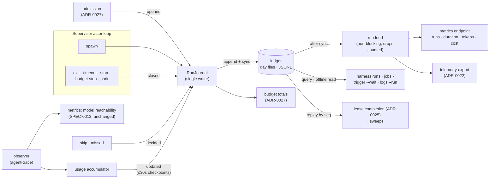

# ADR-0028: Run history ledger — one durable record per run for every harness, one event stream that metrics and budgets read, and `harness runs` across harnesses

## Context and Problem Statement

"What ran last night, and how did it go?" has a good answer for some harnesses
and none for others.

**One-shots have a history, but a short one.** SPEC-0008 REQ "Run History" gives
every scheduled harness, and SPEC-0014 every triggered harness, a record per run:
`{run_id, trigger, outcome, started_at, ended_at, exit_code}`, a per-run log, and
`harness runs NAME [--limit N]`. The records live in `state.json`, bounded by
`keep_runs` (default 20), and the whole file is rewritten on every save. A
webhook-fired reviewer that runs forty times a day keeps half a day of history.
There is no way to ask across harnesses (`harness runs` requires a NAME) or by
time (no `--since`).

**Resident harnesses have no history at all.** A resident's process lifetimes
(start, exit, restart) leave only the latest `last_exit`, a restart count, and
lines in the durable log. The supervisor writes one `exited code=N` line per exit
(`internal/supervisor/supervisor.go`, `logEvent("exited", "code", code)`), so
the only way to recover how a resident's runs went is to grep its log for
`exited code=`. The log rotates, the lines carry no outcome class, and a crash
loop at 03:00 is a wall of near-identical lines.

**Nothing records what a run spent or what served it.** No record carries the
model that actually served the run, its tokens or cost, the Switchboard todo it
worked, or where its trace went.

**Run outcomes are counted three times, three ways.** Today:

| Where | Written by | Reliability |
| --- | --- | --- |
| `state.json` run history | the Manager's `RunJournal`, called from the actor loop at every run exit path | durable, bounded to 20 |
| the lifecycle bus (`EventRunFinished`) | the supervisor | lossy by design: a slow subscriber drops events. #407's `harness_scheduled_runs_total` counts from here, and counts its own drops |
| the durable log | `logEvent` | text |

The observer (#390, merged as #416) adds a fourth stream, of agent *activity*
(tool calls, error marks). It is the source of SPEC-0013's model-reachability
series and of #408's telemetry export, and it knows nothing about runs.

The customer evidence is specific. A self-hosting customer's operating plan
calls for a daily sweep that reconciles their tracker, pull requests and
Harness, including "abandoned runs". They need a machine-readable list of every
run with its outcome and the todo it served; today they would scrape logs.
Budgets (ADR-0027) need a durable count of runs and dollars per day that a
restart cannot reset. And Prometheus (ADR-0020) needs run counts that agree with
what `harness runs` shows.

How should Harness keep one durable, queryable record of every run, for every
harness, that metrics, budgets and the CLI all read, without making the actor
loop wait on a database and without storing anything ADR-0008 forbids?

## Decision Drivers

* **One record per run, for every harness.** A resident's process lifetime is a
  run as much as a cron firing is.
* **One source of truth.** A run is recorded once, and every count (metrics,
  budgets, `jobs`, `runs`) is derived from that record. No consumer counts from
  a lossy bus.
* **Durable before visible.** A record is on disk before the run it records
  starts, and before anyone is told about it (SPEC-0008 already requires this of
  one-shots).
* **Cheap on the hot path.** Appending a record costs one write and one sync. No
  schema migrations on a supervisor's start path, and no whole-file rewrites.
* **Bounded disk, by time.** History is kept for a period, not a count, so a
  busy harness and a quiet one keep the same window.
* **Readable when the daemon is down.** The ledger is most wanted after the
  daemon crashed.
* **No secrets, no content** (ADR-0008): outcomes, times, codes, counts, names,
  identifiers. Never environment, prompt, output or payload.
* **Replace, don't shadow.** `harness runs NAME`, `keep_runs`, per-run logs and
  the run id rules keep working. The bounded `state.json` run history is
  removed outright rather than kept as a projection. Harness is pre-1.0, so
  there is no dual-write, no retirement window and no rollback path for it;
  the release notes carry an upgrade note instead.

## Considered Options

**Axis 1 — where records live:**

* **1A. An append-only JSONL ledger**, one file per UTC day, under the state
  directory.
* **1B. SQLite** (`modernc.org/sqlite` is already a dependency).
* **1C. Grow `state.json`**: raise `keep_runs`, add resident records.
* **1D. An external system as the record**: OTLP logs (#408) or Prometheus.

**Axis 2 — how consumers stay consistent:**

* **2A. Each consumer counts for itself** from the lifecycle bus (status quo).
* **2B. Ledger first**: the ledger append *is* the event. Consumers read a
  post-commit feed, and a consumer that must not miss a record replays the
  ledger by sequence number.
* **2C. Metrics as the record**: derive history from Prometheus.

**Axis 3 — what a resident "run" is:**

* **3A. A process lifetime**: spawn to exit.
* **3B. An agent session** as agent-trace sees it.
* **3C. Residents get no records.**

## Decision Outcome

Chosen: **1A + 2B + 3A**.

In one sentence: the Manager's `RunJournal`, which already opens and closes a
record at every way a one-shot run ends, becomes the single writer of an
append-only **run ledger** covering every harness; each append is synced before
the run starts or the result is published; metrics, budgets, `jobs` and
`harness runs` all read that one stream; and the observer's activity is folded
into the open run's record rather than counted beside it.

### Records

A run record is the fold of the ledger lines that share `(harness, run_id)`:

| Field | Present | Meaning |
| --- | --- | --- |
| `harness`, `run_id` | always | `run_id` is the SPEC-0008 per-harness id, now allocated for residents too |
| `kind` | always | `oneshot` or `resident` |
| `trigger` | always | `schedule`, `catch_up`, `manual`, `channel`, `webhook` (SPEC-0008, SPEC-0014), and for residents `autostart`, `restart`, `release`, `lease` |
| `source`, `event_id` | an event caused it | SPEC-0014 REQ "Run Record Fields" |
| `todo_id`, `attempt` | a Switchboard todo is known | from a channel doorbell's `meta.todo_id` (SPEC-0014), or from the supervisor-held lease of ADR-0025 |
| `started_at`, `ended_at` | as SPEC-0008 | `ended_at` absent while running and for a run a crashed daemon left |
| `exit_code` | a process was reaped | -1 if signalled |
| `outcome`, `reason` | once closed | see below |
| `model`, `models` | usage was observed | the dominant served model, and every `(model, provider)` with its output tokens |
| `tokens`, `cost_usd`, `cost_source` | usage was observed | input, output, cache read, cache write; cost as ADR-0027 resolves it |
| `model_calls`, `errors` | activity was observed | successful calls, and error counts by SPEC-0013 class |
| `usage_complete` | usage was observed | false if the observer dropped items for this harness during the run |
| `sessions` | a session was attributed | session ids with their adapter and trace id |
| `trace_url` | known | from an operator template or an exporter that returns one |
| `log` | a log exists | the per-run log (one-shots) or the durable log (residents) |
| `override` | set | admitted with `--over-budget` (ADR-0027) |

### Outcome classes

The existing SPEC-0008 values keep their names and meanings, so no consumer of
`harness runs --json` breaks: `success`, `failed`, `timed_out`,
`skipped`, `replaced`, `missed`, `cancelled`, `interrupted`, with `running` while
in flight. (What an operator calls "timeout" is the existing `timed_out`.)
Four are added:

| Outcome | Set by | Means |
| --- | --- | --- |
| `budget_exceeded` | ADR-0027 | stopped for crossing a per-run or daily cap |
| `quota_parked` | ADR-0027 | ended by a provider quota refusal, and the harness was parked |
| `model_mismatch` | ADR-0026 (model pinning) | the model or provider that served it did not match the pin; the record carries `mismatch` for the first mismatching call |
| `model_unattested` | ADR-0026 (model pinning) | a full-attestation pin could not find model or provider evidence for a call |

`reason` qualifies an outcome where one class covers several causes. `cancelled`
is widened from "ended by an operator stop" to "ended by a deliberate stop",
with `reason` saying whose: `operator`, `hours` (an operating-hours close), or
`reload` (the harness was removed from the config). A daemon shutdown stays
`interrupted`, as SPEC-0008 defines it. A resident
that exits on its own reads `success` for exit 0 and `failed` otherwise, as a
one-shot does. `skipped` keeps SPEC-0014's reasons and gains ADR-0027's (`quota_parked`,
`budget`, `concurrency`) and ADR-0026's (`model_hold`).

### The ledger on disk

```
$XDG_STATE_HOME/harness/ledger/         0700
  2026-09-21.jsonl                      0600, one JSON object per line
  2026-09-22.jsonl
```

Each line is one event: `opened` (the run is admitted), `updated` (a usage or
link checkpoint), `closed` (the run ended), or `decided` (a record that started
no process: `skipped`, `missed`). Every line carries `v` (schema version),
`seq` (a ledger-wide monotonic sequence), `at`, `harness` and `run_id`.
Consumers fold by `(harness, run_id)` and ignore fields they don't know.

`opened`, `closed` and `decided` are written with `O_APPEND` and synced before
the caller continues: before the process spawns, and before the result is
published. `updated` checkpoints are coalesced and synced at most every 30
seconds, so a crash loses at most 30 seconds of a run's usage, never its
outcome.

On boot, a run with an `opened` and no `closed` belongs to a daemon that died
under it. The daemon appends a `closed` line reading `interrupted`, with no end
time, exactly as SPEC-0008 already reconciles `state.json`.

### Why JSONL and not SQLite

The ledger's access pattern is append-heavy, read-rarely, and queried by time.
Day files make "since" a file range and retention a file deletion. A torn last
line after a crash is skipped with a count, not a corrupt database. `grep` and
`jq` work on it when the daemon is down, which is when it is most wanted. And an
append is one write plus one sync on the supervisor's path, with no migration
ever blocking a start. SQLite would buy indexed queries the CLI does not need at
this scale (thousands of runs a day at most), at the cost of a schema, a WAL, and
a second on-disk format beside ADR-0007's logs.

### One event stream (the "one source of truth" decision)

The ledger append is the commit point for a run fact. After it syncs, the
journal publishes the record on an in-process **run feed** (non-blocking, a
bounded buffer per subscriber, drops counted per subscriber, the pattern the
observer and the lifecycle bus already use). Every run fact reaches every
consumer through this one path:

| Consumer | Reads | Why it cannot drift |
| --- | --- | --- |
| **SPEC-0013 metrics** | the run feed, for `harness_runs_total{outcome}`, durations, tokens and cost; and `harness_scheduled_runs_total`, which moves off the lifecycle bus | counted from committed records only |
| **ADR-0027 budgets** | running totals maintained by the journal itself, synchronously, and rebuilt from the ledger at boot | the admission decision and the `opened` append share one lock |
| **`harness runs`, `jobs`, `trigger --wait`, `logs --run`** | the ledger (recent records from memory, older from files) | it is the ledger |
| **Telemetry export** (ADR-0022, #408) | the run feed, as one OTLP log record per closed run | optional and lossy by design, and says so |
| **Lossless consumers** (ADR-0025's lease completion, a sweep) | replay by `seq` from the ledger | durable and replayable |

The lifecycle bus keeps its run events, for the TUI and clients, but **no
counter reads them**.

The observer stays what it is: the stream of agent activity. The ledger does not
copy it. Instead a **usage accumulator** subscribes to the observer and folds
what it delivers (usage items from stump.wtf/agent-trace#105, error marks, tool
calls, session ids) into the harness's open run: tokens, cost, served models,
calls and errors by class. It checkpoints them into the ledger as `updated`
lines, and writes a final total at `closed`. So SPEC-0013's model-reachability
series and a run's record read the same observer items. The first counts them
live, per harness; the second attributes them to a run. ADR-0027 reads the
accumulator to enforce caps, and ADR-0026 reads its `(model, provider)` list to
check a pin.

### Residents: a run is a process lifetime

Each spawn of a resident harness opens a record, and its exit closes it, with
the trigger saying why it started: `autostart`, `restart` (the supervisor
restarting it after an exit), `release` (a hold cleared: hours opened, a park
expired, the budget day rolled), `lease`, or `manual`. A crash loop becomes a
list of short `failed` records with their exit codes, instead of log lines.
Residents get no per-run log files; their record points at the durable log
(ADR-0007), which already holds the output.

Sessions (3B) are the wrong unit because they are not a supervisor fact: a
resident crush resumes one session across many restarts (#347), so a session
record would merge unrelated process lifetimes. Session ids are recorded *on*
the run instead.

### Retention

```toml
[ledger]
retention = "90d"   # whole day files older than this are deleted
max_mb = 256        # and the oldest files beyond this total
trace_url = "https://grafana.example.com/explore?traceId={trace_id}"  # optional
```

Pruning runs at boot and after each UTC day rollover, and deletes whole day
files. A run still open when its `opened` line's file is pruned is carried
forward first: the journal writes a fresh `opened` snapshot into today's file.
`keep_runs` now bounds only per-run logs, so a ledger record can outlive its
log, and `harness runs` says `log pruned`.

### `harness runs`

```
harness runs [NAME...] [--harness NAME]... [--since DUR|TIME] [--until TIME]
             [--outcome O[,O]] [--trigger T[,T]] [--limit N] [--wide] [--json]
```

* `harness runs NAME` behaves as it does today (newest first, `--limit 20`), and
  gains the new columns.
* With no NAME, it lists every harness's runs from the last 24 hours, newest
  first, up to `--limit 50`.
* `--since 7d`, `--since 2026-09-21T00:00:00Z`, `--outcome failed,timed_out`,
  `--trigger webhook` filter.
* `--json` prints one array of records with the field names above, which the
  customer's sweep can consume directly.
* The table keeps to 80 columns: HARNESS, RUN, STARTED, TOOK, TRIGGER, OUTCOME,
  EXIT. `--wide` adds MODEL, TOKENS, COST and TODO.
* When the daemon is unreachable, the CLI reads the ledger files directly and
  says so on stderr, so a post-mortem does not need the daemon that died.

### Security and tenancy

* **Harness is single-operator.** The ledger belongs to the daemon's user, in a
  0700 directory of 0600 files. Every client that can reach the control socket,
  locally or over the ADR-0004 SSH front door, is that operator, and sees every
  run, exactly as it sees every harness in `harness list` today.
* **No content** (ADR-0008). Records carry no environment, `env_file` value,
  prompt, output, event payload, header or credential. Model names, todo ids,
  event ids and session ids are identifiers, not secrets. Strings are capped at
  256 bytes, and `source` and `harness` are config-bounded.
* **Untrusted input stays out.** A webhook payload never reaches the ledger
  (SPEC-0014 already forbids it in run records). A `todo_id` from a doorbell's
  `meta` is stored as an opaque, length-capped string and never interpreted.
* **The trace URL template is the operator's**, and the only substitution is
  `{trace_id}`, a hex id the daemon computed.

### How it composes with Switchboard and Cairn

* **Switchboard.** `todo_id` joins a Harness run to the todo it worked, which is
  exactly what a sweep for "abandoned runs" needs: a run that closed
  `interrupted` against a todo still claimed. When Harness holds the lease
  (ADR-0025), it completes or fails the todo from the ledger's `closed` record,
  by replaying the ledger, not the lossy feed. Switchboard keeps its own attempt
  history per todo (Switchboard ADR-0039 / SPEC-0034); the Harness ledger is the
  host-side record of each attempt, and the two join on `todo_id`. Harness still
  never calls Switchboard on its own initiative (ADR-0021).
* **Cairn.** A run's `trace_url` points at wherever its trace went. That will be
  Cairn once Cairn can receive OTLP traces (Cairn ADR-0015, cairn#138), and
  Harness's telemetry export (#408) sends them. A receipt (Cairn ADR-0027) can
  cite a run's ledger fields, and a daily sweep can publish
  `harness runs --json --since 24h` as a Cairn artifact. Harness does not push
  the ledger to Cairn.
* **Prometheus.** This is the relation Joe named: run counts on `/metrics` and
  rows in `harness runs` come from the same committed records, so a Grafana
  panel and a CLI answer can never disagree about how many runs failed.

### Consequences

* Good, because every harness gets a machine-readable history, and "grep for
  `exited code=`" is retired.
* Good, because metrics, budgets and the CLI read one stream, so they agree by
  construction, and the one lossy path left (telemetry) says it is lossy.
* Good, because a crash never loses an outcome: records are synced before the
  run starts and before the result is published.
* Good, because retention is by time, and a day file is the unit of pruning.
* Good, because the ledger is readable with `jq` when the daemon is down.
* Bad, because every resident start and exit now costs a synced append. At a
  handful per minute at most, that is noise, but a disk that stops accepting
  writes now affects admission for budgeted harnesses (ADR-0027).
* Bad, because `state.json` stops carrying run history in the same change, so
  a daemon downgraded past this ADR starts with none. That is the pre-1.0
  trade: one history, no projection to keep in step, and an upgrade note
  rather than a rollback path.
* Bad, because usage fields depend on agent-trace#105; until it lands, records
  carry outcomes, times, codes, sessions and error counts, but no tokens, cost
  or served model.
* Neutral, because resident records are short and numerous in a crash loop. The
  90-day window is sized for that.

### Confirmation

SPEC-0022 (`run-ledger`) states the format, fields, outcomes, write ordering,
reconciliation, feed, retention and CLI as testable requirements. Acceptance:

* A resident crash loop of five exits produces five `failed` records with exit
  codes and triggers `autostart`, `restart`, `restart`, …; `harness runs` lists
  them.
* A daemon killed with SIGKILL during a run boots to find that run
  `interrupted` with no end time, and its `seq` continues.
* `harness_runs_total{outcome="failed"}` on `/metrics` equals the count of
  `failed` records `harness runs --json --since` returns for the same window,
  including with the feed's subscriber buffer forced full (drops are counted,
  and the metrics consumer is sized not to drop in the test).
* A day file older than `retention` is deleted at boot, and a run open across
  the prune is still foldable.
* `harness runs` with the daemon stopped reads the files and warns on stderr.
* A `state.json` written before this ADR imports its run history into the ledger
  on first boot, once, and the upgraded daemon writes no run records to
  `state.json` afterwards.
* No ledger line contains an `env_file` value, a prompt or an event payload.

### Deferred

* **Per-run logs for residents.** Their output stays in the durable log.
* **Exporting the ledger** (to Cairn, S3, or a tracker) beyond the telemetry
  feed and `--json`.

## Pros and Cons of the Options

### 1A — Append-only JSONL day files (chosen)

* Good, because an append is one write and one sync, retention is a file
  deletion, and a torn line is recoverable.
* Good, because it is readable with standard tools when the daemon is down.
* Bad, because queries scan files. A day's file is small, and recent records
  are served from memory.

### 1B — SQLite

* Good, because indexed queries, transactions, and the driver is already a
  dependency.
* Bad, because it brings a schema and migrations onto the supervisor's start
  path, a second on-disk format, and a WAL to reason about on crash.
* Bad, because a corrupt database is a harder failure than a torn line.

### 1C — Grow `state.json`

* Good, because it needs no new file.
* Bad, because `state.json` is rewritten whole on every save, so its size bounds
  how much history is affordable, and every resident exit would rewrite it.

### 1D — An external system as the record

* Good, because operators already run Loki, Tempo or VictoriaMetrics.
* Bad, because telemetry export is optional and drops on a full queue by design
  (ADR-0022), and Prometheus keeps counts, not records. Neither can back
  budgets or `harness runs`.

### 2A — Each consumer counts from the bus (status quo)

* Bad, because the bus drops for slow subscribers, so every consumer's count is
  "approximately right", and no two agree.

### 2B — Ledger first, one feed, replay by sequence (chosen)

* Good, because every count is derived from a committed record.
* Good, because a consumer that must not miss a record has a way not to.
* Bad, because the journal becomes a hub that must never block the actor loop.
  Its appends are bounded and its feed is non-blocking.

### 2C — Metrics as the record

* Bad, because Prometheus has no records to list, and a restart resets counters.

### 3A — A process lifetime (chosen)

* Good, because it is exactly what the supervisor observes, and it makes a crash
  loop legible.

### 3B — An agent session

* Bad, because a resumed session spans unrelated process lifetimes (#347), and
  a harness without a trace reader has no sessions.

### 3C — No resident records

* Bad, because residents are where the 2026-09-14 and 2026-09-19 outages
  happened.

## Architecture Diagram



## More Information

* **Extends [ADR-0007](adr-0007-state-persistence-scrollback.md)**: a third
  durable artifact beside `state.json` and the logs, with its own retention.
* **Extends [ADR-0013](adr-0013-scheduled-one-shot-jobs.md)**: run records
  outlive `keep_runs`, and cover residents.
* **Extends [ADR-0020](adr-0020-prometheus-metrics-endpoint.md)**: run series
  come from committed records, and `harness_scheduled_runs_total` moves off the
  lifecycle bus.
* **Related [ADR-0021](adr-0021-on-demand-one-shots.md)**: `source`, `event_id`
  and `todo_id` for event-fired runs.
* **Related [ADR-0019](adr-0019-operating-hours.md)**: a resident closed for
  hours reads `cancelled` with reason `hours`; one started when hours open reads
  trigger `release`.
* **Related [ADR-0002](adr-0002-daemon-client-architecture.md)**: the `runs` op
  gains a query, and NAME becomes optional.
* **Related, accepted with this ADR (2026-09-22)**: [ADR-0027](adr-0027-run-budgets-and-usage-limit-backoff.md) (budgets,
  which read the ledger and set two outcomes), [ADR-0026](adr-0026-fail-closed-model-pinning.md) (model pinning,
  which sets `model_mismatch` and `model_unattested` and the skip reason
  `model_hold`), [ADR-0025](adr-0025-supervisor-held-leases-and-relay-attempts.md) (supervisor-held leases, which supply `todo_id`
  and replay the ledger), [ADR-0023](adr-0023-command-one-shots-and-templating.md) (the `template_unresolved` skip) and
  [ADR-0024](adr-0024-stack-installer-and-central-management.md) (the installer's self-test asserts a run record).
* **Related, not yet on `main`**: ADR-0022 (telemetry export) is still in review as #548, the replay of #408, so it stays cited by number. The SPEC-0013 implementation (#407),
  whose `harness_scheduled_runs_total` this re-sources, is also still open.
* **Depends on** stump.wtf/agent-trace#105 for tokens, cost and served model.
* **SPEC-0022** (`run-ledger`) holds the requirements.
