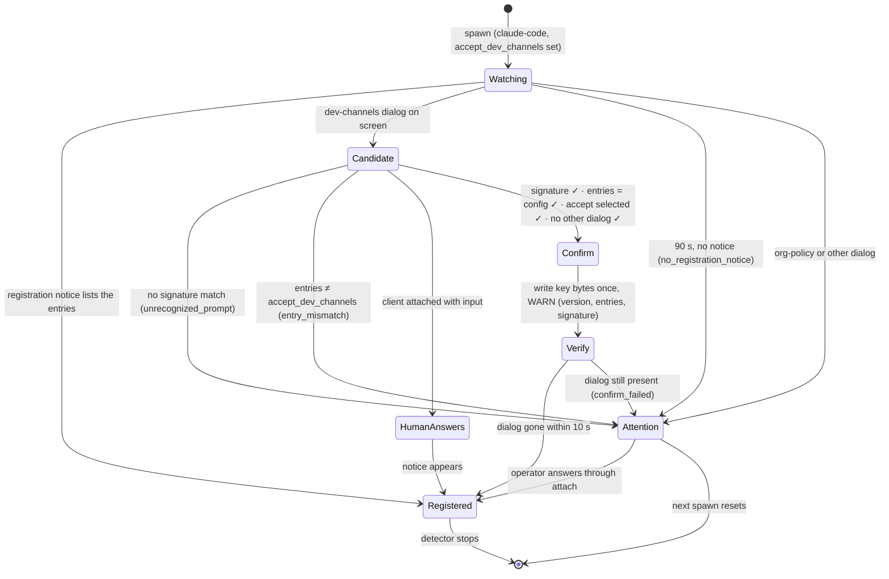

# ADR-0029: Auto-confirm Claude Code development channels, opt-in per entry

## Context and Problem Statement

Claude Code Channels let an MCP server push events into a running session. It
is how a resident Claude Code worker hears Switchboard doorbells. During the
research preview, a channel registers only if it is on an approved allowlist.
That list is Anthropic's, or, on Team and Enterprise plans, the organization's
own `allowedChannelPlugins`. A custom server such as Switchboard is on neither,
so it has to be loaded with:

```sh
claude --dangerously-load-development-channels server:switchboard
```

Per the [Channels reference](https://code.claude.com/docs/en/channels-reference),
Claude Code "first shows a full-screen warning dialog listing the development
channels you're loading". The operator must select **I am using this for local
development** to continue, or **Exit**. That happens **on every start**. The
reference also says that the flag "skips the allowlist only. The
`channelsEnabled` organization policy still applies."

Under Harness, every start is often unattended:

* **Restarts park.** A crash restart (ADR-0005), a reload restart (ADR-0014),
  an operating-hours release (ADR-0019), and a boot after a host reboot each
  bring the session up to the dialog and leave it there. The push-events guide
  says so: "a supervised session sits at that prompt until someone runs
  `harness attach` and confirms it". It concludes that "Crush remains the
  recommendation for workers that must survive restarts unattended".
* **It looks healthy while parked.** The process is `running`, the MCP
  connection is up, and doorbells are "delivered". The Channels reference notes
  that Claude Code drops events silently when a server is not loaded as a
  channel. Nothing is working.
* **ADR-0021 fixes one-shots, not resident sessions.** When the daemon holds the
  channel, a one-shot is plain `claude -p` with no development flag. A resident,
  warm-context worker, the chat-style session many operators actually want,
  still needs the flag.
* **The clean alternative is not available to everyone.** Team and Enterprise
  admins can put a plugin-packaged channel on `allowedChannelPlugins`, and
  `--channels plugin:<name>@<marketplace>` then registers it with no dialog.
  Pro and Max users without an organization have no allowlist to edit, so for a
  custom channel the development flag is their only route.

The evidence comes from customers. In the Discord thread behind Operation
Stumply, self-hosting customers running Claude Code (most use a Claude Max
subscription) hit the per-start confirmation as the first obstacle to an
unattended worker. The proposal lists it as F-H8, and Joe approved automatic
confirmation on two conditions: it logs a warning every time it fires, and the
docs call it out loudly.

How does Harness let an operator run a resident Claude Code session with a
**named** development channel unattended, without turning an Anthropic safety
confirmation into something that is bypassed silently, broadly, or by anyone
other than the operator?

## Decision Drivers

* **Explicit, exact consent.** The operator names each entry
  (`server:switchboard`) in their own global config. That config line is the
  acknowledgement the dialog asks for, given once instead of on every start.
* **Confirm only what was named.** The dialog lists the entries it is about to
  load. Harness confirms only when that list equals the configured list exactly.
* **Unknown means stop.** Claude Code's dialog will change. Text Harness does
  not recognise must produce no keystroke, a loud error, and a harness marked as
  needing a human. It must not produce a best guess.
* **Loud every time.** A WARN on every firing, carrying the Claude Code version.
  A standing `harness doctor` warning. A danger callout in the docs.
* **The allowlist confirmation, and nothing else.** No other dialog is ever
  answered: not MCP server consent, workspace trust, tool permissions, or an
  org-policy block. The org's `channelsEnabled` policy is out of reach by
  construction.
* **No supply-chain opt-in.** A cloned repository's project `harness.toml`, or
  the project-up wire, must not be able to switch this on.
* **A present human wins.** If someone is attached and able to type, they
  answer the dialog.
* **The daemon stays agnostic.** This is a Claude Code adapter detector, the
  same shape as the Crush-scoped session guard, not a general
  answer-prompts-for-you feature.

## Considered Options

* **1. Status quo.** Document `harness attach` and confirm by hand after every
  start.
* **2. Harness auto-confirms over the PTY**, per configured entry, against a
  table of known dialog signatures.
* **3. An `expect`-style wrapper**, run as a `generic` or `command` harness
  that answers the dialog itself.
* **4. Require the Team/Enterprise path**: the channel as a plugin, the admin's
  `allowedChannelPlugins`, and `--channels plugin:…`.
* **5. Use ADR-0021 instead**: daemon-held channels and one-shots, no resident
  Claude Code worker.
* **6. Suppress the dialog inside Claude Code** with a setting or environment
  variable.

## Decision Outcome

Chosen option: **2**, auto-confirmation over the PTY, opt-in per entry, with
options 4 and 5 documented as the preferred paths where they apply. Option 6
has no documented mechanism, and relying on undocumented internals would be
worse than the dialog.

### The key

```toml
[harness.claude-sb]
harness = "claude-code"
args = ["--dangerously-load-development-channels", "server:switchboard",
        "--allowedTools", "mcp__switchboard"]
accept_dev_channels = ["server:switchboard"]
workdir = "~/agents/claude-sb"
restart = "on-failure"
```

`accept_dev_channels` is valid only:

* on `harness = "claude-code"`;
* on a resident harness (a prompt one-shot cannot carry `args`, and ADR-0021
  one-shots need no development flag);
* in the global `harness.toml` and `harness_d` drop-ins, never in a project
  file or on the project-up or scratchpad wire;
* for entries of the form `server:<name>` or `plugin:<name>@<marketplace>`;
* when its set of entries **equals** the set passed in `args` after
  `--dangerously-load-development-channels`.

Every accepted entry must be in `args`. Any entry in `args` that is not
accepted is also a load error: the dialog would list it, Harness would refuse
to confirm, and the harness would park anyway, so the error says that at load
instead.

### What Harness watches, and when it confirms

From spawn until one of these happens first:

* the dialog is handled;
* Claude Code's channel-registration notice appears ("Channels (experimental)
  messages from server:… inject directly in this session");
* 90 seconds pass;
* the process exits.

During that window, the Claude Code adapter's detector reads the harness's
screen from the daemon's own `x/vt` emulator (ADR-0003, the same screen
`harness attach` repaints). It reads the rendered cells, not raw PTY bytes,
because the dialog is drawn with cursor movement and styling that raw-byte
matching would have to re-implement.

It confirms only when **all** of these hold:

1. The screen matches a **known signature** from a table built into the binary.
   Each signature holds the required phrases (the development-channels title,
   the accept option's label, the exit option's label), the rule that extracts
   the listed entries, and the key sequence that selects the accept option.
2. The **extracted entries equal** `accept_dev_channels`: no extra entry, no
   missing entry, order ignored.
3. The accept option is **selected**, or the signature's key sequence selects it
   deterministically (by its number, not by relative movement from an unknown
   cursor position).
4. **No other dialog** is on screen. That means no MCP server consent ("New MCP
   server found in this project"), no workspace-trust prompt, no tool
   permission prompt, and no org-policy message ("blocked by org policy").
5. **No attached client can type.** A present human answers for themselves.

It then writes the signature's key bytes once, through the same input path
attach keystrokes use. Within 10 seconds it checks that the dialog has gone.
There is no retry. If the dialog is still there, the harness is marked as
needing attention.

### Every firing is loud

* **A WARN log line** for each confirmation, carrying the harness, the Claude
  Code version (from `claude --version`, cached per binary), the confirmed
  entries and the signature ID. It says in plain words that a Claude Code
  development-channel confirmation was answered automatically.
* **A persisted record** of the count and the last firing (time, version,
  entries). `harness describe` shows it.
* **A `harness doctor` warn row** whenever any harness has
  `accept_dev_channels` set. The row names each harness and its last firing.
  It is a standing reminder, not a one-time notice.
* **A protocol event** (`dev_channels_confirmed`) and a counter
  (`harness_dev_channels_autoconfirm_total{harness,outcome}`), under
  SPEC-0013's registry.

### Unknown text: send nothing, and ask for a human

If the screen shows a development-channels dialog that matches no signature, or
whose entries differ from the configured set, or if the window closes with no
registration notice, Harness:

* sends **nothing**;
* logs an **ERROR** naming the harness, the Claude Code version and a reason
  code (`unrecognized_prompt`, `entry_mismatch`, `no_registration_notice`,
  `org_policy_blocked`, `other_dialog` or `confirm_failed`);
* marks the harness **`attention: dev_channels`**. The flag shows in the
  `harness list` STATE cell, in `describe`, as a `doctor` fail row, and in the
  TUI. The fix is `harness attach`.

The flag clears when the registration notice appears (someone answered through
attach) or at the next spawn. A Claude Code release that changes the dialog
therefore fails safe and visibly, and a new signature is a small, reviewed
change with a recorded screen fixture.

### Documentation

The configuration reference and the push-events guide get a **danger callout**
that says:

* **what this bypasses**: Anthropic's allowlist confirmation, for the entries
  you name, on every start;
* **what it does not bypass**: the organization's `channelsEnabled` policy,
  `allowedChannelPlugins` for `--channels`, MCP server consent, workspace
  trust, and tool permission prompts;
* **the risk**: a channel puts text in front of the model, so anyone who can
  reach the channel server can attempt prompt injection. Gate senders, keep the
  session least-privileged, and never accept an entry you did not write;
* **the better paths**: on Team or Enterprise, package the channel as a plugin,
  have an admin add it to `allowedChannelPlugins`, and run
  `--channels plugin:<name>@<marketplace>` with no development flag. For
  event-driven work, use ADR-0021's daemon-held channels and one-shots, which
  need no flag at all.

### Security

* **Consent moves; it does not disappear.** The dialog asks a human to
  acknowledge loading a non-allowlisted channel. The operator gives that
  acknowledgement once, per entry, in a file they own, and Harness logs every
  use of it.
* **Scope is the exact entry list.** A dialog that lists anything else,
  including an entry a project's `.mcp.json` smuggled in, is not confirmed.
* **Project-scoped servers still need a human.** Claude Code asks for consent
  before it uses a server defined in a project's `.mcp.json`. That dialog is
  never answered automatically, so a repository cannot introduce a server named
  `switchboard` and ride this opt-in into a session without the operator
  approving that server at least once.
* **Org policy is out of reach.** When `channelsEnabled` is off, Claude Code
  blocks the channel whatever the dialog says. Harness treats the block message
  as `org_policy_blocked`, never as something to route around.
* **No project-file or wire opt-in**, for the supply-chain reason above.
* **Tenancy.** Harness is a per-user daemon, and the opt-in is per harness in
  that user's global config. No shared state is added. The multi-tenancy rule
  binds Switchboard and Cairn, and this ADR changes nothing in either.

### How it composes with Switchboard and Cairn

* **Switchboard.** This makes a resident Claude Code worker on a Switchboard
  channel restart unattended. A confirmed dialog is still not proof of
  delivery. Switchboard's doorbell acknowledgement and `switchboard doctor`
  (Switchboard ADR-0030, being written in parallel) close that gap by checking
  that the agent actually claimed a synthetic todo. Ring-on-connect then rings
  the backlog to the freshly confirmed session.
* **Cairn.** No direct interaction. Cairn events reach such a session only
  through Switchboard.

### Consequences

* Good, because a resident Claude Code channel worker survives crash restarts,
  reloads, hours releases and reboots without a human. Crush is no longer the
  only option for unattended push-driven workers.
* Good, because the bypass is as narrow as it can be: named entries, exact
  match, one dialog, known text only, and never while a human is attached.
* Good, because a Claude Code change fails safe. The result is no keystroke, an
  error, and an attention flag, not a wrong keystroke.
* Good, because it is loud by construction: WARN per firing, a standing doctor
  warning, a counter, an event and a docs callout.
* Bad, because Harness is answering a safety dialog that Anthropic deliberately
  shows on every start. That is the point of the feature, and it is why the
  record, the logging and the docs are as loud as they are.
* Bad, because screen-matching a third-party TUI is brittle. Every Claude Code
  release can break the signature table, and the failure mode is a parked
  harness until a signature ships.
* Bad, because it adds a PTY-writing detector to the daemon. It is small,
  adapter-scoped, time-boxed to startup, and one-shot.
* Neutral, because the Team/Enterprise plugin path and ADR-0021 one-shots stay
  the better answers where available. This is for everyone else.

### Confirmation

SPEC-0023 (`dev-channel-autoconfirm`) formalizes the key, the parsing of entries
from `args`, the watch window, the signature table, the confirm conditions, the
attention state, logging, doctor and metrics. Acceptance includes:

* A recorded screen fixture of the current dialog listing `server:switchboard`,
  replayed into the emulator, produces exactly one confirmation keystroke and
  one WARN line carrying the version.
* The same fixture listing `server:switchboard` and `server:other` produces no
  keystroke, an ERROR with `entry_mismatch`, and `attention: dev_channels`.
* A fixture with altered dialog text produces no keystroke and
  `unrecognized_prompt`.
* The MCP server consent fixture and the org-policy fixture never produce a
  keystroke.
* With a client attached, the dialog fixture produces no keystroke and no
  attention flag.
* `accept_dev_channels` in a project file, on a non-claude-code harness, or
  disagreeing with `args` fails the load.

## Pros and Cons of the Options

### 1. Status quo: attach and confirm

* Good, because a human reads the dialog every time, exactly as designed.
* Bad, because every unattended restart parks the worker while it looks healthy,
  so resident Claude Code channel workers are impractical under supervision.

### 2. Auto-confirm over the PTY (chosen)

* Good, because consent is explicit, exact and logged, and unknown text fails
  safe.
* Good, because it reuses the daemon's emulator and input path. No new process
  or dependency is involved.
* Bad, because it depends on matching a third-party UI that changes without
  notice.
* Bad, because it bypasses a confirmation Anthropic chose to show every time.

### 3. An `expect`-style wrapper

* Good, because Harness itself stays out of it.
* Bad, because every operator writes their own, usually matching looser text and
  answering whatever appears, with no version logging, no doctor warning and no
  attention state. That is the unsafe version of option 2.
* Bad, because the wrapper hides Claude Code from the adapter, which costs
  trajectory, observation and model reachability.

### 4. Require the Team/Enterprise plugin path

* Good, because no confirmation is bypassed at all. The organization's admin
  made the decision.
* Bad, because Pro and Max users without an organization cannot use it, and
  that is the customer case.
* Kept as the documented first choice where available.

### 5. ADR-0021 one-shots instead

* Good, because no development flag is involved at all. The daemon holds the
  channel and the agent is plain `claude -p`.
* Bad, because it gives up the warm, resident session. Every event pays a cold
  start and a fresh context, which is wrong for chatty streams (ADR-0021 says
  so).
* Kept as the documented first choice for event-driven work.

### 6. Suppress the dialog in Claude Code

* Good, because it would be clean, if it existed.
* Bad, because no documented setting or variable does it. Relying on an
  undocumented one couples Harness to internals that can change silently, and
  it would suppress the dialog for every entry rather than the named ones.

## Architecture Diagram



## More Information

* **Extends [ADR-0005](adr-0005-supervision-and-lifecycle.md).** A supervised
  restart of a Claude Code channel worker completes without a human, and a
  harness can carry an attention flag beside its lifecycle state.
* **Extends [ADR-0011](adr-0011-agent-adapters.md).** A Claude Code adapter
  detector, adapter-scoped, as the session guard is Crush-scoped.
* **Related [ADR-0003](adr-0003-terminal-multiplexing.md)** (the daemon-owned
  emulator it reads), **[ADR-0008](adr-0008-security-and-secrets.md)**,
  **[ADR-0019](adr-0019-operating-hours.md)** (hours releases are unattended
  starts), and **[ADR-0021](adr-0021-on-demand-one-shots.md)** (the no-flag
  path for one-shots).
* **Related records accepted with this one (2026-09-22):**
  [ADR-0023](adr-0023-command-one-shots-and-templating.md) (a `command`
  harness cannot use this key) and
  [ADR-0024](adr-0024-stack-installer-and-central-management.md) (`harness
  init` writes the key only for a persona whose user opted in), both linked in
  the front matter. Switchboard ADR-0030 (doorbell acknowledgement and doctor,
  the delivery proof this feature lacks) is cross-repo and stays cited by
  number.
* **References:** the
  [Channels reference](https://code.claude.com/docs/en/channels-reference) (the
  development flag, its confirmation, "skips the allowlist only") and
  [Channels](https://code.claude.com/docs/en/channels) (enterprise controls,
  `allowedChannelPlugins`, and Pro/Max users without an organization).
* **Governing spec:** SPEC-0023 (`docs/openspec/specs/dev-channel-autoconfirm/`).
