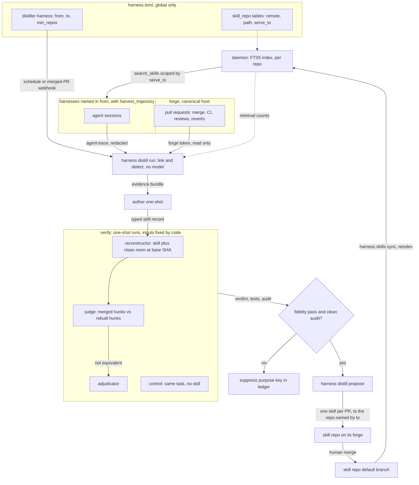

# ADR-0030: Grounded distillation — sessions find the lesson, merged pull requests prove it, pull requests propose it

> **Not yet implemented.** Design stage, amending ADR-0012 before either is
> built. Tracked by the SPEC-0007 epic, harness#69.

## Context and Problem Statement

ADR-0012 decided how the fleet's repeated struggles become shared knowledge:
count recurrences across projects, author in a supervised distiller, gate on a
human, serve the result by search. None of it is built, and three things have
changed what it should say.

**It chose the weaker substrate.** Code2Skill (Tong et al.,
[arXiv 2609.05571](https://arxiv.org/abs/2609.05571), September 2026) builds
skills from source code, checks each one by having a model rebuild the
implementation from the skill alone, and keeps provenance down to the source
span. Run through one shared agent loop, its bank beat three trajectory-derived
banks (Trace2Skill, ExpeL, SkillRL-Bank) on all seven benchmarks they share,
averaging 49.5 against 27.9–32.8. The paper's explanation for the gap describes
ADR-0012's design: a skill distilled from agent trajectories can be no better
than the agent that produced them, and it is tied to that agent's model, tools
and task mix.

**Part of that substrate does not exist.** ADR-0012 clusters "literal error
strings". agent-trace's `classify.Event` keeps `IsError` and `ResultBytes` and
drops the result text, so there is nothing literal to cluster. Its
`SessionMeta` does carry `Cwd` and, for Claude Code and Codex, `GitBranch`.
That is enough to find the pull request a session was working toward.

**The review step is unspecified.** "Posts for human review" names no channel,
no reviewer and no record of a rejection. The gate is a `status` field someone
edits by hand.

Harness has an evidence source the paper did not. Most sessions in this fleet
end in a pull request, and every pull request ends in a verdict: merged or
closed, CI green or red, reviewed with comments, sometimes reverted. That is
tested, human-reviewed code, tied to the transcript that struggled toward it.

**What should a distilled skill be grounded in, how is it checked before a human
sees it, and how does it reach that human?**

## Decision Drivers

* **ADR-0012's fences hold.** The daemon makes no model request, holds no model
  or forge credential, and writes to no repository.
* **Ground skills in something a reviewer already accepted.** Agent repetition
  on its own must never promote a skill. Letting it would be ADR-0012's
  reinforcement loop with no brake.
* **Accurate is not the same as valuable.** In the paper's human audit, records
  removed by its value filter were 88% accurate and 0% worth keeping. A skill
  that restates code the agent can already read in its workdir costs context
  and teaches nothing. What is worth keeping is what the code does not say:
  what a reviewer asked the agent to change, why CI went red, the thing it took
  forty tool calls to find.
* **Blindness must be built in.** A verifier that has seen the answer verifies
  nothing, and a prompt that asks it not to look is not a boundary.
* **Reviewer time is the scarce resource.** Proposal volume is capped,
  duplicates are impossible, and a rejection is remembered.
* **Context stays small.** In the paper, summary rendering cut the skill text an
  agent saw by 88.9% with no loss, and retrieving ten records instead of one
  grew the context 8.5× for little gain.
* **Whatever reads untrusted text holds no credentials.** Transcripts and review
  comments can be written by an attacker.
* **Scope is the operator's policy, not a constant.** Whether a lesson counts
  once it appears in one repository or only after ten depends on the fleet. A
  large fleet wants a high bar for a shared skill. A single project wants every
  lesson. A threshold baked into Harness is wrong for one of them.
* **Delivery is independent of the adapter.** A repository worked by both Crush
  and Claude Code harnesses must not need its skills written twice, once into
  each tool's native directory.

## Considered Options

Five questions.

**1. What a skill's content is grounded in**

* 1A — Trajectories alone (ADR-0012).
* 1B — Source code, mined across whole repositories (Code2Skill).
* 1C — Trajectories find the candidates; the merged pull request that ended the
  struggle grounds them.

**2. How a candidate is checked before review**

* 2A — Human review only (ADR-0012).
* 2B — A model grades the skill text.
* 2C — Source-blind reconstruction with a separate judge and adjudicator (the
  paper's gate), plus the repository's own tests, and a run without the skill
  when the change is small enough to replay.

**3. How a skill reaches review**

* 3A — A `status: proposed` file in the local store, flipped by hand
  (ADR-0012).
* 3B — A Cairn artifact or Switchboard todo for the operator.
* 3C — A pull request for every change to any skill surface. Merging is
  promotion.

**4. What runs the pipeline**

* 4A — A daemon subsystem.
* 4B — A distiller agent following a prompt, doing forge work with `gh` and
  `tea`.
* 4C — Deterministic `harness distill` commands, with each model call in its own
  one-shot run and its inputs fixed by code.

**5. Where skills live, and who decides what gets distilled**

* 5A — One learned store and one global `[distill]` table with a fixed
  cross-project threshold. Single-repository findings go into each repository's
  native skill or context files.
* 5B — Any number of declared **skill repos**, each served by search to the
  harnesses it names. Distillation is configured on ordinary harnesses (the
  **distillers**), and each distiller names the harnesses it learns from, the
  skill repo it proposes to, and its own threshold.

## Decision Outcome

Chosen: **1C, 2C, 3C, 4C, 5B.**

In one sentence: sessions show *where* agents struggled; the merged, green,
unreverted pull request that ended the struggle shows *what the fix was*; a
model that has never seen that pull request must rebuild the change from the
skill alone before any human looks; and the skill then arrives as a pull request
against whichever skill repo the operator pointed that distiller at, and the
merge promotes it.

ADR-0012 still governs wherever this ADR is silent. That covers a skill tier
that is searched and never projected, FTS5 in pure Go, replacing a skill rather
than appending to it, and retirement by retrieval count after a grace period.
ADR-0012's fixed line between project knowledge and stack knowledge becomes a
per-distiller setting.

### Skill repos and distillers

The operator states three things in configuration: which repositories hold
skills, which harnesses distill, and which harnesses each distiller learns from.

```toml
# ~/.config/harness/harness.toml. Global only: a project file declaring any of
# this is rejected, because a cloned repository must not be able to read your
# sessions or redirect proposals.

# Skill repos: where skills live, and who may search them.
[skill_repo.go-stack]
remote   = "https://git.example.com/your-org/go-skills.git"
path     = "skills"               # <slug>/SKILL.md lives under here (default "skills")
serve_to = ["*"]                  # harness selectors that may search it (default "*")

[skill_repo.reduit]
remote   = "https://git.example.com/your-org/reduit.git"   # a project repository can hold its own
path     = ".harness/skills"
serve_to = ["reduit/*"]

# Distillers: triggered one-shot harnesses with a distill table.
[harness.distill-go]
harness  = "claude-code"          # "command" once ADR-0023 lands
prompt   = "Run `harness distill run distill-go` and report its summary. Do nothing else."
schedule = "0 3 * * *"
triggers = ["webhook.gitea-pr"]   # ADR-0021: a merged pull request is new evidence
env_file = "~/.config/harness/env/distiller.env"   # forge token for harness distill
timeout  = "2h"

[harness.distill-go.distill]
from      = ["reduit/*", "spotter/*", "pr-review"]  # whose sessions and pull requests count
to        = "go-stack"                              # the skill repo it proposes to
min_repos = 2                                       # distinct repositories before a lesson counts
reviewers = ["your-reviewer"]

[harness.distill-reduit.distill]    # (harness keys as above)
from      = ["reduit/*"]
to        = "reduit"
min_repos = 1
```

* **A skill repo is a remote plus a path.** Harness keeps its own clone under
  its state directory (sparse if `path` allows) and never touches an operator's
  checkout. The daemon indexes each clone's default branch and serves it through
  `search_skills` to the harnesses that match `serve_to`, whatever their
  adapter. That settles the Crush-versus-Claude-Code question: a skill is written
  once, and every harness in scope can reach it.
* **A distiller is an ordinary triggered harness** with a `distill` table. `from`
  lists harness selectors: exact names, or globs over qualified names such as
  `reduit/*`. `to` names one skill repo. `min_repos` replaces ADR-0012's fixed
  cross-project threshold, and its default is 1. A project-level tier and a
  stack-level tier are simply two distillers with different `from`, `to` and
  `min_repos`.
* **Everything else is per distiller**: `max_open`, `max_candidates`,
  `replay_max_lines`, `revert_window`, `reviewers`, `labels`, `branch_prefix`,
  `verifier` and `verifier_env_file`. Serving settings (`summary_max_chars`,
  `retire_grace`, `retire_window`) belong to the daemon, in `[skills]`.
* **Load fails** when `to` names an undeclared skill repo; when an exact `from`
  name is undeclared or lacks `harvest_trajectory`, since it would silently
  contribute nothing; when a distiller lists itself; and when a `distill` table
  sits on a harness with neither `schedule` nor `triggers`. Globs resolve at
  each pass, and a glob that matches nothing is reported.
* **No distiller learns from distillation.** Sessions of every distiller, and of
  every model run a distiller starts, are excluded from all `from` sets.
* **Distillers converge.** The idempotency marker is keyed on (skill repo,
  purpose key), so two distillers that find the same lesson for the same repo
  push to one pull request. A distiller also skips a candidate whose purpose key
  is already active in some skill repo served to every one of the candidate's
  source harnesses. That lesson is already reachable where it would be used.
* **Syncing a skill repo** is `harness skills sync`, a client command. Every
  distiller pass runs it first, and an operator with a hand-curated skill repo
  and no distiller schedules it alone. The daemon never fetches, because a
  private remote would need a credential.

### The pipeline

| # | Stage | Runs in | Model? | Produces |
|---|---|---|---|---|
| 1 | Harvest | daemon (exists: `internal/trajectory`, `runtrace`, `observe`) | no | opted-in, attributed, redacted sessions |
| 2 | Link | `harness distill` | no | session → pull request → outcome, in the distill ledger |
| 3 | Detect | `harness distill` | no | candidates: evidence bundles grouped by evidence key, with a repository count |
| 4 | Author | one-shot run; its only input is the bundle | yes | a typed skill record |
| 5 | Verify | one-shot runs in a clean room | yes | fidelity verdict, test and control results, audit |
| 6 | Dedup | `harness distill` | no | purpose key computed; new, supersedes an existing skill, or drop |
| 7 | Propose | `harness distill` | no | a pull request, or a new commit on an open one |
| 8 | Review | a human | — | merge (promote) or close (suppress) |
| 9 | Serve | daemon | no | `search_skills` / `get_skill` over each skill repo's default branch, scoped by `serve_to` |
| 10 | Maintain | `harness distill`, then stage 5 | only to re-verify | pull requests that supersede or retire |

### Linking a session to its pull request

This is cheap for two of the adapters we run. It is not free for the third.

1. **Repository.** `git -C <cwd> remote get-url origin`, resolved to the
   canonical copy by its `canonical-*` topic, never the mirror.
2. **Branch.** Claude Code and Codex record `gitBranch` in the transcript, so
   the join is `(repo, branch)` → pull requests with that head. Crush, OpenCode
   and Pi record no branch.
3. **Commits.** For those three, and as a cross-check on the other two: commits
   reachable in `<cwd>` whose committer time falls inside the session's window,
   matched against each pull request's head SHA and commit list.
4. **Fail closed.** A session that links to no pull request contributes
   nothing, and so does one that links to several in one repository with no
   branch to choose between them. The number of unlinked sessions is reported.
   `runtrace` already follows this rule for attribution.

For each linked pull request the ledger records its state; its base and merge
SHAs; the combined CI status of the head at merge; every review, with its state
and comments; the commits pushed after the first review; and whether a commit
on the default branch reverted it within `revert_window` (default 14 days).

Reading from the forge needs a token, so linking cannot live in the daemon. The
ledger belongs to `harness distill` and sits in its own state directory. It is a
cache, rebuildable from transcripts and the forge. Once the run-history ledger
proposed in ADR-0028 lands, its `sessions` field replaces this attribution step
and the distill ledger keys on `(harness, run_id)`.

### What counts as evidence

Only a pull request that merged, was green at merge, and was not reverted can
ground a skill. Three signals find candidates, strongest first:

| Signal | Shape | Why it is evidence |
|---|---|---|
| **Review correction** | a changes-requested review or line comment, then a commit touching the commented span, then merge | the reviewer knew something the agent did not, and the fix hunk is what they asked for |
| **Red to green** | a required check failing on a head, then a commit that fixes it, then merge | the check names the invariant, and the hunk is the repair |
| **Struggle, then resolution** | in a linked session, at least k failed `exec`/`verify` calls, or repeated edit→verify cycles on the same targets, before a pass | agent-trace's actions show where the lesson is, and the merged hunk on those targets is the answer |

Always excluded: harnesses without `harvest_trajectory`; pull requests that
closed unmerged, went red or were reverted; and, as the brake on the
reinforcement loop, any session whose own trajectory shows it retrieved the
skill its evidence would support.

The literal `symptoms` come from failing check names, from review text, and,
once agent-trace grows one, from an opt-in, length-capped `ErrorExcerpt` on
errored tool results. `internal/redact` runs on the excerpt before anything is
stored.

Two keys are computed by code, and neither is chosen by a model. Detection
groups evidence by an **evidence key**: the signal kind, the class of paths
touched, and the failing check or error signature. A candidate is eligible once
its evidence key spans the distiller's `min_repos` distinct canonical
repositories. After authoring, the skill gets a **purpose key**,
`(task_family, action, target)`, from its closed-vocabulary fields, following the
paper's deterministic clustering. Deduplication, idempotency and suppression all
run on the purpose key. The ledger remembers which evidence key produced which
purpose key, so a lesson already rejected or already served is recognized before
any model runs.

### Verification: rebuild the change without seeing it

This is the paper's central check, adapted. Each model call is a separate
one-shot scratch run (ADR-0017), and `harness distill` assembles its inputs, so
the information boundary comes from what each run is handed, not from what its
prompt asks.

| Run | Sees | Never sees |
|---|---|---|
| Author | the evidence bundle: redacted session excerpts, review text, merged hunks, spans | forge credentials |
| Reconstructor | the skill, the task statement, a clean-room snapshot of the repository at the base SHA | the merged diff, later history, review text, the pull request |
| Judge | the merged hunks, the reconstructed hunks, the skill's summary | the full skill, the sessions |
| Adjudicator | the judge's reason, both sets of hunks, the full skill | the sessions |
| Control | the task statement and the same snapshot | the skill |

* **Clean room.** `git archive <base>` into a new scratch directory, which has
  no `.git`, no refs and no later history. The reconstructor works only on the
  files the skill cites, just as the paper rebuilds one code unit rather than a
  whole repository.
* **Task statement.** The body of the linked issue if there is one, otherwise
  the session's first user message, redacted. The dossier records which was
  used. If the statement already contains a line of the merged hunks verbatim,
  as a handoff prompt that names the fix often does, the dossier flags the
  rebuild as not blind, so the reviewer can discount it.
* **Audit.** The reconstructor's own transcript is read back through
  agent-trace. A read outside the clean room (`OutsideTouch`), or any fetch,
  clone or forge call, marks the run contaminated. The check is deterministic,
  but it is not a proof.
* **Decision.** If the judge rules the two versions equivalent, the candidate
  passes. If it does not, the case goes to the adjudicator rather than straight
  to rejection. In the paper, adjudicated records never rebuilt correctly, yet
  84% were judged worth keeping.
* **Tests, which the paper lacked.** When the repository has a `make test`
  target, it runs in the reconstructor's clean room. The paper offers its
  model-judged round trip as a scalable filter for when no tests exist, not as a
  replacement for them. We have the tests.
* **Control.** When the merged change is under `replay_max_lines` (default 400),
  the same task is replayed without the skill. If the control does as well, the
  skill teaches nothing the agent did not already know. It is dropped and its
  purpose key suppressed.

A candidate reaches review only with a fidelity pass and a clean audit. Test and
control results go with it as evidence. Neither is required, because many
changes cannot be replayed.

### How it submits pull requests

Every change to any skill surface is a pull request: a new skill, a revision, a
supersession, a retirement. It targets the distiller's `to` skill repo, on that
repository's canonical host, at `<path>/<slug>/SKILL.md`. Nothing reaches an
agent's context without a merge.

A skill repo is no longer a local directory with a field flipped by hand. It is
**a clone of a forge repository**. The daemon indexes the checked-out default
branch and nothing else. Proposals live on branches, so there is no `proposed`
status for a reader to forget to check. ADR-0012 wanted promotion to be a commit
with an author; now it is a reviewed merge.

Harness writes skills and nothing else. ADR-0012's other project output, an edit
to a repository's `AGENTS.md` or `CLAUDE.md`, is dropped: those files are loaded
into every session's context, and a rule worth that cost is a decision for the
repository's owner, not for a distiller.

`harness distill propose` enforces the following in code:

1. **One skill per pull request.** The branch is cut from a freshly fetched
   default branch in the distiller's own clone under its state directory, never
   in an operator's checkout.
2. **Idempotent by skill repo and purpose key.** The body carries
   `<!-- harness-distill key=<purpose-key> -->`. If an open pull request against
   that skill repo already has that key, it gets a new commit instead of a
   sibling, whichever distiller opened it. A closed, unmerged one suppresses the
   key for that repo until the evidence count has doubled, and the next proposal
   links to it.
3. **Never force-push, never merge, never arm auto-merge.** A revision is a
   commit on top. The token should be scoped so the forge refuses the rest.
4. **Capped.** At most `max_open` (default 3) open distillation pull requests
   per target repository. The rest wait in the ledger, ranked by distinct
   repositories × occurrences × signal weight.
5. **Addressed.** Review is requested from `reviewers`, and `labels` are applied
   when the pull request is created.
6. **Self-describing.** The body is the evidence dossier: the claim; an evidence
   table of signal, repository, pull request, merge SHA, span and session count;
   the fidelity, test, control and audit results; the scope; the context cost in
   characters of the summary and full renders; and whatever the skill
   supersedes.

Review feedback closes the loop. `harness distill` lists the comments on its
open pull requests. A new author run gets the skill plus those comments, as
untrusted data, and `propose` pushes the revision as a commit with a comment
saying what changed. A merge marks the key `promoted` in the ledger. A close
marks it `rejected`, and the reviewer's reason is kept as the evidence behind
the suppression.

Each skill repo gets CI of its own: `harness skills lint` checks the schema, the
required sections, the size caps, and that no two skills on the default branch
share a purpose key.

### Who runs it

`harness distill run <distiller>` orchestrates one distiller's pass
deterministically. The distiller name is passed explicitly, because Harness does
not export a harness's name into its environment. The distiller harness runs it
on a `schedule`. Once ADR-0021 lands, a `webhook.*` trigger for merged pull
requests also runs it, with `on_overlap = "queue"`. With the `command` kind
proposed in ADR-0023, the distiller is simply a command one-shot. Until that
lands, it is a prompt harness whose only instruction is to run the command.

Credentials split three ways, and the split is the point:

| Process | Holds | Reads untrusted text? |
|---|---|---|
| daemon | nothing new | no; it counts retrievals and serves an index |
| `harness distill` | a forge token, from the distiller's `env_file` | it parses that text and never follows it |
| author, reconstructor, judge, adjudicator, control | model credentials only, from `verifier_env_file` | yes, and none of them can push, comment or merge |

Only the runs that read transcripts and review comments can be steered by them,
and those runs cannot touch the forge. The process that can touch the forge
never treats text as instructions.

### Delivery, adjusted to the paper's results

* **`get_skill` renders a summary by default**: when to use it, the steps, the
  invariants, and what not to do, capped at `summary_max_chars` (default 1,000).
  `render: "full"` adds the evidence and provenance. This follows the paper's
  RQ4 (retrieval and rendering).
* **Serving depends on the SPEC-0005 facade.** The skill tools ride the ADR-0010
  MCP endpoint, which is not built yet. `serve_to` needs to know which harness
  is calling, which SPEC-0005's caller identity provides: a per-spawn token that
  the `harness mcp` bridge presents. A caller with no token, such as an
  operator's own interactive session, sees only repos served to `"*"`.
  `serve_to` is relevance scoping, not access control.
* **`search_skills` returns 3 results by default and 5 at most**, searching only
  the skill repos whose `serve_to` matches the calling harness. It accepts an
  optional `paths` list matched against each skill's `applies_to` globs, so a
  reviewer can ask what applies to the files a diff touches.
* **The tool descriptions steer use toward planning and toward reviewing a
  concrete draft**, not toward first-pass generation. In the paper, review after
  a draft exists was the most consistent placement, and it produced the largest
  gain in its coding-RL experiment: a 38% resolve rate against 24% with no
  skills.

### Maintenance

* **Staleness.** Each skill cites `(repo, path, merge SHA, span)`. When a cited
  span changes on the default branch, or its file disappears, the skill is
  re-verified against the current code (stage 5). A failure becomes a pull
  request that supersedes or retires it. This is the paper's source-aware
  refresh, and it is the only rot signal that does not wait for a skill to fall
  out of use.
* **Retirement** keeps ADR-0012's rule of retrieval count after a grace period,
  but acts through a pull request. The counts live in daemon state and cannot be
  rebuilt. Losing them restarts every grace period, which fails safe: nothing
  retires.
* **Efficacy is reported, not acted on.** The ledger can join the sessions that
  retrieved a skill to the outcomes of their pull requests, such as review
  rounds and red-to-green cycles. That is correlation, confounded by what each
  task was. It goes into maintenance pull requests as evidence for the reviewer
  and never drives an automatic decision.

### What changes in ADR-0012

| ADR-0012 | This ADR |
|---|---|
| Clusters literal error strings and classified actions | Actions find candidates, merged, green, unreverted pull requests ground them, and review corrections rank first. Literal strings need an addition to agent-trace |
| Content authored from trajectories | Content authored from merged hunks and review text; trajectories supply only location and symptoms |
| No check before a human | Blind reconstruction, judge, adjudicator and audit, plus tests and a control where the change can be replayed |
| `status: proposed` on disk, and "posts for human review" | Pull requests; merging promotes; each skill repo is a clone of a forge repository |
| One learned store; project findings edit `AGENTS.md` / `CLAUDE.md` | Any number of skill repos, each served by search to the harnesses in its `serve_to`; Harness writes skills only |
| A fixed cross-project threshold decides project vs. stack knowledge | Each distiller sets `from`, `to` and `min_repos`; the two tiers are two distillers |
| A skill supersedes another by judgment | Supersession is decided by a computed purpose key |
| Retirement by retrieval count | Also by staleness of cited spans; both go through pull requests |
| `get_skill` returns the body | A summary by default, a small k, and `paths` queries |
| A distiller harness that wakes on its own schedule | `harness distill` commands, fired by a schedule or a merged-pull-request webhook, with every model call isolated |

### Consequences

* Good, because every skill's content traces to code a reviewer merged and CI
  passed. A wrong skill needs a wrong merge, not just a confused agent.
* Good, because the verification boundary comes from what each run is handed and
  is audited from the transcripts, rather than asked for in a prompt.
* Good, because pull requests bring review, history, a record of rejections and
  rate control from machinery the fleet already runs, and a merge is an
  unambiguous promotion.
* Good, because the only processes that read attacker-reachable text hold no
  forge credential.
* Good, because the control run catches the paper's most common failure, a skill
  that is accurate and useless, before it costs a reviewer any time.
* Good, because one mechanism covers a single project and a large fleet. Scope,
  thresholds and targets are configuration, and delivery does not depend on
  which adapter a harness runs.
* Bad, because verification is expensive: up to five model runs per candidate,
  two of them full agent sessions. The budgets `max_candidates` and
  `replay_max_lines` bound the cost, and ADR-0027's proposed run budgets would
  apply to the one-shots.
* Bad, because lessons that never reached a merged pull request are invisible:
  exploratory sessions, operations work, anything learned and never committed.
  This is narrower than ADR-0012's reach, deliberately.
* Bad, because linking is weakest for Crush, the adapter we run most, which
  records no branch. Matching commits by time window fails closed, and the
  unlinked rate has to be watched.
* Bad, because `symptoms` cannot carry literal error text until agent-trace adds
  an opt-in error excerpt, and that excerpt is more transcript content held in
  memory.
* Bad, because the configuration surface grows. Every skill repo and distiller
  is a table to get right. Load-time validation catches dangling references and
  non-harvesting sources, but not a `from` glob that matches the wrong
  harnesses.
* Bad, because a project repository used as a skill repo means Harness keeps
  another clone of it. A sparse checkout of `path` keeps that small.
* Bad, because the clean room is a convention on a shared filesystem, not a
  sandbox. The audit catches the reads it can see. A reconstructor that learns
  the answer some other way still passes.
* Neutral, because the paper's code-beats-trajectories result compares benchmark
  banks built with other models and run through one loop. It motivates grounding
  skills in code here; it does not measure whether that works for this fleet.
  Our own control runs are that measurement.

### Confirmation

SPEC-0007, as revised, turns this into requirements. The acceptance tests that
matter:

* A candidate whose only evidence is a closed or reverted pull request produces
  nothing.
* A session that retrieved skill X contributes no evidence to X's purpose key.
* A reconstructor run that read a file outside its clean room is marked
  contaminated, and its candidate goes no further.
* A candidate whose control run does as well as its skill run is dropped and
  suppressed.
* Two passes over the same evidence open one pull request; the second pushes a
  commit to it.
* A closed distillation pull request suppresses its key until the evidence
  doubles.
* With `max_open` pull requests already open, a pass opens none.
* A file on a branch of a skill repo is never indexed. The same file merged to
  the default branch is.
* A harness outside a skill repo's `serve_to` never receives its skills from
  `search_skills`.
* Loading fails when a distiller's `to` names no skill repo, or when an exact
  `from` name lacks `harvest_trajectory`.
* Two distillers that find the same purpose key for the same skill repo share
  one pull request.
* `harness distill propose` never force-pushes: a test fakes a diverged remote
  and asserts a refusal, not an overwrite.
* The daemon process makes no forge or model request during a full pass.

## Pros and Cons of the Options

### 1A — Trajectories alone

* Good, because it needs no forge access and sees work that never became a pull
  request.
* Bad, because the content can be no better than the agent that produced it,
  which is the paper's central finding against trajectory-derived banks.
* Bad, because agent repetition becomes its own evidence: ADR-0012's
  reinforcement loop, with no brake.
* Bad, because the literal error text it relies on is not in agent-trace's
  output.

### 1B — Source code, mined across whole repositories

* Good, because it is the paper's measured winner, needs no agent history, and
  grounds every claim in a span.
* Bad, because it ignores what tasks actually come up. It produced a million
  records and needs retrieval to find the relevant ones. The fleet's problem is
  the reverse: a few lessons it keeps relearning.
* Bad, because in the agent's own repositories a skill that restates the code
  duplicates what the agent can read directly: accurate, and not worth keeping.
* Bad, because importing a third-party bank means putting a million
  model-written records, derived from other people's code, into agent context.
  That is a supply chain of untrusted instructions.

### 1C — Trajectories find the candidates, merged pull requests ground them

* Good, because the demand comes from where agents actually struggled, and the
  content from the reviewed, tested fix.
* Good, because review corrections capture knowledge beyond what the agent had.
* Neutral, because it needs forge reads and a ledger.
* Bad, because it sees only what reached a merge.

### 2A — Human review only

* Good, because it is simple, and the human stays the final gate either way.
* Bad, because the paper's audit judged about one accepted record in five not
  worth keeping even after verification. Without verification, the reviewer
  filters all of that alone.

### 2B — A model grades the skill

* Good, because it is one cheap call.
* Bad, because a grader that reads the skill and the evidence together can only
  judge whether the skill sounds plausible, and plausibility is what fails.

### 2C — Blind reconstruction, tests and a control

* Good, because the round trip catches omissions and invented constraints, the
  tests add the execution the paper lacked, and the control catches skills that
  teach nothing.
* Bad, because it is the most expensive option, and its boundary rests on a
  filesystem convention plus an audit.

### 3A — A local status field

* Good, because it needs no forge.
* Bad, because it has no reviewer, no notification, no record of rejections and
  no rate limit, and an unreviewed proposal is one hand edit away from promotion.

### 3B — A Cairn artifact or Switchboard todo

* Good, because it reaches the operator where they already work.
* Bad, because approval would still need a second mechanism to change the store,
  and neither keeps the history of a change next to its content.

### 3C — Pull requests everywhere

* Good, because review, diffs, history, rejection and CI come from existing
  machinery, and ADR-0012 already had to send project-scoped findings as pull
  requests.
* Bad, because every skill repo then requires a forge remote. There is no
  local-only mode.

### 4A — A daemon subsystem

* Bad, because it breaks the ADR-0012 and ADR-0008 fences for a batch job that
  gains nothing from living in the supervisor.

### 4B — A distiller agent with `gh` and `tea`

* Good, because it means the least code.
* Bad, because prompts reliably get the most important invariants wrong: one
  pull request per key, the cap, never force-pushing, never merging. The house
  rules record each of those failures.
* Bad, because the agent reading review comments would also hold the forge
  token.

### 4C — Deterministic commands, isolated model runs

* Good, because the invariants are code with tests, and credentials are split
  according to what each process reads.
* Bad, because it means the most code: a small forge client for Gitea and
  GitHub, a ledger, the clean-room builder and the audit.

### 5A — One learned store, a global table, a fixed threshold

* Good, because there is one place to look and one set of knobs.
* Bad, because one threshold is wrong for either a small fleet or a large one.
* Bad, because single-repository findings land in each adapter's native
  directory, so a repository shared by Crush and Claude Code harnesses needs its
  skills written twice, or an `AGENTS.md` pointer that costs context in every
  session.
* Bad, because every harness sees every skill, including skills for stacks it
  never touches.

### 5B — Skill repos and distillers

* Good, because scope, thresholds, targets and audience are the operator's
  choices, stated where the rest of the fleet is configured.
* Good, because search delivery makes skills independent of the adapter, and
  `serve_to` keeps each harness's search space to what is relevant to it.
* Good, because a distiller is an ordinary triggered harness, so it gets run
  records, logs, timeouts and budgets without new machinery.
* Bad, because there is more configuration, and more ways to point a distiller
  at the wrong harnesses.

## Architecture Diagram



## More Information

* **The paper, read critically.** Its verification is judged entirely by models,
  and the authors say plainly that it does not replace tests. The RL result is a
  single checkpoint with no repeated seeds. The default retrieval pool was a 10%
  sample of the bank. The trajectory-derived baselines were reimplemented by the
  authors. The mechanisms adopted here are adopted because their logic holds for
  this fleet: span-level provenance, blind reconstruction with adjudication,
  typed records with explicit anti-goals, deterministic purpose keys, summary
  rendering, and placement at review time. The control run is how we will find
  out whether they pay.
* **Extends [ADR-0012](adr-0012-cross-harness-distillation.md)**, replacing its
  signal, verification and proposal sections and keeping its scope gate,
  delivery tier, index and lifecycle rules.
* **Related [ADR-0008](adr-0008-security-and-secrets.md)**: credentials are
  split by process, and only the processes without forge credentials read
  attacker-reachable text.
* **Related [ADR-0010](adr-0010-local-mcp-surface.md)**: `search_skills` and
  `get_skill` gain a default summary render, a small k, and `paths`. Serving is
  blocked on the SPEC-0005 facade, and `serve_to` depends on that spec's caller
  identity and endpoint wiring requirements.
* **Related [ADR-0011](adr-0011-agent-adapters.md)**: adapters locate
  transcripts. Skill repos are served by search and are never projected, so no
  adapter's native skill path is involved.
* **Mechanisms borrowed from other designs.**
  [ADR-0017](adr-0017-ephemeral-scratchpad-harnesses.md) scratch runs host every
  model call, and [ADR-0021](adr-0021-on-demand-one-shots.md) webhook triggers
  fire a pass on merge. Three designs still in review also apply once they land:
  ADR-0023 (command one-shots), ADR-0027 (run budgets) and ADR-0028 (the run
  ledger).
* **Dependency on agent-trace:** an opt-in, capped `ErrorExcerpt` on errored
  tool results. The default stays off, so existing consumers see no change.
* **Overlap:** stet's skills epic plans its own distill-to-pull-request flow and
  efficacy tracking. The two should share one proposal format rather than
  diverge.
* **Deferred:** importing a public code-derived bank such as CodeSkillBank; a
  local-only skill repo for operators with no forge; distiller-proposed edits to
  `AGENTS.md` or `CLAUDE.md`; a real sandbox for the reconstructor.
