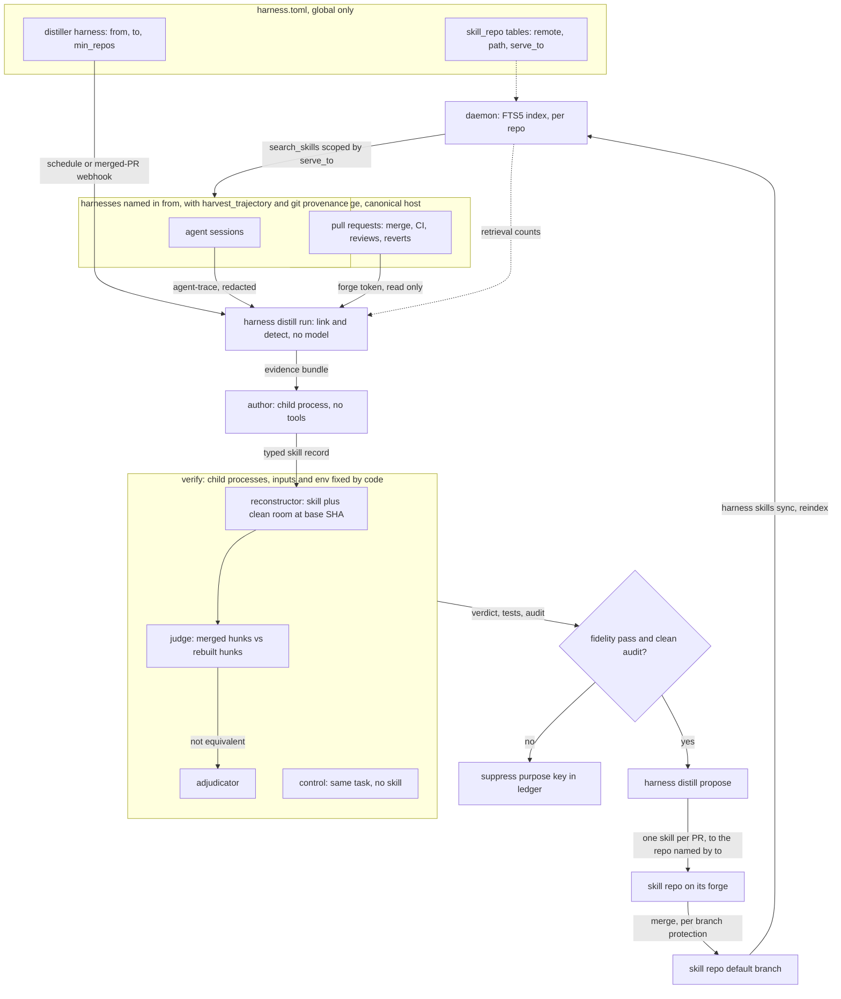

# ADR-0030: Grounded distillation — sessions find the lesson, merged pull requests prove it, pull requests propose it

> **Not yet implemented.** Design stage, amending ADR-0012 before either is
> built. Tracked by the SPEC-0007 epic in the Harness issue tracker.

## Context and Problem Statement

ADR-0012 decided how the fleet's repeated struggles become shared knowledge:
count recurrences across projects, author in a supervised distiller, gate on a
human, serve the result by search. None of it is built, and three things have
changed what it should say.

**It chose the weaker substrate.** Code2Skill (Tong et al.,
[arXiv 2609.05571](https://arxiv.org/abs/2609.05571), September 2026) builds
skills from source code, checks each one by having a model rebuild the
implementation from the skill alone, and keeps provenance down to the source
span. Run through one shared agent loop, its bank beat three trajectory-derived
banks (Trace2Skill, ExpeL, SkillRL-Bank) on all seven benchmarks they share,
averaging 49.5 against 27.9–32.8. The paper's explanation for the gap describes
ADR-0012's design: a skill distilled from agent trajectories can be no better
than the agent that produced them, and it is tied to that agent's model, tools
and task mix.

**Part of that substrate does not exist.** ADR-0012 clusters "literal error
strings". agent-trace's `classify.Event` keeps `IsError` and `ResultBytes` and
drops the result text, so there is nothing literal to cluster. Its
`SessionMeta` does carry `Cwd` and, for Claude Code and Codex, `GitBranch`.
That is enough to find the pull request a session was working toward.

**The review step is unspecified.** "Posts for human review" names no channel,
no reviewer and no record of a rejection. The gate is a `status` field someone
edits by hand.

Harness has an evidence source the paper did not. Most sessions in this fleet
end in a pull request, and every pull request ends in a verdict: merged or
closed, CI green or red, reviewed with comments, sometimes reverted. That is
tested, human-reviewed code, tied to the transcript that struggled toward it.

**What should a distilled skill be grounded in, how is it checked before a human
sees it, and how does it reach that human?**

## Decision Drivers

* **ADR-0012's fences hold.** The daemon makes no model request, holds no model
  or forge credential, and writes to no repository.
* **Ground skills in something a reviewer already accepted.** Agent repetition
  on its own must never promote a skill. Letting it would be ADR-0012's
  reinforcement loop with no brake.
* **Accurate is not the same as valuable.** In the paper's human audit, records
  removed by its value filter were 88% accurate and 0% worth keeping. A skill
  that restates code the agent can already read in its workdir costs context
  and teaches nothing. What is worth keeping is what the code does not say:
  what a reviewer asked the agent to change, why CI went red, the thing it took
  forty tool calls to find.
* **Blindness must be built in.** A verifier that has seen the answer verifies
  nothing, and a prompt that asks it not to look is not a boundary.
* **Reviewer time is the scarce resource.** Proposal volume is capped,
  duplicates are impossible, and a rejection is remembered.
* **Context stays small.** In the paper, summary rendering cut the skill text an
  agent saw by 88.9% with no loss, and retrieving ten records instead of one
  grew the context 8.5× for little gain.
* **Whatever reads untrusted text holds no credentials.** Transcripts and review
  comments can be written by an attacker.
* **Scope is the operator's policy, not a constant.** Whether a lesson counts
  once it appears in one repository or only after ten depends on the fleet. A
  large fleet wants a high bar for a shared skill. A single project wants every
  lesson. A threshold baked into Harness is wrong for one of them.
* **Delivery does not depend on any adapter's skill directory.** A repository
  worked by both Crush and Claude Code harnesses must not need its skills written
  twice, once into each tool's native directory.

## Considered Options

Five questions.

### Decision 1 — What a skill's content is grounded in

* Option 1 — Trajectories alone (ADR-0012).
* Option 2 — Source code, mined across whole repositories (Code2Skill).
* Option 3 — Trajectories find the candidates; the merged pull request that ended the
  struggle grounds them.

### Decision 2 — How a candidate is checked before review

* Option 1 — Human review only (ADR-0012).
* Option 2 — A model grades the skill text.
* Option 3 — Source-blind reconstruction with a separate judge and adjudicator (the
  paper's gate), plus the repository's own tests, and a run without the skill
  when the change is small enough to replay.

### Decision 3 — How a skill reaches review

* Option 1 — A `status: proposed` file in the local store, flipped by hand
  (ADR-0012).
* Option 2 — A Cairn artifact or Switchboard todo for the operator.
* Option 3 — A pull request for every change to any skill surface. Merging is
  promotion.

### Decision 4 — What runs the pipeline

* Option 1 — A daemon subsystem.
* Option 2 — A distiller agent following a prompt, doing forge work with `gh` and
  `tea`.
* Option 3 — Deterministic `harness distill` commands. Each model call is a separate
  child process whose inputs, environment and tools are fixed by code.

### Decision 5 — Where skills live, and who decides what gets distilled

* Option 1 — One learned store and one global `[distill]` table with a fixed
  cross-project threshold. Single-repository findings go into each repository's
  native skill or context files.
* Option 2 — Any number of declared **skill repos**, each served by search to the
  harnesses it names. Distillation is configured on ordinary harnesses (the
  **distillers**), and each distiller names the harnesses it learns from, the
  skill repo it proposes to, and its own threshold.

## Decision Outcome

Chosen options: **Decision 1, Option 3**, **Decision 2, Option 3**,
**Decision 3, Option 3**, **Decision 4, Option 3** and **Decision 5, Option 2**.

In one sentence: sessions show *where* agents struggled; the merged, green,
unreverted pull request that ended the struggle shows *what the fix was*; a
model that has never seen that pull request must rebuild the change from the
skill alone before any human looks; and the skill then arrives as a pull request
against whichever skill repo the operator pointed that distiller at, and the
merge promotes it.

ADR-0012 still governs wherever this ADR is silent. That covers a skill tier
that is searched and never projected, FTS5 in pure Go, replacing a skill rather
than appending to it, and retirement by retrieval count after a grace period.
ADR-0012's fixed line between project knowledge and stack knowledge becomes a
per-distiller setting.

### Skill repos and distillers

The operator states three things in configuration: which repositories hold
skills, which harnesses distill, and which harnesses each distiller learns from.

```toml
# ~/.config/harness/harness.toml. Global only: a project file declaring any of
# this is rejected, because a cloned repository must not be able to read your
# sessions or redirect proposals.

[skills]                            # serving settings, owned by the daemon
summary_max_chars  = 1000
retire_grace_days  = 30
retire_window_days = 60

# Skill repos: where skills live, and who may search them.
[skill_repo.go-stack]
remote   = "https://git.example.com/your-org/go-skills.git"
public   = false                  # declared visibility; unset is treated as public
path     = "skills"               # <slug>/SKILL.md lives under here (default "skills")
serve_to = ["*"]                  # "*" alone means every harness (the default)

[skill_repo.reduit]
remote   = "https://git.example.com/your-org/reduit.git"   # a project repository can hold its own
public   = false
path     = ".harness/skills"
serve_to = ["reduit/*"]

# A distiller is a command one-shot (ADR-0023) with a distill table.
[harness.distill-go]
harness  = "command"
argv     = ["harness", "distill", "run", "distill-go"]
schedule = "0 3 * * *"
timeout  = "2h"

[harness.distill-go.distill]
credential_file = "~/.config/harness/forge/go-stack.token"  # read by harness distill; never in any env
from           = ["reduit/*", "spotter/*", "pr-review"]  # whose sessions count
to             = "go-stack"                              # the skill repo it proposes to
min_repos      = 2                                       # distinct repositories before a lesson counts
evidence_repos = ["git.example.com/your-org/*"]          # host/owner/name globs
reviewers      = ["your-reviewer"]

[harness.distill-reduit.distill]    # (harness keys as above)
credential_file = "~/.config/harness/forge/reduit.token"
from      = ["reduit/*"]
to        = "reduit"
min_repos = 1
reviewers = ["your-reviewer"]
```

* **A skill repo is a remote plus a path, with two clones.** Neither is ever an
  operator's checkout. `harness skills sync` creates and fast-forwards the
  **serving clone**, under `$XDG_STATE_HOME/harness/skills/<name>`, and the daemon
  only reads it. Each distiller also has its own **proposal clone** in its state
  directory, where it cuts branches. The daemon reindexes a serving clone when
  it starts, when the clone's files change, and when `harness skills sync`
  reports over the socket that it fast-forwarded. It then serves the repo
  through `search_skills` to every harness that matches `serve_to`, whichever
  adapter that harness uses. A skill is written once, and any harness in scope
  whose adapter can reach the Harness MCP endpoint can read it (SPEC-0005).
* **Selectors.** `"*"` on its own matches every harness. Anything else is a glob
  over qualified names in which `*` does not cross `/`. So `reduit/*` is every
  harness in project reduit, and `pr-review` is exactly that global harness.
* **A distiller is a `command` one-shot** (ADR-0023) whose argv runs
  `harness distill run <name>`. Until that kind lands, there is no supported
  distiller. A prompt harness would put the forge token and the webhook payload
  inside an agent, which is Decision 4, Option 2. `to` names one skill repo, and
  `min_repos` (default 1) replaces ADR-0012's fixed threshold. A project-level
  tier and a stack-level tier are simply two distillers with different `from`,
  `to` and `min_repos`.
* **`evidence_repos` limits where evidence may come from**: canonical
  repositories matching these host/owner/name globs. It defaults to the host and
  owner of the `to` remote, so the same owner name on another forge never
  qualifies. A cloned repository can give itself a project name that matches a
  `from` glob, but its pull requests land in a repository outside
  `evidence_repos`, so they count for nothing.
* **A skill repo declares its visibility** with `public`. An unset value is
  treated as public, because detecting a public mirror would need repository
  admin rights Harness should not hold.
* **The forge token lives in `credential_file`**, a path that only
  `harness distill` reads. It never enters the distiller harness's environment,
  so a bug in the model runs' environment allowlist cannot leak it.
* **Everything else is per distiller**: `max_open`, `max_candidates`,
  `max_reverify`, `replay_max_lines`, `revert_window_days`, `labels`,
  `branch_prefix`, `verifier`, `verifier_env_file` and `test_sandbox`. Serving
  settings live in `[skills]`.
* **Load fails** in any of these cases:
  * `to` names an undeclared skill repo;
  * an exact global `from` name is undeclared or lacks `harvest_trajectory`,
    since it would silently contribute nothing;
  * a distiller lists itself;
  * `reviewers` is empty, or `credential_file` is unset;
  * the table sits on a harness that is not a triggered `command` one-shot.

  Project-qualified names and globs are resolved at each pass, because project
  harnesses register at runtime. The pass summary lists what each selector
  matched.
* **No distiller learns from distillation.** Excluded everywhere:
  * sessions of any distiller or of its model runs;
  * sessions whose linked pull request is a distillation proposal;
  * sessions whose linked pull request targets a skill repo.
* **Distillers converge.** The idempotency marker is keyed on (skill repo,
  purpose key), so two distillers that find the same lesson for the same repo
  push to one pull request. A distiller also skips a candidate whose purpose key
  is active in some *other* skill repo served to every one of the candidate's
  source harnesses. That lesson is already reachable where it would be used. A
  match in the distiller's own `to` repo is a revision, not a skip.
* **Syncing a skill repo** is `harness skills sync`, a client command. Every pass
  runs it first. A hand-curated skill repo with no distiller gets its own
  command one-shot that runs sync. The daemon never fetches, because a private
  remote would need a credential.

### The pipeline

| # | Stage | Runs in | Model? | Produces |
|---|---|---|---|---|
| 1 | Harvest | daemon (exists: `internal/trajectory`, `runtrace`, `observe`), plus git provenance per session | no | opted-in, attributed, redacted sessions with their remote, branches and HEADs |
| 2 | Link | `harness distill` | no | session → pull request → outcome, in the distill ledger |
| 3 | Detect | `harness distill` | no | candidates: evidence grouped by evidence key, with a repository count |
| 4 | Author | a child process of `harness distill`; its only input is the bundle | yes | a typed skill record |
| 5 | Dedup | `harness distill` | no | purpose key and slug computed; drop, revise an existing skill, or new |
| 6 | Verify | child processes in a clean room | yes | fidelity verdict, audit, and test and control results |
| 7 | Propose | `harness distill` | no | a pull request, or a new commit on an open one |
| 8 | Review | whoever the skill repo's branch protection requires | — | merge (promote) or close (suppress) |
| 9 | Serve | daemon | no | `search_skills` / `get_skill` over each serving clone's default branch, scoped by `serve_to` |
| 10 | Maintain | `harness distill`, then stage 6 | only to re-verify | pull requests that revise or retire |

Dedup runs before any model run where it can. A candidate is skipped without a
model run if its key is suppressed, if it is served from another repo, or if
every piece of its evidence is already cited by the active skill or the open
proposal for its key. Anything else with a matching key becomes a revision.

### Linking a session to its pull request

The transcript is the wrong record to link from. `gitBranch` holds whichever
branch the session saw first, and the working directory (often a worktree or
scratch directory) is usually gone by the nightly pass. So the facts are
captured at harvest time instead.

1. **Git provenance at harvest.** The daemon's observer already attributes every
   session it delivers. For each harvested session it records the origin remote
   URL (credentials stripped) and every distinct (branch, HEAD SHA) pair it sees
   in every working directory the transcript reports, not just the one the
   session started in. It samples whenever it delivers events and again when the
   session goes idle. A pair counts as **authored** only if its HEAD first
   appeared during the session. A HEAD that was already there when the session
   started, such as someone else's parked branch or a `main` tip that happens to
   be a pull request's head, is recorded but never links. These are local,
   read-only git calls, and they need no credentials.
2. **Repository.** The recorded remote, resolved to the canonical copy by its
   `canonical-*` topic, never the mirror. It must match `evidence_repos`.
3. **Branch and HEAD, together.** A pull request links only if its head branch
   is one of the recorded branches *and* its commit list contains one of the
   session's authored HEAD SHAs. A pair observed on the repository's default branch counts
   as no branch at all. A branch name alone never links, so a session that started
   on someone else's branch cannot claim their pull request.
4. **Commits.** Authored HEAD SHAs are also matched against every pull request's
   commit list, which keeps the original commits after a squash merge. This
   covers sessions whose branch was renamed or deleted.
5. **Fail closed.** A session that links to no pull request contributes nothing,
   and so does one that links to several in one repository. The number of
   unlinked sessions is reported. `runtrace` already follows this rule for
   attribution.

For each linked pull request the ledger records its state; its base and merge
SHAs; the combined CI status of the head at merge; every review, with its state
and comments; the commits pushed after the first review; and any revert. A
revert is a commit on the default branch whose message says
`This reverts commit <sha>` for the merge commit, the squash commit or any of
the pull request's commits, or a merged pull request that names this one in a
title beginning `Revert`.

Reading from the forge needs a token, so linking cannot live in the daemon. The
ledger belongs to `harness distill` and sits in its own state directory. It is a
cache, rebuildable from the harvest records and the forge. Once the run-history
ledger proposed in ADR-0028 lands, the provenance records can move into it, and
the distill ledger keys on `(harness, run_id)`.

### What counts as evidence

A pull request can ground a skill only if it merged, was green at merge, and has
gone `revert_window_days` (default 7) since merging without a revert. A younger
pull request cannot yet be known to be unreverted, so it waits in the ledger as
pending. Three signals find candidates, strongest first:

| Signal | Shape | Why it is evidence |
|---|---|---|
| **Review correction** | a changes-requested review or line comment, then a commit touching the commented span, then merge | the reviewer knew something the agent did not, and the fix hunk is what they asked for |
| **Red to green** | a required check failing on a head, then a commit that fixes it, then merge | the check names the invariant, and the hunk is the repair |
| **Struggle, then resolution** | in a linked session, at least k failed `exec`/`verify` calls, or repeated edit→verify cycles on the same targets, before a pass | agent-trace's actions show where the lesson is, and the merged hunk on those targets is the answer |

Always excluded:
* harnesses without `harvest_trajectory`;
* repositories outside `evidence_repos`;
* pull requests that closed unmerged, went red, were reverted, or are still
  inside the revert window;
* distillation proposals, and pull requests against skill repos;
* the brake on the reinforcement loop: any session whose trajectory shows it
  retrieved the skill its evidence would support, or that reviewed a
  distillation pull request for that skill's purpose key.

The literal `symptoms` come from failing check names, from review text, and,
once agent-trace grows one, from an opt-in, length-capped `ErrorExcerpt` on
errored tool results. `internal/redact` runs on all of them, and on every hunk
and every piece of review text, before anything is stored or shown to a model.

Two keys are computed by code, and neither is chosen by a model.

* **Evidence key**: `(signal kind, path class, failure signature)`.
  * *Path class*: each touched path is mapped through a fixed table of
    well-known files and globs (`go.mod`, `Makefile`, `Dockerfile`,
    `.gitea/workflows/*`, `*_test.go`, and so on), falling back to its file
    extension. The key uses the sorted set.
  * *Failure signature*: the failing check's context name, or the first line of
    the error excerpt, with numbers, hex, paths and quoted strings replaced by
    placeholders. It is empty for review corrections.

  A candidate is eligible once its evidence key spans `min_repos` distinct
  canonical repositories.
* **Purpose key**: `(task_family, action, target, path class)`. The first three
  are frontmatter fields, each from a closed vocabulary defined in SPEC-0007.
  `task_family` uses the paper's sixteen task families. The path class comes from
  the evidence, by code, so two different lessons that happen to share a
  vocabulary triple still land in different files. An out-of-vocabulary value is never coerced:
  the author run gets one retry with the vocabulary restated, and a second miss
  drops the candidate for this pass. The slug is derived from the purpose key,
  so it is deterministic.

Deduplication, idempotency and suppression all run on the purpose key. The
ledger remembers which evidence key produced which purpose key, so a lesson
already rejected or already served is recognized before any model runs. When a
purpose key matches an active skill in the target repo, the author run is given
that skill and writes a revision, and the proposal edits the existing file. No
model decides whether the new evidence "contradicts" the old skill; the reviewer
reads the diff.

### Verification: rebuild the change without seeing it

This is the paper's central check, adapted. Every model call is a child process
that `harness distill` starts itself, running the verifier adapter's prompt
command. It is not a daemon run, so nothing reaches it through Harness's socket,
its facade or its logs. Code controls each child's surroundings:

* **Environment**: an allowlist of `PATH`, locale, `TMPDIR`, a fresh `HOME`
  inside the run's temporary directory, and whatever `verifier_env_file` holds.
  Nothing is inherited from the daemon or from `harness distill`: no forge token,
  and no `HARNESS_*` variables.
* **Working directory**: a new `os.MkdirTemp` directory outside every Harness
  state directory, holding only that role's inputs.
* **Tools**: the author, judge and adjudicator get none. The reconstructor and
  the control can read and write files only: no shell and no network tools. The
  Harness MCP bridge is never wired into a model run. A `verifier` whose adapter
  cannot enforce these restrictions fails the load; at first only Claude Code
  can.
* **Project configuration off**: the run is launched with project settings and
  project MCP servers disabled (for Claude Code, `--setting-sources user` and
  `--strict-mcp-config`). Agent configuration files are stripped from the clean
  room (`.claude/`, `.mcp.json`, `.crush.json`, `.crush/`, `.codex/`), so a
  repository's own hooks and MCP servers cannot run commands or fetch the pull
  request.
* **Authentication**: because `HOME` is fresh, a subscription login does not
  carry over. The verifier authenticates only from `verifier_env_file`, for
  example with an API key.

Children run under the distiller's timeout. Their transcripts land in their
tool's store under a temporary working directory that no harness claims, so
they are never harvested as evidence.

| Run | Sees | Never sees |
|---|---|---|
| Author | the evidence bundle: redacted session excerpts, review text, merged hunks, spans | forge credentials |
| Reconstructor | the skill, the task statement, a clean-room snapshot of the repository at the base SHA | the merged diff, later history, review text, the pull request |
| Judge | the merged hunks, the reconstructed hunks, the skill's summary | the full skill, the sessions |
| Adjudicator | the judge's reason, both sets of hunks, the full skill | the sessions |
| Control | the task statement and the same snapshot | the skill |

* **Clean room.** `git archive <base>` from the proposal clone into the run's
  temporary directory, which has no `.git`, no refs and no later history. The
  reconstructor works only on the files the skill cites, just as the paper
  rebuilds one code unit rather than a whole repository. If a cited file is
  missing from the archive (it is inside a submodule, or it is an LFS pointer),
  the candidate is `not_replayable` and cannot pass.
* **Task statement.** The body of the linked issue if there is one, otherwise
  the session's first user message, redacted. The dossier records which was
  used. If the statement already contains a line of the merged hunks verbatim,
  as a handoff prompt that names the fix often does, the dossier flags the
  rebuild as not blind and the control is skipped, because both runs would be
  handed the answer.
* **Audit.** Every path in the reconstructor's tool calls is resolved against
  the clean room from the raw tool input. This deliberately does not rely only on
  agent-trace's `OutsideTouch`, which drops relative `..` paths. A path outside
  the clean room, any invocation of the `harness` CLI or of an `mcp__harness__*`
  tool, or any fetch, clone or forge call marks the run contaminated. The check is deterministic, but it is not a proof.
* **Decision.** If the judge rules the two versions equivalent, the candidate
  passes. If it does not, the case goes to the adjudicator rather than straight
  to rejection. In the paper, adjudicated records never rebuilt correctly, yet
  84% were judged worth keeping.
* **Tests, which the paper lacked, and only in a sandbox.** Running `make test`
  on a reconstruction runs model-written code. So it happens only when the
  distiller sets `test_sandbox`, an argv prefix that isolates the command (for
  example, a container with the clean room mounted), and always with the model
  runs' environment allowlist. It never runs bare, and never in a process
  holding the forge token. Without `test_sandbox`, the dossier says tests were
  not run.
* **Control.** When the merged change is under `replay_max_lines` (default 400),
  the same task is replayed without the skill. If the control does as well, the
  candidate is dropped for this pass. Its purpose key is suppressed only after
  the control matches on two different evidence pull requests, because one
  sample is noise.

A candidate reaches review only with a fidelity pass and a clean audit. Test and
control results go with it as evidence. Neither is required, because many
changes cannot be replayed.

### How it submits pull requests

Every change to any skill surface is a pull request: a new skill, a revision or
a retirement. It targets the distiller's `to` skill repo, on that repository's
canonical host, at `<path>/<slug>/SKILL.md`. Nothing reaches an agent's context
without a merge.

A skill repo is no longer a local directory with a field flipped by hand. It is
a forge repository. The daemon indexes the serving clone's default branch and
nothing else. Proposals live on branches, so there is no `proposed` status for a
reader to forget to check. ADR-0012 wanted promotion to be a commit with an
author; now it is a merge.

Harness writes skills and nothing else. ADR-0012's other project output, an edit
to a repository's `AGENTS.md` or `CLAUDE.md`, is dropped: those files are loaded
into every session's context, and a rule worth that cost is a decision for the
repository's owner, not for a distiller.

`harness distill propose` enforces the following in code:

1. **One skill per pull request**, on a branch cut from a freshly fetched
   default branch in the distiller's proposal clone.
2. **Idempotent by skill repo and purpose key.** The body carries
   `<!-- harness-distill key=<purpose-key> -->`. If an open pull request against
   that skill repo already has that key, it gets a new commit instead of a
   sibling, whichever distiller opened it. A closed, unmerged one suppresses the
   key for that repo until the evidence count has doubled, and the next proposal
   links to it.
3. **Never force-push, never merge, never arm auto-merge.** Before committing,
   `propose` fetches the proposal branch. If the remote has commits it lacks
   (a reviewer pushed a fix), it builds on the remote tip. If its own earlier
   commits are missing from the remote, it refuses with `ErrBranchDiverged`. It
   never overwrites.
4. **Capped.** Each distiller counts every open distillation pull request in the
   target repository, not only its own, against its own `max_open` (default 3).
   The rest wait in the ledger, ranked by distinct repositories × occurrences ×
   signal weight.
5. **Visibility-safe.** If the skill repo is public or mirrored publicly, every
   evidence repository must be public too. Otherwise the candidate waits with
   reason `visibility`, because the dossier and the skill would carry private
   code and links into public view.
6. **Addressed.** Review is requested from `reviewers`, and a reviewer equal to
   the token's own login is an error. `labels` are applied when the pull request
   is created.
7. **Self-describing.** The body is the evidence dossier: the claim; an evidence
   table of signal, repository, pull request, merge SHA, span and session count;
   the fidelity, test, control and audit results; the scope; the context cost in
   characters of the summary and full renders; and whatever the skill revises.

Harness cannot enforce who merges. A token scope cannot forbid merging on most
forges, and reviewers are often agents. The skill repo's branch protection is
the gate, and it should require approval from a human. The pass summary flags
any proposal merged by the token's own login.

Review feedback closes the loop. `harness distill` lists the comments on its
open pull requests. A new author run gets the skill plus those comments, as
untrusted data, and `propose` pushes the revision as a commit with a comment
saying what changed. A merge marks the key `promoted` in the ledger. A close
marks it `rejected`, and the reviewer's reason is kept as the evidence behind
the suppression.

Each skill repo gets CI of its own: `harness skills lint` checks the schema, the
vocabularies, the required sections, the size caps, and that no two skills on
the default branch share a purpose key.

### Who runs it

`harness distill run <distiller>` orchestrates one distiller's pass
deterministically. The distiller is named explicitly, so a pass can be
reproduced by hand from a shell. The distiller harness runs it on a `schedule`.
An ADR-0021 `webhook.*` trigger for merged pull requests may also fire it, with
`on_overlap = "queue"`. A firing is only a wake-up: the distiller ignores the
payload, re-reads the forge, and new evidence still waits out its revert window.
Webhooks fire on every pull-request action, including the distiller's own
proposals. Passes are idempotent, and queued firings collapse into one, so that
costs only a cheap pass.

Credentials split three ways, and the split is the point:

| Process | Holds | Reads untrusted text? |
|---|---|---|
| daemon | nothing new | no; it records git provenance, counts retrievals and serves an index |
| `harness distill` | a forge token, read from `credential_file` and never placed in any environment | it parses that text and never follows it |
| author, reconstructor, judge, adjudicator, control | model credentials from `verifier_env_file`, an allowlisted environment and a fresh `HOME`; no shell | yes, and none of them can push, comment or merge |
| `make test` on a reconstruction | the same allowlisted environment, inside `test_sandbox` | it runs model-written code, and nothing else |

Only the runs that read transcripts and review comments can be steered by them,
and those runs cannot touch the forge. The process that can touch the forge
never treats text as instructions. All of these processes run as the same user,
so this is least privilege, not a sandbox. A model run that reads an absolute
path into the real home directory is caught by the audit, not prevented.

### Delivery, adjusted to the paper's results

* **`get_skill` renders a summary by default**: when to use it, the steps, the
  invariants, and what not to do, capped at `summary_max_chars` (default 1,000).
  `render: "full"` adds the evidence and provenance. This follows the paper's
  RQ4 (retrieval and rendering).
* **Serving depends on the SPEC-0005 facade.** The skill tools ride the ADR-0010
  MCP endpoint, which is not built yet. `serve_to` needs to know which harness
  is calling, which SPEC-0005's caller identity provides: a per-spawn token that
  the `harness mcp` bridge presents. A caller with no token, such as an
  operator's own interactive session, sees only repos whose `serve_to`
  contains the bare `"*"`.
  `serve_to` is relevance scoping, not access control. A harness can reach the
  tools only if its adapter wires the bridge and allows the bridge's tools in
  headless runs. SPEC-0005 requires both; an adapter that cannot do it says so
  in `harness doctor`.
* **`search_skills` returns 3 results by default and 5 at most**, searching only
  the skill repos whose `serve_to` matches the calling harness. It accepts an
  optional `paths` list matched against each skill's `applies_to` globs, so a
  reviewer can ask what applies to the files a diff touches.
* **The tool descriptions steer use toward planning and toward reviewing a
  concrete draft**, not toward first-pass generation. In the paper, review after
  a draft exists was the most consistent placement, and it produced the largest
  gain in its coding-RL experiment: a 38% resolve rate against 24% with no
  skills.

### Maintenance

* **Staleness.** Each skill cites `(repo, path, merge SHA, span)` and records
  the blob SHA of each cited file at merge. A pass compares those against the
  default branch, with one tree listing per evidence repository. When the cited
  lines have changed, or the file is gone, the skill is re-verified against the
  current code (stage 6). Each pass re-verifies at most `max_reverify` skills
  (default 2), oldest first, so a hot file cannot trigger a storm of model runs.
  A failure becomes a pull request that revises or retires the skill. This is
  the paper's source-aware refresh, and it is the only rot signal that does not
  wait for a skill to fall out of use.
* **Retirement** keeps ADR-0012's rule of retrieval count after a grace period
  (`retire_grace_days`, `retire_window_days`), but acts through a pull request.
  Retrievals are counted per (harness, run), which is what the facade can
  attribute. The counts live in daemon state and cannot be
  rebuilt. Losing them restarts every grace period, which fails safe: nothing
  retires.
* **Efficacy is reported, not acted on.** The ledger can join the sessions that
  retrieved a skill to the outcomes of their pull requests, such as review
  rounds and red-to-green cycles. That is correlation, confounded by what each
  task was. It goes into maintenance pull requests as evidence for the reviewer
  and never drives an automatic decision.

### What changes in ADR-0012

| ADR-0012 | This ADR |
|---|---|
| Clusters literal error strings and classified actions | Actions find candidates, merged, green, unreverted pull requests ground them, and review corrections rank first. Literal strings need an addition to agent-trace |
| Content authored from trajectories | Content authored from merged hunks and review text; trajectories supply only location and symptoms |
| No check before a human | Blind reconstruction, judge, adjudicator and audit, plus tests and a control where the change can be replayed |
| `status: proposed` on disk, and "posts for human review" | Pull requests; merging promotes; each skill repo is a clone of a forge repository |
| One learned store; project findings edit `AGENTS.md` / `CLAUDE.md` | Any number of skill repos, each served by search to the harnesses in its `serve_to`; Harness writes skills only |
| A fixed cross-project threshold decides project vs. stack knowledge | Each distiller sets `from`, `to` and `min_repos`; the two tiers are two distillers |
| A skill supersedes another by judgment | A matching purpose key makes the proposal a revision of the existing skill; the reviewer reads the diff |
| Retirement by retrieval count | Also by staleness of cited spans; both go through pull requests |
| `get_skill` returns the body | A summary by default, a small k, and `paths` queries |
| A distiller harness that wakes on its own schedule | A `command` one-shot running `harness distill run`, woken by a schedule or a webhook, with every model call an isolated child process |

### Consequences

* Good, because every skill's content traces to code a reviewer merged and CI
  passed. A wrong skill needs a wrong merge, not just a confused agent.
* Good, because the verification boundary comes from what each run is handed and
  is audited from the transcripts, rather than asked for in a prompt.
* Good, because pull requests bring review, history, a record of rejections and
  rate control from machinery the fleet already runs, and a merge is an
  unambiguous promotion.
* Good, because the only processes that read attacker-reachable text hold no
  forge credential.
* Good, because the control run catches the paper's most common failure, a skill
  that is accurate and useless, before it costs a reviewer any time.
* Good, because one mechanism covers a single project and a large fleet. Scope,
  thresholds and targets are configuration, and no skill is written into an
  adapter's native directory. A harness still needs an adapter that can wire the
  SPEC-0005 bridge.
* Bad, because verification is expensive: up to five model runs per candidate,
  two of them full agent sessions. `max_candidates`, `max_reverify` and
  `replay_max_lines` bound the cost.
* Bad, because there is no supported distiller until ADR-0023's `command` kind
  lands. A prompt-harness stopgap would reintroduce Decision 4, Option 2.
* Bad, because Harness cannot enforce who merges. The skill repo's branch
  protection must, and an operator who leaves it open lets an agent promote its
  own skills.
* Bad, because a reconstruction's tests run only inside a configured
  `test_sandbox`. Without one, fidelity rests on the judge alone, as it did in
  the paper.
* Bad, because lessons that never reached a merged pull request are invisible:
  exploratory sessions, operations work, anything learned and never committed.
  This is narrower than ADR-0012's reach, deliberately.
* Bad, because linking depends on the daemon recording git provenance while a
  session runs, which is a new daemon duty (local, read-only git calls). A
  session that was never observed has no provenance and cannot link.
* Bad, because `symptoms` cannot carry literal error text until agent-trace adds
  an opt-in error excerpt, and that excerpt is more transcript content held in
  memory.
* Bad, because the configuration surface grows. Every skill repo and distiller
  is a table to get right. Load-time validation catches dangling references and
  non-harvesting sources, but not a `from` glob that matches the wrong
  harnesses.
* Bad, because a project repository used as a skill repo means Harness keeps
  another clone of it. A sparse checkout of `path` keeps that small.
* Bad, because model runs execute as the same user. The allowlisted
  environment, the fresh `HOME` and the missing shell remove the easy paths to
  credentials and to the answer. The audit catches the absolute-path reads it
  can see, but a reconstructor that learns the answer some way the audit cannot
  see still passes.
* Neutral, because the paper's code-beats-trajectories result compares benchmark
  banks built with other models and run through one loop. It motivates grounding
  skills in code here; it does not measure whether that works for this fleet.
  Our own control runs are that measurement.

### Confirmation

SPEC-0007 turns this into requirements. The acceptance tests that
matter:

* A candidate whose only evidence is a closed or reverted pull request produces
  nothing.
* A session that retrieved skill X contributes no evidence to X's purpose key.
* A reconstructor run that read a file outside its clean room, including
  through a relative `..` path, or that invoked `harness`, is marked
  contaminated, and its candidate goes no further.
* A model run's environment contains no variable from the daemon's or
  `harness distill`'s environment other than the allowlist.
* A pull request inside its revert window grounds nothing.
* A proposal to a public skill repo whose evidence includes a private repository
  is held with reason `visibility`.
* A candidate whose control run does as well as its skill run is dropped for the
  pass. Its purpose key is suppressed after a second match on different
  evidence.
* Two passes over the same evidence open one pull request; the second pushes a
  commit to it.
* A closed distillation pull request suppresses its key until the evidence
  doubles.
* With `max_open` pull requests already open, a pass opens none.
* A file on a branch of a skill repo is never indexed. The same file merged to
  the default branch is.
* A harness outside a skill repo's `serve_to` never receives its skills from
  `search_skills`.
* Loading fails when a distiller's `to` names no skill repo, or when an exact
  `from` name lacks `harvest_trajectory`.
* Two distillers that find the same purpose key for the same skill repo share
  one pull request.
* `harness distill propose` never force-pushes. When a test fakes a remote
  carrying extra commits, it commits on top of them. When a test fakes a remote
  that is missing the distiller's own earlier commits, it refuses with
  `ErrBranchDiverged`. In neither case is the remote overwritten.
* The daemon process makes no forge or model request during a full pass.

## Pros and Cons of the Options

### Decision 1 — What a skill's content is grounded in

#### Option 1 — Trajectories alone

* Good, because it needs no forge access and sees work that never became a pull
  request.
* Bad, because the content can be no better than the agent that produced it,
  which is the paper's central finding against trajectory-derived banks.
* Bad, because agent repetition becomes its own evidence: ADR-0012's
  reinforcement loop, with no brake.
* Bad, because the literal error text it relies on is not in agent-trace's
  output.

#### Option 2 — Source code, mined across whole repositories

* Good, because it is the paper's measured winner, needs no agent history, and
  grounds every claim in a span.
* Bad, because it ignores what tasks actually come up. It produced a million
  records and needs retrieval to find the relevant ones. The fleet's problem is
  the reverse: a few lessons it keeps relearning.
* Bad, because in the agent's own repositories a skill that restates the code
  duplicates what the agent can read directly: accurate, and not worth keeping.
* Bad, because importing a third-party bank means putting a million
  model-written records, derived from other people's code, into agent context.
  That is a supply chain of untrusted instructions.

#### Option 3 — Trajectories find the candidates, merged pull requests ground them

* Good, because the demand comes from where agents actually struggled, and the
  content from the reviewed, tested fix.
* Good, because review corrections capture knowledge beyond what the agent had.
* Neutral, because it needs forge reads and a ledger.
* Bad, because it sees only what reached a merge.

### Decision 2 — How a candidate is checked before review

#### Option 1 — Human review only

* Good, because it is simple, and the human stays the final gate either way.
* Bad, because the paper's audit judged about one accepted record in five not
  worth keeping even after verification. Without verification, the reviewer
  filters all of that alone.

#### Option 2 — A model grades the skill

* Good, because it is one cheap call.
* Bad, because a grader that reads the skill and the evidence together can only
  judge whether the skill sounds plausible, and plausibility is what fails.

#### Option 3 — Blind reconstruction, tests and a control

* Good, because the round trip catches omissions and invented constraints, the
  tests add the execution the paper lacked, and the control catches skills that
  teach nothing.
* Bad, because it is the most expensive option, and its boundary rests on a
  filesystem convention plus an audit.

### Decision 3 — How a skill reaches review

#### Option 1 — A local status field

* Good, because it needs no forge.
* Bad, because it has no reviewer, no notification, no record of rejections and
  no rate limit, and an unreviewed proposal is one hand edit away from promotion.

#### Option 2 — A Cairn artifact or Switchboard todo

* Good, because it reaches the operator where they already work.
* Bad, because approval would still need a second mechanism to change the store,
  and neither keeps the history of a change next to its content.

#### Option 3 — Pull requests everywhere

* Good, because review, diffs, history, rejection and CI come from existing
  machinery, and ADR-0012 already had to send project-scoped findings as pull
  requests.
* Bad, because every skill repo then requires a forge remote. There is no
  local-only mode.

### Decision 4 — What runs the pipeline

#### Option 1 — A daemon subsystem

* Bad, because it breaks the ADR-0012 and ADR-0008 fences for a batch job that
  gains nothing from living in the supervisor.

#### Option 2 — A distiller agent with `gh` and `tea`

* Good, because it means the least code.
* Bad, because prompts reliably get the most important invariants wrong: one
  pull request per key, the cap, never force-pushing, never merging. The house
  rules record each of those failures.
* Bad, because the agent reading review comments would also hold the forge
  token.

#### Option 3 — Deterministic commands, isolated model runs

* Good, because the invariants are code with tests, and credentials are split
  according to what each process reads.
* Bad, because it means the most code: a small forge client for Gitea and
  GitHub, a ledger, the clean-room builder and the audit. It also waits on
  ADR-0023's `command` kind before a distiller can run at all.

### Decision 5 — Where skills live, and who decides what gets distilled

#### Option 1 — One learned store, a global table, a fixed threshold

* Good, because there is one place to look and one set of knobs.
* Bad, because one threshold is wrong for either a small fleet or a large one.
* Bad, because single-repository findings land in each adapter's native
  directory, so a repository shared by Crush and Claude Code harnesses needs its
  skills written twice, or an `AGENTS.md` pointer that costs context in every
  session.
* Bad, because every harness sees every skill, including skills for stacks it
  never touches.

#### Option 2 — Skill repos and distillers

* Good, because scope, thresholds, targets and audience are the operator's
  choices, stated where the rest of the fleet is configured.
* Good, because search delivery makes skills independent of the adapter, and
  `serve_to` keeps each harness's search space to what is relevant to it.
* Good, because a distiller is an ordinary triggered harness, so it gets run
  records, logs, timeouts and budgets without new machinery.
* Bad, because there is more configuration, and more ways to point a distiller
  at the wrong harnesses.

## Architecture Diagram



## More Information

* **The paper, read critically.** Its verification is judged entirely by models,
  and the authors say plainly that it does not replace tests. The RL result is a
  single checkpoint with no repeated seeds. The default retrieval pool was a 10%
  sample of the bank. The trajectory-derived baselines were reimplemented by the
  authors. The mechanisms adopted here are adopted because their logic holds for
  this fleet: span-level provenance, blind reconstruction with adjudication,
  typed records with explicit anti-goals, deterministic purpose keys, summary
  rendering, and placement at review time. The control run is how we will find
  out whether they pay.
* **Extends ADR-0012**. It replaces
  ADR-0012's signal, verification and proposal sections, its fixed scope gate,
  and its `AGENTS.md` output. It keeps the search-only delivery tier, the index,
  and the lifecycle rules.
* **Related ADR-0008**: credentials are
  split by process, and only the processes without forge credentials read
  attacker-reachable text.
* **Related ADR-0010**: `search_skills` and
  `get_skill` gain a default summary render, a small k, and `paths`. Serving is
  blocked on the SPEC-0005 facade, and `serve_to` depends on that spec's caller
  identity and endpoint wiring requirements.
* **Related ADR-0011**: adapters locate
  transcripts. Skill repos are served by search and are never projected, so no
  adapter's native skill path is involved. This does not contradict ADR-0010,
  ADR-0011 or SPEC-0006's non-goal of serving skills over MCP. Those concern the
  native skill primitive, which MCP lacks. Here a skill is ordinary text returned
  by a search tool.
* **Mechanisms from other designs.**
  ADR-0021 webhook triggers can wake a pass.
  Three designs still in review are involved. ADR-0023's `command` kind is a
  **prerequisite**: it is what a distiller runs as. ADR-0027 (run budgets)
  applies to the distiller's run. ADR-0028's run ledger can absorb the git
  provenance records. Scratchpad harnesses (ADR-0017) were considered for model
  runs and rejected, because they have no prompt, wait or result contract, and a
  daemon-spawned run would inherit the daemon's environment and reach its
  facade.
* **Dependency on agent-trace:** an opt-in, capped `ErrorExcerpt` on errored
  tool results. The default stays off, so existing consumers see no change.
* **Overlap:** stet's skills epic plans its own distill-to-pull-request flow and
  efficacy tracking. The two should share one proposal format rather than
  diverge.
* **Deferred:** importing a public code-derived bank such as CodeSkillBank; a
  local-only skill repo for operators with no forge; distiller-proposed edits to
  `AGENTS.md` or `CLAUDE.md`; a real sandbox for the reconstructor.
