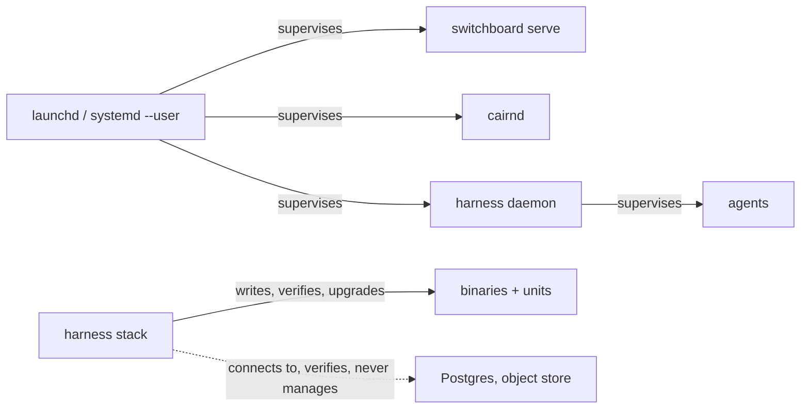
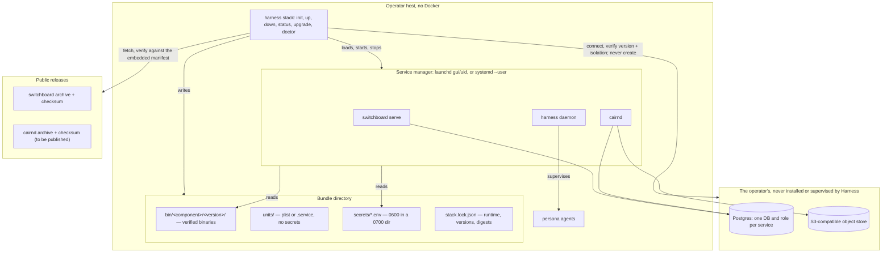

# ADR-0031: A native runtime for `harness stack` — pinned binaries and generated service units, on the operator's own datastores

> **Not yet implemented.** Design stage. This ADR adds a second runtime to
> ADR-0024's stack installer; it changes no decision ADR-0024 made about the
> Compose runtime.

## Context and Problem Statement

ADR-0024 decided that
`harness stack` writes, starts, checks and upgrades a pinned **Docker Compose**
bundle, and rejected the native alternative as its Decision 2, Option 2:

> **Option 2 — Native binaries under Harness**
>
> * Good, because Harness is a supervisor, and it would need no Docker.
> * Bad, because a native Postgres and object store is a per-platform install
>   problem, and supervising a database is not what Harness's restart policies
>   were built for.

Both objections are correct and both still hold. Neither is an objection to
running **Switchboard and Cairn** natively. They are objections to *Harness
installing a database* and to *Harness supervising one*. That option bundled
three things together — native service binaries, a Harness-installed Postgres,
and supervision as resident harnesses — and rejecting the bundle rejected the
one part that was never the problem.

**A second self-hosting customer reviewed the accepted Harness records and
endorsed them, with one divergence.** They run Switchboard and Cairn as native
binaries on a single Mac, with no Docker at all, against a Postgres they already
operate. Under ADR-0024 as written, the entire installer — the tested manifest,
the version reporting, the upgrade path, the end-to-end self-test — is
unavailable to them. They are not a degraded case: their datastore is already
provisioned, backed up and monitored by them, which is precisely the part
ADR-0024 declined to own.

Four facts on `origin/main` decide how expensive this actually is.

* **Switchboard's release binary is already a server.** `cmd/switchboard/main.go`
  opens: "the single switchboard binary: the server AND the operator CLI", with
  `serve` as the default command when none is given. Its `.goreleaser.yaml`
  cross-compiles linux and darwin on amd64 and arm64 and publishes archives plus
  a `checksums.txt` to a public GitHub release. Running Switchboard natively
  needs no new build, no new repository and no new pipeline — only a fetch.
* **Cairn's server has no release artifact, deliberately.** Cairn's
  `.goreleaser.yaml` declares exactly one build, `./cmd/cairn`, and a post hook
  (`scripts/verify-cli-artifact.sh`) aborts the release if the archive contains
  `cairnd`. `cmd/cairnd` exists in the tree and is never published. The native
  runtime therefore needs a **separate server artifact**, and must not be
  implemented by relaxing that hook: a CLI archive that grew a server is the
  packaging defect the hook exists to catch, and it would stay a defect here.
* **Nothing is signed.** All three repositories' goreleaser configs carry a
  `checksum:` block and no `signs:` block. Verification today can be a digest
  and cannot be a signature, and a decision that assumes otherwise would be
  unimplementable on the day it landed.
* **Harness already writes service units — for itself.**
  ADR-0005 put the daemon's own boot
  integration in `systemd --user` on Linux and a launchd LaunchAgent on macOS,
  and the [run-as-a-service guide](../guides/run-as-a-service.md) ships both shapes. Generating a unit is
  an idiom this project already owns, tests and documents.

One fact cuts the other way, and is the reason this is not simply "ADR-0024's Decision 2, Option 1 with
binaries": SPEC-0018 REQ-15 requires Postgres to hold **one database and one
role per service**, each role owning only its own database. On a Compose bundle
Harness creates that cluster and can guarantee it. On the operator's Postgres,
Harness has no such authority, and the isolation is an assertion to verify, not
a fact to construct.

**So: can the stack installer serve an operator who has Docker nowhere and a
Postgres already, without Harness acquiring a database to install or a database
to supervise?**

## Decision Drivers

* **ADR-0024's two objections must survive intact.** Whatever is adopted, the
  installer must still not install a database or an object store, and must still
  not supervise one.
* **Native is a first-class path, not a fallback.** A second runtime that skips
  the self-test, reports versions differently, or has no upgrade story is a
  worse outcome than no second runtime, because it looks supported and is not.
* **One manifest, one lock, one verification story.** Two runtimes that pin
  versions differently drift, and the drift surfaces as "it works on Docker".
* **Verify what is actually verifiable.** Checksums exist today; signatures do
  not. The record must say which, and must have somewhere for signatures to go
  when they arrive.
* **The operator's data stays the operator's.** Harness must not create, start,
  restart, back up on its own initiative, or destroy a datastore it did not
  provision.
* **No new supervision surface in the daemon.** The Harness daemon supervises
  agents. It must not acquire a second job class whose failure mode is a
  restarted database.

## Considered Options

The decision has four parts. Decisions 1 and 2 together are exactly the split
inside ADR-0024's Decision 2, Option 2.

### Decision 1 — Whether a native path exists at all

* **Option 1 — A hybrid native runtime.** Harness installs pinned Switchboard and Cairn
  binaries and writes service units for them; Postgres and the object store are
  the operator's, required as inputs and verified, never installed.
* **Option 2 — Compose only.** ADR-0024 unchanged. An operator without Docker installs
  by hand and gets none of the installer.
* **Option 3 — Full native, including datastores.** Harness installs and manages
  Postgres and an object store per platform. This is the half of ADR-0024's
  Decision 2, Option 2 that its first objection rejects.

### Decision 2 — How the native processes are supervised

* **Option 1 — Generated service units that the OS supervises** — a launchd
  LaunchAgent on macOS, a `systemd --user` unit on Linux — written by
  `harness stack`, owned by the operator's login session.
* **Option 2 — Resident harnesses under the Harness daemon.** This is the half of ADR-0024's
  Decision 2, Option 2 that its second objection rejects.
* **Option 3 — Nothing.** Harness writes a bundle and prints the commands; the operator
  starts the processes.

### Decision 3 — Where binaries come from and how they are verified

* **Option 1 — Pinned release artifacts named by the embedded manifest, verified
  against a SHA-256 recorded *in the manifest*,** with signature verification
  enabled per component the moment a product publishes signatures.
* **Option 2 — The release's own `checksums.txt`.** Fetch the artifact and its checksum
  file from the same release.
* **Option 3 — `go install` at a pinned version.**
* **Option 4 — Build from a pinned source tag on the operator's host.**

### Decision 4 — The datastores

* **Option 1 — External and required.** Connection details are mandatory inputs;
  Harness verifies reachability, version, privileges and isolation, and refuses
  to install or start either one.
* **Option 2 — Harness installs them** per platform (Homebrew, apt, a downloaded
  Postgres).
* **Option 3 — Embedded substitutes** — SQLite and a filesystem blob store — for the
  native path only.

## Decision Outcome

Chosen options: **Decision 1, Option 1** (a hybrid native runtime),
**Decision 2, Option 1** (generated service units the OS supervises),
**Decision 3, Option 1** (manifest-pinned artifacts verified by a digest
recorded in the manifest, signatures when they exist), and
**Decision 4, Option 1** (the datastores are external, required and verified).

In one sentence: `harness stack` gains a `runtime` of `docker` or `native`;
under `native` it downloads the manifest's pinned Switchboard and Cairn server
binaries, verifies each against a digest carried in the manifest, installs them
into a versioned path, writes a launchd or `systemd --user` unit per service,
requires the operator's Postgres and object store and proves them reachable and
correctly separated before writing anything — and then runs the **same**
version verification, the same end-to-end self-test, and the same upgrade and
rollback flow as the Compose path.

### Exactly what this adopts from ADR-0024's Decision 2, Option 2, and what it still rejects

| ADR-0024 Decision 2, Option 2, taken apart | Verdict here | Why |
|---|---|---|
| Switchboard and Cairn run as **native binaries**, no Docker | **Adopted** | Switchboard already ships a server binary; Cairn needs one published. Neither objection in ADR-0024 was about this. |
| Harness installs a **native Postgres** | **Still rejected**, unchanged | "A native Postgres and object store is a per-platform install problem." It still is. The operator brings one. |
| Harness installs a **native object store** | **Still rejected**, unchanged | Same objection. `--object-store external` already exists on the Compose path (SPEC-0018 REQ-15); on the native path it is the only mode. |
| The services are **supervised by Harness as resident harnesses** | **Still rejected**, unchanged | "Supervising a database is not what Harness's restart policies were built for" — and a long-lived HTTP server is not an agent run either. The OS supervises them, as ADR-0005 already has the OS supervise the Harness daemon. |
| Harness **supervises a database** | **Still rejected**, unchanged | Harness never starts, restarts, stops or health-restarts the operator's Postgres. It connects to it and reports. |

**This is not full native.** Harness installs two application binaries. It does
not install, configure, start, supervise, back up on its own initiative, or
remove a database or an object store, on any platform, under any flag. An
operator without a Postgres is told to get one; `harness stack init --runtime
native` refuses rather than helpfully installing one.

### What changes in ADR-0024

ADR-0024's Decision 2 becomes: **Option 1 for the Docker runtime, and a
constrained Option 2 — its binaries and none of its datastore or supervision
claims — for the native runtime.** Nothing else in ADR-0024 changes: the
installer still lives in Harness (Decision 1, Option 1), still pins from a
tested embedded manifest (Decision 3, Option 1), still provisions as the
signed-in user with no bootstrap credential (Decision 4, Option 1), still
writes per-persona client files with secrets by reference (Decision 5,
Option 1), and still proves the install with an end-to-end self-test compared
by content (Decision 6, Option 1). `harness init` is untouched — it connects a client to
an instance and does not care how that instance's processes were started.

### Runtime selection

`runtime` is a bundle property, chosen once at `stack init`, recorded in
`stack.lock.json`, and not switchable in place. Switching means a new bundle
pointed at the same datastores, because the two runtimes disagree about what a
running service *is*: a container with a digest, or a process with a unit and a
binary on disk. A `stack upgrade` that silently changed runtime would leave
whichever set was running before unmanaged and still holding the port.

### Supervision, and where the line sits

This is ADR-0005's diagram with two more units in it. The Harness daemon's job
is unchanged, and `harness stack` gains no long-lived process of its own: it
writes files, calls the platform's service manager, and exits.

Units are **user-scoped**: `gui/<uid>` on macOS, `systemd --user` on Linux. No
subcommand writes to `/Library/LaunchDaemons`, `/etc/systemd/system`, or
anything else needing `sudo`. A server that must survive logout is a
`loginctl enable-linger` instruction in the docs, the same answer
the run-as-a-service guide already gives for the daemon — not a privilege Harness
acquires.

### Verification, honestly scoped

The manifest — the same embedded, Renovate-bumped, CI-gated manifest of
SPEC-0018 REQ-16 — gains, per native component and per `os/arch`, an artifact
URL, a SHA-256 and a minimum version. The digest lives **in the manifest**, not
in a `checksums.txt` fetched beside the artifact: a checksum file served from
the same origin as the artifact proves transport integrity and nothing about
provenance, and the manifest is the thing Harness's own release tested.

Signature verification is a per-component manifest field that is **absent
today** because no product signs. When a product adds `signs:` to its goreleaser
config, the field is populated and verification becomes mandatory for that
component, with no code change in the installer and no change to this record.
A manifest entry that claims a signature Harness cannot verify fails the build,
the same way a `latest` tag already does.

### What the native path must prove about the operator's Postgres

SPEC-0018 REQ-15's isolation requirement does not evaporate because Harness did
not create the cluster; it becomes a **precondition Harness checks and refuses
to proceed without**. `stack init --runtime native` takes one connection URL per
service and verifies, before writing anything, that: each connects; the server
version meets the manifest minimum; the two URLs name **different databases and
different roles**; neither role can read the other's database; and each role can
create objects in its own. It prints the `CREATE ROLE` / `CREATE DATABASE` /
`REVOKE` statements when a check fails, and runs none of them.

There is no `--allow-shared-database`. Two services sharing a role is the
tenancy failure REQ-27 exists to prevent, one layer down, and an escape hatch
for it would be used.

### Consequences

* Good, because an operator with no Docker gets the whole installer — the pinned
  manifest, the reported versions, the upgrade plan with a pre-upgrade dump and
  a rollback, `doctor`, and the self-test that proves an agent claimed a real
  todo and wrote a real artifact.
* Good, because ADR-0024's objections are preserved as written rather than
  re-litigated, and the record says which half of ADR-0024's Decision 2, Option 2 it takes.
* Good, because it reuses what exists — ADR-0005's unit idiom, SPEC-0018's manifest,
  lock, self-test, upgrade and doctor. The second runtime is a fetch-and-unit
  layer under an unchanged command surface, not a second installer.
* Good, because it forces a packaging fix worth having on its own: Cairn publishes
  a server artifact, distinctly from its CLI, instead of the server being
  reachable only as a container image.
* Bad, because two runtimes is two upgrade paths, two doctor check sets, and two CI
  matrices. CI must exercise the native path on macOS and Linux, or "native is
  first-class" is a claim rather than a property.
* Bad, because the installer acquires platform-specific code — `launchctl bootstrap`
  versus `systemctl --user`, plist versus unit file, and their differing
  restart, environment and logging semantics.
* Bad, because Harness can verify the operator's Postgres but cannot keep it
  correct. An operator who later grants Cairn's role access to Switchboard's
  database will pass `stack init` and fail `stack doctor`, which is the right
  place for it to surface and is still later than a bundle Harness built.
* Bad, because Windows is out. Neither `launchd` nor `systemd --user` exists there,
  and a Windows service installer is not in scope. `--runtime native` refuses on
  Windows with a named error rather than degrading.
* Neutral, because the native path has no digest to compare a running container
  against, so `stack status` compares the installed binary's SHA-256 and the
  service's reported version against the lock. That is the same property REQ-20
  asserts, measured differently.

### Confirmation

SPEC-0024 (`stack-native-runtime`) formalizes the runtime flag, the native
manifest fields, binary verification, unit generation, datastore validation,
parity of `status`, `upgrade`, `doctor` and the self-test, and the refusals, as
testable requirements. Acceptance tests include:

* A manifest whose native entry has no SHA-256, or whose artifact URL is a
  moving reference, fails the build — the same gate that already rejects a
  `latest` image tag.
* A downloaded artifact whose digest does not match the manifest leaves nothing
  installed, and the error names the component, both digests and the URL.
* A generated launchd plist and `systemd --user` unit contain no secret value,
  reference only `secrets/*.env`, and are user-scoped.
* `stack init --runtime native` refuses two connection URLs that share a role
  or a database, and prints the SQL rather than running it.
* `stack init --runtime native` refuses on Windows, and refuses when the
  manifest carries no Cairn server artifact for the host's `os/arch`, naming
  what is missing.
* `stack down --volumes` under the native runtime refuses and names the
  operator's datastore instead of dropping anything.
* The REQ-25 self-test passes on a native stack with every step `pass`, and
  fails on the same forged-artifact and silent-doorbell cases as the Compose
  path.
* `stack status --json` emits the same fields in both runtimes, with `runtime`
  distinguishing them, and no secret in either.

## Pros and Cons of the Options

### Decision 1 — Whether a native path exists at all

#### Option 1 — A hybrid native runtime (chosen)

* Good, because it serves an operator with no Docker without Harness acquiring
  a datastore to install or supervise.
* Good, because the expensive parts — manifest, lock, self-test, upgrade,
  doctor — are already specified and are reused rather than re-decided.
* Bad, because it is a second runtime, with the CI and maintenance cost of one.
* Bad, because it depends on Cairn publishing a server artifact it does not
  publish today.

#### Option 2 — Compose only

* Good, because it is one path, one CI matrix, one upgrade story.
* Bad, because it excludes an operator whose objection to Docker is not
  ignorance of it, and hands them a hand-assembled stack — which is the failure
  ADR-0024 was written to end.

#### Option 3 — Full native, including datastores

* Bad, because, as ADR-0024 found, a native Postgres and object store is a
  per-platform install problem, and it makes Harness responsible for the
  durability of data it has no story for backing up.

### Decision 2 — How the native processes are supervised

#### Option 1 — Generated service units (chosen)

* Good, because the OS's service manager already does restart, boot start and
  log routing, and ADR-0005 already chose it for the daemon.
* Good, because unit files are inspectable and removable by the operator without
  Harness.
* Bad, because plist and `.service` semantics differ enough that the
  generator needs real per-platform tests, not one template with substitutions.

#### Option 2 — Resident harnesses under the daemon

* Good, because it would need no platform-specific code.
* Bad, because, as ADR-0024 found, the daemon's restart policies are built for
  agent runs, which are expected to exit. A server that exits is an incident,
  and conflating the two makes both worse.
* Bad, because the daemon would then have to be running for the stack to be
  running, so `harness daemon stop` would take down Switchboard and Cairn.

#### Option 3 — Print the commands

* Bad, because "the installer that does not install" reproduces the week of
  hand-assembly this whole capability exists to remove, and leaves nothing for
  `upgrade`, `status` or `doctor` to act on.

### Decision 3 — Where binaries come from and how they are verified

#### Option 1 — Manifest-pinned artifacts, digest in the manifest (chosen)

* Good, because the digest comes from the artifact Harness's own release tested,
  not from a file served by whoever served the binary.
* Good, because it degrades honestly: checksums today, signatures per component
  the moment a product publishes them, enforced by the same build check that
  already rejects a `latest` tag.
* Bad, because every component version bump is a manifest change with a digest,
  which is Renovate's job and a CI gate rather than a human's.

#### Option 2 — The release's `checksums.txt`

* Good, because it needs no manifest field.
* Bad, because an attacker who can serve the artifact can serve the checksum
  file, so it verifies transport and nothing else.

#### Option 3 — `go install` at a pinned version

* Bad, because it requires a Go toolchain on the operator's host, builds
  something the project never tested, and — as the module path of a mirrored
  repository already demonstrates elsewhere in this fleet — resolves against
  whatever the proxy holds rather than the release.

#### Option 4 — Build from source

* Bad, because of the same reasons plus a compiler, a clone and minutes per install.

### Decision 4 — The datastores

#### Option 1 — External, required, verified (chosen)

* Good, because it is ADR-0024's first objection honoured rather than
  worked around, and because the operator's Postgres is usually the one thing
  they already back up.
* Bad, because isolation becomes a check that can pass at install and rot
  afterwards.

#### Option 2 — Harness installs Postgres

* Bad, because ADR-0024 rejected it and this record does not revisit it.

#### Option 3 — Embedded SQLite and a filesystem store

* Bad, because it makes the native path a different product with different
  durability, different concurrency and a migration nobody wants, which is the
  definition of a degraded fallback.

## Architecture Diagram

## Security

* **Provenance.** A binary is executed on the operator's host with their
  credentials, which is a strictly larger blast radius than a container pull.
  This is why the digest comes from the manifest, why a mismatch discards the
  download and installs nothing, and why signatures become mandatory per
  component the moment they exist.
* **Secrets.** Unit files are world-readable by convention on both platforms, so
  no secret is ever written into a plist or a `.service` file. Both reference
  `secrets/*.env` (`0600`, in a `0700` directory), exactly as the Compose
  runtime's `env_file` entries do, and SPEC-0018 REQ-17's rule that no
  subcommand prints a secret applies unchanged — including to datastore
  connection URLs, which carry a password and are therefore shown host-and-
  database only, with a fingerprint.
* **Least privilege.** User-scoped units only. No `sudo`, no system-wide unit,
  no daemon running as root, and no installer-created OS user.
* **Network exposure.** Without a reverse proxy, native services bind
  `127.0.0.1`, matching REQ-15's rule for the Compose runtime. The native path
  does not generate a Caddyfile or manage a reverse proxy; an operator
  terminating TLS uses their own, and `stack doctor` checks the streaming
  behaviour Switchboard's `/mcp/*` routes need rather than assuming it.
* **Data destruction.** `stack down` under the native runtime unloads units and
  stops processes. There is no native equivalent of `--volumes`: Harness will
  not drop a database it did not create, and the flag is refused with an error
  naming the datastore rather than silently ignored.

## Tenancy

SPEC-0018 REQ-27 holds unchanged, and the native runtime adds no exception to
it. The runtime decides how two processes are started; it decides nothing about
who owns what they hold.

* No instance-global user resource is created — no instance-wide Cairn outbound
  webhook, no static Cairn token for any user, no credential that can act for
  users in Switchboard.
* Harness writes to neither product's database directly. It connects to the
  operator's Postgres only to verify reachability, version and isolation, and
  issues no `CREATE`, `ALTER` or `DROP` there.
* The Postgres role separation of REQ-15 becomes a verified precondition
  (above), so one service still cannot read another's data. There is no
  `--allow-shared-database`.
* The identity-provider requirement of REQ-18 is unchanged: an OIDC issuer or a
  GitHub OAuth application is required, enrollment defaults to `invite`, and
  neither product's development login is enabled under any flag.
* `harness init` is untouched, so every endpoint and token a persona gets is
  still vended as the signed-in user or their team, whatever runtime started the
  instance.

## Composition with Switchboard and Cairn

* **Switchboard** needs nothing new to run natively — one binary, `serve` by
  default. It does need the release and version contract being written as
  Switchboard ADR-0032 / SPEC-0027, because native version verification reads
  the same reported version the Compose path does. Its enrollment mode
  (`SWITCHBOARD_ENROLLMENT_MODE`, REQ-18) is written into `secrets/`, not the
  unit.
* **Cairn** must publish a `cairnd` server artifact for linux and darwin on
  amd64 and arm64, as its own release build with its own checksums, alongside
  and not inside the `cairn` CLI archive whose contents its release hook
  enforces. Until that artifact exists, `--runtime native` refuses Cairn by
  name and says what is missing; it does not fall back to Docker for one
  component, because a bundle running half under a service manager and half
  under Compose has two supervisors and one set of ports.
* **The self-test is unchanged and is how parity is proven.** The same webhook →
  todo → doorbell → one-shot → artifact-containing-a-nonce → completed-todo
  loop, compared by content, runs on both runtimes. A native `stack up` that
  cannot pass it fails, exactly as a Compose one does.

## More Information

* ADR-0024 (Stack installer and centralized stack management)
  — the record this extends, and the source of its Decision 2, Options 1 and 2.
* ADR-0005 (Supervision and lifecycle)
  — the existing decision that the OS supervises the Harness daemon through
  `systemd --user` or a LaunchAgent.
* SPEC-0018 (Stack installer and centralized stack management)
  — the requirements the native runtime extends; REQ-15, REQ-16, REQ-17, REQ-20
  through REQ-25 and REQ-27 are the ones it restates for a second runtime.
* SPEC-0024 — the companion spec for this ADR. It is a separate record because
  the pull request accepting the Stumply design set is still open against
  SPEC-0018; folding it in is tracked as a follow-up story on the stack
  installer epic.
* The [run-as-a-service guide](../guides/run-as-a-service.md) — the unit shapes the generator follows.
