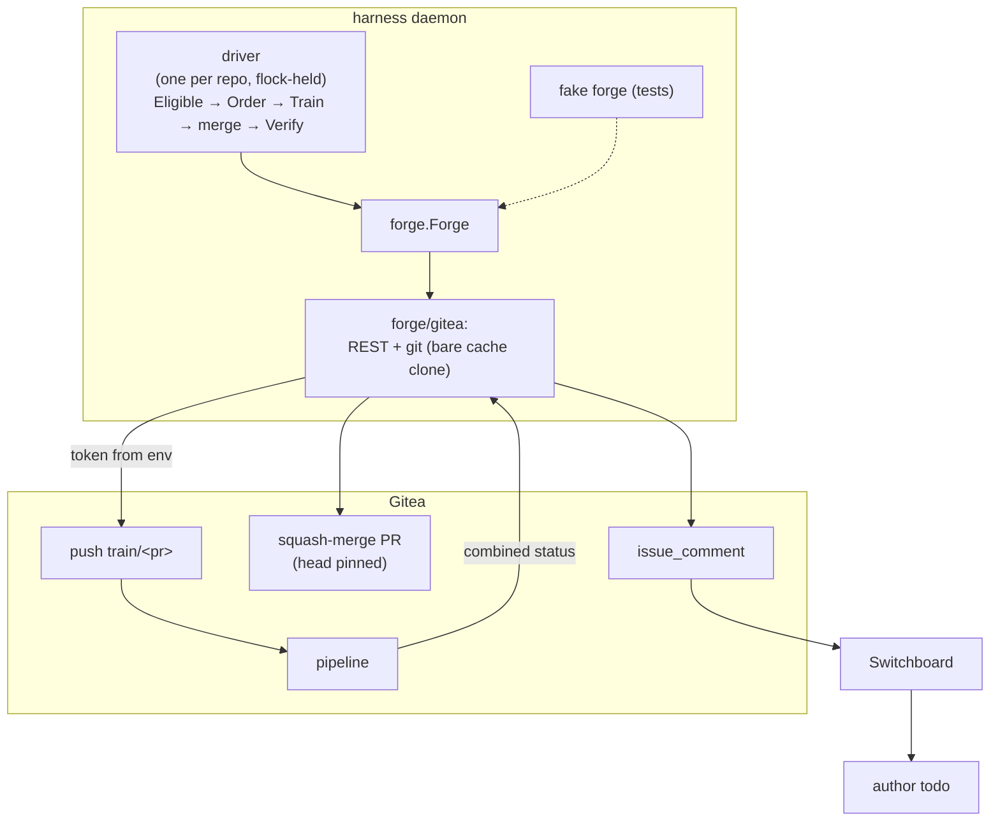

# ADR-0032: A merge train — one deterministic merger per repo tests the exact tree that lands, and only it moves `main`

> **Not yet implemented.** Design stage for epic #540. SPEC-0025 specifies the
> behaviour; the stories #597–#605 implement it.

## Context and Problem Statement

Our repos protect `main` with `block_on_outdated_branch`, merge by squash, and
forbid force-pushes and merging `main` into a branch. Gitea 1.27 has no merge
queue. So every merge strands every open sibling PR, and until 2026-09-23 the
only way back was a **replay** — a new PR and a new review:

- 34 of 104 PRs opened 09-20 → 09-22 were replays, 14 of them in this repo.
- A change that needed a replay took a median **50 h** to land; one that did
  not took **0.4 h**.
- 18 replays were opened by the predecessor's reviewer, which flipped the
  author and forced a fresh cross-identity review.

The block cannot simply be dropped (stumpcloud/stumpcloud#466, decision D1).
Gitea PR CI tests `refs/pull/N/head`, **not** the merge with `main`, so the
block is the only thing making "the tree CI tested" equal "the tree that
landed". In the window it caught zero integration failures, but it is the
guard against A and B each green while A+B is red.

Two things changed since the epic was written:

1. **The rebase update is allowed.** `POST /repos/{o}/{r}/pulls/{n}/update?style=rebase`
   replays a PR onto `main` server-side, CI then runs on that head, and under a
   squash merge that head is the tree that lands. That stops the replay churn
   on its own, at one CI run and one re-approval per PR per intervening merge.
2. **Epic decision D3: LLM sessions never merge.** Reviewers approve; something
   deterministic, running as a dedicated bot account, merges.

So the train is no longer the only fix for churn. It is a **throughput and
governance** component: approved work lands without an agent (or a human)
babysitting it, in a predictable order, and every landed tree was tested as
exactly that tree.

How should a deterministic merger, running inside the Harness daemon, land
approved PRs so that the tested tree is the merged tree, without rewriting
anyone's branch, without an LLM in the loop, and without silently dropping a
PR?

## Decision Drivers

- **Tested tree == merged tree.** The property the block provides today must
  survive turning the block off.
- **No LLM merges** (epic decision D3). The merger is plain code with no model calls.
- **Nobody's branch is rewritten.** The PR head is read, never pushed to.
- **Loud failure.** A PR that cannot land is told so, once, with the reason; a
  failure the train cannot explain halts the train.
- **Testable offline.** Every forge interaction goes through one interface
  with an in-memory fake, so the whole state machine runs in `go test`.
- **Off by default** (ADR-0006): a capability that merges code ships disabled.
- **Credentials stay out of argv, logs and error strings** (ADR-0008).

## Considered Options

### Decision 1 — How the train tree is built

- **Option 1 — Local git plumbing, pushed as a new `train/<pr>` branch** (chosen).
  Keep a bare cache clone per repo; `git merge-tree --write-tree <main> <head>`
  computes the merge without a work tree and exits 1 on conflict;
  `git commit-tree` makes one commit whose parent is `main`; push it to
  `refs/heads/train/<pr>`.
- **Option 2 — Gitea's contents API** (`POST /repos/{o}/{r}/contents` with
  `new_branch`), writing the PR's changed files onto `main`.
- **Option 3 — Push the train commit to the PR branch** (the rebase update, done by
  the train).

### Decision 2 — How the tested tree lands

- **Option 1 — API squash merge, pinned on both sides, then verified by tree**
  (chosen).
- **Option 2 — Fast-forward `main` to the train commit** by a direct push.

### Decision 3 — Ordering

- **Option 1 — Earliest qualifying approval, then PR number** (chosen).
- **Option 2 — Priority label, then approval.**
- **Option 3 — Smallest diff first.**

### Decision 4 — The per-repo singleton

- **Option 1 — An exclusive, non-blocking `flock` on a per-repo lock file, held
  for the driver's lifetime** (chosen).
- **Option 2 — A mutex held by the daemon.**
- **Option 3 — A lock branch on the forge.**

### Decision 5 — The author todo

- **Option 1 — One PR comment that @mentions the author and carries a machine
  marker; Switchboard routes it to the author's queue** (chosen).
- **Option 2 — Harness writes the todo through a Switchboard client.**

## Decision Outcome

Chosen options: **Decision 1, Option 1** (git plumbing on a new branch),
**Decision 2, Option 1** (pinned API squash, then verify), **Decision 3,
Option 1** (earliest qualifying approval), **Decision 4, Option 1** (a per-repo
`flock`) and **Decision 5, Option 1** (one marked PR comment).

### The loop

Per enabled repo, one driver goroutine. Each tick (default every 60 s):

1. List open PRs; keep those `Eligible` (not draft, CI green on the head,
   mergeable, approved by a non-author **on the current head**, no
   `REQUEST_CHANGES` on the current head); sort them with `Order`.
2. For the first PR not already attempted at this `(head, base)`:
   1. read `main`'s head → `base`;
   2. **build** `train/<pr>` = `base` + a squash of the PR head, as a new
      commit on a new branch;
   3. **wait** for CI on that exact commit, polling the combined status with
      backoff and a deadline;
   4. **delete** `train/<pr>`, whatever happened;
   5. on green: re-read the PR and `main`; if the PR's head, its eligibility,
      or `main` moved, skip (the next tick retries against the new state);
      otherwise **squash-merge** with the head pinned;
   6. **verify**: the merge commit's tree equals the train tree, `main`
      points at the merge commit, and every changed path's bytes on `main`
      equal the train's.
3. One PR per tick. After a merge, the next tick starts from the new `main`.

"Batching" in this ADR means the queue drains without a human between merges,
not that several PRs share one CI run. One PR per train keeps the tree-equality
argument simple and a red run attributable; combining PRs is a later, separate
decision (see *More Information*).

### Why tested == merged (Decisions 1 and 2)

The train commit's tree is `merge(base, head)`. CI runs on that commit. The
merge is performed only if, immediately before it, `main` is still `base` and
the PR head is still `head`; the head is additionally pinned in the merge call
itself (`head_commit_id`), so Gitea refuses the merge if it moved in between.
Gitea's squash merge then computes `merge(base, head)` with the same git merge
machinery (`ort`) and commits it.

That argument has two soft spots, and each is closed by **verification after
the fact, which halts the train**:

- Gitea's merge and ours could disagree (a git version or strategy difference).
- `main` could move in the milliseconds between the re-read and the merge (a
  human bypass, or a second train on another host — see Decision 4).

So after every merge the driver fetches the merge commit into its cache and
compares **real git tree ids**: `rev-parse <merged>^{tree}` against the train
tree. The Gitea REST API cannot be used for this — on this instance
`GET /git/commits/{sha}` returns the *commit* id in `commit.tree.sha`, and
`GET /git/trees/{sha}` echoes the commit id too (verified 2026-09-23 on
`6db13bd`, whose real tree is `679bb41`). A mismatch is an untested tree on
`main`: the driver halts, logs at error level, and comments on the PR. It is
detected within one merge and fixed by a revert, which the train then lands
like any other PR.

The content check of #601 (`VerifyLanded`) runs as well, against `main`, for
the PR's changed paths. It is weaker than tree equality and exists for the
failure the epic names: the `merged` flag says yes and the change is not on
`main`.

Decision 1, Option 2 was rejected because the contents API cannot express a file mode: a PR that
adds an executable script would be tested without its `+x`, which is exactly a
tested tree that differs from the landed one. It also cannot do a three-way
merge, so any file both sides touched would be a false conflict.

Decision 1, Option 3 was rejected because it rewrites the author's branch, which
`dismiss_stale_approvals` then answers by dismissing the approval the train is
acting on.

Decision 2, Option 2 was rejected: Gitea cannot mark a PR merged by a commit that is not its
head when the history is squashed, the bot would need push rights on `main`,
and every repo merges by squash for a linear history.

### Failure handling

| Event | Scope | What the driver does |
|---|---|---|
| merge conflict building the train | PR | comment + author todo; skip the PR until its head or `main` moves |
| red CI on the train commit | PR | comment + author todo; skip until head or `main` moves |
| CI does not finish by `ci_timeout` | PR | comment (cause `timeout`); skip until head or `main` moves |
| PR head, eligibility or `main` moved before the merge | PR | no comment; retry next tick |
| merge refused by the forge (4xx) | PR | comment (cause `merge refused`); skip until head or `main` moves |
| forge 5xx / network error | tick | no comment; log at warn; abandon the tick, retry next tick |
| tree or content verification fails after a merge | **train** | comment; log at error; **halt** the driver until restarted |
| `main` moved outside the train (bypass) | audit | log at warn with the new head; continue |

"Skip until head or `main` moves" is an in-memory record of attempted
`(pr, head, base)` triples, so a failed PR is not rebuilt every tick, but *is*
retried as soon as either side changes — which also gives a red flake a
second chance at the next merge.

**Never a replay.** No code path opens a pull request. A conflict is the one
case that needs a new tree, and the author makes it — by the rebase update if
Gitea can resolve it, or a local fix and a push.

**Never twice.** Before commenting, the driver lists the PR's comments and
does nothing if one already carries the marker for this head (below). The
dedupe lives on the forge, so it survives a daemon restart.

**Never a skipped red check.** Only `success` merges. `pending` with no
statuses at all is still pending — a commit CI never picked up does not pass
by being empty (Gitea reports `state: pending, total_count: 0` for a commit
with no statuses).

### Required checks on `train/*`

- The pipeline workflow triggers on `push` to `train/**` as well as `main`, so a
  train commit runs **the same `pipeline.yaml` a PR does**. Stages fenced to PRs
  (the AI review) or to `main` (the docs deploy) stay fenced.
- The driver requires the **combined status** of the train commit to be
  `success` with at least one status. Every job of the pipeline registers a
  pending status when the run is created, so a combined success means the
  whole run passed, not the first job to report.
- `train/*` gets a branch-protection rule whose push allowlist is the bot
  account only, so nobody else can create a train branch that looks
  tested.

Pinning an explicit list of required contexts (rather than "all that ran") is
an open question in SPEC-0025.

### Interaction with `dismiss_stale_approvals` — an invariant

**The train never pushes to a PR's head branch.** It reads the head, builds a
new commit on a new branch, and merges by API. Gitea dismisses approvals when
the head branch receives new commits; it does not dismiss them when the base
moves. So an approval survives the train merging other PRs ahead of it, and
the next tick finds the PR still eligible. If an approval *is* dismissed, a
human or an author pushed, and the PR correctly drops out of the queue until
it is re-approved on the new head.

### Singleton (Decision 4)

A driver takes an exclusive, non-blocking `flock` on
`$XDG_STATE_HOME/harness/mergetrain/<owner>_<repo>.lock` and holds it for its
lifetime. A second driver for the same repo — in the same daemon or another
daemon on the host — fails fast with `another merge train holds <repo>`. It is
refused, never raced. The lock dies with the process, so a crash leaves no
stale lock.

Option 2 was rejected because it does not cover two daemons on one host (a service
unit and a foreground `harness daemon` is the common way to get two). Option 3 was
rejected for v1: a forge lock branch needs a lease and a reaper to survive a
crash, and Gitea gives no atomic compare-and-set on a branch's age.

Cross-host exclusion is operational: the train is enabled in one daemon's
config only (the bot account's daemon). The base re-check and the tree
verification above bound the damage if that is ever violated: at most one
untested tree lands, and the train halts.

### Ordering (Decision 3)

Earliest **qualifying** approval first — the first `APPROVED` review by a
non-author on the current head — then PR number. It is first-come,
first-served on the only signal that means "a reviewer is done", it is
deterministic, and it cannot be gamed by the author.

Option 2 was rejected because every label we have is self-asserted by whoever opens
the PR. Option 3 starves large PRs, and they are the ones that have waited longest.

### Author todo (Decision 5)

The failure comment @mentions the author and ends with a marker:

```text
<!-- harness-mergetrain v1 pr=123 head=<sha> cause=red -->
```

The @mention is a Gitea notification. The comment's `issue_comment` webhook
reaches Switchboard, where a routing rule matching the marker makes one
`author` todo. Harness writes no todo itself.

Option 2 was rejected: Harness holds no Switchboard write credential and ADR-0008
keeps it that way; the forge comment is also the dedupe record, so a second
channel would be a second source of truth.

### Relationship to the rebase update

Both stay. On a repo with the train enabled the **train lands everything**;
reviewers approve and stop. The rebase update is the author's per-PR tool:
to resolve a conflict the train reported, and on repos without a train. While
`block_on_outdated_branch` is still on (the pilot), the forge refuses to merge
an outdated PR, so a train in `merge` mode could only land PRs that are
already current; that is why the pilot runs in `report` mode and the cutover
turns the block off in the same change that turns the train on (#605).

### Emergency bypass

If the train is down and something must land, a human with merge rights on
the repo:

1. runs the rebase update on the PR, so CI tests the tree that will land;
2. merges it by hand once CI is green;
3. comments `mergetrain-bypass: <reason>` on the PR.

The driver logs every observed `main` head it did not produce (`bypass
detected`, with the new head), so a bypass without the comment is still found
by grepping the daemon log. The kill switch is `[mergetrain] enabled = false`
and a daemon restart; `mode = "report"` stops merges but keeps building and
testing trains.

### Consequences

- Good, because approved work lands with no agent or human in the loop, in a
  predictable order, and every landed tree was CI-tested as that tree.
- Good, because turning off `block_on_outdated_branch` no longer costs the tested ==
  merged guarantee, so replays end on repos with the train.
- Good, because the only thing that merges is a few hundred lines of Go with a fake
  forge under test.
- Bad, because one CI run per PR, serialised. A repo with a 10-minute pipeline lands
  at most ~6 PRs an hour. Batching is the fix if that bites.
- Bad, because the daemon now shells out to `git` and holds a bare clone per repo.
- Bad, because a verification failure means an untested tree already reached `main`.
  It is detected, never silent, and bounded to one merge.
- Neutral, because the train needs a forge token with write access; it is read from
  an environment variable named in config, never stored in `harness.toml`.

### Confirmation

- SPEC-0025's scenarios run in `go test ./internal/mergetrain/...` against the
  fake forge: order, the failure table above, the head-moved skip, the
  single comment per head, the singleton, and the verification halt.
- The pilot (#605) runs the train in `report` mode on this repo and posts the
  trains built, their CI results and the verification outcomes on the issue.
- After cutover, the #540 acceptance bar is measured over a week: replays
  under 3 % of PRs, zero untested trees merged, no merge by an LLM session,
  `main` red only from flakes.

## Pros and Cons of the Options

### Decision 1 — How the train tree is built

#### Option 1 — Git plumbing, new branch (chosen)

- Good, because it is a real three-way merge, the same one Gitea performs; file
  modes, symlinks and binaries are exact.
- Good, because `merge-tree --write-tree` needs no work tree and reports
  conflicts by exit code.
- Bad, because it needs `git` ≥ 2.38 on the daemon host, and disk for a bare
  clone.

#### Option 2 — Contents API

- Good, because it is HTTP only.
- Bad, because it loses file modes and has no three-way merge.

#### Option 3 — Push to the PR branch

- Bad, because it rewrites the author's branch and dismisses the approval.

### Decision 2 — How the tested tree lands

#### Option 1 — Pinned API squash, then verify (chosen)

- Good, because the forge records the merge normally; the PR is marked merged.
- Bad, because tested == merged is argued, then checked; not guaranteed by
  identity.

#### Option 2 — Fast-forward `main`

- Good, because the landed commit *is* the tested commit.
- Bad, because it needs bot push rights on `main` and breaks the PR's merged
  state under squash.

### Decision 3 — Ordering

Options 1 (chosen), 2 and 3 are weighed in *Ordering* above.

### Decision 4 — The per-repo singleton

Options 1 (chosen), 2 and 3 are weighed in *Singleton* above.

### Decision 5 — The author todo

Options 1 (chosen) and 2 are weighed in *Author todo* above.

## Architecture Diagram



## More Information

- Epic: harness#540; the contention epic and its decisions D1–D5:
  stumpcloud/stumpcloud#466.
- **Governs SPEC-0025** — the behaviour;
  its design companion records the package layout and the `Forge` interface,
  including where it departs from the interface first sketched in #599.
- Later, not decided here: batching several PRs into one train (bisect on
  red), required-context pinning, enabling the train on a second repo — each
  on its own numbers, per #605.
