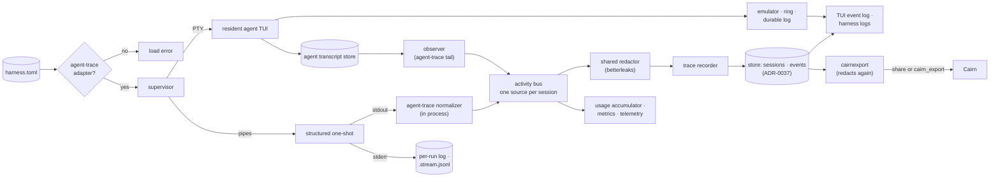

# ADR-0033: The agent trace is the run record; scrollback is a terminal view

> **Not yet implemented.** Design stage. The records live in the store of
> ADR-0037. Normalizing a one-shot's output depends on agent-trace's stream
> normalizer and its `agent-trace` CLI, neither of which exists yet.

## Context and Problem Statement

ADR-0007 made scrollback the record of what a harness did: an in-memory ring
behind attach, and a sanitized rotating log file behind `harness logs`. That fit
the first harnesses, which were terminal programs, but it is not what an operator
asks about. The questions after a night of runs are: which tools did the
agents call, which calls failed and why, which model served each turn, how many
tokens and dollars each run cost, and which session did the work. None of that
is in scrollback. It is in the agent's own trace.

Harness already reads traces, but only on the side:

* The observer (`internal/observe`) polls each agent's transcript store
  (`~/.claude/projects`, crush's databases, `~/.codex/sessions`) through
  agent-trace's `tail` readers, and feeds metrics (ADR-0020), telemetry
  (ADR-0022), the loop guard and the run ledger's usage accumulator
  (ADR-0028). It delivers new items once and keeps nothing.
* `harness logs` builds its structured view by re-reading transcripts on
  demand and attributing sessions to a run with `internal/runtrace`, a
  heuristic over adapter, working directory and time window that fails closed.
  A session two harnesses could have written belongs to neither.
* Once a transcript is rotated or cleaned up by its agent, the view is gone.

One-shots are worse off. A Claude Code prompt one-shot runs
`claude -p --verbose --output-format stream-json` (`internal/adapter`), so its
stdout is a machine-readable event stream: an `init` line with the session id
and model, every assistant and user message with its tool calls and results,
and a final `result` line with the outcome, turn count, duration, usage and
cost. Harness does not parse it, and nothing else does either: agent-trace
(pinned at v0.4.0) reads transcript files only. Every adapter parses a path
(`tail.Adapter.Parse(ctx, path)`), the one reader-based helper is
`tail.ReadJSONLines`, and there is no stream-json reader and no command-line
tool. Like every harness, the one-shot runs under a PTY, so the stream is
rendered by a terminal emulator into the scrollback ring and written to the
per-run log as text, interleaved with stderr. Its structured output, the only
exact record of the run, is treated as terminal output.

Three more gaps sit beside the record itself:

* **Some harnesses have no trace at all.** A `generic` harness runs `sh` with
  arbitrary arguments, and ADR-0023's unbound `command` harness execs an
  arbitrary argv. Neither writes anything agent-trace can read, so every
  consumer carries a trace-less branch, and the operator gets a log and a ledger
  record for a process Harness cannot account for.
* **Redaction is written three times.** Harness's `internal/redact` is
  hand-written regular expressions. Cairn has planned gitleaks v8 as its
  redaction engine, inside its own non-importable `internal/redact`.
  agent-trace offers only a `Redact func(string) string`
  hook. The same secret can be masked by one tool and missed by the next.
* **A run cannot be shared.** Harness carries `internal/cairnexport`, which maps
  an agent-trace trace onto Cairn's `POST /v1/runs` ingest, but nothing calls
  it, and it never redacts.

**What is the record of a run, how is it captured for resident TUIs and for
one-shots alike, which programs may Harness run at all, how does an operator
read and share a run, and what does Harness store versus point to?**

## Decision Drivers

* **Record what agents did**, not what their terminal showed: sessions, tool
  calls, errors by class, usage and cost, served models, the final result.
* **Every run has a trace.** A run Harness cannot trace is a run it cannot
  account for. Such a harness is refused at load, not supervised blind.
* **Every one-shot is fully recorded.** A run with no TUI must leave a complete
  record, attributed exactly to the process Harness spawned.
* **Agent formats live in agent-trace.** The daemon learns no agent's format.
  Normalizing transcripts and structured output is agent-trace's job, available
  as a library and as a binary, so Harness, shell pipelines and debugging all
  get the same records.
* **One activity stream per session.** Metrics, telemetry, budgets and the
  ledger must not count the same tool call twice because it arrived by two
  routes.
* **Operators read runs, not bytes.** The TUI shows what a run did as a
  formatted event log, not raw JSON and not repaint frames.
* **Redact before persistence, with one redactor** (ADR-0008, ADR-0022). A
  transcript carries credentials agents typed. Nothing reaches disk or the wire
  unredacted, and Harness, agent-trace and Cairn mask with the same rules,
  versioned in one place.
* **Shareable on request, never by default.** A run can be published to Cairn
  as a trace, but nothing leaves the host unless the operator configured it.
* **Bounded disk.** Records have a retention window and size caps, like the
  ledger.
* **Queryable after the agent forgets.** Distillation (ADR-0012, ADR-0030) and
  evals (ADR-0036) read months of sessions. They cannot depend on
  every agent keeping every transcript.
* **Keep what works.** Attach, the live screen, backpressure and the durable log
  stay as they are for terminal harnesses.

## Considered Options

### Decision 1 — What the run record is

* Option 1 — Scrollback and logs are the record (ADR-0007, status quo).
* Option 2 — The agent trace is the record; scrollback is a terminal view.
* Option 3 — Record full terminal sessions for replay.

### Decision 2 — Which programs Harness supervises

* Option 1 — Keep `generic` and other trace-less harnesses.
* Option 2 — Only agents agent-trace supports; fail loudly on anything else.

### Decision 3 — How a one-shot's trace is captured

* Option 1 — Transcript tailing only, through the observer.
* Option 2 — agent-trace normalizes the one-shot's structured output, in process
  and as a binary, with transcript tailing for everything else.
* Option 3 — Harness parses the structured output itself.
* Option 4 — The agent CLI's own OpenTelemetry export.

### Decision 4 — How a structured one-shot is spawned

* Option 1 — Under a PTY, as today, parsing the PTY byte stream.
* Option 2 — On pipes: stdout to the normalizer, stderr to the per-run log.

### Decision 5 — What the TUI shows for a run

* Option 1 — The terminal view only; a one-shot shows its raw output.
* Option 2 — A rendered event log for structured one-shots only.
* Option 3 — A rendered event log for every run; PTY harnesses toggle between it
  and the terminal view.

### Decision 6 — Copy transcripts, or index them

* Option 1 — Copy every transcript into Harness's store.
* Option 2 — Index: store normalized, redacted events and a pointer to the raw
  transcript. Copy only the stream of a one-shot, which is the raw record when
  the agent keeps none.
* Option 3 — Pointer only; re-parse on demand, as `harness logs` does today.

### Decision 7 — How content is redacted

* Option 1 — Keep per-project redaction (Harness's regular expressions, Cairn's
  own gitleaks package, agent-trace's hook).
* Option 2 — One shared, importable redaction package built on gitleaks v8.
* Option 3 — One shared, importable redaction package built on betterleaks.

### Decision 8 — How a run reaches Cairn

* Option 1 — It does not; records stay local.
* Option 2 — An explicit share command and TUI action, plus opt-in streaming
  export per harness.
* Option 3 — Export every run automatically once Cairn is configured.

## Decision Outcome

Decision 1: Chosen option: **Option 2 — The agent trace is the record;
scrollback is a terminal view**, because the questions operators, budgets,
distillation and evals ask are answered by tool calls, errors, usage and models,
and only the trace has them.

Decision 2: Chosen option: **Option 2 — Only agents agent-trace supports; fail
loudly on anything else**, because a harness with no trace is a harness Harness
cannot account for, and every trace-less branch in the record, the view, the
ledger and the export exists only to serve it.

Decision 3: Chosen option: **Option 2 — agent-trace normalizes the one-shot's
structured output**, because the stream is exact (it is the stdout of the
process Harness spawned, so attribution needs no heuristic), complete (it ends
in a `result` line with outcome and cost), and arrives whether or not the agent
writes a transcript; and because agent-trace already owns every transcript
format, so owning this one too keeps the daemon format-free and gives shell
pipelines and debugging the same normalization Harness uses.

Decision 4: Chosen option: **Option 2 — On pipes**, because a PTY merges stderr
into stdout and translates line endings, which breaks a line-delimited JSON
stream, and a one-shot in print mode has no screen for an emulator to keep.

Decision 5: Chosen option: **Option 3 — A rendered event log for every run**,
because the event log is the readable form of the record, a one-shot has no
other screen worth showing, and a resident agent's tool calls and errors are as
hard to read out of repaint frames as a one-shot's are out of JSON.

Decision 6: Chosen option: **Option 2 — Index**, because normalized events are
what every consumer queries and are small, while raw transcripts are large,
already on disk in the agent's own store, and full of content Harness should
not multiply.

Decision 7: Chosen option: **Option 3 — One shared, importable redaction
package built on betterleaks**, placed in agent-trace, because a secret one tool
masks must not survive the next, a rule fixed once should land everywhere, and
betterleaks is the actively developed successor to gitleaks with the larger rule
set (417 rules against gitleaks' 222), while gitleaks now takes security fixes
only. Its library API is still changing and its dependency tree is heavier; the
package boundary below absorbs the first, and the second is accepted.

Decision 8: Chosen option: **Option 2 — An explicit share command and TUI
action, plus opt-in streaming export per harness**, because a run viewed as a
trace on Cairn is the easiest way to show someone what an agent did, while
publication must stay a deliberate act (ADR-0022's consent rules).

### What survives from ADR-0007

This ADR supersedes ADR-0007's framing of scrollback as the record. What ADR-0007
decided about the terminal stays:

* The `x/vt` emulator's live screen and bounded scrollback ring back attach,
  in-TUI scroll and search for every PTY harness.
* The sanitized, rotating durable log (`logs/<name>.log`) stays the terminal
  view that `harness logs --raw` reads, including after a crash and, with
  ADR-0037, with the daemon down.
* Attach semantics and backpressure are unchanged: the PTY reader never blocks
  on a slow client.
* Secrets are never written by Harness to anything it persists. This ADR
  extends that rule to trace records and to anything it sends to Cairn.

ADR-0007's runtime state file is replaced separately, by ADR-0037.

### Harness supervises only agents agent-trace can read

A harness is valid only if its runs produce a trace agent-trace can normalize.
agent-trace has adapters for `claude-code`, `codex`, `crush`, `opencode`, `pi`
and `omp`. Harness has adapters today for `claude-code`, `codex` and `crush`,
so those are the kinds it accepts. It gains a kind when it gains an adapter for
one of agent-trace's agents, and agent-trace gains the adapter first.

* `harness = "generic"` is removed. A config that names it fails to load.
* A `command` harness (#648) is valid only when its `transcripts` binding (#663)
  names an agent-trace source. An unbound `command` harness fails to load.
* `harness run` with a word that is not a supported kind (ADR-0017's
  scratchpad dispatch) is an error, not a `generic` command.
* There is no silent fallback. The daemon refuses to start on such a config;
  `harness reload` rejects it and keeps the running config; `harness doctor`
  reports it.

The load error names the harness and the supported kinds, and is the migration
guide:

```text
harness.toml: [harness.heartbeat]: harness = "generic" is not supported.
Harness supervises only agents agent-trace can read: claude-code, codex, crush,
or a command harness with transcripts = claude-code | codex | crush | opencode | pi | omp.
Run other programs under your init system (systemd, launchd). See ADR-0033.
```

A one-shot of a supported kind that ends without producing any session is
recorded with `trace_missing = true` on its ledger record and flagged in the
TUI and `harness runs`. Harness does not guess a trace for it.

This reverses the positioning the project has stated so far: the README
describes Harness as a supervisor for long-running terminal processes including
REPLs and watchers, and the project instructions call the daemon agnostic about
what runs inside a harness. On acceptance both change to "a supervisor for the
agents agent-trace can read". The daemon stays agnostic about agent formats,
which live in agent-trace; it is no longer agnostic about what it runs.

### Which harnesses get which view

Every row has a trace.

| Harness | Views in the TUI | Run record |
| --- | --- | --- |
| Resident agent TUI (crush, Claude Code interactive) | terminal (PTY, ring, durable log), toggle to event log | trace from transcript tailing |
| Prompt one-shot whose adapter declares a structured stream (Claude Code today) | event log; no emulator | trace from the stream, normalized by agent-trace, exact |
| Prompt one-shot whose adapter declares no structured stream (crush `run`, codex `exec` as Harness invokes them) | terminal (PTY, ring, per-run log), toggle to event log | trace from transcript tailing |
| `command` harness (#648) bound to an agent-trace source (#663) | terminal (PTY), toggle to event log | trace from transcript tailing |

### Normalization belongs to agent-trace

Harness holds no stream parser of its own.

* An adapter in `internal/adapter` declares whether its prompt command emits a
  structured stream and in which format. Claude Code declares `stream-json`.
  Adapters without one declare none, and are traced by transcript tailing.
* agent-trace gains a normalizer that reads an `io.Reader` of stream lines and
  emits the same `classify.Event` values, marks, session metadata and usage
  items its transcript adapters emit for the same agent, plus a result item
  (`stream-json` first).
* The same normalizer ships as a binary: `agent-trace normalize` reads a stream
  on stdin and writes normalized records as JSON lines. A
  pipeline can run `claude -p --output-format stream-json … | agent-trace
  normalize`, and a captured `.stream.jsonl` can be replayed through it to debug
  a run.
* Harness links the library and hands it the stdout pipe in process. It does not
  spawn the binary: a second process per run would need supervising, and the
  binary on `PATH` could drift from the version Harness is built against.
* From a Claude Code stream the normalizer takes the `init` line (session id,
  model, tool and MCP server lists), tool-use and tool-result blocks, per-message
  usage, and the `result` line (subtype, `is_error`, `num_turns`,
  `duration_ms`, `total_cost_usd`, usage and the result text). No Harness type
  names any of these fields.
* A line the normalizer cannot parse is reported to Harness, which counts it,
  redacts it and writes it to the per-run log as text. It never ends the run.
* The normalized items go onto the observer's subscriber fan-out, marked
  `source = stream`. Metrics, telemetry, the loop guard, the usage accumulator,
  the trace recorder, the TUI event log and the Cairn exporter subscribe to one
  bus and see one copy of each item.
* **One source per session.** A session announced on a run's stdout is claimed
  by that run. The observer suppresses transcript items for a claimed session,
  so a Claude one-shot that also writes a transcript is not counted twice. The
  stream's `total_cost_usd` is the run's cost, with `cost_source = recorded`
  (SPEC-0021 REQ-8).

### Structured one-shots run on pipes

A one-shot whose adapter declares a structured stream is spawned with stdout on
a pipe to the normalizer and stderr on a pipe to the per-run log. It gets no
PTY and no emulator. The raw stream, redacted line by line, is kept as
`jobs/<name>/<id>.stream.jsonl` beside the per-run log and pruned with it by
`keep_runs`. Every other harness keeps its PTY.

### The run view in the TUI

Opening or attaching to a run in the TUI shows its event log: the normalized
trace records rendered as a formatted, scrollable log.

* One line per event: time, kind, tool and action, a summary of the call and the
  paths it touched, and its outcome. A failed call shows its error class
  (SPEC-0013 REQ-3). Usage lines show model and tokens.
* The run ends in a result block: outcome, turns, duration, tokens and cost.
* A live run follows the bus as items arrive. A finished run reads from the
  store, so the view works after the agent has deleted its transcript.
* A structured one-shot has only this view; its stderr lines are interleaved,
  marked as stderr. `harness attach` from the CLI prints the same rendering.
* A PTY harness keeps its terminal view as the default and gains a toggle beside
  it that switches to the event log of its current or selected run. A resident
  agent's log lags by the observer's poll interval, because its trace comes from
  transcript tailing.
* The TUI, `harness attach` and `harness logs` use one renderer, so the three
  never disagree about what a run did.

### What is recorded per run

Records live in the ADR-0037 store, keyed `(harness, run_id, session_id)`, and
join the ledger record of ADR-0028 on `(harness, run_id)`. The ledger stays
content-free. The trace tables are where redacted content lives.

| Record | Fields |
| --- | --- |
| Session | `harness`, `run_id`, `session_id`, `adapter`, `source` (`stream` or `transcript`), parent session for a subagent, `started_at`, `ended_at`, `cwd`, `git_branch`, served `(model, provider)` list, usage totals, `cost_usd` and `cost_source`, `trace_id` (the ADR-0022 id), transcript pointer, `events_complete`, `cairn_url` once shared |
| Event | `seq` within the session, `at`, `kind` (`tool_call`, `mark`, `usage`, `error`, `result`), `tool`, `action`, target paths, `is_error`, error class (SPEC-0013 REQ-3), `result_bytes`, summary, `model`, `provider`, tokens |
| Result | one per session that ends with one: subtype, `is_error`, turns, duration, result text |

Tool arguments are not stored raw. An event stores agent-trace's summary of the
call and the paths it touched, as `classify.Event` already does, and
`result_bytes`, not the result.

The transcript pointer is `{path, bytes, sha256}` at the time the session
closed: the agent's transcript when one exists, otherwise the run's
`.stream.jsonl`. A pointer can dangle once the agent cleans up its own store.
The normalized events do not depend on it.

### Redaction and bounds

* Every string passes the shared redactor (below) before it is written: the
  rules ADR-0022 applies before export, applied here before persistence.
  Control characters are stripped.
* `[telemetry] omit_prompts` applies here too: user-message marks and the
  prompt-derived session title are replaced with a placeholder.
* Caps: a summary is at most 1 KiB, a result text at most 4 KiB, and a session
  at most 10,000 events. Beyond that, events are counted and dropped, and the
  session reads `events_complete = false`. The raw stream file is capped by
  `[trace] max_stream_mb` (default 64), after which it is truncated with a
  marker line.
* `[trace] retention = "30d"` and `max_mb = 1024` bound the tables. Pruning
  deletes whole sessions, oldest first, and never a session whose run is still
  open.
* A harness opts out of storage with `record_trace = false`: its trace still
  feeds the bus, metrics and the live event log, but no events are stored. Its
  ledger record still carries sessions, usage and errors (ADR-0028).

### One redactor for the toolchain

Harness, agent-trace and Cairn use one redaction package,
`github.com/stump-wtf/agent-trace/redact`.

* It is built on betterleaks (`github.com/betterleaks/betterleaks`, MIT) as a Go
  library, with its default rule set, pinned to an exact version.
* **The API is ours.** The package exports `Redact(string) string`,
  `Findings(string) []Finding` and a line-stream redactor, and only this package
  imports betterleaks. Upstream API churn is absorbed here, in one place, and
  never reaches Harness, Cairn or agent-trace's other packages. A betterleaks
  upgrade is a deliberate bump with the redaction test corpus as its gate.
* **No network.** Live secret validation, which betterleaks offers as an option,
  stays off: validating a candidate would send it to the vendor it belongs to.
  Redaction is a pure function of its input and the pinned rules.
* Harness's rules that betterleaks lacks are ported as custom rules: URL
  userinfo, `Authorization` and token headers, secret-named assignments and
  flags, `curl -u`, and PEM private-key blocks. The line-stream redactor keeps
  the multi-line PEM state that Harness's `lines.go` tracks today, because a
  single-line detector cannot see a block that spans lines.
* Every finding is replaced with `[REDACTED]`, the mask Harness and Cairn
  already use.
* agent-trace uses it as its default `Redact` hook; a caller may still pass its
  own.
* Harness's `internal/redact` becomes a thin shim over it with the same
  signatures, so its callers (runtrace, observe, daemon logs, supervisor
  sanitize, the TUI chatroom, telemetry) change nothing. Once they import the
  shared package directly, the shim is deleted.
* Cairn imports the package instead of building its own.
  That makes Cairn depend on agent-trace, a trace library, for redaction. That
  is the cost of this placement.
* The rule set is versioned in one place: an agent-trace release. A rule added
  for one tool reaches the others on their next dependency bump.
* A detector is built once per process and reused. betterleaks compiles its
  default rule set at construction and costs more per string than Harness's
  expressions; the ported benchmark measures both before the switch.

A standalone redaction module would spare Cairn the agent-trace dependency, but
adds a repository, a release train and a CI pipeline. agent-trace is the better
home: Harness already imports it, and it is the normalization layer whose output
is what gets persisted and exported, so redaction sits where the content is
produced.

Redaction runs before persistence, before the bus reaches telemetry, and again
before anything is sent to Cairn.

### Publishing a run to Cairn

A run's whole trace can be viewed on Cairn as a trajectory.

* **On request.** `harness trace share <harness> [--run N]` builds the run's
  trace from the store, publishes it to Cairn and prints the URL. The TUI offers
  the same action on a run, behind a confirmation. The URL is stored as the
  session's `cairn_url`, so `harness runs` shows it.
* **Streaming, per harness.** `cairn_export = true` on a one-shot harness
  streams each run as it happens: the exporter opens a Cairn run at the `init`
  item, appends spans in batches as events arrive, and closes the run at the
  result.
* **Mapping.** `internal/cairnexport` stays the one mapper: agent-trace's
  `otel.BuildTrace` output, its own JSON intended for Cairn's trace API, becomes
  Cairn's run (mode, title, prompt, model, token count, start time,
  `on_behalf_of`) and its spans (id, parent, category, name, tool, args,
  output, start offset, duration), sent to `POST /v1/runs` and
  `POST /v1/runs/{id}/spans`. The trace carries only what the store holds:
  summaries and paths, not raw tool results.
* **Redaction.** Every string passes the shared redactor at send time. Records
  are already redacted when written; the second pass applies the rule set
  current at export to records written under an older one.
* **Consent.** Nothing leaves the host unless a `[cairn]` table is configured.
  Without it, `harness trace share` fails with a config error and makes no
  request, and `cairn_export = true` is a load error. `omit_prompts` drops the
  prompt from the Cairn run.
* **Credential by reference.** The Cairn token comes from an `env_file` through
  a `${NAME}` reference, the one secrets mechanism of ADR-0038. A
  literal token in `harness.toml` is a load error.
* **Never blocks the supervisor.** A slow or failing Cairn costs dropped,
  counted spans, as ADR-0022 drops telemetry, and never delays a run.

```toml
[cairn]
endpoint = "https://cairn.stump.wtf"
env_file = "~/.config/harness/cairn.env"
token = "${CAIRN_TOKEN}"

[harness.nightly-triage]
harness = "claude-code"
schedule = "0 3 * * *"
prompt_file = "~/prompts/triage.md"
cairn_export = true
```

### What reads the records

* **The TUI event log** and **`harness logs`**: the structured view reads stored
  events instead of re-parsing transcripts, so it works after the agent has
  deleted them, and for a one-shot it is exact. `--raw` reads the durable log or
  the stream file.
* **Cairn export**: `harness trace share` and `cairn_export` build the trace
  from the store and the bus.
* **Distillation** (ADR-0012, ADR-0030): candidate discovery clusters stored
  error marks and tool sequences across sessions, and reads `cwd` and
  `git_branch` to find the pull request, without walking transcript stores.
* **Evals** (ADR-0036): the `tool_used` and `tool_order` graders read a
  case run's tool-call sequence from the events, and turns, duration, tokens,
  cost and model from the session and result.
* **The run ledger**: unchanged. The usage accumulator folds the same bus
  items into the run record.

### Consequences

* Good, because every run has a trace, so the record, the event log, the ledger
  and the export have no trace-less branch.
* Good, because a one-shot's record is exact and complete: session, tools,
  errors, model, cost and result, attributed without a heuristic.
* Good, because a session stays queryable after its agent deletes the
  transcript, which distillation and evals need.
* Good, because every consumer reads one bus with one copy of each item, so
  stream and transcript never double-count.
* Good, because operators read a run as a formatted event log in the TUI, for
  one-shots and resident agents alike.
* Good, because `harness logs` stops re-reading transcript stores on every call.
* Good, because the daemon learns no agent format. Normalization is
  agent-trace's, and the same code serves Harness in process and pipelines as
  `agent-trace normalize`.
* Good, because one redactor masks the same secrets in Harness, agent-trace and
  Cairn, with betterleaks' actively maintained rules underneath.
* Good, because a run can be shown to anyone as a Cairn trace with one command,
  and never leaves the host without configuration.
* Good, because removing `generic` removes the `sh -c` spawn path, an arbitrary
  shell in the daemon's hands.
* Bad, because Harness no longer supervises arbitrary programs. REPLs, watchers
  and scripts, which the README advertises today, move to an init system, and
  the README and project instructions must change on acceptance.
* Bad, because existing `generic` configs stop loading, including the README's
  own heartbeat example. The load error names the harness and the supported
  kinds, but the operator does the migration.
* Bad, because in-flight work narrows: the `command` kind (#648) becomes valid
  only with a `transcripts` binding (#663), and ADR-0023's unbound scheduled
  `command` one-shots, such as a scheduled script with no prompt, are no longer
  possible.
* Bad, because a new agent CLI needs an agent-trace adapter before Harness can
  run it at all.
* Bad, because the test suite uses `generic` as a fixture (155 references across
  55 test files at 513f16c). Those tests move to a fake agent that writes a
  supported stream or transcript.
* Bad, because structured one-shots lose their PTY. A CLI that behaves
  differently without a terminal would behave differently here. Claude Code's
  print mode is built for non-terminal use, and an adapter opts in per format.
* Bad, because Harness now persists redacted agent content, not just
  identifiers. Redaction is pattern-based, so a secret in an unrecognised shape
  can reach the store. The store is 0600 under a 0700 directory, is local, and
  has a retention window.
* Bad, because betterleaks is heavier than a handful of expressions: its
  default rule set compiles at startup, each string costs more to scan, and it
  enlarges the dependency tree and binary of agent-trace and everything that
  imports it (gitleaks alone adds about 10 MB to a binary; betterleaks' tree is
  larger). Its generic and entropy rules also mask some non-secrets, which in a
  record is the safe direction.
* Bad, because betterleaks' library API is not yet stable, so upgrades can mean
  code changes inside the shared package.
* Bad, because Cairn takes a dependency on agent-trace for redaction.
* Bad, because this depends on new agent-trace work: the stream normalizer,
  the `agent-trace` binary, the shared redaction package, and agent-trace's
  usage items for transcript-tailed sessions.
* Bad, because a transcript pointer can dangle. Only the normalized events are
  guaranteed to last as long as the retention window.

### Confirmation

* A Claude Code prompt one-shot produces one session record with `source =
  stream`, the session id from its `init` line, one event per tool call in
  order, and a result whose cost equals the stream's `total_cost_usd`. Its
  ledger record carries the same session id and cost.
* The same one-shot, with its transcript also present in `~/.claude/projects`,
  produces exactly one event per tool call, and `harness_model_calls_total`
  increases by the stream's tool-call count, not twice that.
* Two harnesses sharing one working directory, both Claude one-shots, each get
  their own session. The runtrace heuristic would have excluded both.
* Harness holds no stream parser: a search of the non-test Go sources under
  `internal/` and `cmd/` finds no stream-json field name (`total_cost_usd`,
  `num_turns`), and the same search finds them in agent-trace, which shows the
  search can match.
* `agent-trace normalize` fed a captured `.stream.jsonl` on stdin emits the same
  records, in the same order, that the in-process normalizer emitted for the
  run.
* A structured one-shot's process has no controlling terminal (checked by the
  test through `/proc` or `ps -o tty`), and its stream file parses line by line.
* A config with `harness = "generic"`, or an unbound `command` harness, stops
  `harness daemon` from starting with an error that names the harness and lists
  the supported kinds; `harness reload` of the same config fails and the
  previous harnesses keep running; `harness run foo` for an unknown word fails.
* A one-shot that ends without a session has `trace_missing = true` on its
  ledger record.
* In the TUI, a finished one-shot's view lists its tool calls in order, shows a
  failed call's error class, and ends with a result block whose cost equals the
  stored result; a PTY harness toggles between its terminal view and the event
  log (golden-file tests of the rendered view).
* Harness's existing redaction test corpus passes against the shared package,
  a betterleaks default-rule credential that Harness's expressions do not
  match (for example a Stripe `sk_live_` key) is masked, which shows the
  betterleaks rules fire, and a multi-line PEM block is masked through the line-stream
  redactor.
* A tool call whose command carries `Authorization: token abc123` is stored with
  `[REDACTED]`, and a scan of the store and the stream file finds no `abc123`.
* With `omit_prompts = true`, no user-message text is stored, and the Cairn run
  carries no prompt.
* Without a `[cairn]` table, `harness trace share` fails and a test server
  receives zero requests. With one, it prints the URL the test server returned,
  and the captured request bodies contain `[REDACTED]` and no seeded secret.
* A harness with `cairn_export = true` opens one Cairn run, appends its events
  as spans while it runs, and closes it at the result; `cairn_export = true`
  without `[cairn]`, or a literal `token`, fails to load.
* A session with 10,001 events stores 10,000 and reads `events_complete = false`.
* After the transcript is deleted, `harness logs NAME --run N` still renders the
  run's tool calls from the store.
* A session older than `retention` is pruned, and one whose run is still open is
  not.

## Pros and Cons of the Options

### Decision 1 — What the run record is

#### Option 1 — Scrollback and logs are the record

* Good, because it exists and needs no agent knowledge.
* Bad, because rendered terminal text carries no tool calls, usage, models or
  outcome classes, and a full-screen TUI's scrollback is repaint frames
  (#279).
* Bad, because a one-shot's structured stream is flattened into it and lost.

#### Option 2 — The agent trace is the record; scrollback is a terminal view

* Good, because it records exactly what operators, budgets, distillation and
  evals query.
* Good, because the terminal view is unchanged where there is a terminal.
* Neutral, because it requires every harness to have a trace, which Decision 2
  guarantees.

#### Option 3 — Record full terminal sessions for replay

* Good, because replay shows exactly what the operator would have seen.
* Bad, because it stores the least useful representation at the greatest size,
  and still carries no tool calls or usage. ADR-0007 rejected it for the same
  reason.

### Decision 2 — Which programs Harness supervises

#### Option 1 — Keep `generic` and other trace-less harnesses

* Good, because any program still runs, and no config breaks.
* Good, because the `command` kind and scheduled scripts of ADR-0023 land as
  designed.
* Bad, because every consumer of the record carries a branch for runs with no
  trace, and those runs get only a log and a content-free ledger record.
* Bad, because a trace-less harness looks supervised while Harness can say
  nothing about what it did.
* Bad, because `generic` runs `sh` with operator-supplied arguments.

#### Option 2 — Only agents agent-trace supports; fail loudly on anything else

* Good, because every run has a trace, and the tables, views and export have one
  path.
* Good, because a misconfiguration is an error at load, not a harness that runs
  with no record.
* Bad, because it breaks existing `generic` configs and narrows #648, #663 and
  ADR-0023.
* Bad, because Harness stops being a general process supervisor, a reversal of
  its stated positioning.
* Bad, because a new agent needs an agent-trace adapter first.

### Decision 3 — How a one-shot's trace is captured

#### Option 1 — Transcript tailing only

* Good, because it already works for every adapter with a transcript store.
* Bad, because attribution is a heuristic that fails closed when harnesses share
  a working directory.
* Bad, because a one-shot that writes no transcript, or whose agent is
  configured not to persist sessions, leaves nothing.
* Bad, because agent-trace's transcript readers surface nothing equivalent to
  the stream's final `result` line (outcome, turns, cost).

#### Option 2 — agent-trace normalizes the structured output

* Good, because it is exact, complete, and independent of the agent's storage.
* Good, because the same bus carries both sources, one per session.
* Good, because the normalizer is one piece of code used in process by Harness
  and as `agent-trace normalize` by pipelines and debugging.
* Bad, because it waits on agent-trace's stream normalizer and its binary.
* Bad, because a CLI that changes its stream format breaks the normalizer. It
  reports unparseable lines, so a format change shows as a counter rising, not
  as silence.

#### Option 3 — Harness parses the structured output itself

* Good, because it needs no change outside Harness.
* Bad, because the daemon learns an agent format, which agent-trace exists to
  keep out of it.
* Bad, because the parser serves only Harness: a pipeline or a debugging session
  gets nothing, and agent-trace's transcript normalization and Harness's stream
  parsing drift apart.

#### Option 4 — The agent CLI's own OpenTelemetry export

* Good, because the agent emits its own spans.
* Bad, because it is per-agent, absent for most adapters, not attributed to a
  harness, and needs a collector. ADR-0022 rejected it as the mechanism for the
  same reasons.

### Decision 4 — How a structured one-shot is spawned

#### Option 1 — Under a PTY

* Good, because attach shows exactly what the CLI prints, and no spawn path
  changes.
* Bad, because the PTY merges stderr into stdout and turns `\n` into `\r\n`, so
  the normalizer must separate warnings from JSON lines by guessing.
* Bad, because the emulator and ring spend memory rendering JSON nobody reads as
  a screen.

#### Option 2 — On pipes

* Good, because stdout is exactly the stream and stderr is exactly the
  diagnostics.
* Good, because it drops an emulator per one-shot.
* Neutral, because attach shows the rendered event log, not the raw bytes. The
  raw stream is one file away.

### Decision 5 — What the TUI shows for a run

#### Option 1 — The terminal view only

* Good, because it needs no new view.
* Bad, because a structured one-shot shows raw JSON lines, and a resident
  agent's tool calls must be read out of repaint frames.

#### Option 2 — A rendered event log for structured one-shots only

* Good, because it covers the runs with no useful terminal view.
* Bad, because resident agents and transcript-traced one-shots, whose records are
  as rich, stay readable only as terminal output.

#### Option 3 — A rendered event log for every run, toggled beside the terminal

* Good, because every run reads the same way, from the same records.
* Good, because the terminal view stays the default where there is a terminal.
* Bad, because a resident agent's event log lags by the observer's poll
  interval.

### Decision 6 — Copy transcripts, or index them

#### Option 1 — Copy every transcript

* Good, because the raw record survives the agent's cleanup.
* Bad, because transcripts run to megabytes per session and duplicate content,
  including prompts and file contents, that the agent already stores.
* Bad, because every copied byte needs redaction and retention, and a full
  transcript is the largest surface for a secret redaction misses.

#### Option 2 — Index, and copy only the one-shot stream

* Good, because events are small and are what consumers query.
* Good, because the one copy kept, a one-shot's stream, replaces text the
  per-run log already held, so it adds no new category of content.
* Bad, because the raw transcript of a resident session is lost when its agent
  cleans up.

#### Option 3 — Pointer only, re-parse on demand

* Good, because it stores nothing.
* Bad, because history vanishes with the transcript, every query re-parses, and
  attribution is recomputed by heuristic each time.

### Decision 7 — How content is redacted

#### Option 1 — Keep per-project redaction

* Good, because nothing moves and each project tunes its own rules.
* Bad, because the same secret can be masked by one tool and missed by the next,
  and a trace passes through all three.
* Bad, because Harness's hand-written expressions cover a fraction of the
  credential shapes a maintained rule set covers.
* Bad, because every rule fix is made up to three times.

#### Option 2 — One shared, importable redaction package built on gitleaks v8

* Good, because Harness, agent-trace and Cairn mask the same secrets with the
  same mask, and the rule set is versioned in one place.
* Good, because gitleaks' rules are maintained upstream, and Harness's own rules
  carry over as custom rules.
* Bad, because gitleaks costs more at startup and per string than a few
  expressions, and enlarges the dependency tree.
* Bad, because gitleaks is feature complete upstream and takes security fixes
  only, so its rule set grows slowly, and it has 222 rules against betterleaks'
  417.
* Bad, because placing it in agent-trace makes Cairn depend on agent-trace; a
  standalone module avoids that at the price of another repository.

#### Option 3 — One shared, importable redaction package built on betterleaks

* Good, because betterleaks is actively developed by gitleaks' original author,
  with the larger rule set (417), so new credential shapes arrive upstream.
* Good, because the same sharing as Option 2: one mask, one rule set, one place
  to fix a rule.
* Bad, because its library API is still changing (deprecated entry points,
  finding fields marked subject to change); the shared package's own API
  contains that churn.
* Bad, because its dependency tree is heavier than gitleaks', so the binary
  grows more.
* Bad, because placing it in agent-trace makes Cairn depend on agent-trace.

### Decision 8 — How a run reaches Cairn

#### Option 1 — Records stay local

* Good, because nothing can leak by publication.
* Bad, because showing someone a run means pasting logs, and the unused
  exporter already in the tree stays dead.

#### Option 2 — Explicit share, plus opt-in streaming export

* Good, because publication is always a deliberate act: a command, a confirmed
  TUI action, or a per-harness key.
* Good, because a streamed one-shot is viewable on Cairn while it runs.
* Bad, because every published trace is content outside the host's retention
  window, and depends on redaction being right.

#### Option 3 — Export every run automatically

* Good, because every run is always viewable.
* Bad, because configuring Cairn once would publish every harness's runs,
  including ones the operator never meant to share, against ADR-0022's
  per-harness consent.

## Architecture Diagram



## More Information

* **Supersedes ADR-0007** — as the statement of what a run's record is. Its
  terminal decisions (ring, durable log, attach, backpressure, no persisted
  secrets) are restated above and stand. ADR-0007's state file is replaced by
  ADR-0037. When this ADR is accepted, ADR-0007's status moves to
  `superseded`.
* **Extends ADR-0011** — adapters gain a declared structured output format
  beside skill and trajectory locations, and the `generic` adapter is removed.
  The "scrollback ring is the fallback trajectory" rule no longer applies,
  because every harness has a trace.
* **Extends ADR-0028** — the ledger stays the content-free record of every run
  and joins trace records on `(harness, run_id)`. Its usage accumulator gains
  the stream as a source, and it gains `trace_missing`.
* **Related ADR-0023** — the `command` kind (#648) requires a `transcripts`
  binding (#663); unbound `command` one-shots, scheduled or not, fail to load.
* **Related ADR-0017** — `harness run` no longer treats an unknown word as a
  `generic` command.
* **Related ADR-0008 and ADR-0022** — the redaction rules and `omit_prompts`
  apply before persistence and before Cairn export as they apply before
  telemetry export. Cairn publication follows ADR-0022's consent model: nothing
  leaves without an operator-named destination.
* **Related ADR-0012 and ADR-0030** — stored sessions and events are the
  substrate distillation reads.
* **Related ADR-0013 and ADR-0021** — scheduled and event-fired one-shots are
  the runs this records exactly.
* **Related ADR-0020** — metrics keep counting from the bus, now with one copy
  per session.
* **Decided alongside this ADR:** ADR-0036 (evals), whose graders read these records;
  ADR-0037 (store), which holds them; ADR-0038 (secrets), which supplies the
  Cairn credential by reference.
* **Positioning** — on acceptance the README and the project instructions stop
  describing Harness as agnostic about what it runs, and the README's `generic`
  example is replaced.
* **Depends on** agent-trace: the `io.Reader` stream normalizer, `stream-json`
  first; the `agent-trace` binary with `normalize` from stdin; a shared
  betterleaks-based `redact` package; and agent-trace's usage items. Cairn's
  move to the shared redactor is separate Cairn work.
