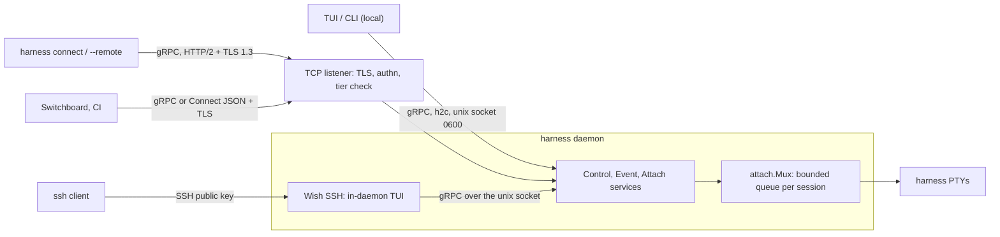
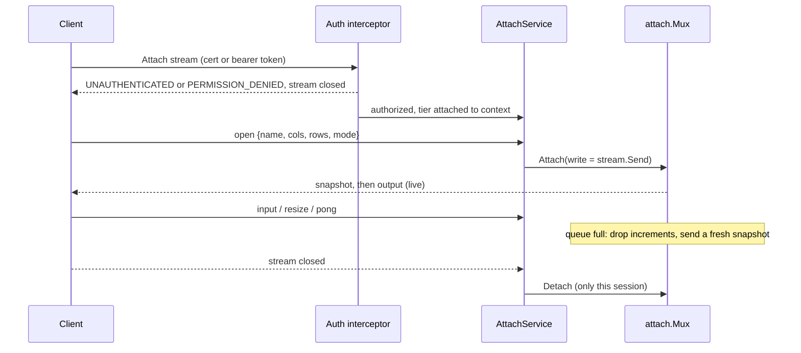

# ADR-0034: A gRPC control plane over the Unix socket and an opt-in TLS listener

## Context and Problem Statement

Today every client reaches the daemon through one Unix socket
(`$XDG_RUNTIME_DIR/harness.sock`, mode `0600`) speaking a custom framed protocol
(SPEC-0002): `uint32` big-endian length, a one-byte type, and a payload. There are
11 frame types; control payloads are JSON, attach payloads are raw bytes behind a
4-byte session id, and the protocol version is a hand-maintained
`ProtoMajor`/`ProtoMinor` pair whose history lives in a comment block. The only
network doors are the Wish SSH server (`[server] listen`), which hosts the TUI
inside the daemon, and the Prometheus listener (`[server] metrics_listen`).

Harness is converging with Switchboard and is expected to run as a persistent
service on production servers. That brings callers the socket cannot serve: a
laptop CLI driving a server's daemon, Switchboard or CI calling `trigger`, and
scripts that want structured answers without screen-scraping an SSH TUI. The
custom framing has no off-box story: no TLS, no authentication beyond file
permissions, no codegen for another language, and no tooling (`grpcurl`, load
balancers, health checks) that understands it.

Which wire protocol should the control plane speak, how is it exposed off-box
without turning "can reach the port" into "can run code as the agents", and what
of ADR-0004 survives?

## Decision Drivers

* **Local stays zero-config.** The Unix socket and its `0600` permission remain
  the default and the common path. Network exposure is an explicit operator
  choice, off by default.
* **Attach is code execution** (ADR-0008). Anyone who can write to an attach
  stream drives an agent CLI that often runs with permission prompts off. Every
  network path to attach must be authenticated, encrypted and authorized.
* **Backpressure semantics survive intact** (ADR-0007, SPEC-0002 "Backpressure
  Isolation"): the PTY reader never blocks on a client, each attach session has a
  bounded queue, a slow client is coalesced to a fresh snapshot, and a wedged
  client is reaped without evicting healthy ones (#183).
* **Standard tooling.** A schema other languages can generate clients from, a
  compatibility checker instead of a comment log, and interoperability with
  `grpcurl`, gRPC health checks and reverse proxies.
* **Small dependency and operational surface.** One Go binary (ADR-0001), no
  sidecar, no second TLS stack to configure.
* **No big-bang cutover.** An upgraded daemon must still serve the previous
  release's clients for one release, and an upgraded client must still reach an
  older daemon.

## Considered Options

### Decision 1 — Control-plane protocol

* Option 1 — Keep the custom framing and add a TCP listener
* Option 2 — gRPC everywhere with grpc-go
* Option 3 — gRPC only for the network listener, framing on the Unix socket
* Option 4 — ConnectRPC (connect-go) everywhere, serving the gRPC protocol

### Decision 2 — Protobuf code generation

* Option 1 — `buf` with locally pinned plugins
* Option 2 — `protoc` driven by `go generate`

### Decision 3 — HTTP surfaces (control, metrics, webhooks)

* Option 1 — Separate listeners, each a plain `net/http` server
* Option 2 — One port for everything, split by `cmux`
* Option 3 — One port for everything, one `net/http` mux

## Decision Outcome

Decision 1: chosen option: **Option 4 — ConnectRPC (connect-go) everywhere,
serving the gRPC protocol**, because it gives the owner's requirement, a gRPC
service, at the wire level, while building on `net/http` instead of a second
HTTP/2 stack. A connect-go handler answers the gRPC, gRPC-Web and Connect
protocols on the same path, so any gRPC client (`grpcurl`, grpc-go, Python
`grpcio`) can call it, and a unary call is also reachable as a plain HTTP POST
with a JSON body, which suits Switchboard, CI and shell scripts. Harness's own
CLI and TUI always use the gRPC protocol (`connect.WithGRPC()`), so the wire the
project tests on every run is gRPC. Option 2 would have worked. It was not chosen
because grpc-go brings its own HTTP/2 transport and a larger dependency tree, and
it cannot share `net/http` TLS configuration, middleware or test helpers with the
metrics and webhook listeners.

Decision 2: chosen option: **Option 1 — `buf` with locally pinned plugins**,
because `buf lint` and `buf breaking` replace the hand-kept `ProtoMinor` log with
a machine check, and the plugins it runs (`protoc-gen-go`,
`protoc-gen-connect-go`) are pinned as `tool` directives in `go.mod`, so code
generation needs no network, no Buf Schema Registry account and no `protoc`
install.

Decision 3: chosen option: **Option 1 — Separate listeners, each a plain
`net/http` server**, because the three surfaces want opposite exposure: metrics
stay on loopback for a scraper, webhooks are published to forges on the internet,
and the control plane reaches a small set of authenticated operators. ADR-0021
already rejected sharing the metrics and webhook listeners for this reason.
Because a Connect service is an `http.Handler`, merging surfaces later is a mux
change, not a transport change, and `cmux` is never needed.

### Shape



### Services

One protobuf package, `harness.v1`, under `proto/harness/v1/`. Generated Go code
is committed under `internal/gen/`, so `go install` and `go build` never run
codegen. Three services replace the 11 frame types:

```protobuf
syntax = "proto3";
package harness.v1;

// Unary verbs that mirror the CLI and TUI 1:1 (ADR-0002): List, Describe, Start,
// Stop, Restart, Enable, Disable, Remove, Logs, Profiles, UseProfile, Reload,
// DaemonInfo, ProjectUp, ProjectDown, ScratchRun, Jobs, Trigger, Runs.
service ControlService {
  rpc List(ListRequest) returns (ListResponse);
  rpc Start(StartRequest) returns (StartResponse);
  rpc Trigger(TriggerRequest) returns (TriggerResponse);
  // ... one rpc per verb above
}

service EventService {
  rpc Subscribe(SubscribeRequest) returns (stream Event);
}

service AttachService {
  rpc Attach(stream AttachClientMsg) returns (stream AttachServerMsg);
}

message AttachClientMsg {
  oneof msg {
    AttachOpen open = 1;  // first message, exactly once: name, cols, rows, mode
    bytes input = 2;      // keystrokes; discarded for a read-only session
    Resize resize = 3;    // smallest attached client wins (ADR-0003)
    Pong pong = 4;
  }
}

message AttachServerMsg {
  oneof msg {
    bytes snapshot = 1;   // full repaint: first, and after every coalesce
    bytes output = 2;     // scrollback tail, then live PTY bytes
    Ping ping = 3;
  }
}
```

* **One attach is one bidirectional stream.** The HTTP/2 stream is the session:
  the `session_id` prefix, `ATTACH_OPEN` and `ATTACH_CLOSE` disappear. Closing or
  cancelling the stream detaches exactly that session; the harness and other
  sessions are untouched.
* **Events are a server stream.** Each subscriber keeps today's bounded queue of
  128. Overflow still drops for that subscriber only, but the next event it
  receives carries `gap = true`, so the client re-lists instead of silently
  missing a transition.
* **Errors are status codes with a detail.** Each SPEC-0002 error code maps to a
  Connect code (`unknown_harness` to `NOT_FOUND`, `bad_request` to
  `INVALID_ARGUMENT`, and so on) and travels as a `harness.v1.ErrorDetail` with
  the machine code, so the TUI and CLI still surface a stable code and a human
  message. `unknown_op` becomes `UNIMPLEMENTED`.
* **Versioning is the package plus `buf breaking`.** `harness.v1` is the major
  version. Additive changes are ordinary protobuf field and method additions, and
  CI runs `buf breaking --against '.git#branch=main'` so a wire break cannot merge
  unnoticed. Client and daemon build versions ride the `harness-client-version`
  and `harness-daemon-version` headers and are returned by `DaemonInfo`. A client
  calling a method an older daemon lacks gets `UNIMPLEMENTED` and says the daemon
  is too old.

### Backpressure is unchanged, and the head-of-line block goes away

The seam already exists: `attach.Mux.Attach` takes a `write func([]byte) error`,
and each session's pump goroutine drains its bounded queue (`queueCap` = 256)
through it. The gRPC handler passes a `write` that calls `stream.Send`. The queue
and the coalesce logic in `internal/attach` stay as they are; the one edit is
tagging each queued chunk as `snapshot` or `output`, which the mux already knows
when it enqueues:

* The PTY reader writes to the emulator, the ring and the durable log, then fans
  out with non-blocking sends. It never touches a network stream.
* A session whose queue overflows is coalesced to a fresh snapshot, exactly as
  `TestBackpressureCoalesce` pins today.
* **Liveness stays at the application layer.** HTTP/2 PING frames are answered
  by the peer's transport goroutine even when its application has stopped
  reading, so they cannot detect the wedged client of #183. The attach stream
  carries its own `Ping`/`Pong`, and the reaper keeps its current rules, now per
  stream rather than per connection: any inbound message counts as alive, only
  a client that has answered at least one ping is eligible for eviction, and
  eviction cancels that stream, whose detach recomputes smallest-attached-wins
  for the survivors. HTTP/2 keepalive (`HTTP2Config.SendPingTimeout`)
  is also enabled, to drop dead TCP peers.
* **One wedged session no longer blocks a connection.** Today every session on a
  connection shares one write mutex, which is how a stuck attach once blocked the
  heartbeat that should have reaped it (#183). With HTTP/2, each stream has its
  own flow-control window: a stalled `Send` blocks only that session's pump
  goroutine.

The attach path end to end:



### The Unix socket

The socket path, its `0600` mode and the socket-lifecycle rules of SPEC-0002
("Socket Lifecycle") are unchanged. The daemon serves gRPC on it over HTTP/2
without TLS (`http.Protocols.SetUnencryptedHTTP2`). As defence in depth it also
checks the peer's uid (`SO_PEERCRED` on Linux, `LOCAL_PEERCRED` on macOS) and closes a
connection from any other user. A socket peer is the owning user, so it holds the
`attach` tier described below.

### The TCP listener: opt-in, TLS always, authenticated, tiered

```toml
[server]
env_file            = "~/.config/harness/server.env"  # token values (ADR-0038)
grpc_listen         = "0.0.0.0:7443"                  # absent = no TCP listener
grpc_tls_cert_file  = "/etc/harness/tls/server.crt"
grpc_tls_key_file   = "/etc/harness/tls/server.key"
grpc_client_ca_file = "/etc/harness/tls/clients-ca.crt"  # enables mTLS

[[server.grpc_client]]
name  = "switchboard"
token = "${HARNESS_SWITCHBOARD_TOKEN}"
role  = "control"

[[server.grpc_client]]
name     = "laptop"
cert_san = "spiffe://harness/laptop"  # must chain to grpc_client_ca_file
role     = "attach"
```

* **TLS always, TLS 1.3 only.** `grpc_listen` without a certificate and key is a
  load error, on loopback too: every local account can reach `127.0.0.1`, and the
  Unix socket is already the plaintext local path. There is no plaintext TCP mode.
* **Authentication.** A request is authenticated when it matches one
  `[[server.grpc_client]]` entry: by a client certificate that chains to
  `grpc_client_ca_file` *and* carries the entry's `cert_san`, by the entry's
  bearer token (compared in constant time), or by both when the entry sets both.
  A certificate that chains to the CA but matches no entry is refused, because a
  CA may issue certificates for other purposes. Tokens resolve from the
  `[server]` table's `env_file` through `${NAME}` references (ADR-0038); a
  literal token is a load error, and a token shorter than 32 bytes is refused.
  `grpc_listen` with no client entries is a load error, mirroring the SSH rule
  that an empty allowlist admits nobody.
* **Authorization tiers.** Each entry has one role, checked by an interceptor
  before any handler runs.


| Tier | Grants | Why the line is here |
|---|---|---|
| `read` | `List`, `Describe`, `Logs`, `Jobs`, `Runs`, `Profiles`, `DaemonInfo`, `Subscribe`, read-only `Attach` | Observes; injects nothing. Logs are masked (ADR-0008) but may still reveal what agents did |
| `control` | `read`, plus `Start`, `Stop`, `Restart`, `Enable`, `Disable`, `Reload`, `UseProfile`, and `Trigger` without an event | Acts only on harnesses the operator already defined in `harness.toml` |
| `attach` | `control`, plus read-write `Attach`, `Trigger` with an event, `ProjectUp`, `ProjectDown`, `Remove`, `ScratchRun` | Each one delivers input to an agent or defines the command a harness runs. Each is code execution |

`ProjectUp` and `ScratchRun` carry a command line, and an event envelope is read
by an agent that may have permission prompts off. That is why they sit in the
`attach` tier and not in `control`. A request above the caller's tier gets
`PERMISSION_DENIED` before the handler, the `attach.Mux`, or the supervisor sees
it.

* **Audit.** Every authenticated TCP request logs the client `name`, method and
  outcome to the daemon log. Token values are `core.Secret` and never reach the
  log, the store or telemetry.

### Remote clients: `harness connect` and `--remote`

A client names a remote in its own config, with the same `env_file` and `${NAME}`
rules:

```toml
[remote.prod]
address   = "prod.example.net:7443"
ca_file   = "~/.config/harness/tls/prod-ca.crt"
cert_file = "~/.config/harness/tls/laptop.crt"
key_file  = "~/.config/harness/tls/laptop.key"
env_file  = "~/.config/harness/remote-prod.env"
token     = "${HARNESS_PROD_TOKEN}"
```

`harness connect prod` (or `harness connect host:port` with `--ca`, `--cert`,
`--key` and `--token-file`) opens the TUI against that daemon. `harness --remote
prod <verb>`, or `HARNESS_REMOTE=prod`, runs any CLI verb there. A remote TUI
cannot use anything that reads or writes the client's own filesystem: editing
`harness.toml`, offering to start a daemon, and the transcript watcher behind the
chatroom and the dashboard's live action field. Those views are disabled on a
remote connection until the daemon serves them over an RPC.

### What survives of ADR-0004

This ADR supersedes ADR-0004's **control plane** only: the custom framed protocol
as the single wire contract, and its rejection of gRPC over TCP. The following
stay in force and are restated here so nothing depends on the superseded text:

* **Wish SSH is the remote UI.** `ssh harness.host` still lands in the same TUI,
  hosted inside the daemon, authenticated by SSH public keys with per-key
  read-only scoping, and never a shell. It remains the full-fidelity remote view,
  because that TUI runs on the server and can read its files. Its sessions
  become gRPC clients of the Unix socket, like any local client.
* **`wishlist`** as the multi-host SSH directory and **`promwish`** for
  SSH-session metrics remain the sketched fleet path.
* **The daemon owns every PTY and emulator**, and remote attach renders the same
  `x/vt` screen (ADR-0002, ADR-0003).

### Staging: one release side by side

1. **Release N.** The daemon sniffs the first byte of each socket connection: a
   legacy client's first frame is `HELLO`, whose length's high byte is `0x00`; an
   HTTP/2 client starts with the connection preface `PRI * HTTP/2.0`. The old handler
   serves the former and the gRPC server the latter, on the same socket path, so
   no client configuration changes. The CLI, TUI and in-daemon Wish TUI speak
   gRPC first. If the daemon closes the connection without an HTTP/2 SETTINGS
   frame, as a release N-1 daemon does when it reads the preface as an oversized
   frame length, the client retries once with the legacy framing. The TCP
   listener is gRPC-only from the start.
2. **Release N+1.** The sniffer, the legacy handler, the client fallback and the
   framing and codec code in `internal/protocol` are deleted. A release N-1
   client then gets a connection close with no HELLO. The release notes of
   release N announce this.

When this ADR is accepted, ADR-0004 moves to `superseded` and SPEC-0002 is
rewritten: "Message Framing" and "Handshake And Versioning" become the services
and versioning rules above, the "no TLS/TCP listeners" non-goal is removed, and
"Transport Bindings" gains the TCP listener. Neither is edited in this proposal.

### Consequences

* Good, because production servers get an authenticated, encrypted, tiered API
  without SSH-scraping, and Switchboard or CI can call `Trigger` with a scoped
  `control` token that cannot attach.
* Good, because the schema is the contract: clients in any language are
  generated, and `buf breaking` enforces compatibility the comment log only
  described.
* Good, because per-stream flow control removes the shared write mutex that let
  one wedged attach block a connection's heartbeat (#183).
* Good, because the TCP listener, metrics and webhooks share `net/http`, TLS
  helpers and test tooling.
* Bad, because attach, which was the protocol's hot path, now pays protobuf
  framing plus HTTP/2 framing per chunk. Terminal output is kilobytes per
  second, so this is expected to be noise, but it must be measured, not assumed.
* Bad, because the project now owns a certificate and token story: issuing
  client certificates, rotating tokens, and documenting both. SSH needed none of
  this.
* Bad, because a remote TUI is less capable than the local or Wish TUI until the
  file-backed views move behind RPCs.
* Bad, because one release carries two protocols, a byte sniffer and a client
  fallback, all of which must be tested and then removed.
* Neutral, because bidirectional streaming needs HTTP/2 end to end. That holds on
  the socket (h2c) and over TLS (ALPN `h2`), but an HTTP/1.1-only proxy in front
  of the TCP listener breaks attach while unary calls still work.

### Confirmation

Each item checks the property, not a proxy:

* **No plaintext off-box.** A test dials `grpc_listen` with plaintext HTTP/2
  (prior knowledge) and asserts that the connection fails the TLS handshake
  without any HTTP response bytes. `harness doctor` and the config tests reject
  `grpc_listen` without `grpc_tls_cert_file`/`grpc_tls_key_file`, with no
  `[[server.grpc_client]]`, or with a literal `token`.
* **Unauthenticated attach is rejected before the PTY.** An `Attach` over TLS
  with no certificate and no token gets `UNAUTHENTICATED`; the test asserts that
  `Mux.SessionCount()` stayed 0 and that no `snapshot` or `output` message was
  received. The same test with a `read` token and `mode = rw` gets
  `PERMISSION_DENIED`, and with `mode = ro` gets a snapshot.
* **Tiers.** A table test calls every `ControlService` method with a `read`,
  `control` and `attach` credential and asserts the grant matrix above, including
  `ProjectUp`, `ScratchRun` and `Trigger` with an event refused to `control`.
* **Backpressure ports over.** `TestBackpressureCoalesce`,
  `TestWedgedAttachSessionIsEvicted`, `TestEvictionRestoresSurvivingClientViewport`,
  `TestClientThatNeverPongedIsNotEvicted`, `TestHealthyClientIsNeverEvicted` and
  `TestWedgedClientReapedWhileOutputBacksUp` run against the gRPC transport (and,
  during release N, table-driven over both). They run on Linux under load, where
  the PTY output-loss and socket-buffer races reproduce. A new test opens two
  attach streams on one HTTP/2 connection, stops reading one, and asserts that the
  other keeps receiving live output.
* **Legacy window.** During release N, the release N-1 client package passes
  `TestHandshakeVersionMismatch` and `TestMixedTrafficOneConnection` against the
  new daemon, and a new client falls back against a release N-1 daemon. In release
  N+1, the shipped binary no longer carries the framing:
  `go tool nm harness | grep -c 'protocol.DecodeAttach'` is 0.
* **Schema discipline.** CI runs `buf lint`, `buf breaking --against
  '.git#branch=main'`, and `buf generate` followed by `git diff --exit-code`.
* **No secret in the log.** A request authenticated by token produces a log line
  naming the client, and a test asserts that the token's bytes appear in neither
  the daemon log nor `state.json`.

## Pros and Cons of the Options

### Decision 1 — Control-plane protocol

#### Option 1 — Keep the custom framing and add a TCP listener

Wrap the existing protocol in TLS on a TCP port and add a token to `HELLO`.

* Good, because it is the smallest change and nothing moves for local clients.
* Good, because the attach hot path keeps its minimal framing.
* Bad, because authentication, authorization, TLS and versioning are all ours to
  design, which is what ADR-0004 rejected option D for.
* Bad, because no other language, tool or proxy can speak it; Switchboard would
  need a hand-written client.
* Bad, because the connection-wide write mutex, and the head-of-line blocking
  of #183, come with it.

#### Option 2 — gRPC everywhere with grpc-go

* Good, because it is the reference gRPC implementation, with the widest
  middleware ecosystem and the best raw throughput.
* Good, because it gives the same wire contract, per-stream flow control and
  codegen as Option 4.
* Bad, because grpc-go runs its own HTTP/2 transport. Its `ServeHTTP` bridge is
  documented as experimental, so sharing a port or TLS configuration with
  `net/http` needs `cmux` or a second listener.
* Bad, because it adds a large dependency tree (`google.golang.org/grpc`,
  `genproto`) to a binary that otherwise needs little.
* Bad, because a plain HTTP/JSON call needs a gateway (grpc-gateway) with its own
  codegen and annotations.

#### Option 3 — gRPC only for the network listener, framing on the Unix socket

* Good, because local clients do not change, and only the new surface pays the
  migration.
* Bad, because the daemon then implements every verb twice, over two protocols
  that must stay equivalent, with no end date.
* Bad, because the local path keeps the shared write mutex and the hand-kept
  version log.
* Bad, because the in-daemon Wish TUI and the local TUI would speak a protocol the
  remote CLI does not, so a bug can show on one path and not the other.

#### Option 4 — ConnectRPC (connect-go) everywhere, serving the gRPC protocol

* Good, because the same handler serves gRPC, gRPC-Web and Connect, so gRPC
  clients and a plain `curl -H 'Content-Type: application/json'` POST reach the
  same method, with the same auth interceptor.
* Good, because handlers are `http.Handler`s on `net/http`: standard
  `tls.Config` for mTLS, the Go 1.24+ HTTP/2 configuration for keepalive and h2c,
  `httptest` for tests.
* Good, because it has a small dependency footprint (`connectrpc.com/connect`,
  plus `grpchealth` and `grpcreflect`) and a stable v1 API, and it is a CNCF
  project.
* Neutral, because a Connect client can speak gRPC too, so choosing Connect does
  not lock any caller out of the gRPC ecosystem.
* Bad, because its interceptor API differs from grpc-go's, so grpc-go middleware
  cannot be reused.
* Bad, because it has lower peak throughput than grpc-go. This does not matter at
  terminal data rates, but it is a real ceiling.
* Bad, because the Connect protocol's JSON form of unary calls is a second
  encoding to test. The JSON mapping is the protobuf canonical one, and
  `buf breaking` checks it with the `WIRE_JSON` category.

### Decision 2 — Protobuf code generation

#### Option 1 — `buf` with locally pinned plugins

* Good, because `buf lint` and `buf breaking` are the compatibility gate the
  version handshake needs.
* Good, because `buf.gen.yaml` with `local:` plugins runs `protoc-gen-go` and
  `protoc-gen-connect-go` from `go tool`, with versions pinned in `go.mod` and
  no network access.
* Bad, because it adds one more tool (`buf`, also run through `go tool`) to the
  `make lint` toolchain.

#### Option 2 — `protoc` driven by `go generate`

* Good, because it is the lowest common denominator, and every protobuf user
  knows it.
* Bad, because `protoc` is a C++ binary that `go install` cannot provide, so it
  is one more system dependency for contributors and CI runners.
* Bad, because it has no breaking-change detection, so the project would keep
  maintaining a compatibility log by hand.

### Decision 3 — HTTP surfaces (control, metrics, webhooks)

#### Option 1 — Separate listeners, each a plain `net/http` server

* Good, because each surface keeps the bind address, TLS and authentication its
  exposure needs, and turning one on never widens another.
* Good, because it matches ADR-0020 and ADR-0021 as they stand.
* Bad, because a fully exposed server has up to four ports to firewall and
  document: SSH, control, metrics and webhooks.

#### Option 2 — One port for everything, split by `cmux`

* Good, because it gives one port and one certificate.
* Bad, because `cmux` sniffs protocols on a raw listener and fights HTTP/2 and
  TLS. Its own documentation warns about both, and it is unnecessary once the
  control plane is an `http.Handler`.
* Bad, because the port that forges must reach from the internet would also
  expose attach.

#### Option 3 — One port for everything, one `net/http` mux

* Good, because it gives one port, one certificate and one server, with no
  sniffing.
* Bad, because it has the same exposure coupling as Option 2: the webhook
  receiver's reachability decides the control plane's.
* Neutral, because Option 1 keeps this reachable later as a configuration
  change, if an operator ever wants metrics behind the control plane's TLS.

## More Information

* **Supersedes ADR-0004** — for the control plane only. Wish SSH as the remote UI,
  SSH key authentication with per-key read-only scoping, the persistent host key,
  `wishlist` and `promwish` carry forward unchanged, as listed under "What
  survives of ADR-0004".
* **Extends ADR-0002** — clients remain thin views of daemon-owned state; the
  control verbs still mirror the CLI and TUI 1:1.
* **Extends ADR-0008** — attach equals terminal access equals code execution; the
  tier table is the per-credential scoping ADR-0008 deferred.
* **Governs SPEC-0002** — rewritten on acceptance, as described under "Staging".
* **Related ADR-0003, ADR-0007** — smallest-attached-wins resize and
  coalesce-to-snapshot backpressure, preserved as is.
* **Related ADR-0020, ADR-0021** — the metrics and webhook listeners stay
  separate `net/http` servers.
* **Related ADR-0038** — `[server] env_file` and `${NAME}` references supply the
  bearer tokens on both the daemon and the client side.
* Source: the transport-agnostic attach seam is `Mux.Attach` in
  [`internal/attach/mux.go`](https://github.com/stump-wtf/harness/blob/main/internal/attach/mux.go);
  the reaper and the #183 write-mutex analysis are in
  [`internal/daemon/conn.go`](https://github.com/stump-wtf/harness/blob/main/internal/daemon/conn.go).
* **No first-contact pinning.** `DaemonInfo` does not advertise the listener's
  certificate fingerprint: a fingerprint learned over the connection it is meant
  to authenticate proves nothing. The client trusts the server through `ca_file`
  or the system roots, and nothing else.
* **Deferred:** a per-harness allowlist on `[[server.grpc_client]]` (for
  example, `harnesses = ["reduit/*"]`). A credential is scoped by tier only;
  per-harness scoping is a later, additive field.
