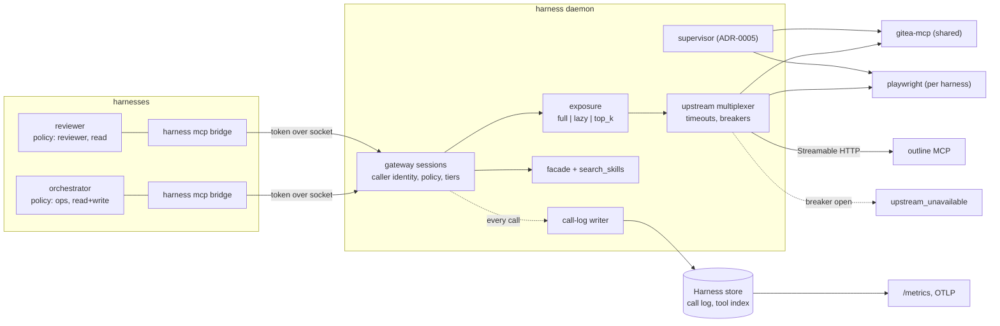

# ADR-0035: Harness as the MCP gateway — shared upstream servers, per-harness filtered endpoints, and a call log

> **Not yet implemented.** Design stage. No MCP server, broker or Go MCP SDK
> dependency exists in the tree today; `[mcp.*]` tables are a config parse
> error. Supersedes ADR-0010.

## Context and Problem Statement

Every agent CLI Harness supervises starts its own copy of every stdio MCP server
in its configuration. Twelve harnesses with eight servers each is ninety-six
server processes, most of them Node or Python runtimes, serving twelve
consumers. Each copy is configured in each client's own file format (Claude
Code's `mcp.json`, Crush's `crush.json`, Codex's `config.toml`), and each copy
needs its credentials in the agent's environment, where a prompt-injected agent
can print them.

Three further costs have no owner today:

* **Context.** Every connected server's full tool list, with every description
  and JSON schema, is loaded into every session. A fleet with a Gitea, an
  Outline and a browser server spends thousands of tokens per turn on tools the
  task never touches.
* **Visibility.** MCP calls appear only inside each agent's transcript, in each
  tool's own format. Harness's observer (`internal/observe`) sees them through
  agent-trace after the fact, classified but without latency, upstream, or
  outcome as the server reported it. No record joins "which tool, from which
  harness, under which model and config, how long, did it work".
* **Control.** Which tools a harness may call is decided by each agent CLI's
  permission flags, per client, per harness. There is no single place that says
  "the reviewer may read the forge and may not merge".

ADR-0010 proposed a daemon-side broker that fans upstream servers into every
harness, plus a control-plane facade. It left open tool filtering, context
cost, call recording, session sharing, credential handling and the SDK. The
owner has since decided that the gateway is where MCP traffic is filtered,
logged and shared, and that the call log feeds distillation and evals.

**How does Harness run each upstream MCP server once, give each harness exactly
the tools it should have at the lowest context cost, and record every call,
without breaking servers that cannot be shared and without the daemon learning
what an agent is?**

## Decision Drivers

* **N×M processes become M.** One supervised process per upstream server, not
  one per harness per server.
* **Least privilege per harness.** Which servers and tools a harness sees, and
  whether it may call write tools, is operator policy stated once.
* **Context is the scarce resource.** A harness should pay context only for
  tools it is likely to use. The tool list must also stay stable within a
  session, because a changing tool list invalidates the agent's prompt cache.
* **Every call is evidence.** Distillation (ADR-0030), skill evals (ADR-0036) and metrics (ADR-0020) all need one authoritative, attributed call
  record.
* **Credentials stay out of the agent.** An upstream's token should reach the
  upstream, not the agent process that calls it.
* **Failure is isolated.** One upstream crashing, hanging or rate-limiting must
  not take down the endpoint or the other upstreams.
* **Not every server can be shared.** Browser automation, shells, REPLs and
  servers rooted at the caller's working directory hold per-client state.
* **The daemon stays agnostic and model-free.** The gateway proxies a protocol;
  it does not interpret agents, and it makes no model request (ADR-0012's
  fence).
* **Speak every protocol revision in use.** Agent CLIs and upstream servers
  negotiate different MCP revisions (2024-11-05 through 2026-07-28). The
  gateway sits between both.

## Considered Options

* **Option 1 — Status quo: each agent runs its own servers.** Harness writes or
  leaves each client's MCP config; each harness launches its own upstream
  copies.
* **Option 2 — Harness is the MCP gateway.** The daemon supervises each upstream
  once, gives each harness one filtered endpoint, and logs every call to the
  store.
* **Option 3 — An external MCP gateway product.** Run a third-party gateway
  (Docker MCP Gateway, IBM ContextForge, agentgateway, LiteLLM's MCP gateway)
  beside Harness and point every harness at it.

## Decision Outcome

Chosen option: **Option 2 — Harness is the MCP gateway**, because the daemon
already supervises processes, already knows which harness a process belongs to
(SPEC-0005 caller identity), and already owns the store the call log belongs in.
An external gateway would have to be taught all three, and would still record
calls in a place that does not join to Harness runs.

### What survives from ADR-0010

* **The control-plane facade.** `harness_list`, `harness_describe`,
  `harness_logs` (read) and `harness_start`, `harness_stop`, `harness_restart`
  (write) delegate to the same handlers the CLI uses (ADR-0002), plus the
  read-only trajectory tools in `internal/facade`. They occupy the reserved
  `harness` namespace, which no upstream key may shadow.
* **`mcp_allow` read/write tiers**, global-only, default `["read"]`, evaluated
  per call against the attributed harness. They now apply to upstream tools as
  well as facade tools (see Tool tiers).
* **Caller identity and endpoint wiring** exactly as SPEC-0005 specifies: a
  per-spawn `HARNESS_MCP_TOKEN`, the `harness mcp` stdio bridge, additive wiring
  by the adapter, and an unattributed caller scoped as read-only.
* **Side-loaded prompts**, demoted to one gateway setting,
  `[mcp] prompt_paths`, instead of a reserved `[mcp.prompts]` server key.

ADR-0010's accepted risk stands unchanged: a harness granted `write` can drive
its siblings with no human watching.

### Declaring upstreams

```toml
# ~/.config/harness/harness.toml (or a harness_d drop-in)
[mcp]
call_log_args = "redacted"   # redacted | hash | none
call_log_days = 30
prompt_paths  = ["~/.config/harness/prompts"]
listen        = ""           # optional loopback Streamable HTTP endpoint; off by default

[mcp.gitea]                  # stdio upstream: supervised child process
argv       = ["gitea-mcp", "--transport", "stdio"]
env_file   = "~/.config/harness/env/gitea.env"
env        = { GITEA_ACCESS_TOKEN = "${GITEA_TOKEN}" }
timeout    = "30s"
read_tools = ["get_*", "list_*", "search_*"]

[mcp.outline]                # Streamable HTTP upstream: one client session
url     = "https://outline.example.com/mcp"
headers = { Authorization = "Bearer ${OUTLINE_TOKEN}" }
env_file = "~/.config/harness/env/outline.env"

[mcp.playwright]             # per-client browser state: never shared
argv   = ["npx", "@playwright/mcp"]
shared = false
```

* Exactly one of `argv` (stdio) or `url` (Streamable HTTP) per table. `argv`
  follows the ADR-0023 command kind's shape, not the removed `cmd` key.
* Stdio upstreams are supervised under the ADR-0005 restart policy, with
  `restart_delay` and flapping detection, as a process class with no PTY. The
  daemon terminates every upstream it started on shutdown.
* HTTP upstreams hold one client session each and reconnect with the backoff
  the channel listener already uses (`internal/trigger/channel`).
* Upstream tables are accepted in the global file and `harness_d` drop-ins.
  A project file may declare `[mcp.*]` upstreams. They are visible only to that
  project's harnesses and are never shared with another project, whatever
  `shared` says.
* A server that relies on custom notifications, such as a
  `notifications/claude/channel` doorbell source, is not proxied. Channel
  sources stay daemon trigger sources (ADR-0021) or direct agent wiring
  (ADR-0029).

### One endpoint per harness

Each agent harness reaches the gateway through the `harness mcp` stdio bridge,
which its adapter wires in at spawn (for Claude Code, a Harness-owned
`mcp.json` passed with `--mcp-config`). The bridge presents
`HARNESS_MCP_TOKEN` and relays JSON-RPC messages to the daemon over the control
socket, as a bidirectional stream once the gRPC control plane (ADR-0034)
lands. The optional `[mcp] listen` loopback endpoint serves the same
sessions over Streamable HTTP, with the token as a bearer header, for clients
that only accept a URL.

Wiring is additive by default, so a harness's own MCP servers still load.
`mcp_exclusive = true` on a harness makes the gateway its only MCP source (for
Claude Code, adding `--strict-mcp-config`); `harness init` personas (ADR-0024)
set it, so a persona sees exactly its policy.

### Exposure policy

Which upstreams and tools a harness sees is a named policy, so twenty harnesses
with the same role share one statement:

```toml
[mcp_policy.reviewer]
servers  = ["gitea", "qmd"]          # upstreams this policy exposes
tools    = ["gitea__*", "qmd__*"]    # optional allowlist globs, after namespacing
deny     = ["gitea__merge_*", "gitea__delete_*"]
exposure = "lazy"                    # full | lazy | top_k
top_k    = 8

[harness.reviewer]
harness    = "claude-code"
mcp_policy = "reviewer"
mcp_allow  = ["read"]
```

* A harness with no `mcp_policy` gets `[mcp] default_policy` if set, otherwise
  no upstreams: the facade's read tools and `search_skills` only.
* `deny` beats `tools`, and `tools` narrows `servers`. The effective tool set is
  computed at session start and on reload, and changes only by
  `notifications/tools/list_changed`.
* `mcp_policy` and `mcp_allow` on a harness, and every `[mcp_policy.*]` table,
  are global-only, joining ADR-0009's global-only list: a cloned repository must
  not widen its own harness's reach.
* Tool names are namespaced by upstream key (`gitea__create_issue`); SPEC-0005
  fixes the separator.

**Tool tiers.** Each upstream tool is read or write. The upstream's
`readOnlyHint` annotation decides by default; `read_tools` and `write_tools`
globs on the upstream table override it; a tool with neither is **write**
(fail closed). A write tool is refused to a harness whose `mcp_allow` lacks
`write`, with the same `not_permitted` error the facade returns.

### Context: lazy discovery and trimming

`exposure` sets how a policy's tools reach the agent's context:

| Mode | The agent sees | Fits |
|---|---|---|
| `full` | Every allowed tool with its schema; descriptions trimmed to `max_description_chars` (default 300) | small tool sets, clients with their own deferred tool loading |
| `lazy` | Two tools, `search_tools(query, k)` and `call_tool(name, arguments)`, plus the facade tools | large tool sets, clients that load every schema eagerly |
| `top_k` | The `top_k` tools this harness called most in the last 30 days (from the call log), plus `search_tools` / `call_tool` for the rest | stable roles with a known working set |

* `search_tools` runs over an FTS5 index of every allowed tool's name,
  description and parameter names in the store, and returns names, one-line
  descriptions and full schemas for the matches. It never returns a tool the
  policy excludes.
* `call_tool` enforces exactly the same policy, tier and timeout checks as a
  directly exposed tool, and records the real tool name in the call log.
* Trimming never alters an input schema. The untrimmed description is returned
  by `search_tools`.
* The adapter (ADR-0039) declares a default mode per client. A client
  that already defers MCP schemas behind its own search can take `full`.
* `harness_mcp_tool_schema_bytes{harness}` measures what each session pays, so
  the choice of mode is checked against numbers.

### The call log

Every call through the gateway, facade tools included, becomes one row in the
Harness store (ADR-0037: one SQLite database owned by the daemon),
written asynchronously from a bounded queue so a slow disk never blocks a call:

| Field | Source |
|---|---|
| `ts`, `latency_ms` | gateway clock, request to response |
| `harness`, `run_id` | the token's owner and its current run |
| `adapter`, `model` | the harness's adapter; the pinned or configured model (ADR-0026) |
| `config_hash` | hash of the harness's effective configuration at spawn, as recorded on its run |
| `upstream`, `tool`, `tier` | resolved after namespacing; `call_tool` records the real tool |
| `args_hash` | SHA-256 of the canonical JSON arguments |
| `args` | per `call_log_args`: redacted by `internal/redact` and capped at 4 KiB, or absent |
| `outcome` | `ok`, `tool_error`, `upstream_error`, `timeout`, `denied`, `circuit_open`, `cancelled` |
| `response_bytes`, `response_tokens_est` | response size, and an estimate at 4 bytes per token (the daemon has no tokenizer; exact counts come from the agent's own usage records) |
| `trace_id`, `span_id` | the run's trace (ADR-0033), so a call appears as a span in the run |

Response bodies are never stored. Rows older than `call_log_days` are deleted.
The call log is local: nothing leaves the host except through ADR-0022's export
gates (`export_telemetry` or `export_all`), where each call becomes a log record
and a span.

Consumers:

* **Distillation** (ADR-0030) reads which tools a session used, which failed,
  and which skill a session retrieved, from rows rather than transcript parsing.
* **Skill evals and efficacy** (ADR-0036) join `search_skills` and
  `get_skill` rows to run outcomes.
* **`top_k` exposure** ranks by it.
* **Metrics** (ADR-0020), on the existing `/metrics` listener:

```text
harness_mcp_calls_total{harness,upstream,tool,outcome}      counter
harness_mcp_call_duration_seconds{upstream,tool}            histogram
harness_mcp_response_bytes{upstream,tool}                   histogram
harness_mcp_upstream_up{upstream}                           gauge
harness_mcp_upstream_restarts_total{upstream}               counter
harness_mcp_circuit_open{upstream}                          gauge
harness_mcp_tool_schema_bytes{harness}                      gauge
harness_mcp_call_log_dropped_total                          counter
```

`tool` values are capped per upstream (default 100), with overflow collapsed
into `tool="__other__"`, following SPEC-0013's cardinality rule for harness
names.

`search_skills` and `get_skill` (ADR-0030, ADR-0036) are gateway tools
in the reserved namespace, so every retrieval is a call-log row, which is what
ADR-0030's retrieval counts and retirement need.

### Credentials

Upstream credentials use the unified secret references (ADR-0038):
`${NAME}` in `env` and `headers`, resolved from the upstream's `env_file`. A
stdio upstream receives them in its own environment at spawn; an HTTP upstream's
headers are held in daemon memory, as `[channel.*]` headers already are. None of
them is placed in any agent's environment, written to the store, or included in
a call-log row.

This is the gateway's largest security gain: a harness that calls `gitea__*`
through the gateway no longer needs `GITEA_TOKEN` in its own `env_file`, so a
prompt-injected agent can misuse the tools its policy allows but cannot
exfiltrate the credential. The daemon still holds no model credential; an
upstream server that calls a model does so from its own process.

### Failure isolation

* Each upstream has its own client session, goroutines and bounded queue. A
  hung upstream exhausts only its own `max_concurrency` (default 8).
* **Timeouts.** Every call carries a deadline, `timeout` per upstream (default
  60 s), and the caller's cancellation is propagated to the upstream as
  `notifications/cancelled`.
* **Circuit breaking.** After `breaker_failures` consecutive transport errors or
  timeouts (default 5), the upstream's breaker opens for `breaker_cooldown`
  (default 30 s). Calls fail fast with `circuit_open`, then one probe call
  decides whether to close it. Tool errors reported by the upstream (`isError`)
  are successful transport and never trip the breaker.
* **Stable tool lists.** A down upstream's tools stay listed and return a
  structured `upstream_unavailable` error, so an outage does not churn every
  session's tool list and prompt cache. Tools are withdrawn only when the
  upstream's own `tools/list` changes after it recovers.
* A crash of one upstream never terminates the daemon, a harness, or another
  upstream, and never invalidates an endpoint.

### Session semantics

Each harness has its own downstream MCP session with the gateway. The gateway
multiplexes those sessions onto one upstream client session per shared upstream:

* **Requests** are re-identified per upstream session, and responses routed back
  by that mapping.
* **Progress** notifications are routed by progress token, **cancellation** by
  the request it cancels.
* **Server-to-client requests** made during a call (elicitation) are routed to
  the downstream session whose call is in flight. One made outside any call has
  no owner and is refused. Sampling and roots are deprecated in the 2026-07-28
  revision and are not forwarded.
* **List-changed** notifications are re-filtered per policy and forwarded only
  to sessions whose effective tool set changed.
* **Resource subscriptions** are reference-counted per resource: one upstream
  subscription, fanned out to every subscribed session.

This is correct only for servers whose behavior does not depend on who is
calling. A server that keeps state per client must not be shared: a browser
automation server (one browser, one page), a shell or REPL server, a server
holding a "current project" or login per connection, or a stdio server that
roots itself at its working directory. For those, `shared = false` gives each
harness process its own supervised instance, started on the harness's first
call (in the harness's workdir) and stopped when the harness exits. Such an
instance is still filtered, logged and credential-isolated. The operator must
set `shared = false`; the gateway cannot detect per-client state, and the
default is `true` because most tool servers (forges, wikis, search) are
stateless per call. `harness doctor` lists every shared upstream so the choice
is visible.

### The Go MCP SDK: the official `modelcontextprotocol/go-sdk`

The gateway is built on
[`github.com/modelcontextprotocol/go-sdk`](https://github.com/modelcontextprotocol/go-sdk)
(v1.8.0, released 2026-09-14), not
[`github.com/mark3labs/mcp-go`](https://github.com/mark3labs/mcp-go)
(v1.1.1, released 2026-09-23):

* **Both halves in one package.** A gateway is a server downstream
  (`mcp.Server`, `StdioTransport`, `StreamableHTTPHandler`) and a client
  upstream (`mcp.Client`, `CommandTransport`, `StreamableClientTransport`).
  Both SDKs have both; the official one lives in the protocol's own
  organization, runs the protocol's conformance tests, and is working toward
  the protocol's Tier 1 SDK rating.
* **Protocol range.** v1.7.0 and later negotiate 2026-07-28 back to 2024-11-05
  on each session independently, and v1.8.0 lets a server restrict what it
  advertises (`ServerOptions.SupportedProtocolVersions`). The gateway must talk
  to an old upstream and a new client at once.
* **Hardening the gateway needs.** v1.8.0 bounds every decode path (JSON
  nesting, SSE event size, stdio line length) and fixes session leaks and
  teardown deadlocks found under load. The gateway is the one process every
  agent's MCP traffic passes through.
* **Shared behavior with the fleet.** Crush is built on the same module, so the
  most-used client and the gateway fail the same way and upgrade together.
* **Stability.** The official SDK has been v1 since 2025-09-30, with behavior
  changes gated behind `MCPGODEBUG` flags for a release before removal. mcp-go reached v1.0.0 on 2026-09-02; its generic
  notification hook is a real advantage, but a three-week-old v1 is the larger
  upgrade risk for the fleet's single chokepoint.

The official SDK's known hostility to custom notifications (it rejects unknown
methods before any handler runs, and it opens the standalone SSE stream only
through a type assertion on its own connection type) is why the channel
listener was written by hand. That listener stays hand-written: the gateway
does not proxy custom notifications, so it does not hit the problem, and
migrating the listener gains nothing.

### Consequences

* Good, because N harnesses × M servers becomes M supervised upstreams plus N
  small bridge processes, and M config sites become one.
* Good, because upstream credentials leave agent environments.
* Good, because each harness's tool reach is one named policy, enforced in one
  place, per call, with a structured refusal.
* Good, because lazy and `top_k` exposure cut per-session context by the size of
  the tool schemas a harness never uses, and the saving is measured.
* Good, because every MCP call is one attributed row that distillation, evals,
  metrics and telemetry share, instead of four parsers over transcripts.
* Good, because a crashed or hung upstream degrades only its own tools.
* Bad, because the gateway is a chokepoint: a daemon crash takes every harness's
  MCP tools with it, where per-harness servers failed independently.
* Bad, because in `lazy` mode the agent CLI's own permission system sees one
  `call_tool`, so per-tool approval in the client collapses into the gateway's
  policy. The gateway becomes the only per-tool gate for those harnesses.
* Bad, because `shared = false` is a judgment the operator must make per server.
  A stateful server left shared leaks state between harnesses, and the gateway
  cannot detect it.
* Bad, because the call log stores redacted arguments by default. Redaction is
  pattern-based, and a secret it misses sits in the store for
  `call_log_days`. `call_log_args = "hash"` trades that risk for weaker
  distillation evidence.
* Bad, because the daemon now holds HTTP upstream credentials in memory, widening
  what a daemon memory disclosure exposes (model credentials remain excluded).
* Bad, because a Go MCP SDK becomes a direct dependency, and its upgrades are
  now Harness releases.
* Neutral, because clients that cannot be wired to the bridge keep their own
  servers, as SPEC-0005's `harness doctor` report already allows.

### Confirmation

SPEC-0005 is revised on acceptance to govern the gateway. The acceptance tests
that matter:

* With `[mcp.gitea]` declared and six harnesses running, exactly one
  `gitea-mcp` process exists (checked by process listing, not by config).
* A harness whose policy excludes `gitea` gets no `gitea__*` tool from
  `tools/list` or `search_tools`, and `call_tool` on one is refused as
  `not_permitted`.
* A tool without `readOnlyHint` and not matched by `read_tools` is refused to a
  harness with `mcp_allow = ["read"]`.
* Killing an upstream mid-call returns `upstream_error` to that caller, leaves
  other upstreams' calls unaffected, restarts the upstream under its policy, and
  keeps its tools listed.
* Five consecutive timeouts open the breaker; the sixth call returns
  `circuit_open` without reaching the upstream.
* Two harnesses calling a `shared = false` upstream produce two processes, each
  with its harness's workdir.
* Each call produces one call-log row whose `harness` is the token's owner, not
  a claimed `HARNESS_NAME`; a secret placed in arguments is absent from the row
  under the default mode.
* No agent process spawned with gateway wiring carries an upstream's resolved
  credential in its environment (read from the process, not the config).
* In `lazy` mode, the tool list a session receives is the facade tools plus
  `search_tools` and `call_tool`, and `harness_mcp_tool_schema_bytes` for that
  harness is below the `full` mode value for the same policy.
* The gateway negotiates 2024-11-05 with an old upstream while serving a
  2026-07-28 client in the same test.

## Pros and Cons of the Options

### Option 1 — Status quo: each agent runs its own servers

* Good, because it needs no Harness code, and each client's MCP features work
  exactly as their authors intended.
* Good, because failures are independent: one agent's server crash affects one
  agent.
* Bad, because process count and memory scale as harnesses × servers.
* Bad, because every credential sits in every agent's environment.
* Bad, because tool reach is set per client in N formats, and there is no call
  record Harness can attribute, filter or count.
* Bad, because context cost is whatever each client does, with no lever.

### Option 2 — Harness is the MCP gateway

* Good, because supervision, caller identity and the store already exist in the
  daemon, and the gateway reuses all three.
* Good, because policy, credentials, context shaping and the call log live at
  one point every call already passes.
* Neutral, because it adds a second supervised process class, already planned
  in ADR-0010.
* Bad, because it concentrates failure in the daemon and makes multiplexing
  correctness the gateway's problem.
* Bad, because it is the most Harness code of the three options.

### Option 3 — An external MCP gateway product

* Good, because mature products already aggregate servers, filter tools, and
  some offer OAuth and catalogs.
* Good, because the daemon stays exactly as it is.
* Bad, because none knows which Harness harness is calling. Per-harness policy
  would need a token-to-identity mapping maintained outside Harness.
* Bad, because its call log lives in its own store, keyed to its own sessions,
  and does not join to Harness runs, traces, models or config hashes, which is
  the whole point of logging.
* Bad, because it is another service to install, configure and upgrade, several
  of them on a Python or container runtime, against the single-binary property.
* Bad, because upstream supervision, restart policy and flapping detection would
  be duplicated in a second supervisor.

## Architecture Diagram



## More Information

* **Supersedes ADR-0010** — the broker becomes the gateway; the facade,
  `mcp_allow`, caller identity and endpoint wiring carry over unchanged, and
  side-loaded prompts become `[mcp] prompt_paths`. On acceptance, ADR-0010 moves
  to `superseded` and SPEC-0005 is revised to govern the gateway.
* **Extends ADR-0002** — the facade stays a thin client of the control plane.
* **Extends ADR-0005** — upstream servers are supervised by the same restart
  machinery as harnesses.
* **Related ADR-0008** — upstream credentials never reach agent environments;
  `mcp_allow` remains the MCP half of per-caller scoping.
* **Related ADR-0011** — adapters wire the bridge; ADR-0039 moves the
  wiring method into central adapter configuration.
* **Related ADR-0020** — the `harness_mcp_*` series.
* **Related ADR-0022** — call records leave the host only under its export
  gates.
* **Related ADR-0026** — the call log records the pinned model.
* **Related ADR-0030** — retrieval counts and session tool use come from the
  call log.
* **Decided alongside this ADR:** ADR-0037 (single SQLite store; the call
  log and tool index live in it), ADR-0033 (trace-first run records; calls are
  spans), ADR-0034 (gRPC control plane; the bridge's transport), ADR-0036 (skill
  evals; `search_skills` and efficacy), ADR-0038 (unified secret references),
  ADR-0039 (central adapter configuration; the wiring method and default
  exposure mode per client).
* **Deferred:** remote MCP clients over the network listener (the gateway
  endpoint is local, like ADR-0010's); per-tool rate limits; caching idempotent
  read-tool responses; OAuth flows to upstreams (a token is supplied by
  reference today).
