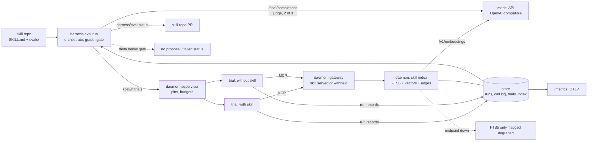

# ADR-0036: Skill evals, efficacy metrics, the model API and utility models

> **Not yet implemented.** Design stage. No eval runner, skill index or
> embedding code exists in the tree; ADR-0011, ADR-0012 and ADR-0030, which this
> builds on, are also design only.

## Context and Problem Statement

ADR-0030 makes a skill repo the source of truth for skills, has distillers
propose skills as pull requests, and treats a merge as promotion. It checks a
candidate with blind reconstruction and one control run without the skill. It
never answers the question an operator has: **does an agent do measurably
better with this skill than without it, on which adapter and model, at what
cost in turns and tokens?** One control run is one sample of a
non-deterministic agent; nothing notices when an edit or a model release makes
a merged skill worse; and nothing relates a skill being loaded in production to
how the run then went.

The pieces a Harness-native answer needs are decided. ADR-0033
makes the agent trace the run record: agent-trace normalizes every
supported agent's session into one shape, with tool calls classified as
`search`, `read`, `edit`, `exec` or `verify`, errors, turns, usage, cost and the
final result; and Harness supervises only agents whose adapter agent-trace
supports. ADR-0026 pins models and ADR-0027 caps budgets on every supervised
run. Existing eval tools tie a suite to one agent CLI or their own runtime.

Search is the other half. ADR-0030 serves skills through `search_skills` over an
FTS5 index, which is to carry vectors and skill-to-skill relation edges.
Harness already assumes an OpenAI-compatible model API (the `litellm` route of
ADR-0026, or any compatible endpoint), and that API serves embeddings as well as
chat. ADR-0012 and ADR-0030 kept every model credential out of the daemon, but a
query must be embedded when it is searched, and search runs in the daemon; and
small oversight tasks (naming sessions, tagging runs) are better done by a
cheap model than by heuristics.

**How does Harness measure whether a skill helps on every agent it supervises,
gate promotion and changes on that measurement, observe efficacy in production,
and where do judging and embeddings come from?**

## Decision Drivers

* **Measure against a baseline.** A skill is worth its context only if runs with
  it beat runs without it.
* **Agent-neutral.** Skills reach every adapter by search (ADR-0030), so suites
  must run on every supported adapter, with no dependency on any agent CLI.
* **Trials are real runs**, through the same supervisor, pins, budgets and run
  record as production.
* **A small case format Harness owns**, and evidence a reviewer can read: pass
  rate, spread and delta per adapter and model, with trial counts.
* **One model API**, configured once, for judging, embeddings and the daemon's
  utility calls.
* **No agent loop in the daemon.** It supervises agents and may call a utility
  model; it never becomes an agent.

## Considered Options

### Decision 1 — How evals run

* Option 1 — A Harness-native eval loop and case format over the supervisor and
  agent-trace run records.
* Option 2 — An external eval framework (promptfoo, inspect_ai, Braintrust) run
  as a subprocess or service.
* Option 3 — Vendor-specific runners per agent CLI (for example
  `claude plugin eval`), scheduled and parsed by Harness.

### Decision 2 — Where the skill index's embeddings come from

* Option 1 — A required embedding model on the OpenAI-compatible API.
* Option 2 — In-process static embeddings (a Model2Vec-style weights file).
* Option 3 — FTS5 only, as ADR-0012 decided.
* Option 4 — A local model server run as a separate service.

### Decision 3 — How LLM-judge graders are judged

* Option 1 — A direct chat-completions call, three votes, two to pass.
* Option 2 — The judge as a supervised agent run.

## Decision Outcome

Decision 1: Chosen option: **Option 1 — A Harness-native eval loop and case
format**, because it is the only option that runs trials on every supported
adapter through the supervisor that runs production, and grades the normalized
record, so one suite is portable by construction.

Decision 2: Chosen option: **Option 1 — A required embedding model on the
OpenAI-compatible API**, because the operator already runs that API, it gives
transformer-quality vectors with nothing bundled, and a local server is reached
by pointing `base_url` at it.

Decision 3: Chosen option: **Option 1 — A direct chat-completions call**,
because a judge needs a rubric, content and a verdict, not tools or a loop.

### The model API

```toml
# ~/.config/harness/harness.toml, global only
[model_api]
base_url        = "http://127.0.0.1:4000/v1"          # a LiteLLM gateway, or any compatible endpoint
env_file        = "~/.config/harness/env/model-api.env"
api_key         = "${MODEL_API_KEY}"                  # ADR-0038: resolved from env_file only
chat_model      = "gpt-oss-120b"                      # default judge
utility_model   = "qwen3-30b-a3b"                     # small, cheap: daemon utility calls
embedding_model = "bge-m3"                            # required when any skill repo is configured
```

* `api_key` is a `${NAME}` reference resolved from the table's own `env_file`,
  ADR-0038's single secret mechanism. A literal key is refused.
* **Embeddings are required.** Config load and `harness doctor` fail when a
  skill repo is configured (ADR-0030) and `[model_api]` or `embedding_model` is
  missing.
* `embedding_model` names a concrete model, not a gateway alias that can change
  underneath, because the model id is part of the embedding cache key.

### Utility models in the daemon

The daemon holds the `[model_api]` credential and makes **utility model calls**:
small, bounded requests that support supervision and oversight. This replaces
the rule of ADR-0012 and ADR-0030 that the daemon holds no model credential and
makes no model request. Uses include:

* embeddings of skill text and search queries (`embedding_model`), for the
  skill index below;
* naming a session or run from its first prompt and trace;
* tagging and classifying runs, sessions and skills (task family, error class
  where the deterministic classifier has no answer);
* short summaries of a run record for the TUI and notifications.

A utility call is not an agent, and these rules keep it that way:

* **One request, no tools, no loop.** A utility call is a single chat
  completion (`utility_model`) or embeddings request. The daemon never gives a
  model tools, never feeds a model's output back to it, and never runs an agent
  loop; agents are supervised runs, and judging runs in the `harness eval run`
  orchestrator, a client process.
* **Output is data.** A utility result is validated against a fixed schema (a
  name of bounded length, labels from a declared set, a capped summary) and
  stored or displayed. It never selects a command, changes config, grants a
  tier, or triggers a run. Input may be untrusted agent output, so a steered
  result can at worst mislabel something; it can never act.
* **Redacted input, bounded cost.** Every input passes the redactor first
  (ADR-0033). Each use has a token cap, and all utility calls share a rate limit
  and a daily cost ceiling under ADR-0027's accounting. Utility spend is
  exported as its own series.
* **Never required for supervision.** A failed, slow or unconfigured utility
  call degrades to the deterministic fallback (the harness name, no tags, no
  summary, FTS5-only search) and is reported by `harness doctor`. Supervising,
  attaching, triggering and recording never wait on a model.
* **Forge and agent credentials stay out of the daemon.** Only the
  `[model_api]` key is added. `[eval]` may name its own `env_file` and `api_key`
  for judge calls, so the daemon's key can be restricted to `utility_model` and
  `embedding_model` (a LiteLLM virtual key with a model allowlist does this).

A new utility use is added by naming it, its schema, its cap and its fallback;
anything that needs tools or more than one turn is a supervised run instead.

### Suites live with the skill

```text
skills/<slug>/
├── SKILL.md
└── evals/
    └── <case>/
        ├── case.toml       # prompt, limits, graders
        ├── scaffold/       # optional: copied into the trial's fresh workspace
        └── fixtures/       # optional: exposed read-only, outside the workspace
```

```toml
# skills/go-race-flakes/evals/restart-race/case.toml
prompt = """
TestSupervisorRestart fails about one run in ten under -race.
Find the cause and fix it without skipping the test.
"""
trials          = 5            # per arm; overrides [eval] trials
max_turns       = 40
timeout_seconds = 900
scaffold        = "scaffold"
fixtures        = ["fixtures"]
threshold       = 1.0          # weighted score a trial needs to pass
delivery        = "search"     # search | project (ADR-0011 projection)

[[grader]]
type  = "tool_order"
order = ["read", "edit", "verify"]   # agent-trace classified actions

[[grader]]
type = "command"
run  = ["go", "test", "-race", "-count=20", "./internal/supervisor/"]

[[grader]]
type   = "judge"
focus  = "diff"                # final | diff | trace
rubric = "The fix removes the race itself; it does not add sleeps or retries."
weight = 2
```

The vocabulary is informed by existing eval tools, none of which is a
dependency or a compatibility target; Harness versions the format alone.
`harness skills lint` (ADR-0030) validates suites: a distilled skill without a
case fails lint, a hand-written one gets a warning.

### Trials are supervised runs

`harness eval run` is a client command in the ADR-0030 mould: deterministic code
that orchestrates, with every agent run supervised. It runs by hand, from skill
repo CI, or nightly on `[eval] schedule`, which the daemon's scheduler (ADR-0013)
fires as a built-in eval job, and which catches a model release that makes a
skill worse. It is not an ADR-0023 `command` harness: ADR-0033 limits harnesses
to agents agent-trace supports.

```toml
[eval]
trials         = 5
concurrency    = 2
min_delta      = 0.10          # promotion gate
max_regression = 0.10          # regression gate
max_cost_usd   = 20.00         # per suite run, judge calls included
judge_model    = "qwen3-235b"  # optional; defaults to [model_api].chat_model

[eval_target.crush-glm]         # what a trial runs as
adapter      = "crush"
max_cost_usd = 2.00             # ADR-0027 per-run caps apply to every trial
[eval_target.crush-glm.model_pin]   # ADR-0026: trials fail closed like production
route = "litellm"
model = "z-ai/glm-5.3-flash"

[eval_target.codex]
adapter  = "codex"
model    = "gpt-5.5-codex"
env_file = "~/.config/harness/env/eval-codex.env"
secrets_env = ["OPENAI_API_KEY"]   # ADR-0038 allowlist
```

A target names an adapter (ADR-0039); one agent-trace does not support
is a load error, as for any harness under ADR-0033. For each (case, arm, target,
trial) the orchestrator asks the daemon for an ephemeral one-shot run named
`eval/<repo>/<slug>/<case>/<arm>/<n>` with the target's adapter, model or pin,
budget and environment, and:

* **a fresh workspace** seeded from `scaffold/`; the case directory is never in
  it, and `fixtures` are read-only;
* **isolation as ADR-0030's model runs**: the `secrets_env` allowlist, a fresh
  `HOME`, project configuration off, no inherited `HARNESS_*` variables;
* **MCP only through the gateway** (ADR-0035), `mcp_exclusive = true`;
* **the arm**. With the skill, the skill repo at the commit under test is served
  through `search_skills` and `get_skill`, or projected into the adapter's skill
  directory when `delivery = "project"`. Without it, the same minus that one
  skill, so the delta isolates the skill under test.

Trials are ordinary runs: they get run records (ADR-0033), count against
budgets, and show in `harness runs`.

### Grading

Graders run in the orchestrator over the trial's normalized run record, its
workspace and its final message.

| Grader | Passes when |
|---|---|
| `tool_used` | the record has a call with the given `action` or `tool`, within optional `min` / `max` counts |
| `tool_order` | the given actions or tools occur in that order, as a subsequence |
| `max_tool_errors` | the record has at most `n` failed tool calls |
| `max_turns` | the run finished within `n` turns |
| `file_exists` | a workspace path exists (or, with `absent = true`, does not) |
| `file_regex` | a workspace file matches a pattern |
| `command` | a command run in the workspace after the trial exits with `exit` (default 0) |
| `final_regex` | the final message matches a pattern |
| `judge` | two of three judge votes are PASS |

* **Portable by construction.** Graders read agent-trace's normalized record,
  never a vendor transcript. `action` matches the classified action on every
  adapter; `tool` matches the normalized tool name, which grades MCP tools
  served by the gateway under the same name everywhere.
* **Judge.** The orchestrator makes three independent
  `POST {base_url}/chat/completions` calls to `judge_model` with the rubric and
  the focus content, redacted (ADR-0008) and capped: `final` is the final
  message, `diff` the workspace diff against the scaffold, `trace` the first and
  last 12 normalized events. A reply that is not a JSON verdict counts as FAIL.
  The judge has no tools, so trial content can at most sway a vote. A warning is
  printed when `judge_model` equals a target's model; a suite with `judge`
  graders and no judge model is refused.
* A trial's score is the weighted fraction of graders passed; the trial passes
  when the score meets `threshold`.

### What is recorded

One row per trial in the store (ADR-0037), written by the daemon,
which alone opens the database:

| Field | Source |
|---|---|
| `suite_run_id`, `repo`, `skill`, `skill_version` | `skill_version` is the skill directory's git tree SHA at the commit under test |
| `case`, `case_version`, `arm`, `trial` | the case directory's tree SHA; `with` or `without`; the index |
| `target`, `adapter`, `model`, `served_model` | from the target; `served_model` from ADR-0026 attestation where available |
| `run_id`, `config_hash`, `skill_loaded` | the trial's run record; whether it shows the skill loaded |
| `outcome` | `completed`, `timeout`, `turn_cap`, `budget`, `error` |
| `score`, `passed` | as above |
| `turns`, `tokens_in`, `tokens_out`, `cost_usd`, `wall_seconds` | the run record's usage |
| per grader: `type`, `passed`, `votes`, `evidence` | evidence redacted, capped at 1 KiB |

The aggregate per (skill version, case, target, arm) is the trial count, pass
rate, mean score and sample standard deviation, and the mean and spread of
turns, tokens, cost and wall time. The delta is the with-arm mean score minus
the without-arm mean score, with standard error
`sqrt(sd_with²/n_with + sd_without²/n_without)`. `harness eval run --json`
writes the aggregate for CI scripts.

### Gates

A skill passes on a target when the with-arm has at least `trials` completed
trials in each case, and either the mean delta across its cases is at least
`min_delta` **and** at least twice its standard error, or the delta is at least
`-0.05` while mean tokens or cost fall by at least 20% (a skill that keeps
quality and saves spend also earns its context). Anything else is `fail`, or
`inconclusive` when the standard error is too large to decide, which gates as
`fail` and says more trials would decide it. A suite run that reaches
`max_cost_usd` ends as `partial` and gates as `fail`.

* **Promotion (ADR-0030).** The author run also writes at least one case from
  the evidence: the task statement as the prompt, the clean-room snapshot at the
  base SHA as the scaffold, graders derived from the merged hunks and the check
  that went green. The graders see the answer; the agent under test never does.
  `harness distill propose` opens a pull request only when the suite passes on
  every target in the distiller's `eval_targets`, with the aggregate table in
  the dossier. This replaces ADR-0030's single control run.
* **Merge and regression.** Skill repo CI runs
  `harness eval run --changed-since <base>` against a private, temporary daemon
  and reports the required commit status `harness/eval`. A change fails when
  a skill's pass rate or delta falls by more than `max_regression` against the
  default branch's last result, on any target.

### Efficacy in production

The gateway call log (ADR-0035) records every `search_skills` result
and `get_skill` call with harness, run, adapter and model.
`harness skills efficacy [skill]` joins those rows to run records:

* **Exposure**: `loaded` (`get_skill` called), `shown` (returned, never loaded)
  or `absent`.
* **Outcomes**: result, turns, tokens, cost and wall time, plus ADR-0030's
  ledger outcomes (review rounds, red-to-green cycles, revert) for runs that
  opened a pull request.
* **Comparison**: within strata of the same harness, trigger and model over a
  rolling 30-day window, as a difference in means with counts, or
  `insufficient data` below 20 runs per stratum.

This is correlation: runs that load a skill differ in their task. As ADR-0030
decided, it is evidence in maintenance pull requests and on dashboards, never
acted on automatically. Only controlled evals gate.

### Metrics and telemetry

On the ADR-0020 `/metrics` listener:

```text
harness_skill_eval_trials_total{repo,skill,arm,adapter,model,outcome}     counter
harness_skill_eval_pass_rate{repo,skill,arm,adapter,model}                gauge   latest suite run
harness_skill_eval_score_mean{repo,skill,arm,adapter,model}               gauge
harness_skill_eval_delta{repo,skill,adapter,model}                        gauge
harness_skill_eval_tokens_total{repo,skill,arm,adapter,model,direction}   counter
harness_skill_eval_cost_usd_total{repo,skill,arm,adapter,model}           counter
harness_skill_loads_total{repo,skill,harness}                             counter
harness_skill_run_outcomes_total{repo,skill,exposure,outcome}             counter
harness_skill_search_degraded_total{reason}                               counter
harness_model_api_requests_total{endpoint,outcome}                        counter
```

`skill` values are capped (default 200), overflow collapsing into
`skill="__other__"`, per SPEC-0013's cardinality rule. Through ADR-0022's
exporter, a suite run is one trace, each trial a span carrying the recorded
fields, each grader a child span, linked to the trial's own run trace. Export
follows ADR-0022's consent gate: nothing leaves the host unless `[telemetry]`
names a destination and `export_all` or `[eval] export_telemetry = true` is set.

### The skill index: FTS5, vectors and relation edges

The index is a cache in the store, rebuilt from each serving clone's default
branch (ADR-0030) and the call log.

* **Text.** FTS5 over `name`, `description`, `symptoms`, `tags` and
  `applies_to`, with `porter unicode61`, as SPEC-0007 requires.
* **Vectors.** One per skill, over its name, description, symptoms and *When to
  use* section, from `embedding_model` via `/v1/embeddings`, cached by content
  hash plus model id: an unchanged skill is never re-embedded, and changing
  `embedding_model` re-embeds everything. Similarity uses sqlite-vec where
  ADR-0037's driver loads it, and an exact cosine scan in Go otherwise; both
  are fast at skill-repo scale.
* **Queries.** `search_skills` embeds the query at search time: one embeddings
  request from the daemon per search, with a short timeout.
* **Ranking.** Reciprocal rank fusion of the BM25 and cosine rankings, because
  exact lexical matches (an error string, a tool name) still matter; then
  ADR-0030's `applies_to` boost and `serve_to` scoping. Limits stay 3 by
  default, 5 at most.
* **Relation edges** `(src, dst, kind, weight)`: `references` (a skill links
  another, or lists it in `related`), `shares_purpose` (same ADR-0030
  `task_family` and `target`), both from the repo; and `co_used` (loaded in the
  same run in at least 3 runs within the call log's retention, weighted by
  co-occurrence over the rarer skill's loads). A `search_skills` hit carries up
  to two related skill ids outside the limit; distillation and efficacy
  analysis read the edges.
* **Retrieval is evaluated too.** `evals/_retrieval/queries.toml` in a skill
  repo lists queries and the skills each should find; `harness eval retrieval`
  reports recall at 3 for FTS5 alone and for the hybrid, which is how a change
  of `embedding_model` is judged.

**When the embeddings endpoint fails, search does not.** A query that cannot be
embedded is answered from FTS5 alone, and the response says
`degraded: "embeddings_unavailable"`. A skill that cannot be embedded at index
time is stored without a vector, still found by FTS5, and retried. Both show in
`harness doctor` and `harness_skill_search_degraded_total`. Degraded search is
not an error, and never silent.

### Consequences

* Good, because every skill change and distilled candidate is measured against
  a without-skill baseline, with spread and trial counts, before it can merge.
* Good, because trials run on every supported adapter through the production
  supervisor, pins and budgets, and one suite grades them all.
* Good, because no agent CLI, eval framework or hosted service is a
  dependency, and delta, cost and token series make a skill's worth a
  dashboard query.
* Good, because search gains transformer-quality recall from the API the
  operator already runs, with nothing bundled in the binary.
* Good, because the daemon can name, tag and summarize runs with a cheap
  utility model, and every such call degrades to a deterministic fallback.
* Bad, because the daemon now holds a model credential and depends on a network
  endpoint for full-quality search and utility features, and any install with a
  skill repo needs an embedding model. A restricted key, output schemas, cost
  ceilings and the fallbacks bound this.
* Bad, because evals are expensive: cases × trials × 2 arms × targets agent
  runs, plus three judge calls per `judge` grader per trial. A five-trial,
  two-target suite of four cases is 80 agent runs, bounded by `max_cost_usd`,
  ADR-0027 budgets and `--changed-since`.
* Bad, because five trials per arm detect only large effects; small real gains
  read `inconclusive`, and more trials cost linearly more.
* Bad, because a case derived from evidence carries the answer in its graders,
  and the only thing keeping it from a trial is a directory convention plus
  ADR-0030's audit, not a sandbox.
* Bad, because production efficacy is confounded by task selection.
* Neutral, because only agents agent-trace supports can be evaluated, the same
  set Harness supervises (ADR-0033).

### Confirmation

SPEC-0007 is revised on acceptance to cover suites, trials, graders, gates, the
model API, the index and efficacy. The acceptance tests that matter:

* One suite runs on two targets with different adapters, and every grader
  produces a result on both from the normalized record.
* A without-arm trial's `search_skills` never returns the skill under test; a
  with-arm trial's does.
* A trial's environment, read from the process, holds only `secrets_env` names
  and reserved variables, and its workspace lacks the case directory.
* A `judge` grader passes on two PASS votes of three, fails on one, and counts
  a malformed verdict as FAIL.
* During a suite run, every judge `/chat/completions` request, observed at the
  endpoint rather than inferred from config, comes from the orchestrator; the
  daemon's requests are only `/v1/embeddings` and `utility_model` completions.
* No daemon request carries a `tools` field or a prior assistant turn, and a
  utility result outside its schema is discarded and the fallback used.
* With `[model_api]` unreachable, sessions still start, attach and record, and
  get their deterministic names.
* A distilled candidate below `min_delta` produces no pull request; a change
  that drops pass rate by more than `max_regression` fails `harness/eval`.
* With a skill repo and no `embedding_model`, config load fails; with the
  endpoint unreachable, `search_skills` returns FTS5 results marked degraded.

## Pros and Cons of the Options

### Decision 1, Option 1 — A Harness-native eval loop and case format

* Good, because trials reuse the supervisor, pins, budgets, run records and
  gateway, and grading the normalized record makes suites portable.
* Bad, because Harness owns the format, graders, statistics and reporting, and
  graders see only what agent-trace normalizes.

### Decision 1, Option 2 — An external eval framework

* Good, because promptfoo and inspect_ai are mature, with statistics, viewers,
  sandboxes and many scorers; Braintrust adds hosted dashboards.
* Bad, because promptfoo (Node) and inspect_ai (Python) add a runtime and drive
  models outside the supervisor, and their prompt-and-response cases need a
  custom provider and scorer to grade a supervised agent's trace.
* Bad, because Braintrust ties results to a hosted service, and the Go options
  (Genkit Go evaluators, `maragu.dev/gai`) stop at regex and equality or are
  pre-1.0.

### Decision 1, Option 3 — Vendor-specific runners per agent CLI

* Good, because it is the least code for an agent whose CLI ships a runner.
* Bad, because it is a hard dependency on each vendor's CLI, most agents ship
  no runner, and each runner's own format means one suite per vendor.
* Bad, because the runs bypass the supervisor, so pins, budgets and run records
  do not apply.

### Decision 2, Option 1 — A required embedding model on the OpenAI-compatible API

* Good, because it uses the endpoint the operator already runs, with any
  embedding model it serves, and nothing ships in the binary.
* Good, because cached document vectors leave one request per search in
  steady state.
* Bad, because the daemon holds a model credential and makes a network request
  per search, and search quality depends on the endpoint being up.

### Decision 2, Option 2 — In-process static embeddings

* Good, because a query embedding is a local lookup: no network, no credential.
* Bad, because static embeddings trail transformer embeddings on paraphrase,
  the gap vectors exist to close.
* Bad, because a weights file is one more artifact to install, pin and upgrade
  on every host, beside an embeddings endpoint that already exists.

### Decision 2, Option 3 — FTS5 only

* Good, because it is what SPEC-0007 specifies, with nothing to configure, and
  `symptoms` already close part of the vocabulary gap (ADR-0012).
* Bad, because paraphrased queries that share no stemmed term with a skill
  still miss.

### Decision 2, Option 4 — A local model server as a separate service

* Neutral, because a local server that speaks `/v1/embeddings` is Option 1 with
  `base_url` on loopback; as a Harness-managed service it would be one more
  thing to install and supervise on every host.

### Decision 3, Option 1 — A direct chat-completions call

* Good, because a judge call is one bounded request, cheap enough to make three
  times per grader, with a strictly parsed JSON verdict.
* Good, because with no tools, trial content can sway a vote but cannot act.
* Bad, because judge calls are not supervised runs, so ADR-0027 budgets do not
  apply; the orchestrator counts their usage toward `max_cost_usd` instead.

### Decision 3, Option 2 — The judge as a supervised agent run

* Good, because judge runs would get pins, budgets and run records.
* Bad, because it brings a loop and tools each adapter must be told to disable,
  and three agent spawns per grader per trial multiply cost and wall time.

## Architecture Diagram



## More Information

* **Extends ADR-0030** — evals gate promotion and every skill change, replacing
  the single control run; production efficacy stays reported, never acted on.
  Its no-model-credential rule for the daemon is replaced by the utility-model
  rules above, and it gets a pointer. SPEC-0007 is revised on
  acceptance.
* **Extends ADR-0011** — the `project` arm evaluates hand-written, projected
  skills.
* **Related ADR-0012** — the FTS5 index stands and gains vectors from the model
  API; its model-free daemon is replaced by the utility-model rules above.
* **Related ADR-0020** — the `harness_skill_*` and `harness_model_api_*` series.
* **Related ADR-0022** — eval traces follow its consent gate.
* **Related ADR-0013** — nightly eval runs are a built-in scheduled job.
* **Related ADR-0026** — targets pin models, attestation supplies
  `served_model`, and its `litellm` route is the natural `[model_api]` endpoint.
* **Related ADR-0027** — per-trial caps, the suite's cost ceiling, and the
  daily ceiling on utility calls.
* **Decided alongside this ADR:** ADR-0033 (the run record graders read;
  supervision only of supported adapters), ADR-0035 (the gateway serves skills;
  its call log feeds efficacy), ADR-0037 (the SQLite store for trials, index,
  vectors and edges), ADR-0038 (`env_file`, `${NAME}` and `secrets_env`),
  ADR-0039 (the adapters targets name).
* **Deferred:** mocked MCP upstreams for cases; sequential testing that stops a
  suite once the delta is decided; per-section vectors; evaluating prompts and
  personas with the same loop.
