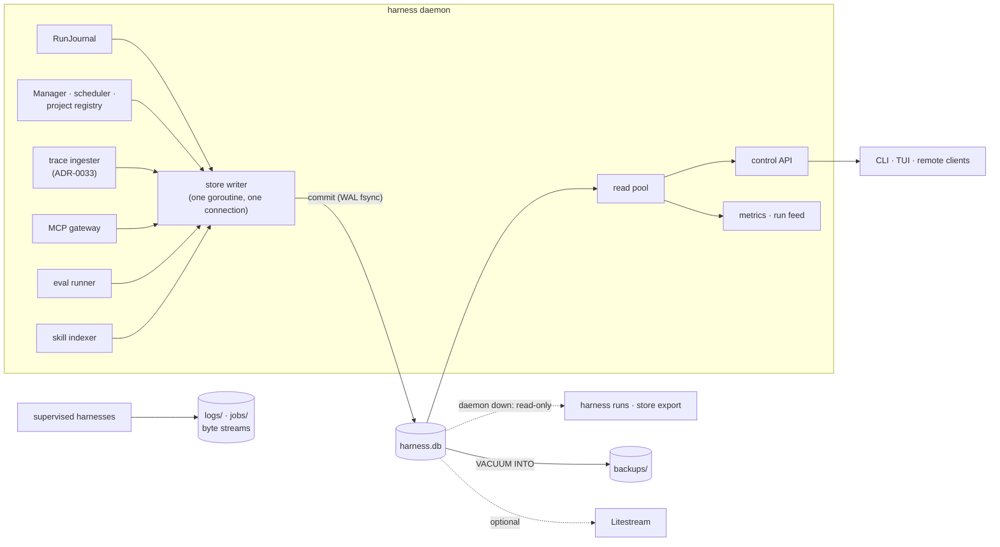

# ADR-0037: One embedded SQLite store for all daemon state

> **Not yet implemented.** Design stage. The run ledger of ADR-0028 is being
> built as JSONL day files in an open stack of pull requests (#639, #649, #654,
> #658, #662); this ADR moves that ledger's storage, not its API. See
> [Sequencing](#sequencing-with-the-jsonl-ledger-work).

## Context and Problem Statement

The daemon keeps its state in several hand-rolled file formats, each with its
own atomic-write, schema-version, torn-write and retention code:

| What | Where today | Written how |
| --- | --- | --- |
| Runtime state: enabled intent, exit codes, restart counts, active profile | `state.json` under `$XDG_STATE_HOME/harness` | the whole document rewritten on every save |
| Registered projects (SPEC-0004) | `state.json` | same |
| Scheduler marks (SPEC-0008) | `state.json` | same |
| Run history, last `keep_runs` (20) per harness | `state.json` | same |
| Run ledger (ADR-0028, SPEC-0022) | `ledger/YYYY-MM-DD.jsonl`, in flight | `O_APPEND` + fdatasync per fact |
| Durable harness log | `logs/<name>.log`, 8 MiB / 24 h rotation, 5 backups | sanitized plain text (ADR-0007) |
| Per-run log and trigger event | `jobs/<name>/<id>.log`, `<id>.event.json` | plain text, 0600 JSON |
| Telemetry events | optional `[telemetry] events_file` JSONL | redacted, rotated (ADR-0022) |

The next set of features needs more than this can give. Every agent session's
tool calls, errors, tokens and models become the run record (ADR-0033).
An MCP gateway (ADR-0035) logs every proxied call with harness, adapter, model,
config hash, tool, latency and outcome. Evals record pass/fail, turns, cost and
the with/without-skill delta per case (ADR-0036). The skill index that
serves `search_skills` needs full-text search (ADR-0012 already names FTS5) and
semantic search over embeddings (ADR-0030). These are relational, queried by
several keys, joined to runs, and in two cases need a search index. A fifth
and sixth file format would each reinvent indexing, retention and crash safety.

Harness owns no database today. `modernc.org/sqlite` is a dependency only
because `internal/sessionguard` and `internal/observe` read crush's own session
databases.

**Where should the daemon keep its records, so that every feature above shares
one crash-safe, queryable, searchable store, without putting a database server
in front of a single-operator install?**

## Decision Drivers

* **One store, one set of guarantees.** Atomic commits, crash recovery, schema
  versioning, retention and backup are solved once, not per file.
* **Durable before visible** (ADR-0028). A run fact is on stable storage before
  its process spawns and before anyone is told about it.
* **Cheap on the supervisor's path.** A synced fact costs about what an
  fdatasync'd append costs. A slow or full disk must not stall supervision of a
  harness with no budget (SPEC-0022 REQ-6).
* **No cgo.** Releases build with `CGO_ENABLED=0` for linux and darwin on amd64
  and arm64. The driver is pure Go.
* **Full-text and vector search in-process.** `search_skills` and distillation
  clustering must not need a sidecar service.
* **Readable when the daemon is down.** The ledger is most wanted after a crash.
* **Upgrades never corrupt.** Every schema change commits whole or not at all,
  a backup of the pre-upgrade database exists before the first one runs, and a
  failed upgrade is loud.
* **Schema as hand-written SQL.** FTS5 and `vec1` virtual tables and the
  triggers that keep them in sync are SQLite-specific DDL; the migration
  tooling must carry them as written.
* **Single writer.** Only the daemon writes. With a networked control plane (the
  gRPC control-plane ADR, ADR-0034), remote CLIs and TUIs reach state
  through the daemon and never open the file, so an embedded database fits one
  networked Harness as well as a laptop.
* **A path to shared state.** If several Harness instances ever share records,
  the code must not be welded to one engine.
* **No secrets, no untrusted payloads** in records (ADR-0008, ADR-0028).

## Considered Options

### Decision 1 — Where records live

* Option 1 — One embedded SQLite database owned by the daemon.
* Option 2 — Keep files: `state.json` plus the JSONL ledger, and one new file
  format per feature.
* Option 3 — PostgreSQL now.
* Option 4 — A graph database (Engram) as the system of record.

### Decision 2 — Which pure-Go SQLite driver

* Option 1 — `modernc.org/sqlite`, already a dependency.
* Option 2 — `github.com/ncruces/go-sqlite3` with its bundled `ext/fts5` and
  `ext/vec1` extensions.
* Option 3 — `github.com/ncruces/go-sqlite3` with sqlite-vec through
  `github.com/asg017/sqlite-vec-go-bindings`.

### Decision 3 — Schema migrations

* Option 1 — A hand-rolled runner: numbered SQL files embedded in the binary,
  the applied number in `PRAGMA user_version`.
* Option 2 — goose (`github.com/pressly/goose/v3`) as a library: its
  `Provider` over the driver's `database/sql` handle, SQL migrations in an
  `embed.FS`.
* Option 3 — golang-migrate (`github.com/golang-migrate/migrate/v4`).
* Option 4 — An ORM with built-in migrations: GORM `AutoMigrate` on the
  ncruces `gormlite` driver, bun's `migrate` package, or ent with Atlas
  versioned migrations.
* Option 5 — A declarative schema tool: Atlas.

## Decision Outcome

Decision 1: Chosen option: **Option 1 — One embedded SQLite database owned by the
daemon**, because it gives every record the same crash-safe commit, indexed
queries, FTS5 and vector search in one file, with no service to run, and
because only the daemon ever opens it.

Decision 2: Chosen option: **Option 2 — `ncruces/go-sqlite3` with `ext/fts5` and
`ext/vec1`**, because it is the only pure-Go driver with a maintained,
in-process vector extension. `modernc.org/sqlite` cannot load extensions, and
the sqlite-vec bindings explicitly do not support it. The sqlite-vec bindings
for ncruces pin `go-sqlite3` v0.17.1 and wazero v1.7.3, from before ncruces
moved from a wazero runtime to wasm2go-translated Go, and replace its embedded
build, so they cannot be combined with a current release.

Decision 3: Chosen option: **Option 2 — goose as a library**, because it is a
maintained migration runner that takes any `database/sql` handle, so it runs on
the ncruces driver with FTS5 and `vec1` registered; its migrations are plain
SQLite SQL, so virtual tables and triggers are written as-is; it is a library,
so building, shipping and running the daemon needs no migration CLI; and its
`goose_db_version` table is a convention contributors already know. An ORM is
not chosen: the store's writes are a handful of fixed statements behind the
`Store` interface, GORM's `AutoMigrate` is not versioned and cannot express the
virtual tables, and the ORMs' versioned paths lead to Atlas, whose ent
integration has an open bug with FTS5 shadow tables and whose open-source
edition leaves out triggers. See
[Migrations](#migrations-goose-embedded-sql-forward-only-before-the-supervisor).

### What this replaces, precisely

* **From ADR-0007:** the runtime state file (`state.json`) and its atomic-write
  and schema-version discipline. ADR-0007's scrollback decisions stand: the
  in-memory ring, the sanitized rotating durable log, attach semantics and
  backpressure are unchanged.
* **From ADR-0028:** Decision "Axis 1", the on-disk format only. JSONL day files
  become rows in the store. Everything else in ADR-0028 stands: the
  `RunJournal` as single writer, the ledger append as the commit point, the
  post-commit run feed, replay by `seq` for lossless consumers, residents as
  process lifetimes, the record fields, the outcome classes, time-based
  retention and the `harness runs` interface. SPEC-0022's requirements hold
  except REQ-1 (location and format), whose file-level scenarios become
  row-level ones.

### What moves into the store

| Record | Table shape | Written by |
| --- | --- | --- |
| Harness runtime state, active profile | one row per harness | Manager, on transitions (debounced, as today) |
| Registered projects and their harness definitions | rows per project and harness | `project_up` / `project_down` |
| Scheduler marks | one row per scheduled harness | scheduler |
| Run ledger lines | append-only, `seq INTEGER PRIMARY KEY`, `type`, `at`, `harness`, `run_id`, JSON body | `RunJournal` only |
| Folded run records | one row per `(harness, run_id)`, indexed by harness, time, outcome, trigger, `todo_id` | `RunJournal`, in the same transaction as the line |
| Sessions and normalized trace events | per ADR-0033, keyed `(harness, run_id, session_id)` | trace ingester |
| MCP call log | one row per proxied call | MCP gateway |
| Eval results | one row per case run | eval runner (ADR-0036) |
| Skill index | skills, an FTS5 table over name, description and body, a `vec1` table of embeddings, and a skill-to-skill edge table | skill indexer; rebuildable from the skill repos (ADR-0030) |

The folded `runs` table is a projection of the ledger lines, rebuilt from them
by `harness store rebuild`. The ledger lines stay the record, so ADR-0028's
"fold by `(harness, run_id)`" and "replay by `seq`" hold row for row: replay is
`WHERE seq > ? ORDER BY seq`. The skill index is likewise derived state: losing
it costs a reindex, never a skill.

### What stays files, and why

| File | Why it is not a row |
| --- | --- |
| Durable harness log, `logs/<name>.log` | Bulk append-only text whose value is being `tail -f`-able and readable with `less` when the daemon is dead. Rotation already bounds it. |
| Per-run log, `jobs/<name>/<id>.log` | Same, per run. Pruned by `keep_runs`. The run row stores its path and `log_pruned`. |
| Trigger event, `jobs/<name>/<id>.event.json` | An untrusted webhook body, handed to the run as input. ADR-0028 keeps payloads out of records; this keeps them out of the store. |
| Telemetry events file | An export for Vector, Fluent Bit or Promtail to tail (ADR-0022), not state. |
| The daemon's own log (`HARNESS_LOG_FILE`, journald) | Owned by the init system. |
| Raw agent transcripts | They stay in the agent's own store; ADR-0033 decides what is indexed. |

The rule: **records go in the store, byte streams stay files.** A record is
something queried by key, joined or counted. A byte stream is something read
start to end or tailed. `harness logs --raw` gains a fallback that reads the
durable log file directly when the daemon is unreachable, as `harness runs`
does for records.

### The database file

```text
$XDG_STATE_HOME/harness/            0700
  harness.db                        0600
  harness.db-wal                    0600
  harness.db-shm                    0600
  backups/                          0700
    harness-<UTC timestamp>-v<N>.db 0600   pre-migration and scheduled backups
```

Pragmas, set on every connection: `journal_mode=WAL`, `synchronous=FULL`,
`foreign_keys=ON`, `busy_timeout=5000`. `auto_vacuum=INCREMENTAL` is set when the
file is created. `synchronous=FULL` makes a commit fsync the WAL, which is the
same single sync an `O_APPEND` fact costs today.

### Writes: one writer goroutine, bounded, never blocking supervision

* One connection writes, owned by one goroutine. Every write is sent to it, as
  `internal/ledger`'s writer already does for day files. A write pool of one
  removes `SQLITE_BUSY` between daemon writers by construction.
* A fact (`opened`, `closed`, `decided`) is one transaction: the ledger line
  and the folded run row commit together, and the caller waits for the commit
  up to SPEC-0022's 2-second bound. `updated` checkpoints are batched into one
  transaction at most every 30 seconds, as today.
* A failed or timed-out commit keeps SPEC-0022 REQ-6's degraded mode exactly:
  the line stays queued in memory in `seq` order, the failure is logged and
  counted, budgeted admission decides per SPEC-0021 REQ-4, and an unbudgeted
  harness does not wait.
* Readers (the control API, metrics, `harness runs`) use a separate read-only
  connection pool. WAL lets them read while the writer commits.
* A passive WAL checkpoint runs from a background goroutine on a timer, so a
  checkpoint never lands inside a fact's commit.

### Migrations: goose, embedded SQL, forward-only, before the supervisor

The schema is a directory of numbered SQL files embedded in the binary and
applied by goose (`github.com/pressly/goose/v3`, v3.28.0) used as a library.
goose records each applied version in its `goose_db_version` table.

```text
internal/store/
  migrations/
    00001_schema.sql      tables, indexes, FTS5 and vec1 tables, triggers
    00003_<change>.sql    one file per later schema change
  import.go               migration 2: the state.json and JSONL import, in Go
```

```go
// Governing: ADR-0037
//go:embed migrations/*.sql
var migrations embed.FS

db, err := driver.Open(dsn, registerExtensions) // one init callback: fts5.Register, then vec1.Register
p, err := goose.NewProvider(goose.DialectSQLite3, db, sub, // sub: fs.Sub(migrations, "migrations")
	goose.WithDisableGlobalRegistry(true),
	goose.WithGoMigrations(importMigration),
)
```

* **Hand-written SQLite SQL.** Each file is plain SQL under a
  `-- +goose Up` annotation, so `CREATE VIRTUAL TABLE … USING fts5(…)`,
  `USING vec1`, triggers (wrapped in `-- +goose StatementBegin` and
  `StatementEnd`) and partial indexes are written as SQLite accepts them.
  ncruces' `driver.Open` takes one connection-init callback and one close
  callback, so both extensions are registered in a single init function; the
  migration connection must have them, or `CREATE VIRTUAL TABLE` fails with
  "no such module".
* **Forward-only.** Files carry no `-- +goose Down` section, and the daemon never
  calls `Down`, `DownTo` or a down `ApplyVersion`. The way back to an older
  binary is the pre-migration backup, never a down migration.
* **Before the supervisor.** Migrations run at boot on a dedicated connection
  opened before the writer and the read pool, **before the supervisor starts and
  before any harness is admitted**. Nothing supervises against a half-migrated
  schema.
* **Newer databases are refused.** goose treats a database ahead of the
  embedded migrations as having nothing to apply. The daemon therefore reads
  `Provider.GetVersions` first, and when the database's version is above the
  binary's newest migration it exits non-zero without writing: a downgraded
  daemon does not guess. goose itself refuses an embedded migration older than
  the database's newest that was never applied, which catches a merge that
  reused a stale number.
* **Backup, then migrate.** When `Provider.HasPending` reports work, the daemon
  checkpoints the WAL (`wal_checkpoint(TRUNCATE)`) and writes
  `VACUUM INTO backups/harness-<ts>-v<N>.db`, where `N` is the pre-upgrade
  version, then calls `Provider.Up`.
* **One transaction per migration.** goose runs each migration, and the insert
  of its version row, in one transaction. A file marked
  `-- +goose NO TRANSACTION` runs outside one; that is reserved for statements
  SQLite refuses inside a transaction (`VACUUM`, changing `journal_mode`), and
  such a file holds nothing else. On an error goose returns a `PartialError`:
  the migrations before the failed one are committed, the failed one is rolled
  back whole. The database is always at a version the binary knows, never
  between two. **The daemon exits non-zero** naming the failed migration, the
  error, the version reached and the backup path. The same binary resumes from
  that version on its next boot; `harness store restore` returns to the backup
  for a downgrade. It never supervises on the old schema with a new binary.
* **Data migrations in Go.** A step that needs Go code is a goose Go migration
  (`goose.NewGoMigration(v, &goose.GoFunc{RunTx: …}, nil)`), passed with
  `WithGoMigrations` and run in a transaction like a SQL file.
  `WithDisableGlobalRegistry(true)` keeps any package-level registration out.
* Migrations on the append-heavy tables (ledger lines, trace events, MCP calls)
  are additive only: new tables, new nullable columns, new indexes. A backfill
  runs after start, in the background, in bounded batches. This is how the
  "no migration ever blocks a start" driver of ADR-0028 is met: a migration can
  block a start only for the time a schema change on small tables takes, once
  per upgrade.
* First boot after this ADR runs migration 1 (the schema), then migration 2, a
  Go migration that imports `state.json` and, if present, the JSONL ledger day
  files (keeping their `seq` values) in one transaction. After it commits, the
  daemon renames them to `state.json.imported` and `ledger.imported/`; a boot
  that finds migration 2 applied and the old paths still present finishes the
  rename. From then on no `state.json` and no day file is written.

### Retention

`[ledger] retention` and `max_mb` keep their meaning. Pruning deletes ledger
lines and run rows older than `retention` in bounded batches of 1,000 rows, then
runs `PRAGMA incremental_vacuum` to return pages to the filesystem. A run still
open across the cut is kept whole, which replaces ADR-0028's "carry forward an
`opened` snapshot" rule. Trace events, MCP calls and eval results take their own
retention keys from the ADRs that introduce them. Pruning runs at boot and hourly,
on the writer goroutine, between facts.

### Offline reads and the `sqlite3` CLI

* When the daemon is unreachable, `harness runs` opens `harness.db` read-only
  (`mode=ro`) and says so on stderr, as SPEC-0022 already requires of the day
  files. WAL allows this beside a live but wedged daemon.
* `harness store export --ledger [--since D] [--jsonl]` writes the ledger as
  JSONL, one line per ledger row with ADR-0028's field names, for `grep` and
  `jq`. It works with the daemon up or down.
* The stock `sqlite3` shell reads every plain table (`sqlite3 -json harness.db
  'select …'`). The FTS5 and `vec1` tables need a shell built with those
  extensions; they are indexes, and every fact they index is also in a plain
  table.

### Backups

* Pre-migration backups as above, the last three kept.
* `harness store backup [PATH]` runs `VACUUM INTO` on the writer connection: a
  consistent, compacted copy taken without stopping the daemon.
* `[store] backup_every = "24h"` and `backup_keep = 7` take scheduled backups
  into `backups/`. Off by default.
* Litestream can replicate `harness.db` continuously to object storage because
  the file is in WAL mode. Harness neither ships nor configures it; the
  operations guide documents it as an option.

### Integrity

A torn write cannot corrupt a committed transaction: WAL frames carry checksums,
and an incomplete frame at the tail is ignored at recovery. What can corrupt the
file is outside SQLite's control: a failing disk, a filesystem that lies about
fsync, or another process writing into the file. At boot the daemon runs
`PRAGMA quick_check` when the file is under 256 MiB, and `harness doctor --deep`
runs it at any size. A database that fails to open or fails the check stops the
daemon with an error naming the file and the newest backup. The daemon does not
silently recreate an empty store, because an empty store would restore an
empty world (ADR-0005). `harness store restore PATH` and `harness store reset`
are the operator's two ways forward, and both move the damaged file aside
rather than deleting it.

### The `Store` interface

Nothing outside `internal/store` imports a SQL driver. The daemon depends on a
Go interface composed of narrow parts:

```go
// Governing: ADR-0037
type Store interface {
	State() StateStore     // harness runtime state, profiles, projects, schedule marks
	Ledger() LedgerStore   // Append(line, sync) (seq, error); Replay(afterSeq); Query(filter)
	Traces() TraceStore    // ADR-0033 sessions and normalized events
	MCPCalls() MCPCallLog  // gateway call records
	Evals() EvalStore      // eval case results
	Skills() SkillIndex    // Search(query, k) over FTS5 + vectors; edges; Rebuild
	Backup(ctx context.Context, path string) error
	Close() error
}
```

`LedgerStore` keeps the signature of the JSONL ledger's `Append(Line, sync)` so
the `RunJournal`, the run feed and every consumer of the stack in flight move
over without change. A shared conformance test suite runs against every
implementation. SQL stays in the portable subset (no SQLite-only functions
outside `SkillIndex`), so a PostgreSQL implementation (tsvector for text,
pgvector for embeddings) is additive work if several Harness instances must
share state; goose has a `postgres` dialect, so that backend would keep the same
runner with its own migration directory. That backend is out of scope here.

### Sequencing with the JSONL ledger work

The JSONL ledger stack implements ADR-0028's semantics: the journal, the fold,
the feed, degraded mode, crash reconciliation and the offline query. That code
is the specification this store must pass. The stack lands as it is; the store
then replaces `internal/ledger`'s day-file writer and reader behind the same
API, and SPEC-0022's existing scenarios (sequence survives a restart, crash
reconciliation, the read-only disk, the offline read) are rerun unchanged
against it, alongside the row-level versions of REQ-1's scenarios.

### Consequences

* Good, because one crash-safe commit path, one schema-version scheme, one
  retention mechanism and one backup command replace four file formats' worth
  of each.
* Good, because the ledger line and the folded run row commit atomically, so
  `harness runs` never shows a record its lines disagree with.
* Good, because `harness runs --since 7d --outcome failed` is an indexed query,
  not a scan of seven files, and a trace, an MCP call, an eval result and a run
  join on `(harness, run_id)`.
* Good, because FTS5 and `vec1` serve `search_skills` in-process, with no
  sidecar and no network.
* Good, because the daemon is the only writer and remote clients never touch
  the file, so an embedded database is enough for a networked single instance.
* Good, because schema changes run through goose, a maintained runner whose
  ordering, gap detection and partial-failure reporting are tested upstream,
  and whose SQL files and version table a contributor who knows goose reads
  without learning a Harness format.
* Bad, because goose commits migration by migration, so a failed upgrade of
  several steps stops at an intermediate version instead of rolling all of them
  back. The daemon still refuses to start, and the pre-migration backup is the
  way back to the older binary.
* Neutral, because goose's `go.mod` requires clients for a dozen databases
  (pgx, MySQL, ClickHouse, `modernc.org/sqlite` for its tests, and others).
  They enlarge `go.sum` but are not compiled in: the daemon imports only the
  root package, which imports no driver.
* Bad, because a corrupt database is a harder failure than a torn JSONL line.
  The quick check, the backups and the refusal to recreate an empty store are
  the mitigation, not a cure.
* Bad, because offline inspection needs `harness runs`, `harness store export`
  or the `sqlite3` shell instead of `jq` on a file.
* Bad, because the driver swap puts a newer, less widely deployed SQLite
  binding under the daemon. wasm2go translation is recent, and its allocator
  changed as late as September 2026.
* Bad, because `vec1` is at version 0.7 and its own roadmap says its testing is
  insufficient. The `SkillIndex` keeps a brute-force cosine scan over float32
  BLOBs as a fallback, which is fast enough at skill-index scale (thousands of
  rows); `vec1` earns its place when distillation embeds sessions by the
  hundred thousand.
* Bad, because the JSONL ledger stack in flight is rewritten underneath its
  API soon after it lands.
* Neutral, because the binary carries one SQLite instead of none of its own:
  the crush-DB readers (`internal/sessionguard`, `internal/observe`,
  `internal/runtrace/runtracetest`) move to the same driver, and
  `modernc.org/sqlite` is dropped.

### Confirmation

Each is a property of the running system, checked by a test or a command:

* After the first boot on an upgraded install, `state.json` and `ledger/` are
  renamed `*.imported`, their contents are rows (run count and last `seq`
  match), and no `state.json` or day file is written afterwards: a test boots,
  runs a harness, stops, and asserts neither path exists.
* A daemon killed with SIGKILL while a run is open boots to find that run
  `interrupted` with reason `daemon_crash`, and the next ledger `seq` is one
  more than the last committed one (SPEC-0022 REQ-7, run against the store).
* A test migration set whose last migration fails in its second statement
  leaves the goose version at the migration before it, with none of the failed
  migration's statements applied (the column its first statement adds is
  absent), writes a backup that opens, passes `quick_check` and reports the
  pre-upgrade version, and exits the daemon non-zero with no harness started.
* A database whose goose version is above the binary's newest migration is
  refused at boot and left byte-identical.
* A test walks the embedded migrations and fails on any `-- +goose Down`
  section, and the daemon package has no call to a goose down method.
* Migration 1 creates its FTS5 and `vec1` tables on the migration connection,
  and a row inserted into `skills` is found by an FTS5 `MATCH` through the sync
  trigger.
* With the store's filesystem read-only, an unbudgeted resident restarts
  without waiting, and the queued lines commit in `seq` order when it recovers
  (SPEC-0022 REQ-6).
* `BenchmarkLedgerAppend` reports the synced-fact commit latency for the store
  and for the JSONL writer on the same disk; the store's p99 stays within twice
  the JSONL writer's.
* `harness runs --json --since 24h` with the daemon stopped returns the same
  records it returns with the daemon running.
* `go list -deps ./cmd/harness` contains `github.com/pressly/goose/v3` and no
  `modernc.org/sqlite`, `github.com/mattn/go-sqlite3` or other SQL driver
  besides ncruces, and a `CGO_ENABLED=0` build for all four release targets
  succeeds.
* A search for a skill by a phrase from its body returns it through FTS5, and by
  a paraphrase through the vector index, and both return the same result with
  `vec1` disabled (brute-force fallback).
* No row in any table contains an `env_file` value, a prompt, or a webhook
  payload (ADR-0028's check, run over the database).

## Pros and Cons of the Options

### Decision 1 — Where records live

#### Option 1 — One embedded SQLite database owned by the daemon

* Good, because commits are atomic and crash-safe, and a torn write is
  discarded by WAL recovery instead of by a line-skipping reader.
* Good, because indexed queries, joins, FTS5 and vector search come with it.
* Good, because it is one file to back up, and `VACUUM INTO` backs it up live.
* Good, because a single embedded writer matches the daemon's ownership of
  state (ADR-0002) and needs no credentials or network.
* Neutral, because a synced commit costs one WAL fsync, the same order as an
  fdatasync'd append.
* Bad, because corruption, when it happens, loses more than one line.
* Bad, because schema changes need migration discipline where JSONL needed only
  tolerant readers.

#### Option 2 — Keep files

* Good, because the JSONL ledger is nearly built, and files are readable with
  `jq` and `less`.
* Good, because a torn line loses one line.
* Bad, because `state.json` is rewritten whole on every save, which is why run
  history is capped at 20.
* Bad, because the skill index needs FTS5 and vectors regardless (ADR-0012,
  ADR-0030), so "no database" is not on offer: the choice is one database or a
  database plus several file formats.
* Bad, because traces, MCP calls and eval results would each need their own
  format, index, retention and crash handling, and could not be joined to runs.

#### Option 3 — PostgreSQL now

* Good, because it serves several Harness instances, and has tsvector and
  pgvector.
* Bad, because a single-operator install would need a database server, its
  credentials (ADR-0008) and its availability before the daemon can restore the
  world at boot.
* Bad, because it buys multi-writer capacity no current topology uses. The
  `Store` interface keeps it available.

#### Option 4 — A graph database (Engram) as the system of record

Engram is a Rust server speaking openCypher over Bolt.

* Good, because runs, sessions, tools, skills and their relations are a graph,
  and path queries ("which skills were retrieved in sessions that ended in a
  reverted pull request") read naturally in Cypher.
* Bad, because it is a separate service the daemon would have to supervise and
  depend on at boot.
* Bad, because today it has no authentication, no TLS and no backup tooling,
  and its first public commit was on 2026-09-05.
* Bad, because the run ledger's workload is append-and-scan-by-time, which a
  graph store does not favour, and a Bolt client would be a new dependency on
  the supervisor's commit path.
* Neutral, because the graph view is still available as a **projection**: a
  one-way export of runs, sessions, tool calls, skills and skill edges into a
  graph database for exploration, rebuilt from the store. The store stays the
  record; recursive CTEs over the edge table cover traversal at skill-index
  scale in the meantime.

### Decision 2 — Which pure-Go SQLite driver

#### Option 1 — `modernc.org/sqlite`

A C-to-Go translation of SQLite, v1.59 in `go.mod`.

* Good, because it is already a dependency and widely deployed.
* Good, because FTS5 is compiled in.
* Bad, because it cannot load SQLite extensions, so neither sqlite-vec nor
  `vec1` is available; vector search would only ever be a brute-force scan in
  Go, which stops being cheap once sessions are embedded at scale.

#### Option 2 — `ncruces/go-sqlite3` with `ext/fts5` and `ext/vec1`

SQLite compiled to Wasm and translated to Go by wasm2go (v0.35.x in September
2026), with a `database/sql` driver and direct access to most of the C API.

* Good, because `ext/fts5` and `ext/vec1` are packages in the same module,
  registered per connection, cgo-free, on every release target.
* Good, because `vec1` is SQLite's own vector extension (sqlite.org/vec1):
  approximate nearest-neighbour search (IVF-ADC with OPQ) over float32 vectors,
  L2 and cosine distance, behind the virtual-table interface.
* Good, because one driver can also serve the crush-DB readers, leaving one
  SQLite in the binary.
* Neutral, because its README calls its performance competitive with the
  alternatives; the append benchmark in Confirmation decides.
* Bad, because it is less widely deployed than modernc, and the wasm2go
  translation is recent.
* Bad, because `vec1` is pre-1.0, which the brute-force fallback covers.

#### Option 3 — `ncruces/go-sqlite3` with sqlite-vec

* Good, because sqlite-vec is the better-known vector extension.
* Bad, because its ncruces bindings replace the driver's embedded SQLite build
  and pin `go-sqlite3` v0.17.1 and wazero v1.7.3, from before the wasm2go
  change, so they cannot be combined with a current release.
* Bad, because tying the driver version to a third party's rebuild cadence
  would block driver upgrades, security fixes included.

### Decision 3 — Schema migrations

Versions checked in September 2026: goose v3.28.0, golang-migrate v4.20.1,
GORM v1.31.2 with `gormlite` v0.34.0, gormigrate v2.1.7, bun v1.2.18, ent
v0.14.6, Atlas v1.3.0 and `atlas-go-sdk` v0.7.2, against ncruces
`go-sqlite3` v0.35.6.

#### Option 1 — A hand-rolled runner

* Good, because it adds no dependency, and `PRAGMA user_version` lives in the
  file header, readable without a table.
* Good, because every pending migration could run in one transaction, so a
  failed upgrade would leave the file exactly as it was.
* Bad, because Harness would write and test what a runner already provides:
  ordering, gap and duplicate detection, partial-failure reporting, Go data
  migrations and status.
* Bad, because it is one more Harness-specific format for contributors to
  learn.

#### Option 2 — goose as a library

* Good, because `goose.NewProvider(dialect, *sql.DB, fs.FS, …)` takes any
  `database/sql` handle and an `embed.FS`. A probe on the ncruces driver with
  `ext/fts5` and `ext/vec1` registered applied SQL migrations that create an
  FTS5 table, a `vec1` table and a sync trigger; a failing migration rolled back
  whole with earlier ones kept; and a `CGO_ENABLED=0` linux/arm64 build compiled
  in no other SQLite.
* Good, because the files are SQLite SQL as written, with annotations only for
  multi-statement bodies and the rare statement that cannot run in a
  transaction.
* Good, because SQL and Go migrations share one sequence, each migration runs
  in its own transaction, and out-of-order migrations are refused by default.
* Good, because it is a library: no CLI is needed to build, ship or run the
  daemon. The goose CLI stays optional for contributors.
* Good, because the `goose_db_version` table is widely known, and the
  `postgres` dialect keeps the same runner for a future PostgreSQL backend.
* Neutral, because its module graph lists many database clients that the root
  package does not import.
* Bad, because it treats a database newer than its migrations as up to date;
  the daemon adds the refusal with one comparison from `GetVersions`.
* Bad, because pending migrations commit one by one, not as a group.

#### Option 3 — golang-migrate

* Good, because it is widely used, its `iofs` source reads an `embed.FS`, and
  each SQLite driver's `WithInstance` accepts an open `*sql.DB`.
* Bad, because its three SQLite drivers each blank-import an engine:
  `database/sqlite` imports `modernc.org/sqlite`, `database/sqlite3` imports
  `github.com/mattn/go-sqlite3` (cgo), and `database/sqlcipher` imports
  `github.com/mutecomm/go-sqlcipher/v4` (cgo). None targets ncruces, so using
  one puts a second SQLite, or cgo, into the binary; avoiding that means
  writing and maintaining a `database.Driver` for ncruces.
* Bad, because a failed migration marks the version `dirty`, and every later
  run refuses until someone runs `force`, which is manual recovery on a daemon
  that should restart unattended.
* Bad, because every version is a pair of `.up.sql` and `.down.sql` files,
  where the store is forward-only.

#### Option 4 — An ORM with built-in migrations

The ORM most often remembered for this is GORM, whose `AutoMigrate` creates
tables and adds missing columns and indexes from Go structs. ncruces ships a
GORM driver, `gormlite`, so GORM runs on the chosen driver. bun's
`sqlitedialect` imports no driver, so bun runs on it too, and its `migrate`
package reads SQL migrations from an `embed.FS`. ent generates a typed client
from a Go schema and plans versioned migrations with Atlas.

* Good, because structs, queries and schema stay in one language, and simple
  column additions need no hand-written SQL.
* Bad, because `AutoMigrate` is not versioned: it keeps no record of what ran,
  cannot run a data migration, and by design never drops a column. GORM's own
  documentation sends versioned migrations to Atlas; gormigrate adds IDs and
  ordering but runs Go functions, not SQL files.
* Bad, because none of them models FTS5 or `vec1` virtual tables or their sync
  triggers, so those would be raw SQL beside the ORM anyway, the part of the
  schema that most needs care.
* Bad, because ent's versioned migrations are generated by the Atlas CLI
  against a dev database, and ent's Atlas-based migration fails on FTS5 shadow
  tables (ent issue 3928, open since February 2024).
* Bad, because bun's `.up.sql` files run outside a transaction unless named
  `.tx.up.sql`, and adopting bun for migrations means adopting its database
  wrapper.
* Bad, because the store's writes are a few fixed statements on the
  supervisor's commit path (the ledger insert, the run upsert) behind the
  `Store` interface, which is already the abstraction; a reflection-driven
  query layer adds cost there and buys portability the interface already
  provides.

#### Option 5 — A declarative schema tool: Atlas

* Good, because the desired schema lives in one file, migrations are planned by
  diff, and `atlas.sum` detects edited migration history.
* Bad, because it is CLI-first: the Go SDK (`atlasexec`) is a client that
  executes the Atlas binary, which the daemon would have to ship or require.
* Bad, because triggers and views are not in the Apache-2.0 Community Edition;
  the standard distribution is under the Atlas MSA and needs a paid login
  after a trial, and the FTS5 sync triggers are triggers.
* Bad, because ent issue 3928 (open) shows Atlas-based migration through ent
  failing on the shadow tables an FTS5 table creates, and this schema has
  them.

## Architecture Diagram



## More Information

* **Extends ADR-0007** — replaces the runtime state file; the scrollback ring,
  the sanitized durable log and attach semantics are unchanged.
* **Extends ADR-0028** — replaces the ledger's on-disk format (Axis 1) and its
  carry-forward pruning rule; the single writer, commit point, run feed, replay
  by `seq`, record fields, outcomes and CLI are unchanged. When this ADR is
  accepted, ADR-0028's "Why JSONL and not SQLite" section and SPEC-0022 REQ-1
  are updated to point here.
* **Related ADR-0002** — the daemon owns state; clients reach it only through
  the control API.
* **Related ADR-0005** — restore-on-restart reads the store; a missing store is
  never silently replaced by an empty one.
* **Related ADR-0008** — no secrets or payloads in any row.
* **Related ADR-0012 and ADR-0030** — the skill index (FTS5, vectors, edges)
  lives here as rebuildable derived state; the skill repos stay the source of
  truth.
* **Related ADR-0020, ADR-0022, ADR-0027** — metrics, telemetry and budgets keep
  reading the run feed and journal totals; the telemetry events file stays a
  file.
* **Decided alongside this ADR:** ADR-0033 (trace records), ADR-0034 (gRPC
  control plane), ADR-0035 (MCP gateway call log), ADR-0036 (evals).
* Driver facts: [ncruces/go-sqlite3](https://github.com/ncruces/go-sqlite3),
  its [vec1 package](https://github.com/ncruces/go-sqlite3/tree/main/ext/vec1),
  [sqlite-vec Go bindings](https://github.com/asg017/sqlite-vec-go-bindings),
  [SQLite vec1](https://sqlite.org/vec1).
* Migration facts: [goose](https://github.com/pressly/goose) and its
  [Provider API](https://pkg.go.dev/github.com/pressly/goose/v3#NewProvider),
  [golang-migrate](https://github.com/golang-migrate/migrate),
  [gormlite](https://pkg.go.dev/github.com/ncruces/go-sqlite3/gormlite),
  [GORM migration](https://gorm.io/docs/migration.html),
  [bun migrations](https://bun.uptrace.dev/guide/migrations.html),
  [ent versioned migrations](https://entgo.io/docs/versioned-migrations/),
  [ent issue 3928](https://github.com/ent/ent/issues/3928),
  [Atlas Community Edition](https://atlasgo.io/community-edition).
