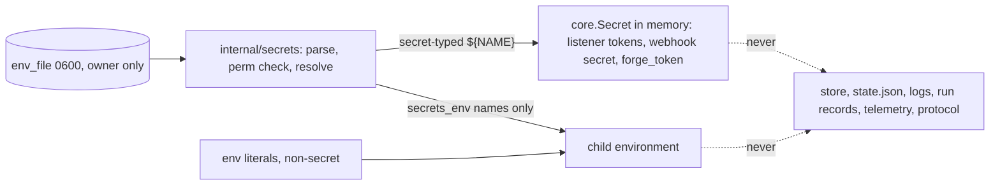

# ADR-0038: One secret mechanism — `env_file`, `${NAME}` references and a `secrets_env` allowlist

## Context and Problem Statement

ADR-0008 keeps secrets out of `harness.toml` by putting them in files. Every
feature since then has built its own variant of that rule:

| Where | Key | What happens today |
|---|---|---|
| `[harness.*]` | `env_file` | Parsed at every spawn by the supervisor. **Every** `KEY=VALUE` in it is appended to the child's environment, on top of the daemon's whole environment. A missing file is silently ignored; the file mode is never checked |
| `[channel.*]`, `[webhook.*]` | `env_file` + `${NAME}` | Parsed at config load by a second dotenv parser in `internal/config`, a copy kept in step with the supervisor's by a test because sharing it would be an import cycle. References resolve only from the table's own file. A literal webhook `secret` is refused. A group- or other-readable file is a warning |
| `[telemetry]` | `env_file` | Read through the supervisor's parser for the standard `OTEL_EXPORTER_OTLP_*` names only. A `headers` key in `harness.toml` is refused |
| `[server]` | `metrics_token_file` | A third reader: the whole file is the token. A loose mode is a warning |
| `[harness.*.distill]` (ADR-0030, design only) | `credential_file`, `verifier_env_file` | Two more file kinds, so that the forge token never enters a model run's environment |

That is three parsers, four file conventions and three permission policies
(none, warn, warn). A fifth kind is on the way: the bearer tokens of the gRPC
listener (ADR-0034). The whole-file export on `[harness.*]` is also the reason
ADR-0030 needed a separate `credential_file`. As long as a harness receives
everything in its `env_file`, no credential can share a file with a model key and
still stay out of a model's environment.

What single mechanism should every table use to name a secret, what exactly
should a child process receive, and how do existing configurations get there?

## Decision Drivers

* **`harness.toml` holds no secret values.** It is routinely committed to a
  dotfiles repository (ADR-0008, ADR-0021).
* **Least privilege for children.** An agent CLI, often running with permission
  prompts off, should receive the credentials it uses and nothing else. This is
  ADR-0030's guarantee that the forge token never reaches a model run, made
  general.
* **One parser, one permission rule, one error vocabulary**, shared by the
  supervisor and config loading without an import cycle.
* **The CLI and the daemon agree.** Resolution must not depend on the
  environment of whichever process parsed the config (the reason `[webhook.*]`
  already refuses to read the daemon's environment).
* **Secrets never persist.** No resolved value reaches `state.json`, the store,
  the durable log, run records, telemetry or the protocol.
* **Existing installs keep working** through a deprecation window with a named
  migration step. No silent credential loss at upgrade.
* **A backend can plug in later.** OpenBao or another secret store should be a
  new resolver, not a new syntax.

## Considered Options

### Decision 1 — How a table names a secret

* Option 1 — A purpose-specific file key per secret (`credential_file`,
  `metrics_token_file`, `verifier_env_file`, …)
* Option 2 — Every table names an `env_file` and refers to values as `${NAME}`
* Option 3 — Resolve `${NAME}` from the daemon's own environment
* Option 4 — A secret-backend client in the daemon now (OpenBao API)

### Decision 2 — What a child process receives

* Option 1 — The whole `env_file`, as today
* Option 2 — An explicit `secrets_env` allowlist of names from the table's
  `env_file`, plus non-secret literals in `env`
* Option 3 — Nothing; agents read credential files themselves

### Decision 3 — Migrating `[harness.*] env_file`

* Option 1 — Keep the whole-file export as the permanent default
  (an implicit `secrets_env = ["*"]`)
* Option 2 — Break at once: no `secrets_env` means nothing is exported
* Option 3 — One release of warnings, then the default flips to nothing, with
  `secrets_env = ["*"]` kept as an explicit opt-in

## Decision Outcome

Decision 1: chosen option: **Option 2 — Every table names an `env_file` and
refers to values as `${NAME}`**, because `[channel.*]` and `[webhook.*]` already
prove the design, and extending it retires three file conventions, two parsers
and the reason ADR-0030 needed `credential_file`.

Decision 2: chosen option: **Option 2 — An explicit `secrets_env` allowlist**,
because it makes "what does this agent hold" readable in the config. It also lets
one file serve both a harness and an in-process consumer without leaking the
latter's secret to the former.

Decision 3: chosen option: **Option 3 — One release of warnings, then the default
flips**, because silently dropping `ANTHROPIC_API_KEY` from every agent at upgrade
is an outage, while keeping whole-file export as the default forever keeps the
leak this ADR exists to close.

### The rules

1. **A table that needs secrets names one `env_file`.** Tables that can do so:
   `[harness.*]`, `[harness.*.distill]`, `[harness.*.distill.verifier]`,
   `[channel.*]`, `[webhook.*]`, `[telemetry]`, `[server]`, and the client-side
   `[remote.*]` of ADR-0034. The format is today's: `KEY=VALUE`, `#` comments, an
   optional `export ` prefix, one layer of surrounding quotes. A path is resolved
   relative to the config file that names it, and `~` expands.
2. **`${NAME}` resolves from that table's own `env_file` and nowhere else**: not
   from the daemon's environment, and not from another table's file. An
   undefined name is a load error that names the key and the reference, never
   the file's contents.
3. **Secret-typed keys accept only references.** A literal is a load error, as
   `[webhook.*] secret` is today. The secret-typed keys are `[webhook.*] secret`,
   `[server] metrics_token`, `[[server.grpc_client]] token`, `[remote.*] token`,
   `[harness.*.distill] forge_token`, and any `[channel.*] headers` value whose
   header name is `Authorization`, `Proxy-Authorization` or `Cookie`, or
   contains `token`, `secret`, `key` or `auth`. Such a value may embed a
   reference in text (`"Bearer ${SWITCHBOARD_TOKEN}"`), but it must contain at
   least one.
4. **In-process references never enter an environment.** A value referenced by a
   key is resolved by the Harness process that uses it (the daemon for listeners
   and sources, `harness distill` for `forge_token`, the CLI for `[remote.*]`).
   It is held as a `core.Secret`, whose every rendering is `***`.
5. **A child receives exactly:** the daemon's environment (which holds no
   credentials, by SPEC-0010 "Secrets Exclusion"), the names in `secrets_env` with
   values from its `env_file`, the literals in `env`, and the reserved run-context
   variables (`HARNESS_RUN_ID`, `HARNESS_EVENT_FILE`, …), applied last as today.
   `secrets_env` naming a key the file does not define is a load error. Session
   discovery, which reads relocation keys such as `CLAUDE_CONFIG_DIR` "as the
   child sees them", uses this same composition, so it can never see a value
   the child was not given.
6. **`env` is for non-secrets.** An `env` key whose name matches the credential
   names the log masker already recognises (`token`, `secret`, `password`,
   `api_key`, `access_key`, `private_key`, …) is a load error that points at
   `secrets_env`.
7. **A name cannot be both.** If a name is referenced by a secret-typed key in a
   table, it cannot also appear in the same file's `secrets_env`, and
   `secrets_env = ["*"]` is refused on any file that some secret-typed key reads.
   This is the load-time check that keeps the forge token out of the distiller
   harness's environment.
8. **One permission rule, enforced.** Every `env_file`, and every file-shaped
   secret that stays a path (TLS private keys, the SSH host key), must be a
   regular file owned by the daemon's uid, with no group or other bits (`0600` or
   `0400`). Otherwise it is refused. A named `env_file` that does not exist is an
   error for every table, including `[harness.*]`, where today it is silently
   ignored.
9. **Never persisted.** Resolved values are `core.Secret` in memory only. The
   store, `state.json`, run records, the durable and per-run logs, telemetry, the
   events file and every protocol message may carry an `env_file` *path* and
   `secrets_env` *names*, and never a value. `describe` shows names.

One shared leaf package, `internal/secrets`, which imports only `internal/core`,
owns the parser, the permission check, reference expansion, the
sole-reference test and the `Resolver` interface. The supervisor and
`internal/config` both import it, so the duplicate parser and
`TestEnvFileFormatMatchesSupervisor` are deleted.

### What it looks like

```toml
[server]
env_file      = "~/.config/harness/server.env"
metrics_token = "${HARNESS_METRICS_TOKEN}"          # was metrics_token_file

[harness.reviewer]
cmd      = "claude"
env_file = "~/.config/harness/env/reviewer.env"     # also holds CAIRN_TOKEN, GITEA_TOKEN
secrets_env = ["ANTHROPIC_API_KEY", "CAIRN_TOKEN"]     # GITEA_TOKEN stays behind
env      = { CLAUDE_CONFIG_DIR = "/srv/agents/reviewer/.claude" }

[harness.distill-go]
harness = "command"
argv    = ["harness", "distill", "run", "distill-go"]
# no env_file: `harness distill` needs no environment secret

[harness.distill-go.distill]
env_file    = "~/.config/harness/forge/go-stack.env"
forge_token = "${FORGE_TOKEN}"                      # was credential_file; resolved in-process

[harness.distill-go.distill.verifier]
env_file = "~/.config/harness/verifier.env"         # was verifier_env_file
secrets_env = ["ANTHROPIC_API_KEY"]                    # the only credential a model run gets
```

The distiller keeps ADR-0030's split exactly. The forge token lives in a file
that only the `distill` table names. `harness distill` resolves it in process and
never exports it. The verifier table names a different file and passes one
name. A model run cannot receive the forge token through any key, because no
table that feeds a model's environment names the forge file.



### Migration

Release N, the release that ships this ADR's code:

* `[harness.*] env_file` without `secrets_env` still exports the whole file. At load
  it warns once per harness, naming the keys it exports (names, never values).
  `harness config migrate-env` writes `secrets_env = [...]` listing those names into
  `harness.toml`, so the operator's next step is to delete the ones the agent
  does not need.
* `metrics_token_file` and the ADR-0030 `credential_file`/`verifier_env_file`
  keys are still accepted, with a warning that names the replacement. ADR-0030
  has no code yet, so its keys may be dropped outright instead.
* A loose file mode, or a missing `[harness.*] env_file`, is a warning.

Release N+1:

* No `secrets_env` means no `env_file` values reach the child. `secrets_env = ["*"]`
  keeps whole-file export as an explicit, visible choice, and `harness doctor`
  lists every harness that uses it.
* The deprecated keys, the loose-mode warning and the missing-file warning become
  load errors.

Files do not move. Operators whose `env_file`s are rendered by OpenBao Agent or
Vault Agent templates keep them exactly as they are.

### Later: a secret backend behind the same syntax

`internal/secrets` resolves through an interface:

```go
// Resolver looks up one named secret. The file resolver is the only one
// shipped; a backend resolver is added without changing ${NAME} syntax.
type Resolver interface {
	Lookup(ctx context.Context, name string) (core.Secret, bool, error)
	Source() string // a path or URI for errors and describe, never a value
}
```

A later ADR can add a `secret_source` key, mutually exclusive with `env_file`,
that takes a URI (`openbao://kv/harness/reviewer`) and selects a backend
resolver. `${NAME}`, `secrets_env`, rules 3 to 9 and every consumer stay the same.
The backend's own bootstrap credential, such as an AppRole secret ID or a token
file, is then the one file-shaped secret that feeds it, under rule 8. Until
then, the supported OpenBao path is the one already in use: an agent renders
`env_file`, and Harness never talks to the backend.

### Consequences

* Good, because every secret in the system is found by one question: which
  `env_file`, which name. The duplicate parser, the three permission policies
  and two ADR-0030 file kinds disappear.
* Good, because an agent's credential set is reviewable in `harness.toml`, and a
  file can hold more than one consumer's secrets without handing all of them to
  the child.
* Good, because the forge-token guarantee of ADR-0030 becomes a load-time rule
  (rule 7) plus a table boundary, instead of an extra file type.
* Good, because TLS, token and SSH listener credentials (ADR-0020, ADR-0021,
  ADR-0034) all share one resolver and one refusal story.
* Bad, because release N+1 breaks every `[harness.*] env_file` that has no
  `secrets_env`. The warning, the migration command and `harness doctor` make the
  change visible, but it is still a flag day for operators who skip release N.
* Bad, because enforcing the permission rule refuses setups that work today
  (a `0640` file shared with a group, or a file owned by a service account).
  That is the intent, but it will surface as upgrade friction.
* Bad, because a secret whose name is not in `secrets_env` is still readable by the
  child if it knows the path, since every process runs as the same user. This is
  least privilege for the environment, not a sandbox.
* Neutral, because the daemon's own environment is still inherited. It is kept
  credential-free by SPEC-0010 rather than filtered by this ADR.
* Neutral, because env files are still not watched. A rotated value reaches a
  listener on `harness reload`, and a child on its next spawn.

### Confirmation

* **The forge token never reaches a model run.** An end-to-end test on Linux runs
  a distiller whose verifier command writes `/proc/self/environ` to a file. It
  asserts the forge token's bytes appear neither there nor in
  `/proc/<pid>/environ` of the `harness distill` process. The same capture finds
  `ANTHROPIC_API_KEY`, which is passed, so the check is shown to fire. Pointing
  the verifier table at the forge file with `secrets_env = ["FORGE_TOKEN"]` fails
  the load under rule 7.
* **`secrets_env` is exact.** A child spawned with a three-key `env_file` and
  `secrets_env = ["A"]` has `A` in its environment, and neither `B` nor `C`. The
  test reads the child's real environment, not `buildEnv`'s return value.
* **Literals are refused.** Config tests cover each secret-typed key with a
  literal value, and assert both the load error and that the error text does not
  contain the literal.
* **Permissions are uniform.** One table-driven test runs every table kind
  against a `0644` file, a file owned by another uid, and a missing file, and
  asserts the same verdict for all of them: a warning in release N, an error in
  release N+1.
* **One parser.** The shipped binary carries only the shared reader:
  `go tool nm harness | grep -cE 'config\.unquoteEnvValue|supervisor\.parseEnvFile|metrics\.readToken'`
  is 0.
* **Nothing persisted.** A test resolves a sentinel secret through each table
  kind, runs one start, one run and one telemetry flush, then greps
  `state.json`, the store, the durable log, the run log and the events file for
  the sentinel. It asserts zero matches. The same grep over a deliberately
  leaked copy returns one, which shows the grep can fire.

## Pros and Cons of the Options

### Decision 1 — How a table names a secret

#### Option 1 — A purpose-specific file key per secret

* Good, because each file holds exactly one secret, so a mistake cannot hand over
  a neighbouring one.
* Good, because it is simple to read one value from one file.
* Bad, because every feature invents a key, a reader and a permission policy;
  there are already three.
* Bad, because a secret backend renders one env file per consumer far more
  naturally than a directory of single-value files.
* Bad, because the value's name, which is what `describe`, errors and
  `harness doctor` can show, is lost.

#### Option 2 — Every table names an `env_file` and refers to values as `${NAME}`

* Good, because `[channel.*]` and `[webhook.*]` already work this way. The
  reasoning of ADR-0021 (one declared file, identical answers from the CLI and
  the daemon) carries over unchanged.
* Good, because references can embed in text (`Bearer ${TOKEN}`) where a header
  needs it.
* Good, because the `${NAME}` syntax is backend-neutral.
* Bad, because a single file can hold several consumers' secrets. That is only
  safe together with Decision 2 and rule 7.

#### Option 3 — Resolve `${NAME}` from the daemon's own environment

* Good, because it matches how most twelve-factor tools work.
* Bad, because every supervised child inherits the daemon's environment, so
  every secret would reach every agent (the reason `metrics_token_file` exists).
* Bad, because the CLI and a systemd-started daemon have different
  environments, and would disagree about what a config means.

#### Option 4 — A secret-backend client in the daemon now

* Good, because it offers central rotation and audit, with no files at rest.
* Bad, because the daemon gains a network dependency on the backend at start and
  at every reload, plus the backend's own bootstrap credential.
* Bad, because it serves only operators who run that backend. Agent-rendered
  files already give OpenBao users the same result.
* Neutral, because the `Resolver` interface keeps this open as a later addition.

### Decision 2 — What a child process receives

#### Option 1 — The whole `env_file`, as today

* Good, because it needs no configuration beyond the path.
* Bad, because an agent receives every credential in the file, including ones
  meant for Harness itself. That is why ADR-0030 needed a separate file type.
* Bad, because what an agent holds is only visible by reading the secret file.

#### Option 2 — An explicit `secrets_env` allowlist, plus `env` literals

* Good, because the config states what each agent receives, by name.
* Good, because a single rendered file can serve a harness and an in-process
  consumer safely.
* Bad, because the list must be kept in sync with what the agent actually needs.
  A missing name surfaces as an agent authentication failure, not a Harness
  error.

#### Option 3 — Nothing; agents read credential files themselves

* Good, because no secret ever passes through Harness.
* Bad, because agent CLIs authenticate from environment variables
  (`ANTHROPIC_API_KEY`, `CLAUDE_CODE_OAUTH_TOKEN`), and their MCP configurations
  expand `${VAR}` from the environment (ADR-0024). Harness cannot change that.

### Decision 3 — Migrating `[harness.*] env_file`

#### Option 1 — Keep whole-file export as the permanent default

* Good, because nothing breaks.
* Bad, because the safe behaviour is opt-in forever, and new configs copied from
  old ones keep the leak.

#### Option 2 — Break at once

* Good, because there is one semantics from day one.
* Bad, because every agent loses its credentials at upgrade, with no warning
  release in between.

#### Option 3 — One release of warnings, then flip, with `"*"` as an opt-in

* Good, because operators get a release in which the daemon names each exported
  key, and a command writes the allowlist for them.
* Good, because `secrets_env = ["*"]` remains for the operator who wants it, visibly,
  and rule 7 still stops it where it would leak an in-process secret.
* Bad, because it costs two releases of compatibility code and documentation.

## More Information

* **Extends ADR-0008** — secrets stay in files outside `harness.toml`. This ADR
  makes that one mechanism with one permission rule, and moves "the child gets
  the file" to "the child gets the names it was given".
* **Related ADR-0030** — `credential_file` and `verifier_env_file` are replaced
  by `forge_token = "${…}"` on the `distill` table and a `verifier` sub-table
  with its own `env_file` and `secrets_env`. ADR-0030's text is updated when this
  ADR is accepted, not in this proposal.
* **Related ADR-0020** — `metrics_token_file` becomes `[server] metrics_token`,
  resolved from `[server] env_file`. SPEC-0013 REQ-1 is updated on acceptance.
* **Related ADR-0021** — the `[channel.*]` and `[webhook.*]` resolution rules
  are the model for this ADR, and their behaviour is unchanged apart from the
  enforced file mode.
* **Related ADR-0022** — `[telemetry] env_file` keeps supplying the standard
  `OTEL_EXPORTER_OTLP_*` names through the shared resolver; there is still no
  `headers` key.
* **Related ADR-0024** — generated persona `env_file`s gain a generated
  `secrets_env` naming the tokens that the persona's MCP configuration expands.
* **Related ADR-0034** — the gRPC listener's bearer tokens and the client's
  `[remote.*] token` are secret-typed keys under this ADR.
* Source: the two parsers this ADR merges are `parseEnvFile` in
  [`internal/supervisor/spawn.go`](https://github.com/stump-wtf/harness/blob/main/internal/supervisor/spawn.go)
  and `envResolver` in
  [`internal/config/trigger.go`](https://github.com/stump-wtf/harness/blob/main/internal/config/trigger.go);
  the third reader is `readToken` in
  [`internal/metrics/server.go`](https://github.com/stump-wtf/harness/blob/main/internal/metrics/server.go).
* **Deferred:** accepting a root-owned, group-readable secret file under rule 8
  (a common layout for system-rendered secrets). Until then, such files are
  rendered owned by the daemon's user. Also deferred: an `inherit_env` allowlist
  over the daemon's own inherited environment, for harnesses that want a clean
  room.
