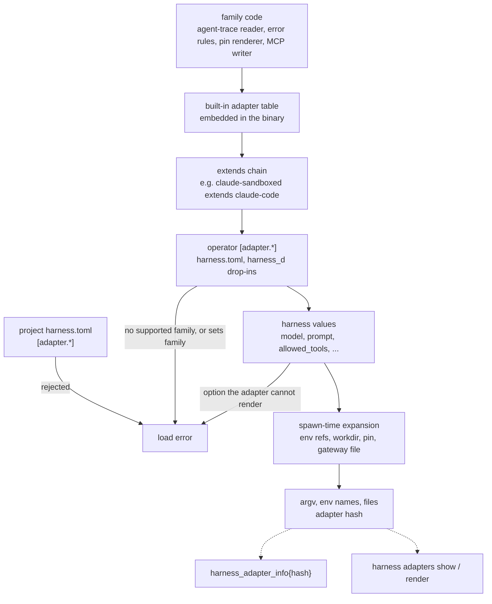

# ADR-0039: Adapters are configured once, centrally

> **Not yet implemented.** Design stage. Adapters are a hard-coded Go registry
> today, and `[adapter.*]` tables are not parsed.

## Context and Problem Statement

An adapter is everything Harness knows about one agent CLI (ADR-0011): how to
start it, how to turn per-harness options into flags, where its transcripts
live, and, as designed, where its skills come from and go. Today that knowledge
is Go code, and it is spread across the tree:

| Knowledge | Where it lives today |
|---|---|
| The adapter set and the default executable | `internal/adapter/adapter.go` (`NewRegistry`, `Executable`) |
| One-shot argv and option flags | `PromptCommand` per adapter in the same file |
| The allowed values of the `harness` key | a hard-coded switch in `internal/config/config.go`, and again in `internal/tui/form.go` |
| Transcript store roots and the variables that relocate them (`CLAUDE_CONFIG_DIR`, `CODEX_HOME`, `CRUSH_GLOBAL_DATA`) | `internal/runtrace/runtrace.go` |
| Which adapters can be observed, and whose errors are | `internal/metrics/metrics.go` (`Observable`, `ErrorsObservable`) |
| Provider error phrasing per adapter | `internal/metrics/classify.go` (`adapterRules`) |

The consequences are concrete:

* **Adding a client is a release.** Pi and OMP need code in at least five
  places. ADR-0024 refuses `pi-omp` until ADR-0023's command kind lands, and a
  user wrote a `harness-omp` wrapper to get around it.
* **A different binary or flag is a fork.** Pointing `claude-code` at a wrapper
  script, a pinned path or a newer flag has no configuration surface. The
  operator either passes everything through `args` on every harness or waits
  for a release.
* **Unsupported options are silent.** `max_turns` on a Crush harness is
  accepted and dropped, because Crush has no such flag (issue #59). A `prompt`
  on a `generic` harness runs Crush's argv, and a `generic` harness is never
  observed at all.
* **Per-harness keys keep growing.** ADR-0011 adds `skill_paths`, ADR-0024
  adds `system_prompt_file`, `mcp_config` and `allowed_tools`, ADR-0026 adds
  `model_pin`, SPEC-0005 adds `mcp_bridge`, and the MCP gateway (ADR-0035)
  adds `mcp_policy` and `mcp_exclusive`. Each needs a per-client
  rendering, and the rendering again lives in code.
* **Hosts drift invisibly.** Two hosts running the same Harness version can run
  different client versions with different flags. Nothing reports which
  effective adapter a host is using.

The owner asked for adapters to be "more globally/centrally managed". This ADR
reads that as two things: an adapter is **declared once per install**, not
restated on each harness; and the declaration **reaches every host from one
managed source**, through the stack installer (ADR-0024) or the operator's
dotfiles, with drift visible. It does not read it as a network service that
hands adapter definitions to remote daemons; that is deferred (see
[Central management across hosts](#central-management-across-hosts)).

ADR-0033 fixes the other boundary: Harness supervises only agents whose
transcripts agent-trace can read. Today agent-trace has adapters for
claude-code, codex, crush, opencode, pi and omp. A harness that names no such
agent, including `harness = "generic"`, is a load error. There is no
trace-less fallback, so every adapter this ADR configures must land on an
agent-trace reader.

**Where should adapter knowledge live so that it is declared once, overridable
without a release, explainable per field, the same on every host, and still
unable to turn the daemon into an agent-aware component?**

## Decision Drivers

* **One place per install.** How a client is invoked is stated once, and every
  harness using that client inherits it.
* **Mechanism versus value.** A harness says *what* (its model, prompt,
  budget, tools). The adapter says *how* the client is invoked. Per-harness
  keys must not be able to rewrite how.
* **Fail closed.** An option the client cannot honor is a load error, never a
  silent no-op (the ADR-0026 principle).
* **Explainable.** An operator can ask what a harness will run, and where each
  part of that came from.
* **The daemon stays agnostic.** Configuration selects among behaviors that
  code implements, such as a transcript parser or a pin renderer. It never
  becomes a way to add code.
* **Untrusted files cannot redefine clients.** A cloned repository's project
  file must not change how `claude` is launched for the operator's global
  harnesses.
* **Hosts converge.** The same declaration on every host, and a way to see
  when they differ.

## Considered Options

* **Option 1 — A hard-coded registry plus per-harness keys (status quo).**
  Adapters stay Go code; new behavior arrives as new per-harness keys and new
  code in each adapter.
* **Option 2 — Global `[adapter.<name>]` tables over built-in defaults.** Each
  built-in adapter is expressed in the same schema as an embedded default. An
  operator table overrides it field by field or defines a new adapter that
  extends one. Harnesses select an adapter by name.
* **Option 3 — Adapter plugins as external binaries or manifests.** Each adapter
  is a separately installed executable, or a manifest package, that answers the
  adapter interface (argv, roots, wiring) over a small protocol.

## Decision Outcome

Chosen option: **Option 2 — global `[adapter.<name>]` tables over built-in
defaults**, because it moves every invocation detail into one declarative
table per client, which makes adding a wrapper, a path or a new CLI built on a
known family a configuration change. Parsers, renderers and wiring stay code
that a table can only select, and every adapter resolves to a family that
agent-trace supports (ADR-0033).

### Families are code; adapters are data

A **family** is the code Harness must have for a kind of client:

* the agent-trace reader for its transcripts and, where the client emits one,
  its structured output stream (ADR-0033),
* the provider-error rules (`classify.go`),
* the model-pin renderer (ADR-0026),
* the MCP config file writer the gateway wiring uses (ADR-0035).

**The family is how Harness selects the agent-trace reader.** Each family maps
to exactly one agent-trace adapter, so every family is observable and there is
no family without a reader. The families are `claude-code`, `crush` and
`codex`. `pi` is the next family, because agent-trace already reads Pi and OMP
transcripts. `generic` is not a family: `harness = "generic"`, or any adapter
name that does not resolve to a family, fails the load (ADR-0033). Adding a
family is a Harness release, and that is deliberate: it is where
agent-awareness is fenced.

An **adapter** is a named table that picks one family and supplies everything
else as data. Each family ships a built-in adapter of the same name, embedded
in the binary in the same TOML schema an operator writes.
`harness adapters show claude-code` prints it.

```toml
# Built-in default for claude-code, embedded in the binary (shown for reference)
[adapter.claude-code]
family       = "claude-code"
executable   = "claude"
version_argv = ["--version"]
min_version  = "2.1.0"
one_shot     = ["-p", "{{opt.auto_accept}}", "{{opt.model}}", "{{opt.max_turns}}",
                "{{opt.system_prompt_file}}", "{{opt.allowed_tools}}",
                "--verbose", "--output-format", "stream-json", "{{prompt}}"]

[adapter.claude-code.options]      # absent option = unsupported = load error when set
auto_accept        = ["--dangerously-skip-permissions"]
model              = ["--model", "{{value}}"]
max_turns          = ["--max-turns", "{{value}}"]
system_prompt_file = ["--append-system-prompt-file", "{{value}}"]
allowed_tools      = ["--allowedTools", "{{value}}"]     # repeated per list value

[adapter.claude-code.transcripts]
roots = ["${CLAUDE_CONFIG_DIR:-~/.claude}/projects"]

[adapter.claude-code.skills]       # ADR-0011 questions 1 and 2
roots  = ["~/.claude/skills", "{{workdir}}/.claude/skills"]
target = "~/.claude/skills"

[adapter.claude-code.mcp]          # how the gateway bridge is wired (SPEC-0005, ADR-0035)
method    = "flag"                 # flag | env | none
argv      = ["--mcp-config", "{{file}}"]
exclusive = ["--strict-mcp-config"]
allow     = ["--allowedTools", "mcp__harness__*"]
exposure  = "full"                 # default gateway exposure mode for this client

[adapter.claude-code.pin]          # ADR-0026
routes = ["anthropic", "litellm"]

[adapter.claude-code.env]
pass = ["ANTHROPIC_API_KEY", "CLAUDE_CODE_OAUTH_TOKEN"]   # default secrets_env (ADR-0038)
```

The Crush built-in shows why argv is a template rather than a flag list. Crush's
`--yolo` is a global flag and must come before the `run` subcommand, and Crush
has no turn cap:

```toml
[adapter.crush]
family     = "crush"
executable = "crush"
one_shot   = ["{{opt.auto_accept}}", "run", "{{opt.quiet}}", "{{opt.model}}", "{{prompt}}"]

[adapter.crush.options]
auto_accept = ["--yolo"]
quiet       = ["--quiet"]
model       = ["--model", "{{value}}"]
# no max_turns: setting it on a crush harness fails the load
```

**Templates** reuse ADR-0023's closed placeholder grammar and add one form. An
argv element that is exactly `{{opt.<name>}}` expands to that option's rendered
elements, or to nothing when the harness leaves it unset. `{{prompt}}` must
appear exactly once. `{{value}}` is the option's value, and a list-valued option
repeats its template once per value. Option names form a closed set: the
per-harness keys listed below. An unknown `{{opt.*}}` fails the load. Paths
accept `{{workdir}}`, `{{harness}}` and `{{state}}`, plus `${VAR:-default}`,
resolved from the harness's `env_file` layered over the daemon's environment.
That is exactly how SPEC-0006's run correlation resolves transcript stores
today.

### Declaring and overriding

Operators write `[adapter.<name>]` tables in the global `harness.toml` or in
`harness_d` drop-ins, which today accept only `[harness.*]` and now also accept
`[adapter.*]`.

```toml
# ~/.config/harness/harness_d/00-adapters.toml
[adapter.claude-code]
executable = "/opt/homebrew/bin/claude"   # one field; everything else stays built-in

[adapter.claude-sandboxed]                # a variant, instead of per-harness args
extends    = "claude-code"
executable = "~/bin/claude-in-sandbox"

[adapter.crush-dev]                       # a local build of a supported client
extends    = "crush"
executable = "~/src/crush/crush"
```

* **A table with a built-in's name overrides that built-in field by field.**
  Nested tables merge by key, and arrays replace.
* **A table with a new name must set `extends`** to a built-in or another
  table. It inherits that adapter's family and fields. A cycle, a missing
  `extends`, or an `extends` chain that ends anywhere but a built-in family
  (`extends = "generic"`, or `extends = "pi"` before the pi family ships) fails
  the load.
* **`family` is not an operator key.** It is inherited through `extends` from a
  built-in and cannot be set or changed in any operator table. A family selects
  code, the argv rendering and the agent-trace reader, that configuration
  cannot supply; letting a table name a family would let a table claim a
  reader for a transcript format nobody wrote a reader for.
* **At most one table per adapter name** across `harness.toml` and all drop-ins,
  as with harness names. A duplicate fails the load and names both files.
* **Project files cannot declare `[adapter.*]`**, joining ADR-0009's
  global-only list. A project harness can only *select* an adapter.
* **Harnesses select an adapter with the existing `harness` key**:
  `harness = "claude-code"`, `harness = "claude-sandboxed"`. ADR-0011 called this key
  `agent`; the config renamed it to `harness` and rejects `agent` with a
  migration error, and that stays. The key's allowed values become the declared
  adapter names, replacing the switches in `config.go` and `tui/form.go`.
  `generic` is not among them.

### What a harness may still set

Per-harness keys are limited to **values**:

* `args` (resident harnesses),
* `model` or `model_pin`,
* `auto_accept`, `max_turns`, `quiet`,
* `system_prompt_file`, `mcp_config`, `allowed_tools`,
* `skill_paths`, `use_default_skill_paths`,
* `mcp_bridge`, `mcp_exclusive`, `mcp_policy`,
* `env_file`, `secrets_env`.

Each value renders through the selected adapter. A harness cannot set an
executable, a template, a root, a family or a wiring method. A harness that
needs any of those selects a different adapter, which is one table, not a
per-harness escape hatch. Setting a value the adapter has no rendering for
fails the load, naming the harness, the adapter and the option.

### Resolution

At load, each adapter resolves once: family code, then the built-in table, then
the `extends` chain, then the operator's table. At spawn, the harness's values
and the environment are applied. The result is the effective adapter, and its
**adapter hash** is a SHA-256 over its canonical JSON form. That hash feeds the
harness's `config_hash`, which ADR-0035 records on every MCP call and
which run records carry.

A reload that changes an adapter applies at the next spawn. A running harness
keeps the argv it was spawned with. `harness adapters list` marks it as running
under a stale hash until it restarts.

### `harness adapters`

| Command | Shows |
|---|---|
| `harness adapters list` | name, family, `extends`, source file, harnesses using it, detected client version, stale-hash count |
| `harness adapters show <name> [--json]` | the effective, merged table, each field annotated with its provenance: `builtin`, `harness.toml:41`, `harness_d/00-adapters.toml:7`, or `extends claude-code` |
| `harness adapters diff <name>` | the effective table against its built-in |
| `harness adapters render <harness>` | the argv, the names (never values) of environment variables, and the generated files a spawn would produce now, without spawning |

The daemon answers these for the configuration it actually loaded; `--local`
evaluates the files on disk instead. `render` shows the **next** spawn. The
argv of the **running** process is what `harness describe` reports, and after a
reload the two can differ.

### Central management across hosts

* **Built-ins travel with the binary.** A Harness release pins its built-in
  adapters and the minimum client versions they were tested against. The stack
  manifest (ADR-0024) pins the Harness release, so a host's built-ins follow
  from its manifest.
* **Host deviations live in one drop-in.** `harness init` and `harness stack`
  write `harness_d/00-adapters.toml` only for what differs on that host, such as
  an executable path or a wrapper. They follow ADR-0024's converge rules: a
  file they did not create is never rewritten, and a changed answer shows a
  diff first. An operator who renders dotfiles on every host (chezmoi, for
  instance) owns the same file instead.
* **Drift is a metric.** On the ADR-0020 listener:
  `harness_adapter_info{adapter,family,hash,client_version} 1`. A query
  grouping by `adapter` and `hash` across hosts shows which hosts disagree
  about an adapter's effective configuration or client version.
* **`harness doctor` checks each adapter in use**: the executable resolves,
  `version_argv` reports at least `min_version`, and every configured transcript
  root exists or is creatable.
* **One declaration per install is the whole of "centrally managed".** The
  global `[adapter.*]` tables are the one declaration, and the stack installer
  or the operator's dotfiles carry it to every host. A Harness instance serving
  adapter definitions to other instances over the network control plane
  (ADR-0034) is deferred: the metric already shows drift, and a served
  definition would make one daemon's config a dependency of another's spawn.

### Consequences

* Good, because adding a wrapper, a pinned path, a flag change or a new CLI on
  a known family is one table and no release.
* Good, because the six places that know about adapters today collapse into one
  resolved object that config validation, the supervisor, runtrace, metrics and
  the TUI all read.
* Good, because unsupported options fail the load, which fixes today's silent
  `max_turns` on Crush.
* Good, because every adapter resolves to an agent-trace reader, so every
  supervised harness is observed and has a run record (ADR-0033). A `generic`
  harness, or an adapter with no supported family, fails the load instead of
  running unobserved.
* Good, because `harness adapters show` and `render` answer "what will this run,
  and why" per field.
* Good, because the adapter hash makes host drift a dashboard query.
* Bad, because the adapter schema becomes a public interface. Renaming a field
  or a placeholder is a breaking change for every operator who overrode it.
* Bad, because an operator override can break a client in ways the built-in
  would not: a wrong template produces an argv the client rejects. The failure
  is loud at spawn, not silent, but it is new.
* Bad, because two configuration files (the managed drop-in and an operator
  edit) can fight over one adapter table. The one-table-per-name rule turns the
  fight into a load error rather than a silent winner.
* Bad, because a new family still needs a Harness release. A client with a new
  transcript format cannot be supervised at all until agent-trace reads it and
  a release adds the family. Configuration cannot fill that gap, by design.
* Neutral, because turning `max_turns` on Crush into a load error, and removing
  `generic`, break configurations that rely on them. The errors name the fix:
  drop the option, or select an adapter on a supported family.

### Confirmation

SPEC-0006 is revised on acceptance to cover the adapter schema, resolution and
the CLI. The acceptance tests that matter:

* With no `[adapter.*]` tables, every built-in adapter renders the same argv as
  today's `PromptCommand` for every combination of options. This is a golden
  test recorded against the current code before that code is removed.
* `[adapter.claude-code] executable = "/x/claude"` changes only the executable.
  `harness adapters show` attributes that field to its file and line, and every
  other field to `builtin`.
* `max_turns` on a `crush` harness fails the load with an error naming the
  harness, the adapter and the option.
* `harness = "generic"` fails the load, naming the harness and listing the
  supported adapters.
* A new-name table whose `extends` chain ends at an unknown name
  (`extends = "generic"`) fails the load, naming the file and the table.
* A table that sets `family`, on a built-in name or a new one, fails the load.
* Every built-in adapter's family maps to an agent-trace adapter; a test
  enumerates the built-ins and fails on any family without a reader.
* A project `harness.toml` containing `[adapter.x]` fails the load.
* An `extends` cycle, a new-name table without `extends`, and a duplicate table
  across two drop-ins each fail the load, naming the files.
* `transcripts.roots` resolved for a harness whose `env_file` sets
  `CLAUDE_CONFIG_DIR` matches what `runtrace.Store` resolves today.
* The argv that `harness adapters render <h>` prints equals the argv of the
  process a subsequent start spawns, read from the process table, not from the
  config.
* After a reload that changes an adapter, a running harness keeps its argv, is
  listed as stale, and its next spawn uses the new argv.
* Two hosts with identical effective adapters report the same
  `harness_adapter_info` hash, and changing one field on one host changes only
  that host's hash.

## Pros and Cons of the Options

### Option 1 — A hard-coded registry plus per-harness keys

* Good, because invocation details are type-checked Go with tests, and nothing
  about them can be misconfigured.
* Good, because it needs no new schema or CLI.
* Bad, because every new client, wrapper or flag change is a code change and a
  release, which is what drove a user to write their own wrapper.
* Bad, because adapter knowledge stays spread across six packages, and the
  switches drift apart.
* Bad, because the per-harness key list grows with every feature, each key
  with hidden per-client rendering.
* Bad, because nothing explains or compares the effective invocation across
  hosts.

### Option 2 — Global `[adapter.<name>]` tables over built-in defaults

* Good, because invocation is data declared once, overridable per field, and
  explainable per field.
* Good, because the family boundary keeps parsers, renderers and wiring in
  reviewed code, so the daemon's agnosticism is still enforced by what code
  exists.
* Good, because it fits the existing config model: global-only tables,
  `harness_d` drop-ins, ADR-0024's converge rules.
* Bad, because the schema and templates become an interface to keep stable.
* Bad, because a bad override is now possible, where before the only argv was
  the tested one.

### Option 3 — Adapter plugins as external binaries or manifests

* Good, because a plugin could add a new client, including a new transcript
  parser, with no Harness release at all.
* Good, because plugins could be versioned and distributed independently of
  Harness.
* Bad, because the daemon would execute a third-party binary on every spawn to
  learn how to spawn. That is a code-execution plugin surface in the
  supervisor, and ADR-0008's trust model has no place for it.
* Bad, because a plugin protocol needs versioning, discovery, installation and
  compatibility testing: an ecosystem to maintain for four or five clients.
* Bad, because transcript parsing lives in agent-trace, so a plugin that parses
  transcripts duplicates it or needs a second plugin interface there.
* Bad, because a manifest-only variant with no code is Option 2 in more files,
  with a packaging step added.

## Architecture Diagram



## More Information

* **Extends ADR-0011** — the adapter's three questions (skills from, skills to,
  trajectory at) become fields of one table, joined by invocation, MCP wiring
  and pin routes. The `agent` key it named is the existing `harness` key.
* **Related ADR-0006** — the file stays hand-authored and the source of truth.
  Built-ins are defaults, not generated config.
* **Related ADR-0009** — `[adapter.*]` joins the global-only list.
* **Related ADR-0020** — `harness_adapter_info`.
* **Related ADR-0023** — templates reuse its closed placeholder grammar. A
  client with no family is not a case: it cannot be supervised until
  agent-trace reads it (ADR-0033).
* **Related ADR-0024** — the stack installer writes host deviations to one
  drop-in and pins built-ins through the release it installs.
* **Related ADR-0026** — pin routes per adapter; the renderer stays family
  code.
* **Related ADR-0033** — Harness supervises only agents agent-trace reads;
  `generic` and adapters without a supported family are load errors. The
  family is how an adapter selects its agent-trace reader.
* **Decided alongside this ADR:** ADR-0035 (the gateway's wiring method and
  default exposure mode are adapter fields), ADR-0038 (default `secrets_env`
  per adapter).
* **Deferred:** serving adapter definitions from one Harness instance to
  others over the ADR-0034 network control plane. One declaration per install,
  distributed by the stack installer or dotfiles, is the decision.
