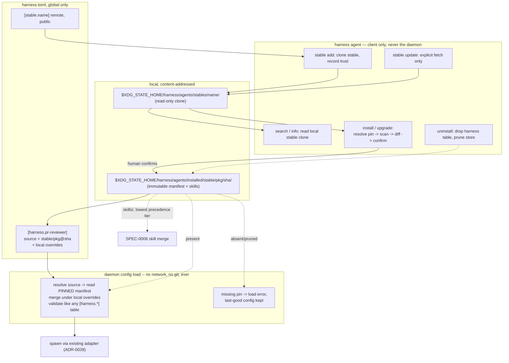

# ADR-0044: Agent package stables — installable, trust-gated harness definitions shared as git repositories

> **Partially implemented.** The daemon-side foundation is in the tree:
> the `package.toml` manifest loader, the pin-store layout and the `source`
> key on a `[harness.*]` table. Not yet built: the `harness agent` command,
> the `[stable.*]` table and every fetch, scan and confirmation flow.
> Tracked by the SPEC-0026 epic in the Harness issue tracker.

## Context and Problem Statement

Every harness definition today is either hand-written in `harness.toml`
(ADR-0006) or generated once by `harness stack`/`harness init` from a pinned,
first-party manifest (ADR-0024). There is no way to receive somebody else's
harness definition — a PR-reviewer agent with a curated system prompt and
checklist skill, a triage agent, a release-notes writer — short of copying
TOML out of a gist and hoping its referenced skill directory comes along
correctly. The owner wants to publish an agent config repository and let
other people, and future selves on other machines, install one or many
agents from it with one command, the way `brew tap` plus `brew install`
works, and wants the trust and injection-prevention boundary built at the
same time as the feature rather than bolted on after a demonstrated
compromise.

Two properties of what would be installed make this a materially larger
trust ask than anything the tree already does. First, a `[harness.*]` table
is inherently an **execution primitive**: the effective adapter (ADR-0039)
resolves it into a literal argv the daemon execs, so installing a package is
trusting its author to say *run this, with these arguments* — not merely
*here is some text to search*, which is all ADR-0030's skill repos ask.
Second, ADR-0011/ADR-0039 already made bundled skill content **always-visible,
projected context** with no gate between installation and an agent reading it,
where ADR-0030 built a whole blind-reconstruction pipeline before any
machine-authored skill reaches an agent's context at all. A hand-authored
package has no merged pull request to verify itself against, so that pipeline
has nothing to bite on here.

What should a package be allowed to declare, how does a human decide a git
remote is worth installing from at all, and what stops a package's bundled
natural-language content from being a prompt-injection delivery vector the
moment it is installed?

## Decision Drivers

* **The daemon stays agnostic and gains no new trust boundary.** It must
  resolve an already-installed, already-pinned package from local disk
  exactly the way it resolves a hand-written harness table, and it must
  never clone, fetch, or reach a stable's git remote itself — the same rule
  ADR-0030 already enforces for skill repos ("the daemon never fetches,
  because a private remote would need a credential").
* **Trust is an explicit, hand-authored act, never inherited from a cloned
  repository.** The "no supply-chain opt-in" house rule ADR-0029 and
  ADR-0030 already enforce for their own global-only tables must cover the
  new trust table too.
* **A package is data, never code.** It resolves to the same closed schema a
  hand-written `[harness.*]` table already uses (ADR-0006/ADR-0039): no
  scripting language, no install-time hook. A malicious package cannot
  execute anything until the human explicitly starts the harness it defines,
  and everything it will do is visible in that one table beforehand.
* **A package cannot smuggle credentials.** It must be structurally unable
  to set `env_file`, `secrets_env`, or a `${NAME}` reference (ADR-0038) —
  those stay something only the installing human adds locally, after
  install.
* **Bundled natural-language content is a first-class injection surface, not
  an afterthought.** Because skills project as always-visible context with
  no distiller-style review gate, every install and every upgrade must show
  the human what they are about to trust, in full, before it happens — the
  confirm-and-log discipline ADR-0023 already applies to one risky flag
  (`untrusted_inline`) generalizes here to an entire bundle.
* **Reuse ADR-0030's shape rather than inventing a fourth.** A named
  external source with declared visibility, a managed local clone the
  daemon treats as read-only, explicit sync instead of implicit polling, and
  namespacing by source name are already-accepted patterns.
* **One repository, many packages** — the Homebrew-tap requirement — so a
  single git remote can offer a whole family of agents, discoverable and
  installable independently.
* **No duplication with what already exists.** ADR-0024's stack installer
  installs Harness itself and first-party infra bundles by digest-pinned
  manifest; ADR-0039's central adapter config configures *how a client is
  invoked*, not *which harness runs*. A package only ever selects an
  existing adapter by name and supplies harness-level values, never a new
  adapter, and never a new stack.

## Considered Options

Four questions.

### Decision 1 — What a package is, and how it's found

* Option 1 — A single global registry/index (npm- or crates.io-style),
  centrally curated and searched by name.
* Option 2 — Git-repo stables, Homebrew-style: any git remote the operator
  explicitly names can hold any number of packages under a fixed layout; no
  central index at all.
* Option 3 — Ungrouped, one-off installs from a bare URL or path with no
  persistent trust record (`pip install <url>`-style).

### Decision 2 — How much a package manifest may declare

* Option 1 — Whatever a hand-written `[harness.*]` table can declare,
  verbatim, including `env_file`/`secrets_env` and arbitrary adapter
  definition.
* Option 2 — A narrowed, declarative-only subset of the harness schema:
  adapter selection and option values only, no secret-typed keys, no
  adapter/table definitions, no install-time hooks or scripts of any kind.
* Option 3 — A package is Turing-complete: an install script (Homebrew
  formula / npm `postinstall` style) that can fetch, build, or configure
  anything.

### Decision 3 — What happens to bundled skills/text before an agent ever sees them

* Option 1 — Trust the stable once, at `stable add`; every install/upgrade after
  that is silent.
* Option 2 — Every install and upgrade — not just the first — runs a
  heuristic content scan and shows the human a full diff of the manifest and
  every bundled file, gated behind an explicit confirmation; a high-severity
  finding blocks by default.
* Option 3 — Route every package through ADR-0030's distiller pipeline
  (blind reconstruction, judge, adjudicator) before it is installable.

### Decision 4 — Where an installed package's content lives, and how a harness references it

* Option 1 — Install materializes the package's resolved values directly
  into `harness.toml` as an ordinary `[harness.*]` table, indistinguishable
  from hand-written config.
* Option 2 — A harness table gains one new field, `source =
  "<stable>/<package>@<sha>"`, resolved at config-load time against an
  immutable, content-addressed local store; any other key on the same table
  is a local override layered over the package's declared values.
* Option 3 — Packages are resolved live at every daemon start/reload
  directly from the stable's working clone, with no separate pin and no
  managed store.

## Decision Outcome

Chosen: **Decision 1 → Option 2** (git-repo stables), **Decision 2 → Option 2**
(declarative-only, narrowed schema), **Decision 3 → Option 2** (scan + diff +
confirm on every install and upgrade, high severity blocks), **Decision 4 →
Option 2** (a `source` pointer field over an immutable, content-addressed
local store).

In one sentence: a **stable** is a git remote the operator explicitly trusts
once (joining a global-only table, exactly like ADR-0030's `skill_repo`);
`harness agent install <stable>/<package>` clones or updates that stable's managed
local copy, resolves one package's manifest, scans its content, shows the
human everything it would change, and — only on confirmation — pins it by
commit SHA into a content-addressed store and writes one line (`source =
"..."`) into a harness table; the daemon's only new duty is resolving that
one line against the local, already-installed pin, so the entire
fetch-scan-confirm-trust surface stays outside the supervisor, exactly where
ADR-0030 already put `harness distill`/`harness skills sync`.

The name is Harness's own, not Homebrew's: a *stable* is where harnesses are
kept, and "a stable of agents" already reads as ordinary English. The
mechanism is still the Homebrew tap model, so the rest of this record says
"tap" only when it means Homebrew's.

### Stables: the trust ledger, global-only

```toml
# ~/.config/harness/harness.toml. Global only: a project file declaring any
# of this is rejected, joining ADR-0009's list beside [adapter.*] and
# [skill_repo.*].

[stable.stump-wtf]
remote = "https://forge.example/your-org/harness-stable.git"
public = true            # declared visibility, as ADR-0030; unset is treated as public
```

*Amended 2026-10-09 for #937: the stable tree was promoted to a top-level
`harness stable …`; `harness agent stable …` remains a hidden alias. The
bullets below keep the original spelling.*

* `harness agent stable add <name> <remote> [--public|--private]` is the only
  way a stable is added — mirrors `brew tap` and ADR-0030's `skill_repo`: adding
  trust is a deliberate, one-time, hand-run command, never an implicit side
  effect of installing anything.
* `harness agent stable remove <name>` deletes the table and reports every
  package still installed from it (removal does not uninstall them; see
  Uninstall below).
* `harness agent stable update [name]` is the only thing that ever fetches.
  Like `harness skills sync`, the daemon never fetches — a private stable needs
  a credential, and that credential belongs to the CLI invocation, never to
  the supervisor.
* A stable's clone lives at `$XDG_STATE_HOME/harness/agents/stables/<name>/`,
  read-only from the daemon's perspective, exactly as ADR-0030's serving
  clone is never the operator's own checkout.

### Layout: one repo, many packages

```
<stable-repo>/
  packages/
    pr-reviewer/
      package.toml
      skills/
        review-checklist/SKILL.md
    release-notes/
      package.toml
```

`harness agent search [query]` and `harness agent info <stable>/<package>` read
the stable's local clone; nothing here needs the daemon at all, matching the
"client command, not daemon subsystem" split ADR-0030 already drew for
`harness distill`.

### The manifest: narrowed, declarative-only

```toml
[package]
name        = "pr-reviewer"
version     = "1.4.0"
description = "Reviews PRs against the repo's ADRs and specs"
author      = "..."
homepage    = "https://..."

[harness]
harness             = "claude-code"    # selects an existing adapter (ADR-0039); never defines one
auto_accept         = true
system_prompt_file  = "prompt.md"      # resolved package-relative

[requests]                              # itemized asks, shown verbatim at confirm
skill_paths = true                      # bundles ./skills
mcp_allow   = ["read"]
network     = false
```

* `[harness]` accepts only the **per-harness value keys** ADR-0039 already
  closes over (`argv`* for a `command` kind, `model`/`model_pin`,
  `auto_accept`, `max_turns`, `quiet`, `system_prompt_file`, `mcp_config`,
  `allowed_tools`, `skill_paths`* rewritten to the bundle, `mcp_bridge`,
  `mcp_exclusive`, `mcp_policy`), plus at most one one-shot prompt source
  (`prompt`, `prompt_file`, `prompt_template`, `prompt_template_file`). A
  package ships the instruction; the `schedule` or `triggers` that fire it
  stay on the operator's table, so installing a package never makes
  anything run on its own. Every path it names stays inside the package.
  It rejects `env_file` and `secrets_env`
  outright — a hard load error, never a silent drop — and any string value
  containing `${`, closing exactly the smuggling path ADR-0038 defined.
* `[package]`/`[requests]` are metadata; nothing under them is executable.
  No table other than `[package]`, `[harness]`, `[requests]` may appear:
  `[adapter.*]`, `[skill_repo.*]`, `[stable.*]`, `[mcp.*]`, `[job.*]`,
  `[server]`, `[profile.*]` are all load errors inside a package manifest,
  for the same reason a project `harness.toml` is barred from them
  (ADR-0009, ADR-0039, ADR-0030).
* No install-time hook of any kind exists. The only thing a package can
  cause to run is the harness itself, and only when the installing human
  later starts it — bounding the entire attack window to something
  inspectable before it happens, which Homebrew's Ruby formulae and npm's
  `postinstall` do not give you.
* A package selects an adapter; it never declares one. `harness =
  "nonexistent"` is the same load error ADR-0039 already defines.

### Install: scan, diff, confirm, pin

`harness agent install <stable>/<package>[@<version>] [--as <name>]`:

1. Resolves `<version>` (default: the stable's current default branch) to an
   exact commit SHA in the stable's local clone. Nothing floats past this
   point. When `<version>` is itself a full commit SHA already present in
   the local content-addressed store, resolution is entirely local — no stable
   clone lookup is needed, which is also how a rollback to a previously
   installed pin works.
2. Runs the **content scan** (a heuristic lint over the manifest and every
   bundled markdown/text file), producing findings at `high` or `low`
   severity. This is a tripwire, not a certification; the CLI output says so
   every time.
3. Prints the resolved manifest verbatim, the `[requests]` table as
   itemized, human-readable asks, every bundled file's path, and — for an
   upgrade — a diff against what's currently pinned. A `high` finding blocks
   unless `--force-unsafe` is given, which requires re-typing
   `<stable>/<package>` and is recorded in the install record. A request for
   `mcp_allow` including `"write"` requires the same typed re-confirmation
   regardless of scan findings, because ADR-0010 already treats MCP write
   scope as a deliberate, documented acceptance of risk.
4. On confirmation (or `--yes`, which never bypasses a `high` block), copies
   the package's files at that commit into
   `$XDG_STATE_HOME/harness/agents/installed/<stable>/<package>/<sha>/` —
   immutable, content-addressed, prior pins retained until pruned.
5. Writes or updates exactly one line in the target `[harness.<name>]` table
   (default `<name>` is the package name; `--as` overrides it, so the same
   package can be installed more than once under different local names) in
   the target `harness.toml`: `source = "<stable>/<package>@<sha>"`. Any other
   key already on that table (`workdir`, `model`, additional `skill_paths`,
   …) is preserved and layers over the package's declared values as a local
   override — the same "nearest wins" rule ADR-0011's merge already uses.

`harness agent upgrade <stable>/<package>` re-runs steps 1–5 against the stable's
latest **already-fetched** state (`stable update` must be run first; upgrade
never fetches either) and is the only way an installed pin ever changes.
`harness agent uninstall <name>` removes the whole harness table (with
confirmation) and, once nothing references it, `harness agent prune` removes
the content-addressed entry.

### Trust declaration is global-only; naming a package is not

`[stable.*]` joins ADR-0009's global-only list — a cloned repository must never
expand what is trusted. `source` itself is **not** global-only: a project
`harness.toml` may reference an already-installed `<stable>/<package>@<sha>`
exactly as it may already set `skill_paths`, because naming a pin trusts
nothing new. The pin must already exist in the local content-addressed
store — installed by an explicit prior command on that machine — or config
load fails exactly as it does for a missing pin anywhere else (see
Resolution, below). A project file cannot cause anything to be fetched,
scanned, or newly trusted merely by naming a `source`.

### Resolution stays entirely in config load

At config load, a harness table with `source` set is resolved by reading
the pinned manifest from the local, already-installed store — never the
network, never the stable's live clone — merging its `[harness]` values under
the table's own local keys, and validating the result exactly as a
hand-written table would be. A `source` naming a pin that is not in the
local store (never installed, or the store was pruned) is the same class of
load error ADR-0011/ADR-0039 already define for an unknown adapter: named,
specific, and it keeps the daemon on its last-good configuration (ADR-0006).
This is the whole of the daemon's involvement — it never clones, fetches,
scans, or confirms anything.

### `skill_paths` gains one more tier, below everything a human placed

A package's bundled `skills/` directory becomes that harness's package tier
— inserted **below** SPEC-0006's four existing tiers, so anything the human
explicitly configured, globally or per-project, still wins a name collision:

```
package bundle (lowest) → adapter defaults → global skill_paths →
project skill_paths → project-local dirs (highest)
```

This is a one-line amendment to SPEC-0006's merge-order requirement, made
explicit in SPEC-0026 rather than silently assumed.

Fleet-wide surfaces stay out of reach of any package. A bundled `prompts/`
directory is never auto-registered against ADR-0010's `[mcp.prompts]`
broker — that is a fleet-wide, all-harnesses capability grant, a materially
bigger ask than "add a skill to the one harness I explicitly installed this
for." If a package ships prompts, install output names the directory and
suggests the human add it by hand; nothing does it for them.

### Consequences

* Good, because the entire fetch/scan/trust surface sits in the CLI, never
  the daemon, matching ADR-0030's split and keeping ADR-0008's minimal
  daemon attack surface true for a third external-content mechanism in a
  row.
* Good, because a package cannot smuggle a credential (ADR-0038's
  `env_file`/`secrets_env`/`${NAME}` ban) or a new execution primitive (no
  hooks, no scripting, adapter selection only) — the worst a malicious stable
  can do at *install* time is fail a scan; at *run* time it is exactly as
  scoped as a hand-written harness the operator typed themselves.
* Good, because pinning by commit SHA plus a diff on every upgrade closes
  the Homebrew tap rug-pull shape: a stable that earns trust with a clean
  package and later adds injected content cannot reach a running harness
  silently — the human sees the exact diff before the new pin takes effect.
* Good, because `source` keeps `harness.toml` small and hand-editable
  (ADR-0006): one line names the package, local overrides stay ordinary
  keys, and the file never balloons with a copy of someone else's manifest.
* Good, because reusing ADR-0030's shape (global-only trust table, managed
  clone, explicit sync, credential split) means an operator who already
  understands `skill_repo` and `harness distill` already understands `stable`
  and `harness agent`.
* Bad, because the content scan is a heuristic tripwire over natural
  language — it will miss a well-disguised instruction and will also flag
  legitimate imperative SKILL.md prose (ADR-0011's own skills are full of
  MUST/ALWAYS). The mitigation is that the human sees the full content
  regardless of what the scanner says, not that the scanner is trusted to be
  complete.
* Bad, because a package's bundled skill content still becomes
  always-visible, projected context the moment its harness starts
  (ADR-0011/ADR-0039), with no distiller-style blind-reconstruction gate the
  way ADR-0030 built for machine-authored skills — the review gate here is
  entirely the installing human reading a diff once, not an automated
  fidelity check.
* Bad, because a fifth global-only table (`stable.*`, alongside `adapter.*`,
  `skill_repo.*`, `[server]`, `[profile.*]`) is one more thing ADR-0009's
  project-file rejection list must enumerate and one more thing a config
  validator must keep in sync.
* Bad, because two independent local git states now exist per stable plus a
  content-addressed store per installed package — more moving parts on disk
  than a single `harness.toml`, mirroring the same cost ADR-0030 already
  accepted for `skill_repo`.
* Neutral, because no signature or provenance mechanism beyond commit-SHA
  pinning ships in this revision — deferred, see More Information.

### Confirmation

SPEC-0026 formalizes stable registration and the global-only rule, the manifest
schema and its forbidden-table/forbidden-key list, the content scan's
severity levels and blocking behavior, the install/upgrade/uninstall
lifecycle including the content-addressed store and the `source` field's
resolution at config load, and the `skill_paths` precedence amendment, as
testable requirements.

Acceptance tests that matter:

* A project `harness.toml` declaring `[stable.*]` fails load, naming the file
  (the same shape as `[adapter.*]`/`[skill_repo.*]` today).
* A package manifest declaring `env_file`, `secrets_env`, or a string value
  containing `${` fails to install with an error naming the offending key.
* A package manifest declaring any table other than `[package]`,
  `[harness]`, `[requests]` fails to install, naming the table.
* Installing pins an exact commit SHA even when `@version` names a moving
  branch; a second `install` of the same `stable/package` with no intervening
  `upgrade` resolves to the same pin.
* An upgrade whose diff includes a `high`-severity scan finding is refused
  without `--force-unsafe`, and refused even with `--yes`.
* A package requesting `mcp_allow = ["read", "write"]` is refused at install
  without the typed re-confirmation, independent of scan findings.
* Uninstalling removes the whole harness table it created and no other; a
  subsequent config load referencing the same `source` elsewhere without a
  re-install fails naming the missing pin.
* A harness resolved from a package's `source` and a hand-written harness
  with identical values produce identical validated configuration — a
  package is not a distinct code path from the operator's own tables.
* A name collision between a package-bundled skill and a project-local skill
  resolves to the project-local copy, with the package copy listed as
  shadowed.
* A project `harness.toml` referencing a `source` already installed on that
  machine loads and starts; the same file on a machine where it was never
  installed fails, naming the missing pin, and fetches nothing.

## Pros and Cons of the Options

### Decision 1

#### Option 1 — Central registry

* Good, because search and discovery are trivial with one index.
* Bad, because it centralizes curation Harness has no team to do, and a
  single index is a bigger single point of trust and failure than a
  decentralized set of stables the operator names one at a time.
* Bad, because it does nothing the owner actually asked for: a
  Homebrew-style tap, explicitly, is a decentralized model by design.

#### Option 2 — Git-repo stables (chosen)

* Good, because it needs no infrastructure Harness doesn't already run — a
  git remote, exactly like `skill_repo`.
* Good, because one repo naturally holds many packages, satisfying the stable
  requirement directly.
* Neutral, because discovery is per-stable (`search` inside a trusted stable), not
  global — a deliberate trade against Option 1's centralization risk.

#### Option 3 — Bare URL installs

* Good, because it is the least machinery.
* Bad, because it has no persistent trust ledger: every install re-asks the
  human to trust a URL from scratch, with no `stable list` to audit what's
  trusted, and namespacing collapses (two packages named `pr-reviewer` from
  different sources cannot coexist as `<stable>/<package>`).
* Bad, because it invites exactly the copy-paste-a-URL habit this feature
  exists to replace.

### Decision 2

#### Option 1 — Full harness schema, unrestricted

* Good, because a package could express anything a hand-written harness
  can.
* Bad, because "anything" includes `env_file`, which is precisely the
  credential-smuggling path this ADR exists to close.

#### Option 2 — Narrowed, declarative-only (chosen)

* Good, because the entire manifest is inspectable before anything runs —
  no hook, no script, no table it can't be shown to declare in full at
  install time.
* Bad, because a package cannot bundle a wrapper script or a build step; an
  author who needs one publishes it separately and references it by path,
  same as any hand-written harness would.

#### Option 3 — Turing-complete install scripts

* Good, because it is maximally flexible — Homebrew's actual model.
* Bad, because it is a code-execution plugin surface at install time, which
  ADR-0039 already rejected for adapters on identical grounds (its Option
  3); doing it here for third-party content nobody reviewed is worse, not
  better.

### Decision 3

#### Option 1 — Trust once at stable add, then silent

* Good, because it is the least friction after the first `stable add`.
* Bad, because it is exactly the tap rug-pull shape: a stable earns trust with
  a clean first package, then a later version — or a different package in
  the same stable — carries injected content with no second look from anyone.

#### Option 2 — Scan + diff + confirm every time (chosen)

* Good, because no install or upgrade ever changes what reaches an agent's
  context without the human seeing it first, matching the discipline
  ADR-0023 already applies to a single flag, generalized to a whole bundle.
* Bad, because it adds friction to every upgrade, including a trivial
  one-line fix, and repeated friction risks training the human to confirm
  without reading — the same risk any confirm-fatigue pattern carries.

#### Option 3 — Route packages through the ADR-0030 distiller pipeline

* Good, because it is the most rigorous check available in this codebase —
  blind reconstruction, judge, adjudicator, control run.
* Bad, because that pipeline verifies a claim against a merged pull request
  it can reconstruct; a hand-authored package makes no such claim and has no
  pull request to check against, so the verification machinery has nothing
  to bite on. Repurposing it would mean building a second, unrelated meaning
  for the same words.

### Decision 4

#### Option 1 — Materialize resolved values directly

* Good, because `harness.toml` stays a single flat file with nothing
  indirect in it.
* Bad, because every upgrade rewrites the entire stanza, turning a one-line
  upstream tweak into a full-table diff, and two installed packages that
  both set, say, `system_prompt_file` can't be told apart from hand-edits
  after the fact.

#### Option 2 — A `source` pointer field (chosen)

* Good, because an upgrade is a one-line pin change, trivially diffable,
  and rollback is pointing `source` back at a retained prior pin.
* Good, because local overrides and package defaults compose the same way
  ADR-0011's precedence already works.
* Bad, because `harness.toml` alone no longer shows a package harness's
  full effective configuration — `harness describe`/`harness agent info`
  must be reached for that, the same cost ADR-0039 already accepted for
  adapters.

#### Option 3 — Resolve live from the stable's clone every load

* Good, because there's no separate pin or store to manage.
* Bad, because a config reload could silently change a running definition
  if the stable's clone moved underneath it — reintroducing exactly the
  untracked, ambient trust this ADR exists to remove.

## Architecture Diagram



## More Information

* **Extends ADR-0006** — adds `source` to the harness table schema and a new
  global-only `[stable.*]` table; the file stays hand-authored and the source
  of truth, and a package pin is one grep-able line, never a hidden
  resolution.
* **Extends ADR-0009** — `[stable.*]` joins the global-only list, because a
  cloned repository must never expand what's trusted. `source` is
  deliberately *not* on that list: naming an already-installed pin is a
  value reference, not a trust declaration, and it resolves to nothing if
  the pin was never installed on that machine (see Resolution).
* **Extends ADR-0030** — reuses its shape wholesale: a named external
  source with declared visibility, a managed clone the daemon never
  fetches, explicit `update`/`sync`, and the "global only, because a cloned
  repository must not redirect trust" rule. The two mechanisms differ in
  what's being shared (a full, third-party-authored harness definition and
  its bundled skills, vs. Harness's own PR-reviewed, distilled skill text)
  and in their review gate (a human reading an install-time diff, vs.
  blind-reconstruction verification before a merge) — deliberately not
  unified into one mechanism, per Decision 3 above.
* **Related ADR-0008** — the security baseline this feature must not
  weaken: local trust, no daemon-side secret retention, least privilege.
* **Related ADR-0011 / ADR-0039** — a package selects an existing adapter by
  the `harness` key and supplies only the value keys ADR-0039 already
  closes over; it never defines an adapter. Bundled skills add a fifth,
  lowest-precedence tier to SPEC-0006's merge order.
* **Related ADR-0023** — the closed-template, no-shell,
  fenced-untrusted-text discipline this ADR's manifest restrictions and
  content-scan-and-confirm flow both generalize from.
* **Related ADR-0024** — a sibling "installs something onto a host" concept
  (Harness itself and first-party infra bundles, pinned by digest) this ADR
  deliberately does not extend; its converge-rule vocabulary (never rewrite
  a file it didn't create, diff before applying a changed answer) is reused
  for how `harness agent install` touches `harness.toml`.
* **Related ADR-0029** — the "no supply-chain opt-in" house rule, restated
  here for a fourth global-only table.
* **Related ADR-0038** — the manifest's forbidden-key list is exactly this
  ADR's secret-reference grammar.
* **Governs SPEC-0026**.
* **Deferred:** cryptographic signing or provenance attestation beyond
  commit-SHA pinning (Sigstore/GPG); a first-party "official" stable tier with
  any different scrutiny than a third-party one — explicitly rejected as a
  permanent design stance, not merely deferred, because no tier should ever
  make a human trust an install without seeing it; fleet-wide
  auto-registration of a package's bundled prompts; packaging scheduled jobs
  (`[job.*]`) or MCP servers (`[mcp.*]`) as installable units.
