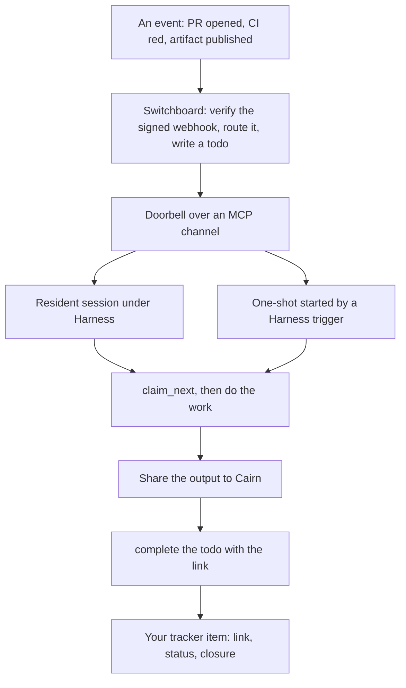

# The stack: Harness, Switchboard and Cairn

Harness, [Switchboard](https://switchboard.stump.wtf/docs/) and
[Cairn](https://cairn.stump.wtf/docs/) are three small tools. Each does one job,
and together they close a loop around your agents. This is the canonical page for
how they fit: what each one is, what each one is **not**, and how a small team
divides the work between them and what it already owns.

## Roles

You already have two of the pieces, and they stay yours:

| Piece | Whose | Its job |
|---|---|---|
| **The front door**: chat, a tracker UI, email | yours | where people ask for things and hear back |
| **The tracker**: issues, tickets, a roadmap | yours | the status of record: what is open, who owns it, when it closed |
| **Switchboard** | the stack | **dispatch**: turns verified events into leased todos and rings the agent that should take one |
| **Harness** | the stack | **supervision**: keeps agent processes running, starts one-shots on a clock or an event, and records every run |
| **Cairn** | the stack | **evidence**: gives what an agent made (a report, a diff, a trace) a stable, shareable link |

None of the three replaces your tracker or your front door. They sit between an
event and the tracker item it ends up updating.

## The event loop



1. **An event arrives.** A forge, CI, Cairn or anything else that signs its
   webhooks posts to a Switchboard ingest URL. Switchboard verifies the
   signature, runs your routing rules, and writes a **todo** on a queue. A
   webhook the sender redelivers while that todo is still open collapses onto
   it rather than creating a second one.
2. **Switchboard rings.** A connected agent session gets a one-line
   **doorbell** over an MCP channel. The doorbell is a hint; the queue is the
   record. If nobody is listening, the todo waits.
3. **An agent picks it up**, in one of two shapes:
   - a **resident** session Harness keeps running (an interactive Claude Code or
     Crush session with the channel loaded; see [Push events](./push-events)), or
   - an **on-demand one-shot**: the Harness daemon holds the channel session
     itself and starts a prompt harness when the doorbell rings (a `[channel.*]`
     trigger, [ADR-0021](/decisions/adr-0021-on-demand-one-shots)). The
     `[webhook.*]` trigger, which lets a reachable server receive a webhook
     directly, is configured the same way, but its HTTP listener has not shipped
     yet.
4. **The agent claims, works and reports.** `claim_next` takes a lease on one
   todo, so two workers never get the same one. The agent does the work,
   publishes the output to Cairn, and completes the todo with the artifact's
   link as its result.
5. **Back to the tracker.** Whatever owns your tracker (a coordinator agent, or
   a person) links the artifact from the tracker item and moves its status.
   Cairn can also emit a webhook for the new artifact, which becomes the next
   todo: that is how a handoff from one agent to another stays inside the same
   loop.

### Events and schedules are complementary

The loop above is event-driven, but it is not the only way work starts, and it
does not replace the other. Harness keeps `schedule` first-class, and scheduled
sweeps and triggers are **complementary**:

| Use | When |
|---|---|
| **Doorbell-driven trigger** | Something happened and an agent should react to *that thing*: a PR opened, CI went red, an artifact was published, a message arrived. Latency is the point. |
| **Scheduled sweep** | Nobody will send you an event for it: a state to check, a backlog to groom, a digest to send, a reconciliation pass that catches what a missed delivery left behind. Completeness is the point. |

There is no event for "three services have been unhealthy for an hour" or
"eleven pull requests have gone stale", so observe-and-file work like health
checks, audits, grooming and digests belongs on a clock. The two combine on one
harness routinely: a triggered harness with a `schedule` as its safety net is a
normal, supported shape
([ADR-0021](/decisions/adr-0021-on-demand-one-shots) recommends it for a lossy
push source), not a workaround.

```toml
[channel.switchboard]                   # the daemon listens here for doorbells
url = "https://switchboard.example.com/mcp/my-agent-k3x9"
env_file = "~/.config/harness/triggers.env"
headers = { Authorization = "Bearer ${SB_TOKEN}" }

[harness.sb-drain]
harness = "claude-code"
prompt_file = "~/agents/sb-drain.md"    # "claim_next until empty, then stop"
triggers = ["channel.switchboard"]      # react within seconds of a doorbell
schedule = "@every 1h"                  # and sweep hourly for anything missed
timeout = "30m"
```

The only thing an event buys over a schedule is latency. See
[Scheduled sweeps](./scheduled-sweeps) for the clock side.

## What each one is, and is not

| | Is | Is not |
|---|---|---|
| **Switchboard todo** | a **dispatch lease**: claimed, heartbeated, completed or dead-lettered | a second tracker. The status of record stays in your tracker. |
| **Cairn artifact** | **evidence**, linked **from** your tracker item | a second place anyone has to look |
| **Harness** | a **process supervisor**: start, restart, schedule, trigger, attach, run history | a task manager, or an authority on what to do |

The same boundary, from the other side:

| | Owns | Does not own |
|---|---|---|
| **Switchboard** | receiving and verifying events, the durable queue, who may claim what, the doorbell | running agents, or storing what they produce |
| **Harness** | agent processes: starting, restarting, scheduling, triggering, attaching, logs and run history | where work comes from, or where results go |
| **Cairn** | artifacts (Markdown, code, bundles, traces) with comments, reactions, expiry and a stable link | deciding what happens next |

The seams between them are standard: webhooks in, MCP tools and MCP channels
between an agent and a service, and links out. Each piece is replaceable. Harness
supervises any CLI; Switchboard accepts any signed webhook; an agent can publish
anywhere that gives it a URL.

## A worked example: a small product team

Take a small product team that wants agents to plan, build and check work, with
a person signing off before anything ships. It has five roles.

| Role | What it is | Carried by |
|---|---|---|
| **Coordinator** | a resident, interactive agent session. It owns the tracker and talks to the humans. | Harness keeps it running and restarts it. Switchboard rings it when a todo lands on its queue. |
| **Tracker** | the team's own issue tracker | nothing in the stack: it stays theirs |
| **Planners**, **implementers**, **verifiers** | one-shot agent runs, each on its own queue or difficulty lane. Verifiers run on a **different model family** from implementers, so they do not share the same blind spots. | Switchboard queues and routing rules; Harness triggered or scheduled one-shots; Cairn for each plan, diff and verdict |
| **Human QA** | a person who approves a release | a notification to that person, not a queue a human has to drain. Switchboard's notification sinks ([ADR-0034](https://switchboard.stump.wtf/docs/decisions/ADR-0034-notification-sinks-and-queue-digests)) will carry this; they are designed but not shipped yet, so today the coordinator sends the message itself. |

A feature request goes round the loop like this:

1. A person files an issue. The tracker's webhook reaches Switchboard, and a
   routing rule puts a todo on the coordinator's queue.
2. The coordinator is rung, claims the todo, reads the issue, and hands the
   planning off: it publishes a handoff artifact to Cairn with a lane tag, and a
   Switchboard rule routes it to the planners' queue.
3. A planner one-shot fires, writes the plan to Cairn, and completes its todo.
   The plan's artifact becomes the implementers' todo, and the implementer's
   diff becomes the verifiers' todo, in the same way.
4. The verifier's verdict lands in Cairn. The coordinator links the plan, the
   diff and the verdict from the tracker item, and a notification asks the
   person doing QA to sign off.
5. The coordinator closes the tracker item once the person approves.

**What the coordinator no longer has to build:**

- **Leases.** `claim_next` hands each worker a different todo, atomically. A
  lease that runs out without a heartbeat puts the todo back on the queue for
  another worker, and one that fails every attempt is dead-lettered where a
  human can see it.
- **Dedupe.** A delivery the forge retries collapses onto the open todo it
  already made
  ([how](https://switchboard.stump.wtf/docs/getting-started/concepts#duplicates-collapse)).
- **Admission.** Switchboard verifies each sender's signature, and routing rules
  decide which events become work for which queue, before any agent sees them.
- **Session bridging.** The doorbell reaches a live session; Harness keeps that
  session alive, restarts it, and lets a human attach to it.

**What stays the coordinator's, legitimately:**

- **Authority**: deciding what gets built, and in what order.
- **Voice**: talking to the humans in the front door.
- **Tracker sync**: the tracker stays the status of record, and the coordinator
  keeps it true.
- **Closure gates**: an item closes when its evidence (a merged change, a
  passing verification, a human's approval) is linked, not when a todo
  completes.

## Where to go next

| To | Read |
|---|---|
| Run the Harness daemon as a service | [Run the daemon as a service](./run-as-a-service) |
| Supervise an agent | [Your first supervised agent](./first-agent) |
| Run agents on a clock | [Scheduled sweeps](./scheduled-sweeps) |
| Wake agents on events | [Push events with MCP channels](./push-events) |
| See what every agent did | [Observability](./observability) |
| Learn Switchboard's vocabulary | [Switchboard concepts](https://switchboard.stump.wtf/docs/getting-started/concepts) |
| Send your first webhook into Switchboard | [First webhook](https://switchboard.stump.wtf/docs/getting-started/first-webhook) |
| Give an agent a Switchboard endpoint | [Connect an agent](https://switchboard.stump.wtf/docs/getting-started/connect-an-agent) |
| Route handoffs to the right pool | [Routing cookbook](https://switchboard.stump.wtf/docs/guides/routing-cookbook) |
| Publish and share artifacts | [Cairn](https://cairn.stump.wtf/docs/) |
