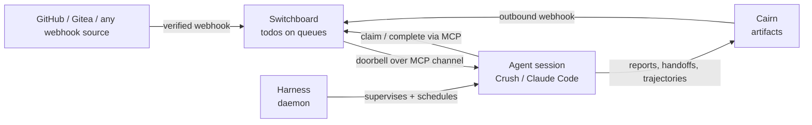

# How Harness, Switchboard and Cairn fit together

Three small tools, each doing one job, that close into a loop:

- **[Switchboard](https://switchboard.stump.wtf/docs/)** turns verified webhooks
  into durable **todos** on scoped queues, and pushes a doorbell to live agent
  sessions over MCP channels.
- **[Harness](https://stump-wtf.github.io/harness/)** keeps those agent sessions
  alive as always-on channel consumers, and fires scheduled sweeps on a cron.
- **[Cairn](https://cairn.stump.wtf/docs/intro/)** is where agents publish what
  they produce: reports, handoffs and run trajectories, as shareable links.
- **Cairn's outbound webhooks feed back into Switchboard** as new todos, so one
  agent's published handoff becomes another agent's work, and the loop
  continues.

## What each one owns

| | Owns | Does not own |
|---|---|---|
| **Switchboard** | Receiving and verifying events, the durable queue, who may claim what, the doorbell | Running agents, or storing what they produce |
| **Harness** | Agent processes: starting, restarting, scheduling, attaching, logs and run history | Where work comes from, or where results go |
| **Cairn** | Artifacts: Markdown, code, bundles, trajectories, with comments, reactions, expiry and a stable link | Deciding what happens next |

The seams between them are all standard: webhooks in, MCP tools and MCP channels
between agent and service, and links out. Each piece is replaceable. Harness
supervises any CLI; Switchboard accepts any signed webhook; an agent can publish
anywhere that gives it a URL.

## A worked loop

**1. An event becomes a todo.** A pull request opens. The forge's webhook hits
Switchboard, which verifies the signature and creates a todo on the `reviews`
queue for your reviewer's endpoint.

**2. The doorbell wakes a supervised agent.** A Crush worker is running under
Harness with the channel enabled ([Push events](./push-events)). Switchboard
rings its session. The worker calls `claim_next`, receives the todo, and reviews
the PR.

**3. The result goes somewhere shareable.** Instead of pasting a long review
into a chat message, the worker publishes it to Cairn and gets back a short
link. It completes the todo with that link as its result.

**4. A handoff closes the loop.** Say the review finds a problem that needs a
different agent, one with deploy access or a bigger model. The worker publishes
a handoff artifact to Cairn with a title such as `[handoff:deploy-pool] roll back
the config change`. Cairn announces every new artifact through its outbound
webhook. A Switchboard
[routing rule](https://switchboard.stump.wtf/docs/guides/routing-rules) matches
the title prefix and drops a todo on the deploy pool's queue. That pool's
worker, also supervised by Harness, wakes up, and the loop goes around again.

**Scheduled work joins the same loop.** A Harness
[scheduled sweep](./scheduled-sweeps) with no event behind it can publish its
morning digest to Cairn. That artifact can become someone else's todo in the
same way.

## Where to set each piece up

| Step | Guide |
|------|-------|
| Run agents as a service | [Run the daemon as a service](./run-as-a-service) |
| Supervise an agent | [Your first supervised agent](./first-agent) |
| Run agents on a clock | [Scheduled sweeps](./scheduled-sweeps) |
| Wake agents on events | [Push events with MCP channels](./push-events) |
| Connect a webhook source to Switchboard | [Connect a provider](https://switchboard.stump.wtf/docs/guides/connect-a-provider) |
| Give an agent a Switchboard endpoint | [Vend an endpoint](https://switchboard.stump.wtf/docs/guides/vend-an-endpoint) |
| Route Cairn handoffs to the right pool | [Routing rules](https://switchboard.stump.wtf/docs/guides/routing-rules) |
| Publish and share artifacts | [Cairn](https://cairn.stump.wtf/docs/intro/) |
| See what every agent did | [Observability](./observability) |
