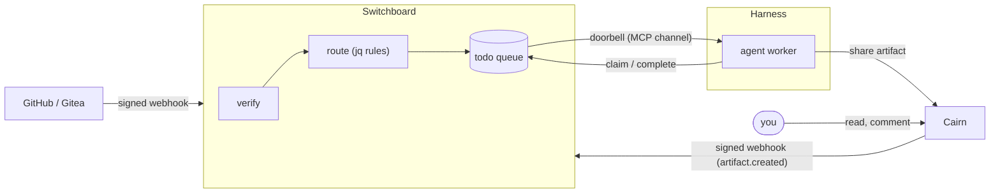

# How Harness, Switchboard and Cairn fit together

Three small tools, each doing one job, that close into a loop:

- **[Harness](https://stump-wtf.github.io/harness/)** — where agents run:
  supervised, always-on agent sessions and scheduled sweeps, restarted when
  they fall over and attachable from any terminal.
- **[Switchboard](https://switchboard.stump.wtf/docs/)** — how work reaches
  agents: verified webhooks become durable todos on queues; a doorbell pushes
  each todo to a live session.
- **[Cairn](https://cairn.stump.wtf/docs/)** — where agents put what they made:
  shareable artifacts (reports, diffs, logs, run traces) with comments,
  reactions and a TTL.

The loop runs like this:

1. A forge or Cairn event reaches Switchboard, which verifies it, routes it with
   jq rules, and writes a todo.
2. Switchboard rings a Harness-run worker over MCP (channels).
3. The worker claims the todo, does the work, and shares the output to Cairn.
4. Cairn's outbound webhook can hand the next step back to Switchboard.

## What each one owns

| | Owns | Does not own |
|---|---|---|
| **Switchboard** | Receiving and verifying events, the durable queue, who may claim what, the doorbell | Running agents, or storing what they produce |
| **Harness** | Agent processes: starting, restarting, scheduling, attaching, logs and run history | Where work comes from, or where results go |
| **Cairn** | Artifacts: Markdown, code, bundles, trajectories, with comments, reactions, expiry and a stable link | Deciding what happens next |

The seams between them are all standard: webhooks in, MCP tools and MCP channels
between agent and service, and links out. Each piece is replaceable. Harness
supervises any CLI; Switchboard accepts any signed webhook; an agent can publish
anywhere that gives it a URL.

## A worked loop

**1. An event becomes a todo.** A pull request opens. The forge's webhook hits
Switchboard, which verifies the signature and creates a todo on the `reviews`
queue for your reviewer's endpoint.

**2. The doorbell wakes a supervised agent.** A Crush worker is running under
Harness with the channel enabled ([Push events](./push-events)). Switchboard
rings its session. The worker calls `claim_next`, receives the todo, and reviews
the PR.

**3. The result goes somewhere shareable.** Instead of pasting a long review
into a chat message, the worker publishes it to Cairn and gets back a short
link. It completes the todo with that link as its result.

**4. A handoff closes the loop.** Say the review finds a problem that needs a
different agent, one with deploy access or a bigger model. The worker publishes
a handoff artifact to Cairn, tagged `handoff` and `lane:deploy`.

The Cairn instance is configured by its operator with one outbound webhook list
for the whole instance. It sends an `artifact.created` event for each new
artifact or bundle, but not for traces, comments or reactions.

A Switchboard
[routing rule](https://switchboard.stump.wtf/docs/guides/routing-cookbook)
matches the tags and drops a todo on the deploy pool's queue. The rule also
checks `.artifact.actor_id`. Tags and titles are claims the publishing client
makes, so without that check anyone who can publish to that Cairn could mint
work for your agents. That pool's worker, also supervised by Harness, wakes up,
and the loop goes around again.

**Scheduled work joins the same loop.** A Harness
[scheduled sweep](./scheduled-sweeps) with no event behind it can publish its
morning digest to Cairn. That artifact can become someone else's todo in the
same way.

## Where to set each piece up

| Step | Guide |
|------|-------|
| Run agents as a service | [Run the daemon as a service](./run-as-a-service) |
| Supervise an agent | [Your first supervised agent](./first-agent) |
| Run agents on a clock | [Scheduled sweeps](./scheduled-sweeps) |
| Wake agents on events | [Push events with MCP channels](./push-events) |
| Send your first webhook into Switchboard | [First webhook](https://switchboard.stump.wtf/docs/getting-started/first-webhook) |
| Give an agent a Switchboard endpoint and wire it into Crush or Claude Code | [Connect an agent](https://switchboard.stump.wtf/docs/getting-started/connect-an-agent) |
| Route Cairn handoffs to the right pool | [Routing cookbook](https://switchboard.stump.wtf/docs/guides/routing-cookbook) |
| Publish and share artifacts | [Cairn](https://cairn.stump.wtf/docs/) |
| See what every agent did | [Observability](./observability) |
