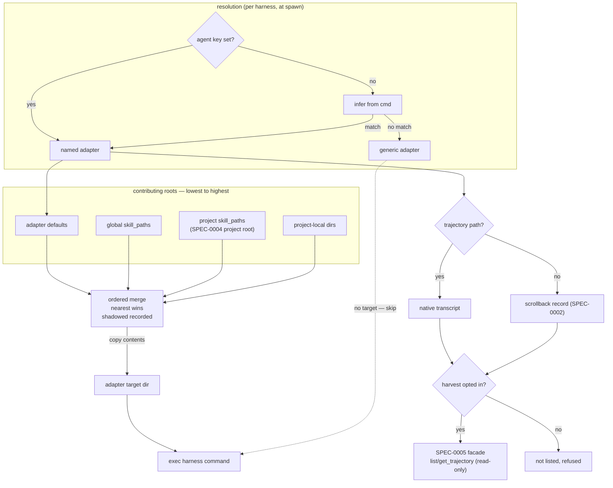

# Design: Agent Adapters (skill paths, projection, trajectory discovery)

## Context

Agent skills are already a portable format — a directory containing `SKILL.md`
with YAML frontmatter. What is not portable is **discovery**: Claude Code scans
`~/.claude/skills` and `.claude/skills`, Crush scans its own paths, Codex reads
`AGENTS.md`. The same file is invisible to a sibling harness running a different
tool. Separately, reading what a harness *did* is also tool-specific: some tools
write structured transcripts, others write nothing at all.

**ADR-0011** decided these are one question — *where does this tool keep its
things?* — answered by a single adapter behind a narrow interface, with
configured paths rather than filesystem search.

The measurement that ruled out search: **407 `SKILL.md` files** under a working
`$HOME` (depth 8, excluding `node_modules`/`.git`), with `ops-runbook`,
`playbook`, `ops-check`, `app-catalog` and `stack-guide` each appearing **14
times** and `crush-config`/`crush-hooks`/`jq` **12 times** — the same skills
sitting in a dozen worktrees. Roughly 5× duplication with no principled winner.

This spec (SPEC-0006) formalizes adapter selection, the path scheme, the merge
order, projection semantics, and trajectory discovery. It reuses SPEC-0004's
project root and provenance, and publishes trajectories through SPEC-0005.

## Goals / Non-Goals

### Goals

- One canonical skill surface per harness, assembled from configured roots.
- Cross-*tool* skill portability, which is the actual gap.
- Trajectory location as a byproduct of the same adapter.
- Keep tool-specific knowledge behind one replaceable interface.

### Non-Goals

- **Cross-machine skill sync.** Dotfiles tooling already does this well.
  Duplicating it would put two systems in contention over one directory.
- **Filesystem search.** Explicitly rejected; see the measurement above.
- **Skill authoring or editing.** Harness assembles and places skills; it does
  not create them. Machine-authored skills are SPEC-0007's concern.
- **Serving skills over MCP.** MCP has no skill primitive, and agent CLIs
  discover skills from disk. Projection is the only mechanism that works.
- **Writing to trajectories.** Read-only, always.

## Decisions

### One adapter answering three questions

**Choice**: A single interface — skills-from, skills-to, trajectory-at —
implemented by `claude-code`, `crush`, `codex`, and `generic`. The trajectory
half delegates to [agent-trace](https://github.com/stump-wtf/agent-trace)
(`tail` package for session parsing, `classify` for action taxonomy, `otel` for
span conversion); the skill-projection half remains harness-internal.

**Rationale**: Skill discovery and trajectory discovery are the same question
about the same tool. Two interfaces would mean two registries, two selection
mechanisms, and two things to update when a tool moves a directory. Delegating
trajectory parsing to agent-trace avoids carrying per-tool JSONL parsers in
this codebase while keeping the adapter interface as the single point of
integration.

**Alternatives considered**:

- *Separate skill and trajectory detectors*: doubles the surface for no benefit;
  every adapter would need registering twice.

### `agent` mirrors `backend`

**Choice**: Selection by an `agent` key, inferred from `cmd` when unset.

**Rationale**: ADR-0003 already established the pattern of a registry key the
daemon dispatches on without understanding — `backend = "tmux" | "native"`. A
sibling field is the least surprising possible design, and inference keeps the
common case zero-config.

### `generic` is a real adapter, not an error

**Choice**: An unrecognized tool resolves to `generic`, which reports no roots,
no target, and no trajectory.

**Rationale**: Keeps the daemon honest about ADR-0002's agnosticism. An unknown
tool must still run — the feature degrades to today's behavior rather than
failing. This also makes "Harness supervises anything" testable rather than
aspirational.

### Copy, not symlink

**Choice**: Projection copies file contents into the adapter's target directory.

**Rationale**: Agent CLIs write into their own config directories. A symlink
farm would let one harness's edit propagate into a shared source root and from
there into every other harness — corruption with no audit trail. The cost is
drift: a skill edited in the canonical store does not reach a running harness
until it restarts. That is the correct trade, since restart is cheap and silent
cross-harness mutation is not.

**Alternatives considered**:

- *Symlink the merged set*: instant propagation, but unsafe for exactly the
  reason above.
- *Copy-on-write overlay*: safe and instant, but platform-specific and far
  heavier than the problem warrants.

### Precedence is fixed, shadowing is visible

**Choice**: A fixed four-level order, nearest wins, shadowed copies enumerable.

**Rationale**: With 14-way duplicates observed in the wild, collisions are the
common case rather than the exception. A fixed order makes the outcome
predictable; exposing the shadowed set makes it debuggable. Silent shadowing
would turn every duplicate into a support question.

### Harvesting is opt-in

**Choice**: Trajectory exposure defaults to disabled per harness.

**Rationale**: ADR-0008 concedes the daemon cannot stop a harnessed program from
printing its own secrets. A bounded scrollback ring is one exposure; publishing
a full transcript through a tool surface is materially larger. Opt-in mirrors
ADR-0007's per-harness don't-persist-scrollback flag.

## Architecture

## Risks / Trade-offs

- **First real agent-awareness in the tree.** `CLAUDE.md` says the daemon is
  deliberately agnostic. → Fenced behind one interface with a `generic` fallback
  that keeps the daemon runnable against any tool; the exception is documented
  in ADR-0011 rather than smuggled in.
- **Adapters rot silently.** An upstream tool moving its skill directory breaks
  an adapter, and the symptom is skills quietly not appearing. → Diagnostic
  surface reports resolved and shadowed sources per harness, making "nothing
  resolved" visible rather than mysterious.
- **Copy drift.** Edits do not reach running harnesses. → Documented as
  restart-to-refresh; acceptable because the alternative permits cross-harness
  mutation.
- **Projection cost at spawn.** Work proportional to the configured set on a
  latency-sensitive path. → Bounded by configuration rather than by filesystem
  size; this is the central reason search was rejected.
- **Trajectories may contain secrets.** → Opt-in per harness, read-only, never
  written; inherits the ADR-0008 posture rather than inventing one.

## Migration Plan

Additive for unknown tools: a harness resolving to `generic` starts exactly as
today — no projection, no trajectory exposed. For a recognized `cmd`, inference
is on by default and so are the adapter's default roots, so projection runs at
spawn from those roots; because the target directory is excluded as a source,
the zero-config case projects only the tool's own default roots into its own
target — content the tool would discover natively anyway. A harness that must
stay untouched sets `use_default_skill_paths = false` (or `agent = "generic"`).
Adapters can be adopted one harness at a time, and harvesting stays opt-in
regardless.

## Open Questions

- Should projection be incremental (diff the target, write only changes) to cut
  spawn latency for large skill sets, or is full rewrite acceptable indefinitely?
- Should adapters be user-extensible via configuration (declaring roots and a
  target for an unknown tool) rather than compiled in?
- Should a shadowed skill be reachable under a qualified name instead of being
  merely reported, so a project can deliberately use both copies?
- Does `AGENTS.md`-style single-file context (Codex) fit the same projection
  model, or does it need a distinct concatenation step in its adapter?
- The target directory is per-tool while merged sets are per-harness: two
  concurrent harnesses of the same tool in different projects contend for one
  directory (each start rewrites it), and nothing removes projected skills on
  stop. Does projection need per-harness target isolation, and a cleanup pass?
