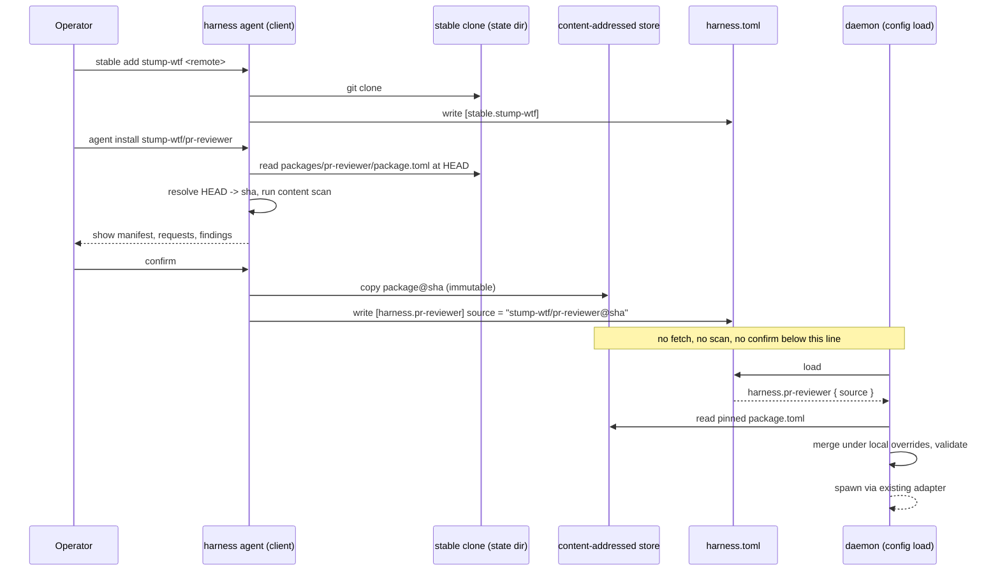

# Design: Agent Package Stables

## Context

Harness has two existing patterns for external, shareable content, and this
feature is neither of them, deliberately:

* **ADR-0024's stack installer** installs Harness itself and first-party
  infra bundles from a digest-pinned manifest the operator or the project
  owns. It answers "how do I get Harness onto a new host," not "how do I get
  someone else's agent definition."
* **ADR-0030's skill repos** (`skill_repo.*`, `harness distill`,
  `harness skills sync`) let a distiller propose machine-authored,
  PR-reviewed skill text, served by search, never projected. They answer
  "how does the fleet learn from itself," not "how do I install a
  hand-authored bundle someone else published."

What's missing is Homebrew's actual shape: a git repository of many
installable things, added to a trust list once, searched and installed by
name, upgraded explicitly, with the operator seeing exactly what changes
each time. ADR-0044 decides that shape for Harness. Governing spec:
SPEC-0026.

Related specs: SPEC-0006 (adapters, skill-path merge order this spec
amends), SPEC-0007 (skill repos, the closest existing sibling mechanism).
Related ADRs: ADR-0006 (config authority), ADR-0009 (global-only tables),
ADR-0008 (security baseline), ADR-0011/ADR-0039 (adapters), ADR-0023
(no-shell, closed templates, fenced untrusted text), ADR-0024 (stack
installer, converge rules), ADR-0029 (no supply-chain opt-in), ADR-0030
(skill repos), ADR-0038 (secret references).

## Goals / Non-Goals

### Goals

* A single command installs a named package from a trusted stable into a
  running or not-yet-running configuration.
* One git repository can hold many independently installable packages.
* Nothing a package manifest can declare can execute code, reach the
  network, or read a credential before the operator explicitly starts the
  harness it defines — and everything it will do is visible before that.
* Every install and every upgrade shows the operator a full diff before a
  pin changes; nothing updates silently.
* The daemon's config-load code path gains exactly one new resolution step
  (read a pinned manifest from local disk) and no new trust boundary, no new
  network access, and no new process class.

### Non-Goals

* **A central package index.** Discovery is per-stable, by design (ADR-0044
  Decision 1).
* **Package build steps, install hooks, or scripts of any kind.** A package
  is data. An author who needs a wrapper script publishes it separately and
  references its path, same as any hand-written harness would.
* **Cryptographic signing or provenance attestation.** Commit-SHA pinning
  plus a mandatory diff-and-confirm is the whole of this revision's
  supply-chain defense. Sigstore/GPG is a credible upgrade, not a blocker.
* **A first-party "official" stable with weaker scrutiny.** Every stable, however
  reputable, goes through the same scan-diff-confirm gate. This is a
  permanent stance, not a v1 gap.
* **Fleet-wide prompt registration, scheduled jobs, or MCP servers as
  installable units.** A package installs exactly one harness plus its
  bundled skills.
* **Verifying a package's *claims*.** Unlike ADR-0030's distiller, nothing
  here checks that a "PR reviewer" package is actually good at reviewing
  PRs. The gate is about what it's allowed to declare and whether its
  bundled text looks like an injection attempt, not about quality.

## Decisions

### Reuse `skill_repo`'s shape for `stable`, rather than a fourth external-source pattern

**Choice**: `[stable.*]` is structurally `skill_repo` with the fields it
needs and none it doesn't: `remote`, `public`. Same global-only rule, same
"a managed clone the daemon never fetches" rule, same explicit
`update`/`sync` verb.

**Rationale**: an operator who already has `skill_repo` tables understands
`stable` tables for free. Diverging the shape for no functional reason would
be a second thing to learn.

**Alternatives considered**: a bespoke registry format with its own schema
— rejected, since nothing about installable-harness-definitions actually
needs a different shape than installable-skill-definitions at the
trust-declaration layer; they diverge only in what happens *after* the
source is trusted (REQ-3 onward).

### The content-addressed store is the unit of immutability, not the stable clone

**Choice**: installing copies a package's files at one commit into
`installed/<stable>/<package>/<sha>/`, a directory that is never rewritten
once it exists. The stable's own clone (`stables/<name>/`) is a mutable,
fast-forward-only working copy that `stable update` moves forward; it is
never itself a resolution target once a package's content has been copied
out of it.

**Rationale**: this is what makes rollback network-free (re-point `source`
at a retained prior `sha`) and what makes a config load's resolution step
pure filesystem I/O with no dependency on the stable clone's current state.
It also means pruning the stable clone (not designed here, but a natural
future `stable gc`) can never invalidate an installed pin.

**Alternatives considered**: resolve `source` against the stable clone
directly at whatever commit `HEAD` happens to be (Decision 4, Option 3 in
the ADR) — rejected because a `git fetch` moving the clone's `HEAD` would
then silently change a running configuration's meaning between reloads,
which is the exact ambient-trust problem this feature exists to remove.

### The scan is a fixed, versioned pattern list shipped with the binary, not configurable

**Choice**: the high/low pattern tables (instruction-override phrases,
credential/exfiltration phrases, pipe-to-shell phrases, oversized encoded
blocks) ship compiled into the `harness` binary and are not
operator-configurable in v1. `harness agent info` and every scan-blocked
error name which pattern matched, by a fixed identifier, so a false
positive is reportable and fixable upstream.

**Rationale**: a configurable scanner is a second thing a malicious project
file could try to weaken (imagine a project `harness.toml` disabling a
pattern before an install runs against it) — keeping it out of config
entirely removes that surface without anyone having to remember to make it
global-only. Versioning it with the binary also means a scan result is
reproducible from a Harness version number alone.

**Alternatives considered**: an LLM-based classifier call instead of fixed
patterns — rejected for this revision because it would add a model
dependency (and a credential) to a code path this ADR otherwise keeps
entirely credential-free, and because a heuristic pattern list is at least
exhaustively enumerable and testable, where a model's judgment is not.
Nothing here forecloses adding one later as an additional, opt-in check;
see Open Questions.

### `harness agent` is a pure client subtree; the daemon gains one resolver, nothing else

**Choice**: every subcommand under `harness agent` (`stable add/remove/update`,
`search`, `info`, `install`, `upgrade`, `uninstall`, `prune`, `list`) runs
entirely in the CLI process, reading and writing `harness.toml` and the two
on-disk stores directly. The only daemon-side change is the config loader's
new branch for a `source` key (REQ-7), which is pure local filesystem
reads through the same validation path every other harness table already
goes through.

**Rationale**: matches the split ADR-0030 already established for
`harness distill`/`harness skills sync` — the daemon supervises processes
and resolves configuration; it does not manage external state on its own
initiative. It also means `harness agent install` works with no daemon
running at all, the same way hand-editing `harness.toml` does today.

### Supervision values are suggested in `[defaults]` and written as the operator's keys

*Added for issue #931 (ADR-0044 amendment of 2026-10-09).*

**Choice**: `schedule`, `triggers`, `timeout`, `on_overlap`, `catch_up`,
`operating_hours`, `restart`, `restart_delay` and `workdir` stay forbidden
under `[harness]`. A package may suggest them in a separate `[defaults]`
table, validated at manifest load by the parsers config load uses and never
applied at config load. Install (and upgrade, for keys still unset) asks the
operator to keep, override or skip each one, and writes the chosen values
onto `[harness.<name>]` as ordinary keys. `--yes` accepts none of them;
`--accept-defaults` accepts them all. `env_file`, `secrets_env` and
`enabled` are never suggestible.

**Rationale**: the forbidden-key list exists so that installing a package
never makes anything run on its own, and a supervision key is exactly what
decides whether, when and how long something runs. Keeping the suggestion
out of `[harness]` keeps that guarantee structural: nothing the resolver
reads can schedule a harness. Writing an accepted value as the operator's
own key means nothing downstream (config load, REQ-7 precedence, REQ-8's
review, `describe`) needs a new provenance tier, and an upgrade can never
move it. `--yes` is the trust review's shortcut and predates the
suggestions, so letting it accept them would let a package author arm a
schedule in every existing `install --yes` script by adding a table.

**Alternatives considered**: applying the keys at load like any package
value (a package would schedule itself); display-only suggestions the
operator copies by hand (most of the friction, no safety gain); `--yes`
accepting the defaults (the scripted-install problem above). See ADR-0044's
amendment for the full comparison.

## Architecture

## Risks / Trade-offs

* **Heuristic scan false negatives.** A well-disguised instruction (split
  across two files, encoded, or phrased as an innocuous-looking checklist
  item) can pass with zero findings. → The mitigation is that the human
  always sees the full manifest and file list at confirm time regardless of
  scan result; the scan raises the floor, it does not replace reading. This
  is stated in the CLI output every time, not just in documentation.
* **Heuristic scan false positives on legitimate imperative skill prose.**
  ADR-0011's own skills are full of MUST/ALWAYS/NEVER. → Findings are
  severity-tiered specifically so imperative language alone lands `low`
  (shown, not blocking); only patterns that target overriding the *outer*
  instructions or exfiltrating secrets/credentials are `high`.
* **Confirm-fatigue.** Requiring confirmation on every install and upgrade
  risks operators learning to click through without reading, the way any
  repeated security prompt does. → Accepted as the lesser risk versus
  Option 1 (silent after the first trust), per ADR-0044 Decision 3; the
  typed-retype requirement for `high` findings and for `mcp_allow` "write"
  specifically resists rubber-stamping those two cases.
* **Two more pieces of local git/filesystem state per stable.** More moving
  parts than a single `harness.toml`. → Same cost ADR-0030 already accepted
  for `skill_repo`; `harness agent list`/`stable list` make the state
  inspectable rather than hidden.
* **No provenance stronger than "whoever controls this git remote right
  now."** A compromised stable maintainer's account, or a compromised forge,
  can serve a bad commit under a name the operator already trusts. →
  Deferred to a future signing mechanism (see Open Questions); commit-SHA
  pinning at least means a *specific* compromised commit has to be the one
  installed, not "whatever HEAD is today," and the diff-on-upgrade
  requirement means the operator sees that exact commit's content before it
  takes effect.

## Migration Plan

Purely additive. No existing harness table, adapter, or skill-path
behavior changes for a harness that never sets `source`. `[stable.*]` is a new
table with no prior meaning to collide with. The SPEC-0006 skill-path merge
order gains a tier that contributes nothing until a `source` is present, so
every existing configuration's resolved skill set is byte-identical before
and after this ships.

## Open Questions

* Should the fixed scan pattern list be versioned and exposed
  (`harness agent scan --dry-run <path>`) so a stable author can check their
  own package against it before publishing, the way `harness skills lint`
  lets a skill-repo author self-check?
* Should there be an opt-in, clearly-labeled model-assisted second pass on
  top of the fixed patterns for an operator who wants stronger recall and
  is willing to accept a model credential and cost on this code path? This
  would need its own decision about where that credential lives, following
  ADR-0030's credential-splitting precedent rather than handing it to the
  same process that reads attacker-reachable text and can also write
  config.
* Does `harness agent prune`'s global-file-only scope need a `--check`
  mode that also warns about (without removing) pins referenced only by
  project files it can discover via a configured project-search path,
  rather than only failing at the next `harness up`?
* Is there demand for a package to declare a *minimum* Harness version
  (mirroring `min_version` on an adapter), given `[harness]`'s accepted key
  set will grow over time and an old Harness binary would otherwise reject
  a newer package's manifest with a generic unknown-key error rather than a
  clear version message?
