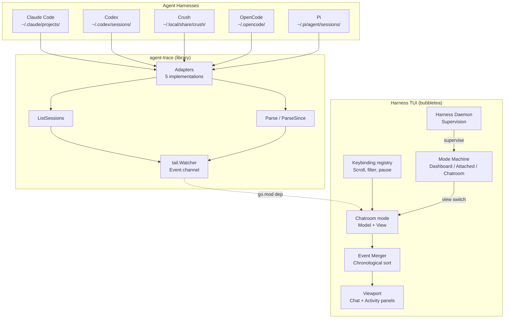

# Design: Chatroom TUI View for Harness

## Context

This design implements SPEC-0009, which specifies a new "chatroom" view within the Harness TUI. The view consumes events from `agent-trace`'s `tail.Watcher` (which aggregates from 5 harness adapters) and renders them as a chronological chat stream with an activity feed panel.

Key existing components leveraged:
- Harness TUI: bubbletea-based, with the SPEC-0001 mode machine (`modeDashboard` / `modeAttached` in `internal/tui/model.go`), theming (`internal/tui/theme`), viewport components, status bar, help system
- `agent-trace` (go.mod dependency, `github.com/stump-wtf/agent-trace`): `tail.Watcher`, `tail.Adapter`, `tail.Event`, `classify.Event`, `classify.Mark`

New components in Harness. `internal/tui` is a flat package today — there is no `views/`
tree and no `View` interface — so the layout below is a proposal, and carving one out is
part of the work rather than something the chatroom can assume:
- `model.go` — chatroom mode Model
- `view.go` — rendering logic for chat + activity panels
- `styles.go` — per-harness styles built from the existing `theme.Colors`
- `keymap.go` — `key.Binding` declarations, registered so `?` renders them
- `buffer.go` — event buffer with chronological merge

## Goals / Non-Goals

### Goals

- Real-time unified chat stream from all 5 harnesses within Harness TUI
- Distinct visual identity per harness (username + color, theme-compatible)
- Tool calls, results, and user messages as chat messages
- Activity feed panel with navigation
- Full keyboard navigation (scroll, pause, filter, panel focus, exit)
- Terminal resize handling
- Legible under the existing `colorprofile` degradation (including mono), plus a reduced-motion toggle
- Clean integration with the SPEC-0001 mode machine and daemon supervision
- Graceful watcher lifecycle (start on enter, stop on exit)

### Non-Goals

- Interactive input (sending messages to harnesses)
- Session replay from historical data (live only for v1)
- Web-based dashboard
- Plugin system for custom harnesses
- Persistent chatroom-specific configuration beyond the ADR-0006 config surface
- Multi-window/tab support within chatroom
- Cross-harness correlation (subagent linking) — future enhancement

## Decisions

### Decision: Chatroom as a Harness mode (not separate binary)

**Choice**: Implement as a third mode in the SPEC-0001 mode machine, alongside `modeDashboard` and `modeAttached`.

**Rationale**:
- Harness already uses bubbletea — chatroom reuses Program, theming, viewport, status bar, help
- Single binary (`harness`) — chatroom is just another view mode
- Daemon-managed lifecycle — chatroom sessions can be supervised, attached, hopped
- Consistent UX: same keybindings, theming, layout patterns as other Harness views

**Alternatives considered**:
- Separate binary: Duplicate framework, no daemon integration, separate distribution
- Web dashboard: Not a TUI, requires browser

### Decision: Event Merger in Chatroom Model

**Choice**: The chatroom Model maintains a merged, sorted event buffer. Events from `Watcher.Events()` channel are received via a bubbletea `Cmd` that forwards to `Model.Update()`.

**Rationale**:
- `Watcher.Events()` delivers events in approximate chronological order per adapter, but not globally sorted across adapters
- Model merges by `Event.Classified.Timestamp` (fallback `Event.ReceivedAt`)
- Buffer capped at 10,000 events to bound memory
- Sort on each insert is O(n) but n is small; can optimize to heap if needed

**Alternatives considered**:
- Pre-sort in watcher: Watcher doesn't have global view across adapters
- External merger process: Unnecessary complexity

### Decision: Harness Theme Configuration

**Choice**: Per-harness styles defined in `styles.go` over the existing `theme.Colors` tokens — `Accent`, `Mint`, `Amber`, `Cyan`, `Pink` — resolved through the theme rather than hardcoded.

**Rationale**:
- Integrates with the existing theme (light/dark `Adaptive` pairs, `colorprofile` degradation)
- Only 5 harnesses, fixed set, and the palette already has 5 spare identity hues
- `Coral` stays reserved for failure emphasis, per SPEC-0001 REQ "State Presentation"
- No new token and no new env var: a mono terminal drops color and the `@harness` prefix still carries identity

**Alternatives considered**:
- Hardcoded hex: Doesn't respect the light/dark pair or the color profile
- New palette tokens per harness: Grows the design system for one view

### Decision: Dual Viewport Layout

**Choice**: Two `bubbles/viewport` components side-by-side (or stacked on narrow terminals): main chat (70%) + activity feed (30%).

**Rationale**:
- Activity feed is a condensed index, not full content
- Selecting activity entry → scroll chat to that event (via `Viewport.SetYOffset`)
- Shared event buffer, different render functions
- Reuses Harness's existing viewport patterns

**Alternatives considered**:
- Single viewport with tabs: Loses simultaneous visibility
- Popup overlay: Harder to navigate, breaks Harness layout patterns

### Decision: Keyboard Navigation Scheme

**Choice**: Harness-consistent keys: `j`/`k`/`Up`/`Down` for scroll, `Ctrl+u`/`Ctrl+d` for half-page, `Space`/`p` for pause, `1-5` for harness filter, `0`/`a` for all, `Tab` for panel focus, `Esc`/`q` for exit. All declared through the Bubbles `key.Binding` registry per SPEC-0001 REQ "Keybinding Registry".

**Rationale**:
- Consistent with Harness TUI conventions
- `1-5` maps directly to 5 harnesses
- `Tab` for panel switching is standard
- `Esc` for exit matches Harness mode navigation

**Note**: `p` and `a` are already Dashboard verbs (SPEC-0001 REQ "Keybinding Registry" lists
`s/x/r/e/n/p`). They are only unambiguous because chatroom is its own mode; the *entry* key
from the Dashboard is still open — see Open Questions.

**Alternatives considered**:
- Arrow keys only: Less efficient for power users
- Command palette: Overkill for 6 actions

## Architecture



### Data Flow

1. User enters chatroom mode (keybinding from the Dashboard)
2. Chatroom `Model.Init()` creates `tail.Watcher` with `DefaultAdapters()` and `DefaultWatchConfig()`
3. `Model.Init()` starts `Watcher.Start(ctx)` in a goroutine, returns `Cmd` that reads from `Watcher.Events()`
4. Events arrive via `MsgEvent` → `Model.Update()` inserts into sorted buffer, triggers re-render
5. `Model.View()` renders chat viewport + activity viewport + status bar using Harness lipgloss theme
6. Keyboard input → `Model.Update(MsgKey)` → modifies model state (scroll, filter, pause, focus) → re-render
7. User exits chatroom → `Model.Cleanup()` calls `Watcher.Stop()`, returns to the Dashboard

### Event Buffer

```go
type EventBuffer struct {
    events    []RenderableEvent // sorted by timestamp
    maxSize   int               // 10000
    filter    HarnessFilter     // bitmask of visible harnesses
    paused    bool              // auto-scroll paused
    focus     PanelFocus        // Chat | Activity
}
```

`RenderableEvent` wraps `tail.Event` with pre-computed render data (formatted strings, styles) to avoid re-formatting on every frame.

### Proposed view interface

`internal/tui` has no `View` interface today; the chatroom would either implement one
introduced by this work or fold into the existing `model.go` mode switch. If extracted,
the shape would be:
```go
type View interface {
    Init() tea.Cmd
    Update(msg tea.Msg) (View, tea.Cmd)
    View() string
    Cleanup() tea.Cmd
    KeyMap() *KeyMap
    Help() []KeyBinding
}
```

## Risks / Trade-offs

- **Risk**: High event volume could cause UI lag
  - **Mitigation**: Buffer cap, batched renders, `RenderableEvent` pre-formatting
- **Risk**: Terminal resize during heavy event flow
  - **Mitigation**: bubbletea handles resize natively; Model recalculates layout on `tea.WindowSizeMsg`
- **Risk**: SQLite adapters (Crush, OpenCode) may lock database during long polls
  - **Mitigation**: Watcher uses read-only connections; incremental parsing reduces parse time
- **Trade-off**: Live-only (no historical replay) for v1
  - **Rationale**: Simplifies buffer management; replay can be added as `--since` flag later
- **Trade-off**: Chatroom buffer cleared on exit
  - **Rationale**: Simpler state management; can persist if user demand

## Migration Plan

Greenfield — new view in existing Harness TUI. No migration needed.

## Open Questions

1. Should the chatroom support a `--since` flag or "replay recent" on entry?
2. Should harness filter support multi-select (e.g., `1+3` for claude+crush) or single only?
3. Should we add a "follow" mode that auto-scrolls only when at bottom (like `tail -f`)?
4. Color palette: verify theme compatibility across Harness dark/light themes
5. Should activity feed show marks (user messages) or only tool calls?
6. Should chatroom buffer persist across view switches (memory vs. re-fetch)?
7. Integration with Harness daemon: should chatroom be a supervised "harness" itself?
8. Entry keybinding from the Dashboard: `Ctrl+R`? `C`? (`r` is already the restart verb.)
9. Does `internal/tui` get carved into a `views/` tree as part of this, or does the chatroom fold into the existing flat mode switch?