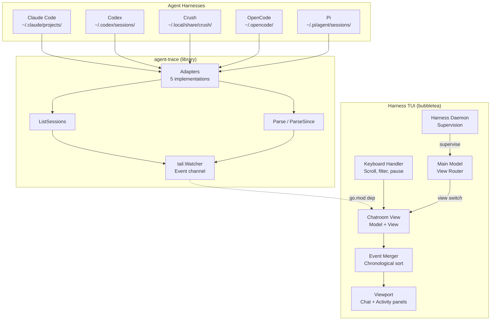

# Design: Chatroom TUI View for Harness

## Context

This design implements SPEC-0015, which specifies a new "chatroom" view within the Harness TUI. The view consumes events from `agent-trace`'s `tail.Watcher` (which aggregates from 5 harness adapters) and renders them as a chronological chat stream with an activity feed panel.

Key existing components leveraged:
- Harness TUI: bubbletea-based, with existing view router, theming (lipgloss), viewport components, status bar, help system
- `agent-trace` (go.mod dependency): `tail.Watcher`, `tail.Adapter`, `tail.Event`, `classify.Event`, `classify.Mark`

New components in Harness:
- `internal/tui/views/chatroom/model.go` — chatroom view Model (implements Harness View interface)
- `internal/tui/views/chatroom/view.go` — rendering logic for chat + activity panels
- `internal/tui/views/chatroom/styles.go` — harness themes, color schemes
- `internal/tui/views/chatroom/keymap.go` — keyboard bindings
- `internal/tui/views/chatroom/buffer.go` — event buffer with chronological merge

## Goals / Non-Goals

### Goals

- Real-time unified chat stream from all 5 harnesses within Harness TUI
- Distinct visual identity per harness (username + color, theme-compatible)
- Tool calls, results, and user messages as chat messages
- Activity feed panel with navigation
- Full keyboard navigation (scroll, pause, filter, panel focus, exit)
- Terminal resize handling
- High-contrast and reduced-motion accessibility modes (Harness env vars)
- Clean integration with Harness TUI view router and daemon supervision
- Graceful watcher lifecycle (start on enter, stop on exit)

### Non-Goals

- Interactive input (sending messages to harnesses)
- Session replay from historical data (live only for v1)
- Web-based dashboard
- Plugin system for custom harnesses
- Persistent configuration file (env vars only for v1)
- Multi-window/tab support within chatroom
- Cross-harness correlation (subagent linking) — future enhancement

## Decisions

### Decision: Chatroom as Harness View (not separate binary)

**Choice**: Implement as a new view in `internal/tui/views/chatroom/` integrated with Harness's view router.

**Rationale**:
- Harness already uses bubbletea — chatroom reuses Program, theming, viewport, status bar, help
- Single binary (`harness`) — chatroom is just another view mode
- Daemon-managed lifecycle — chatroom sessions can be supervised, attached, hopped
- Consistent UX: same keybindings, theming, layout patterns as other Harness views

**Alternatives considered**:
- Separate binary: Duplicate framework, no daemon integration, separate distribution
- Web dashboard: Not a TUI, requires browser

### Decision: Event Merger in Chatroom Model

**Choice**: The chatroom Model maintains a merged, sorted event buffer. Events from `Watcher.Events()` channel are received via a bubbletea `Cmd` that forwards to `Model.Update()`.

**Rationale**:
- `Watcher.Events()` delivers events in approximate chronological order per adapter, but not globally sorted across adapters
- Model merges by `Event.Classified.Timestamp` (fallback `Event.ReceivedAt`)
- Buffer capped at 10,000 events to bound memory
- Sort on each insert is O(n) but n is small; can optimize to heap if needed

**Alternatives considered**:
- Pre-sort in watcher: Watcher doesn't have global view across adapters
- External merger process: Unnecessary complexity

### Decision: Harness Theme Configuration

**Choice**: Harness themes defined in `styles.go` using Harness's lipgloss theme system. Colors reference theme palette (Accent, Success, Warning, Info, Highlight) with fallback hex values.

**Rationale**:
- Integrates with Harness's existing theme system (dark/light, user-customizable)
- Only 5 harnesses, fixed set
- High-contrast mode uses Harness's `HARNESS_HIGH_CONTRAST` env var

**Alternatives considered**:
- Hardcoded colors: Doesn't respect user theme
- Config file: Overkill for v1

### Decision: Dual Viewport Layout

**Choice**: Two `bubbles/viewport` components side-by-side (or stacked on narrow terminals): main chat (70%) + activity feed (30%).

**Rationale**:
- Activity feed is a condensed index, not full content
- Selecting activity entry → scroll chat to that event (via `Viewport.SetYOffset`)
- Shared event buffer, different render functions
- Reuses Harness's existing viewport patterns

**Alternatives considered**:
- Single viewport with tabs: Loses simultaneous visibility
- Popup overlay: Harder to navigate, breaks Harness layout patterns

### Decision: Keyboard Navigation Scheme

**Choice**: Harness-consistent keys: `j`/`k`/`Up`/`Down` for scroll, `Ctrl+u`/`Ctrl+d` for half-page, `Space`/`p` for pause, `1-5` for harness filter, `0`/`a` for all, `Tab` for panel focus, `Esc`/`q` for exit.

**Rationale**:
- Consistent with Harness TUI conventions
- `1-5` maps directly to 5 harnesses
- `Tab` for panel switching is standard
- `Esc` for exit matches Harness view navigation

**Alternatives considered**:
- Arrow keys only: Less efficient for power users
- Command palette: Overkill for 6 actions

## Architecture



### Data Flow

1. User enters chatroom view (keybinding from main view)
2. Chatroom `Model.Init()` creates `tail.Watcher` with `DefaultAdapters()` and `DefaultWatchConfig()`
3. `Model.Init()` starts `Watcher.Start(ctx)` in a goroutine, returns `Cmd` that reads from `Watcher.Events()`
4. Events arrive via `MsgEvent` → `Model.Update()` inserts into sorted buffer, triggers re-render
5. `Model.View()` renders chat viewport + activity viewport + status bar using Harness lipgloss theme
6. Keyboard input → `Model.Update(MsgKey)` → modifies model state (scroll, filter, pause, focus) → re-render
7. User exits chatroom → `Model.Cleanup()` calls `Watcher.Stop()`, returns to main view

### Event Buffer

```go
type EventBuffer struct {
    events    []RenderableEvent // sorted by timestamp
    maxSize   int               // 10000
    filter    HarnessFilter     // bitmask of visible harnesses
    paused    bool              // auto-scroll paused
    focus     PanelFocus        // Chat | Activity
}
```

`RenderableEvent` wraps `tail.Event` with pre-computed render data (formatted strings, styles) to avoid re-formatting on every frame.

### Harness View Interface

Chatroom model implements Harness's `View` interface:
```go
type View interface {
    Init() tea.Cmd
    Update(msg tea.Msg) (View, tea.Cmd)
    View() string
    Cleanup() tea.Cmd
    KeyMap() *KeyMap
    Help() []KeyBinding
}
```

## Risks / Trade-offs

- **Risk**: High event volume could cause UI lag
  - **Mitigation**: Buffer cap, batched renders, `RenderableEvent` pre-formatting
- **Risk**: Terminal resize during heavy event flow
  - **Mitigation**: bubbletea handles resize natively; Model recalculates layout on `tea.WindowSizeMsg`
- **Risk**: SQLite adapters (Crush, OpenCode) may lock database during long polls
  - **Mitigation**: Watcher uses read-only connections; incremental parsing reduces parse time
- **Trade-off**: Live-only (no historical replay) for v1
  - **Rationale**: Simplifies buffer management; replay can be added as `--since` flag later
- **Trade-off**: Chatroom buffer cleared on exit
  - **Rationale**: Simpler state management; can persist if user demand

## Migration Plan

Greenfield — new view in existing Harness TUI. No migration needed.

## Open Questions

1. Should the chatroom support a `--since` flag or "replay recent" on entry?
2. Should harness filter support multi-select (e.g., `1+3` for claude+crush) or single only?
3. Should we add a "follow" mode that auto-scrolls only when at bottom (like `tail -f`)?
4. Color palette: verify theme compatibility across Harness dark/light themes
5. Should activity feed show marks (user messages) or only tool calls?
6. Should chatroom buffer persist across view switches (memory vs. re-fetch)?
7. Integration with Harness daemon: should chatroom be a supervised "harness" itself?