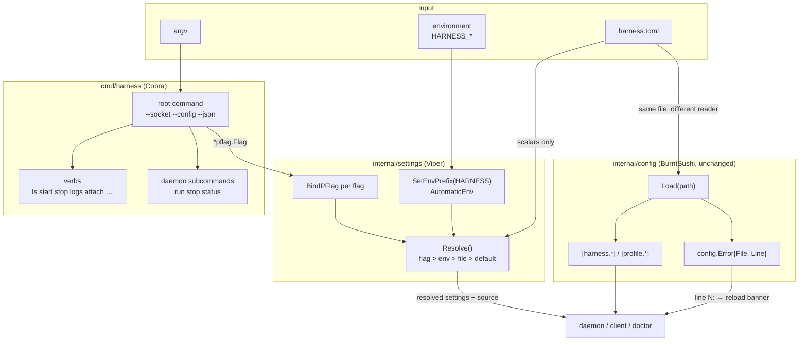
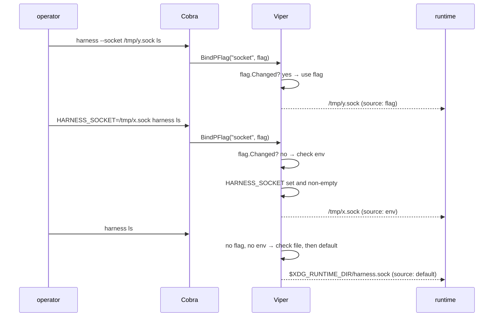

# Design: CLI Command Tree and Environment Configuration

## Context

Harness has no environment-variable configuration. `cmd/harness/main.go` parses
argv with the standard library's `flag` package, and `internal/config` parses
`harness.toml` with `BurntSushi/toml`. The only environment reads in the tree are
`TERM`, `TMUX`, `XDG_CONFIG_HOME`, `XDG_STATE_HOME`, and `XDG_RUNTIME_DIR` —
terminal and path discovery, not configuration.

Two properties of the current code constrain any fix:

1. **`parseInterleaved` exists because stdlib `flag` halts at the first
   positional.** `harness logs ticker --lines 3` only works because
   `cmd/harness/main.go` runs a parse → peel one positional → re-parse loop. The
   daemon subcommand tree is a nested `switch` on `rest[0]` with hand-written
   usage text alongside it.

2. **`internal/config` errors carry source line numbers.** `config.Error` holds
   `File`, `Line`, and `Msg`, and `LineNumber()` feeds the SPEC-0001 reload
   banner: *"using last-good config; line 12: …"*. The loader also uses
   `toml.MetaData` via `definedPaths` to distinguish an absent key from a
   zero-valued one — which is how `rawHarness.Enabled *bool` tells "not set"
   from "set to false".

Property 1 is an argument for Cobra. Property 2 is an argument against letting
Viper anywhere near the domain tables. SPEC-0010 and ADR-0016 take both.

## Goals / Non-Goals

### Goals

- Every process-level scalar configurable from `HARNESS_*`
- One precedence order — flag → env → file → default — stated once and tested as
  one table
- A daemon that starts and serves with no config file present
- Delete `parseInterleaved` and the hand-rolled daemon subcommand `switch`
- Preserve every existing verb, flag, and output contract byte-for-byte
- Preserve line-numbered config errors and the reload banner

### Non-Goals

- Environment configuration of `[harness.*]` or `[profile.*]` (ADR-0016: they
  are collections; name-mangling them into env vars is not reliably invertible)
- Replacing `BurntSushi/toml` in `internal/config`
- Secrets in the environment — `env_file` keeps that job per ADR-0008
- Changing the ADR-0006 config schema, hot-reload semantics, or the ADR-0009
  project-scoped `harness.toml` discovery walk
- A config-file writer for process settings; the TUI harness form keeps writing
  only the domain tables it already writes

## Decisions

### Decision: Cobra owns commands, Viper owns process-setting precedence

**Choice**: Cobra builds the command tree and declares flags. Viper resolves
process settings, bound to those flags via `BindPFlag`, with
`SetEnvPrefix("HARNESS")` and `AutomaticEnv`.

**Rationale**: These are the jobs each library is actually good at, and the seam
between them is clean — Cobra hands Viper a `*pflag.Flag`, Viper hands the
runtime a resolved value. The whole environment layer becomes a bind loop rather
than a hand-maintained `os.Getenv` ladder that someone must remember to extend
with every new setting.

**Alternatives considered**:
- *Viper for everything*: discards `toml.MetaData`, lowercases and flattens
  keys — the reload banner loses its line numbers and `Enabled *bool` loses its
  absent-vs-false distinction.
- *Hand-rolled `os.Getenv`*: no new dependencies and shippable in an afternoon,
  but leaves `parseInterleaved` and the hand-written subcommand dispatch in
  place, which is the actual maintenance burden.

### Decision: Two config readers, documented as a seam

**Choice**: Viper reads process-setting scalars from the same `harness.toml`
that `internal/config` reads for domain tables. Both read the file; neither owns
the other's keys.

**Rationale**: Line numbers are non-negotiable for the reload banner, and Viper
cannot produce them. Accepting two readers is cheaper than either losing the
banner or hand-rolling the precedence ladder.

**Consequence to guard**: this is exactly the kind of thing a future reader
"cleans up" by unifying. The seam is documented in ADR-0016, in this design, and
must carry a governing comment at both call sites, so the reason survives.

**Alternatives considered**:
- *Split the file in two* (process settings in one file, domain tables in
  another): a schema break, and ADR-0006 explicitly protects the existing file.
- *Teach `internal/config` the precedence ladder itself*: possible, but it is
  the hand-rolled option wearing a different hat.

### Decision: "Explicit" means `Changed`, not "non-zero"

**Choice**: A flag overrides the environment only when `Flags().Changed(name)`
reports the user typed it.

**Rationale**: The obvious implementation — "if the flag value differs from the
default, it wins" — silently breaks whenever a user explicitly passes the
default value, and breaks `--json=false` entirely. `Changed` is the only signal
that distinguishes "the user said so" from "nobody said anything."

### Decision: Empty is absent

**Choice**: `HARNESS_FOO=""` falls through to the next source rather than
setting an empty value.

**Rationale**: An exported-but-empty variable is overwhelmingly a shell artifact
(`export HARNESS_SOCKET=$SOME_UNSET_VAR`), not an operator asking for an empty
socket path. Every value in the table is a path, enum, host:port, int, or bool,
and the empty string is invalid for all of them — so treating it as absent
cannot discard a meaningful value.

### Decision: `harness doctor` reports the winning source

**Choice**: Extend the existing `doctor` verb to print each process setting with
its value and source (`flag` / `env` / `file` / `default`).

**Rationale**: Four sources means "which one won?" becomes the most common
support question. Viper knows the answer; surfacing it costs one column and
removes a whole class of confusion. `doctor` already exists and already owns its
own reporting and exit code, so this needs no new verb.

## Architecture

### Resolution order

## Risks / Trade-offs

- **Rewriting argv handling is where regressions hide.** → Characterization
  tests for every verb, flag, and the interleaved-positional contract land
  *before* the Cobra swap, not after, so the migration is provably behaviour-
  preserving rather than argued to be.
- **Two config readers invite a well-meaning "cleanup."** → Governing comments
  at both call sites naming ADR-0016 and this design, plus an explicit
  consequence bullet in the ADR.
- **Dependency weight.** Cobra pulls `pflag`; Viper pulls `afero`, `cast`, and a
  mapstructure/parser stack — the largest single addition in the project's
  history, to a tree ADR-0001 deliberately kept small. → Accepted openly in
  ADR-0016 rather than hidden; the alternative (hand-rolled) was costed and
  rejected on maintenance grounds, not on weight.
- **Viper's `AutomaticEnv` is greedy.** It will happily answer for any key ever
  registered, including ones added later without thought. → The recognized set
  is an explicit table in SPEC-0010, and the bind loop iterates that table
  rather than trusting `AutomaticEnv` alone to define the surface.
- **`HARNESS_*` becomes a tempting place for secrets.** → SPEC-0010 REQ "Secrets
  Exclusion" states the rule normatively, and the docs page repeats it next to
  the variable table where an operator will actually read it.

## Migration Plan

Three commits, deliberately separable so a bisect lands on a real cause:

1. **Characterization tests.** Lock today's CLI behaviour — every verb, flag
   parsing including the interleaved positional, `harness daemon` with and
   without a subcommand, unknown-verb exit codes, and `--json` placement before
   and after the verb. These must pass unchanged through steps 2 and 3.
2. **Cobra migration.** Replace the `flag.FlagSet` usage, `parseInterleaved`,
   the daemon `switch`, and the hand-written `usage()` with a Cobra tree. No
   behaviour change; step 1's tests are the proof.
3. **Viper + `HARNESS_*`.** Add `internal/settings`, bind the flags, wire the
   precedence ladder, extend `doctor` with source attribution, and document the
   variable table in `docs/usage/configuration.md`.

Rollback is per-commit. Steps 1 and 2 are independently valuable — the
characterization tests are worth having regardless, and the Cobra tree fixes the
flag parser even if the environment layer were abandoned.

## Open Questions

1. Should `HARNESS_CONFIG` also influence the ADR-0009 project-scoped discovery
   walk, or strictly name the global file? (SPEC-0010 currently says global
   only.)
2. Should `doctor` warn when a `HARNESS_*` variable is set but shadowed by an
   explicit flag, or report it silently as `flag`?
3. Does the TUI need to display the resolved source anywhere, or is `doctor` the
   right and only home for it?
4. `HARNESS_REDUCED_MOTION` (SPEC-0009 REQ "Reduced Motion") lands under these
   rules once the chatroom exists — does it belong in this spec's table now as a
   reserved name, or stay with the chatroom spec until implemented?
