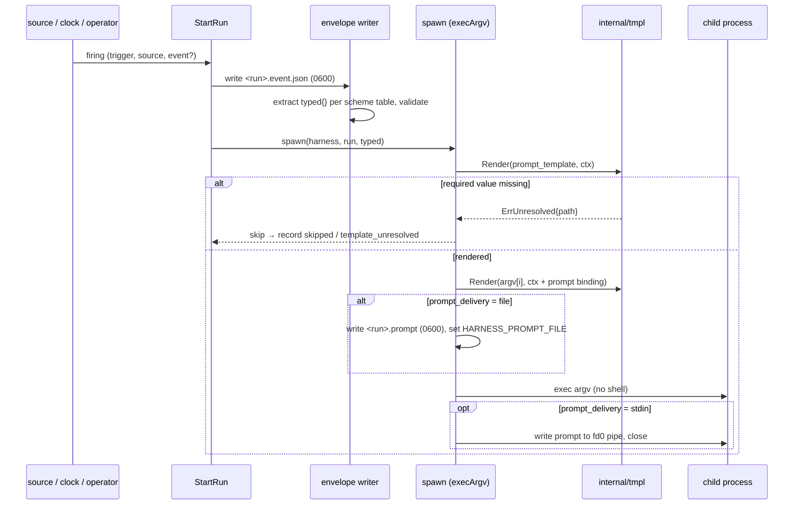
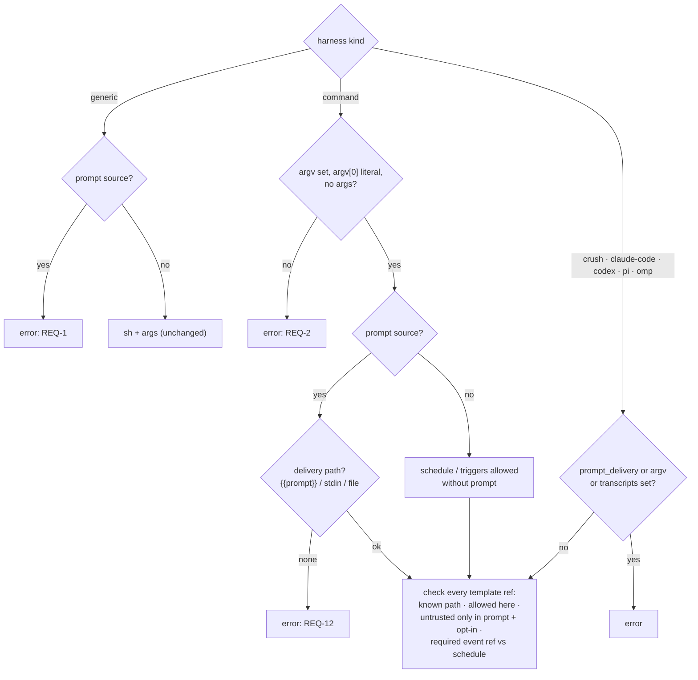

# Design: Command One-Shots and Templated Argv and Prompts

## Context

Today a harness is one of four kinds. `crush`, `claude-code` and `codex` are
adapters: `execArgvWithRegistry` in `internal/supervisor/spawn.go` asks the
adapter for a prompt one-shot's argv (`PromptCommand`), or for its executable
with `args` appended for a resident harness. `generic` is `sh`. Its
`PromptCommand` returns Crush's argv, which is the bug SPEC-0017 REQ-1 removes.

The prompt is verbatim (SPEC-0006 REQ "Prompt Source"). ADR-0021 and SPEC-0014,
merged but not yet implemented, add event triggers. The event reaches the run as
a `0600` envelope file named by `HARNESS_EVENT_FILE`, and "nothing from an event
SHALL be interpolated into the prompt, argv …".

ADR-0023 decides on a `command` kind, a closed template grammar with trust
tiers, three prompt delivery modes, and `pi`/`omp` adapters. Governing spec:
SPEC-0017.

Related specs: SPEC-0006 (adapters, prompt source, run correlation), SPEC-0008
(run records), SPEC-0014 (triggers, envelope), SPEC-0013 (metrics), SPEC-0002
(protocol). Related ADRs: ADR-0011, ADR-0013, ADR-0018, ADR-0021. Parallel
records cited in prose only until they merge: ADR-0026 (model pinning), ADR-0027
(budgets), ADR-0028 (run ledger).

## Goals / Non-Goals

### Goals

- Run any CLI resident, scheduled or triggered, exec'd without a shell.
- Put run and event context into argv and prompts, with every reachable value
  listed in one table and checked at load.
- Keep free text out of argv entirely, and out of prompts unless an operator
  opts in loudly.
- Make Pi and OMP first-class, including observation.
- Ship the `generic` + `prompt` rejection first, on its own.

### Non-Goals

- A general template language. There are no conditionals, loops or functions.
- Parsing arbitrary payloads. The typed table is fixed per scheme.
- Changing `generic` beyond REQ-1. It stays the shell escape hatch for resident
  one-liners.
- `stdin` or `file` delivery for the built-in adapters. They keep `argv`.
- Durable events, pool dispatch, and anything else ADR-0021 deferred and this
  ADR does not lift.

## Decisions

### A new `internal/tmpl` package owns grammar, context and rendering

**Choice**: `internal/tmpl` holds a hand-written scanner for the four
placeholder forms, a `Template` value (literal and placeholder segments, parsed
once at load), a `Context` interface keyed by path, and `Render(ctx) (string,
error)`. Config validation calls `Parse` and `Refs()`, and checks each
reference against a location-specific allow set (argv, prompt template, fence).
The supervisor calls `Render` at spawn.

**Rationale**: parsing at load is what makes "unknown path" and "free text in
argv" load errors. A dedicated package keeps the rules in one place, with no
dependency on config or supervisor, and it is easy to fuzz.

**Alternatives considered**:
- `text/template` with `Option("missingkey=error")` and an empty `FuncMap`:
  still exposes `printf`, `index`, `len`, `and`/`or` and method calls on context
  values. That makes the reachable-value set hard to state, and the parse tree
  hard to validate by location.
- Regex substitution at spawn: gives no load-time errors, and escaping rules
  would be invented ad hoc.

### Typed extraction happens once, when the envelope is written

**Choice**: the supervisor writes the SPEC-0014 envelope in `beginRun`, before
spawn. It also runs the extractor for the source's scheme and stores the result in
`envelope.typed`. The template context reads `typed`, and never the raw
payload.

```json
{
  "version": 1,
  "kind": "webhook",
  "source": "webhook.gitea-pr",
  "event_id": "7f1e…",
  "received_at": "2026-09-22T05:10:00Z",
  "webhook": { "event": "pull_request", "delivery": "7f1e…", "body": { "…": "…" } },
  "typed": {
    "name": "pull_request",
    "action": "opened",
    "repo": "stump.wtf/harness",
    "number": 412,
    "url": "https://gitea.stump.rocks/stump.wtf/harness/pulls/412",
    "sha": "8febab3c79a7a61c31f69f33a762ef49262b175e",
    "actor": "joestump"
  }
}
```

**Rationale**: one extraction means the agent reading the file and the
template see the same validated values. A replay (`harness trigger --event`)
re-extracts from the stored body, so a replay renders exactly what the original
run rendered.

**Alternatives considered**:
- Extract at render time: this would put two readers of the payload in two
  places, and a replayed file carrying a hand-edited `typed` could smuggle
  values. Re-extracting on replay closes that; storing is only a convenience for
  the agent.

The extractor table is data: a slice of `{field, jsonPaths []string, validate
func}` per scheme. Adding a scheme (for example `switchboard` or `cairn`, once
their payloads are specified) is one table and a fixture.

### Validation patterns

| Field | Pattern / rule |
| --- | --- |
| `name`, `action` | `^[a-z][a-z_]{0,63}$` |
| `repo` | `^[A-Za-z0-9][A-Za-z0-9_.-]{0,99}(/[A-Za-z0-9][A-Za-z0-9_.-]{0,99}){1,19}$`; exactly 2 segments for github/gitea |
| `number` | JSON number with no fraction, 1 ≤ n ≤ 2147483647 (a JSON string is rejected) |
| `url` | `url.Parse` OK, scheme `https`, len ≤ 2048, no `[\x00-\x20\x7f]`, `Host` equal to the repository's `html_url`/`web_url` host |
| `sha` | `^[0-9a-f]{40}([0-9a-f]{24})?$` |
| `actor` | `^[A-Za-z0-9][A-Za-z0-9_.-]{0,39}$`, and in `trusted_actors` (case-insensitive) |
| `meta.<key>` | key `^[a-z][a-z0-9_]{0,31}$`; value a JSON string `^[A-Za-z0-9][A-Za-z0-9_.:-]{0,127}$` |
| `event.id` | `^[A-Za-z0-9][A-Za-z0-9_.:-]{0,127}$`, else daemon-generated |

Every pattern starts with an alphanumeric (or is numeric), so no typed value can
start with `-`. A `testing/quick` property test generates arbitrary JSON
payloads and asserts it for every extracted value.

### Where rendering happens in spawn

**Choice**: `execArgvWithRegistry` grows a render step and returns a
`spawnPlan{name, args, stdin io.Reader, extraEnv []string, promptFile string}`.

1. Resolve the prompt source. `prompt` and `prompt_file` stay verbatim, and
   `resolvePrompt` already reads the file. `prompt_template` and
   `prompt_template_file` are read, parsed and rendered against the context.
2. For a built-in adapter, pass the rendered prompt to `PromptCommand`, as
   today.
3. For `command`, render each `argv[1:]` element, with `prompt` and
   `prompt_file` bound per `prompt_delivery`. For `file`, write the prompt file
   first. For `stdin`, prepare the reader.
4. On an unresolved required value, return `tmpl.ErrUnresolved{Path}`.
   `startRun` maps it to a `skipped` record with reason `template_unresolved`,
   and a plain start maps it to a start error.

The render context is built by the supervisor from the harness, the run request
(run ID, trigger, source) and the envelope's `typed`. The config package never
sees run values.

### `stdin` delivery moves the controlling terminal to fd 1

**Choice**: for `stdin` delivery, `cmd.Stdin` is an `os.Pipe` read end, and
`cmd.Stdout` and `cmd.Stderr` are the PTY slave. `SysProcAttr` becomes
`{Setsid: true, Setctty: true, Ctty: 1}`, since `Ctty` names a descriptor in the
child. A goroutine writes the prompt to the pipe's write end and closes it. A
write error (the child exited early) is logged at debug level and is not a run
failure. The child's exit status decides that. The supervisor marks the run
`stdin_is_prompt`, and the attach path refuses input for it with a one-line
notice.

**Rationale**: writing a prompt through the PTY master goes through the line
discipline. It echoes into the log, caps canonical input near 4 KiB (`MAX_CANON`
on Linux, 1024 on macOS), and turns `^C`/`^D`/`^Z` bytes into signals and EOF.
A pipe is byte-exact at any size.

**Alternatives considered**:
- Write through the PTY in raw mode: this would require the child to have put
  the terminal in raw mode first, which a one-shot reading stdin does not do.
- No `stdin` mode: some CLIs (and scripts) only read the prompt from stdin, and
  `file` needs cooperation from the CLI.

xpty's `Start` sets unset std streams to the slave, so the implementation sets
`Stdin` before calling it, and a test on Linux and macOS asserts that fd 0 is a
pipe and fd 1 is a TTY. It must be the real behaviour, checked from inside the
child with `test -t`, not a mock.

### `pi` and `omp`: one implementation, two registry entries

**Choice**: `type piFamily struct{ name, exe, rootEnv, rootRel string }`,
registered twice:

| | `pi` | `omp` |
| --- | --- | --- |
| Executable | `pi` | `omp` |
| Prompt one-shot argv | `pi --print [--model M] <prompt>` | `omp --print [--model M] <prompt>` |
| Session root | `$PI_CODING_AGENT_DIR/sessions`, default `~/.pi/agent/sessions` | the OMP equivalent (its agent-dir variable, default under `~/.omp/`) |
| Tail adapter | `tail.PiAdapter{Dir: root}` | `tail.PiAdapter{Dir: root}` |
| `auto_accept` | no flag (Pi has no permission prompts) | no flag |
| `max_turns` | inert | inert |
| `quiet` | `--print` already prints only the final response | same |

Pi's flags (`--print`, `--model` taking `provider/id`, `PI_CODING_AGENT_DIR`)
come from its README. OMP is a Pi fork. The implementation story must record
the exact OMP version it verified against, confirm the OMP flags and directory
variable against that binary, and add a recorded OMP session as an agent-trace
fixture. If OMP's session format has diverged from Pi's, the `omp` entry gets
its own agent-trace reader (an upstream agent-trace issue), and the adapter
ships without observation until then. The `command` + `transcripts` fallback
covers flag drift in the meantime.

**Rationale**: see ADR-0023, axis 4.

### The observer's source map gains `pi` and `omp`

**Choice**: `runtrace.Sources` maps a harness to its agent-trace source by
adapter name, plus `transcripts` for `command`. It currently maps crush,
claude-code and codex. Add `pi` and `omp`, resolved through `DiscoveryEnv` for
the root variable, so an `env_file` that relocates the agent directory is
followed.

### The immediate slice is independent

REQ-1 touches `registerHarness`, `validateHarnessDef`, `internal/tui/form.go`,
`Generic.PromptCommand` and the spawn guard. It needs none of the rest, so it
ships first (#420). `Generic.PromptCommand` returns `("", nil)`, and
`execArgvWithRegistry` returns `ErrGenericPrompt` when the adapter is `generic`
and a prompt is set. A test asserts that no `exec.Cmd` is constructed. The test
fails if the delegation to Crush is restored.

## Architecture

### Where the pieces live

| Package | Change |
| --- | --- |
| `internal/tmpl` (new) | Scanner, `Template`, `Refs`, `Render`, the fence, `ErrUnresolved`, `ErrGrammar` |
| `internal/config` | `argv`, `transcripts`, `prompt_template[_file]`, `prompt_delivery`, `untrusted_inline`; `trusted_actors` on `[webhook.*]`; the validation matrix |
| `internal/core` | `Harness` fields for the new keys; `Adapter` enum values |
| `internal/adapter` | `command` (argv owner, optional tail adapter), `pi`, `omp`; `Generic.PromptCommand` returns nothing |
| `internal/supervisor` | `spawnPlan`, render step, `stdin`/`file` delivery, `template_unresolved` skip, prompt-file pruning |
| `internal/trigger/extract` (new, beside SPEC-0014's `internal/trigger`) | Pure per-scheme typed extractors and validators; the supervisor's envelope writer (SPEC-0014) calls them and stores `typed` |
| `internal/runtrace` | `Sources` for `pi`, `omp`, and `command` + `transcripts` |
| `internal/supervisor/project.go` | Wire validation mirroring config; `untrusted_inline` rejected |
| `internal/tui` | Kind picker, argv editor, round-trip of the new keys |
| `cmd/harness` | `describe` fields, doctor warn row |
| metrics collector | `harness_template_render_failures_total`, `harness_template_untrusted_renders_total` |

### Render flow



### Validation matrix (config load)



## Risks / Trade-offs

- **The typed table drifts from real payloads.** Forges add and rename fields.
  → Fixtures are real captured deliveries per scheme, a field that stops
  extracting is merely absent (fail safe), and a required reference turns it
  into a visible `template_unresolved` skip rather than a wrong argument.
- **The fence gets used as the default.** → It is off by default, WARNs at load
  and on every render, is counted, gets a doctor row, and is refused in project
  files. The docs lead with `{{event.file}}`.
- **`stdin` wiring differs across platforms.** → A real-process test runs on
  both CI platforms. Attach is view-only for those runs, and the client is told
  why.
- **Pi/OMP flag drift.** → Flags are pinned in one place, and the version is
  recorded in the adapter's governing comment. The `command` + `transcripts`
  fallback is documented beside the adapter.
- **argv-visible values.** Typed values in argv are visible in `ps`. → They are
  identifiers, not secrets. The prompt already appears in argv for `argv`
  delivery today (ADR-0018). The docs recommend `file` or `stdin` for anything
  sensitive.
- **Required-reference skips surprise operators.** A `push` has no `number`. →
  The skip is a recorded decision with the path named, and `harness runs` shows
  it. Load-time rules reject the cases where every firing would skip.

## Migration Plan

1. **#420 (REQ-1)** ships first and alone. A `generic` + `prompt` config fails
   to load with a message naming the agent kinds. Our fleet has none. Anyone
   else sees a load error instead of a wrong-agent run, and the release notes
   say so.
2. `internal/tmpl`, then the `command` kind (resident and scheduled), then
   `prompt_template` for all kinds. None of these need SPEC-0014's runtime.
3. The event context (`event.*`, typed extraction, `trusted_actors`, the fence)
   lands after SPEC-0014's envelope writer exists.
4. `pi`/`omp` adapters and `transcripts` are independent of 2 and 3.

Rollback: every new key is opt-in. Removing the keys restores today's
behaviour, except REQ-1, which is intentionally not reverted.

## Open Questions

- Should `stdin` and `file` delivery extend to the built-in adapters? Claude
  Code's `-p` and Codex's `exec -` read stdin, and keeping prompts out of argv
  is worth having. It is deferred to keep the adapter argv contracts unchanged
  in this spec.
- Should `trusted_actors` also accept an org or team (a forge API call)? That is
  deferred: it needs a forge client in the daemon, which ADR-0021 avoided, and
  Switchboard's trusted-actor work (Switchboard ADR-0031) is the better home.
- `switchboard` and `cairn` extractors wait for their payload contracts
  (Switchboard SPEC-0024 notify hooks, Cairn ADR-0022 events).
