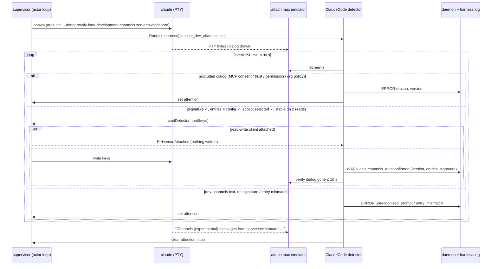

# Design: Auto-Confirm Claude Code Development Channels

## Context

A resident `claude-code` harness runs `claude` with operator `args` under a PTY
(ADR-0003). The daemon feeds the PTY stream to an `x/vt` emulator. That is the
screen `harness attach` repaints (`internal/attach/screen.go`), and a separate
emulator (`internal/supervisor/sanitize.go`) extracts the durable log. Attach
keystrokes reach the child through `Supervisor.WriteInput` (the
`cmdWriteInput` actor command in `internal/supervisor/supervisor.go`). Attach
sessions carry a mode, and SSH keys can be `read_only` (ADR-0008).

With `--dangerously-load-development-channels`, Claude Code shows a full-screen
warning dialog on every start. It lists the development channels and offers
**I am using this for local development** and **Exit**. The push-events guide
documents the resulting park-until-attach behaviour.

ADR-0029 chooses opt-in, per-entry auto-confirmation against known signatures,
with loud logging and fail-safe handling of unknown text. Governing spec:
SPEC-0023.

Related specs: SPEC-0003 (lifecycle; the attention flag sits beside the
state), SPEC-0006 (adapters), SPEC-0002 (protocol), SPEC-0013 (metrics).
Cross-repo record, cited by number (accepted in the same 2026-09-22 review):
Switchboard ADR-0030 (doorbell acknowledgement and doctor).

## Goals / Non-Goals

### Goals

- A resident Claude Code channel worker restarts unattended, for exactly the
  entries the operator named.
- Unknown dialog text never produces a keystroke.
- Every firing is visible in logs, `describe`, `doctor`, metrics and events.

### Non-Goals

- Answering any other prompt: MCP server consent, trust, tool permissions, or
  anything else.
- Bypassing or detecting around `channelsEnabled`.
- One-shot Claude Code. ADR-0021's daemon-held channel needs no flag.
- A general expect engine. The detector knows one dialog family.

## Decisions

### An adapter detector, started by the supervisor

**Choice**: add a narrow optional interface on adapters:

```go
// StartupDetector is implemented by adapters that watch a harness's
// screen during startup (SPEC-0023). The supervisor starts one per spawn
// when Wants(h) is true.
type StartupDetector interface {
    Wants(h core.Harness) bool
    Run(ctx context.Context, h core.Harness, io DetectorIO) DetectorResult
}

type DetectorIO interface {
    Screen() ScreenSnapshot         // rendered cells as rows of text, plus cursor
    Send(keys []byte) error         // via the actor loop; fails if a writer is attached
    Attached() (readWrite bool)     // any read-write client attached right now
    Version() string                // cached `claude --version`, or "unknown"
    Log() *log.Logger
}
```

`ClaudeCode` implements it. `Wants` is true when `AcceptDevChannels` is
non-empty. The supervisor starts `Run` right after `spawn` returns, under a
context cancelled on exit, stop or restart, with a 90-second deadline.

**Rationale**: it keeps Claude Code knowledge in the adapter (ADR-0011), and the
supervisor stays agnostic. It only knows that "an adapter may watch startup".

**Alternatives considered**:
- A daemon-wide prompt-answering feature: rejected. It would invite answering
  other prompts, which ADR-0029 forbids.
- Matching in the attach mux: rejected, because the mux exists only when a
  client is attached.

### Reading the screen

**Choice**: `ScreenSnapshot` comes from the attach mux's emulator. The daemon
keeps that emulator for every running harness, because it backs the attach
snapshot. It is read under the mux's existing lock, and each row is rendered to
plain text (cell strings, wide-cell continuations skipped, trailing spaces
trimmed, whitespace runs collapsed). The detector polls it every 250 ms during
the window. That is cheap (80×24 to about 300×80 cells) and runs only for up to
90 seconds per spawn.

**Rationale**: the dialog is drawn with absolute cursor positioning and SGR
styling. Matching raw bytes would mean re-implementing a terminal, badly.

### The signature table

**Choice**: `internal/adapter/claudecode_devchannels.go` holds:

```go
type devChannelSignature struct {
    ID             string   // e.g. "dcw-2026-09"
    CapturedFrom   []string // Claude Code versions of its fixtures
    Required       []string // exact phrases, whitespace-collapsed
    EntryPattern   *regexp.Regexp // extracts entries from listed rows
    AcceptSelected func(ScreenSnapshot) bool // or nil when KeysSelect
    KeysSelect     bool
    Keys           []byte
}

var excludedDialogs = []struct {
    Reason string   // other_dialog | org_policy_blocked
    Any    []string // any phrase present → excluded
}{ /* MCP consent, trust, permission, org policy */ }
```

The first signature is captured from a current Claude Code (recorded in its
fixture). Per the Channels reference, its `Required` phrases are the dialog's
title phrase naming development channels, `I am using this for local
development`, and `Exit`. `EntryPattern` matches `server:<name>` and
`plugin:<name>@<marketplace>` tokens on the listing rows. `Keys` is the key that
selects the accept option by an absolute choice, if the dialog offers numbered
choices (`KeysSelect = true`). Otherwise it is `\r`, with `AcceptSelected`
checking that the selection marker precedes the accept label. The exact phrases
and key are fixed by the fixture in the implementation story, not guessed here.

**Rationale**: data plus fixtures makes a Claude Code change a small, reviewable
diff: capture the new dialog, add a signature, and add its fixture.

### Fixtures are raw PTY captures

**Choice**: `testdata/devchannels/<id>-<version>.pty` holds the raw byte stream
captured from a real `claude --dangerously-load-development-channels
server:fixture` under a PTY (for example with `script -q`), from spawn until the
dialog is fully drawn. There are companion fixtures for: two entries, the MCP
consent dialog, the org-policy block, and the registration notice. Tests feed
each file through a fresh `x/vt` emulator and the detector, with a fake
`DetectorIO`, and assert the outcome and the exact bytes sent.

A fixture must contain no account data. Captures are made with a throwaway
config directory, and the story checks each capture by hand before committing
it.

### The write goes through the actor loop, with the attach check inside it

**Choice**: `DetectorIO.Send` issues a new actor command, `cmdDetectorInput{keys,
reply chan error}`. The actor loop checks for a read-write attached client
before writing. If one exists, it returns `ErrHumanAttached` and writes
nothing. Otherwise it writes the bytes to the PTY master exactly as
`cmdWriteInput` does.

**Rationale**: attach and detach are also actor-loop events, so the check and
the write are atomic with respect to them (SPEC-0023 "Concurrency Safety"). A
client attaching mid-decision is handled in one place.

### Versions are looked up once per binary

**Choice**: at spawn, resolve `claude` on the daemon's PATH (the same lookup
spawn uses), `stat` it, and look it up in a cache keyed by
`{path, size, mtime}`. On a miss, run `claude --version` with the harness's
composed environment and a 5-second timeout, and parse the first
semver-looking token. On failure, record `unknown`.

### Attention is a flag, not a state

**Choice**: `core.Attention{Kind, Reason string; Since time.Time; Version
string}` on the supervisor's status, projected on the wire. It is independent
of the SPEC-0003 state machine, because the process is `running` and the
lifecycle is fine. What needs a human is a dialog. `harness list` renders it in
the STATE cell, as `running` with an attention marker (the exact glyph follows
the SPEC-0001 state vocabulary). `doctor` turns it into a fail row.
`attention_changed` events carry it. It is cleared on the registration notice or
the next spawn, and never persisted.

**Alternatives considered**:
- A new lifecycle state (`waiting`): rejected. It would ripple through the
  state machine, the restart policy, metrics state mapping (#407) and operating
  hours for a condition that does not change lifecycle behaviour.

### The persisted firing record

`state.json` gains `dev_channels: {<harness>: {count, last: {at, version,
entries, signature}}}`. It is written after each confirmation. It is kept
separate from intent, so it never affects start behaviour.

## Architecture



### Where the pieces live

| Package | Change |
| --- | --- |
| `internal/config` | `accept_dev_channels` parse and validation; REQ-2 extraction from `args`; global-only rule |
| `internal/supervisor/project.go` | Reject the key on the wire |
| `internal/core` | `Harness.AcceptDevChannels`; `Attention` |
| `internal/adapter` | `StartupDetector`; `claudecode_devchannels.go` (signatures, excluded dialogs, detector); fixtures under `testdata/devchannels/` |
| `internal/attach` | A read-only `ScreenText()` accessor on the mux emulator |
| `internal/supervisor` | Detector lifecycle per spawn; `cmdDetectorInput`; attention on status; firing record in state |
| `internal/protocol` / `internal/daemon` | `attention` on the projection; `attention_changed`, `dev_channels_confirmed`; `ProtoMinor` bump |
| `cmd/harness` | `list` STATE marker; `describe` fields; two `doctor` rows (attention fail, opt-in warn) |
| metrics collector | `harness_dev_channels_autoconfirm_total` |
| `docs/` | The danger callouts (REQ-15) in the configuration reference and the push-events guide |

## Risks / Trade-offs

- **Claude Code changes the dialog.** → Unknown text sends nothing, errors and
  flags attention. A new signature needs one fixture. The `captured_from`
  versions show which releases are covered.
- **A false match on similar text.** → Exact phrases, all required, two stable
  reads, an exact entry-set equality, an accept-selection check, and a single
  write followed by verification.
- **An operator opts in without understanding it.** → A standing doctor warning,
  a WARN per firing, and a danger callout on both pages. The key cannot be set
  from project files.
- **The input write races an attaching human.** → The attach check and the write
  happen in one actor command.
- **Registration notice text changes.** → Absence of the notice only produces
  `no_registration_notice` attention after a successful confirmation, a
  visible, fail-safe outcome. The notice phrase lives in the table with a
  fixture.

## Migration Plan

Purely additive, opt-in. Existing harnesses are unaffected. The push-events
guide's "attach and confirm" instructions remain for anyone who does not opt
in, and gain the callout and the new key. Rollback: remove the key.

## Open Questions

Every question below was settled in the Operation Stumply design review. None is
left open.

- **Does the dialog offer numbered choices, or only arrow navigation?** Resolved
  (design review 2026-09-22): the first captured fixture decides `KeysSelect`,
  as proposed; the design prefers absolute selection.
- **Should `doctor` escalate to `fail` for a confirmation under an unknown
  Claude Code version?** Resolved (design review 2026-09-22): no, deferred as
  proposed. Matching is by text, and an unknown version with matching text is
  still a match.
- **Opt-in and loudness.** Resolved (design review 2026-09-22): auto-confirm
  stays opt-in per entry, with a WARN every time it fires and a standing
  `doctor` warning (REQ-10 to REQ-14).
