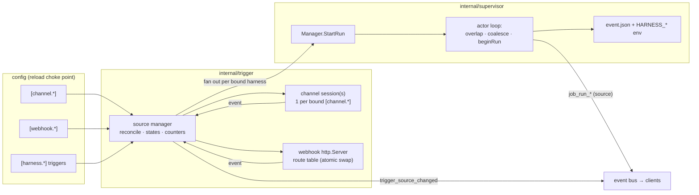
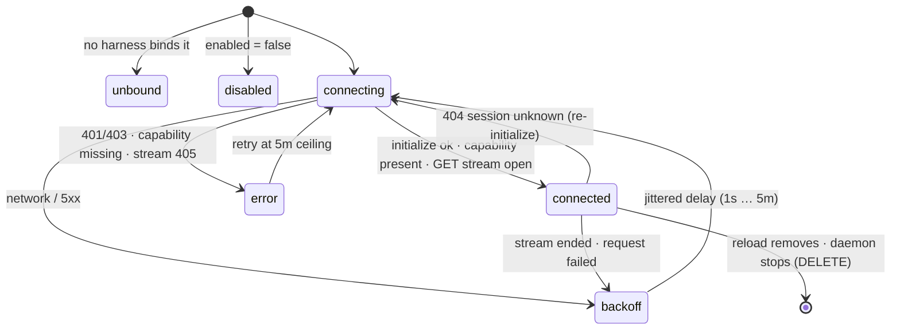
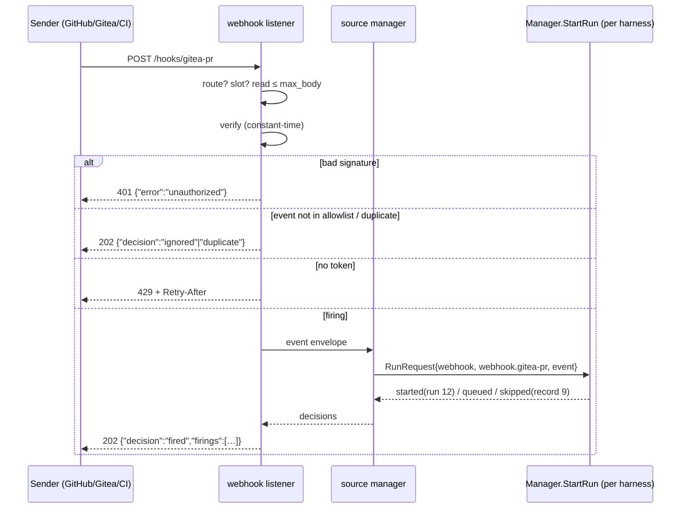

# Design: Event-Triggered One-Shot Runs

## Context

SPEC-0008 gave the daemon a clock, and a run machinery hung off it: run
records, per-run logs, `timeout`, `on_overlap`, `keep_runs`, and `trigger`. Every
part of that machinery is gated on one test, `Schedule != ""`:

* `opTrigger` answers `not_scheduled` without it.
* `startRun` returns a skip with no record.
* The run keys are rejected at parse time without it.

Events reached agents only through resident sessions that held an MCP channel
themselves (the push-events guide). The daemon had no inbound HTTP server and
no MCP code of any kind.

ADR-0021 decides that the daemon holds the channel as a listen-only client, runs
an opt-in webhook listener, and fires prompt harnesses through the same
`StartRun`. Governing spec: SPEC-0014.

Related specs:

* SPEC-0008: the run machinery this extends.
* SPEC-0002: the protocol.
* SPEC-0006: the prompt source, which is unchanged.
* SPEC-0012: hours gating.
* SPEC-0013: metrics.

Related ADRs:

* ADR-0004 and ADR-0008: front doors and secrets.
* ADR-0010: the future MCP server side.
* ADR-0019: option 1E, "the daemon must receive the demand".

## Goals / Non-Goals

### Goals

- An event gets exactly what a cron firing gets, through the same entry point:
  a fresh context, a record, a log, a timeout, an overlap decision, and attach.
- Claude Code one-shots driven by doorbells, with no interactive
  `--dangerously-load-development-channels` prompt anywhere in the loop.
- A listener whose health is observable. "Connected" means "a doorbell would be
  heard", not "a session exists".
- A webhook surface fit for a server: opt-in, authenticated on every route,
  bounded, and with no secrets in the config.
- Surviving the config rewrite cadence without reconnecting, for the same
  reason schedules must not lose their phase.
- A local, deterministic test of what an event will do: `trigger --event`.

### Non-Goals

- **Durable buffering.** Harness is a trigger, not a queue. Switchboard is the
  queue.
- **Routing languages.** `events` is an allowlist on one event name: a header,
  or Standard Webhooks' `type`. jq over bodies, verified-actor checks and label
  routing belong to Switchboard.
- **Calling upstream tools.** The daemon never claims, completes or lists. The
  agent does.
- **Stdio channel servers.** Supervising them is ADR-0010's broker.
- **Pools and concurrency.** One process per harness, as today. Fan-out is the
  only dispatch mode.
- **Synchronous results.** A webhook caller gets a run ID, not an outcome.
- **Outbound notification.** SPEC-0008's non-goal stands: the daemon still
  does not send anything anywhere.

## Decisions

### One predicate: *triggered*

`core.Harness` gains `Triggers []string`. A single method, `Triggered()`, which
means `Schedule != "" || len(Triggers) > 0`, replaces the checks in `opTrigger`,
`startRun`, config run-key validation, `jobs`, and the listing surfaces.

**Rationale:** the exclusions and run keys exist because the harness is a
one-shot, not because it has a clock. Keeping `Schedule != ""` at those sites and
adding `|| len(Triggers) > 0` beside each would repeat the branching tax ADR-0013
recorded. Surfaces that genuinely need the clock (next window, countdown) keep
asking about `Schedule`.

**Alternatives considered:**

- A distinct harness kind for event harnesses: rejected for the reasons 2A lost
  in ADR-0013.

### The event rides the `RunRequest`, and is written at `beginRun`

`supervisor.RunRequest` gains `Source string` and `Event *Event`. `Event` holds
the envelope as bytes plus its `event_id`. The actor loop makes the overlap
decision exactly as today. When a run actually begins, whether immediately or
when a held request is released, `beginRun` writes
`<jobs dir>/<name>/<run_id>.event.json` (`0600`) beside the run log. It then
appends the `HARNESS_*` variables to the spawn environment after `env_file`, so
they win.

**Rationale:**

- Writing at `beginRun` means a skipped firing never touches disk.
- A held firing's file carries the run ID it actually gets.
- Pruning is the same `keep_runs` sweep that deletes the log: one directory, one
  lifetime.
- `buildEnv` is the only place the environment is assembled, so the override
  order is one line.

**Alternatives considered:**

- Write the file at ingress and pass its path along: this orphans files for
  skipped and coalesced firings, and makes the path independent of the run ID.
- Pass the event on stdin: stdin is the PTY slave, and attach keystrokes arrive
  on it.

### Coalescing lives on the actor loop

The supervisor keeps an *open skip* for the run in flight, keyed by
`(trigger, source, reason)`. A skip matching the open key increments
`coalesced` on the stored record through the Manager, without emitting an
event. A skip that does not match opens a new record. The open skips are cleared
when the run in flight ends.

**Rationale:** the overlap decision is already atomic on the actor loop
(SPEC-0008). Coalescing is part of that decision, so it lives in the same place
and inherits the same ordering guarantees. The alternative, a separate
ingress-side debouncer, would be a second decision-maker that can disagree with
the first.

### A purpose-built channel listener, not the Go MCP SDK

`internal/trigger/channel` implements only what a listen-only Streamable HTTP
client needs:

- `POST initialize`, then `POST notifications/initialized`;
- `GET` for the standalone stream;
- an SSE decoder that tolerates multi-line `data:` fields and tracks `id:`;
- JSON-RPC decoding of notifications and server requests;
- `ping` replies;
- `Mcp-Session-Id` and `MCP-Protocol-Version` headers;
- `DELETE` on close.

That is a few hundred lines.

**Rationale:** `modelcontextprotocol/go-sdk` v1.7.0, the version Crush uses, is
hostile to this exact use, in two ways found the hard way in the Crush fork's
channel work:

1. It rejects unknown JSON-RPC methods, `notifications/claude/channel` among
   them, before any handler or middleware runs. So a custom notification can
   only be observed below the SDK's connection.
2. It opens the standalone SSE stream only when a type assertion on its own
   connection type succeeds. Wrapping the connection to intercept notifications
   therefore silently prevents the stream from ever opening, and every doorbell
   is then rejected server-side as "stream not connected".

Crush works around both with an HTTP round-tripper filter. A daemon that never
calls tools gains nothing from the SDK in return for carrying that workaround
across SDK upgrades.

**Alternatives considered:**

- The go-sdk with Crush's round-tripper filter: works, but couples the daemon to
  SDK internals for zero feature benefit.
- `mark3labs/mcp-go`: it has a generic notification hook, but it is a second
  large dependency for the same five requests.

Revisit this if ADR-0010's broker brings in an SDK for the server side anyway.

### Health is the stream, and "never opened" is not a rebuild signal

A source is `connected` only while a GET stream body is being read. Two lessons
from the Crush fork's stream-health watchdog carry over:

- A session that answers pings over POST says nothing about the stream.
- A stream that was *never observed open* is absence of evidence. That watchdog
  registered a fresh health record on every connect, so treating "never opened"
  as unhealthy turned into a self-sustaining rebuild loop, once a minute, on
  hosts whose streams were in fact delivering.

Here the state machine is driven by events the listener itself observes
(stream opened, stream ended, request failed), never by a poll that re-reads
fresh state. A failure to *open* the stream is an ordinary connection failure
that goes to `backoff`. It is never a periodic health verdict.

### Catch-up reuses the scheduler's late grace

A reconnection fires `catch_up` only when the outage exceeded one minute, which
is the scheduler's `LateGrace`, and on the first connection after daemon start.

**Rationale:**

- A doorbell lost to a brief blip is re-rung by the server within minutes, so
  only a long gap or a daemon restart can outlast the re-rings.
- Reusing `LateGrace` means "late" means one thing everywhere, and a flapping
  link cannot produce a run per flap, because backoff stretches the outages it
  counts.
- A reload-caused reconnect is excluded explicitly. The reconciler tells the
  listener that the close is deliberate.

### Webhook pipeline order: cheap checks first, and the budget spent last

Each request goes through:

1. method;
2. route lookup;
3. concurrency slot;
4. bounded body read;
5. verify;
6. `events`;
7. de-duplication;
8. rate limit;
9. fire.

**Rationale:**

- Verification needs the whole body, so the body cap must come first.
- The rate limit sits after verification, so forged traffic cannot drain a
  route's budget and lock out the real sender.
- The rate limit sits after `events` and de-duplication, so a GitHub `ping` or a
  redelivery costs nothing.
- A rate-limited delivery is left out of the de-duplication set, so the
  sender's retry is honored rather than dropped as a duplicate.

Unauthenticated floods are bounded instead by the body cap, the timeouts, and
the 64-slot concurrency limit. HMAC over at most 25 MiB is cheap next to any of
them.

**Alternatives considered:**

- A rate limit before verification: cheaper under attack, but it turns any
  sender that knows the URL into one that can block the real one.

### Verification presets, not a scheme language

Six `verify` values, four of them presets that fix headers. `hmac-sha256` with
configurable headers and `bearer` cover the long tail.

**Rationale:** a preset makes a GitHub or Gitea route a three-line table and
removes the most common misconfiguration (a wrong header name or prefix).
Timestamped schemes need replay-window logic, so they wait until someone needs
one. Stripe and Slack still wait.

### Standard Webhooks, because Switchboard's notify hooks use it

*Added 2026-09-22.* Switchboard ADR-0029 (accepted) gives each Switchboard
endpoint outbound **notify hooks**: a signed, payload-free POST sent when a todo
lands on one of its queues. It fixes their signing as Standard Webhooks. The
hook exists to wake a consumer that has no live session, which is exactly what a
triggered harness is. Without this scheme, a Switchboard-to-Harness hook could
only be received on a `hmac-sha256` route. That route cannot express
`id.timestamp.body`, so it would fail every delivery.

The config for that path:

```toml
[server]
webhook_listen = "127.0.0.1:8484"      # behind a TLS-terminating reverse proxy

[webhook.switchboard]
verify = "standard-webhooks"
env_file = "~/.config/harness/env/sb-notify.env"
secret = "${SB_NOTIFY_SECRET}"          # whsec_…, shown once by create_notify_hook
events = ["todo.ready"]                 # the body's "type"

[harness.sb-drain]
harness = "claude-code"
prompt_file = "~/agents/sb-drain.md"    # "claim_next until empty, then stop"
triggers = ["webhook.switchboard"]
schedule = "@every 1h"                  # safety net: the hook is best-effort
```

The details follow the specification and its reference libraries. They are not
our own choices:

- **The key is the decoded secret.** A `whsec_` secret is base64 of 24 to 64
  random bytes, and the HMAC key is those bytes. Keying on the string would
  verify nothing any conforming sender produced. The format is checked at load,
  so a pasted hex secret fails there rather than as a 401 on every delivery.
- **5 minutes of tolerance, both ways.** This is the reference libraries'
  default. It absorbs ordinary clock skew and a sender's short retry backoff,
  and it bounds replay independently of the in-memory de-duplication set, which
  a restart empties.
- **Every `v1` entry is tried.** A sender rotating its secret signs with both
  the old and the new one for a while. Trying every entry lets the operator
  update `env_file` at any point in that window, and needs no second secret on
  our side. `v1a` (ed25519) entries are skipped, not rejected, so a sender that
  adds an asymmetric signature beside the symmetric one keeps working.
- **The event name is the body's `type`.** The specification defines no event
  header; it puts a dotted `type` in the payload, and Switchboard's body carries
  `"type": "todo.ready"`. Reading one top-level string after verification keeps
  `events` a one-field allowlist. It does not become a body routing language.
- **`webhook-id` is the delivery ID.** The specification requires it to stay
  the same across retries, and it is inside the signature, so it is a
  trustworthy de-duplication key.

**Alternatives considered:**

- *A generic "timestamped HMAC" scheme with configurable signed-content
  template, timestamp header and tolerance.* That is the scheme language this
  design rejects. It would also cover Stripe and Slack only in part, since each
  has its own header grammar.
- *Ask Switchboard to sign notify hooks the GitHub way (`hmac-sha256` over the
  body).* That throws away replay protection on the one path that is built to
  be internet-reachable. It would also break ADR-0029's stated reason for
  choosing Standard Webhooks: two Switchboards chain without glue.

### Credentials resolve from the source's own `env_file`, never the daemon's environment

**Rationale:** `config.Load` runs in both the CLI and the daemon, with different
environments. Resolving `${NAME}` from the daemon's environment would validate
in one process and fail in the other. ADR-0018 rejected that "works when I
check it, fails when it fires" shape for `prompt_file`. A file anchored on the
declaring config resolves identically everywhere. It also lets the harness's
agent and its channel source share one OpenBao-rendered env file, since the
agent needs the same Switchboard token to claim.

### Run-context variables are reserved names

`HARNESS_RUN_ID`, `HARNESS_RUN_TRIGGER`, `HARNESS_RUN_SOURCE` and
`HARNESS_EVENT_FILE` sit in the `HARNESS_` namespace, which SPEC-0010 maps to CLI
flags. None of them collides with a flag today. SPEC-0010 reserves them, the way
it reserves `HARNESS_DETACH_READY_FD`, so a future `--run-id` flag cannot
collide with them. An agent in a triggered run that invokes the `harness` CLI
inherits them harmlessly.

### A separate listener from metrics and SSH

**Rationale:** the exposures are opposite. Metrics stays on loopback for a
scraper, and SPEC-0013 demands a token off loopback. A webhook listener is
routinely published through a reverse proxy. One `http.Server` per surface keeps
each bind decision independent, and keeps a webhook bug from reaching
`/metrics`.

## Architecture

### Where the pieces live

| Package | Responsibility |
| --- | --- |
| `internal/config` | `[channel.*]`, `[webhook.*]`, `triggers`, `[server] webhook_*`. Top-level cases added before the legacy bare-table fallback. Drop-ins may carry source tables. Exclusions and credential resolution |
| `internal/core` | `ChannelSource`, `WebhookSource`, `Harness.Triggers`, `Harness.Triggered()` |
| `internal/trigger` | The source manager: reconciliation, the state machine, fan-out to `Manager.StartRun`, counters, and `trigger_source_changed` |
| `internal/trigger/channel` | The listen-only Streamable HTTP session, the SSE decoder, and backoff |
| `internal/trigger/webhook` | The `http.Server`, routes, verification schemes, filters, de-duplication, and token buckets |
| `internal/supervisor` | `RunRequest.Source/Event`, event-file writing, `HARNESS_*` env, skip coalescing, new record fields |
| `internal/protocol` / `internal/daemon` | The `triggers` op, the `trigger.event` field, `invalid_event`, `trigger_source_changed`, and `ProtoMinor` 10 |
| `cmd/harness` | `harness triggers`, `harness trigger --event`, `--webhook-listen`, wiring beside `startRemote`, and `doctor` checks |

### Component view



### Channel listener state machine



### Webhook delivery



## Risks / Trade-offs

- **A public route fires a permissive agent.** The payload author gains
  whatever the prompt, tools and agent's credulity allow. → The event is a file
  and never prompt text. Guidance on least-privilege `env_file`, `workdir` and
  tool allowlists. `events` allowlists. Switchboard in front when a verified
  actor matters. This is accepted, not solved, as ADR-0010 accepted fleet write
  scope.
- **Lossiness surprises an operator.** Overlap, downtime and a restart all drop
  events by design. → Every decision is recorded, coalesced skips carry counts,
  metrics expose `fired` against the other outcomes, and the guide states "a
  trigger, not a queue" up front.
- **The agent's own Switchboard session swallows a ring.** A todo created as a
  run exits can be rung to the exiting agent. → Drain-until-empty prompts close
  most of the window, and re-rings close the rest. The complete fix, ringing only
  sessions that listen, is Switchboard's to make, and the OPTIONAL client
  capability marker gives it a signal.
- **Hand-rolled protocol code.** SSE and JSON-RPC parsing are ours to get
  right. → The surface is small, is fuzzed at the decoder, and is tested against
  a fake server that reproduces session expiry, stream drops and
  `Last-Event-ID`.
- **Cold starts.** Every event pays agent startup. → This is documented. A
  resident channel worker remains the tool for chatty, low-value streams.
- **Coalescing changes SPEC-0008's observable history.** A burst of cron skips
  now yields one record with a count. → Recorded as an amendment. No consumer
  depended on one-record-per-skip, and the `coalesced` field makes the count
  explicit.
- **The hours integration depends on unbuilt code.** SPEC-0012's gate runtime
  does not exist yet. → Until it lands, `operating_hours` on a triggered harness
  parses and is not enforced, and `describe` says so.

## Migration Plan

Everything is additive. No existing key changes meaning, with two recorded
exceptions: overlap skips coalesce, and `not_scheduled` narrows to harnesses
with neither `schedule` nor `triggers`. Resident channel workers keep working,
and the one-consumer rule tells an operator to move a given endpoint either to a
daemon listener or to an agent, never both.

Suggested delivery order, each step shippable on its own:

1. The triggered predicate, record fields, coalescing, `HARNESS_*` env, event
   files, and `trigger --event`. These need no network code, and `--event` makes
   the rest testable.
2. The webhook listener, routes, verification presets, filters and rate limits.
3. The channel listener, reconciliation and catch-up.
4. Visibility: `triggers`, `jobs`, listings, events, `doctor`, and metrics once
   SPEC-0013 has an endpoint.
5. The hours gating of firings, with SPEC-0012's runtime.
6. Guides: a "Webhooks on a server" guide, and a push-events section on
   "daemon-held channels".

Rollback is removing the tables: a config without `triggers` or source tables
behaves exactly as before.

## Open Questions

- Should Switchboard ring only sessions that declare the channel capability
  client-side? That would close the agent-session ring leak. It is a Switchboard
  decision; this spec only makes the signal available.
- Is `60/m` the right default `rate_limit` for a forge organization with bursty
  bulk edits? A burst mostly coalesces anyway, so the limit mainly protects the
  daemon.
- Should the listener serve an optional `GET /hooks/<name>` probe for senders
  that validate a URL with a GET before saving it? None of the four presets
  needs one today.
- Two things the Switchboard notify-hook path depends on belong to Switchboard's
  notify-hook spec, not this one. First, the minted secret must be a real
  Standard Webhooks secret: `whsec_` plus base64, signed with the decoded bytes.
  Switchboard's inbound webhook secrets today are `whsec_` plus hex. Second,
  `rotate_notify_hook` should sign with both the old and the new secret for a
  grace window. Without that, rotation 401s every delivery until the operator
  updates `env_file`.
- Pool dispatch (`dispatch = "one"`): route each event to one idle bound harness.
  Revisit when a single drainer with `claim_next`-until-empty measurably cannot
  keep up.
