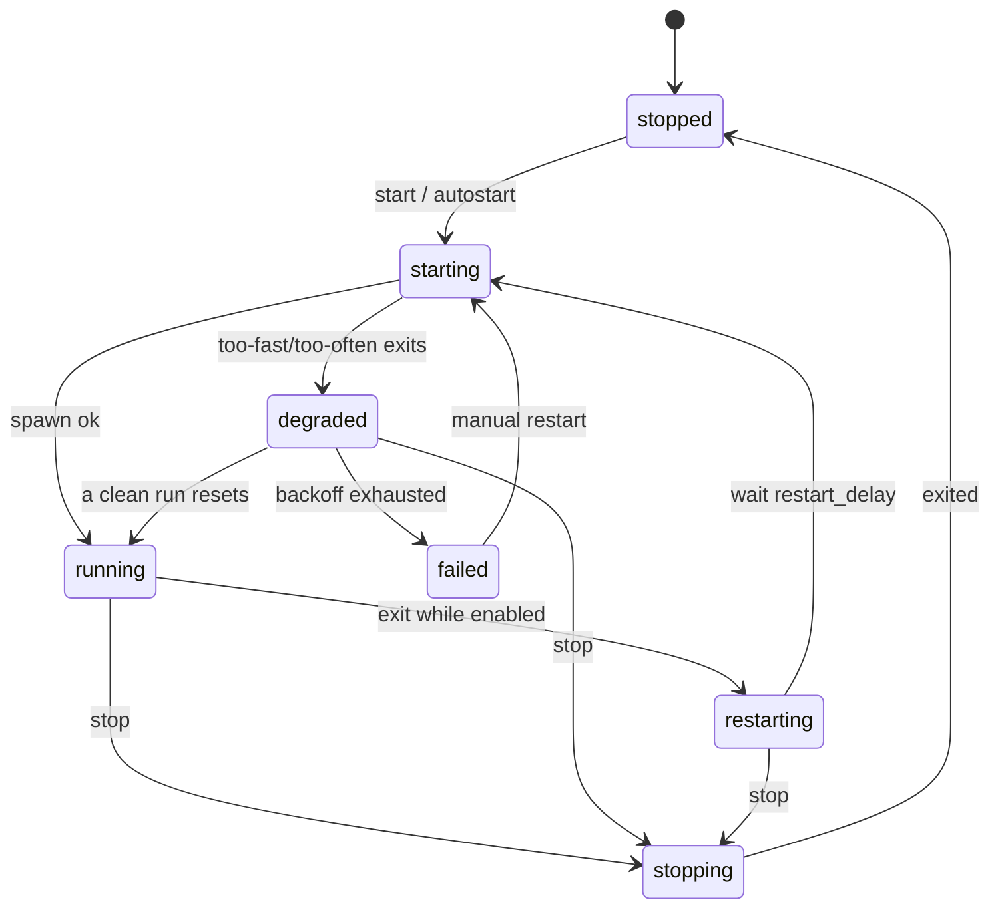

# Design: Harness Lifecycle State Machine

## Context

`zsh-harnessd` had two implicit lifecycle concepts — the systemd unit's
active/failed and an in-pane `while true; …; sleep` restart loop — with no
flapping detection, no backoff, and no distinct degraded/failed states. This
design makes the machine explicit inside the daemon (ADR-0005: the daemon
self-supervises harnesses; systemd/launchd only supervises the daemon).
Governing spec: SPEC-0003. Related: ADR-0006 (config reload semantics),
ADR-0007 (persisted runtime state).

## Goals / Non-Goals

### Goals

- One authoritative state per harness, rendered 1:1 by the TUI (SPEC-0001).
- Crash-loop safety: flapping is detected, backed off, and eventually parked
  as `failed` instead of burning CPU forever.
- Intent (`enabled`) survives daemon restarts via the persisted state file.

### Non-Goals

- Health checks beyond process liveness (no HTTP probes, no output parsing) —
  a harness is "running" if its process is alive.
- Agent-awareness (detecting Claude Code / Crush idle states) — v1 stays a
  generic supervisor; awareness can bolt on later as a detector.

## Decisions

### Supervision lives in one goroutine per harness

**Choice**: Each running harness gets a supervisor goroutine owning its PTY,
exit tracking, and restart timing (ADR-0005 Layer 1).
**Rationale**: Keeps the state machine single-writer; every transition has one
owner, and events fall out of the transition function naturally.

### Clean exits restart too

**Choice**: While `enabled`, exit code 0 restarts just like a crash.
**Rationale**: Harnesses are long-lived by definition (agents, watchers,
REPLs); a clean exit is still "not running when it should be." Disabling is
the way to say "stay down."

## Architecture

`enabled` is orthogonal to the diagram: `stop` sets it false, `start` sets it
true, and exits consult it to choose between `restarting` and `stopped`.

## Key files

Greenfield — no code exists yet. Expected home: a `lifecycle`/`supervisor`
package in the daemon, consumed by the protocol layer (SPEC-0002) for events
and by persistence (ADR-0007) for `state.json`.
